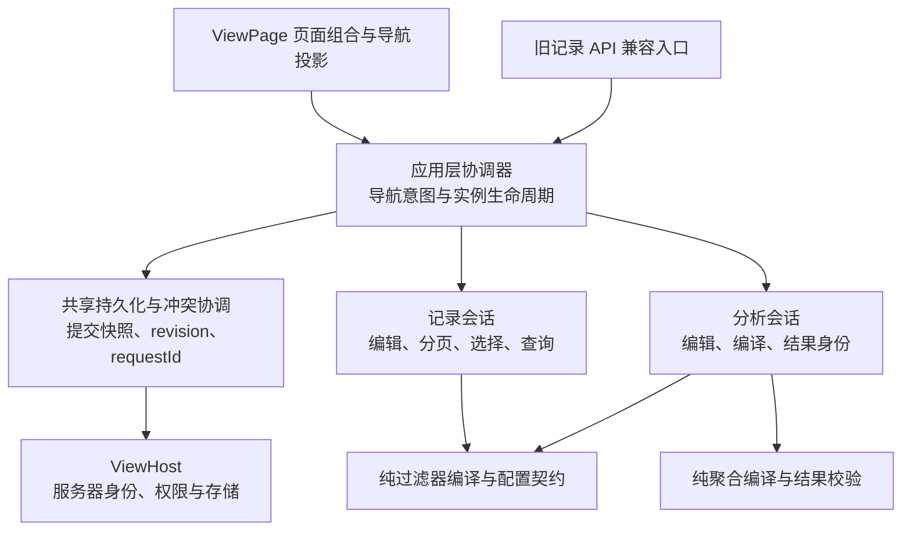

# AnalysisView：架构与产品对抗性审查

日期：2026-09-10。基线：`f01d2dd0`。本轮检查首版规格、宿主契约、加载与冲突恢复实现，并运行两条新的反例。生产源码未修改。

结论：认可“共享实例生命周期、记录与分析独立会话”的方向，但不能直接按当前规格进入全面实现。新增确认两个现有行为与目标产品要求的冲突，以及三个需要落实的契约缺口。上一轮输入丢失问题仍未修复，不在本轮重复计数。

## 1. P1：版本冲突恢复会把未编辑过的远端配置回退

证据：真实 ViewEngine、受控宿主持久化的运行复现。

用户只改视图名称，同事把每页条数从 10 改为 50。第一次保存得到 REVISION_CONFLICT；用户点击“重新加载并保留编辑”，加载到 r2、每页 50；再次保存使用 r2，却提交了旧的每页 10。运行结果证明：CAS 正常工作，但未经用户辨别的远端修改仍被覆盖。

根因在 `packages/view-engine/src/record/engine/sessionState.ts:147`：重新加载只换 baseline，然后把 latest.instance 的整个 title/config 放回去，并清除 requiresReload。对于“本地只改 title”，未改过的 config 也被当作本地修改保留。

架构影响：不能把当前 rebaseSession 原样提为共享恢复策略。分析中的对应场景是同事修改分组/指标，用户仅改名称，最终保存回退同事的统计口径。后者是基于已复现记录行为的分析风险，尚无分析运行时可执行。

产品要求：重新加载只是获得新事实，不代表用户接受覆盖。保留编辑前基线、本地候选和最新远端内容；远端内容变化且本地存在编辑时继续显示冲突。首版提供“使用最新版本”“另存我的配置”，以及有权限且用户明确选择时的“用我的配置覆盖”。覆盖仍必须对已展示的最新 revision 做 CAS，再次冲突重新处理。没有权限的选项不显示。

不要求首版实现通用三方合并编辑器。仅远端 revision 变化而可编辑内容未变时，可安全前移基线；真正内容分歧不能靠更新 revision 自动解除。产品文案必须说明覆盖的是整份配置，而不只是当前改过的名称。

## 2. P1：单个实例语义失效会让整个工作区不可用

证据：真实引擎加载运行复现。列表包含健康实例 healthy，以及引用已移除排序字段 state.retiredAmount 的 stale 实例；默认选择 healthy。engine.load 拒绝，status=error，sessions.healthy 未建立。

现有实现依据当前记录契约对列表整体校验失败，这是确认的基线行为；不能把它直接称为新分析代码回归。与新规格“定义能力变化后保留配置供修复”“不同类型实例独立”的承诺组合后，它成为实现阻塞项。

架构要求：分开列表身份/来源可信性、配置结构、可执行语义三类校验。重复 ID、错误 definitionId、非法归属等身份问题仍按安全边界处理，不用静默跳过掩盖；已确认身份且结构可解释的字段下线、组件缺失、函数不再允许属于实例级阻断。

产品要求：失效实例保留在导航并标注“配置需修复”，其他实例正常打开。默认实例失效时展示它的修复页，并允许用户选择其他实例，不静默改成别的默认统计。修复页提供具体项、修改/移除入口及按权限可用的恢复/另存路径，不能让用户只能反复点击全页重试。

实现约束：阻断实例是单独的模型，不把不合法 config 强断言为可执行 ViewInstance；正常查询与保存 API 只接收通过校验的配置。未知组件不要求具备渲染能力才能保留其名称和原始属性。

## 3. P1：兼容承诺尚未闭合到运行时与返回形状

证据级别：规格契约缺口，未实现因此未运行新 API。

规格同时提出默认 record 泛型、扁平定义在加载边界归一化、内部按 kind 使用联合。两个反例必须解决：

1. 旧消费代码读取 `engine.getSnapshot().definition.rowKey`，内部新定义把它移到 record.rowKey；默认泛型不能自动恢复旧返回形状。
2. 宿主远程 JSON 可以在运行时返回 analysis，TypeScript 泛型已被擦除；仅声明 ViewEngine<'record'> 不能阻止进入分析会话，再调用记录专属操作。

建议：兼容适配留在外层，内部只有一种规范化定义和明确的 record/analysis 会话。引擎必须持有实际的可接纳类型集合，并在所有加载、另存回包、重载和操作入口验证。旧 record 入口默认只接受 record；混合接入显式启用，不能隐式放宽旧宿主。

必须先用三份公开消费样例验证：原记录宿主完全不改、纯分析宿主仅有 aggregate、混合页面同时使用两种实例。检查静态类型与实际返回字段，不能只做内部 tsc 或通过 any。若保留旧返回投影成本过高，应提出明确版本迁移，而不是把兼容细节扩散成全项目泛型与双状态镜像。

这不是要求同时维护两套业务引擎；兼容层只转换契约，不复制查询和持久化逻辑。

## 4. P1：已应用配置与草稿的并行更新仍缺少确定规则

证据级别：规格中的可构造业务反例。

步骤：用户在草稿中增加“月份”维度；随后点击当前结果表的金额排序，规格允许它更新已应用 sort 并保留草稿；再点击“应用”。若草稿是一份完整旧配置快照，旧 sort 会覆盖刚选的新 sort；反过来把已应用 config 整体同步给草稿，则会丢掉新增月份。

同类情况包括请求中修改指标标题、改变列顺序、保存期间继续编辑；笼统的“保留草稿”不足以决定最终配置。

建议：定义四个独立事实：保存基线、当前可保存的已应用配置、编辑草稿、成功结果快照；再定义当前请求与未决写入的提交快照。避免把这些事实分别深拷贝后任意互相覆盖。标题/列宽等展示变更按稳定 ID 更新对应配置，不成为查询身份的一部分。

首版的最小确定交互：有未应用的分析查询草稿时，结果表排序不可用，并提示“先应用或撤销配置修改”；刷新/重试仍针对已应用口径，草稿保留。旧结果与当前查询身份不同也禁止排序。这样一次只有一个查询配置编辑入口，不需要发明自动合并优先级。该建议收紧原先允许草稿与表头排序并行的规则，需纳入设计评审。

状态由内容关系推导：dirty 比较当前可保存配置与保存基线；pending 比较查询草稿与已应用编辑基线并包含输入有效性；旧结果标记比较成功查询身份与当前已应用身份。不能用一个“已编辑”布尔值替代所有关系。

## 5. P2：首个分析实例的入口必须成为宿主接入验收条件

证据级别：产品前置条件未显式验收；不是新增空白实例向导的要求。

规格已明确首个实例由宿主提供，用户只能另存。若使用方给定义加了 analysis 能力，却只返回已有记录实例，最终页面根本没有进入分析的路径。空列表说明“由宿主配置”也不能证明分析能力可被真实用户发现和使用。

保持既定范围：宿主启用分析时至少提供一份可打开的分析初始实例，或一份允许另存的系统分析模板。公共模板需有明确名称、有效默认指标、可解释的统计时区/上限；系统模板不覆盖保存，有权限用户另存个人实例。只有只读权限时仍可查看模板，不伪造创建按钮。

验收使用普通消费应用，从首次打开到选择模板、修改口径、另存、刷新页面后重新打开，完整执行一次；不能仅在 Storybook 预置私有引擎状态后截结果表。没有模板时是宿主配置未完成，应向集成者明确报出，保持已有记录功能可用。

## 6. 建议的职责边界



图表示职责依赖，不要求每个框都增加一个类。共享层可以借助集中在组合入口的两种类型适配完成会话重建与验证，不直接读取 pagination、dimensions、metrics；类型会话不自行创建第二套保存/CAS 逻辑。UI 不直接写 SessionStore，也不承担服务端冲突合并。

维护性验收应问：修改分析指标是否需要改记录查询？修改保存回执校验是否要分别改两个类型？增加一种错误是否要在三个页面重复解释？如果答案是肯定的，分层还没有达到目标。不能仅用目录迁移证明高内聚、低耦合。

## 7. 不应借本轮扩大的范围

- 不增加通用插件引擎、事件总线、状态框架、后台自动保存或通用三方合并 UI。
- 不把没有图表/下钻、首个实例由宿主提供等已确认边界重新列为缺陷。
- 维度/函数许可证明技术可执行性，不保证业务指标口径正确。示例中金额求和必须使用单位一致的数据与准确名称；多币种换算等不由 view-engine 猜测，不宣称格式化能建立业务正确性。
- 上一轮关于输入丢失、缓存失败优先级、动作错绑和相对时间的缺口继续有效；本轮不重复计算为新发现。

## 8. 运行证据与局限

本轮执行：

```sh
pnpm --filter @ahoo-wang/fetcher-view-engine exec vitest run \
  test/engine/architectureProduct.adversarial.test.ts \
  test/engine/reconciliation.test.ts test/engine/unifiedRecovery.test.ts \
  test/engine/allowedOperators.test.ts --coverage.enabled=false
```

结果：4 个文件，3 通过、1 失败；42 个用例，40 通过、2 个反例失败；耗时 1.05 秒，退出码 1。第一条失败证明实际发送的新 revision 携带旧配置；第二条的三个断言证明列表拒绝、页面 error、健康会话缺失。它们是目标要求与现有策略冲突的证据，不意味着新分析代码出现了回归。

测试源码存为 `assets/architecture-product-repro.ts.txt`，按以下方式从仓库根目录复现，临时文件会清理：

```sh
(
  set -e
  repro_path=packages/view-engine/test/engine/architectureProduct.adversarial.test.ts
  test ! -e "$repro_path"
  cp docs/superpowers/reviews/assets/architecture-product-repro.ts.txt "$repro_path"
  trap 'rm "$repro_path"' EXIT
  pnpm --filter @ahoo-wang/fetcher-view-engine exec vitest run test/engine/architectureProduct.adversarial.test.ts --coverage.enabled=false
)
```

本轮未运行全量单测、浏览器、真实后端或拟议 API 的类型消费验证。报告不将前三轮的测试数量相加，也不把设计推演标成运行验证。暂不修改生产代码或提交；修正规格后，按“公共契约样例 → 状态/恢复规则 → 混合页面用户闭环”进入实施规划。
