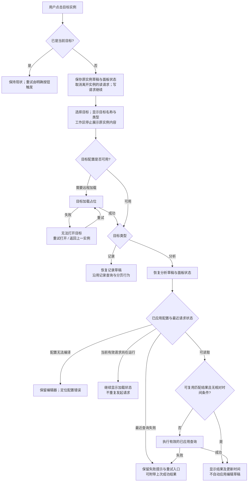
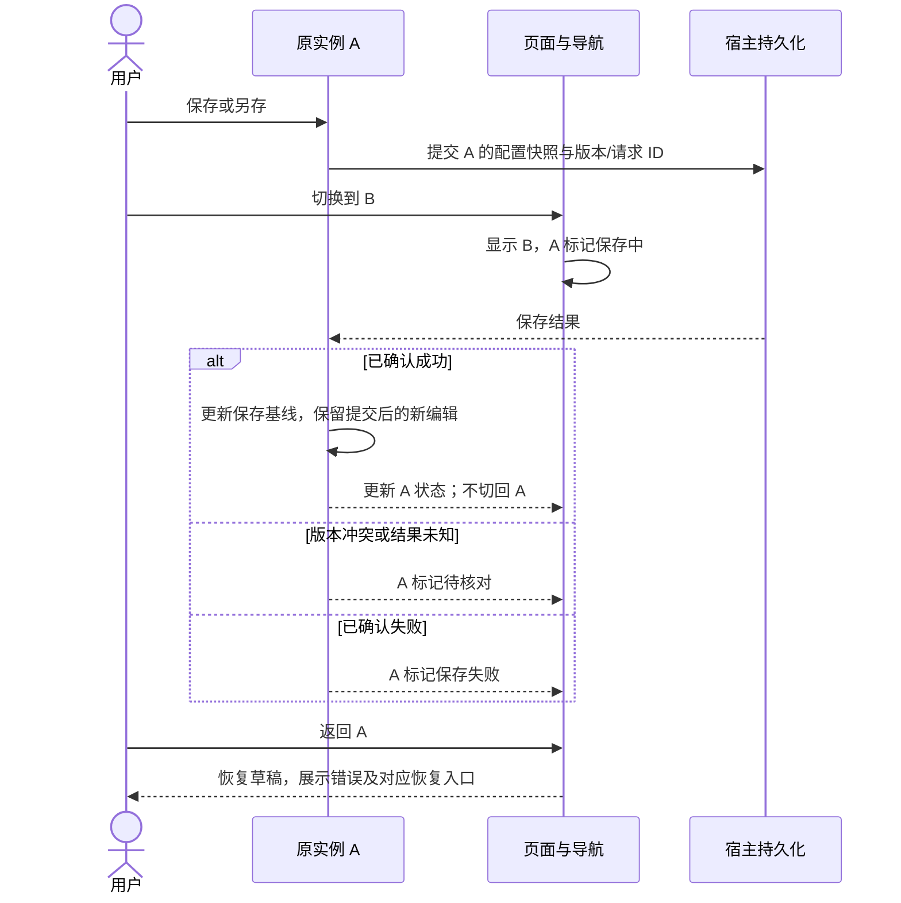

# 记录与分析实例切换：交互可行性评估

日期：2026-09-10。对象：同一 ViewPage 中 record/analysis 的拟议交互。结论：可行，但需补齐状态归属、恢复范围和错误入口，不能只替换主体组件。

本次是设计与源码静态评估，分析视图尚未实现。检查了当前导航、查询、保存和编辑状态实现及相关测试源码；未启动浏览器、未运行测试，不能作为已实现产品的视觉、可访问性或运行验收。本文中的调整是评估建议，尚未修改功能代码。

## 1. 用户能否理解

同一业务定义下的实例可以混合导航。用户点击的是“订单明细”“按月销售额”等命名实例，每次打开一份独立配置；不会把记录筛选自动传入分析。页面组合是可选能力，RecordView 和 AnalysisView 仍可由宿主独立布局。

沿用个人视图/公共视图两个分组；系统是公共实例的来源标记，不是第三组。每项展示实例名、记录/分析类型文字，并根据需要展示系统标记与状态。类型图标辅助识别，不能是唯一可访问名称。不增加 record/analysis 模式开关，也不再按类型嵌套一级导航。

宽屏侧栏和窄屏/收起后的下拉选择器消费同一导航投影，包括选中状态、类型和错误。移动端选择后关闭菜单，焦点回选择器并播报当前实例；侧栏选择后保留按钮焦点，提供跳转工作区的键盘入口。异步完成不抢焦点。

## 2. 需要修正的承诺

| 原描述/风险                        | 当前证据                                                                                                 | 建议                                                                                                                               |
| ---------------------------------- | -------------------------------------------------------------------------------------------------------- | ---------------------------------------------------------------------------------------------------------------------------------- |
| 切回任何实例都不请求，直接恢复结果 | ViewLoader 切换后调用 RecordQueries.followUp，默认 run 会重查并清空选择；navigation 测试明确预期三次查询 | 记录保持既有切回查询行为；分析复用本引擎会话中的成功结果，显示更新时间，用户可刷新。两者都保留配置草稿，但不承诺相同的数据刷新策略 |
| 恢复全部界面状态                   | ViewPageContent 使用 key=id 重挂载 RecordView；filtersOpen 和编辑器错误映射是局部 state                  | 明确保留配置、原始输入、有效性及主要面板展开状态；菜单/日期弹层关闭，焦点与任意宿主组件私有 state 不承诺恢复                       |
| 目标加载失败后保持目标选中         | 现有未知实例要等 instance.load 成功才更新 selectedInstanceId，失败使用页面级 error                       | 已在列表内的完整实例可立即切换；远程未知 ID 需要单独的 openingId/打开错误状态，标题、加载占位与目标一致，不显示旧主体              |
| 保存失败在后台也能被看见           | 会话有 writeError，但导航只展示 dirty/filterPending 和系统标记                                           | 增加“保存中”“保存失败”“待核对”导航状态；当前工作区显示属于自己的详细错误                                                           |
| 离开页面会提醒未保存修改           | 当前未发现通用路由拦截或 beforeunload 接入                                                               | ViewPage 内切换不拦截；全页离开由宿主接入聚合的未应用/未保存/写入未决状态，不能承诺库自动拦截任意路由                              |

证据位置：`src/record/engine/ViewLoader.ts:197`、`RecordQueries.ts:95`、`page/ViewPageContent.tsx:229`、`RecordView.tsx:77`、`page/ViewNavigation.tsx:28`、`filter/useFilterPanelEditors.ts:35`，均相对 `packages/view-engine/`。`test/engine/navigation.test.ts` 和 `test/engine/saveAs.test.ts` 是测试定义证据，本轮没有执行。

## 3. 切换流程图

openingId 仅用于确实需要远程加载的目标，不把不完整对象伪装成业务会话。当前 list 返回完整实例的普通侧栏切换不额外调用 instance.load。请求响应只能更新其绑定目标且仍有效的请求；A→B→C 快速点击后，B 的迟到加载、错误、查询均不能抢回 C。

对抗审查补充：目标正在打开或打开失败时，页面 activeSession 为 null，不显示可操作的保存/恢复/删除等实例动作。配置验证成功后，目标标题、会话、权限及动作上下文一起生效，不能在 B 标题下操作仍由 A 提供的会话。

分析结果如果不匹配最新已应用口径，只能作为“上次成功结果”显示，并与它自己的 schema、条件摘要及时间绑定。最新请求失败时切回保留错误，等待重试；请求因切换取消时，切回可重新执行已应用配置。不能因存在任意 rows 就判断缓存有效。

旧结果与当前统计身份不同则表头排序不可用；查询必须从当前口径工具栏触发。相对时间条件在回访时重新执行，避免跨日后把昨天的 TODAY 结果作为当前结果。上图已调整为先判断最近请求状态再决定缓存展示，缓存不能遮蔽刷新失败。

取消只意味着本地不再等待并请求中止，不能据此宣称服务器聚合已停止。导航不等待旧请求完成。

## 4. 草稿与界面保留范围

| 状态                                            | 切换时处理                            | 生命周期与所有者                        |
| ----------------------------------------------- | ------------------------------------- | --------------------------------------- |
| 筛选、维度、指标及未完成的原始输入              | 保留；不自动应用、不自动保存          | 类型专属会话，按实例 ID                 |
| 当前已应用配置、成功结果/schema、更新时间       | 共同保留；查询策略由记录/分析各自实现 | 类型专属会话                            |
| 保存状态、版本冲突、未知写入结果                | 继续维护，显示导航反馈                | 共享实例生命周期                        |
| 主要配置面板的展开/收起                         | 按实例恢复                            | 页面级 UI 状态表；不参与 dirty 或持久化 |
| 下拉、Popover、确认对话框                       | 关闭                                  | 当前组件局部状态                        |
| 记录行勾选                                      | 沿用当前切回重查后的清空行为          | 记录会话                                |
| 任意第三方组件未上报的 useState、焦点及滚动位置 | 首版不承诺恢复                        | 不建立通用组件保活机制                  |

原始输入必须在每次变更时进入可恢复草稿，不能仅靠 onBlur 或成功解析后才提交；否则“输入一半 → 切走 → 切回”会丢内容。内置编辑器及扩展注册约定都需覆盖这一行为。有效性优先从草稿重算；确有不能重算的编辑错误状态按实例保留，不能用卸载/重新挂载清掉问题并误报有效。

不通过把所有视图永久挂在隐藏 DOM 中保活实现恢复，以免隐藏页面继续轮询、保留焦点节点或扩大内存使用。会话生命周期限于当前引擎访问范围，刷新浏览器后恢复的是已保存配置，不是内存草稿。

## 5. 后台保存流程

原实例仍被选中且没有更新的导航意图时，另存成功可按现有行为进入新副本；用户已切换后，只添加副本，不改变当前选择。普通保存始终留在当前选择。

对于已确认失败提供明确重试；版本冲突先重新加载核对并保留编辑，未知创建结果复用原 requestId 核对，不能统一显示“再保存一次”。关闭浏览器可能中断客户端，但不证明服务器写入失败。

导航状态分为独立的“内容有修改”和“操作状态”，不能把保存中、修改中、查询中压成互斥单状态。紧凑展示可优先显示待核对/保存失败，其次保存中，再显示未应用/未保存；辅助名称保留完整状态。下拉收起时，若非当前实例存在写入失败或待核对，触发器显示可访问的待处理数量，使错误仍可发现；不单靠瞬时 toast。

## 6. 错误与动作矩阵

| 场景                     | 工作区内容                             | 可执行动作                                           |
| ------------------------ | -------------------------------------- | ---------------------------------------------------- |
| 正在加载目标配置         | 目标标题、加载占位；不混入上一实例结果 | 切换到其他实例                                       |
| 目标不存在/无访问权限    | 目标错误页，不假装进入有效会话         | 重试打开、返回上一实例；不能仅凭一次错误删除导航条目 |
| 分析组件缺失/配置无效    | 配置原文对应的编辑项与定位错误         | 修复或移除问题项，切换仍可用                         |
| 分析首次查询失败         | 配置保留、结果区错误                   | 重试查询、修改后应用                                 |
| 新口径失败但有旧成功结果 | 新口径错误与明确标注的旧结果           | 重试；旧结果只按旧 schema 解释                       |
| 非当前实例保存失败       | 当前工作区保持；原实例导航反馈         | 返回原实例处理                                       |
| 权限收紧                 | 当前实例显示最新可用操作               | 写操作重新检查，不能用旧回调绕过                     |
| 用户/租户访问范围改变    | 原引擎销毁，重建定义、权限与会话       | 不跨访问范围保留草稿或结果                           |

## 7. 实施与验收优先级

先处理共享生命周期对 RecordQueries/RecordSession 的依赖，再实现类型专属会话与页面分派。界面状态缓存限于主要面板和可恢复编辑数据，导航投影集中计算。以上均可利用现有状态订阅、取消令牌、实例写入核对与 Base UI 组件，不需要新的路由、缓存或状态管理依赖。

实现后必须用可控延迟/失败宿主和真实浏览器验证以下流程，再声明交互验收通过：

1. 记录 A 编辑未应用条件 → 分析 B → 返回 A：原始输入与错误不丢，记录重查行为符合既有约定。
2. 分析 A 修改维度但不应用 → 记录 B → 返回 A：恢复草稿，成功结果仍显示原口径。
3. 远程 A→B→C 连续选择，B 后返回或报错：标题、选中项、主体始终由 C 的导航意图控制。
4. 分析查询中切走，之后服务器仍返回：不更新其他实例；返回时可恢复或重新查询。
5. A 保存中切到 B，A 成功/失败/版本冲突：不抢页面，窄屏也能发现待处理状态。
6. 新分析口径失败并保留旧结果：列名、schema、条件摘要不混用。
7. 键盘完成侧栏与下拉切换，页面异步更新不抢焦点，读屏能识别类型和状态。
8. 刷新或离开页面：验证宿主离开提示，明确内存草稿与持久化实例的边界。

依赖尚未安装，上一阶段 `pnpm test:unit` 因缺少 vitest 未能执行；本轮没有重复运行同一受阻检查，也没有修改运行代码。文档经静态自审，图示为拟议行为，不是运行截图。

后续进展：同日对抗性验证已安装锁定依赖并运行针对性检查，47 个既有用例通过、1 个新增反例失败。上述环境说明仅描述本报告初次评估阶段；新的证据、未修复缺陷与规格修订见 [对抗性验证报告](2026-09-10-view-switching-adversarial.md)。
