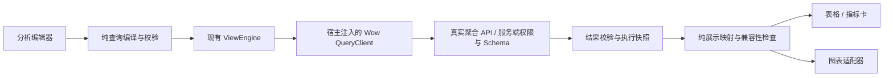

# 分析视图 API 与可视化：现状审查

日期：2026-09-11。范围：Fetcher 当前工作区、本地 Wow 源码 `/Users/ahoo/work/ahoo-git/Wow`（HEAD `9d1545633`）与当前浏览器页面。该 Wow checkout 的能力不等于待接入服务的部署版本；后者仍需通过实际 OpenAPI、Schema 和返回值验证。

## 1. 已核实的查询合同

统计流程为：根过滤 → 可选有序 Elements 展开链 → 分组 → 指标 → 别名排序 → 返回上限。

| 能力                      | 语义与产品影响                                                                                              |
| ------------------------- | ----------------------------------------------------------------------------------------------------------- |
| Snapshot / EventStream    | 当前快照与历史事件是不同事实来源；不能把当前状态分组称为历史业务趋势。                                      |
| Elements                  | 从外向内的父子展开链。COUNT 的统计对象变为最内层元素；展开后字段相对元素，不再沿用根字段路径。              |
| TERMS                     | 分类分组，适合比较；字段必须有实际后端分组能力。                                                            |
| HISTOGRAM                 | 正有限间隔的数值分桶，适合分布图；不能把不等距桶当作普通等距分类。                                          |
| DATE_HISTOGRAM            | 年、季度、月、周、日、时、分、秒与时区；按实际桶起点排序和显示，不按格式化文字排序。                        |
| COUNT                     | 当前统计单位的数量，不等于某数值字段的有效样本数。                                                          |
| SUM / AVG / MIN / MAX     | 数值贡献遵循 Schema 与后端合同；空有效样本为 null，不能统一显示为 0。                                       |
| FIELD / CONSTANT / BINARY | 支持受约束的算术表达式；不能用 eval。逐记录表达式的 AVG 与聚合后相除不是同一指标。                          |
| ANY                       | 非确定性的代表字段值，不能用作稳定序列标识或分类 key。                                                      |
| sort / limit              | 排序引用 alias，无分组不可排序；默认 limit 100、最大 10000。达到 limit 不证明结果完整，也不能推断全量总计。 |
| JSON / SSE                | 两种传输均已在客户端出现。默认完整 JSON 原子发布结果；若接 SSE，须区分部分结果与完成状态。                  |

后端结构上限：Elements 5、groups 32、metrics 64、有效 sorts 32，表达式 depth 8 / nodes 256。产品可以设更小的交互预算，但不能超出后端合同。

空输入且无分组时产生一行汇总：COUNT=0，ANY 与数值指标为 null；有分组的空输入无结果行。禁止对已经聚合的 AVG 再做平均，也不应把截断后的各组 SUM 展示成全局总额。

源码依据：

- Wow `wow-api/.../query/AggregationQuery.kt`：AST、别名、上限、有效排序。
- Wow `documentation/docs/zh/guide/query/aggregation-query.md`：统计单位、数值贡献、空结果与精度合同。
- Wow `wow-webflux/.../route/snapshot/SnapshotAggregationHandlerFunction.kt`：请求反序列化、作用域、HTTP guard 与 gateway。
- Wow `wow-mongo/.../query/aggregation/MongoAggregationCompiler.kt`：日期桶转换为 epoch milliseconds；仍需验证目标服务与后端。
- Fetcher `packages/wow/src/query/queryApi.ts`、`snapshot/snapshotQueryClient.ts`、`event/eventStreamQueryClient.ts`：现有 aggregate / aggregateStream 客户端。

## 2. 当前接入缺口

- `AnalysisCommands.run` 已经通过 `ViewHost.resolveSource(...).aggregate(...)` 执行，支持取消与结果校验。
- `SnapshotQueryClient` / `EventStreamQueryClient` 已提供 HTTP 实现，应复用其认证、路径和拦截器体系。
- 当前 `Analysis.stories.tsx` 绑定内存数组和 `createOrderSource`。它证明页面/查询编译链路，不证明真实 Wow 服务接入。
- 当前 AnalysisViewConfig 仅有 filters、dimensions、metrics、sort、limit 和 table presentation；没有 Elements、表达式指标的完整配置入口或图表映射。
- 编译器要求 NUMERIC 绑定同一字段的 FIELD 表达式；不能直接把现有配置描述为支持所有 Wow 数值表达式。
- 目标服务地址、业务模型、OpenAPI 与部署版本待用户提供。不得猜测租户/所有者路径，也不能仅凭 TS 接口推定权限或 Schema 能力。

## 3. 当前页面审查

仅检查当前页面的两个状态，没有提交查询、保存或改动用户的分析配置。折叠状态已恢复。截图不构成完整无障碍认证。

1. **配置展开：功能可读，但结果优先级低。** 维度/指标卡片横跨宽容器，字段信息集中在左侧；大面积配置区域挤占结果空间。业务命名与技术聚合类型混杂。应把统计对象、筛选、维度、指标按业务顺序分组，并保持结果区域可见。
2. **配置收起：结果易读，但缺少口径摘要。** 表格显示地区与订单数、接收时间；收起后不能就地看到完整的来源、筛选、统计单位和返回上限，也没有图形展示入口。应常驻执行口径摘要、展示类型选择和数据明细入口。

截图来自本轮实际 in-app Browser：

## 4. 推荐的实施边界（待设计确认）

保留单一 ViewEngine 和实例生命周期；新增纯展示映射层，图表库只消费已验证结果，不构造查询、不访问 API、不再次聚合结果。

- 查询配置与展示配置分别校验。切换图表或修改配色/轴映射不重发聚合请求。
- alias 作为字段映射和序列身份；显示标题可改而不影响查询。
- 0 个维度：指标卡与表格；分类维度：柱/条形图；时间维度：折线/面积图；数值桶：直方分布；类别+时间：分系列折线或分面图。
- 环图仅用于合理的非负、同单位、有限类别占比，明确“已返回结果内占比”；不能暗示为全量占比。
- 多维不能被静默压成一维。要求选择 x/series，或明确分面；不支持的组合显示原因并保留表格。
- 不自动连接缺失时间桶；不把 null 补成 0；不同单位不默认堆叠；不在浏览器合并 AVG。显示 limit 与可能不完整状态。
- 桌面采用紧凑配置区与常驻结果区；窄屏配置抽屉。保留运行/保存独立、旧结果来源、错误恢复和键盘访问。
- 默认提供内置图表，另留展示扩展入口。仅给宿主渲染插槽也可减少库依赖，但会把一致的图表行为和验收成本分散到各应用。
- 建议评估 Apache ECharts 的按需模块接入；需新增依赖审批，并实测产物大小、挂载/释放、响应式、主题及可访问的表格替代。

图表库资料（官方）：[按需导入](https://echarts.apache.org/handbook/en/basics/import/)、[Dataset 映射](https://echarts.apache.org/handbook/en/concepts/dataset/)、[ARIA 与纹理](https://echarts.apache.org/handbook/en/best-practices/aria/)。ARIA 选项本身不等于完整键盘与屏幕阅读器验收。

## 5. 交付验收

- 真实客户端请求体/路径/认证和取消的 HTTP 集成测试；目标服务的 Snapshot/Elements、COUNT/NUMERIC、时间桶、排序与 limit 实测。
- 每一种展示的纯映射反例测试，覆盖 0/null/空结果、重复标签、不同单位、多系列缺失点、截断、时区和大数精度。
- 运行与保存独立，切换展示不查库，编辑草稿不污染已有图形结果，过期回包不能覆盖新结果。
- 真实浏览器验证桌面/窄屏、深浅色、键盘、tooltip/legend、图形与明细一致性、错误/超时/无权限和生命周期清理。
- 构建、单元/编译模式、NodeNext/Bundler 打包消费及双语文档通过；真实服务证据与本地示例证据分别记录。
