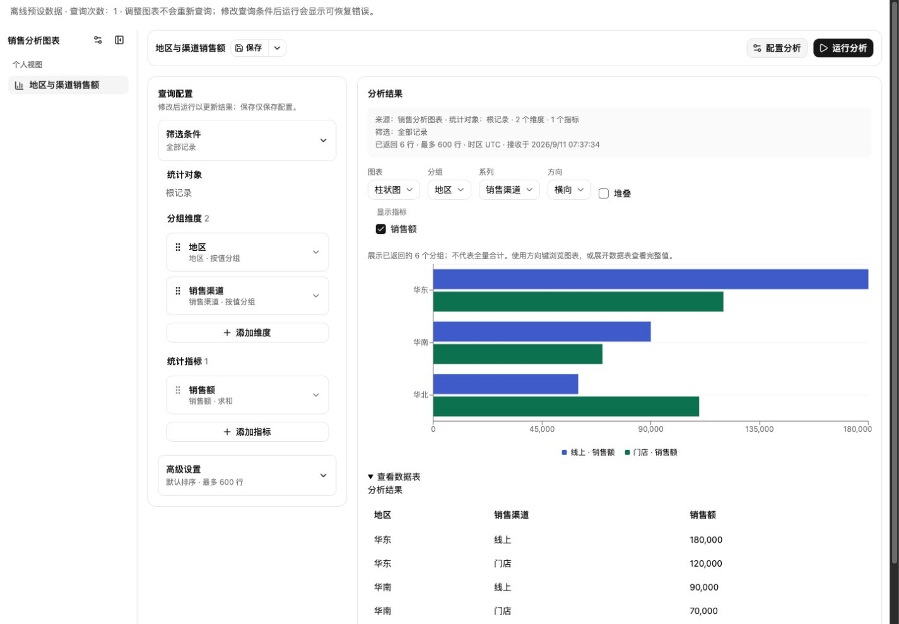

# 分析视图配置重做与交付审查

日期：2026-09-11。范围：当前工作区的分析配置、视图导航、图表展示设置及相关功能回归。以下使用本轮代码、实际浏览器操作和新截图；不是宿主部署或权限验收。

## 验收标准

测试通过是必要条件，不能代替体验判断。本轮按以下条件检查：

- 默认界面能读清当前筛选、分组和指标，不要求先滚动浏览所有详细表单。
- 常用操作可发现；详细设置按需展开，不丢失草稿；新增及无效条目可编辑。
- 标题、标签、间距和响应式布局一致；内嵌容器不能按整个窗口宽度硬塞双栏。
- 保存与运行分离，过期结果不冒充当前配置，错误可恢复，展示修改不额外查询。
- 键盘可操作，关闭对话框返回原入口；不得通过隐藏错误或放宽性能预算达标。

## 确认的问题与修改

| 问题                                                                    | 处理                                                                                                                             |
| ----------------------------------------------------------------------- | -------------------------------------------------------------------------------------------------------------------------------- |
| 所有维度、指标字段同时展开，重复“维度 1 字段/类型/名称”，长表单主次不分 | 默认显示名称与配置摘要，每组展开一个正常条目；详细编辑使用固定单列，显示标签简化为字段、类型、函数、显示名称，保留完整无障碍名称 |
| 新增和失效条目容易被折叠掩盖                                            | 新增条目自动展开；关联校验错误的条目保持可见；折叠不卸载已有输入，不清除配置                                                     |
| 筛选、排序和行数占据初始页面，缺少层级                                  | 筛选独立折叠并显示摘要；排序和行数进入高级设置，摘要保留当前排序数量与上限；无效行数展开修正入口                                 |
| 只有根记录时仍显示无可选项的选择器                                      | 显示静态统计对象；宿主提供元素范围时继续显示选择器                                                                               |
| 内嵌面板宽度不足，却按窗口宽度显示双栏                                  | ResizeObserver 监听实际分析工作区，低于 880px 时使用配置对话框；宽屏配置栏 20rem，结果保留剩余空间；移动窗口仍使用对话框         |
| 侧栏与工作区标题/选择器重复                                             | 导航断点统一指向命名 ViewPage 容器，不再被内部分析容器截获                                                                       |
| 图表设置只显示值，不易区分其用途                                        | 增加图表、分组、系列、方向及显示指标的可见标签                                                                                   |
| 手机弹窗重复标题、说明和段落留白                                        | 弹窗只保留自身标题与说明，配置正文统一段落间距，底部主操作保持可达                                                               |

此次复用原生 details/summary、既有 shadcn 控件和现有引擎；没有新增依赖、配置协议或查询路径。重命名、删除保留在展开后的条目编辑区。既有公式、自定义编辑器、元素过滤和拖动/键盘排序继续复用原实现。

## 当前浏览器证据

1. **桌面摘要与结果：通过。** 1440×1000 下两个分组、一个指标和高级设置可读；导航不再重复标题，图表控件带可见标签。

2. **手机配置：通过。** 390×844 下保留一个标题、筛选摘要、分组和指标；正文内部滚动，运行与查看结果固定在底部。没有将所有详细表单一次性展开。

3. **新增、改名、折叠和删除：通过。** 点击添加指标会展开新条目；将新指标改为“订单数”，收起后使用真实键盘 Enter 重新打开，名称仍保留；删除后恢复原配置。过程中查询计数保持 1。

4. **窄嵌入与键盘：通过。** 宽窗口中的 850px 容器使用配置对话框；真实 Enter 可展开摘要，Escape 关闭后返回配置入口。不会因窗口够宽而强行显示窄侧栏表单。

## 自动验证

- 新增单测先复现摘要折叠行为缺失和容器宽度判断缺失，再修复；对既有测试改用具体结果区域断言，避免摘要标题与结果同名造成误判。
- view-engine 普通和 React Compiler 模式各 **1,209 passed、1 skipped**；跳过的是显式 opt-in dev 联调。TypeScript 通过。
- 全量 Storybook **350 passed**，88 个文件通过、2 个既有文件跳过。覆盖记录/分析切换、保存恢复、查询/展示分离、错误重试、NULL/0/单位/图表回退、暗色、200% CSS 缩放、键盘和现有 axe 断言。
- 新增窄嵌入场景检查实际对话框、条目互斥展开、Escape 焦点返回；多系列场景增加摘要编辑/收起/恢复不丢草稿及重复导航标题回归。原生 summary 的 Enter 另外用 in-app Browser 实测，未将合成键盘事件当作浏览器默认行为的证明。
- 包及 Storybook 构建、导航校验、ESLint、格式检查和双语 wiki 构建通过。

一次构建与测试并行导致 Wow dist 短暂不存在，已确认是构建时序问题；之后等待构建完成再执行完整包验证，通过后才采纳为本轮证据。

日志：`/tmp/fetcher-config-delivery-package.log`、`/tmp/fetcher-config-delivery-browser.log`、`/tmp/fetcher-config-delivery-build.log`、`/tmp/fetcher-config-delivery-lint.log`、`/tmp/fetcher-config-wiki.log`。

## 生产构建运行验证

静态 Storybook 在 Apple M4 Pro、Chrome 153、1440×1000 下通过完整 readiness 验证，无页面错误。100 字段、20 个过滤项、100 行场景：输入 P95 **40.5ms**，缓存实例切换 P95 **80.3ms**，仍满足原定 50ms/100ms 预算，查询计数 2→2。万行×21 列实验保留 45 字符输入，取消被观察到，迟到响应未覆盖原结果。完整 [原始证据](assets/analysis-config-redesign/readiness.json) 同时记录共享记录界面的浅/深色、窄屏、焦点、故障恢复和 20 次挂载释放检查。

性能场景先通过实际摘要控件展开待测编辑区，之后才计时；折叠层级与旧版不同，因此不将本次数值与旧版作相对性能提升结论。此结果只覆盖记录的设备、数据规模和无网络热态操作，不外推为生产网络时延。临时静态服务器在验证后关闭。

界限：手机为浏览器视口模拟，未以实体软键盘和完整屏幕阅读器流程认证。截图和自动无障碍断言不等于完整 WCAG 合规。当前评审结论限定于上述分析视图交付范围。
