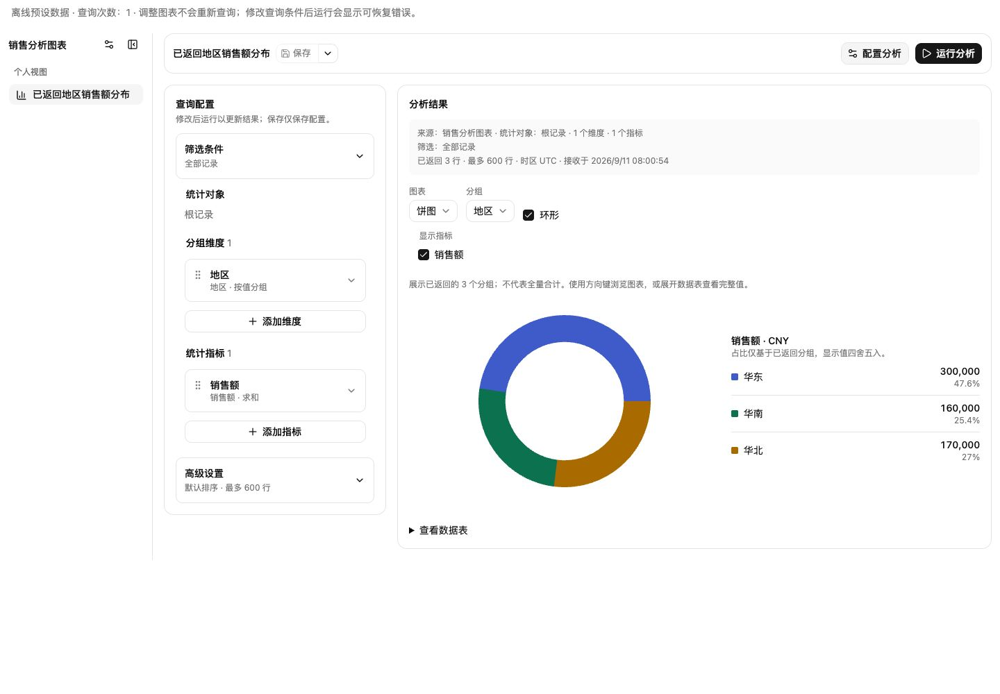
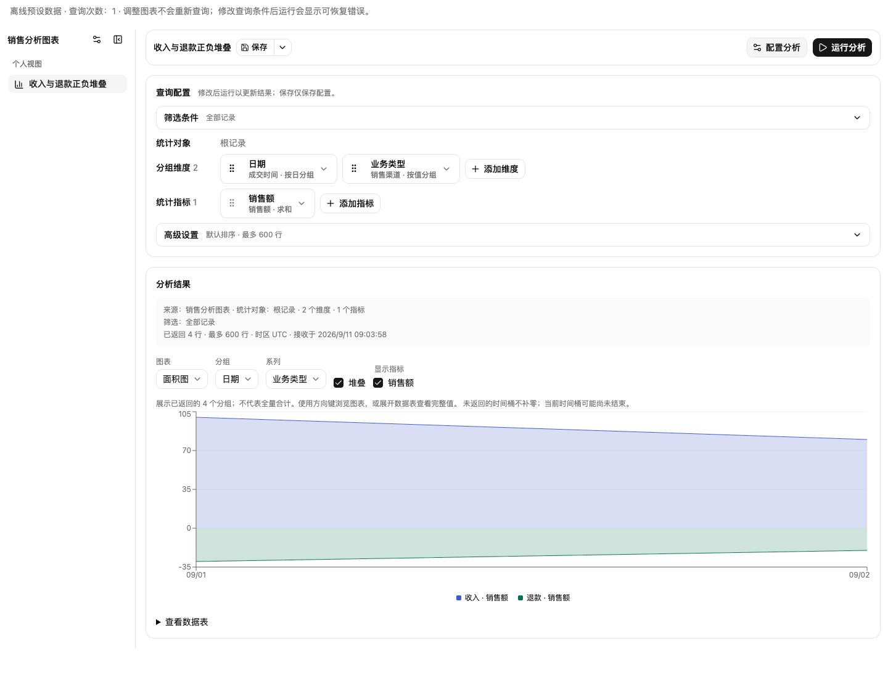
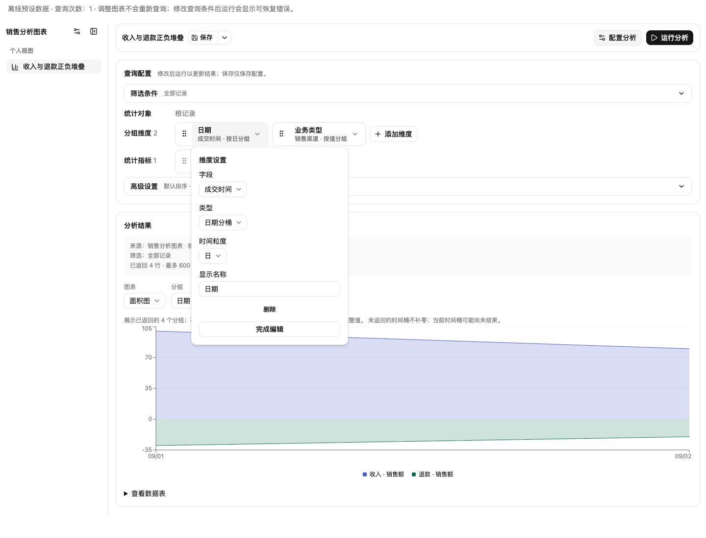
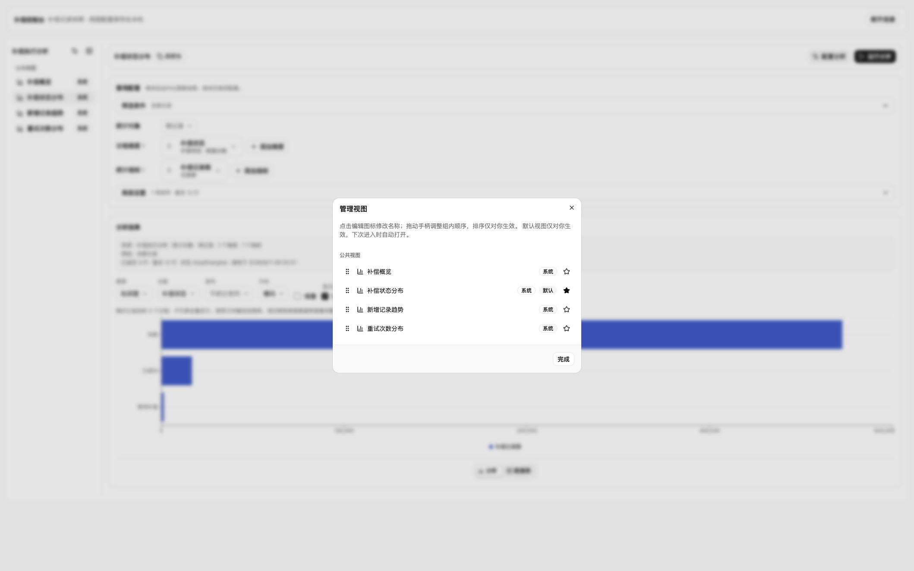

# 分析视图交付验证

配置交互重做见 [分析配置重做验收](2026-09-11-analysis-configuration-redesign.md)；之后的独立复审及修复见本文末“第一性原理独立复审”。以下各节保留对应阶段记录。

日期：2026-09-11。工作区基线：`0215a020`；包含此前已授权的共享引擎和 NodeNext 改动。本记录描述当前工作区验证，不表示已经提交、发布或通过生产环境准入。

## 实现边界

- Wow Schema → 字段/聚合能力适配；不发布 masked、类型不明或没有对应能力的字段。合法枚举保留原始值并提供显示选项。
- 查询配置 → `compileAnalysis` → 原有 Wow QueryClient → 完整结果校验。支持 COUNT、SUM/AVG/MIN/MAX、ANY、数值表达式、terms/数值/日期分桶、预定义多层元素范围和各层过滤。
- 展示配置 → 纯投影 → shadcn Chart/Recharts。指标卡、表格、纵向/横向柱状图、折线、面积、饼/环形，以及适用情况下的多系列和堆叠。
- 图表按需加载。更换图形、方向、显示指标和本地数据表分页不重新查询。保存和运行相互独立；旧结果始终保留自己的查询口径。
- 补偿业务名称、模板、服务地址及授权 Fetcher 留在应用示例；通用引擎不依赖补偿业务。示例只将个人视图配置存于 IndexedDB。

## 对抗性修复

1. 缺失值不能被 Recharts 堆叠自动当作零；此情形显示解释并回退表格。全零饼图同样解释，不显示空白图。
2. AVG/MIN/MAX/ANY 不作为可加指标堆叠或计算占比；单位不兼容、未展示的额外维度、超出图形容量均解释回退，不静默合并数据。
3. 原始 typed tuple/series identity 不受同名标签影响；COUNT 使用安全整数检查，格式化仅作用于显示。
4. 展示 alias 失效不再阻断恢复后的自动查询；无效展示仍阻止保存。查询超时保留旧结果，迟到响应不能覆盖新状态。
5. 根过滤及各层元素过滤分别维护编辑有效性；根过滤有效不能覆盖元素的无效/未提交输入。切范围、切实例会释放旧编辑状态；扩展编辑器收到宿主上下文。
6. 修复 heading 层级、嵌套 complementary landmark 和窄屏筛选控件溢出。日期轴使用紧凑标签，tooltip/数据表保留完整值，并提示当前时间桶可能尚未结束。

## 真实 dev 验证

通过 `linyi-k8s/dev` 的 `compensation-service` 进行临时 localhost port-forward。路由来自当前 OpenAPI，字段来自当前 Schema；仅执行以下读取：

- GET `/execution_failed/snapshot/schema`、`/execution_failed/event/schema`
- POST `/execution_failed/snapshot/aggregation`、`/execution_failed/event/aggregation`

端到端经过实际 Schema 适配、模板编译和 Wow SDK：快照概览 1 行、状态 3 组、日期趋势 31 桶、重试次数 14 桶、数值表达式 1 行；事件流概览 1 行、趋势 31 桶、展开 body 后事件类型 7 组。全部结果通过 schema 校验。

根快照 COUNT 是补偿记录数；根事件 COUNT 是事件流批次数；body 范围 COUNT 是事件条数。测试不假设不同请求属于同一数据库快照，不对正在变化的数据作跨请求强相等断言。

浏览器实际验证了 API 连接、实例切换、状态中文标签、概览指标、日期趋势、事件展开数据表，以及 390px 配置对话框。没有读取失败事件原始载荷，没有调用重试/恢复、Schema refresh 或集群写操作。

复现方法见 `packages/view-engine/examples/react/compensation/README.md`。临时 port-forward 验证后关闭。

## 自动化验证

| 检查                                                     | 结果                                                                                                                   |
| -------------------------------------------------------- | ---------------------------------------------------------------------------------------------------------------------- |
| `VITEST_MAX_WORKERS=4 pnpm test:unit`                    | 所有受根脚本管理的包通过；view-engine 普通模式与 React Compiler 模式各 1,195 passed、1 个默认不启用的 dev 测试 skipped |
| `VIEW_ENGINE_BROWSER_CHANNEL=chrome pnpm test:storybook` | 347 passed；88 个测试文件 passed、2 个既有文件 skipped                                                                 |
| 显式启用 `COMPENSATION_DEV_URL` 的连接测试               | 4 passed，覆盖本地 HTTP fixture/授权传递/取消/失败及真实 dev 查询                                                      |
| view-engine 构建与 ESLint、Storybook ESLint              | 通过                                                                                                                   |
| `node packages/view-engine/scripts/verify-package.mjs`   | strict NodeNext、20 个 React 示例模块、11 个公共目标、359 个打包文件及共享核心运行时通过                               |
| `pnpm --dir wiki build`                                  | 双语文档、符号索引和站点构建通过                                                                                       |

本轮根测试输出：`/tmp/fetcher-completion-final-unit.log`；最终浏览器输出：`/tmp/fetcher-completion-final-browser.log`；dev 输出：`/tmp/fetcher-compensation-final-live.log`；打包输出：`/tmp/fetcher-completion-final-package.log`。浏览器截图位于 `/tmp/fetcher-analysis-delivery/`。

可交付本地实现与 dev 集成已验证。生产认证部署、生产流量和长期运行不在本次验证范围内。

## 完整目标复核补充

对照 `2026-09-10-view-engine-production-contracts.md` 的完整验收要求，本轮补齐以下证据并修复实际发现的问题：

- 中英文包 README 已更新所有图形类型、查询/展示分层、Schema 适配、元素范围、表达式、ANY、格式化和真实 API 示例；移除“schema 跟随展示排序”的旧描述。
- 新增深色实际 SVG 颜色断言、保存 line→area 后重建引擎恢复图形/轴/系列的闭环，以及 200% CSS 缩放与中英文长标题场景。
- 深色实测发现 Recharts 3.10 的 tick class 已改变，原选择器未生效；已直接匹配 tick-value。属性颜色选择器补齐引号，避免构建器丢弃网格和光标规则。长标题由共享 Select 的宽度约束和实例标题省略解决，不靠隐藏页面溢出。最终全量回归同时捕获并修复了未选实例时的占位文字回归，空状态与导航专项 8 项通过。
- 新增 `AnalysisPerformance.stories.tsx`；原始生产构建样本见 [输入/切换](assets/2026-09-11-analysis-performance.json) 和 [万行压力](assets/2026-09-11-analysis-stress.json)。
- `verify-readiness.mjs` 已接入同一生产场景，强制 50ms/100ms 阈值、查询数不变和万行取消/输入不丢失，并在失败时保留原始样本。该检查由现有 `pnpm verify:view-engine` 调用，不需要新的测试框架。

### 性能证据与边界

设备：Apple M4 Pro、14 逻辑核、24 GiB 内存、macOS arm64。静态 Storybook 生产构建，真实 ViewPage，100 字段、20 个有效过滤项、100 行/6 列。每项 5 次热身及 30 次正式样本，保留离群点；页面内原生事件分发前到两次 rAF 后测量，并核对 DOM/引擎已提交。样本不包含网络或浏览器驱动传输；实例结果预热后切换。

| 环境                                           | 输入 P95 | 实例切换 P95 | 查询  |
| ---------------------------------------------- | -------- | ------------ | ----- |
| 阶段性 In-app Chrome 152，1231×692，DPR 1.04   | 47.4ms   | 85.6ms       | 2 → 2 |
| 最终产物 Chrome 153 headless，1440×1000，DPR 1 | 36.1ms   | 68.9ms       | 2 → 2 |

两次均满足原始 50ms/100ms 目标。该结果只覆盖记录的设备、浏览器、数据规模和热态口径；不是所有设备或冷启动时延保证。

最终产物已通过完整自动验收；阶段性 In-app 原始数据保留供比较，最终完成判断使用最后一次自动验收 JSON。

万行压力为 10,000 行×21 列、100 字段、20 个过滤项；表格仅挂载当前 100 行。45 字符逐字符输入完整保留；切换实例后挂起查询收到 AbortSignal，故意迟到的响应未覆盖原成功结果、草稿或新选择。

### 宿主协议与构建

独立 HTTP 服务验证通过：JSON 重建、自定义扩展、业务/视图数据隔离、共享内容和私人顺序、丢失创建回执后幂等恢复、权限撤销/恢复、读取超时与取消。IndexedDB 通过 50 次跨标签页 CAS 竞争、创建回执、回滚、排队/预先取消及持久重置。

[完整生产验收 JSON](assets/2026-09-11-view-engine-readiness.json) 同时记录原有记录工作台的浅/深色、1440/390px 无障碍、错误/恢复、键盘焦点、20 次挂载释放和性能回归检查。

`pnpm build-storybook` 已通过静态构建及导航检查：新增场景进入现有章节，显式 id 保留稳定链接；17 个导航目标、169 个回归场景和隔离 HTTP 实验验证通过。

### 要求与证据对应

| 原始要求                     | 当前完成证据                                                                                                                                               |
| ---------------------------- | ---------------------------------------------------------------------------------------------------------------------------------------------------------- |
| Wow 聚合语义与 API 接入      | compiler/result/Schema/HTTP 测试；dev Snapshot/EventStream 实际查询；COUNT 与 body 元素口径分别标注                                                        |
| 分层、高内聚、低耦合         | contracts/engine/view 与独立 record/analysis 所有权；architecture runtime graph 校验无环、核心无 React/浏览器/图表依赖；打包消费重复验证                   |
| 共享生命周期、保存/运行分离  | analysisEngine、engine/conflicts、runtimeBudget、混合导航及保存后重建实例的浏览器回归                                                                      |
| 并发、取消、结果与权限不串线 | deadline/令牌/预算测试；生产万行迟到响应实验；HTTP 权限撤销与未知创建回执恢复；IndexedDB 50 轮真实跨标签页 CAS                                             |
| 图表与统计可信度             | projection/result/formatting 测试；多系列、NULL/0、单位、ANY、全零饼图、超量数据回退与本地分页场景                                                         |
| 可访问性与响应式             | 347 项完整浏览器回归含 axe；浅/深色、200% CSS 缩放、中英文长标题、390px 配置；生产构建键盘 ArrowRight 实际显示分组和两系列完整数据 tooltip，查询计数保持 1 |
| 资源与性能                   | 两个生产构建环境的完整原始样本；50ms/100ms 原预算均通过；10,000×21 压力与取消通过；既有挂载释放和记录工作台预算通过                                        |
| 消费、文档与交付产物         | NodeNext/Bundler、20 个 React 示例和 tarball 检查；根单位测试、完整 Storybook 构建及导航验证、双语 wiki、README/API 同步                                   |

复核没有通过放宽预算、跳过失败案例或更换统计口径达标。开发 fixture 的动态计时不作为生产性能证据；生产样本不包含驱动传输。临时 dev 转发和生产验收服务器均在验证结束后关闭。

最终数值显示补充：新增真实浏览器小计数回归，复现 COUNT 值为 1/2 时小数刻度经整数格式化变成重复标签的问题；COUNT 数值轴现使用整数刻度，金额及平均值继续允许小数。纵向与横向均通过，完整浏览器总计 347 passed。最后根单位门槛、React Compiler、产物消费及静态构建验证均已重新通过。

## 后续 Review 三项修复

- 正负 SUM 使用 `stackOffset="sign"`，在柱状图和面积图中分别以零为基线堆叠。新增浏览器场景覆盖纵向、横向和面积图，确认负刻度存在且切换不增加查询。
- 数据表往返保留有效的 x/series/metrics、方向与堆叠偏好；多系列横向柱状图往返后仍可绘制。
- 内部 `pruneAnalysisPresentation` 复用于删除输出和显示设置编辑，清理列、轴、系列及指标悬空引用。删除最后一个被选指标恢复默认选择；用户主动清空的选择继续作为可编辑错误保留。有效指标重选不再携带不可见失效 alias。

验证：view-engine 普通与 React Compiler 模式各 1,199 passed、1 skipped；全量 Storybook 348 passed；包构建、类型、ESLint、打包 NodeNext/Bundler 消费与双语 wiki 构建通过。回归先复现三项原问题，再验证修复；没有改变 API 查询次数或原始返回值。日志：`/tmp/fetcher-review-fixes-package-tests.log`、`/tmp/fetcher-review-fixes-browser-all.log`、`/tmp/fetcher-review-fixes-pack.log`。

## Review/优化目标最终复核

在上述三项修复基础上，继续验证了多指标与饼图往返及稀疏配置的默认值行为：布局切换现只提交布局变化和必要的失效引用清理，不截断指标、不替换主动清空的选择，也不将渲染默认值反写进草稿。有效配置往返后不再留下多余的待保存状态。

兼容性提示由一个位置负责：存在图表结果时由结果区显示；独立编辑器、未取得结果或表格视图继续显示必要的校验提示。新增公开可选 `AnalysisPresentationEditorProps.showIssues`，默认 true；当前包文档、skill API 与双语 wiki 已同步。

最终验证：view-engine 普通和 React Compiler 模式各 1,203 passed、1 skipped；全量 Storybook 349 passed；静态 Storybook 构建/导航、TypeScript、包和 Storybook ESLint、严格 NodeNext/Bundler 打包消费、双语文档构建通过。

最终生产构建在 Apple M4 Pro / Chrome 153 / 1440×1000 环境下，100 字段、20 过滤项、100 行时输入 P95=36.7ms、缓存实例切换 P95=73.4ms；没有增加 aggregate 次数。10,000 行×21 列、45 字符输入保留、取消和迟到响应隔离均通过。完整原始样本与记录工作台验收项见 [本轮生产验收 JSON](assets/2026-09-11-analysis-review-readiness.json)。性能结论限于记录的环境和规模，不外推为所有设备或网络性能保证。

证据日志：`/tmp/fetcher-review-release-package.log`、`/tmp/fetcher-review-release-browser.log`、`/tmp/fetcher-review-release-build.log`、`/tmp/fetcher-review-release-pack.log`、`/tmp/fetcher-review-release-wiki.log`。本轮没有提交、发布或修改集群服务；临时生产构建验证服务在结束后关闭。

## 第一性原理独立复审

本轮从“准确表达统计问题、正确理解返回结果、编辑与失败可恢复”三个目标出发，独立审查 compiler/result/projection、AnalysisView 和分析查询生命周期，同时在浏览器检查环形图、键盘、桌面与窄屏编辑。

### 已确认并修复

- **P2：布局变化导致扩展筛选草稿丢失。** 旧实现将桌面和窄屏配置放在两棵挂载树中；扩展输入本地保留 `-` 并报告无效后，切到窄屏重新打开，状态会被重置为有效，并可按旧值发起查询。独立最小复现确认了该行为。
- **修复归属边界。** AnalysisView 使用一个稳定的 portal 容器承载同一编辑子树，只移动其 DOM 位置；关闭对话框也保留组件状态。`DialogContent.keepMounted?: boolean` 默认 false，转发既有 Base UI Portal 选项，分析配置显式启用。没有复制编辑状态或修改查询协议。
- **回归覆盖实际缓冲。** 测试保留扩展本地 `draft='-'`，经过桌面→窄屏→关闭→重开→桌面，输入及无效标记均保留，运行继续拒绝。另覆盖初始就是窄屏的挂载，防止 portal 目标晚创建造成空面板。独立 reviewer 复核 11 项相关测试通过，未发现新的明确生命周期/SSR/浮层上下文问题。
- **环形图可直接读数。** 常驻显示分组名称、格式化数值、单位和返回集合内占比；键盘 tooltip 使用指标名和原始数值，不把归一化比例当作业务数值。分母明确限定为已返回分组，不暗示全量贡献。
- **数值稳定性。** 饼图绘制与占比先按最大值缩放再求和，避免多个合法有限值直接相加溢出。新增 `1e308 + 1e308 + 0` 回归得到 50%、50%、0%，原值保留在 title。没有对原始结果行重新聚合。
- **P2：编辑未执行查询使旧结果分页回到第一页。** 第 2 页将返回上限从 600 改为 601，原实现会重建语义相同的结果计划，导致分页重置并重复渲染。浏览器先复现失败，再验证修复：在 query 等价时复用 schema/时区也相同的已执行计划，复用等价展示配置；真正的标题、格式、单位、时区变化仍采用新计划。第 2 页编辑和恢复上限后保留 SKU-101，查询次数仍为 1。
- **状态订阅分层。** 私有 AnalysisConfiguration 独立订阅编辑状态，稳定 portal 承载该组件；父 AnalysisView 继续负责结果和执行口径。该分层不替代性能测量。

### 本轮操作与证据

1. 环形图常驻显示华东 300,000 / 47.6%、华南 160,000 / 25.4%、华北 170,000 / 27%；饼图与环形图往返不新增查询。
2. 真实键盘 ArrowRight 的提示显示“华南 / 销售额 / 160,000 CNY · 25.4%”，与常驻读数一致。
3. 桌面编辑器移到窄屏后，字段下拉仍可展开，地区/销售渠道/商品选项可达；Escape 关闭浮层，关闭配置对话框后可以回到结果。
4. 390px 视口检查无横向溢出；同一编辑条目的展开状态随编辑树保留。临时视口在结束后恢复。

完整包验证：普通与 React Compiler 模式各 **1,211 passed、1 skipped**；skip 为显式 opt-in dev 联调。全量浏览器 **350 passed**，88 个文件通过、2 个既有文件跳过。TypeScript、包/Storybook 构建与导航、ESLint、双语 wiki 和公开 API 文档/符号生成通过。

日志：`/tmp/fetcher-owner-red.log`、`/tmp/fetcher-pie-red.log`、`/tmp/fetcher-review2-verified-package.log`、`/tmp/fetcher-review2-verified-browser.log`、`/tmp/fetcher-review2-final-build.log`、`/tmp/fetcher-review2-final-lint.log`、`/tmp/fetcher-review2-wiki.log`。本轮未重新连接 dev/prod API；只使用离线业务 fixture 与本地测试。

### 性能门槛与完整样本

没有放宽原有输入 50ms / 缓存切换 100ms 预算。前期三轮出现输入临界超限，均保留原始数据；随后增加了输入查找、同步事件分发和等待绘制的分段观测，不改变端到端计时起止、热身数或样本数。最终相同产物两轮通过，万行压力与取消也通过。

| 阶段                                                                             | 输入 P95 | 缓存切换 P95 | 整体门槛 |
| -------------------------------------------------------------------------------- | -------- | ------------ | -------- |
| [初始状态保留实现](assets/analysis-delivery-review/readiness-01-initial.json)    | 50.9ms   | 85.3ms       | 未通过   |
| [编辑器订阅分离](assets/analysis-delivery-review/readiness-02-subscription.json) | 50.1ms   | 85.5ms       | 未通过   |
| [稳定结果计划](assets/analysis-delivery-review/readiness-03-stable-plan.json)    | 50.2ms   | 79.0ms       | 未通过   |
| [分段观测](assets/analysis-delivery-review/readiness-04-profile.json)            | 39.2ms   | 80.7ms       | 通过     |
| [同环境确认](assets/analysis-delivery-review/readiness-05-confirm.json)          | 39.7ms   | 85.8ms       | 通过     |

设备仍为 Apple M4 Pro、Chrome 153、1440×1000；每项 5 次热身、30 次正式样本，不删除离群点。最终输入同步分发中位数约 18ms，其余主要为等待绘制。考虑渲染帧调度波动，本轮不据此宣传相对性能提升百分比，也不外推为所有设备或网络下的延迟保证。临时静态验证服务器已关闭。

最终代码完整回归再次通过：普通/React Compiler 各 1,211 passed、1 skipped，全量浏览器 350 passed；类型、ESLint、静态导航和符号索引检查通过。最终日志：`/tmp/fetcher-review2-delivery-package.log`、`/tmp/fetcher-review2-delivery-browser.log`、`/tmp/fetcher-review2-delivery-lint.log`、`/tmp/fetcher-review2-delivery-navigation.log`、`/tmp/fetcher-review2-delivery-symbols.log`。公开 DialogContent 选项与编辑生命周期说明已同步 package README、skill API 和双语 wiki。

## 顶部查询构建器交付（用户确认后）

按已确认方案，把常驻窄侧栏改为上方查询构建器、下方全宽结果。维度/指标横向排列，以字段、分桶粒度或统计方式补充摘要；点击条目在浮层编辑，公式使用更宽的编辑区，编辑过程不增加构建器高度。筛选和高级排序/行数独立折叠，整区收起显示当前查询摘要。视口小于 768px 或分析容器小于 640px 使用配置对话框。

本轮还修复了交互验证发现的两项问题：

- 编辑器移入 portal 后不再继承外层 fieldset 的禁用状态，输入框现显式接收 disabled，并保留更新守卫。
- 打开“指标设置 → 类型”再从桌面缩到 390px，原实现只关闭外层 Popup，内层 listbox 残留且滚动锁未释放。真实浏览器与独立回归均先复现。私有 OverlayScope 沿 React 树传递可见性，内置 Select、Popover、Menu、Combobox 及受控日期浮层隐藏时关闭；不卸载编辑器，不丢失本地缓冲。远程候选同步收到关闭通知。重新打开配置时旧菜单不会复现。

横向排序复用 useListOrder，扩展二维命中和左右方向键；垂直调用方行为保持原有规则。已验证同行插入、跨换行插入、键盘移动，并显示拖动插入位置。配置与结果的会话、查询、保存、执行口径所有权不变。

真实页面检查：桌面默认查询区约 295px 高；结果与查询区等宽；编辑浮层不推动结果；390px 无横向溢出；窄屏返回结果后无遗留浮层和滚动锁。文档、API 的 visible 约定和符号索引同步更新。

手动验证补充：清空筛选后，条件节点仍会保留作为编辑入口；摘要不能仅根据根节点是不是 MATCH_ALL 判断。摘要现根据编译后的实际条件生成，清空后显示“全部记录”，并保留查询次数不变。对应新增回归通过。

验证：完整 view-engine 普通及 React Compiler 模式各 **1,224 passed、1 skipped**；最终摘要修正的 AnalysisView **12/12** 专项通过。全量浏览器 **350 passed**，88 文件通过、2 个既有文件跳过。首轮浏览器发现本轮新增外层结果 landmark 与数据表同名，已去除重复 landmark；未降低 axe 检查。类型、ESLint、Storybook 静态构建与导航检查、11 项文档检查、公开符号索引和双语 wiki 构建通过。

日志：`/tmp/fetcher-top-layout-package.log`、`/tmp/fetcher-top-layout-browser-final.log`、`/tmp/fetcher-top-layout-summary-test.log`、`/tmp/fetcher-top-layout-delivery-build.log`、`/tmp/fetcher-top-layout-lint-final.log`、`/tmp/fetcher-top-layout-documentation.log`、`/tmp/fetcher-top-layout-wiki.log`。API 数据链路本轮未更改，也未访问 dev/prod 服务。

最终摘要修正后重新构建，相关浏览器 **17/17**、React Compiler **42/42**、类型/ESLint/公开符号检查再次通过（`/tmp/fetcher-top-layout-delivery-browser.log`、`/tmp/fetcher-top-layout-delivery-compiled.log`）。

[生产构建原始验收数据](assets/analysis-top-builder/readiness.json)：Apple M4 Pro / Chrome 153 / 1440×1000；100 字段、20 个筛选、100 行下，每项 5 次热身、30 次正式样本，输入 P95 **35ms**、缓存实例切换 P95 **69ms**，均满足原有 50/100ms 门槛。10,000 行×21 列下 45 字符输入不丢失，取消生效且迟到响应不覆盖结果。共享宿主的 light/dark、1440/390px、axe、生命周期检查也通过，pageErrors 为空。开发模式与包测试并行时的[观测样本](assets/analysis-top-builder/development-concurrent.json)一并保留，不作为生产性能指标；本次静态验收在其他测试结束后独立运行，无删样本或放宽预算。

[收起后的查询摘要](assets/analysis-top-builder/04-collapsed.png) · [390px 配置对话框](assets/analysis-top-builder/05-mobile.png)。临时验证标签、视口覆盖和静态服务均已清理；用户原有 Storybook 服务保留。

## 统一类型图标与底部结果标签

按本轮浏览器批注完成两项调整：

- 侧栏、实例选择项、当前实例触发器与管理列表复用 ViewKindIcon，以柱形图/表格图标区分分析视图和数据视图；管理列表移除尾随“分析”文字，保留可访问的类型说明。
- 图表原“查看数据表”折叠区改为结果底部居中的“分析 / 数据表”图标标签。两种内容互斥显示，数据表首次查看后保留挂载和分页；切换不编辑配置、不查询、不保存，刷新结果后保留所选标签。长表格滚动时底部切换入口保持可达。

交互状态由 AnalysisView 使用私有 AnalysisResultTabs 管理，图表组件仍延迟加载并负责绘制。这样复用完整数据表的排序、stale/querying 和分页行为，也避免 Tabs 依赖在图表首次加载时才触发 Vite 预编译重载。已备份并重建独立的 Storybook 测试缓存进行冷启动检查；未改构建配置或新增依赖。

独立复核发现并修复一个 P2：ChartBoundary 的旧异常回退另挂一份表格，与数据表标签的分页状态分叉。现在图表失败只提示通过下方数据表查看结果，保留唯一表格位置。新增真实 AnalysisView 回归先红后绿：模拟图表渲染失败，数据表第 2 页在标签往返后保留，查询仍只有一次。

实际连接已授权的 dev 补偿服务 `http://compensation-service.dev.svc.cluster.local/`：补偿状态分布返回 3 组；分析与数据表往返后执行口径和接收时间一致。仅进行了只读连接、查询与展示切换，没有保存配置或写入服务。

验证完成：完整包普通与 React Compiler 模式各 **1,228 passed、1 skipped**；最后一轮全量浏览器 **350 passed**，88 文件通过、2 个既有文件跳过。最终收敛后的图表/页面/失败路径编译模式专项 **23/23** 通过。类型、ESLint、公开符号/文档检查、包构建和双语 wiki 构建通过。没有降低 axe 或性能预算；本轮不重新声明上一轮的性能数值。

图表配置不兼容时，结果容器直接显示原因和既有数据表，不再把不兼容配置交给图表继续渲染。浏览器回归等待实际的 Tab 可见性、Popover 退出动画与初始化焦点完成，保留互斥显示和键盘操作断言。

[dev 图表与底部标签](assets/analysis-result-tabs/02-dev-analysis.png) · [dev 数据表](assets/analysis-result-tabs/03-dev-table.png) · [390px 长表格布局指标](assets/analysis-result-tabs/mobile-layout.json)。手机视口无横向溢出，标签位于 y=804–840 的可视区域内。

日志：`/tmp/fetcher-result-tabs-package-final.log`、`/tmp/fetcher-result-tabs-browser-complete.log`、`/tmp/fetcher-result-tabs-compiled-final.log`、`/tmp/fetcher-result-tabs-owner-type.log`、`/tmp/fetcher-result-tabs-lint-verified.log`、`/tmp/fetcher-result-tabs-wiki-final.log`。临时验证页面、设备尺寸覆盖及旧测试缓存备份已清理；原有 dev 页面保持可用。
