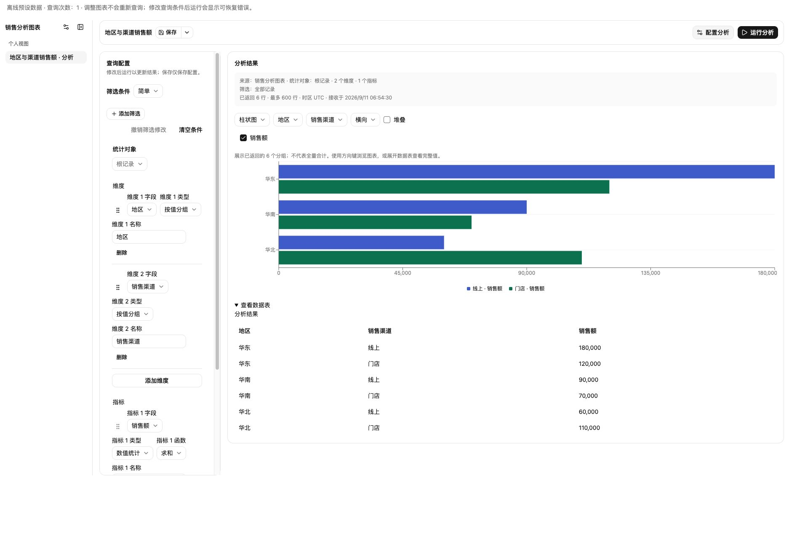
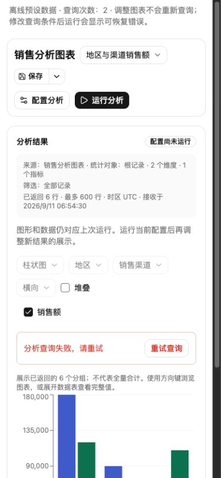
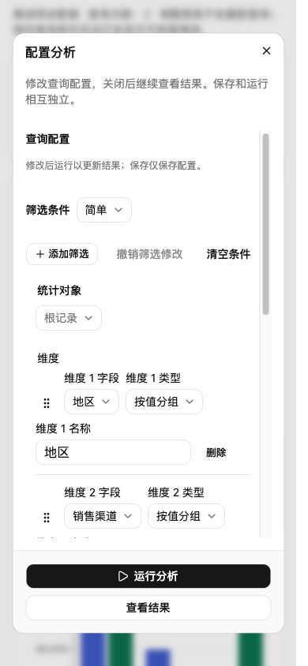
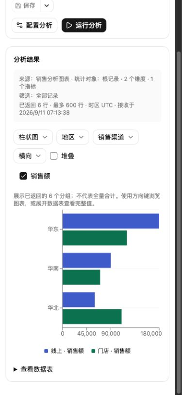
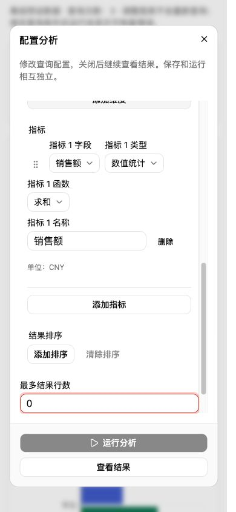
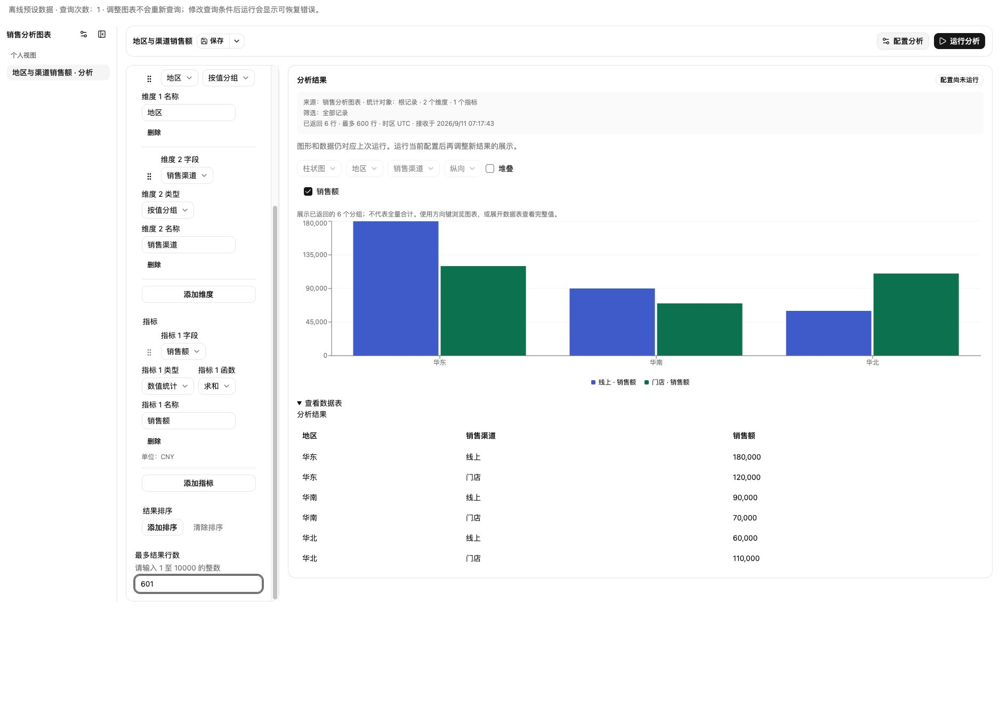
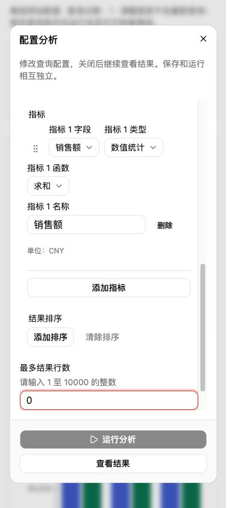

# 分析视图功能、UI、UX 验证

范围：当前工作区 Storybook 分析视图。2026-09-11 本轮实际操作和新截图；不包含宿主鉴权或部署验收。没有修改产品源码。

初次审计结论：主流程可用，但发现一个 P2 展示一致性缺陷和一个 P3 校验提示问题。随后用户授权修复，处理结果见文末；下文保留原始复现证据。

## 发现

### P2：查询草稿变更后，方向控件与实际旧图不一致

步骤：多系列柱状图改成横向 → 切数据表再切回柱状图（保持横向，查询次数不变）→ 将最多结果行数从 600 改成 0 或 601。

实际：旧结果恢复查询执行时的纵向柱状图，但禁用的方向控件仍显示“横向”。截图 2、3 与截图 1 对照可见。失败后仍存在；恢复 600 并重试成功后恢复一致。

源码确认：`AnalysisView.tsx:203` 在 stale 时选择 executedPresentation 渲染结果；`:425` 却始终将当前 presentation 交给展示编辑器。这不是返回数据错误，而是同一结果区显示两套状态，影响用户对图形配置的判断。

建议：过期结果的只读展示控件与图形使用同一 presentation；保留当前草稿，不将旧配置反写进草稿。补充“改方向 → 改查询 → 查询失败”的浏览器回归。

### P3：非法行数未说明可修正范围

步骤：在最多结果行数输入 0。

实际：保存/运行禁用正确，DOM alert 为“结果行数超限”，却未说明必须为正整数及允许上限。手机输入框被滚动到可见位置后，提示还在内部滚动区域下方，截图 6 首屏只看到红框和禁用按钮。

源码确认：`analysisCompiler.ts:248` 将类型、整数、下界和上界失败统一为同一句文案。

建议：显示实际能力限制下的有效整数范围，并将提示关联输入框；错误出现后保证修正说明能被发现。无需改变查询能力或放宽限制。

## 手动流程截图

1. 桌面图表与数据表：基本健康。图表/表格往返保持系列与方向，查询计数保持 1；桌面配置列较长，需要内部滚动，但结果区独立可见。

2. 修改为无效行数：输入保护正常，保留旧结果并提示配置尚未运行；存在上面的方向状态不一致。

3. 运行改变后的查询：离线 fixture 按设计报错，查询计数变为 2。失败提示、重试按钮、旧结果和执行口径保留；390px 布局正常换行，结果需垂直滚动。

4. 打开手机配置：基本健康。弹窗内滚动，底部运行/查看结果固定；打开时焦点进入筛选模式，点击查看结果后焦点回到配置按钮。

5. 修正回 600、保存、重试：通过。保存出现“已保存/视图已保存”，查询次数仍为 2；重试后变为 3，错误消失、接收时间更新、横向图恢复。此截图记录滚动到结果图的状态，不是页面顶部。

6. 手机非法行数：运行保护通过，错误提示的可发现性和文案待改进。检查后已恢复 600，关闭弹窗并重置临时视口。

## 自动回归与边界

本轮 `VIEW_ENGINE_BROWSER_CHANNEL=chrome pnpm test:storybook`：88 个文件通过、2 个既有文件跳过；349 项通过，退出码 0。覆盖现有记录/分析导航、另存、保存后重建、图表类型、暗色、缩放和无障碍断言。日志：`/tmp/fetcher-function-ux-browser.log`。

手动审计使用 Codex in-app Browser；自动回归使用已安装 Chrome。手机为 390×844 浏览器视口模拟，不等同实体手机软键盘或触摸验收。未做屏幕阅读器完整任务演练，截图及已有 axe 断言不能证明完整 WCAG 合规。离线查询失败是 fixture 设计，用于验证恢复交互，不是实际 API 故障。

## 授权修复与复核

- P2：展示编辑器与图形统一使用 resultPresentation；过期时显示执行快照，恢复查询后仍保留当前草稿展示偏好。新增回归覆盖切换展示、修改查询、失败、恢复查询，先确认失败再修复。
- P3：编译错误明确实际 maxLimit 下的整数范围；输入框上方常驻范围说明，并用 aria-describedby 关联。零、非整数文本、超过宿主上限的数值均标记 aria-invalid。新增三组回归在修复前失败。
- 默认服务地址按用户指定改为 `http://compensation-service.prod.svc.cluster.local/`；连接文案不再固定声称 dev，dev 转发说明同步。浏览器已确认初始值，本次未连接生产 API。
- 包测试普通和 React Compiler 模式各 1,207 passed、1 个 opt-in dev 测试 skipped；TypeScript、包构建和 ESLint 通过。
- 修复后全量浏览器回归 349 passed，88 个文件通过、2 个既有文件跳过，退出码 0；日志 `/tmp/fetcher-ux-fix-browser.log`。

修复后手动重走原步骤，确认图形和禁用方向均为纵向；恢复 600 后仍可使用草稿中的横向。390×844 下填 0 时范围说明位于输入框上方可见。已恢复正常配置、重置视口并关闭临时默认值检查页。

日志：`/tmp/fetcher-ux-fix-red.log`、`/tmp/fetcher-ux-fix-package.log`、`/tmp/fetcher-ux-fix-build.log`、`/tmp/fetcher-ux-fix-lint.log`。
