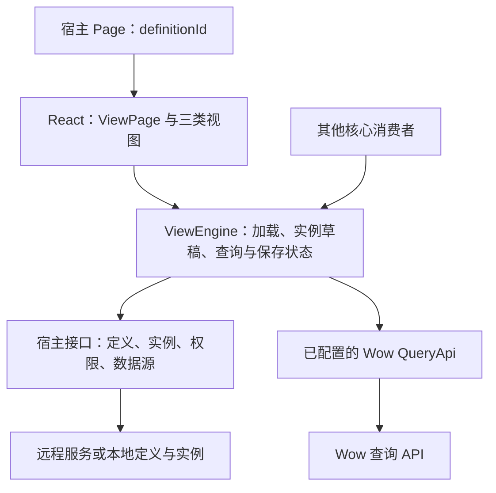
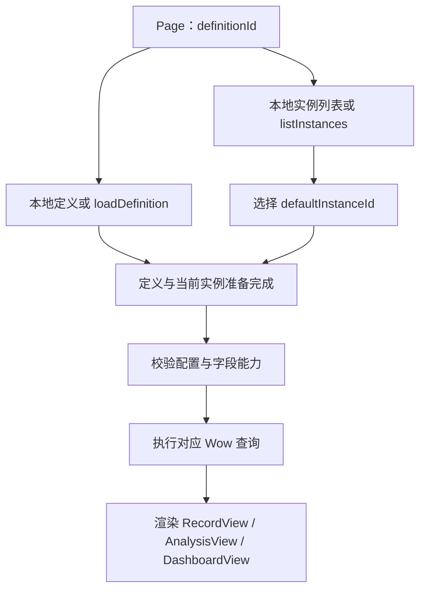

# Wow 查询视图引擎设计

日期：2026-09-05。状态：分节设计已确认，本文待整体审阅。

## 1. 目标与范围

在 Fetcher 中提供新的 `@ahoo-wang/fetcher-view-engine` lib，以 Wow 查询 API 驱动记录、分析和仪表盘视图。定义与查询核心可独立使用，React 层提供默认组件。

| 视图形态                      | 职责                       | 首期交付                                         |
| ----------------------------- | -------------------------- | ------------------------------------------------ |
| `record` / `RecordView`       | 查询和展示记录             | 表格、筛选、数据排序、分页、列宽、列顺序、列显隐 |
| `analysis` / `AnalysisView`   | 按维度计算指标             | 聚合表、指标卡、柱状图、折线图及配置界面         |
| `dashboard` / `DashboardView` | 组合已保存的记录和分析实例 | 面板布局、跨定义引用、全局筛选和联动             |

`RecordCards` 是后续交付的记录展示布局。它复用 `RecordView` 的查询、筛选、排序、分页和实例管理。本期不交付卡片界面，也不发布尚无实现的卡片配置契约。

## 2. 架构与依赖



- 视图引擎组织页面和实例的行为，查询通过现有 `@ahoo-wang/fetcher-wow` 类型与客户端执行。
- 宿主提供定义、实例持久化、身份与权限信息，以及已配置的查询客户端。
- React 层消费核心状态、触发核心操作。表格、图表和 UI 依赖留在 React 层。
- 一个包提供核心入口、`/react` 入口和独立样式入口。只导入核心时不加载 React、DOM、表格、图表或 CSS。
- 本地与远程使用相同的数据契约。远程定义和实例是纯数据；组件、函数、凭据在运行时由宿主接入。

## 3. 视图定义与视图实例

### 3.1 视图定义 `ViewDefinition`

定义描述可用的数据源、字段与能力。一份定义可创建不同形态的多个实例。

| 内容          | 契约                                                                   |
| ------------- | ---------------------------------------------------------------------- |
| `id`、`title` | 定义标识与显示名称                                                     |
| `sourceId`    | 记录、分析实例使用的数据源标识，由宿主绑定 Wow 查询客户端              |
| `rowKey`      | 记录结果中可稳定识别一条记录的字段路径                                 |
| `fields`      | 查询字段路径、显示名称、类型、枚举值、可用筛选及聚合操作、默认渲染配置 |

字段信息以 Wow 字段契约和 QuerySchema 能力为依据，宿主可收窄界面提供的操作。定义服务或本地定义负责提供这份信息，引擎不要求再访问一个固定的 Schema 服务地址。

渲染配置只保存渲染器名称和 JSON 参数。宿主按名称注册实际组件。字段读取遵循数据源返回对象的字段路径，不自动增删 `state` 前缀。

对于仪表盘，根定义决定页面入口和实例归属；子面板的数据源、字段与能力来自子实例各自的定义。

### 3.2 视图实例 `ViewInstance`

实例保存用户实际打开、调整、保存的视图。所有实例共用 `id`、`definitionId`、`title`、`kind`、`scope` 和对应形态的 `config`。宿主可提供不透明的 `revision` 字符串用于并发校验；核心保留并回传它，但不将其变化算作用户编辑。

```ts
type ViewKind = 'record' | 'analysis' | 'dashboard';

type ViewScope =
  { type: 'personal' } | { type: 'public'; source: 'system' | 'shared' };
```

| 分类        | 含义               |
| ----------- | ------------------ |
| 个人        | 用户自己的实例     |
| 公共 / 系统 | 系统提供的公共实例 |
| 公共 / 共享 | 用户共享的公共实例 |

形态与分类相互独立。记录、分析、仪表盘实例均可属于上述分类。归属用户、公共可见范围和操作权限由宿主确定，分类本身不授予操作权限。

### 3.3 三类实例配置

| 实例   | `config` 中保存的内容                                                             |
| ------ | --------------------------------------------------------------------------------- |
| 记录   | `filter: FilterExpression`、`sort: FieldSort[]`、分页方式与每页数量、展示布局配置 |
| 分析   | `query: AggregationQuery`、展示类型、聚合结果别名绑定和展示配置                   |
| 仪表盘 | 子实例引用、面板布局、全局筛选项、当前筛选值及字段绑定                            |

记录分页配置包含 `mode: 'paged' | 'cursor'` 和正整数 `size`。页码与游标属于运行状态。默认筛选使用 Wow 的 `MATCH_ALL` 表达式，默认排序为空。

记录实例的 `config.presentation` 保存当前 `layout` 与各布局的设置。首期只有 `layout: 'table'` 和 `table.columns`。后续增加卡片布局时保留已有表格设置。表格列配置使用有序数组，每项包含字段标识、可选标题、宽度和可见性；数组顺序就是列显示顺序。列宽使用有限的正数，并受组件的最小、最大宽度约束。

记录查询首期沿用 Wow 默认投影。列设置调整展示配置，避免将渲染器需要的数据隐式裁掉；以后优化请求投影时，需同时明确自定义渲染器的字段依赖。

分析展示配置引用查询结果别名。聚合表支持查询产生的全部分组和指标；指标卡要求无分组并明确绑定指标别名。柱状图、折线图指定横轴分组、可选系列分组及指标别名，查询中的每个分组都须有明确展示绑定，防止把不同分组的值误当作同一个点。保留结果中 `null` 与零值的区别，空结果不能直接替换为零指标。

仪表盘布局在统一列网格中保存面板位置和跨度。面板 ID 在仪表盘内唯一。较窄容器可按面板顺序重新排版；自动响应式排版不改写已保存布局。

运行结果、加载与保存状态、错误、行选中状态、页码、游标及拖动过程数据不写入实例配置。

## 4. 宿主接口与核心入口

### 4.1 定义、实例读写接口

这些接口均为异步接口，可由远程请求或本地实现提供。读取接口支持可选 `AbortSignal`。

| 接口             | 输入                                   | 输出                         |
| ---------------- | -------------------------------------- | ---------------------------- |
| `loadDefinition` | `definitionId`                         | `ViewDefinition`             |
| `listInstances`  | `definitionId`                         | `ViewInstanceList`           |
| `loadInstance`   | `instanceId`                           | 完整 `ViewInstance`          |
| `createInstance` | 不含实例 ID 和 `revision` 的新实例配置 | 宿主分配 ID 后的完整实例     |
| `saveInstance`   | 当前已有实例的完整可保存内容           | 宿主保存、规范化后的完整实例 |

```ts
interface ViewInstanceList {
  instances: ViewInstance[];
  defaultInstanceId: string | null;
}
```

- 列表包含当前用户可见的完整实例。默认实例由宿主按当前用户和 `definitionId` 确定，属于该用户的选择，不是公共实例的全局属性。
- 本期接口读取默认选择；将实例设为默认的写入操作不属于本期范围。
- `loadInstance` 用于单实例加载和仪表盘引用解析。页面已有完整实例时不重复读取。
- 更新保持实例 ID、定义归属和形态不变。另存通过 `createInstance` 创建新的 ID。
- 写入操作不自动重试。并发版本校验和存储冲突由宿主处理，冲突通过失败结果反馈给引擎。

### 4.2 数据源与权限接入

宿主提供 `resolveSource(sourceId)`，返回已配置的 Wow `QueryApi` 客户端。业务 URL、认证、租户和其他请求上下文由该客户端负责。引擎不根据远程配置加载可执行代码。

宿主提供 `getInstancePermissions(instance)`，返回 `save`、`saveAsPersonal`、`saveAsShared` 三项布尔权限。缺少对应权限或写入回调时，组件不提供该操作。服务端仍负责最终的可见性和写入授权检查。

读取回调仅在缺少对应本地数据时要求存在；纯本地输入不需要实现空的远程加载回调。跨定义仪表盘可以通过相同加载接口访问本地映射或远程资源。

### 4.3 核心运行对象

提供具体的 `ViewEngine` 运行对象。构造参数包含 `definitionId`、宿主接口，以及可选的本地定义和 `ViewInstanceList`。本地数据的定义归属必须与入口一致。

核心通过只读状态和订阅通知提供输出，并支持以下操作：

- 加载页面、选择实例；
- 更新当前实例配置、还原配置、执行或刷新查询；
- 分页和请求下一批游标记录；
- 保存、另存为；
- 释放运行对象，停止后续界面状态更新并取消可取消的读取请求。

React 绑定订阅同一运行对象。展示组件不维护另一份已保存实例、编辑草稿或保存状态。异步核心操作返回 Promise，失败更新对应错误状态并向调用者返回失败；React 绑定统一处理这些失败。

## 5. 页面加载与实例切换



1. 定义与实例列表可并行加载。成功加载的本地和远程输入进入相同流程。
2. 有效默认实例必须出现在可见实例列表中，并属于当前定义。
3. 空列表展示空态。列表非空但默认 ID 缺失或失效时，展示实例选择入口，用户选择后查询。
4. 定义与实例都准备完成，并通过配置校验后，才执行数据查询。
5. 切换实例时复用已加载定义，保留当前页面内各实例的草稿，并执行选中实例的查询。
6. 页面入口变化或运行对象释放后，旧加载、查询的结果不得覆盖新页面状态。

## 6. 查询执行与临时状态

| 场景         | Wow 请求与结果                                |
| ------------ | --------------------------------------------- |
| 记录页码分页 | `paged`，返回 `{ total, list }`               |
| 记录游标分页 | `cursor`，返回 `{ list, nextCursor }`         |
| 聚合分析     | `aggregate`，返回以分组和指标别名为键的行数组 |
| 简单计数     | 可直接使用 `count`，返回数值                  |
| 仪表盘       | 各面板执行自己的记录或分析查询                |

记录查询使用当前 `FilterExpression`、排序和运行时分页参数。页码从 1 开始；游标作为不透明字符串使用，只提供接口实际支持的向前读取能力。

提交新筛选、改变排序或每页数量时，页码回到 1，游标失效。改变分析维度或指标时重新聚合。仅改变列宽、列显示顺序等展示配置时重新渲染。

数据排序、筛选、分页均由 Wow 执行。TanStack 表格使用外部查询结果和受控状态，不对当前页再执行一套本地排序、筛选或分页。

分析直接使用服务端聚合结果，不将已加载的一页记录当成统计全集。分组查询受 `AggregationQuery.limit` 约束，界面明确其展示上限；指标卡不通过相加已截取的分组结果推算全局总计。

每次执行与其页面、实例、面板和查询版本关联。新请求替代旧请求，取消能取消的旧请求，同时忽略迟到的成功和失败结果。切换实例时，不把上一个实例的结果显示为新实例的数据。

现有 Wow 具体客户端已支持可选取消参数，但 `QueryApi` 的部分方法声明尚未包含该参数。实现时补齐这些可选参数声明并验证调用方兼容性，保持请求与结果结构不变；请求版本隔离独立保证迟到结果不会被采用。

加载与查询错误、空结果、保存错误分别表达。查询失败保留草稿，并提供重试入口。仪表盘面板分别维护结果和错误状态。

## 7. 已编辑、保存与另存为

运行时保留每个已打开实例的保存基线、当前草稿和查询结果。

**[已编辑]** 由草稿中可保存配置与最近保存基线的结构比较得出。对象键顺序不影响比较，数组顺序有意义。配置还原一致后标记自动消失，临时运行状态不会触发标记。

| 操作           | 规则                                                            |
| -------------- | --------------------------------------------------------------- |
| 保存           | 捕获当前草稿，调用 `saveInstance`，成功后更新对应实例的保存基线 |
| 另存为         | 填写新名称，选择有权限的分类，使用当前草稿调用 `createInstance` |
| 还原           | 当前草稿恢复为保存基线，按需重新查询                            |
| 保存失败或冲突 | 保留当前草稿、错误和 [已编辑]                                   |

另存默认选择个人实例，有权限时可选择公共 / 共享。系统实例由宿主提供，不作为普通另存对话框的创建选项。

保存针对点击时的草稿快照。保存期间继续产生的修改必须保留：成功响应更新保存基线，后续草稿沿用新的并发版本并保留后续配置修改，继续显示 [已编辑]。没有后续修改时，草稿与宿主返回的正式实例对齐。同一实例同一时间只进行一次写入操作。

保存响应只更新对应实例。另存成功后，在用户仍停留于发起操作的视图时选中新实例；若用户已经切换视图或页面，完成该实例的保存记录，不抢回当前选择，也不覆盖后续草稿。

权限校验失败与其他保存失败采用相同的草稿保留规则。默认实例偏好不会由保存或另存操作隐式改写。

## 8. 仪表盘引用与联动

仪表盘为一层组合，子项只能是记录或分析实例。

| 面板配置     | 含义                        |
| ------------ | --------------------------- |
| `id`         | 仪表盘内稳定且唯一的面板 ID |
| `instanceId` | 引用已保存的记录或分析实例  |
| `layout`     | 面板的网格位置和跨度        |

子实例可来自不同定义。按实例 ID 加载完整实例，再按其 `definitionId` 获取定义和数据源。同一仪表盘内的相同资源读取可复用，但每个面板拥有独立运行状态；两个面板引用同一实例也不会共享页码或临时筛选状态。

全局筛选项保存自身标识、输入配置、当前值和绑定。每个绑定明确指定面板 ID 与子查询字段。筛选值转换为 Wow `FilterExpression` 后，与该子实例的原筛选条件通过 `AND` 合并。

例如，“时间范围”可以绑定到订单面板的创建时间和事件面板的发生时间。只有受该筛选项影响的面板重新查询；记录面板同时重置分页或游标。

全局筛选作为查询时的叠加条件执行，保存到仪表盘实例。原始子实例配置继续作为独立保存基线。布局、引用或全局筛选变化会使仪表盘显示 [已编辑]。

保存仪表盘只写入该仪表盘实例。另存仪表盘创建新的组合实例，复用原有子实例引用。要获得独立的子视图配置，先对子实例另存，再替换面板引用。

子实例配置独立编辑和保存。其他仪表盘在下次加载该子实例时使用其最新已保存配置。本期不增加配置推送或跨页面实时同步机制。

子实例不存在、不可访问、配置无效或查询失败时，该面板显示对应状态，其余面板继续运行。无效的筛选绑定须明确报错，不得悄悄执行缺少该筛选的查询。

## 9. React 组件与展示实现

默认 UI 使用 shadcn/ui + Base UI。公共组件入口为 `ViewPage`、`RecordView`、`AnalysisView`、`DashboardView`。

```tsx
<ViewPage definitionId="orders" host={host} />
```

`ViewPage` 执行页面加载、实例选择、查询和保存流程。三类视图组件也可与核心运行对象一起单独使用，供宿主组成自己的页面。

统一交互包括：按个人、公共 / 系统、公共 / 共享分组的实例选择器，实例名称与 [已编辑] 标记，保存、另存为、刷新和当前视图配置入口。

### 9.1 RecordView 与表格

`RecordView` 负责记录查询和实例交互。内部 `RecordTable` 使用 shadcn Table + TanStack Table，组合列设置和表头交互。

| 能力     | 行为                                                                   |
| -------- | ---------------------------------------------------------------------- |
| 列宽     | 表头拖动手柄调整宽度，拖动完成后提交到实例草稿；提供键盘或数值设置入口 |
| 列顺序   | 列设置面板调整显示顺序，写回有序列配置                                 |
| 列显隐   | 列设置面板逐列切换，写回可见性                                         |
| 数据排序 | 转换为 Wow `FieldSort`，触发服务端查询                                 |

实例列配置是可保存状态的来源；TanStack 的列宽、列顺序和显隐状态从它派生或受控更新。拖动偏移等临时状态留在表格层，不保存 TanStack 内部对象。

后续 `RecordCards` 接入同一 `RecordView`。表格和卡片分别保留自己的展示配置，共享记录查询与实例管理；本期不为未来布局创建空实现或通用插件框架。

### 9.2 分析与仪表盘

分析图表使用 shadcn 官方 Chart 组合采用的 Recharts。记录表和分析结果表复用表格展示与列交互能力，排序请求分别对应记录字段和聚合结果别名。

仪表盘使用 CSS Grid 展示布局。布局编辑通过调整面板位置和跨度完成，提供键盘可操作的配置入口；本期不额外承诺面板拖放或多层嵌套。

### 9.3 样式与扩展

组件源码由 lib 维护。样式在包内构建，独立导出；宿主引入 CSS 即可，无需安装或配置 Tailwind。

类名采用 `fve-` 前缀，主题变量采用 `--fve-*` 前缀。默认样式限定在视图根作用域，避免全局重置；弹层沿用所属视图的主题和作用域。验证多个实例及不同主题在同一页面共存。

字段、筛选和图表渲染组件支持按名称注册。配置只保存名称与 JSON 参数，运行时组件注册表保持在 React 层。键盘操作、可见焦点、表头语义、控件标签、弹窗标题、错误提示和读屏可访问性属于默认交付要求。

## 10. 错误处理与验证

| 情况                                 | 处理方式                                       |
| ------------------------------------ | ---------------------------------------------- |
| 定义或实例列表加载失败               | 页面展示错误与重试入口，准备完成后再查询       |
| 默认实例缺失或不可用                 | 展示可选实例，选择后查询                       |
| 字段、操作能力、别名或渲染配置不兼容 | 保留配置，标明具体问题，阻止受影响的请求或展示 |
| 查询失败                             | 保留草稿，展示对应错误与重试入口               |
| 保存失败或宿主报告冲突               | 保留草稿和 [已编辑]，由用户处理                |
| 单个仪表盘面板失败                   | 面板局部处理，其余面板继续运行                 |

不静默丢弃无效字段、筛选或指标来凑出可执行查询。核心校验数据结构与查询能力；React 层校验所需渲染器是否已注册，并将展示错误定位到对应位置。远程与本地输入进入相同的结构和能力校验；服务端仍是查询权限与协议校验的最终执行方。

实现验收覆盖以下行为：

1. 本地和远程输入的初始化结果一致；加载只按需发生，默认选择和异常默认处理符合约定。
2. 分页、游标、筛选、排序、聚合请求使用 Wow 现有类型和具体结果形状；表格不执行第二套本地数据查询。
3. 列宽、列顺序、显隐和分析展示配置保存后可恢复；仅临时状态变化不会出现 [已编辑]。
4. 还原、保存、另存、写入失败、冲突、保存期间继续编辑和切换实例均不丢失草稿。
5. 迟到的成功与失败响应不能污染新页面、实例或面板；释放后的运行对象不更新界面。
6. 仪表盘跨定义引用、重复引用、条件合并、字段绑定和单面板失败具有独立验证。
7. 浏览器验证实际列宽拖动、列设置、保存对话框、键盘操作、主题及多实例嵌入。
8. 核心可在无 React、DOM 和 CSS 的环境导入、执行；包导出与类型检查通过。

交付实现时运行受影响包的测试和构建、Storybook 浏览器交互测试，并按仓库要求在提交前通过 `pnpm test:unit`。公开 API 同步对应 skill API 参考；涉及 wiki 时同步中英文并运行 wiki 构建。

## 11. 源码与文档依据

本设计核对的 Fetcher 基线为 `4.0.1` / `90b52f81`，Wow 本地源码版本为 `9.0.8`。依据包括：

- Fetcher：`packages/wow/src/query/queryApi.ts`、`queryable.ts`、`cursorQuery.ts`、`aggregation.ts`、`filter.ts`，以及 snapshot / event 查询客户端。
- Wow：`wow-query/src/main/kotlin/me/ahoo/wow/query/QueryGateway.kt`、`wow-api/src/main/kotlin/me/ahoo/wow/api/query/AggregationQuery.kt`、`wow-api/src/main/kotlin/me/ahoo/wow/api/query/schema/QuerySchemaMetadata.kt` 与同目录的 `QuerySchemaTypes.kt`。
- [shadcn Base UI Data Table](https://ui.shadcn.com/docs/components/base/data-table)：Table 与 TanStack Table 的组合方式。
- [TanStack 列宽调整](https://tanstack.com/table/latest/docs/framework/react/guide/column-resizing)、[列顺序](https://tanstack.com/table/latest/docs/framework/react/guide/column-ordering)、[列显隐](https://tanstack.com/table/latest/docs/reference/index/interfaces/TableOptions_ColumnVisibility)：表格所需能力。
- [shadcn Base UI Chart](https://ui.shadcn.com/docs/components/base/chart)：Recharts 组合方式。

本文冻结设计与验收要求，不表示新 lib 已实现或已完成服务端运行时验证。本文整体审阅通过后，再编写实现计划。
