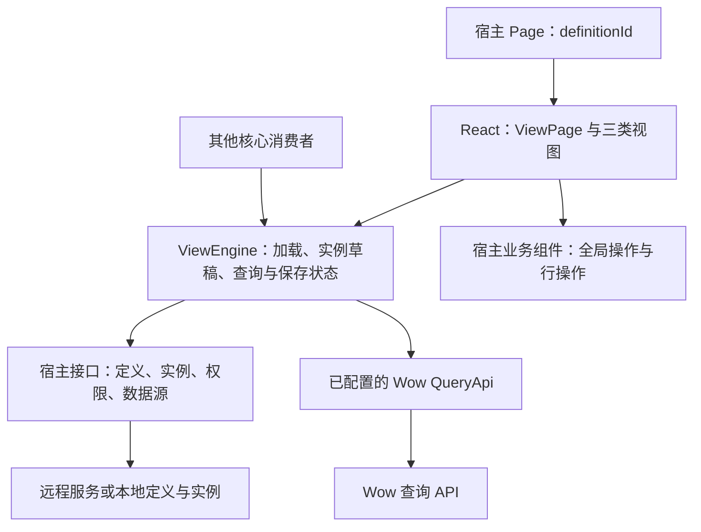
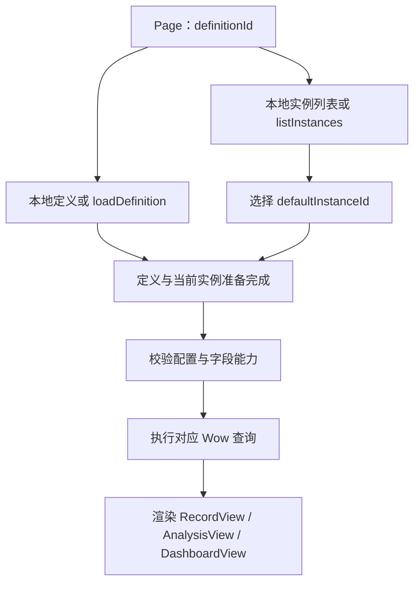

# Wow 查询视图引擎设计

日期：2026-09-05；实现更新：2026-09-06。状态：独立 `packages/view-engine` 已交付完整过滤器、无 React 依赖的 ViewEngine、RecordView/RecordTable 与 ViewPage，包括远程/本地定义、实例查询及宿主保存接口。本文继续定义完整设计与验收契约；卡片、AnalysisView 和 DashboardView 尚未实现。

## 1. 目标与范围

在 Fetcher 中提供新的 `@ahoo-wang/fetcher-view-engine` lib，以 Wow 查询 API 驱动记录、分析和仪表盘视图。定义与查询核心可独立使用，React 层提供默认组件。首期包含自定义筛选器、表格单元格、全局业务操作、表格操作和行操作扩展，以及简单 / 高级筛选模式。行操作在表格中通过操作单元格呈现。

| 视图形态                      | 职责                                     | 首期交付                                         |
| ----------------------------- | ---------------------------------------- | ------------------------------------------------ |
| `record` / `RecordView`       | 帮助业务人员找到并处理记录               | 查询、表格、分页、列设置、宿主提供的全局与行操作 |
| `analysis` / `AnalysisView`   | 帮助用户明确统计口径、比较并解读结果     | 维度与指标配置、聚合表、指标卡、柱状图、折线图   |
| `dashboard` / `DashboardView` | 帮助用户观察整体情况并定位需要关注的问题 | 已保存视图组合、跨定义引用、全局筛选、面板布局   |

三类视图按用户任务组织操作。记录视图以业务处理为中心，分析视图以统计口径与结果解读为中心，仪表盘以观察和进入相关视图为中心。它们共享实例导航、加载与配置保存能力，各自决定业务工具栏和主操作。

效果稿只约定整体 UX 方向。单个组件的尺寸、密度、文案、操作层级和交互状态结合真实任务逐项打磨；功能与输入输出契约是验收依据，生成图片不是像素级冻结稿。

`RecordCards` 是后续交付的记录展示布局。它复用 `RecordView` 的查询、筛选、排序、分页和实例管理。本期不交付卡片界面，也不发布尚无实现的卡片配置契约。

## 2. 架构与依赖



- 视图引擎组织页面和实例的行为，查询通过现有 `@ahoo-wang/fetcher-wow` 类型与客户端执行。
- 宿主提供定义、实例持久化、身份与权限信息，以及已配置的查询客户端。
- React 层消费核心状态、触发核心操作。表格、图表和 UI 依赖留在 React 层。
- 一个包提供核心入口、`/react` 入口和独立样式入口。只导入核心时不加载 React、DOM、表格、图表或 CSS。
- 本地与远程使用相同的数据契约。远程定义和实例是纯数据；组件、函数、凭据在运行时由宿主接入。
- 宿主业务组件执行业务动作，引擎提供记录、查询上下文和所属运行位置的刷新能力。业务执行状态、业务表单草稿与视图配置草稿分别管理。

## 3. 视图定义与视图实例

| 概念     | 唯一职责                                     |
| -------- | -------------------------------------------- |
| 视图定义 | 描述可以查询的数据、字段语义与可用能力       |
| 视图实例 | 保存用户选择的查询与展示配置                 |
| 运行状态 | 保存一次打开中的草稿、分页、请求、结果与错误 |

实例 ID 标识持久化配置，不标识一次运行。同一实例出现在两个面板时，必须有两份独立运行状态；这一区分不要求额外的公共运行时类。

### 3.1 视图定义 `ViewDefinition`

定义描述可用的数据源、字段与能力。一份定义可创建不同形态的多个实例。

| 内容          | 契约                                                                   |
| ------------- | ---------------------------------------------------------------------- |
| `id`、`title` | 定义标识与显示名称                                                     |
| `sourceId`    | 记录、分析实例使用的数据源标识，由宿主绑定 Wow 查询客户端              |
| `rowKey`      | 记录结果中可稳定识别一条记录的字段路径                                 |
| `fields`      | 查询字段路径、显示名称、类型、枚举值、可用筛选及聚合操作、默认渲染配置 |

字段信息以 Wow 字段契约和 QuerySchema 能力为依据，宿主可收窄界面提供的操作。定义服务或本地定义负责提供这份信息，引擎不要求再访问一个固定的 Schema 服务地址。

渲染配置统一使用 `RendererReference`：`name` 指向注册名称，可选 `options` 保存 JSON 参数。宿主按名称注册实际组件。字段定义可指定 `editor` 和 `cellRenderer`；定义级 `filterEditors` 按 `FilterOperator` 指定编辑器，覆盖不依附单个字段的节点。字段读取遵循数据源返回对象的字段路径，不自动增删 `state` 前缀。

定义可通过 `recordActions.global`、`recordActions.table` 和 `recordActions.row` 分别引用全局操作、表格操作与默认行操作组件，值均为可选 `RendererReference`。宿主分别在 `extensions.globalActions`、`extensions.tableActions` 和 `extensions.rowActions` 注册实际组件。本地与远程定义采用相同引用方式；定义不保存业务处理函数，也不通过动作引用授予业务权限。

对于仪表盘，根定义决定页面入口、实例归属和全局筛选表达式的字段语义；子面板的数据源、字段与能力来自子实例各自的定义。

### 3.2 视图实例 `ViewInstance`

实例保存用户实际打开、调整、保存的视图。所有实例共用 `id`、`definitionId`、`title`、`kind`、`scope` 和对应形态的 `config`。宿主可提供不透明的 `revision` 字符串用于并发校验；核心保留并回传它，但不将其变化算作用户编辑。

```ts
type ViewKind = 'record' | 'analysis' | 'dashboard';

type ViewScope =
  { type: 'personal' } | { type: 'public'; source: 'system' | 'shared' };
```

| 分类        | 含义               |
| ----------- | ------------------ |
| 个人        | 用户自己的实例     |
| 公共 / 系统 | 系统提供的公共实例 |
| 公共 / 共享 | 用户共享的公共实例 |

形态与分类相互独立。记录、分析、仪表盘实例均可属于上述分类。归属用户、公共可见范围和操作权限由宿主确定，分类本身不授予操作权限。

### 3.3 三类实例配置

| 实例   | `config` 中保存的内容                                                             |
| ------ | --------------------------------------------------------------------------------- |
| 记录   | `filter: FilterExpression`、`sort: FieldSort[]`、分页方式与每页数量、展示布局配置 |
| 分析   | `query: AggregationQuery`、展示类型、聚合结果别名绑定和展示配置                   |
| 仪表盘 | 子实例引用、面板布局、各全局筛选项的 `FilterExpression` 及字段映射或宿主转换绑定  |

记录分页配置包含 `mode: 'paged' | 'cursor'` 和正整数 `size`。页码与游标属于运行状态。默认筛选使用 Wow 的 `MATCH_ALL` 表达式，默认排序为空。

记录实例的 `config.presentation` 保存当前 `layout` 与各布局的设置。首期只有 `layout: 'table'` 和 `table.columns`。后续增加卡片布局时保留已有表格设置。

表格列配置使用有序数组，每列有稳定且唯一的 `id`、可选标题、宽度和可见性；数组顺序就是列显示顺序。`kind: 'field'` 的数据列另有 `field` 和可选 `renderer: RendererReference`；`kind: 'actions'` 的操作列可用 `renderer` 选择行操作组件，省略时使用定义的 `recordActions.row`，两者都不存在时报告配置错误，无需伪造数据字段。两种列均支持宽度、顺序和显隐设置，操作列不参与字段筛选或数据排序。列宽使用有限的正数，并受组件的最小、最大宽度约束。

记录查询首期沿用 Wow 默认投影。列设置调整展示配置，避免将渲染器需要的数据隐式裁掉；以后优化请求投影时，需同时明确自定义渲染器的字段依赖。

分析展示配置引用查询结果别名。聚合表支持查询产生的全部分组和指标；指标卡要求无分组并明确绑定指标别名。柱状图、折线图指定横轴分组、可选系列分组及指标别名，查询中的每个分组都须有明确展示绑定，防止把不同分组的值误当作同一个点。保留结果中 `null` 与零值的区别，空结果不能直接替换为零指标。

仪表盘布局在统一列网格中保存面板位置和跨度。面板 ID 在仪表盘内唯一。较窄容器可按面板顺序重新排版；自动响应式排版不改写已保存布局。

运行结果、加载与保存状态、错误、行选中状态、页码、游标、筛选编辑模式、实例导航展开状态及拖动过程数据不写入实例配置。内置及自定义筛选器都是 Wow 表达式编辑器，已提交的值必须能从 `FilterExpression` 无损恢复，不再持久化另一份筛选表单状态。渲染引用的 JSON `options` 描述控件设置，不承载另一份可独立修改的查询条件。

## 4. 宿主接口与核心入口

### 4.1 定义、实例读写接口

这些接口均为异步接口，可由远程请求或本地实现提供。读取接口支持可选 `AbortSignal`。

| 接口             | 输入                                   | 输出                               |
| ---------------- | -------------------------------------- | ---------------------------------- |
| `loadDefinition` | `definitionId`                         | `ViewDefinition`                   |
| `listInstances`  | `definitionId`                         | `ViewInstanceList`                 |
| `loadInstance`   | `instanceId`                           | 完整 `ViewInstance`                |
| `createInstance` | 不含实例 ID 和 `revision` 的新实例配置 | 宿主分配 ID 后的完整实例           |
| `saveInstance`   | 当前已有实例的完整可保存内容           | 原样保存配置并更新版本后的完整实例 |

```ts
interface ViewInstanceList {
  instances: ViewInstance[];
  defaultInstanceId: string | null;
}
```

- 列表包含当前用户可见的完整实例。默认实例由宿主按当前用户和 `definitionId` 确定，属于该用户的选择，不是公共实例的全局属性。
- 本期接口读取默认选择；将实例设为默认的写入操作不属于本期范围。
- `loadInstance` 用于单实例加载和仪表盘引用解析。页面已有完整实例时不重复读取。
- 更新保持实例 ID、定义归属和形态不变。另存通过 `createInstance` 创建新的 ID。
- 两个写入接口原样持久化提交的 `title`、`scope`、`config`，以结构相等为准；响应中只允许分配新实例 ID、更新 `revision` 及宿主维护的元数据。默认值填充、名称整理等规范化在提交前完成，并进入可见草稿或另存对话框。服务端接受并原样保存，或返回校验失败，不在成功响应中改写用户配置。
- 写入操作不自动重试。并发版本校验和存储冲突由宿主处理，冲突通过失败结果反馈给引擎。
- 成功响应若违反原样保存契约，引擎保留草稿与原基线，报告保存结果不符合契约，并要求重新加载核对后再写入。重新读取已保存实例可重建基线与并发版本，但仍保留草稿供比较和处理。此时不能推断服务端未保存，也不能自动重试或用写入响应覆盖草稿。

### 4.2 数据源与权限接入

宿主提供 `resolveSource(sourceId)`，返回已配置的 Wow `QueryApi` 客户端。业务 URL、认证、租户和其他请求上下文由该客户端负责。引擎不根据远程配置加载可执行代码。

每个 `ViewEngine` 只服务一个固定的数据访问范围，包括用户、租户和影响可见数据的其他宿主上下文。这些范围变化时，即使 `definitionId` 和客户端对象没有变化，宿主也必须释放旧引擎并创建新引擎；React 宿主可用随范围变化的 `key` 重建 `ViewPage`。旧实例列表、草稿、结果与读取缓存不能带入新范围。同一身份的普通 Token 刷新无需重建。

宿主异步读写回调须在调用时绑定原访问范围，不能在等待期间改用另一身份或租户执行。释放不能保证撤销已经发出的写入，但其完成结果不得更新新引擎或触发新范围中的实例选择。

宿主提供 `getInstancePermissions(instance)`，返回 `save`、`saveAsPersonal`、`saveAsShared` 三项布尔权限。缺少对应权限或写入回调时，组件不提供该操作。服务端仍负责最终的可见性和写入授权检查。

读取回调仅在缺少对应本地数据时要求存在；纯本地输入不需要实现空的远程加载回调。跨定义仪表盘可以通过相同加载接口访问本地映射或远程资源。

### 4.3 核心运行对象

提供具体的 `ViewEngine` 运行对象。构造参数包含 `definitionId`、宿主接口，以及可选的本地定义和 `ViewInstanceList`。本地数据的定义归属必须与入口一致。

核心通过只读状态和订阅通知提供输出，并支持以下操作：

- 加载页面、选择实例；
- 更新当前实例配置、还原配置、执行或刷新查询；
- 分页和请求下一批游标记录；
- 保存、另存为；
- 释放运行对象，停止后续界面状态更新并取消可取消的读取请求。

React 绑定订阅同一运行对象。展示组件不维护另一份已保存实例、编辑草稿或保存状态。异步核心操作返回 Promise，失败更新对应错误状态并向调用者返回失败；React 绑定统一处理这些失败。

## 5. 页面加载与实例切换



1. 定义与实例列表可并行加载。成功加载的本地和远程输入进入相同流程。
2. 有效默认实例必须出现在可见实例列表中，并属于当前定义。
3. 空列表展示空态。列表非空但默认 ID 缺失或失效时，展示实例选择入口，用户选择后查询。
4. 定义与实例都准备完成，并通过配置校验后，才执行数据查询。
5. 切换实例时复用已加载定义，保留当前页面内各实例的草稿，并执行选中实例的查询。
6. 页面入口或数据访问范围变化、运行对象释放后，旧加载、查询和保存的结果不得覆盖新页面状态；访问范围变化按第 4.2 节重建引擎。

## 6. 查询执行与临时状态

| 场景         | Wow 请求与结果                                |
| ------------ | --------------------------------------------- |
| 记录页码分页 | `paged`，返回 `{ total, list }`               |
| 记录游标分页 | `cursor`，返回 `{ list, nextCursor }`         |
| 聚合分析     | `aggregate`，返回以分组和指标别名为键的行数组 |
| 简单计数     | 可直接使用 `count`，返回数值                  |
| 仪表盘       | 各面板执行自己的记录或分析查询                |

记录查询使用当前 `FilterExpression`、排序和运行时分页参数。页码从 1 开始；游标作为不透明字符串使用，只提供接口实际支持的向前读取能力。

提交新筛选、改变排序或每页数量时，页码回到 1，游标失效。改变分析维度或指标时重新聚合。仅改变列宽、列显示顺序等展示配置时重新渲染。

数据排序、筛选、分页均由 Wow 执行。TanStack 表格使用外部查询结果和受控状态，不对当前页再执行一套本地排序、筛选或分页。

分析直接使用服务端聚合结果，不将已加载的一页记录当成统计全集。分组查询受 `AggregationQuery.limit` 约束，界面明确其展示上限；指标卡不通过相加已截取的分组结果推算全局总计。

每次执行与其引擎生命周期、页面、实例、面板和查询版本关联。新请求替代旧请求，取消能取消的旧请求，同时忽略迟到的成功和失败结果。切换实例时，不把上一个实例的结果显示为新实例的数据；身份或租户变化后不得继续显示旧范围的结果。

现有 Wow 具体客户端已支持可选取消参数，但 `QueryApi` 的部分方法声明尚未包含该参数。实现时补齐这些可选参数声明并验证调用方兼容性，保持请求与结果结构不变；请求版本隔离独立保证迟到结果不会被采用。

加载与查询错误、空结果、保存错误分别表达。查询失败保留草稿，并提供重试入口。仪表盘面板分别维护结果和错误状态。

### 6.1 简单与高级筛选

统一筛选面板提供 `simple` 和 `advanced` 两种编辑模式。记录使用 `config.filter`，分析使用 `config.query.filter`，仪表盘的每个全局筛选项保存自己的完整表达式。两种模式使用同一套 Wow `FilterExpression`，不新增筛选 DSL。

用户确认采用手动查询：编辑先进入过滤器本地缓冲，点击“查询”后，整体校验通过才将完整表达式一次性写入实例草稿，并执行查询。未提交修改显示“待查询”；当前列表和按查询范围执行的业务操作继续使用上次已应用的条件。过滤器内部缓冲不持久化，也不单独产生视图的 [已编辑]。

存在待查询修改时，保存视图与另存为提示先查询或撤销，不能静默保存旧条件，也不能隐式提交新条件。清空先将编辑缓冲改为 `MATCH_ALL`，仍需查询后生效；撤销筛选修改恢复当前已应用条件，不触发查询。查询提交后，即使请求失败，合法条件仍保留在实例草稿中，可重试查询或保存配置。组件契约与状态详见 [过滤器组件设计](2026-09-05-wow-view-engine-filter-design.md)。

| 模式 | 交互与表达能力                                                                                                                                   |
| ---- | ------------------------------------------------------------------------------------------------------------------------------------------------ |
| 简单 | 平铺筛选项，项之间只使用 `AND`，不显示冗余 AND 文字；添加时选择字段，已有组件固定绑定该字段并编辑操作和值，不提供 `OR`、`NOR` 或嵌套表达式树编辑 |
| 高级 | 可视化表达式树，完整编辑 Wow 支持的组合、谓词、嵌套作用域及全部参数                                                                              |

简单模式可表示空筛选、单个普通谓词，以及由普通谓词组成的顶层 `AND`。普通谓词不含逻辑或元素子树，并且有适用的简单筛选编辑器；同一字段可出现多个独立条件。清空筛选使用 `MATCH_ALL`，不生成协议禁止的空 `AND.operands`。

高级模式提供条件和分组的新增、删除及组合方式调整，不提供移动功能，直接保存 `op`、`operands`、`predicate` 等 Wow 协议结构。完整能力须通过结构化编辑器交付，不把手工编写 JSON 当作完整筛选 UI 的替代。

组件区分容器与非容器：`AND`、`OR`、`NOR` 组织子条件，`ELEMENT_MATCH` 绑定一个集合字段并管理元素作用域；普通字段过滤器绑定一个字段，字段名、操作、值和内部操作组成同一视觉组，按内容宽度排列，不强制占用整行。字段在添加时选定，组件内不切换字段；同字段可有多个独立过滤器。查询级特殊节点保持各自编辑形式，不为无字段或跨字段节点伪造单字段绑定。

当前 Fetcher 与 Wow 源码核对得到相同的 50 种操作，内置高级编辑器必须完整覆盖：

| 能力                 | 操作与需保留的参数                                                                                                                                                                                                                                                        |
| -------------------- | ------------------------------------------------------------------------------------------------------------------------------------------------------------------------------------------------------------------------------------------------------------------------- |
| 常量与组合           | `MATCH_ALL`、`MATCH_NONE`、`AND`、`OR`、`NOR`；保留 `operands` 结构与顺序                                                                                                                                                                                                 |
| 标识、归属、删除状态 | `ID`、`IDS`、`AGGREGATE_ID`、`AGGREGATE_IDS`、`TENANT_ID`、`OWNER_ID`、`SPACE_ID`、`DELETION`；编辑 `value`、`values`、`state`                                                                                                                                            |
| 比较与范围           | `EQ`、`NE`、`GT`、`GTE`、`LT`、`LTE`、`BETWEEN`；保留值的类型及 `lowerBound`、`upperBound`                                                                                                                                                                                |
| 字符串与集合         | `CONTAINS`、`STARTS_WITH`、`ENDS_WITH`、`IN`、`NOT_IN`、`CONTAINS_ALL`；保留 `stringComparison`、集合和值类型                                                                                                                                                             |
| 空值与存在性         | `IS_EMPTY`、`IS_EMPTY_STRING`、`IS_NOT_EMPTY_STRING`、`IS_NULL`、`IS_NOT_NULL`、`EXISTS`、`NOT_EXISTS`                                                                                                                                                                    |
| 元素与全文搜索       | `ELEMENT_MATCH`、`SEARCH`；保留元素 `predicate`、相对字段作用域，以及全文 `query`、`fields`、`mode`                                                                                                                                                                       |
| 日历与相对时间       | `TODAY`、`BEFORE_TODAY`、`TOMORROW`、`THIS_WEEK`、`NEXT_WEEK`、`LAST_WEEK`、`THIS_MONTH`、`LAST_MONTH`、`YESTERDAY`、`NEXT_MONTH`、`LAST_YEAR`、`THIS_YEAR`、`NEXT_YEAR`、`RECENT_DAYS`、`EARLIER_DAYS`；保留 `zoneId`、`datePattern`、`timeUnit` 及对应的 `time`、`days` |

全部能力以当前 Wow 协议的合法用法为准。逻辑组不能为空；元素谓词遵循 `ElementFilterExpression`，其中不能嵌入元数据、删除状态或全文搜索等根作用域操作。值类型、字段能力、日期参数和作用域限制继续按 Wow 契约验证。模式只控制编辑复杂度，高级实现不能受简单编辑器覆盖范围的限制。

模式切换遵守以下规则：

- 简单切换高级直接展示原表达式，保留全部结构与参数。
- 高级切回简单前，检查表达式是否符合简单模式的结构且能被相应编辑器表示。不能无损表示时保留高级模式并说明原因，不删除、替换或悄悄展开条件。
- 初次打开可表示的表达式时默认简单模式，复杂表达式自动使用高级模式。
- 单纯切换模式不修改表达式、不触发查询，也不产生 [已编辑]。实际条件修改进入既定的草稿、查询、保存和另存流程。
- 编辑器节点 ID、展开状态、焦点与尚未通过校验的输入留在编辑器内，不写入协议。编辑一个节点时保留其他子树，已加载的合法参数不得因编辑器缺项而丢失。

## 7. 已编辑、保存与另存为

RecordView 当前实例不再显示独立的“已编辑”标签，由保存按钮可用状态与待查询、错误提示表达操作状态；本节的 [已编辑] 仍指内部 dirty 状态，其他实例的导航标记保留。

每个打开位置保留自己的保存基线、当前草稿和查询结果。页面中的实例切换按实例保留这些状态；仪表盘按面板区分状态，重复引用不共享可变草稿。

**[已编辑]** 由草稿中的 `title`、`scope`、`config` 与该位置保存基线的结构比较得出。对象键顺序不影响比较，数组顺序有意义。配置还原一致后标记自动消失，临时运行状态不会触发标记。

| 操作           | 规则                                                            |
| -------------- | --------------------------------------------------------------- |
| 保存           | 捕获当前草稿，调用 `saveInstance`，成功后更新发起位置的保存基线 |
| 另存为         | 填写新名称，选择有权限的分类，使用当前草稿调用 `createInstance` |
| 还原           | 当前草稿恢复为保存基线，按需重新查询                            |
| 保存失败或冲突 | 保留当前草稿、错误和 [已编辑]                                   |

另存默认选择个人实例，有权限时可选择公共 / 共享。系统实例由宿主提供，不作为普通另存对话框的创建选项。

保存针对点击时的草稿快照。成功响应通过原样保存校验后，以该快照更新发起位置的保存基线和并发版本，当前草稿保留保存期间的后续修改；[已编辑] 重新按结构比较计算，改动后又还原到快照时不保留标记。没有后续修改时，草稿与返回实例对齐。由于响应不改变配置，无需在服务端配置与后续编辑之间执行三方合并。

同一引擎对同一实例同一时间只进行一次写入操作，包括不同面板发起的写入。保存成功只更新发起位置的基线与版本，不把其他位置的草稿标记为已保存，也不更新其并发版本；其他位置仍按原基线编辑，之后的存储冲突交由宿主校验。已加载列表和可复用读取结果采用返回的已保存实例，供之后新打开的位置使用。

另存成功后，在用户仍停留于发起操作的视图时选中新实例，以返回实例为新保存基线；期间若继续编辑配置，将源位置的最新 `config` 作为新实例草稿，名称与分类采用另存对话框提交的值，再计算 [已编辑]。源实例的保存基线与草稿保持不变。若用户已经切换视图或页面，则记录新实例，不抢回当前选择、不覆盖原草稿；若引擎已释放，则忽略完成响应。

权限校验失败与其他保存失败采用相同的草稿保留规则。默认实例偏好不会由保存或另存操作隐式改写。

## 8. 仪表盘引用与联动

仪表盘为一层组合，子项只能是记录或分析实例。

| 面板配置     | 含义                        |
| ------------ | --------------------------- |
| `id`         | 仪表盘内稳定且唯一的面板 ID |
| `instanceId` | 引用已保存的记录或分析实例  |
| `layout`     | 面板的网格位置和跨度        |

子实例可来自不同定义。按实例 ID 加载完整实例，再按其 `definitionId` 获取定义和数据源。同一引擎访问范围内的相同资源读取可复用，但每个面板拥有独立运行状态；两个面板引用同一实例也不会共享草稿、页码或临时筛选状态。

全局筛选项保存自身标识、输入配置、完整 `FilterExpression` 和绑定，字段及作用域按仪表盘根定义解释，输入值从表达式派生。每个绑定指定目标面板，并且只选择下列一种转换方式：

| 绑定方式 | 契约                                                                                                                                                                   |
| -------- | ---------------------------------------------------------------------------------------------------------------------------------------------------------------------- |
| 字段映射 | 保存源字段到目标字段的完整对应关系；宿主明确保证业务含义、值编码和操作语义一致。引擎核对字段类型、能力、时间语义与元素作用域兼容性，只替换字段路径，保留其他结构和参数 |
| 宿主转换 | 保存转换函数的 `name` 与可选 JSON `options`。宿主在核心接口的 `filterTransforms` 映射中提供同名函数，将源表达式转换为目标面板自己的完整 `FilterExpression`             |

宿主转换函数同步接收源表达式、根定义、目标定义、目标实例与绑定参数，不修改输入；输出由核心按目标字段、操作能力和作用域校验。转换函数在宿主运行时提供，无需 React，也不从远程配置加载代码。值编码或业务语义不同时必须显式转换，不能仅因字段类型相同就直接映射。

字段映射须覆盖全部引用，包括 `SEARCH.fields` 和元素子树中的相对字段，并保留 `OR`、`NOR` 等组合结构。内置映射不推断隐含范围：元数据、删除状态以及省略 `fields` 的 `SEARCH` 等根作用域操作交由宿主转换解释；常量条件可直接保留。完整高级编辑能力不代表任意表达式都能直接跨定义迁移。

转换后的完整表达式与该子实例的原筛选条件通过 `AND` 合并；多个独立全局项之间也使用 `AND`。未绑定的面板不受影响。已绑定但字段不兼容、映射不完整、转换函数缺失或执行失败时，阻止该面板查询并报告配置错误，不能删除分支凑出可执行条件。转换产物只用于查询，不再持久化一份目标表达式。

例如，“时间范围”可以绑定到订单面板的创建时间和事件面板的发生时间。只有受该筛选项影响的面板重新查询；记录面板同时重置分页或游标。

“已付款”在源定义中使用状态值 `1`、在目标定义中使用 `2` 时，应由宿主转换保留这一业务含义。两个字段都允许数字 `1` 不能作为可直接映射的依据。

全局筛选作为查询时的叠加条件执行，保存到仪表盘实例。原始子实例配置继续作为独立保存基线。布局、引用或全局筛选变化会使仪表盘显示 [已编辑]。

保存仪表盘只写入该仪表盘实例。另存仪表盘创建新的组合实例，复用原有子实例引用。要获得独立的子视图配置，先对子实例另存，再替换面板引用。

子实例配置独立编辑和保存。其他仪表盘在下次加载该子实例时使用其最新已保存配置。本期不增加配置推送或跨页面实时同步机制。

子实例不存在、不可访问、配置无效或查询失败时，该面板显示对应状态，其余面板继续运行。无效的筛选绑定须明确报错，不得悄悄执行缺少该筛选的查询。

## 9. React 组件与展示实现

默认 UI 使用 shadcn/ui + Base UI。公共组件入口为 `ViewPage`、`RecordView`、`AnalysisView`、`DashboardView`。

尽可能直接复用 shadcn 预制组件、默认主题及内置 variant / size，仅为布局与组合增加必要样式；过滤器采用 `InputGroup` 等现有组合，不重新设计按钮、输入框、修改标记和焦点样式。

```tsx
<ViewPage definitionId="orders" host={host} />
```

`ViewPage` 执行页面加载、实例选择、查询和保存流程。三类视图组件也可与核心运行对象一起单独使用，供宿主组成自己的页面。

共用能力包括：按个人、公共 / 系统、公共 / 共享分组的实例选择器，实例名称与 [已编辑] 标记，保存视图、另存为、还原更改、刷新和配置入口。共用能力不要求三类视图使用相同的业务工具栏；保存视图的操作层级不能挤占记录视图的业务主操作。

最终布局采用用户选定的“2 + 1”：宽容器默认展示左侧实例导航；收起后完全释放侧栏占位，顶部以分组下拉选择实例，并保留重新展开入口。两处选择器使用相同实例列表和当前选择。收起、展开不重建核心运行对象、不重新查询、不重置分页或草稿，也不改变简单 / 高级模式和 [已编辑]。导航状态属于当前 `ViewPage` 的临时 UI 状态，记录、分析和仪表盘共享这一页面布局。

窄容器采用收起布局；仅由容器宽度导致的临时收起不覆盖用户在宽容器下的展开偏好。整体效果和组件设计原则见 [UX 方向与组件设计原则](2026-09-05-wow-view-engine-ui-design.md)。

### 9.1 RecordView 与表格

`RecordView` 组织“找到记录 → 执行业务操作 → 确认处理结果”。它提供全局操作区、行操作上下文、查询与实例配置交互。内部 `RecordTable` 使用 shadcn Table + TanStack Table，负责表格呈现、列设置和表头交互。

布局采用紧凑业务工作台：标题与全局工具栏合并，左侧依次为标题、当前实例和保存组合按钮，菜单提供另存为与还原；无法覆盖原实例时另存为作为主按钮。全局创建操作位于右侧，筛选组合按钮提供展开/收起与简单/高级模式选择，无独立筛选标题行。筛选区添加条件在左，撤销、清空、查询在右；独立表格工具栏左侧按勾选数量、取消选择、批量操作排列，刷新与列设置位于右侧。筛选区、表格与统计分页底栏组成连续的数据区域。筛选默认展开，可收起以增加记录空间，编辑器保持挂载；未查询草稿在展开时于查询附近提示，收起时由筛选按钮提示；当前标题和侧栏不重复提示，其他实例保留待查询标记。收起不改变查询、勾选或实例配置。侧栏和页头使用更小间距，窄容器内工具栏与底栏自动换行。 未固定的 string 列省略 width 时从 180px 起均分余宽，最高 960px；显式宽度和其他列维持原尺寸。手动调宽后保存实际新宽度；列设置不提供宽度输入，仅通过表头边缘拖动设置，保留键盘调宽作为无障碍替代。自动适配不修改实例和查询，余白位于右固定区域之前。

| 操作类别     | 作用对象与输入                                                     | 示例                       |
| ------------ | ------------------------------------------------------------------ | -------------------------- |
| 全局业务操作 | 业务资源与当前视图上下文；按需使用当前有效筛选和排序，不依赖某一行 | 新建、导入、按条件导出     |
| 行操作       | 一条记录的稳定标识、记录快照与视图上下文                           | 查看、审核、发货、停用     |
| 视图配置操作 | 当前视图实例的配置与保存基线                                       | 保存视图、另存为、还原更改 |

动作名称及执行逻辑由宿主决定，引擎不内置上述业务动作。新建、导入等不依赖查询结果的全局操作在结果为空时仍可使用，不能因没有当前行而被禁用。按条件执行的全局动作使用有效查询范围，包括仪表盘叠加到该记录面板的筛选，不把已加载的当前页当作全部结果。

全局与表格描述操作入口的位置，不授予业务权限。全局区用于创建等资源级操作，表格区用于批量处理等记录集合操作。宿主若接入批量动作，首期只使用当前页明确勾选的稳定记录标识，并显示已选数量；筛选、排序、分页改变或结果刷新后清空选择。当前页数据、显式勾选记录与查询范围分别表达，不提供隐式跨页全选。收起实例导航不改变选择。

| 能力     | 行为                                                                                                               |
| -------- | ------------------------------------------------------------------------------------------------------------------ |
| 列宽     | 表头拖动手柄调整宽度，拖动完成后提交到实例草稿；提供键盘或数值设置入口                                             |
| 列顺序   | 列设置面板通过拖动手柄调整同一区域内的顺序，松手后写回有序列配置；键盘聚焦手柄后可用方向键移动，不展示上下箭头按钮 |
| 列显隐   | 列设置面板逐列切换，写回可见性                                                                                     |
| 固定列   | 主键始终固定在左侧，操作始终固定在右侧；其他列通过图钉切换固定/取消固定，新固定到左侧，不提供方向下拉框            |
| 数据排序 | 转换为 Wow `FieldSort`，触发服务端查询                                                                             |

实例列配置是可保存状态的来源；TanStack 的列宽、列顺序和显隐状态从它派生或受控更新。拖动偏移等临时状态留在表格层，不保存 TanStack 内部对象。

列设置每列仅一行，排列为拖动手柄、显隐与名称、可用的汇总选择、固定图标。未固定列仅在上下恰有一个设置项已固定时允许固定，继承该项的固定方向；上下都已固定或都未固定时禁用。已固定的普通列可取消固定，主键和操作列保持锁定。

主键按 `column.field === definition.rowKey` 识别，始终固定在左侧最前面；操作列始终固定在右侧最后面，相反的实例 `pinned` 偏好不能覆盖这些规则。其他字段使用 `pinned: 'left' | 'right' | false` 配置。展示顺序为主键、其他左侧固定、普通、其他右侧固定、操作，各组保持配置顺序；列设置仅允许组内移动。读取时不修改原始配置或产生“已编辑”。选择列位于主键之前；表头、数据与汇总采用相同顺序和偏移，隐藏列不占空间，调宽后重新计算。调整固定与顺序不触发记录/聚合查询或清空选择。

只有 `type: 'number'` 字段支持合计、平均值、最小值、最大值汇总；定义的 `summaryFunctions` 限制可用能力，实例列的 `summary` 数组保存多选结果（例如 `['SUM', 'AVG']`），省略或空数组表示不汇总；列设置使用多选 Select。每个单元格逐项显示已选指标，结果按列 ID 与函数分别索引，所有列合计最多 64 个指标。其他类型和操作列不支持汇总，不提供 COUNT 记录数汇总。表格同时显示“本页”和“所有”两行，范围标签在左侧各显示一次。列内指标固定按合计、平均值、最小值、最大值排序，标签与数字分为两列，数字右对齐、使用等宽数字并保持单行。数值字段通过 `numberFormat`（Intl 选项及可选 locale）统一数据单元格和汇总的显示格式，普通数字默认最多两位小数，币种与单位遵循字段设置；计算保留原始精度。汇总值悬停或键盘聚焦时显示完整原值 Tooltip。加载采用 Spin：记录区居中一个，本页与所有范围各一个，不逐指标重复显示“统计中”，分页不重复提示加载；指标保留行高，Spin 提供无障碍状态说明。

本页计算已加载记录；配置汇总列后，所有自动通过 Wow `aggregate` 提交当前已应用筛选与无分组指标，不包含分页、游标、排序或选择，不通过拉取全部记录模拟汇总。未查询的筛选草稿不影响统计；翻页、排序和列展示变更复用所有汇总，查询、刷新及切换实例重新统计。修改汇总方式更新两组数值，不查询记录列表。

数值运算忽略 null/缺失值，空集结果为 null 并显示“—”，真实零保留为零。本页非法数值和服务端缺失/非法结果独立报错。无分组聚合必须返回一行，每个指标使用稳定列 ID 顺序生成的别名，最多 64 项。两行拥有独立加载与错误状态。每个范围仅在标签旁显示一个错误图标，点击展开原因；所有汇总详情同时提供“重试汇总”，只重新请求聚合，保留本页结果和业务记录。失败指标保留“—”，不重复显示错误，不在表格底部添加通栏提示。本页错误详情仅展示其原因。取消全部汇总列时终止在途聚合。分开的记录与汇总请求不承诺同一事务快照。没有可见汇总列时隐藏汇总行。

后续 `RecordCards` 接入同一 `RecordView`。表格和卡片分别保留自己的展示配置，共享查询、实例管理与记录操作。行操作依据稳定记录标识执行，不能依赖表格行索引、列对象或 DOM；操作单元格和卡片操作区负责呈现同一行操作组件。本期不为未来布局创建空实现或通用插件框架。

### 9.2 分析与仪表盘

分析图表使用 shadcn 官方 Chart 组合采用的 Recharts。记录表和分析结果表复用表格展示与列交互能力，排序请求分别对应记录字段和聚合结果别名。

分析操作围绕筛选口径、分组维度、指标和结果展示展开。分组结果行不等于一条业务记录，不自动继承记录视图的全局或行操作。宿主需要进一步查询明细时，使用当前筛选与分组值明确目标查询，不把聚合别名或行号当作业务记录 ID；具体跳转由宿主接入。

仪表盘使用 CSS Grid 展示布局。布局编辑通过调整面板位置和跨度完成，提供键盘可操作的配置入口；本期不额外承诺面板拖放或多层嵌套。

仪表盘默认服务查看与定位问题，布局设置按需进入。默认 UI 通过面板的“编辑原视图”入口进入独立实例编辑与保存，跳转由宿主处理；缺少相应接入时不展示不可用入口。仪表盘配置保存只影响布局、引用和全局筛选。记录面板仍可提供宿主配置的行级业务操作，这些动作不保存视图配置。

### 9.3 样式

组件源码由 lib 维护。样式在包内构建，独立导出；宿主引入 CSS 即可，无需安装或配置 Tailwind。

类名采用 `fve-` 前缀，主题变量采用 `--fve-*` 前缀。默认样式限定在视图根作用域，避免全局重置；弹层沿用所属视图的主题和作用域。验证多个实例及不同主题在同一页面共存。

键盘操作、可见焦点、表头语义、控件标签、弹窗标题、错误提示和读屏可访问性属于默认交付要求。

### 9.4 自定义扩展接口

React 入口接收按名称组织的 `extensions`，包括 `filters`、`cells`、`globalActions`、`tableActions`、`rowActions` 以及既有的 `charts`。扩展在当前视图树中生效，并传递给仪表盘子视图；多个 `ViewPage` 可以为相同名称配置不同实现。`rowActions` 提供自定义操作单元格的内容，其业务上下文属于记录视图。

```tsx
const extensions: ViewExtensions = {
  filters: {
    customer: {
      component: CustomerFilter,
      modes: ['simple', 'advanced'],
    },
  },
  cells: { money: MoneyCell },
  globalActions: { orders: OrderGlobalActions },
  tableActions: { orders: OrderTableActions },
  rowActions: { orders: OrderRowActions },
};

<ViewPage definitionId="orders" host={host} extensions={extensions} />;
```

上述组件由宿主实现。定义使用 `recordActions.global: { name: 'orders' }`、`recordActions.table: { name: 'orders' }` 与 `recordActions.row: { name: 'orders' }` 引用对应组件。筛选器注册项提供 `component` 与支持的 `modes`；简单模式的兼容检查同时检查表达式结构和编辑器声明。单元格、全局操作、行操作和图表注册项直接提供组件。

一个全局、表格或行操作组件可以组织多个业务按钮和菜单，各动作的目标、权限与执行反馈由宿主分别处理。

内置实现与自定义实现遵循相同的 props 契约，自定义映射可显式覆盖当前视图树中的同名实现。使用普通映射组合这些扩展，不引入全局可变注册表或另一套插件生命周期。

| 扩展点                                | 只读输入                                                                              | 输出与协作方式                                                                                                             |
| ------------------------------------- | ------------------------------------------------------------------------------------- | -------------------------------------------------------------------------------------------------------------------------- |
| 筛选器 `FilterEditorProps`            | 当前表达式节点、当前模式、字段 / 作用域元数据、定义、实例上下文、JSON 参数            | `onChange` 更新面板编辑缓冲中的合法节点或移除该项；`onValidityChange` 报告未完成或非法输入；面板在用户查询时统一校验并提交 |
| 表格单元格 `CellRendererProps`        | 当前值、完整记录、稳定行标识、行索引、字段与列配置、定义和实例上下文、JSON 参数       | 返回 React 展示内容；表格仍负责列顺序、宽度、显隐和查询状态                                                                |
| 表格操作 `TableActionsRendererProps`  | 与 `GlobalActionsRendererProps` 相同的有效查询范围、当前页勾选和实例绑定刷新上下文    | 在表格工具栏呈现；批量动作仅使用显式勾选主键                                                                               |
| 全局操作 `GlobalActionsRendererProps` | 定义、当前实例、有效 `filter` 与 `sort`、已选记录标识、JSON 参数、`refresh`           | 返回全局业务操作 UI；宿主按动作语义选择业务资源、查询范围或显式勾选记录作为目标                                            |
| 行操作 `RowActionsRendererProps`      | 完整记录、稳定记录标识、定义、当前实例、有效 `filter` 与 `sort`、JSON 参数、`refresh` | 返回操作单元格中的按钮、菜单或自定义内容；宿主执行针对该记录的业务动作                                                     |

筛选器扩展负责界面和表达式编辑，向面板输出的节点必须符合当前模式及 Wow 协议。未完成或非法输入由编辑器保留并通过 `onValidityChange(false)` 通知面板，不能让面板用该节点的旧合法值悄悄完成查询；恢复合法后同步新节点并恢复有效状态。扩展可使用宿主客户端加载候选项；过滤器只有在用户点击查询后才由引擎执行目标查询。

字段筛选器的 `FilterEditorProps` 包含当前只读字段绑定及其作用域元数据，`onChange` 不能改写绑定字段。容器分别校验子条件结构和作用域；`ELEMENT_MATCH` 的集合字段同样固定。绑定从当前 Wow 节点读取，不增加另一份持久化字段配置。

自定义筛选器须无损读取和编辑声明范围内的 Wow 节点，包括已有参数；当前节点无法表示时明确提示，并允许使用内置编辑器，不根据控件默认值覆盖它。该契约恢复的是查询条件。例如，“客户组 A”和“客户组 B”若都生成相同的 `IN [客户ID]`，重新加载后只能恢复该 ID 集合，不能声称恢复原客户组身份。持久化独立业务选择并据此生成表达式不属于本期扩展契约，不将这类选择隐藏到渲染 `options` 中形成第二份查询状态。

筛选编辑器按当前模式，从字段的显式配置、定义中对应操作的配置、内置操作编辑器依次选择。已注册但不支持当前模式的自定义组件交给下一层处理，因此简单模式的业务控件不会限制高级模式的完整协议编辑能力。显式引用的名称不存在时仍报告配置错误。

单元格选择顺序为实例列的显式配置、字段默认配置、内置类型渲染器。记录操作列从 `rowActions` 选择实现，优先采用列的 `renderer`，否则采用定义的 `recordActions.row`；全局操作采用 `recordActions.global`，表格操作采用 `recordActions.table`。显式名称缺失时不静默替换。记录列使用定义字段，分析结果列使用聚合别名及派生元数据，扩展接收相应上下文。

列通过稳定 `id` 绑定实例中的宽度、顺序和可见性，数据列的 `field` 只用于字段读取与查询映射。这样不同展示列可以读取同一个字段，操作列也能参与相同的列设置。

实例配置保存权限与业务操作权限分别由宿主判断。`getInstancePermissions` 只决定实例操作；全局和行操作根据宿主权限与当前业务状态决定显示、禁用及原因，服务端执行最终授权。变更动作引用、共享或另存视图不能授予业务权限。

宿主操作组件负责执行中、成功、失败反馈，防止重复提交，并保留自己的业务表单草稿。视图的 [已编辑] 仅反映视图配置，不包含业务表单编辑或业务处理状态。动作组件在发起时捕获目标标识及所需查询条件，不能在异步等待后改用另一个实例或另一条记录执行。

`refresh` 绑定发起动作的引擎生命周期和运行位置，用于刷新该位置当前查询；切换视图不能把完成结果用于刷新或提示另一个视图，引擎释放后不再更新界面。业务操作成功与查询刷新成功分别反馈：业务已完成但刷新失败时保留该事实，不能自动重发业务动作。业务执行与刷新均不改变视图配置的保存基线或 [已编辑]。

定义和实例只持久化扩展引用及 JSON 参数，实际 React 组件、事件函数和权限判断留在宿主运行时。未注册组件、非法参数或扩展渲染异常定位到对应筛选器、单元格或操作区，避免单个扩展使整个视图不可用。不增加通用业务流程编排器、命令配置 DSL 或自动业务重试机制。

## 10. 错误处理与验证

| 情况                                 | 处理方式                                                       |
| ------------------------------------ | -------------------------------------------------------------- |
| 定义或实例列表加载失败               | 页面展示错误与重试入口，准备完成后再查询                       |
| 默认实例缺失或不可用                 | 展示可选实例，选择后查询                                       |
| 字段、操作能力、别名或渲染配置不兼容 | 保留配置，标明具体问题，阻止受影响的请求或展示                 |
| 查询失败                             | 保留草稿，展示对应错误与重试入口                               |
| 保存失败或宿主报告冲突               | 保留草稿和 [已编辑]，由用户处理                                |
| 保存响应改写提交配置                 | 保留草稿与原基线，报告契约错误，重新加载核对前禁止再次写入     |
| 用户、租户等访问范围变化             | 宿主重建引擎，旧状态与异步结果不得进入新范围                   |
| 单个仪表盘面板失败                   | 面板局部处理，其余面板继续运行                                 |
| 宿主业务动作失败                     | 由动作组件反馈并保留业务输入，不改写视图配置草稿               |
| 业务成功但查询刷新失败               | 分别说明业务已完成与刷新失败，允许重试查询，不自动重发业务动作 |

不静默丢弃无效字段、筛选或指标来凑出可执行查询。核心校验数据结构与查询能力；React 层校验所需渲染器是否已注册，并将展示错误定位到对应位置。远程与本地输入进入相同的结构和能力校验；服务端仍是查询权限与协议校验的最终执行方。

实现验收覆盖以下行为：

1. 本地和远程输入的初始化结果一致；加载只按需发生，默认选择和异常默认处理符合约定。
2. 分页、游标、筛选、排序、聚合请求使用 Wow 现有类型和具体结果形状；表格不执行第二套本地数据查询。
3. 列宽、列顺序、显隐和分析展示配置保存后可恢复；仅临时状态变化不会出现 [已编辑]。
4. 还原、保存、另存、写入失败、冲突、保存期间继续编辑和切换实例均不丢失草稿；验证响应原样保存约束、违约后的写入阻止、后续编辑又还原时的标记，以及另存期间继续编辑后新旧实例各自的草稿。
5. 迟到的成功与失败响应不能污染新页面、实例或面板；释放后的运行对象不更新界面。验证定义 ID 和客户端对象不变时切换用户或租户，旧列表、草稿、结果及在途读写不会进入新范围。
6. 仪表盘跨定义引用、重复引用、条件合并、字段绑定和单面板失败具有独立验证。
7. 浏览器验证实际列宽拖动、列设置、保存对话框、键盘操作、主题及多实例嵌入。
8. 核心可在无 React、DOM 和 CSS 的环境导入、执行；包导出与类型检查通过。
9. 高级编辑器按 `FilterOperator` 穷尽检查覆盖范围，并对全部 50 种操作及各参数分支验证编辑、查询输出、保存和重新加载；协议增加操作时，覆盖检查必须失败并要求补齐。
10. 验证简单 AND、多条件同字段、高级嵌套、`ELEMENT_MATCH` 相对作用域、所有合法参数保留，以及无法无损降级时保留原表达式；单纯切换模式不得查询或标记 [已编辑]。
11. 自定义筛选器、数据单元格、全局与行操作验证 props / 回调契约、缺失引用、非法输出、异常隔离、视图树作用域，以及扩展引用的 JSON 保存恢复。筛选器验证表达式无损往返、不兼容节点切回内置编辑器时保留参数；操作列无需数据字段，不应进入 Wow 字段排序。
12. 仪表盘高级全局条件验证语义兼容声明、完整字段映射、逻辑结构保留与宿主转换；覆盖枚举编码不同、时间语义不同、根作用域操作和转换失败。不完整绑定不得通过删除分支绕过错误；核心脱离 React 时也能执行宿主转换。
13. 同一实例被两个面板引用时，分别验证草稿、保存基线、分页和请求；一个位置保存不能替另一个位置确认未保存的修改或提升其并发版本。
14. 在三类视图中验证实例导航展开、收起和窄容器适配；当前实例、草稿、筛选模式、分页、查询结果与请求次数保持不变，侧栏和顶部下拉使用相同分组与权限。
15. 记录视图验证空结果下的全局操作、稳定记录标识、有效查询范围与当前页的区别；启用批量动作时验证显式选择及分页、筛选、刷新后的选择清理。全局与行操作的权限和执行反馈独立于视图保存。
16. 验证业务失败保留业务输入、业务成功后刷新失败不重发动作、动作执行期间切换实例或释放引擎不污染新位置；业务动作不改变视图配置基线和 [已编辑]。
17. 分析结果不自动获得业务记录动作；仪表盘布局保存与编辑原视图分开处理。组件视觉验收围绕各自用户任务、可读性与可访问性，不逐像素复刻效果图。
18. 手动筛选验证编辑、清空、撤销、模式切换均不发起查询；点击查询时整体提交一次，无效或未完成输入阻止提交。验证待查询状态与视图 [已编辑] 分离、保存前的待查询保护、业务操作使用已应用范围，以及查询期间继续输入不被结果覆盖。

交付实现时运行受影响包的测试和构建、Storybook 浏览器交互测试，并按仓库要求在提交前通过 `pnpm test:unit`。公开 API 同步对应 skill API 参考；涉及 wiki 时同步中英文并运行 wiki 构建。

## 11. 源码与文档依据

本设计核对的 Fetcher 基线为 `4.0.1` / `90b52f81`，Wow 本地源码版本为 `9.0.8`。依据包括：

- Fetcher：`packages/wow/src/query/queryApi.ts`、`queryable.ts`、`cursorQuery.ts`、`aggregation.ts`、`filter.ts`，以及 snapshot / event 查询客户端。
- 业务操作的既有使用依据：`packages/viewer/src/viewer/Viewer.tsx`、`viewer/types.ts` 中的主操作、次操作、批量操作与 `table/ViewTable.tsx` 中的行操作。新 lib 延续业务接入需求，不继承其 Ant Design 类型或将所有动作目标统一为选中行数组的约定。
- 宿主上下文依据：`packages/cosec/src/resourceAttributionRequestInterceptor.ts` 与 `authorizationRequestInterceptor.ts` 逐请求读取当前身份，客户端对象不变不代表用户或租户不变。
- 筛选覆盖依据：`packages/wow/src/query/filter.ts` 的 `FilterOperator`、`FilterExpression` 和 `ElementFilterExpression`，与 Wow `wow-api/src/main/kotlin/me/ahoo/wow/api/query/FilterExpression.kt` 注册的 50 个协议节点及其参数逐项核对。
- Wow：`wow-query/src/main/kotlin/me/ahoo/wow/query/QueryGateway.kt`、`wow-api/src/main/kotlin/me/ahoo/wow/api/query/AggregationQuery.kt`、`wow-api/src/main/kotlin/me/ahoo/wow/api/query/schema/QuerySchemaMetadata.kt` 与同目录的 `QuerySchemaTypes.kt`。
- [shadcn Base UI Data Table](https://ui.shadcn.com/docs/components/base/data-table)：Table 与 TanStack Table 的组合方式。
- [TanStack 列宽调整](https://tanstack.com/table/latest/docs/framework/react/guide/column-resizing)、[列顺序](https://tanstack.com/table/latest/docs/framework/react/guide/column-ordering)、[列显隐](https://tanstack.com/table/latest/docs/reference/index/interfaces/TableOptions_ColumnVisibility)：表格所需能力。
- [shadcn Base UI Chart](https://ui.shadcn.com/docs/components/base/chart)：Recharts 组合方式。

本文记录已确认的完整设计与审查修正。当前过滤器与 RecordView 已实现，其余视图能力按后续阶段推进；未进行真实业务后端接入验证。实现继续遵循原样保存、固定访问范围、筛选语义转换和表达式无损编辑契约。

### 2026-09-06 RecordView 验证

- 全仓 `pnpm test:unit` 通过，其中 view-engine 191 项、Wow 353 项测试通过；受影响包构建、TypeScript 和文件级 ESLint 通过。
- 全部 View Engine Storybook 24 项交互与无障碍检查通过，新增 RecordView 7 个场景覆盖业务流程、游标、空记录、查询错误、本地定义、深色和 414px 窄容器。最终产物的浏览器测试没有重复 key 错误。
- 独立代码复核及 5 个异步恢复检查通过；验证保存失败不串实例、scope 与草稿保留、当前页选择、冲突重载、另存异常回包的真实新实例核对，以及迟到读取不回退已保存副本。
- Storybook 使用内存模拟服务。解锁后已完成实际目视与交互检查：桌面列宽拖动/键盘调宽不查询，列设置、保存、切实例草稿、414px 真实视口下的表格内部滚动、行操作与共享另存正常。修复了人工检查发现的 Dialog 偏移及盒模型问题，并补上浏览器居中回归；默认边框沿用主题 token。

### 2026-09-06 汇总初版验证（已由同时汇总契约替代）

- 受影响包构建、200 项包测试及类型检查通过；全部 View Engine Storybook 27 项交互通过，其中 RecordView 10 个场景。文件级 ESLint、Storybook TypeScript 与 diff 检查通过。
- 新增汇总测试覆盖本页/所有范围、未查询的筛选草稿、翻页复用、函数变更与保存、空值与零、非法回包、独立重试、取消和迟到响应。游标场景同步提供汇总示例。
- 实际浏览器验证切换汇总不增加记录请求，统计请求仅包含已应用筛选和指标；深色及 414px 视口下的列设置、范围 Select 和横向滚动正常。汇总行按字段对齐，长数值单行省略但保留完整 title；补齐实际检查发现的无障碍分组标记。临时视口设置已恢复，保留汇总演示入口。所有服务端行为仍由 Storybook 内存宿主演示。

### 2026-09-06 固定列初版验证（已由两端固定规则替代）

- 构建、202 项包测试及类型检查、全部 28 项 View Engine Storybook 交互通过，其中 RecordView 11 个场景；文件级 ESLint、Storybook TypeScript 和 diff 检查通过。
- 验证默认操作列靠右、显式取消固定与保存、左右多列偏移、隐藏与调宽、选择列和汇总行对齐；固定变化不触发记录或聚合查询。实际 414px 深色页面横向滚动后，操作列和选择列保持可见，行操作对应正确记录。临时视口已恢复。

### 2026-09-06 同时汇总修订验证

- 根据用户新要求，两行同时呈现本页与所有，移除范围切换配置、`setSummaryScope` 和 COUNT；只有显式 number 字段支持 SUM/AVG/MIN/MAX。列汇总配置继续随实例保存。
- 构建、202 项包测试及类型检查通过；全部 28 项 View Engine Storybook 交互与无障碍检查通过。验证两组异步结果、翻页复用、待查询草稿、函数修改与保存、独立失败/重试、空值/零、固定列对齐和移除汇总后的取消。
- 本轮最初因 Mac 锁定无法目视检查；后续两端固定规则检查时已补齐实际两行汇总及数值字段设置验证。Storybook 继续使用内存模拟宿主。

### 2026-09-06 主键与操作两端固定验证

- 主键按 `rowKey` 字段路径识别，固定在左侧最前面；操作列固定在右侧最后面。相反的 `pinned` 配置不能覆盖，列设置不提供换边/取消入口，移动限定在相同组内。
- 构建、203 项包测试及类型检查、28 项 View Engine Storybook 交互/无障碍检查通过，文件级 ESLint、Storybook TypeScript 和格式/diff 检查通过。新增回归覆盖嵌套主键、伪装为 id 的普通列、相反配置、顺序与偏移，以及不可越过两端的设置入口。
- 已在实际浏览器检查横向滚动、固定状态图标、受限移动以及本页/所有两行汇总对齐；此前锁屏造成的目视检查缺口已补齐。临时检查标签页随后关闭，保留用户原页面。
