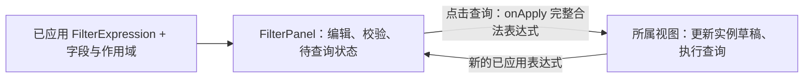

# Wow 视图引擎过滤器组件设计

日期：2026-09-05。本轮细化 RecordView 的过滤器交互，用户已确认“点击查询后统一生效”。组件使用相同编辑能力服务分析筛选与仪表盘筛选项，查询执行与条件绑定仍由所属视图处理。本文补充 [总体设计](2026-09-05-wow-view-engine-design.md)；视觉样式遵循 [UX 方向](2026-09-05-wow-view-engine-ui-design.md)，逐个控件打磨。

## 1. 职责与输入输出

过滤器帮助用户表达“要找哪些记录”，不负责执行请求、操作业务记录或保存视图。

`FilterPanel` 为组件入口。`value` 是当前已应用的 `FilterExpression`；字段与作用域元数据决定可选字段、操作和类型；`mode` 与模式变更回调管理编辑方式；扩展和视图上下文沿用总体设计。`querying` 与查询错误来自所属视图，组件不自己创建 Wow 客户端。

组件通过 `onApply(expression)` 发布一次完整、合法的条件。所属视图同步接受条件并更新传回的 `value`，随后执行异步查询；查询失败通过查询状态反馈，不作为输入校验失败回滚条件。组件通过 `onPendingChange(boolean)` 通知宿主是否存在未提交修改，供保存和另存入口使用。

筛选项编辑器使用 `FilterEditorProps`：`onChange(node)` 只更新面板缓冲；未设置值是合法状态，保留字段与操作，不报必填错误。已填写但格式错误的输入用 `onValidityChange(false)` 报告，同时保留原始输入。参与查询的节点有效且整棵树通过结构、作用域和能力检查后，面板才能触发 `onApply`。

需要值的过滤器在值未设置时不生成查询谓词；全部过滤器均未设置时使用 `MATCH_ALL`。高级模式先排除未设置值的条件以及因此没有有效子条件的容器，再组合剩余表达式，不能在 OR / NOR 中把未设置条件替换为 `MATCH_ALL`。`IS_NULL`、`EXISTS`、`TODAY` 等无需值的操作仍正常生效。未设置不等于显式 `null`、`0`、`false` 或合法的空字符串，按控件与操作的值语义区分。

组合值必须区分完全未设置与部分填写：日期和时间都为空时才取消该筛选；只填写一项时保留输入、显示待查询并提示补全，不能生成 `MATCH_ALL`。枚举值选择器通过可选 `onClear` 提供“清空选择”，清空后保留字段与操作；必选的操作选择器不提供此入口。时间下拉只修改选中的片段，不能因原始文本尚未完成而将其他已填片段重置为零。

组件按表达式结构区分容器与非容器，不能把每个节点都画成一整行表单：

| 组件       | 绑定与职责                                                                         | 布局                                                                           |
| ---------- | ---------------------------------------------------------------------------------- | ------------------------------------------------------------------------------ |
| 字段过滤器 | 一个组件绑定一个确定的字段；接收该字段元数据与当前节点，只编辑允许的操作、值和参数 | 字段名、操作、值及删除入口组成一个完整控件，按内容宽度排列，空间不足时整组换行 |
| 逻辑容器   | `AND`、`OR`、`NOR` 组合子条件，不绑定业务字段                                      | 容纳紧凑子条件与嵌套容器，独立表达组合范围                                     |
| 元素容器   | `ELEMENT_MATCH` 绑定一个集合字段，容纳同一元素作用域内的子条件                     | 集合字段固定显示，子条件在容器内部排列                                         |

字段在添加筛选时选定。字段过滤器不提供更换字段的下拉，也不接受输出另一字段的 `onChange`；需要另一字段时添加对应过滤器。字段绑定来自现有表达式的 `field` 与当前作用域，不在实例 JSON 中重复存储。自定义字段筛选器遵循相同约束；同一 AND 分组的直接条件只允许每个字段出现一次，未设置值也占用字段。OR/NOR、不同分组与元素内部条件独立检查；新增和组合方式切换均不能产生重复字段。

逻辑容器和查询级特殊节点沿用对应的节点编辑契约。标识、删除状态、常量及可跨字段的 `SEARCH` 不能伪装成普通字段过滤器；高级模式通过独立入口编辑它们，保留 Wow 原有结构与全部能力。

## 2. 两种修改状态

| 状态       | 所有者                         | 含义                                       |
| ---------- | ------------------------------ | ------------------------------------------ |
| 待查询     | 过滤器及所属页面的临时 UI 缓冲 | 编辑条件尚未提交，包括未完成输入           |
| 已应用条件 | 视图实例的当前草稿             | 当前请求与按查询范围执行业务操作使用的条件 |
| 已保存配置 | ViewEngine 的实例保存基线      | 与当前实例草稿比较，产生视图 [已编辑]      |

过滤器不再维护一份已保存视图基线。编辑缓冲中的未设置值是合法状态；查询后仍保留对应筛选项，不强制用户删除组件。未设置值不伪造为 Wow 谓词，也不与格式错误的输入、未完成分组混为一谈。临时编辑缓冲不作为另一套持久化查询协议。

用户可以同时看到“待查询”和视图 [已编辑]：例如先查询了一组未保存条件，又开始修改下一组条件。两者分属过滤器和实例名称，不能合并为一个模糊的修改标记。

## 3. 查询、清空和撤销

| 用户操作                          | 输入缓冲                               | 实例条件与请求                                 |
| --------------------------------- | -------------------------------------- | ---------------------------------------------- |
| 添加 / 删除字段过滤器、改操作或值 | 保留编辑，标记待查询                   | 保持已应用条件，不请求                         |
| 查询                              | 整体校验；非法时定位输入，保留全部修改 | 合法后一次性提交，记录分页与游标按总体契约重置 |
| 条件不变时查询                    | 保持条件                               | 允许刷新或重试，不凭空产生 [已编辑]            |
| 清空条件                          | 改为无筛选条件                         | 点击查询后才应用 `MATCH_ALL`                   |
| 撤销筛选修改                      | 恢复当前已应用条件                     | 不查询，不还原整个视图                         |
| 切换简单 / 高级                   | 无损保留当前编辑内容                   | 不查询，不改变视图配置                         |
| 保存视图或另存为                  | 有待查询内容时提示先查询或撤销         | 不静默保存旧条件，不代替用户提交筛选           |

“撤销筛选修改”与“还原更改”含义不同：前者恢复当前已应用的筛选；后者由视图容器恢复整份已保存配置。不能用同一个重置按钮隐含执行两种行为。

查询期间可以继续编辑，新输入继续显示待查询。后续输入不改变已发起请求的条件快照，返回结果也不能覆盖它。再次提交新条件时，由引擎替代旧请求并忽略迟到响应；相同请求仍在进行时避免重复提交。

保存入口由所属视图结合待查询状态与保存权限控制。已填写但格式错误时，不能通过保存、另存、刷新或业务动作间接把旧合法节点当成新条件。清空值后点击查询，应移除原来已应用的对应谓词。按条件导出等业务操作明确使用当前已应用范围；调用方需要新的范围时先查询。

切换视图时，所属页面按实例或面板运行位置保留各自的未提交编辑缓冲，不把它带入另一个实例。隐藏过滤器、收起实例导航、改变容器宽度均不丢失缓冲。身份或租户变化仍按总体契约释放原范围状态。

## 4. 简单模式

“添加筛选”使用锚定按钮的 Popover 浮层，按字段定义的 `group` 分组展示 Checkbox；勾选添加字段条件，取消勾选移除当前组该字段的直接条件。AND 仍禁止重复字段，OR/NOR 通过字段旁的加号添加同字段的更多条件。高级模式在“添加筛选”旁增加图标下拉按钮，提供 AND/OR/NOR 及中文说明，添加到当前分组；这三项不进入字段选择面板，并遵守定义中的操作白名单。浮层不占用页面布局空间，限制宽高并在字段区内部滚动。选择后保持打开，支持连续添加；“完成”或 Esc 关闭并返回触发按钮焦点，也支持点击外部关闭。

以平铺条件组成顶层 AND，不额外显示 AND 文字或条件间的“且”。同一字段只出现一次；区间条件使用该字段的范围操作。新增时从“添加筛选”选择字段，创建后固定显示字段名；操作列表来自这个字段的能力，默认操作选择常用且适合该字段的选项。

编辑操作时重新核对值类型，不兼容的输入停留为待完善状态，不把文本强转为零、日期或布尔值。删除条件只修改缓冲。用户明确清空全部条件时使用 `MATCH_ALL`，不能提交空的 `AND.operands`。

条件显示使用业务名称，实际输出保留定义中的字段路径。简单模式不编辑 OR、NOR 或元素子树；它仍须保留已加载条件中的合法参数，不能因控件未展开参数区而丢失参数。

## 5. 高级模式

使用条件树编辑 AND、OR、NOR。组合选择器以中文分别表达“满足全部条件”“满足任一条件”“全部条件均不满足”，不重复附加 AND 等协议标记。面板内非容器条件保持统一组合，在同一分组中使用等宽网格，空间不足时自动换为单列；删除按钮右对齐。只有容器跨越网格并承担分组层级。独立使用的单字段组件仍按内容宽度排列。简单模式不提供条件操作菜单和前后排序，内置标量值控件不提供“清空”和“特殊值”按钮；删除输入内容保留未设置值，删除整项使用末尾移除按钮。高级模式支持新增、删除和编辑条件或分组，不提供条件或分组的移动功能；节点保留绑定字段与所属作用域。

`ELEMENT_MATCH` 在添加时选择并绑定集合字段，子条件表示同一个元素内的要求。其“添加筛选”入口只提供元素相对作用域内的字段，例如商品明细中的 `quantity`，每个子过滤器也固定绑定自己的字段。不自动拼成根字段路径，也不提供元素内非法的标识、删除状态或全文搜索节点。

完整操作覆盖沿用总体设计与当前 Wow 的 50 个 `FilterOperator`。元数据、删除状态、全文搜索和常量条件按各自节点结构编辑，不能强制塞进单字段三段式控件；宿主提供的定义与能力决定当前页面可用范围。

高级切回简单以当前编辑内容判断。只有普通谓词或平铺 AND 能被无损表示时才切换；存在嵌套、OR、NOR、元素子树或未完成输入时保留高级模式，并显示具体原因。不得自动展开分组或丢弃分支。

## 6. 值控件与扩展

| 输入类别       | 控件与校验重点                                                                     |
| -------------- | ---------------------------------------------------------------------------------- |
| 枚举、布尔     | 单选或多选，标签与实际值分开；`false` 不是未填写                                   |
| 数值、范围     | 保留输入中的字符串；提交时按字段类型转换，区分零、空输入、空值；范围分别编辑上下界 |
| 文本、文本集合 | 文本框或可移除值项；区分空字符串、缺少值和空值；字符串操作保留大小写选项           |
| 日历与相对时间 | 常用日期语义、天数或指定时间；保留时区、日期格式和时间单位，参数可按需展开         |
| 标识与标识集合 | 保留字符串语义，不能把数字形式的标识转为数字                                       |
| 全文搜索       | 搜索内容、字段范围、词项 / 短语模式；缺省字段范围与显式选择分别保留                |
| 无值操作       | 明确显示无需输入；不生成伪造的 `value` 属性                                        |
| 自定义筛选器   | 使用现有扩展注册和解析顺序；合法节点输出、有效性报告、输入保留遵循同一契约         |

默认值服务于新建条件。加载已有条件时保留原有参数、值类型和未显式设置的可选参数，不因重新渲染或切换模式填充另一组默认值。`EQ` / `NE` 的合法空值等参数分支也应能恢复和编辑，不能仅靠操作枚举覆盖证明完整性。

异步候选项加载由自定义编辑器或宿主数据源提供。搜索候选项与真正修改条件值分别处理；加载失败保留当前选择，不能删除原条件。缺失组件或无效输出定位到该条件，不让查询静默略过它。

扩展分为 `render: value` 的值编辑器和 `render: filter` 的完整非容器 UI，两者允许任意 React 实现。完整接口、回调生命周期与远程引用规则见 [自定义筛选器接口契约](2026-09-06-filter-extension-contract.md)。

## 7. 默认组件与主题

默认 React 实现直接组合 shadcn/ui 的 Base UI 预制组件，沿用默认主题和内置 variant / size。字段过滤器以 `InputGroup` 组织固定字段名、操作、值和内部操作；使用对应的 `InputGroupInput`、`InputGroupAddon`、`InputGroupButton`，不为每一段另外制作外框。其他输入、字段添加入口、模式切换、修改标记分别复用适合的 `Select`、`ToggleGroup` 和 `Badge`。单一操作直接显示文字，不做只有一个选项的下拉。

颜色、圆角、字号、控件尺寸及焦点样式优先沿用默认主题，不再单独设计筛选器配色或琥珀色修改标记。自定义样式限于条件组合、内容宽度、换行和容器缩进。主题变量仍按总体设计隔离为 `--fve-*`，由宿主映射 shadcn 的语义变量；使用编译后样式，不要求宿主安装 Tailwind。

`packages/view-engine` 已独立承载 `FilterSelect`、固定字段 `FieldFilter`、`FilterDatePicker`、`FilterTimeInput` 和 shadcn 组合组件。操作、枚举值和组合方式使用 Select；添加字段使用 Popover 内的分组 Checkbox，高级逻辑分组通过 Button Group 中的图标下拉菜单添加；日期使用 Calendar / Popover，时间使用 InputGroup / Popover / Select。时间输入保留未完成文本与小数秒，宿主决定时区、精度和查询生效时机。菜单沿用默认 Neutral 主题、选中勾选和键盘交互，默认 Portal 到 body，并在打开时传递当前主题，避免被宿主容器裁剪。Storybook 的 `View Engine/Date and Time` 直接消费包的公开构建产物，演示日期、时间、手动查询、未完成输入和深浅主题。`FilterPanel` 已实现完整编辑缓冲、编译校验、条件树编辑和扩展隔离；完整 ViewEngine 的实例运行状态仍由后续视图层承载。样式依据：[Input Group](https://ui.shadcn.com/docs/components/base/input-group)、[Select](https://ui.shadcn.com/docs/components/base/select)、[Theming](https://ui.shadcn.com/docs/theming)。

## 8. 组件验证

- 编辑、清空、撤销和模式切换的请求次数保持不变；合法查询只发布一次完整表达式。
- 未设置值不报错、不阻止查询；清空后点击查询移除旧谓词、保留控件，全部未设置时输出 `MATCH_ALL`；无需值的操作与 `0` / `false` / 显式空值仍按协议生效。
- 非法值、未完成分组或扩展报告无效时不提交，不使用旧合法值绕过校验；输入与其他子树保留。
- 检查简单 AND 字段唯一性、OR/NOR 相同字段多条件、嵌套逻辑和元素相对作用域，以及不能无损切回简单的反馈。
- 添加时选字段；已有字段过滤器无字段切换入口；扩展输出其他字段时拒绝提交。两个同字段组件具有独立编辑状态，元素子条件不能越出所属作用域。
- 对 50 个操作和参数分支分别验证控件输入、输出、已有配置恢复；复用现有 Wow 类型与构造函数，例如 `IN` 使用 `filter.isIn`。
- 核对待查询与 [已编辑]、保存保护、查询失败后的重试、查询期间继续输入以及运行位置隔离。
- 输入支持键盘操作与明确标签；中文输入法组合期间的 Enter 不提交查询，错误可被读屏感知并定位到输入。
- 在正常与窄容器、浅色与深色主题检查布局，非容器条件不强制占整行，字段、操作和值始终具有共同视觉边界，不用缩小文字或裁切输入来容纳条件树。

本轮交互示意用于验证手动提交、缓冲状态、控件结构与 Wow 输出。`packages/view-engine` 与 Storybook 已提供实际 React FilterPanel；演示不连接业务服务，也不代表服务端查询验收或完整视图保存流程。
