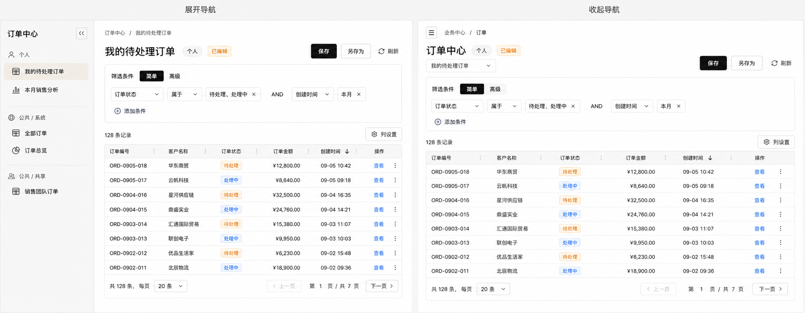
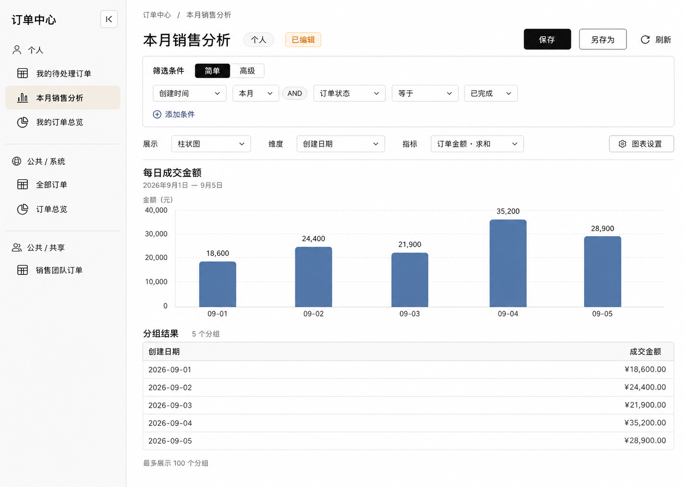
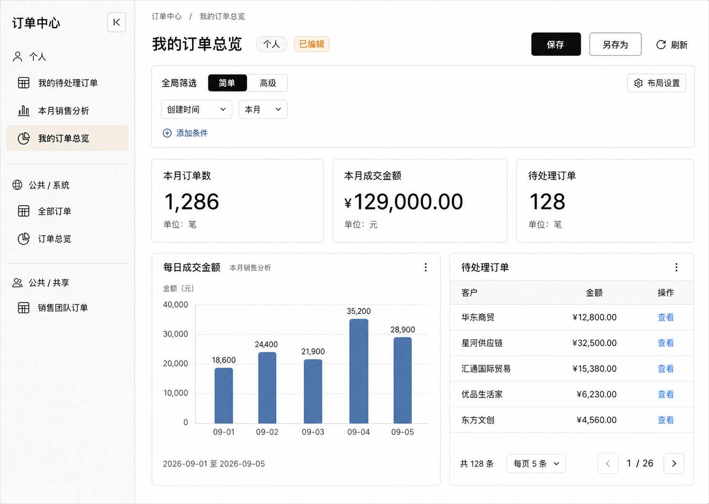
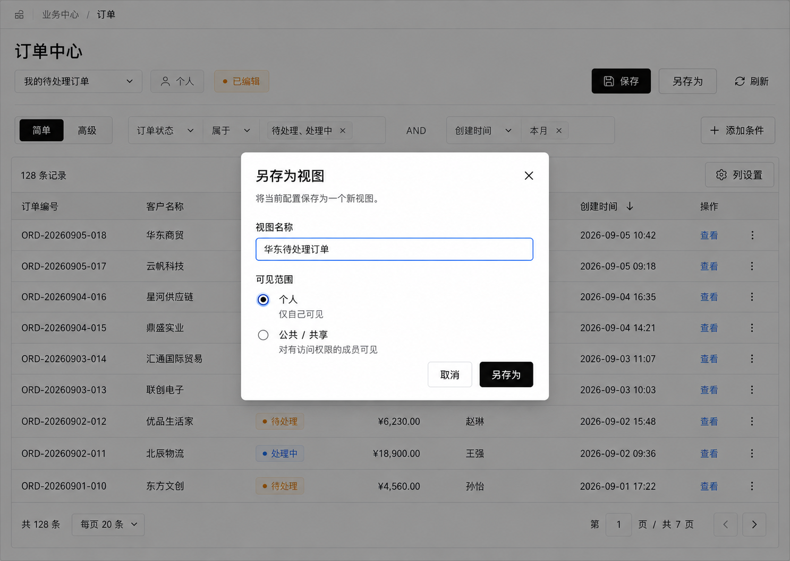

# Wow 视图引擎最终 UI 设计

日期：2026-09-05。布局方向采用用户确认的“2 + 1，2 收缩后显示 1”。本文将该方向应用到记录、分析、仪表盘和另存为。效果图为视觉参考，使用示例数据；交互尚未实现。数据与保存语义遵循 [视图引擎设计](2026-09-05-wow-view-engine-design.md)。

## 1. 同一页面的展开与收起

| 状态 | 实例选择                                                 | 内容区域                                     |
| ---- | -------------------------------------------------------- | -------------------------------------------- |
| 展开 | 左侧约 240px 导航，按个人、公共 / 系统、公共 / 共享分组  | 显示当前实例名称、归属、已编辑状态及视图内容 |
| 收起 | 侧栏完全移除；顶部改为同样分组的实例下拉，并保留展开按钮 | 表格、图表和仪表盘使用释放出的宽度           |

展开时当前实例名称作为内容标题；收起时定义名称作为页面标题，当前实例名称显示在下拉中。归属与 [已编辑] 始终紧邻当前实例名称，不能让用户误以为修改的是整个页面定义。保存、另存为、刷新位于内容标题区右侧。

宽容器初始展开。窄容器暂时使用收起布局，恢复足够宽度后沿用用户原来的展开偏好。收起后不保留图标窄栏。导航展开状态仅保存在当前页面，切换实例时保留；本期不增加跨页面的偏好持久化接口。

导航只控制实例列表的显示位置。一次收起或展开须满足：

- 当前实例 ID、视图形态与实例列表一致；选中项和个人 / 公共分组一致。
- 筛选表达式、简单 / 高级模式、排序、列配置、页码、游标、行选择和草稿保持不变。
- 核心运行对象与面板运行状态继续使用，不重复加载定义或实例，不重新查询。
- [已编辑] 和正在进行的保存状态保持不变。
- 可通过键盘操作收起 / 展开按钮；按钮具备明确名称和 `aria-expanded`。收起时焦点移到对应的展开入口。

效果图两侧采用同一筛选模式以强调导航变化。高级筛选展开时也能收起侧栏，不会自动降为简单模式。

## 2. 记录视图

界面顺序为：实例栏 → 筛选 → 记录数量与列设置 → 表格 → 分页。

简单筛选横向紧凑排列，空间不足时换行，条件之间固定 AND。高级筛选在表格上方展开完整条件树，为逻辑分组、元素谓词及参数编辑保留宽度；筛选区域的展开状态与实例导航独立。界面使用业务字段名和操作文案，不要求用户编写 JSON。

表格使用清晰的表头与轻量行分隔，金额右对齐、数值等宽，状态通过有文字的色彩标签表示。单元格和操作单元格沿用统一行高及焦点规则，实际内容由扩展组件提供。

列设置通过表格右上方浮层提供，包含列名称、顺序调整、显隐和宽度；顺序调整同时提供键盘入口。表头可拖动列边缘设置宽度。显示顺序与数据排序分开表达：表头排序箭头表示 Wow 查询排序。

收起导航不会增删列或改写已保存宽度。容器不足以容纳列时，表格内容区横向滚动，实例选择与保存操作仍可访问。首期不展示尚未交付的卡片切换入口。

## 3. 分析视图

保留统一的实例栏与筛选区，内容区依次展示分析配置、图表和分组结果。配置使用业务名称表达展示类型、维度、指标与聚合方式；分组结果显示服务端返回的别名对应名称。

表格、指标卡、柱状图和折线图属于分析实例的展示配置。指标卡需要无分组查询；界面在切换时明确说明这一要求，不静默清空用户的分组。图表与结果表使用同一批聚合结果，不对截取的分组结果另算全局总额。

示例图展示 9 月 1 日至 5 日的分组结果，日期与数值均为视觉演示数据。展示上限保留在结果区，不占据页面标题或主操作位置。

## 4. 仪表盘

保留统一的实例栏，将筛选区标明为全局筛选。内容按网格排列独立面板：指标卡、分析图表、记录列表。边框用于区分独立面板，面板内不再套多层装饰容器。

全局条件仅叠加到已绑定面板的查询，不改变子实例保存基线。指标由各自查询产生。图中指标卡与图表可以展示相关数值，但不能据此把分组结果求和当作指标查询的实现。

布局设置提供面板引用、位置和跨度调整。面板内容可带自己的配置入口和分页；不显示尚未承诺的拖放手柄。收起页面导航时只重新分配可用宽度，不写回布局、不重建面板、不触发查询。

面板加载、空结果、查询失败和无权访问分别在对应面板内显示。其他面板继续显示；局部重试只重试该面板。

## 5. 保存与另存为

| 状态或操作     | 默认 UI                                                            |
| -------------- | ------------------------------------------------------------------ |
| 已保存         | 实例名旁无 [已编辑]；有保存权限时，保存按钮禁用，另存为仍可用      |
| 配置改变       | 实例名旁显示琥珀色 [已编辑]；保存使用当前草稿                      |
| 正在保存       | 按钮显示保存中并阻止重复写入；配置仍可继续编辑                     |
| 保存成功       | 依照实际草稿与保存基线决定是否去掉标记；保存期间的后续修改继续保留 |
| 保存失败或冲突 | 在保存操作附近显示可读错误，保留草稿与 [已编辑]                    |
| 无保存权限     | 不提供覆盖保存操作；有另存权限时仍提供对应另存入口                 |

另存对话框包含视图名称和可见范围，默认个人；有权限时提供公共 / 共享，不提供系统分类。名称必填，校验信息位于对应字段下方。取消或关闭只关闭对话框。提交期间不允许重复创建。

保存反馈只使用业务文案。正式保存、另存期间继续编辑、切换视图以及失败后的草稿处理，以核心设计的保存契约为准。效果图不代表已连接远程保存接口。

## 6. 视觉与交互验收

- shadcn/ui + Base UI；浅色中性背景、深色主操作、轻分隔。默认控件圆角约 6px，正文 14–16px；表格默认行高约 48px。通过 `--fve-*` 语义变量表达样式，支持宿主主题。
- 状态必须有文字，不能只靠颜色；弹层具有标题，键盘焦点可见且关闭后返回触发入口。
- 三类视图保持同样的实例选择、保存与导航开关位置。图中业务中心等面包屑属于宿主示例，不新增 lib 管理的业务导航。
- 逐项验证侧栏与下拉等价、宽窄容器切换、简单 / 高级筛选、列宽 / 顺序 / 显隐、保存与另存。收起操作前后检查请求次数和草稿一致。
- 图表、表格和面板可适配容器；不能用截断内容隐藏实例选择、保存按钮或关键错误。
- 后续交互实现须在浏览器中按相同状态检查，并与这些效果稿比较。当前交付为视觉设计，不能把图片检查或仓库单元测试视为 UI 交互已经通过验证。
