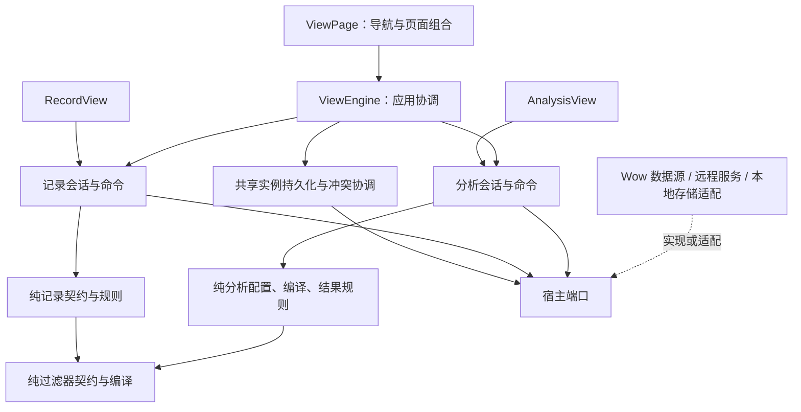
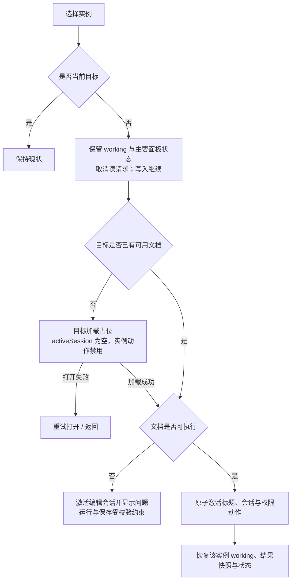

# View Engine 与 AnalysisView 重设计

> 实施状态更新（2026-09-11）：架构及分析视图已落地，后续图表/API 扩展与完整验收见[当前交付证据](../reviews/2026-09-11-analysis-delivery-validation.md)。以下“尚未实现”“待评审”和“本轮”等状态描述保留原始设计阶段语境，不能作为当前实现状态。公开 API 以源码及当前包文档为准。

日期：2026-09-10。状态：重新设计提案，待用户评审；未实现、未提交。

总体架构入口：[View Engine 总体架构](2026-09-10-view-engine-overall-architecture.md)。本文保留分析功能与交互细节，统一保存语义、原子状态提交与接口边界遵循总体架构，不作为平行方案。

用户已明确：该能力尚未发布，无需向后兼容。允许直接重构公共契约并同步修改全部使用点，不保留旧 API、旧配置格式或过渡入口。

本文集中替代 `2026-09-10-analysis-view-design.md` 及各轮审查中的候选方案，避免把互相矛盾的补充当作同一规格执行。历史审查保留为问题证据。当前实现基线为 `f01d2dd0`，本轮未重新运行历史测试。

## 1. 从用户任务与事实出发

用户保存视图，是为了复用一份配置；用户运行分析，是为了获得某一时刻、某一统计口径的结果。配置保存成功不意味着查询成功，查询成功也不意味着配置已经保存。两者应独立。

记录用户主要查看和处理业务对象；分析用户主要定义口径并解读聚合结果。两者共享实例身份、归属和保存协议，各自拥有编辑、查询和结果语义。页面导航只是组合方式，不能决定领域边界。

五条不变量：

1. 所有需要恢复的输入都有明确所有者，输入未完成不等于没有修改。
2. 任何结果都属于某次查询及其执行上下文，不能根据当前编辑内容重新解释旧结果。
3. 持久化响应只确认提交时的内容，不能覆盖之后的编辑。
4. 远端版本变化必须被识别；重新加载不能自动授权覆盖同事的内容。
5. 实例级语义错误只阻断该实例；不可信身份与越权问题不能通过容错掩盖。

首版保持范围：筛选、TERMS/HISTOGRAM/DATE_HISTOGRAM、COUNT/SUM/AVG/MIN/MAX、聚合结果表、实例保存与恢复。首个实例由宿主提供，图表、仪表盘、下钻、表达式指标与聚合数组展开编辑不在首版。

## 2. 现状判断与方案取舍

保留：Wow 查询 DSL 和客户端；过滤器组件配置/纯编译模式；只读快照、生命周期代次、请求令牌；实例归属与权限、CAS 和创建幂等回执；Base UI/shadcn 控件、主题、格式化以及现有记录表格/卡片。

拆解：共享保存和加载直接依赖 RecordSession/RecordQueries；依靠组件挂载生命周期保存输入；语义校验失败导致整页不可用；把重新加载后的远端基线和整份本地配置强行组合；将业务操作和页面选中 ID 隐式绑定。

上一轮已用当前组件/引擎和受控宿主复现：未确认文本丢失、冲突恢复提交旧配置、单个失效实例阻断健康实例。前两轮分别执行了 47 条、40 条既有针对性绿测以及失败反例，覆盖不同集合，不累计为完整验收。

| 路线                                     | 判断                                                       |
| ---------------------------------------- | ---------------------------------------------------------- |
| 在现有 ViewEngine 各处增加 analysis 分支 | 改动表面较小，但保存、状态和 UI 会继续携带记录假设，不采用 |
| 独立复制分析引擎及持久化                 | 初期隔离快，但版本冲突、权限和恢复将维护两份，不采用       |
| 共享实例协调 + 独立领域会话              | 复用真实共性，隔离不同语义，统一公开契约，采用             |

不建设任意视图插件框架。record 与 analysis 是本次真实存在的两种职责，不预置 dashboard 或未来视图注册生命周期。

## 3. 四层架构

| 层     | 职责                                                                  | 依赖约束                                             |
| ------ | --------------------------------------------------------------------- | ---------------------------------------------------- |
| 领域层 | 定义/实例契约、记录和分析配置、纯校验/编译、结果身份、编辑内容比较    | 无 React、DOM、网络与存储；不依赖应用协调层          |
| 应用层 | 工作区导航、实例状态、领域会话、查询/写入生命周期、冲突协调           | 使用领域能力与宿主端口；UI 不参与协调                |
| 适配层 | Wow 数据源、远程/本地实例服务、React 编辑器注册                       | 翻译外部边界；不复制业务规则                         |
| 展示层 | ViewPage 导航与公共动作、RecordView、AnalysisView、状态/错误/冲突呈现 | 读取只读快照，调用绑定实例的命令；不直接修改状态仓库 |

图中是职责，不是一框一个类。`contracts/` 存放跨类型身份与宿主端口；`engine/` 管理共享生命周期；`record/`、`analysis/` 各自包含明确区分的纯逻辑、会话和 React 组件；`filter/` 保持独立；`components/ui` 与 `lib` 提供不含业务会话的基础能力。没有兼容层或旧格式投影。

约束：analysis 不导入 record；共享持久化不读取 pagination、dimensions、metrics；领域纯编译不调用宿主；React 不触达 SessionStore。记录/分析的共同数值格式化或表格原语移至中性模块后复用，不从记录会话中绕路调用。

共享管理器维护身份、保存版本、写入过程与导航；具体会话维护编辑及查询语义。通过组合入口绑定两种类型的纯验证、内容提取与会话恢复操作；不在各服务内重复 switch(kind)。只读发布可使用现有订阅/快照机制，但不能让共享 patch 自动调用记录专属 deriveSession。

每实例只有一份权威快照与 SessionStore 原子提交入口。业务模块拥有变化规则而非独立存储写入权；保存/恢复一次语义操作涉及的基线、工作内容、校验和操作状态必须在同一次提交发布，不能用多个 Store 相互订阅拼接一致性。

## 4. 定义、实例和宿主的边界

### 定义

规范化定义描述同一逻辑数据源的公共字段与过滤能力，以及 record、analysis 能力块，至少有一种。record 块包含完整 rowKey、布局和记录操作；analysis 块包含分组/指标许可、时间语义、查询限制和默认展示。纯分析定义不提供伪造 rowKey。

一份定义只有一个清楚的数据范围；记录和分析如果实际查询不同实体或不同权限范围，应分别使用定义，不通过共享一个页面掩盖差异。宿主负责数据范围、字段权限与服务器执行。界面声明的函数许可不证明业务口径正确，例如多币种金额不能由格式化替代换算。

### 实例

实例是可保存文档：公共身份/归属/版本 + kind + 该 kind 的组件配置。查询、rows、执行错误和 UI 展开状态不持久化。配置使用稳定组件协议名称、ID、JSON 属性和绑定；分析输出 alias 在条目创建时生成，名称与 alias 分离。

传输 DTO、可编辑文档与可执行计划是不同概念。结构可理解但语义失效的文档可打开修复，不强断言成合法计划。未知协议名称保留原属性，不静默替换成内置组件。

### 宿主

沿用 definition、instance、preference、permission、resolveSource 的职责。写入继续使用 revision，创建继续使用 requestId。aggregate 直接复用 Wow API 的参数与 AbortController；仅分析源只需 aggregate，记录源按记录配置提供 paged/cursor。

跨类型权限投影以可信实例身份和归属为依据；业务字段授权仍在服务器。权限接口直接接收已验证的身份元数据，不能要求 blocked 配置先伪装成完整可执行记录。无法确定的动作默认不可用，查询与写入均在调用边界复核。

## 5. 一套公开契约与生命周期

直接重构 ViewEngine、ViewHost、ViewDefinition、ViewInstance 的公开含义。ViewEngine 是唯一的跨类型协调入口；ViewDefinition 只接受第 4 节的公共元数据与能力块；ViewInstance 是 RecordViewInstance | AnalysisViewInstance 判别联合。删除仅为保持旧 record 类型而设计的泛型默认值、旧扁平定义转换和旧状态返回投影，不另建 ViewWorkspace/WorkspaceHost 等平行概念。

ViewEngine 负责加载、导航、保存与实例管理；记录分页/选择和分析运行/编辑通过绑定实例身份与会话代次的类型专属命令访问。引擎公共表面不集中堆放所有类型的业务操作。取得及调用类型专属命令时都验证实际 kind，不向分析会话提供记录方法。

ViewPage 使用单一 engine 接入方式，负责页面组合而不自行创建第二个引擎。React 的 useViewEngine 生命周期入口创建、加载和释放引擎，在访问范围或定义身份变化时重建；同一引擎也可由非 React 宿主直接管理。独立 RecordView/AnalysisView 消费各自绑定实例的会话与命令，不依赖混合导航存在。具体签名在实施计划中用消费样例落实；这些是拟议 API，尚未实现。

允许运行的 kind 由定义能力块决定，所有加载及写入回包检查 kind、definitionId 和定义能力。无需为旧入口另外维护 acceptedKinds 配置；TypeScript 判别联合负责静态收窄，运行时验证负责 JSON 边界。

同步重写全部调用点、测试、Storybook、LocalStorageViewHost、文档和 API references，只维护一套配置格式与状态形状。开发期旧缓存使用明确的存储命名空间区分，并提供显式重置入口；不自动迁移、也不静默删除旧数据。

消费验收包括按新契约接入的记录页、只有 aggregate 的分析页、混合 ViewPage，检查类型、返回字段、生命周期及错误拒绝路径。测试保留应成立的业务不变量与恢复能力，移除仅锁定旧签名或旧耦合的断言，不用机械更新期望值掩盖数据损失。

## 6. 统一会话事实与分析运行过程

| 事实    | 含义与所有者                                                                 |
| ------- | ---------------------------------------------------------------------------- |
| saved   | 最后确认的服务器文档与 revision；共享持久化负责确认规则                      |
| working | 当前完整编辑内容和原始输入；类型会话负责编辑规则                             |
| result  | 最近成功请求的结果与来源；类型会话负责查询与结果规则，记录和分析结构各自定义 |

这些事实由同一 SessionStore 持有并原子发布，不分别建立可写存储。分析 result 包含 query/schema/rows/定义语义身份和本地请求/接收时间；记录 result 包含实际查询范围、行数据及记录分页语义。

queryAttempt 保存当前或最近一次请求的配置快照、计划、令牌及状态；writeAttempt 保存提交内容、基线 revision/requestId 和已知/未知结果。它们是过程记录，不是可被反复编辑的第四份配置。

由内容关系推导：

- 未保存：working 的持久化内容与 saved 不同，包括尚未完成的原始编辑；不可保存输入显示具体错误。
- 结果未更新：working 编译后的查询身份与 result 不同，或 working 无法编译。展示改名/列宽变化不改变查询身份。
- 查询失败：来自最近 queryAttempt，不因旧 result 存在而消失。
- 保存中/冲突/待核对：来自 writeAttempt 或明确的冲突状态，与查询状态独立。

记录与分析统一移除“必须先查询才能保存”的限制；分析不维护独立 applied 配置。保存时验证当前 working，直接提交其快照，不发查询；运行时编译当前 working 并查询，不自动保存。配置合法但后端暂时失败时，用户仍能保存它。记录分页与业务操作绑定实际已查询范围，不能因保存了新筛选而重新解释旧 rows。此设计取代旧保存规则，尚待实现验证。

输入协议：行内多值文字、数值半成品等在每次变更时进入 working 的组件原始属性；解析/编译失败是可解释状态，不清空内容。明确带确认/取消的弹层可以局部暂存，取消确实丢弃该弹层修改；未取消的行内输入不能因切换而丢失。保存只接受验证通过的配置，序列化不能悄悄删除用户可见内容。

## 7. 命令与时序

### 运行

“运行分析”始终针对点击时的 working。先验证、编译成 query/schema，捕获不可变快照，再执行 aggregate。请求期间可继续编辑；结果只能结合捕获的 schema 展示，若当前 working 已变，标明结果对应上次运行配置。

同一查询正在执行时禁用重复运行；working 已变且有效时允许“运行新配置”，取消旧读请求并替换令牌。取消不证明服务器已停止，导航与新操作无需等旧请求结束。任意响应仍需核对 scope、实例身份、定义语义代次和请求令牌。

查询失败保留 working 和可展示的 result，并显示失败的执行口径。工作内容未改变时提供“重试”；已改变时主入口为“运行当前配置”，不隐式重试用户已经放弃的口径。认证/授权失败由宿主明确分类时，停止展示不再获准读取的数据，不能一律当成网络失败保留。

### 保存

保存验证 working，捕获 submitted 和 saved.revision。保存期间继续编辑时，成功响应只更新 saved 到已确认的 submitted，新 working 保留。若用户没有继续编辑，两者自然相等；否则仍显示未保存。响应校验 kind/身份/内容，不把异常回包当作成功。

同一实例的保存、另存、重命名、删除与远端重载互斥；未决写入核对复用原操作身份。普通编辑和分析查询可与保存并行，其他实例可独立操作。本地“恢复已保存配置”在写入/重载/未知结果待核对期间不可用，防止用户基于即将改变的 saved 误判恢复结果。UI 与命令入口都检查互斥，不能只靠按钮 disabled；不引入全工作区串行锁。

系统模板只能按权限另存；同一逻辑另存保持同一 requestId。结果未知时保留原提交与恢复入口，不能拿新 working 重放原 requestId。原实例被删除后仍保留已有未知创建的恢复条目，沿用现有核对能力。

### 冲突

重新加载得到 remote 后，比较内容而非仅 revision。远端可编辑内容未变时可前移版本；本地未改时可采用远端；working 已与 remote 相同则确认该基线。其余两边内容存在分歧时不自动解除冲突，也不自动把整份本地 config 放在新 revision 上。

冲突面板提供：使用最新版本、另存我的配置、有权限且明确选择时用我的配置覆盖。以只读摘要分别说明本地与远端内容，不做首版通用合并编辑器。“覆盖”提交面板展示过的 revision，若远端再次变化则重新冲突。使用最新版本会放弃本地编辑，按钮含义明确并要求确认；仅查看最新内容不放弃编辑。

记录与分析的“恢复已保存配置”都只将 saved 复制为 working，明确撤销未保存输入，不自动查询；有修改时确认撤销。没有独立的“撤销到上次已应用”动作。后续查询由明确的记录/分析查询命令触发。

## 8. 加载与故障隔离

ViewEntry 的加载生命周期分为 opening、loaded、open-error。身份可信且文档结构可解释时，loaded 始终具有编辑会话，持有 saved/working、校验问题及适用的 query/write 状态；只有编译成功才产生可执行计划。blocked 是 working 当前不可执行的展示状态，不是另一套会话生命周期。未知远程目标不能伪造完整实例。

边界校验依次处理：列表形状/身份/归属 → 实例文档结构 → kind/字段/组件/业务能力语义。重复 ID、错误 definitionId、非法归属等继续阻断不可信输入；已确定身份且结构可解释的字段下线、组件缺失或函数禁用归属单个 blocked 实例。健康实例继续可用。

blocked 页面展示具体问题，保留原始配置供修复；修复后整体验证才能运行/保存。默认实例 blocked 时打开它的修复页，不偷偷显示另一份统计；用户可主动选择其他实例。未知结构不能进入普通编辑器，提供重新加载与宿主支持信息，不反复自动查询。

修复草稿与正常编辑使用同一按实例持有的 working，切换后保留。用户把合法 working 暂时改成无效输入时，不重建编辑会话，也不自动撤销此前合法请求；其结果仍绑定原提交快照，当前输入错误独立显示。未知结构对应文档错误，不能通过空配置替换后冒充已恢复。

## 9. 导航与生命周期

导航是个人/公共两组，系统为公共实例来源标记；每项显示实例名与记录/分析类型，必要时显示未保存、保存失败或待核对。侧栏与下拉使用同一投影；收起后仍能发现非当前实例的未决写入数量。

操作绑定实例 ID 与会话代次，不靠执行时读取“当前选中 ID”决定对象。目标 opening/open-error 时没有可操作的旧 activeSession；A→B→C 的 B 迟到回包不能改变 C。保存结果只更新归属实例，已切换时不抢回页面；另存成功自动进入副本仅限没有更新导航意图的情况。

record 使用明确的切回查询/选择清理策略，保存不因此依赖查询。analysis 首次打开合法、未编辑的已保存实例自动运行一次；同一引擎内回访恢复明确带时间与口径的历史结果，用户点击“运行分析”更新。回访不偷偷运行未保存工作内容，保存未运行的新配置后回访也不自动运行；刷新页面建立新会话后按首次规则执行。

分析不再把旧结果称作“命中当前有效缓存”：它始终是一份历史请求快照。内置 aggregate 仅返回行数组，因此记录本地请求发出/响应接收时间，UI 显示“结果接收于…”并说明来自当前设备，不冒称服务端执行时间。TODAY 等按原表达式和时区展示，并说明相对时间按服务端执行时解析；不根据浏览器日期推导已确认的绝对统计范围。宿主若明确提供可靠服务端元数据才可按其来源展示。首版不新增时间接口、边界定时器或通用缓存框架，不承诺实时统计。

首次加载与回访都先尊重实例的配置/最近请求错误。初次请求因切换取消且没有结果时，返回显示可运行状态，不持续自动重试。同一实例最新请求失败时错误不会因恢复 result 消失。

主要面板开合按实例保存在页面 UI 状态中；菜单、弹层关闭；不承诺任意第三方私有 state、焦点位置和滚动位置恢复，不隐藏挂载所有视图保活。内存结果可在规模需要时丢弃并提示重新运行，不能同时丢草稿。访问范围变更销毁整个工作区；浏览器刷新恢复已保存文档，内存草稿不保证恢复。

页面离开提示由宿主路由接入汇总的未保存/未决写入状态，示例必须演示。ViewPage 内切换无需确认，因为工作内容仍归原实例持有；关闭页面的实际拦截能力不能由库对任意路由作保证。

## 10. UI 与 UX

页面是稳定的导航框架加类型专属工作区。头部的固定区域负责业务定义名称、实例名称、类型、保存/另存及实例管理；另有类型专属主操作位置，由 RecordView/AnalysisView 提供。保存只呈现一次，不能把记录批量操作、分页或全局刷新语义直接套给分析。

### 分析工作区

1. 分析头部：在类型专属主操作位置放“运行分析”，展示运行状态与未保存标记；固定区域的保存是独立次操作。两个按钮都明确说明作用，系统模板显示“另存为”，下方不重复设置一套保存按钮。
2. 可折叠配置区：筛选条件 → 分组维度 → 统计指标 → 排序与返回上限，按用户定义口径的顺序排列。首次进入展开；手动折叠状态随实例保留。
3. 结果区：先显示“结果接收时间 + 本次请求的口径摘要”，再显示表格；本地时间不作为服务端执行范围证据。修改后展示“配置已修改，以下仍是上次运行结果”；保存后仍未运行则显示“配置已保存，结果尚未更新”。

配置不是隐藏在多个模态框里的表单。添加维度后就在原行设置字段与粒度；添加数值指标后就在原行设置字段、函数、名称；COUNT 显示“记录数”。每项可移除、上移、下移，不需要拖拽依赖。时区和上限出现在统计口径中，不藏进开发配置说明。

无结果时解释如何开始；首次加载显示骨架；运行中旧结果仍可阅读，但标明历史状态；查询失败与配置错误分别展示。自动执行失败不连带页面导航失败。配置错误定位到具体项并可从问题摘要聚焦控件。

### 结果表

维度列在前、指标列在后，首版所有查询输出可见；支持显示名称、列宽与顺序。别名和查询语义不随改名变化。复用中性表格原语/格式化，分析结果不承载业务 rowKey、记录选择或行操作。

只有 working 的查询身份与 result 一致、配置有效、当前没有读请求时，表头排序可用；排序更新 working 并立即运行，同时形成未保存配置变化。存在未运行的查询修改时禁用表头排序，并提示先运行当前配置或恢复已保存配置。列宽/纯显示名称修改不发查询。

配置区始终显示当前排序项，并提供修改/清除；这些操作只编辑 working，再由“运行分析”执行。表头只是快捷入口。即使新排序查询失败且历史表头禁用，用户仍能单独清除排序，保留其他尚未保存的维度/指标。

结果 schema 保留运行时身份与类型。仅当统计身份完全一致时可用 working 的展示名称/列设置覆盖显示；否则历史结果使用其自己的标签，不把 SUM 的旧值标成 AVG。

0 原样显示，null 显示“—”并解释无有效值，空数组显示“无聚合结果”。表格说明最多返回 N 行，不宣称全部分组，不从截取结果推导总额或全量排名。记录表排序/分页不受分析规则影响。

### 冲突与修复

冲突页或面板同时展示“我的配置”和“服务器最新配置”的只读摘要，先说明差异再给操作；普通重载不隐式覆盖任何一方。blocked 实例修复页显示具体缺失字段/组件，可直接定位修改；系统不可覆盖时只给按权限允许的另存路径。

只读指无服务器写权限，不自动禁止定义允许范围内的本地临时分析。本地编辑、运行、恢复不依赖 save/saveAs 授权；服务器仍负责查询访问控制。无保存权限时显示“临时修改”，保留恢复入口，离开提示只提供保留当前页面或放弃临时修改，不要求完成无法执行的保存。

### 可访问性与窄屏

按容器宽度收起导航，配置纵向重排，只有结果表局部横向滚动。类型与状态有文字，不只靠颜色/图标。键盘完成实例选择、配置、运行、保存和错误恢复；下拉关闭回到触发器，侧栏选择保持导航焦点，提供进入工作区入口。异步返回不抢焦点，加载状态使用克制的播报。

## 11. 分析协议与统计可信度

维度/指标注册把编辑与纯编译绑定到同一协议名称，生命周期内固定。组件产出受限的一个分组或指标贡献，核心校验字段、函数、alias、返回类型和限制；不能注入任意查询绕过定义。

聚合编译同时产出 Wow AggregationQuery 和结果结构 schema；保存的是原组件配置。schema 包含稳定 alias、维度/指标角色、值类型、可空性和格式，请求快照另记录展示名称、定义语义身份、时区与本地请求/接收时间，并区分宿主明确提供的服务端元数据。定义/注册语义改变须显式重建或重新加载并验证，不靠修改 React props 热替换编译规则。

日期分桶要求明确有效时区，过滤与分桶一致；HISTOGRAM interval 是有限正数；函数许可显式声明；COUNT 无字段，数值函数仅作用于允许的数值字段。默认限制对齐当前本地 Wow 契约：维度 32、指标 64、有效排序 32、默认行数 100、最多 10000，宿主可收紧；上线仍需验证目标后端版本。

sort 引用输出 alias，显式排序加维度稳定补序不得超限，无分组不排序。结果必须为行对象数组，预期 alias 必须是自有属性且完整，额外字段不展示。按字面 alias 读取，维度元组身份包含值类型；重复组元组使本次结果失败。

COUNT 为非负安全整数；数值为有限 number 或 null；时间桶为 epoch milliseconds 并按定义时区显示。无分组允许零或一行，超过一行拒绝；有分组允许空集。结构错误整次拒绝，不展示部分校验通过的数据，不把 null/缺失/空集补成零。

字段许可只证明可用的技术操作。业务单位、金额精度、源记录范围与指标命名由宿主提供合理定义；前端不自动修复多币种统计或推断真实字段权限。

## 12. 首次使用与集成验收

宿主启用 analysis 时提供至少一份合法分析初始实例或可另存系统模板，合法默认指标让用户首次即可得到有意义结果。只读用户可查看模板，具备创建权限的用户另存个人实例；不在首版新建空白跨类型向导。

若声明了分析能力却无分析实例，集成诊断明确指出初始配置缺失，现有记录功能保持可用；不能把 Storybook 私有预置状态当成正常接入证明。

验收以普通消费应用覆盖：打开 → 选择模板 → 修改口径 → 运行 → 保存/另存 → 刷新页面 → 重开；另测未运行直接保存、失败后保存，以及独立分析页与混合 ViewPage。

## 13. 实施顺序与完成标准

1. 公共契约消费验证：先证明统一契约下的记录、纯分析、混合接入及运行时 kind 准入，再按职责重组实现。
2. 共享生命周期提取：修复输入丢失和冲突覆盖，建立 blocked 隔离，保留既有请求重入/未知写入测试。
3. 分析纯逻辑与会话：组件配置 → 计划/schema → 结果校验；验证保存、运行与导航互相独立。
4. 默认 UI 与混合页面：真实用户闭环、窄屏、焦点、错误/冲突恢复；最后整理适配和公共文档。

关键验收：未确认文字切换不丢；修复草稿切换后恢复；运行期间输入变无效仍保留原请求快照；A→B→C 乱序不串页；保存中继续编辑不被覆盖；同事改指标而本地只改名称不能静默回退；单个失效实例不阻断健康实例；同口径刷新失败仍显示错误；旧结果不能驱动新口径排序，失败排序可单独撤销；保存不触发查询；查询不触发保存；跨日相对条件不把浏览器时间冒称为服务端执行范围。

运行受影响包/依赖构建、类型与纯逻辑/组件测试、Storybook 浏览器测试、无隐式源码别名的消费验证；中英文 README/wiki 与 API references 同步，wiki build 通过。提交前按根规则通过 pnpm test:unit。实际后端与浏览器证据未取得时分别标明，不以模型推演替代。

无需新增包、修改根 tsconfig 或引入状态/缓存/图表依赖；如果消费验证证明必须修改构建或增加依赖，单独提出具体变更。用户已授权本未发布能力直接调整 API，不再把兼容性或旧调用迁移设置为额外审批门槛。当前仅生成设计文档，未开始上述实现。

## 14. 设计自审与待确认变化

本提案统一采用 saved/working/result，取消上一版分析 applied 副本；所有实例保存/运行独立；历史结果有明确执行口径；记录保留自身查询范围与分页语义。SessionStore 原子提交，冲突选择和 blocked 修复集中协调，分析组件不重复实现。只有 ViewEngine 一套协调入口、一套定义格式与实例契约，没有兼容分支。

用户已确定无需兼容，公共契约可直接重构。此前重设计中待评审的产品取舍仍为：分析合法配置可直接保存而无需先运行；回访分析展示历史快照并由用户明确运行更新，不自动执行未保存或已保存但未运行的修改。

同日无兼容层对抗审查已将编辑会话与可执行性分开，补齐独立排序恢复入口和时间元数据来源，见 [验证报告](../reviews/2026-09-10-unified-redesign-adversarial.md)。本轮 31 条现有操作/恢复针对性测试通过；新方案仍未实现，规格修订不等同于运行验收。
