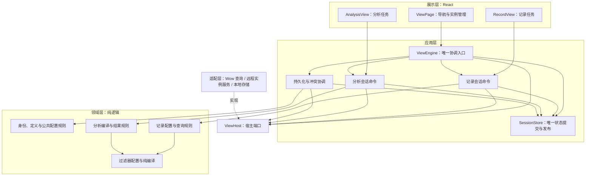

# View Engine 总体架构

> 实施状态更新（2026-09-11）：架构及分析视图已落地，后续图表/API 扩展与完整验收见[当前交付证据](../reviews/2026-09-11-analysis-delivery-validation.md)。以下“尚未实现”“待评审”和“本轮”等状态描述保留原始设计阶段语境，不能作为当前实现状态。公开 API 以源码及当前包文档为准。

日期：2026-09-10。状态：总体架构提案，待评审；尚未实现。

生产工程细化：[接口、恢复、资源与验收契约](2026-09-10-view-engine-production-contracts.md)。[TypeScript 接口样例](assets/view-engine/production-contract.ts)及[消费探针](assets/view-engine/production-contract.examples.ts)是可静态检查的设计资产，不是已实现或已导出的包 API。

本文件是后续实施的总体架构入口。`2026-09-10-analysis-view-redesign.md` 提供分析功能与 UI 细节；其中公共保存语义、状态所有权与默认运行策略以本文件为准。历史审查报告只提供问题证据，不是平行实施方案。用户已明确尚未发布，无需兼容旧 API 或旧配置格式。

## 1. 目标与边界

构建一个以 Wow 查询能力为基础的视图库：宿主声明可用数据和能力，用户保存自己的视图配置，记录与分析各自执行查询，React 提供可独立使用的默认界面。

首版只支持 record、analysis。记录包含已有表格/卡片、筛选、排序、分页及业务操作；分析包含筛选、分组、指标与聚合结果表。实例管理、归属、持久化、权限与恢复统一实现。仪表盘、图表、下钻、任意视图插件系统不提前纳入。

总体原则：一份配置只有一个权威编辑状态；一次结果对应一份确定请求；一次写入确认一份确定提交；一次状态变化通过唯一提交入口发布。页面结构不能决定查询或持久化规则。

## 2. 总体结构与依赖

箭头表示调用或依赖，不表示每个框都要增加一个类。适配层通过宿主端口被注入；领域纯逻辑不反向依赖应用层、React 或适配实现。

| 模块         | 拥有的规则                                                  | 不能承担的职责                                        |
| ------------ | ----------------------------------------------------------- | ----------------------------------------------------- |
| 公共契约     | 身份、归属、定义公共部分、错误与宿主协议                    | 记录分页或分析公式                                    |
| ViewEngine   | scope/definition 生命周期、导航意图、实例协调、类型命令绑定 | 直接实现所有业务编辑操作                              |
| SessionStore | 完整实例快照、原子提交、只读订阅                            | 编译公式、发网络请求、自动运行记录派生逻辑            |
| 持久化协调   | 保存/另存/管理写入、revision/requestId、冲突与未知结果核对  | 读取 filterPending、pagination、dimensions 或 metrics |
| 记录模块     | 记录工作配置、查询/游标、选择、汇总、记录操作范围           | 分析结果身份与指标含义                                |
| 分析模块     | 分析工作配置、query/schema 编译、聚合结果身份与校验         | 实现第二套保存或冲突协议                              |
| 过滤器模块   | 可恢复编辑属性、纯编译、默认编辑器                          | 判断当前记录/分析实例如何保存                         |
| React 组件   | 显示状态、收集输入、调用明确命令                            | 直接写 Store、拼装服务查询、处理 CAS 合并             |

建议目录为 `contracts/`、`engine/`、`record/`、`analysis/`、`filter/`、`adapters/`、`components/`、`lib/`。record/analysis 内显式区分纯模型、应用命令与 React 文件。通用格式化与表格原语放在中性模块；analysis 不导入 record，record 不导入 analysis。聚合两种类型的联合与分派在组合边界定义，不让公共基础类型反向依赖会话实现。

## 3. 五个核心概念

| 概念           | 含义                                                 | 生命周期             |
| -------------- | ---------------------------------------------------- | -------------------- |
| ViewDefinition | 同一逻辑数据源能使用哪些字段、操作和视图能力         | 引擎加载范围         |
| ViewInstance   | 用户保存的实例文档：身份、归属、版本、kind、组件配置 | 宿主持久化           |
| ViewSession    | 当前编辑与操作状态，包括无效但可修复输入             | 当前引擎内按实例持有 |
| QueryPlan      | 对某一份有效配置编译得到的请求与结果契约             | 一次运行的不可变输入 |
| ResultSnapshot | 某次请求取得的数据、结构及来源说明                   | 会话内历史观察       |

ViewInstance 是结构上可解释的记录/分析判别联合；语义是否有效由验证决定。能够打开文档不意味着能执行它，不能执行也不意味着必须丢弃编辑状态。

定义使用公共元数据和 record/analysis 能力块，至少包含一种。record 块完整声明 rowKey、布局和操作；analysis 块声明维度/指标许可、时区与资源限制。一个定义对应一个清楚的数据范围，不能用同一页面混淆不同实体或访问范围。

组件配置保存原始属性、稳定 ID、协议名称和绑定；分析 alias 与显示名称分离。保存文档不包含 rows、错误、请求句柄、页面展开状态或编译后的第二份查询。

## 4. 统一状态模型

每个已加载、结构可解释的实例只有一份权威快照：

| 内容                    | 说明                                                 |
| ----------------------- | ---------------------------------------------------- |
| saved                   | 最后确认的服务器文档及 revision                      |
| working                 | 当前可编辑文档，包含需要恢复的原始输入               |
| validation              | 当前 working 的结构/语义问题；能否保存或生成计划     |
| result                  | 最近成功结果及其请求/schema/查询身份/本地接收时间    |
| queryAttempt            | 当前或最近查询的提交快照、状态与身份                 |
| writeAttempt / conflict | 写入提交、请求身份、状态，以及需要用户判断的远端分歧 |
| 类型专属运行状态        | 例如记录页码、游标和选择；分析不具有这些字段         |

这些是逻辑字段，不要求建立多份独立 Store。业务模块拥有变化规则，SessionStore 拥有唯一写入权，发布的完整状态只读。

`dirty` 由 working 的持久化内容与 saved 比较产生；结果是否对应当前配置由查询身份比较产生；输入错误、查询失败、写入失败是独立维度，不能压成互斥的全局 status。记录与分析共享事实含义，不强制结果对象同形。

ViewEntry 加载状态仅为 opening/loaded/open-error。loaded 始终保有编辑会话；blocked 是其 working 不可执行的投影。无效输入不重挂载会话，不丢正在使用旧合法计划的请求或历史结果。身份不可信或结构无法解释的文档不能伪装成正常会话。

UI 临时状态另按实例保存主要面板开合；弹层、焦点等留在组件。它不参与 dirty、持久化或业务命令。无需把所有视图隐藏挂载以保留输入。

## 5. 原子提交与异步边界

命令先读取当前快照并检查身份、权限和互斥，再登记操作意图、捕获不可变输入，随后调用外部服务。返回时校验 scope、实例代次、操作令牌及响应契约，再把所有相关字段一次提交。订阅者只能看到提交前或提交后的完整状态。

保存成功时，saved、writeAttempt、冲突标记一次更新；working 保留请求发出后的编辑。采用远端版本时，saved、working 和校验状态一次更新。SessionStore 不通过连发多个局部通知完成一个语义操作。

AbortController、令牌登记等控制句柄留在应用层，不放入持久化文档；其登记/释放必须与可观察状态提交协调。外部回调、abort 和订阅通知都可能重入，跨越这些边界后重新核对所有权。原子提交不能取代请求令牌。

同实例的保存、另存、重命名、删除、远端重载互斥；编辑与查询可与保存并行；不同实例可独立操作。未知写入结果只能按原操作核对后推进，不用全工作区锁串行化所有实例。

## 6. 保存、查询与恢复协议

### 所有实例统一保存语义

保存当前 working 的有效组件配置，不要求先查询，不触发查询。类型模块生成不可变保存候选并验证；共享持久化协调只处理身份、权限、版本和回执。

查询只生成结果，不自动保存。记录分页和业务操作必须使用实际已查询范围，不能因保存了新筛选而重新解释旧 rows；分析结果同样固定于提交时的 query/schema。

### 命令矩阵

| 命令              | 读取                         | 更新                         | 外部调用                               |
| ----------------- | ---------------------------- | ---------------------------- | -------------------------------------- |
| 编辑配置          | working、定义                | working、validation          | 无                                     |
| 保存              | 有效 working、saved.revision | writeAttempt；成功后 saved   | save                                   |
| 另存              | 有效 working、目标归属       | 创建过程、新实例身份与 saved | create，固定 requestId                 |
| 运行/查询         | 有效 working                 | queryAttempt；成功后 result  | 类型专属查询                           |
| 记录翻页/业务操作 | 已查询范围与记录运行状态     | 记录运行状态/结果            | 对应记录能力                           |
| 恢复已保存配置    | saved                        | working、validation          | 无；随后查询由用户或明确的记录命令触发 |
| 核对/重新加载     | 保存基线、working、原操作    | 新远端事实或显式冲突         | load/list 或原幂等操作                 |
| 切换实例          | 目标身份、现有会话           | 导航状态，取消旧读意图       | 必要时加载目标；写入继续               |

恢复会放弃工作修改，含义明确并确认；写入/重载/未知结果期间不可用。只读用户可进行允许的临时编辑、查询和恢复，本地恢复不依赖服务器写权限。

### 冲突处理

比较旧保存基线、本地 working 和最新远端文档。远端内容未变可前移版本；本地未变可采用远端；双方内容相同可确认该基线。其他分歧保持冲突，不自动把整份本地配置置于新 revision 上。

用户选择使用最新版本、另存自己的配置，或有权限时明确覆盖。覆盖仍对用户看到的远端 revision 做 CAS。未知结果与版本冲突区分：前者先确认原操作是否生效，不能换新 requestId 重试创建。首次不实现通用三方合并编辑器。

## 7. 公共接口边界

| 入口                      | 消费者与职责                                                        |
| ------------------------- | ------------------------------------------------------------------- |
| ViewEngine                | 唯一无 React 协调入口，管理加载、导航、保存与实例管理               |
| 类型专属命令入口          | 绑定实例 ID 与代次，分别暴露记录操作和分析操作；调用时再次核对 kind |
| ViewHost                  | 定义/实例/偏好/权限服务及运行时数据源解析                           |
| useViewEngine             | React 生命周期管理，按访问范围/定义身份创建、加载和释放引擎         |
| ViewPage                  | 接收 engine，组合导航、管理及类型视图，不自行创建第二个引擎         |
| RecordView / AnalysisView | 接收各自绑定实例的会话与命令，可独立嵌入                            |

类型准入来自定义能力，所有 JSON 回包做运行时检查。没有兼容泛型默认值、旧扁平定义转换或第二套 Workspace API。具体接口已有 TypeScript 设计样例与 11 条错误用法探针，按仓库 Bundler 模式检查通过；它不替代实现与发布产物消费验证，不能以 `any`、强断言或把所有业务方法集中到引擎表面代替设计。

ViewHost 是依赖倒置端口，实际适配器复用 Wow QueryApi、服务端实例 API 或 LocalStorageViewHost。浏览器 UI 不持有数据库/HTTP 细节，宿主负责真实权限、数据范围与事务约束。权限投影基于可信身份元数据，不依赖失效配置先成为可执行对象。

## 8. UI/UX 信息架构

混合页面沿用个人/公共分组，系统为来源标记；实例名旁显示记录/分析类型。侧栏与窄屏下拉使用同一导航投影。打开未知目标时 activeSession 为空，避免在 B 标题下操作 A；失效实例进入可编辑修复状态，健康实例仍能打开。

| 区域   | 表达内容                                                       |
| ------ | -------------------------------------------------------------- |
| 头部   | 定义/实例名称、保存/另存、持久化状态、类型主操作               |
| 配置区 | 当前 working 及输入问题；分析按筛选、维度、指标、排序/上限组织 |
| 结果区 | 请求口径、接收时间、运行/失败状态、历史结果                    |
| 导航   | 非当前实例的未保存与待处理事项                                 |

分析主操作固定为“运行分析”；保存是独立次操作。结果区只在需要时提示“配置已改变，以下仍为上次结果”；时间来源与相对条件语义进入可访问说明，不堆成全页警告。

排序在配置区有独立修改/清除入口；表头只在当前 working 与 result 查询身份一致时提供快捷运行。排序失败后可以只修复排序，保留其他编辑。展示列宽/顺序与统计查询分开。

固定默认：首次打开合法已保存分析实例运行一次；同一引擎内回访恢复快照，不自动运行工作内容；失败/取消不循环重试。页面刷新建立新会话，按首次规则处理。记录因任务需要采用自己的查询/分页策略，不能重新引入保存前必须查询的约束。

所有结果是请求快照，aggregate 行数组无法证明服务端执行时间。内置 UI 标明本地接收时间，TODAY 等按服务端实际解析，不从浏览器时间伪造绝对范围。宿主提供可信元数据时才按明确来源展示。

输入错误就地修复，版本冲突显示双方只读摘要，未知结果有专门核对入口。异步完成不抢页面或键盘焦点。窄屏纵向排列配置，结果表局部滚动；不隐藏全部组件保活，不把域模型直接变成一排状态徽章。

## 9. 验收与实施次序

1. 用记录、纯分析、混合页面三份公开调用样例落实接口和生命周期。
2. 提取唯一状态提交与共享持久化，先修复已证实的输入丢失、冲突回退及实例级故障隔离。
3. 完成类型会话、纯分析编译与结果校验，证明保存与查询独立。
4. 实现代表性交互，验证桌面/窄屏、键盘、失败恢复、再完成公共文档。

架构验收：修改分析指标不改记录查询；修改保存回执不改两份持久化；类型语义失效不使健康实例消失；每次通知都满足完整状态不变量；核心无 React/DOM 依赖。

行为验收：未完成输入切换保留；保存期间继续编辑；记录/分析都能不查询直接保存；业务动作按真正查询范围执行；晚回包不能覆盖新意图；冲突不静默覆盖；只读恢复；失效实例修复一半切换再返回；排序失败局部修复。

运行受影响构建、类型/单元测试、Storybook 浏览器测试、实际消费及中英文文档构建。提交前通过根目录 pnpm test:unit。真实后端与浏览器证据未取得时单列限制。本轮仅产出架构，不宣称这些验收已经完成。

实施沿用现有依赖与工具，不引入兼容层、任意插件框架、通用状态机框架、缓存服务、后台调度或通用合并编辑器。

## 10. 生产准入状态

架构已经细化到接口草案、操作协议、宿主保证、资源预算、诊断与 UI 验收门槛。类型契约已取得局部静态证据；新内核实现、真实宿主协议、浏览器、性能及 tarball 消费仍待验证。本轮 NodeNext 探针被现有 Wow 类型声明解析阻断，不能宣称该消费模式通过。生产级完成以细化契约中的证据矩阵为准，不以文档篇幅或设计评分代替。
