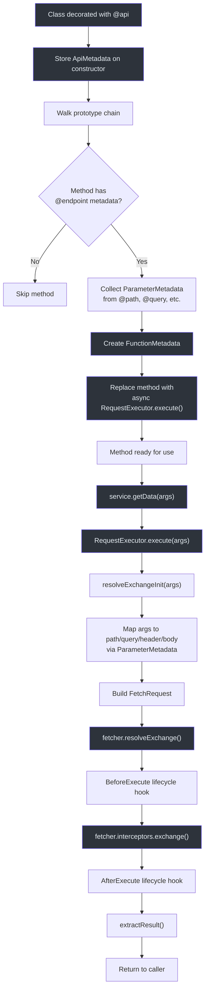
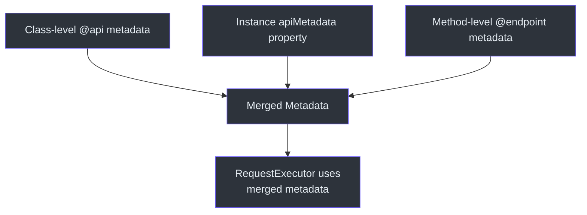
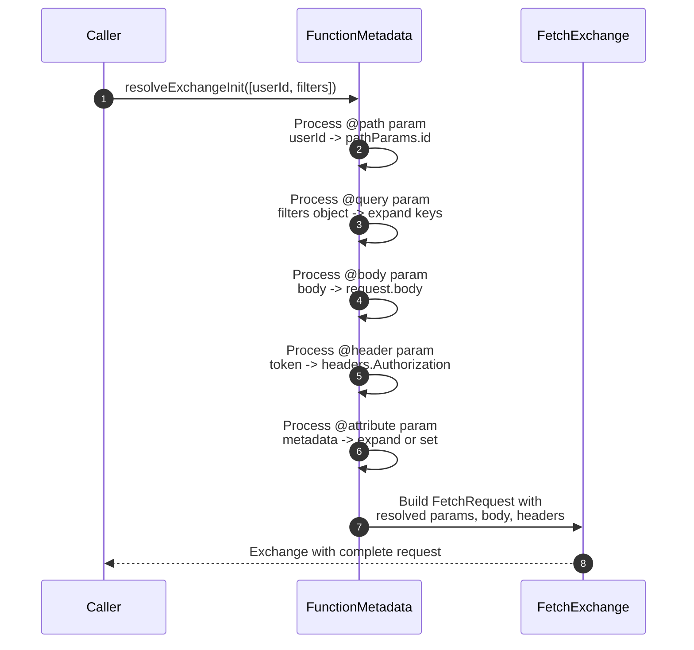

# Decorators API

The `@ahoo-wang/fetcher-decorator` package provides a declarative way to define API service classes using TypeScript decorators. Methods decorated with HTTP verb decorators are automatically replaced with implementations that build and execute HTTP requests.

::: warning Requires reflect-metadata
You must import `reflect-metadata` before using any decorator:

```typescript
import 'reflect-metadata';
```
:::

**Source:** [`packages/decorator/src/index.ts`](https://github.com/Ahoo-Wang/fetcher/blob/main/packages/decorator/src/index.ts)

## Class Decorator

### @api

Defines a class as an API service with shared configuration.

```typescript
@api(basePath?: string, metadata?: ApiMetadata)
```

| Parameter | Type | Default | Description |
|-----------|------|---------|-------------|
| `basePath` | `string` | `''` | URL prefix for all endpoints in the class |
| `metadata` | `Omit<ApiMetadata, 'basePath'>` | `{}` | Shared configuration for all methods |

#### ApiMetadata Properties

| Property | Type | Description |
|----------|------|-------------|
| `basePath` | `string` | URL prefix prepended to all endpoint paths |
| `headers` | `RequestHeaders` | Default headers for all requests |
| `timeout` | `number` | Default timeout in milliseconds |
| `fetcher` | `string \| Fetcher` | Fetcher instance or name (default: `'default'`) |
| `resultExtractor` | `ResultExtractor<any>` | Default result extractor |
| `attributes` | `Record<string, any> \| Map<string, any>` | Shared request attributes |
| `returnType` | `EndpointReturnType` | Return type strategy (`'Result'` or `'Exchange'`) |
| `urlParams` | `UrlParams` | Default URL parameters |

**Source:** [`packages/decorator/src/apiDecorator.ts:40`](https://github.com/Ahoo-Wang/fetcher/blob/main/packages/decorator/src/apiDecorator.ts#L40)

#### Example

```typescript
import 'reflect-metadata';
import { api, get, post, body, autoGeneratedError } from '@ahoo-wang/fetcher-decorator';

@api('/api/v1', {
  headers: { 'Authorization': 'Bearer token' },
  timeout: 5000,
  fetcher: 'myFetcher',
})
class UserService {
  @get('/users')
  getUsers(): Promise<User[]> {
    throw autoGeneratedError();
  }

  @post('/users')
  createUser(@body() user: User): Promise<User> {
    throw autoGeneratedError();
  }
}
```

**Source:** [`packages/decorator/src/apiDecorator.ts:232`](https://github.com/Ahoo-Wang/fetcher/blob/main/packages/decorator/src/apiDecorator.ts#L232)

## HTTP Method Decorators

All method decorators share the same signature:

```typescript
@<method>(path?: string, metadata?: MethodEndpointMetadata)
```

| Decorator | HTTP Method | Description |
|-----------|-------------|-------------|
| `@get` | GET | Retrieve data from the server |
| `@post` | POST | Create new resources |
| `@put` | PUT | Replace existing resources |
| `@del` | DELETE | Remove resources |
| `@patch` | PATCH | Partially update resources |
| `@head` | HEAD | Retrieve headers only |
| `@options` | OPTIONS | Describe communication options |

### MethodEndpointMetadata

Extends `ApiMetadata` without `method` and `basePath`:

| Property | Type | Description |
|----------|------|-------------|
| `headers` | `RequestHeaders` | Endpoint-specific headers (merged with class headers) |
| `timeout` | `number` | Endpoint-specific timeout |
| `fetcher` | `string \| Fetcher` | Endpoint-specific fetcher |
| `resultExtractor` | `ResultExtractor<any>` | Endpoint-specific result extractor |
| `attributes` | `Record<string, any> \| Map<string, any>` | Endpoint-specific attributes |
| `returnType` | `EndpointReturnType` | Return type override |
| `urlParams` | `UrlParams` | Endpoint-specific URL parameters |

**Source:** [`packages/decorator/src/endpointDecorator.ts:33`](https://github.com/Ahoo-Wang/fetcher/blob/main/packages/decorator/src/endpointDecorator.ts#L33)

### Generic @endpoint Decorator

For HTTP methods not covered by convenience decorators:

```typescript
import { endpoint, HttpMethod } from '@ahoo-wang/fetcher-decorator';

@get('/users')
@endpoint(HttpMethod.TRACE, '/trace-endpoint')
traceEndpoint(): Promise<Response> {
  throw autoGeneratedError();
}
```

**Source:** [`packages/decorator/src/endpointDecorator.ts:59`](https://github.com/Ahoo-Wang/fetcher/blob/main/packages/decorator/src/endpointDecorator.ts#L59)

## Parameter Decorators

Parameter decorators specify how method arguments map to HTTP request components.

| Decorator | ParameterType | Description |
|-----------|---------------|-------------|
| `@path(name?)` | `PATH` | Inserts value into URL path placeholder |
| `@query(name?)` | `QUERY` | Appends value as query string parameter |
| `@header(name?)` | `HEADER` | Adds value to request headers |
| `@body()` | `BODY` | Sets the request body |
| `@request()` | `REQUEST` | Pass a complete `ParameterRequest` object |
| `@attribute(name?)` | `ATTRIBUTE` | Adds value to exchange attributes |

**Source:** [`packages/decorator/src/parameterDecorator.ts:199`](https://github.com/Ahoo-Wang/fetcher/blob/main/packages/decorator/src/parameterDecorator.ts#L199)

### Parameter Binding Rules

1. **Name is optional.** If omitted, the parameter name is extracted from the TypeScript function signature via `reflect-metadata`:
   ```typescript
   @get('/users/{userId}')
   getUser(@path() userId: string) { throw autoGeneratedError(); }
   ```

2. **Object expansion.** `@path`, `@query`, `@header`, and `@attribute` support plain objects. Each key-value pair is expanded into individual parameters:
   ```typescript
   @get('/users/{id}/posts/{postId}')
   getUserPost(@path() params: { id: string, postId: string }) { throw autoGeneratedError(); }
   ```

3. **AbortSignal / AbortController.** If an argument is an `AbortSignal` or `AbortController` instance, it is automatically used for request cancellation -- no decorator needed.

**Source:** [`packages/decorator/src/functionMetadata.ts:279`](https://github.com/Ahoo-Wang/fetcher/blob/main/packages/decorator/src/functionMetadata.ts#L279)

### @path

```typescript
@get('/users/{id}/posts/{postId}')
getUserPost(
  @path('id') userId: string,
  @path('postId') postId: string,
): Promise<Post[]> {
  throw autoGeneratedError();
}
```

### @query

```typescript
@get('/users')
searchUsers(
  @query('limit') limit: number,
  @query('offset') offset: number,
): Promise<User[]> {
  throw autoGeneratedError();
}
```

### @header

```typescript
@get('/users')
getUsers(@header('Authorization') token: string): Promise<User[]> {
  throw autoGeneratedError();
}
```

### @body

```typescript
@post('/users')
createUser(@body() user: CreateUserRequest): Promise<User> {
  throw autoGeneratedError();
}
```

### @request

Pass a complete request configuration object:

```typescript
interface ParameterRequest<BODY> extends FetchRequestInit<BODY>, PathCapable {}

@post('/users')
createUsers(@request() req: ParameterRequest): Promise<User[]> {
  throw autoGeneratedError();
}

// Usage:
await service.createUsers({
  path: '/custom-path',
  headers: { 'X-Custom': 'value' },
  body: [{ name: 'John' }],
  timeout: 10000,
});
```

### @attribute

Pass attributes accessible by interceptors:

```typescript
@get('/users/{id}')
getUser(
  @path('id') id: string,
  @attribute('requestId') requestId: string,
): Promise<User> {
  throw autoGeneratedError();
}
```

**Source:** [`packages/decorator/src/parameterDecorator.ts:408`](https://github.com/Ahoo-Wang/fetcher/blob/main/packages/decorator/src/parameterDecorator.ts#L408)

## autoGeneratedError

A placeholder error thrown inside decorated method bodies. The decorator replaces the method implementation at class decoration time, so the body is never executed. The `autoGeneratedError` function exists to satisfy ESLint and TypeScript requirements.

```typescript
import { autoGeneratedError } from '@ahoo-wang/fetcher-decorator';

@get('/users')
getUsers(): Promise<User[]> {
  throw autoGeneratedError();
}
```

**Source:** [`packages/decorator/src/generated.ts:41`](https://github.com/Ahoo-Wang/fetcher/blob/main/packages/decorator/src/generated.ts#L41)

## EndpointReturnType

Controls what decorated methods return.

| Value | Description |
|-------|-------------|
| `EndpointReturnType.RESULT` (default) | Returns the extracted result (e.g., parsed JSON) |
| `EndpointReturnType.EXCHANGE` | Returns the full `FetchExchange` object |

```typescript
@api('/api', { returnType: EndpointReturnType.EXCHANGE })
class ExchangeApi {
  @get('/data')
  getData(): Promise<FetchExchange> {
    throw autoGeneratedError();
  }
}
```

**Source:** [`packages/decorator/src/endpointReturnTypeCapable.ts:14`](https://github.com/Ahoo-Wang/fetcher/blob/main/packages/decorator/src/endpointReturnTypeCapable.ts#L14)

## ExecuteLifeCycle

Interface for hooking into the request execution lifecycle.

```typescript
interface ExecuteLifeCycle {
  beforeExecute?(exchange: FetchExchange): void | Promise<void>;
  afterExecute?(exchange: FetchExchange): void | Promise<void>;
}
```

Implement this interface on your API class to add custom logic before and after interceptor processing:

```typescript
@api('/api/v1')
class LoggingApi implements ExecuteLifeCycle {
  beforeExecute(exchange: FetchExchange) {
    console.log('Request:', exchange.request.url);
  }
  afterExecute(exchange: FetchExchange) {
    console.log('Response:', exchange.response?.status);
  }

  @get('/data')
  getData(): Promise<Data> {
    throw autoGeneratedError();
  }
}
```

**Source:** [`packages/decorator/src/executeLifeCycle.ts:23`](https://github.com/Ahoo-Wang/fetcher/blob/main/packages/decorator/src/executeLifeCycle.ts#L23)

## Decorator Resolution Order



## Metadata Priority

When the same property is defined at multiple levels, the resolution follows this priority (highest last):



## Complete Example

```typescript
import 'reflect-metadata';
import {
  api, get, post, put, del,
  path, query, header, body,
  autoGeneratedError, ExecuteLifeCycle
} from '@ahoo-wang/fetcher-decorator';
import type { FetchExchange } from '@ahoo-wang/fetcher';

interface User {
  id: string;
  name: string;
  email: string;
}

interface UserListQuery {
  page: number;
  limit: number;
  keyword?: string;
}

@api('/api/v1/users', {
  headers: { 'Content-Type': 'application/json' },
  timeout: 10000,
})
class UserApi implements ExecuteLifeCycle {
  beforeExecute(exchange: FetchExchange) {
    console.log(`[UserApi] ${exchange.request.method} ${exchange.request.url}`);
  }

  @get('')
  listUsers(@query() query: UserListQuery): Promise<User[]> {
    throw autoGeneratedError();
  }

  @get('/{id}')
  getUser(@path('id') id: string): Promise<User> {
    throw autoGeneratedError();
  }

  @post('')
  createUser(@body() user: Omit<User, 'id'>): Promise<User> {
    throw autoGeneratedError();
  }

  @put('/{id}')
  updateUser(
    @path('id') id: string,
    @body() user: Partial<User>,
  ): Promise<User> {
    throw autoGeneratedError();
  }

  @del('/{id}')
  deleteUser(@path('id') id: string): Promise<void> {
    throw autoGeneratedError();
  }
}

// Usage:
const userApi = new UserApi();
const users = await userApi.listUsers({ page: 1, limit: 10, keyword: 'john' });
const user = await userApi.getUser('123');
```

## Parameter Type Expansion



## Related Pages

- [Fetcher Client API](./fetcher-client.md) -- Core Fetcher class documentation
- [React Hooks API](./react-hooks.md) -- `createQueryApiHooks` for decorator-based APIs
- [Type Definitions](./type-definitions.md) -- All TypeScript interfaces
- [Testing: Unit Testing](../testing/unit-testing.md) -- Testing decorator-based services
