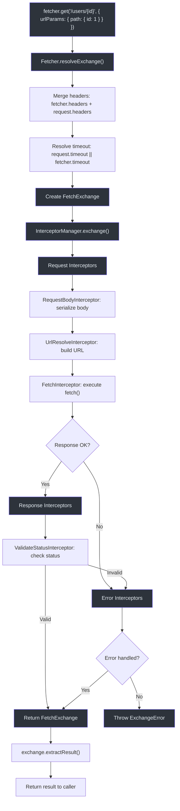
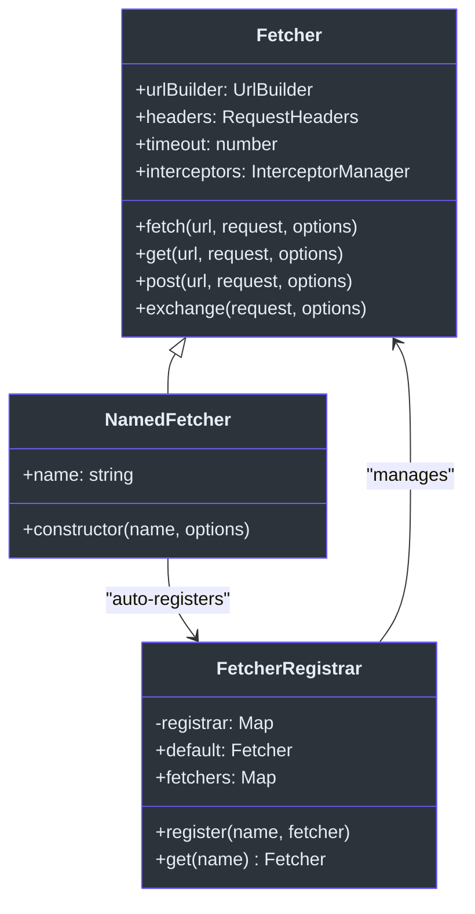
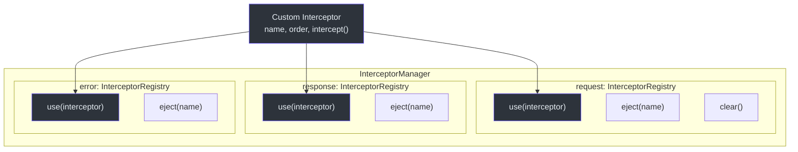

# Fetcher Client API

The `@ahoo-wang/fetcher` package is the foundation of the Fetcher ecosystem. It wraps the native Fetch API with an interceptor-powered middleware pipeline, URL template resolution, timeout handling, and type-safe result extraction.

Source: [`packages/fetcher/src/fetcher.ts`](https://github.com/Ahoo-Wang/fetcher/blob/main/packages/fetcher/src/fetcher.ts)

## Fetcher Class

The main HTTP client class. Supports all standard HTTP methods with automatic header merging, timeout resolution, and interceptor chain processing.

### Constructor

```typescript
new Fetcher(options?: FetcherOptions)
```

**Source:** [`packages/fetcher/src/fetcher.ts:144`](https://github.com/Ahoo-Wang/fetcher/blob/main/packages/fetcher/src/fetcher.ts#L144)

### FetcherOptions

Configuration interface for creating a Fetcher instance.

| Property | Type | Default | Description |
|----------|------|---------|-------------|
| `baseURL` | `string` | `''` | Base URL prepended to all request URLs |
| `headers` | `RequestHeaders` | `{ 'Content-Type': 'application/json' }` | Default headers for all requests |
| `timeout` | `number` | `undefined` | Default timeout in milliseconds |
| `urlTemplateStyle` | `UrlTemplateStyle` | `UrlTemplateStyle.Path` | Style for URL template parameter interpolation |
| `interceptors` | `InterceptorManager` | `new InterceptorManager()` | Custom interceptor manager |
| `validateStatus` | `ValidateStatus` | `status >= 200 && status < 300` | Response status validation function |

**Source:** [`packages/fetcher/src/fetcher.ts:51`](https://github.com/Ahoo-Wang/fetcher/blob/main/packages/fetcher/src/fetcher.ts#L51)

### Instance Methods

| Method | Signature | Description |
|--------|-----------|-------------|
| `fetch` | `fetch<R>(url, request?, options?): Promise<R>` | Primary request method; returns `Response` by default |
| `get` | `get<R>(url, request?, options?): Promise<R>` | GET request (no body) |
| `post` | `post<R>(url, request?, options?): Promise<R>` | POST request |
| `put` | `put<R>(url, request?, options?): Promise<R>` | PUT request |
| `delete` | `delete<R>(url, request?, options?): Promise<R>` | DELETE request (no body) |
| `patch` | `patch<R>(url, request?, options?): Promise<R>` | PATCH request |
| `head` | `head<R>(url, request?, options?): Promise<R>` | HEAD request (no body) |
| `options` | `options<R>(url, request?, options?): Promise<R>` | OPTIONS request (no body) |
| `trace` | `trace<R>(url, request?, options?): Promise<R>` | TRACE request (no body) |
| `exchange` | `exchange(request, options?): Promise<FetchExchange>` | Low-level: returns the full exchange object |
| `request` | `request<R>(request, options?): Promise<R>` | Low-level: request with custom extractor |

**Source:** [`packages/fetcher/src/fetcher.ts:206-500`](https://github.com/Ahoo-Wang/fetcher/blob/main/packages/fetcher/src/fetcher.ts#L206)

### RequestOptions

| Property | Type | Description |
|----------|------|-------------|
| `resultExtractor` | `ResultExtractor<any>` | Function to extract result from the exchange |
| `attributes` | `Record<string, any> \| Map<string, any>` | Shared attributes for interceptor communication |

**Source:** [`packages/fetcher/src/fetcher.ts:94`](https://github.com/Ahoo-Wang/fetcher/blob/main/packages/fetcher/src/fetcher.ts#L94)

## FetchRequest and FetchRequestInit

### FetchRequestInit

Configuration for individual HTTP requests. Extends the native `RequestInit` interface.

| Property | Type | Description |
|----------|------|-------------|
| `method` | `HttpMethod` | HTTP method (GET, POST, etc.) |
| `headers` | `RequestHeaders` | Request-specific headers |
| `body` | `BodyInit \| Record<string, any> \| string \| null` | Request body (objects auto-serialized to JSON) |
| `timeout` | `number` | Request-specific timeout in milliseconds |
| `urlParams` | `UrlParams` | Path and query parameters |
| `abortController` | `AbortController` | Custom abort controller for cancellation |
| `signal` | `AbortSignal` | Abort signal |

**Source:** [`packages/fetcher/src/fetchRequest.ts:112`](https://github.com/Ahoo-Wang/fetcher/blob/main/packages/fetcher/src/fetchRequest.ts#L112)

### FetchRequest

Extends `FetchRequestInit` with a required `url` property.

```typescript
interface FetchRequest<BODY extends RequestBodyType = RequestBodyType>
  extends FetchRequestInit<BODY> {
  url: string;
}
```

**Source:** [`packages/fetcher/src/fetchRequest.ts:176`](https://github.com/Ahoo-Wang/fetcher/blob/main/packages/fetcher/src/fetchRequest.ts#L176)

### UrlParams

| Property | Type | Description |
|----------|------|-------------|
| `path` | `Record<string, any>` | Path parameters for URL template substitution (`{id}` or `:id`) |
| `query` | `Record<string, any>` | Query string parameters appended after `?` |

**Source:** [`packages/fetcher/src/urlBuilder.ts:27`](https://github.com/Ahoo-Wang/fetcher/blob/main/packages/fetcher/src/urlBuilder.ts#L27)

## NamedFetcher

Extends `Fetcher` with automatic registration in the global `FetcherRegistrar`.

```typescript
const apiFetcher = new NamedFetcher('api', {
  baseURL: 'https://api.example.com',
  timeout: 5000,
});
// Later:
const sameFetcher = fetcherRegistrar.get('api');
```

**Source:** [`packages/fetcher/src/namedFetcher.ts:38`](https://github.com/Ahoo-Wang/fetcher/blob/main/packages/fetcher/src/namedFetcher.ts#L38)

A default `fetcher` instance is pre-created and exported:

```typescript
import { fetcher } from '@ahoo-wang/fetcher';
fetcher.get('/users');
```

**Source:** [`packages/fetcher/src/namedFetcher.ts:89`](https://github.com/Ahoo-Wang/fetcher/blob/main/packages/fetcher/src/namedFetcher.ts#L89)

## FetcherRegistrar

Registry for managing multiple named Fetcher instances.

| Method | Signature | Description |
|--------|-----------|-------------|
| `register` | `register(name, fetcher): void` | Register a fetcher by name |
| `unregister` | `unregister(name): boolean` | Remove a registered fetcher |
| `get` | `get(name): Fetcher \| undefined` | Retrieve a fetcher by name |
| `requiredGet` | `requiredGet(name): Fetcher` | Retrieve or throw if not found |
| `default` (getter) | `get default(): Fetcher` | Get the default fetcher |
| `default` (setter) | `set default(fetcher)` | Set the default fetcher |
| `fetchers` | `get fetchers(): Map<string, Fetcher>` | Copy of all registered fetchers |

**Source:** [`packages/fetcher/src/fetcherRegistrar.ts:41`](https://github.com/Ahoo-Wang/fetcher/blob/main/packages/fetcher/src/fetcherRegistrar.ts#L41)

## InterceptorManager

Manages the three-phase interceptor pipeline: request, response, and error.

| Property | Type | Description |
|----------|------|-------------|
| `request` | `InterceptorRegistry` | Request-phase interceptors |
| `response` | `InterceptorRegistry` | Response-phase interceptors |
| `error` | `InterceptorRegistry` | Error-phase interceptors |

### InterceptorRegistry Methods

| Method | Signature | Description |
|--------|-----------|-------------|
| `use` | `use(interceptor): boolean` | Add an interceptor (by unique name) |
| `eject` | `eject(name): boolean` | Remove an interceptor by name |
| `clear` | `clear(): void` | Remove all interceptors |
| `intercept` | `intercept(exchange): Promise<void>` | Execute all interceptors in order |

**Source:** [`packages/fetcher/src/interceptorManager.ts:48`](https://github.com/Ahoo-Wang/fetcher/blob/main/packages/fetcher/src/interceptorManager.ts#L48)

## Result Extractors

Functions that transform a `FetchExchange` into the desired return type.

| Extractor | Return Type | Description |
|-----------|-------------|-------------|
| `ResultExtractors.Exchange` | `FetchExchange` | Returns the full exchange object |
| `ResultExtractors.Response` | `Response` | Returns the raw Response |
| `ResultExtractors.Json` | `Promise<any>` | Parses response as JSON |
| `ResultExtractors.Text` | `Promise<string>` | Returns response as text |
| `ResultExtractors.Blob` | `Promise<Blob>` | Returns response as Blob |
| `ResultExtractors.ArrayBuffer` | `Promise<ArrayBuffer>` | Returns response as ArrayBuffer |
| `ResultExtractors.Bytes` | `Promise<Uint8Array>` | Returns response as Uint8Array |

**Source:** [`packages/fetcher/src/resultExtractor.ts:131`](https://github.com/Ahoo-Wang/fetcher/blob/main/packages/fetcher/src/resultExtractor.ts#L131)

## Error Classes

### FetcherError

Base error class for all Fetcher errors. Extends `Error` with `cause` support and stack trace copying.

**Source:** [`packages/fetcher/src/fetcherError.ts:37`](https://github.com/Ahoo-Wang/fetcher/blob/main/packages/fetcher/src/fetcherError.ts#L37)

### ExchangeError

Thrown when the exchange process fails. Contains the full `FetchExchange` object for debugging.

| Property | Type | Description |
|----------|------|-------------|
| `exchange` | `FetchExchange` | The exchange that caused the error |

**Source:** [`packages/fetcher/src/fetcherError.ts:86`](https://github.com/Ahoo-Wang/fetcher/blob/main/packages/fetcher/src/fetcherError.ts#L86)

### HttpStatusValidationError

Thrown by `ValidateStatusInterceptor` when response status fails validation.

**Source:** [`packages/fetcher/src/validateStatusInterceptor.ts:27`](https://github.com/Ahoo-Wang/fetcher/blob/main/packages/fetcher/src/validateStatusInterceptor.ts#L27)

## FetchExchange

The container object that flows through the interceptor chain.

| Property / Method | Type | Description |
|-------------------|------|-------------|
| `fetcher` | `Fetcher` | The originating Fetcher instance |
| `request` | `FetchRequest` | The request configuration |
| `response` | `Response \| undefined` | The HTTP response (set after fetch) |
| `error` | `Error \| undefined` | Any error that occurred |
| `attributes` | `Map<string, any>` | Shared attributes between interceptors |
| `resultExtractor` | `ResultExtractor<any>` | The result extractor function |
| `ensureRequestHeaders()` | `RequestHeaders` | Lazily initializes request headers |
| `ensureRequestUrlParams()` | `Required<UrlParams>` | Lazily initializes URL params |
| `hasError()` | `boolean` | Whether an error is present |
| `hasResponse()` | `boolean` | Whether a response is present |
| `requiredResponse` | `Response` | Gets response or throws `ExchangeError` |
| `extractResult<R>()` | `Promise<R>` | Applies result extractor (cached) |

**Source:** [`packages/fetcher/src/fetchExchange.ts:105`](https://github.com/Ahoo-Wang/fetcher/blob/main/packages/fetcher/src/fetchExchange.ts#L105)

## Request Flow Diagram



## UrlBuilder

Constructs complete URLs with path parameter interpolation and query string generation.

```typescript
const builder = new UrlBuilder('https://api.example.com', UrlTemplateStyle.UriTemplate);
const url = builder.build('/users/{id}', {
  path: { id: 123 },
  query: { filter: 'active' }
});
// https://api.example.com/users/123?filter=active
```

**Source:** [`packages/fetcher/src/urlBuilder.ts:72`](https://github.com/Ahoo-Wang/fetcher/blob/main/packages/fetcher/src/urlBuilder.ts#L72)

## Usage Examples

### Basic GET Request

```typescript
import { fetcher, ResultExtractors } from '@ahoo-wang/fetcher';

const users = await fetcher.get('/api/users', {}, {
  resultExtractor: ResultExtractors.Json,
});
```

### POST with Body and Path Parameters

```typescript
const fetcher = new Fetcher({ baseURL: 'https://api.example.com' });

const response = await fetcher.post('/users', {
  body: { name: 'John', email: 'john@example.com' },
});
```

### Using URL Parameters

```typescript
const response = await fetcher.get('/users/{id}/posts', {
  urlParams: {
    path: { id: 123 },
    query: { page: 1, limit: 10 },
  },
});
```

### Custom Interceptors

```typescript
const fetcher = new Fetcher({ baseURL: 'https://api.example.com' });

fetcher.interceptors.request.use({
  name: 'AuthInterceptor',
  order: 100,
  intercept(exchange) {
    exchange.request.headers = {
      ...exchange.request.headers,
      Authorization: `Bearer ${getToken()}`,
    };
  },
});
```

### Request Cancellation

```typescript
const controller = new AbortController();
const response = await fetcher.get('/long-request', {
  abortController: controller,
});
// Cancel later:
controller.abort();
```

## NamedFetcher Registration



## Interceptor Registration



## Related Pages

- [Decorators API](./decorators.md) -- Declarative API client via decorators
- [React Hooks API](./react-hooks.md) -- Data fetching hooks for React
- [Type Definitions](./type-definitions.md) -- All TypeScript interfaces
- [Testing: Unit Testing](../testing/unit-testing.md) -- How to test Fetcher clients
