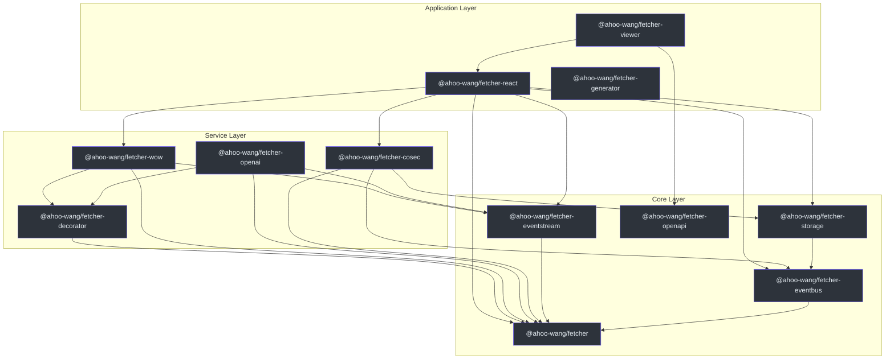
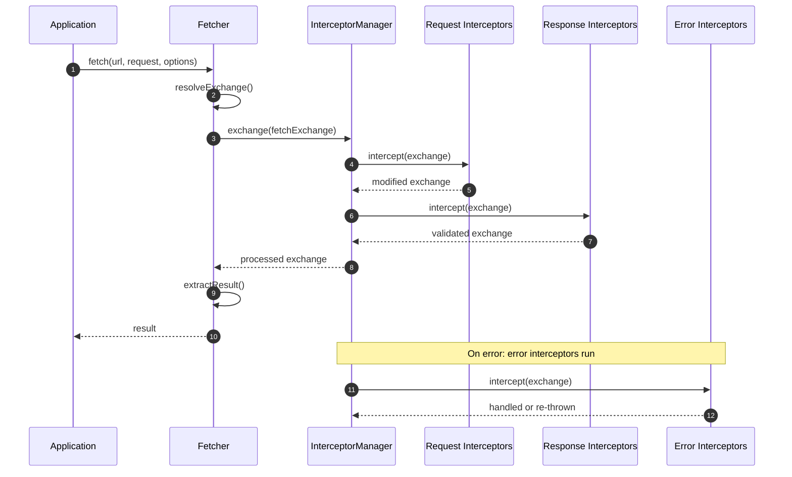
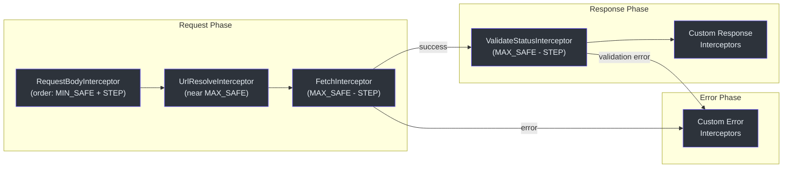

# API Overview

The Fetcher ecosystem exposes APIs across multiple packages, each addressing a specific concern in the HTTP client lifecycle. This page provides a summary of every public API surface with quick navigation links.

## Package API Summary

| Package | npm Name | Primary Exports | Description |
|---------|----------|-----------------|-------------|
| [Fetcher](./fetcher-client.md) | `@ahoo-wang/fetcher` | `Fetcher`, `NamedFetcher`, `FetcherRegistrar`, `InterceptorManager` | Core HTTP client with interceptor pipeline |
| [Decorator](./decorators.md) | `@ahoo-wang/fetcher-decorator` | `@api`, `@get`, `@post`, `@put`, `@del`, `@patch`, `@path`, `@query`, `@header`, `@body` | Declarative API client via decorators |
| [React Hooks](./react-hooks.md) | `@ahoo-wang/fetcher-react` | `useFetcher`, `useQuery`, `useExecutePromise`, `createQueryApiHooks` | React hooks for data fetching |
| [EventStream](#eventstream) | `@ahoo-wang/fetcher-eventstream` | `toJsonServerSentEventStream`, `EventStreamResultExtractor` | SSE and LLM streaming support |
| [EventBus](#eventbus) | `@ahoo-wang/fetcher-eventbus` | `EventBus`, `TypedEventBus`, `ParallelTypedEventBus`, `SerialTypedEventBus` | Type-safe event bus |
| [OpenAPI](#openapi) | `@ahoo-wang/fetcher-openapi` | TypeScript interfaces for OpenAPI 3.x | Spec type definitions |
| [Storage](#storage) | `@ahoo-wang/fetcher-storage` | Storage abstractions | Browser storage wrappers |
| [CoSec](#cosec) | `@ahoo-wang/fetcher-cosec` | Security interceptors | Authentication and authorization |
| [Wow](#wow) | `@ahoo-wang/fetcher-wow` | CQRS command/query clients | DDD + Event Sourcing support |
| [Viewer](#viewer) | `@ahoo-wang/fetcher-viewer` | React + Ant Design components | API documentation viewer |
| [Generator](#generator) | `@ahoo-wang/fetcher-generator` | `fetcher-generator` CLI | OpenAPI to TypeScript code generation |

## Import Patterns

### Core Fetcher

```typescript
import { Fetcher, NamedFetcher, fetcherRegistrar } from '@ahoo-wang/fetcher';
import { HttpMethod, ResultExtractors } from '@ahoo-wang/fetcher';
import type { FetchRequest, FetchExchange, FetcherOptions } from '@ahoo-wang/fetcher';
```

### Decorator

```typescript
import 'reflect-metadata'; // Required before any decorator usage
import { api, get, post, put, del, patch } from '@ahoo-wang/fetcher-decorator';
import { path, query, header, body, request, attribute } from '@ahoo-wang/fetcher-decorator';
import { autoGeneratedError } from '@ahoo-wang/fetcher-decorator';
```

### React Hooks

```typescript
import { useFetcher, useFetcherQuery } from '@ahoo-wang/fetcher-react';
import { useQuery, useExecutePromise, usePromiseState } from '@ahoo-wang/fetcher-react';
import { createQueryApiHooks } from '@ahoo-wang/fetcher-react';
```

### EventStream (side-effect import)

```typescript
// Importing this module patches Response.prototype with eventStream() and jsonEventStream()
import '@ahoo-wang/fetcher-eventstream';
```

### EventBus

```typescript
import { EventBus, ParallelTypedEventBus, SerialTypedEventBus } from '@ahoo-wang/fetcher-eventbus';
import type { EventHandler } from '@ahoo-wang/fetcher-eventbus';
```

## Architecture Diagram



## Request Lifecycle



## Interceptor Pipeline Detail



## Related Pages

- [Fetcher Client API](./fetcher-client.md) -- Core HTTP client class and options
- [Decorators API](./decorators.md) -- Declarative API service definitions
- [React Hooks API](./react-hooks.md) -- Data fetching hooks for React
- [Type Definitions](./type-definitions.md) -- TypeScript interfaces and types
- [Testing Overview](../testing/index.md) -- Testing strategy and tools
