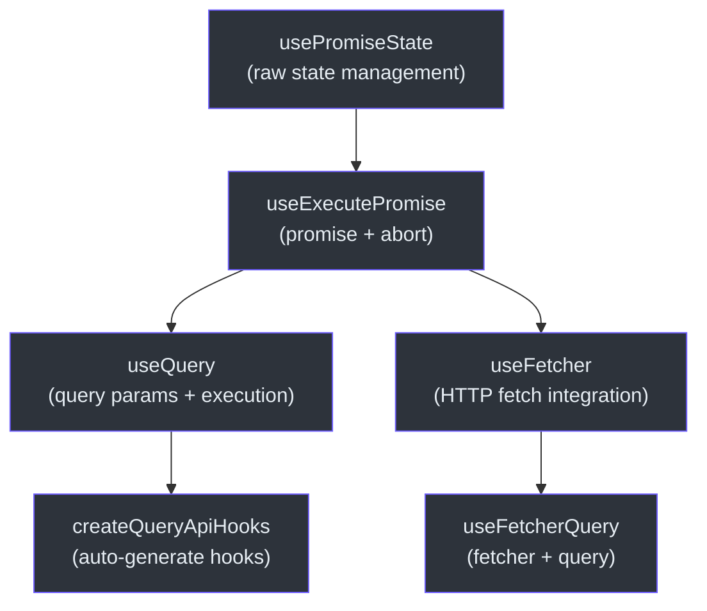
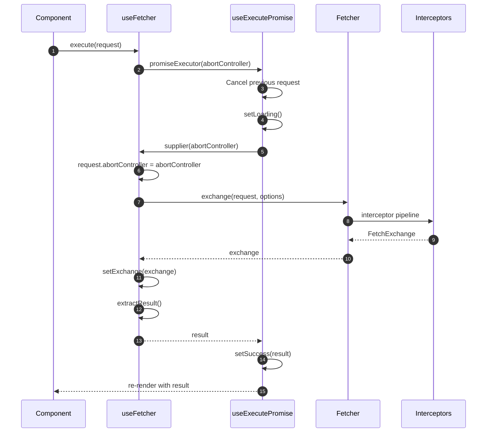
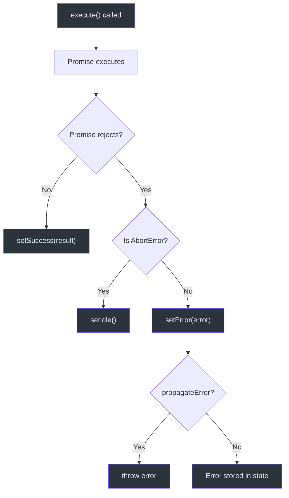

# React Hooks API

The `@ahoo-wang/fetcher-react` package provides React hooks for data fetching, query management, and promise state handling. All hooks are built on top of the core `@ahoo-wang/fetcher` package and provide automatic abort support, race condition protection, and comprehensive state management.

**Source:** [`packages/react/src/index.ts`](https://github.com/Ahoo-Wang/fetcher/blob/main/packages/react/src/index.ts)

## Hook Hierarchy



## useFetcher

The primary hook for HTTP fetch operations. Wraps the Fetcher client with React state management, automatic abort, and race condition protection.

**Source:** [`packages/react/src/fetcher/useFetcher.ts:162`](https://github.com/Ahoo-Wang/fetcher/blob/main/packages/react/src/fetcher/useFetcher.ts#L162)

### Signature

```typescript
function useFetcher<R, E = FetcherError>(
  options?: UseFetcherOptions<R, E>,
): UseFetcherReturn<R, E>
```

### UseFetcherOptions

Extends `UseExecutePromiseOptions` and `RequestOptions`:

| Property | Type | Default | Description |
|----------|------|---------|-------------|
| `fetcher` | `string \| Fetcher` | `fetcherRegistrar.default` | Fetcher instance or registered name |
| `resultExtractor` | `ResultExtractor<any>` | - | How to extract data from the exchange |
| `attributes` | `Record<string, any>` | - | Attributes passed to interceptors |
| `propagateError` | `boolean` | `false` | If true, execute() throws errors |
| `onSuccess` | `(result: R) => void` | - | Callback on successful fetch |
| `onError` | `(error: E) => void` | - | Callback on fetch error |
| `onAbort` | `() => void` | - | Callback when request is aborted |

### UseFetcherReturn

| Property | Type | Description |
|----------|------|-------------|
| `loading` | `boolean` | Whether a fetch is in progress |
| `result` | `R \| undefined` | The fetched data |
| `error` | `E \| undefined` | The error if fetch failed |
| `status` | `PromiseStatus` | Current status: `idle`, `loading`, `success`, `error` |
| `exchange` | `FetchExchange \| undefined` | The full exchange object |
| `execute` | `(request: FetchRequest) => Promise<void>` | Trigger a fetch |
| `reset` | `() => void` | Reset state to idle |
| `abort` | `() => void` | Cancel current request |

### Example

```tsx
import { useFetcher } from '@ahoo-wang/fetcher-react';
import { ResultExtractors } from '@ahoo-wang/fetcher';

function UserProfile({ userId }: { userId: string }) {
  const { loading, result, error, execute } = useFetcher<User>({
    resultExtractor: ResultExtractors.Json,
    onSuccess: (user) => console.log('Loaded:', user.name),
  });

  useEffect(() => {
    execute({ url: `/api/users/${userId}`, method: 'GET' });
  }, [userId]);

  if (loading) return <div>Loading...</div>;
  if (error) return <div>Error: {error.message}</div>;
  return <div>{result?.name}</div>;
}
```

## useFetcherQuery

Combines `useFetcher` with query state management for POST-based queries.

**Source:** [`packages/react/src/fetcher/useFetcherQuery.ts:125`](https://github.com/Ahoo-Wang/fetcher/blob/main/packages/react/src/fetcher/useFetcherQuery.ts#L125)

### Signature

```typescript
function useFetcherQuery<Q, R, E = FetcherError>(
  options: UseFetcherQueryOptions<Q, R, E>,
): UseFetcherQueryReturn<Q, R, E>
```

### UseFetcherQueryOptions

Extends `UseFetcherOptions`, `QueryOptions`, and `AutoExecuteCapable`:

| Property | Type | Default | Description |
|----------|------|---------|-------------|
| `url` | `string` | *required* | The endpoint URL for the POST request |
| `initialQuery` | `Q` | - | Initial query parameters |
| `query` | `Q` | - | Controlled query parameters |
| `autoExecute` | `boolean` | `true` | Auto-execute on mount and query change |
| *(plus all UseFetcherOptions)* | | | |

### UseFetcherQueryReturn

Extends `UseFetcherReturn` and `UseQueryStateReturn`:

| Property | Type | Description |
|----------|------|-------------|
| `execute` | `() => Promise<void>` | Execute with current query as POST body |
| `getQuery` | `() => Q \| undefined` | Get current query parameters |
| `setQuery` | `(query: Q) => void` | Update query (triggers auto-execute if enabled) |
| *(plus all UseFetcherReturn except execute)* | | |

### Example

```tsx
import { useFetcherQuery } from '@ahoo-wang/fetcher-react';

interface SearchQuery { keyword: string; limit: number }
interface SearchResult { items: Item[]; total: number }

function SearchComponent() {
  const { loading, result, error, setQuery } = useFetcherQuery<SearchQuery, SearchResult>({
    url: '/api/search',
    initialQuery: { keyword: '', limit: 10 },
  });

  return (
    <div>
      <input onChange={(e) => setQuery({ keyword: e.target.value, limit: 10 })} />
      {loading && <p>Searching...</p>}
      {result?.items.map(item => <div key={item.id}>{item.title}</div>)}
    </div>
  );
}
```

## useQuery

A general-purpose hook for query-based async operations, decoupled from HTTP specifics.

**Source:** [`packages/react/src/core/useQuery.ts:105`](https://github.com/Ahoo-Wang/fetcher/blob/main/packages/react/src/core/useQuery.ts#L105)

### Signature

```typescript
function useQuery<Q, R, E = FetcherError>(
  options: UseQueryOptions<Q, R, E>,
): UseQueryReturn<Q, R, E>
```

### UseQueryOptions

| Property | Type | Default | Description |
|----------|------|---------|-------------|
| `execute` | `(query, attributes?, abortController?) => Promise<R>` | *required* | The query execution function |
| `initialQuery` | `Q` | - | Initial query parameters |
| `query` | `Q` | - | Controlled query parameters |
| `autoExecute` | `boolean` | `true` | Auto-execute on mount and query change |
| `propagateError` | `boolean` | `false` | If true, execute() throws errors |
| `attributes` | `Record<string, any>` | - | Attributes passed to execute |
| `onSuccess` | `(result: R) => void` | - | Success callback |
| `onError` | `(error: E) => void` | - | Error callback |
| `onAbort` | `() => void` | - | Abort callback |

### UseQueryReturn

| Property | Type | Description |
|----------|------|-------------|
| `loading` | `boolean` | Whether a query is in progress |
| `result` | `R \| undefined` | The query result |
| `error` | `E \| undefined` | Error if query failed |
| `status` | `PromiseStatus` | Current status |
| `execute` | `() => Promise<void>` | Execute with current query |
| `reset` | `() => void` | Reset state to idle |
| `abort` | `() => void` | Cancel current query |
| `getQuery` | `() => Q \| undefined` | Get current query |
| `setQuery` | `(query: Q) => void` | Set query (triggers auto-execute) |

### Example

```tsx
import { useQuery } from '@ahoo-wang/fetcher-react';

function UserComponent() {
  const { loading, result, error, setQuery } = useQuery<UserQuery, User>({
    initialQuery: { id: '1' },
    execute: async (query) => {
      const response = await fetch(`/api/users/${query.id}`);
      return response.json();
    },
  });

  return (
    <div>
      <button onClick={() => setQuery({ id: '2' })}>Load User 2</button>
      {result && <p>{result.name}</p>}
    </div>
  );
}
```

## useExecutePromise

Low-level hook for managing any async operation with abort support.

**Source:** [`packages/react/src/core/useExecutePromise.ts:210`](https://github.com/Ahoo-Wang/fetcher/blob/main/packages/react/src/core/useExecutePromise.ts#L210)

### Signature

```typescript
function useExecutePromise<R, E = FetcherError>(
  options?: UseExecutePromiseOptions<R, E>,
): UseExecutePromiseReturn<R, E>
```

### PromiseSupplier

The type accepted by `execute`:

```typescript
type PromiseSupplier<R> = (abortController: AbortController) => Promise<R>;
```

### UseExecutePromiseReturn

| Property | Type | Description |
|----------|------|-------------|
| `loading` | `boolean` | Whether execution is in progress |
| `result` | `R \| undefined` | The resolved value |
| `error` | `E \| undefined` | The rejected error |
| `status` | `PromiseStatus` | Current status |
| `execute` | `(input: PromiseSupplier<R>) => Promise<void>` | Execute a promise supplier |
| `reset` | `() => void` | Reset to idle |
| `abort` | `() => void` | Cancel current execution |

### Key Behaviors

- **Auto-cancellation**: Calling `execute` again automatically aborts the previous request
- **Race condition protection**: Uses request IDs to prevent stale updates
- **Unmount safety**: Prevents state updates on unmounted components
- **AbortError handling**: AbortErrors transition state to idle, not error

## usePromiseState

Raw promise state management without execution logic.

**Source:** [`packages/react/src/core/usePromiseState.ts:119`](https://github.com/Ahoo-Wang/fetcher/blob/main/packages/react/src/core/usePromiseState.ts#L119)

### PromiseStatus Enum

| Value | Description |
|-------|-------------|
| `IDLE` | No operation in progress |
| `LOADING` | Operation is executing |
| `SUCCESS` | Operation completed successfully |
| `ERROR` | Operation failed |

### UsePromiseStateReturn

| Property | Type | Description |
|----------|------|-------------|
| `status` | `PromiseStatus` | Current status |
| `loading` | `boolean` | Whether status is LOADING |
| `result` | `R \| undefined` | The result value |
| `error` | `E \| undefined` | The error value |
| `setLoading` | `() => void` | Transition to LOADING |
| `setSuccess` | `(result: R) => Promise<void>` | Transition to SUCCESS |
| `setError` | `(error: E) => Promise<void>` | Transition to ERROR |
| `setIdle` | `() => void` | Transition to IDLE |

## createQueryApiHooks

Factory function that auto-generates React hooks from a decorator-based API class. Each method in the API class gets a corresponding `use<MethodName>` hook.

**Source:** [`packages/react/src/api/createQueryApiHooks.ts:174`](https://github.com/Ahoo-Wang/fetcher/blob/main/packages/react/src/api/createQueryApiHooks.ts#L174)

### Signature

```typescript
function createQueryApiHooks<API, E = FetcherError>(
  options: { api: API },
): QueryAPIHooks<API, E>
```

### Example

```typescript
import { createQueryApiHooks } from '@ahoo-wang/fetcher-react';

// Define API using decorators
@api('/users')
class UserApi {
  @get('')
  getUsers(query: UserListQuery, attributes?: Record<string, any>): Promise<User[]> {
    throw autoGeneratedError(query, attributes);
  }

  @get('/{id}')
  getUser(query: { id: string }): Promise<User> {
    throw autoGeneratedError(query);
  }
}

const userHooks = createQueryApiHooks({ api: new UserApi() });

// In components:
function UserList() {
  const { loading, result, setQuery } = userHooks.useGetUsers({
    initialQuery: { page: 1, limit: 10 },
    autoExecute: true,
  });
  // ...
}
```

## Request Lifecycle



## Error Handling Strategy



## Related Pages

- [Fetcher Client API](./fetcher-client.md) -- Core Fetcher class and options
- [Decorators API](./decorators.md) -- Used with `createQueryApiHooks`
- [Type Definitions](./type-definitions.md) -- All TypeScript interfaces
- [Testing: Browser Testing](../testing/browser-testing.md) -- Testing React hooks
