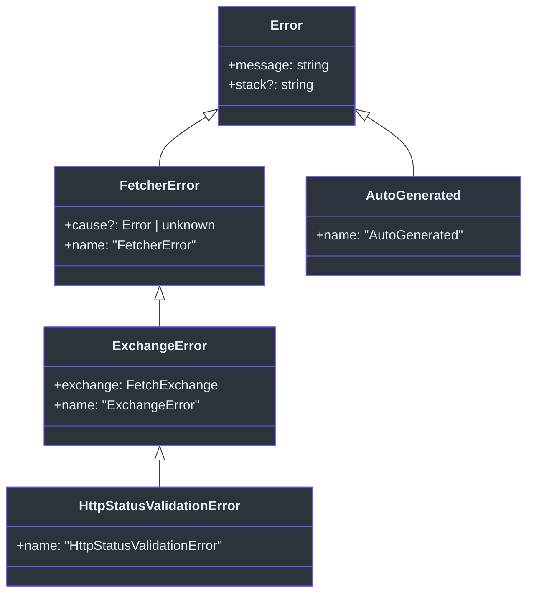
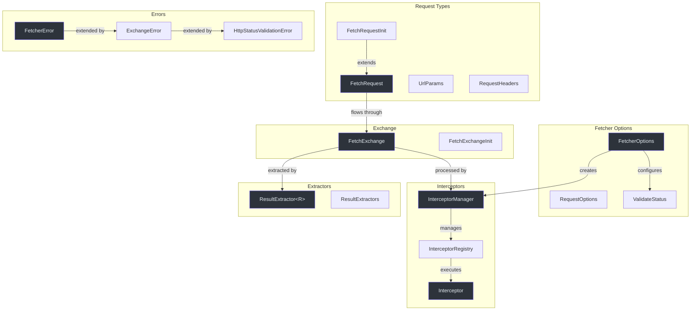
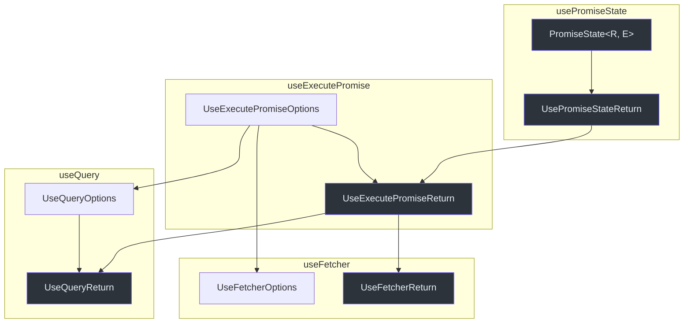

# Type Definitions

This page documents the key TypeScript interfaces and types used across the Fetcher ecosystem. Types are organized by package and category.

## Core Types (`@ahoo-wang/fetcher`)

### Utility Types

**Source:** [`packages/fetcher/src/types.ts`](https://github.com/Ahoo-Wang/fetcher/blob/main/packages/fetcher/src/types.ts)

| Type | Signature | Description |
|------|-----------|-------------|
| `PartialBy<T, K>` | `Omit<T, K> & Partial<Pick<T, K>>` | Make specified keys optional |
| `RequiredBy<T, K>` | `Omit<T, K> & Required<Pick<T, K>>` | Make specified keys required |
| `RemoveReadonlyFields<T>` | Mapped type | Remove all readonly properties |

### NamedCapable

```typescript
interface NamedCapable {
  name: string;
}
```

**Source:** [`packages/fetcher/src/types.ts:141`](https://github.com/Ahoo-Wang/fetcher/blob/main/packages/fetcher/src/types.ts#L141)

### FetcherConfigurer

Interface for objects that configure a Fetcher instance:

```typescript
interface FetcherConfigurer {
  applyTo(fetcher: Fetcher): void;
}
```

**Source:** [`packages/fetcher/src/types.ts:248`](https://github.com/Ahoo-Wang/fetcher/blob/main/packages/fetcher/src/types.ts#L248)

## Request Types

### HttpMethod

```typescript
enum HttpMethod {
  GET = 'GET',
  POST = 'POST',
  PUT = 'PUT',
  DELETE = 'DELETE',
  PATCH = 'PATCH',
  HEAD = 'HEAD',
  OPTIONS = 'OPTIONS',
  TRACE = 'TRACE',
}
```

**Source:** [`packages/fetcher/src/fetchRequest.ts:37`](https://github.com/Ahoo-Wang/fetcher/blob/main/packages/fetcher/src/fetchRequest.ts#L37)

### RequestHeaders

```typescript
interface RequestHeaders {
  'Content-Type'?: string;
  Accept?: string;
  Authorization?: string;
  [key: string]: string | undefined;
}
```

**Source:** [`packages/fetcher/src/fetchRequest.ts:68`](https://github.com/Ahoo-Wang/fetcher/blob/main/packages/fetcher/src/fetchRequest.ts#L68)

### RequestBodyType

```typescript
type RequestBodyType = BodyInit | Record<string, any> | string | null;
```

**Source:** [`packages/fetcher/src/fetchRequest.ts:88`](https://github.com/Ahoo-Wang/fetcher/blob/main/packages/fetcher/src/fetchRequest.ts#L88)

### FetchRequestInit

```typescript
interface FetchRequestInit<BODY extends RequestBodyType = RequestBodyType>
  extends TimeoutCapable, RequestHeadersCapable, UrlParamsCapable,
    Omit<RequestInit, 'body' | 'headers'> {
  body?: BODY;
  abortController?: AbortController;
}
```

**Source:** [`packages/fetcher/src/fetchRequest.ts:112`](https://github.com/Ahoo-Wang/fetcher/blob/main/packages/fetcher/src/fetchRequest.ts#L112)

### FetchRequest

```typescript
interface FetchRequest<BODY extends RequestBodyType = RequestBodyType>
  extends FetchRequestInit<BODY> {
  url: string;
}
```

**Source:** [`packages/fetcher/src/fetchRequest.ts:176`](https://github.com/Ahoo-Wang/fetcher/blob/main/packages/fetcher/src/fetchRequest.ts#L176)

### UrlParams

```typescript
interface UrlParams {
  path?: Record<string, any>;
  query?: Record<string, any>;
}
```

**Source:** [`packages/fetcher/src/urlBuilder.ts:27`](https://github.com/Ahoo-Wang/fetcher/blob/main/packages/fetcher/src/urlBuilder.ts#L27)

## Configuration Types

### FetcherOptions

```typescript
interface FetcherOptions extends BaseURLCapable, RequestHeadersCapable, TimeoutCapable {
  urlTemplateStyle?: UrlTemplateStyle;
  interceptors?: InterceptorManager;
  validateStatus?: ValidateStatus;
}
```

**Source:** [`packages/fetcher/src/fetcher.ts:51`](https://github.com/Ahoo-Wang/fetcher/blob/main/packages/fetcher/src/fetcher.ts#L51)

### RequestOptions

```typescript
interface RequestOptions extends AttributesCapable, ResultExtractorCapable {}
```

**Source:** [`packages/fetcher/src/fetcher.ts:94`](https://github.com/Ahoo-Wang/fetcher/blob/main/packages/fetcher/src/fetcher.ts#L94)

### ValidateStatus

```typescript
type ValidateStatus = (status: number) => boolean;
```

**Source:** [`packages/fetcher/src/validateStatusInterceptor.ts:62`](https://github.com/Ahoo-Wang/fetcher/blob/main/packages/fetcher/src/validateStatusInterceptor.ts#L62)

## Capability Interfaces

These interfaces define "capabilities" that types can implement:

| Interface | Property | Type | Source |
|-----------|----------|------|--------|
| `BaseURLCapable` | `baseURL` | `string` | [`fetchRequest.ts:23`](https://github.com/Ahoo-Wang/fetcher/blob/main/packages/fetcher/src/fetchRequest.ts#L23) |
| `RequestHeadersCapable` | `headers?` | `RequestHeaders` | [`fetchRequest.ts:81`](https://github.com/Ahoo-Wang/fetcher/blob/main/packages/fetcher/src/fetchRequest.ts#L81) |
| `TimeoutCapable` | `timeout?` | `number` | [`timeout.ts`](https://github.com/Ahoo-Wang/fetcher/blob/main/packages/fetcher/src/timeout.ts) |
| `UrlParamsCapable` | `urlParams?` | `UrlParams` | [`fetchRequest.ts:48`](https://github.com/Ahoo-Wang/fetcher/blob/main/packages/fetcher/src/fetchRequest.ts#L48) |
| `UrlBuilderCapable` | `urlBuilder` | `UrlBuilder` | [`urlBuilder.ts:154`](https://github.com/Ahoo-Wang/fetcher/blob/main/packages/fetcher/src/urlBuilder.ts#L154) |
| `ResultExtractorCapable` | `resultExtractor?` | `ResultExtractor<any>` | [`resultExtractor.ts:31`](https://github.com/Ahoo-Wang/fetcher/blob/main/packages/fetcher/src/resultExtractor.ts#L31) |
| `AttributesCapable` | `attributes?` | `Record<string, any> \| Map<string, any>` | [`fetchExchange.ts:23`](https://github.com/Ahoo-Wang/fetcher/blob/main/packages/fetcher/src/fetchExchange.ts#L23) |

## Interceptor Types

### Interceptor

```typescript
interface Interceptor extends NamedCapable, OrderedCapable {
  readonly name: string;
  readonly order: number;
  intercept(exchange: FetchExchange): void | Promise<void>;
}
```

**Source:** [`packages/fetcher/src/interceptor.ts:44`](https://github.com/Ahoo-Wang/fetcher/blob/main/packages/fetcher/src/interceptor.ts#L44)

### Specialized Interceptor Interfaces

```typescript
interface RequestInterceptor extends Interceptor {}
interface ResponseInterceptor extends Interceptor {}
interface ErrorInterceptor extends Interceptor {}
```

All three extend `Interceptor` without adding new members. They exist for semantic clarity and type discrimination.

**Source:** [`packages/fetcher/src/interceptor.ts:111-164`](https://github.com/Ahoo-Wang/fetcher/blob/main/packages/fetcher/src/interceptor.ts#L111)

## Result Extractor Types

```typescript
interface ResultExtractor<R> {
  (exchange: FetchExchange): R | Promise<R>;
}
```

**Source:** [`packages/fetcher/src/resultExtractor.ts:23`](https://github.com/Ahoo-Wang/fetcher/blob/main/packages/fetcher/src/resultExtractor.ts#L23)

## Error Types

### Type Hierarchy



| Class | Package | Source |
|-------|---------|--------|
| `FetcherError` | fetcher | [`fetcherError.ts:37`](https://github.com/Ahoo-Wang/fetcher/blob/main/packages/fetcher/src/fetcherError.ts#L37) |
| `ExchangeError` | fetcher | [`fetcherError.ts:86`](https://github.com/Ahoo-Wang/fetcher/blob/main/packages/fetcher/src/fetcherError.ts#L86) |
| `HttpStatusValidationError` | fetcher | [`validateStatusInterceptor.ts:27`](https://github.com/Ahoo-Wang/fetcher/blob/main/packages/fetcher/src/validateStatusInterceptor.ts#L27) |
| `AutoGenerated` | decorator | [`generated.ts:25`](https://github.com/Ahoo-Wang/fetcher/blob/main/packages/decorator/src/generated.ts#L25) |

## EventBus Types (`@ahoo-wang/fetcher-eventbus`)

**Source:** [`packages/eventbus/src/types.ts`](https://github.com/Ahoo-Wang/fetcher/blob/main/packages/eventbus/src/types.ts)

### EventHandler

```typescript
interface EventHandler<EVENT> extends NamedCapable, OrderedCapable {
  once?: boolean;
  handle(event: EVENT): void | Promise<void>;
}
```

### EventBus

```typescript
class EventBus<Events extends Record<EventType, unknown>> {
  on<Key extends EventType>(type: Key, handler: EventHandler<Events[Key]>): boolean;
  off<Key extends EventType>(type: Key, name: string): boolean;
  emit<Key extends EventType>(type: Key, event: Events[Key]): void | Promise<void>;
  destroy(): void;
}
```

**Source:** [`packages/eventbus/src/eventBus.ts:35`](https://github.com/Ahoo-Wang/fetcher/blob/main/packages/eventbus/src/eventBus.ts#L35)

## React Hook Types (`@ahoo-wang/fetcher-react`)

### PromiseStatus

```typescript
enum PromiseStatus {
  IDLE = 'idle',
  LOADING = 'loading',
  SUCCESS = 'success',
  ERROR = 'error',
}
```

**Source:** [`packages/react/src/core/usePromiseState.ts:22`](https://github.com/Ahoo-Wang/fetcher/blob/main/packages/react/src/core/usePromiseState.ts#L22)

### PromiseState

```typescript
interface PromiseState<R, E = unknown> {
  status: PromiseStatus;
  loading: boolean;
  result: R | undefined;
  error: E | undefined;
}
```

**Source:** [`packages/react/src/core/usePromiseState.ts:29`](https://github.com/Ahoo-Wang/fetcher/blob/main/packages/react/src/core/usePromiseState.ts#L29)

### PromiseSupplier

```typescript
type PromiseSupplier<R> = (abortController: AbortController) => Promise<R>;
```

**Source:** [`packages/react/src/core/useExecutePromise.ts:51`](https://github.com/Ahoo-Wang/fetcher/blob/main/packages/react/src/core/useExecutePromise.ts#L51)

### QueryOptions

```typescript
interface QueryOptions<Q> {
  initialQuery?: Q;
  query?: Q;
}
```

**Source:** [`packages/react/src/core/useQueryState.ts:17`](https://github.com/Ahoo-Wang/fetcher/blob/main/packages/react/src/core/useQueryState.ts#L17)

### AutoExecuteCapable

```typescript
interface AutoExecuteCapable {
  autoExecute?: boolean; // Defaults to true
}
```

**Source:** [`packages/react/src/types.ts:20`](https://github.com/Ahoo-Wang/fetcher/blob/main/packages/react/src/types.ts#L20)

## Decorator Types (`@ahoo-wang/fetcher-decorator`)

### ParameterType

```typescript
enum ParameterType {
  PATH = 'path',
  QUERY = 'query',
  HEADER = 'header',
  BODY = 'body',
  REQUEST = 'request',
  ATTRIBUTE = 'attribute',
}
```

**Source:** [`packages/decorator/src/parameterDecorator.ts:19`](https://github.com/Ahoo-Wang/fetcher/blob/main/packages/decorator/src/parameterDecorator.ts#L19)

### ParameterMetadata

```typescript
interface ParameterMetadata {
  type: ParameterType;
  name?: string;
  index: number;
}
```

**Source:** [`packages/decorator/src/parameterDecorator.ts:136`](https://github.com/Ahoo-Wang/fetcher/blob/main/packages/decorator/src/parameterDecorator.ts#L136)

### EndpointReturnType

```typescript
enum EndpointReturnType {
  EXCHANGE = 'Exchange',
  RESULT = 'Result',
}
```

**Source:** [`packages/decorator/src/endpointReturnTypeCapable.ts:14`](https://github.com/Ahoo-Wang/fetcher/blob/main/packages/decorator/src/endpointReturnTypeCapable.ts#L14)

### ParameterRequest

```typescript
interface ParameterRequest<BODY extends RequestBodyType = RequestBodyType>
  extends FetchRequestInit<BODY>, PathCapable {}
```

**Source:** [`packages/decorator/src/parameterDecorator.ts:352`](https://github.com/Ahoo-Wang/fetcher/blob/main/packages/decorator/src/parameterDecorator.ts#L352)

## Type Relationship Diagram



## Global Type Augmentation

Fetcher augments the global `Response` interface with a generic `json<T>()` method:

```typescript
declare global {
  interface Response {
    json<T = any>(): Promise<T>;
  }
}
```

**Source:** [`packages/fetcher/src/types.ts:162`](https://github.com/Ahoo-Wang/fetcher/blob/main/packages/fetcher/src/types.ts#L162)

## React Hook Type Composition



## Related Pages

- [Fetcher Client API](./fetcher-client.md) -- How to use these types in practice
- [Decorators API](./decorators.md) -- Decorator-specific types
- [React Hooks API](./react-hooks.md) -- React hook types
- [API Overview](./index.md) -- Package summary
