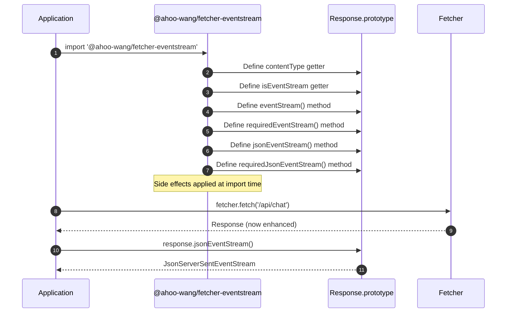
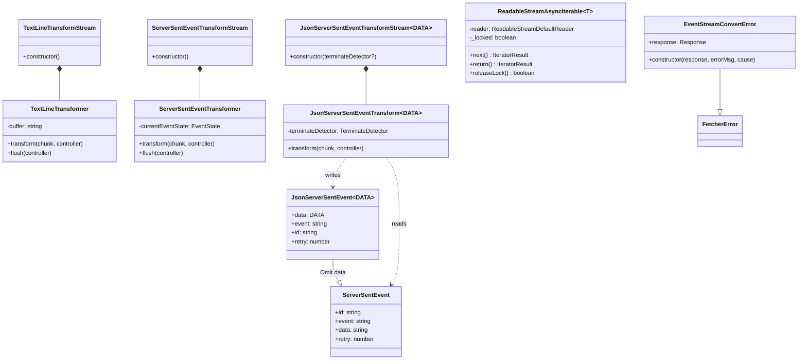
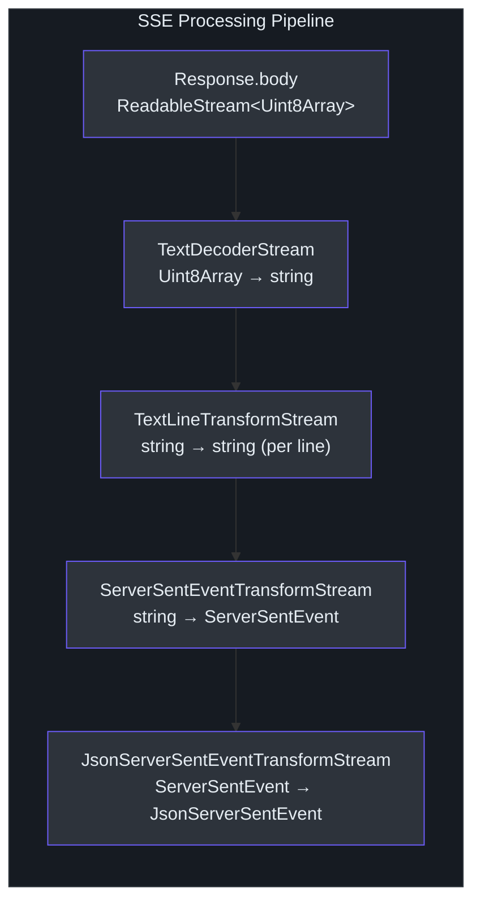
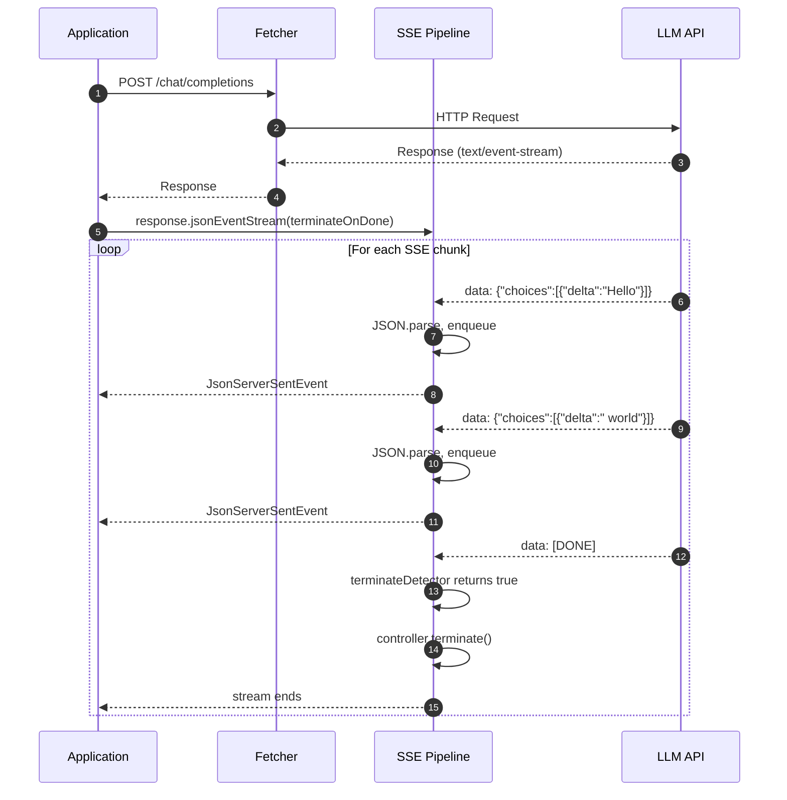

# EventStream & SSE

The `@ahoo-wang/fetcher-eventstream` package provides Server-Sent Event (SSE) processing for the Fetcher ecosystem. It uses a **side-effect module pattern** -- simply importing the package patches `Response.prototype` with stream-consuming methods, requiring no explicit registration.

Source: [packages/eventstream/src/responses.ts](https://github.com/Ahoo-Wang/fetcher/blob/main/packages/eventstream/src/responses.ts)

## Side-Effect Module Pattern

When `@ahoo-wang/fetcher-eventstream` is imported, it evaluates code that conditionally extends the global `Response` prototype with new properties and methods. Each extension is guarded by `hasOwnProperty` to avoid overwriting existing implementations.



### Properties and Methods Added to Response.prototype

| Member | Type | Description |
|---|---|---|
| `contentType` | getter: `string \| null` | Returns the `Content-Type` header value |
| `isEventStream` | getter: `boolean` | `true` if Content-Type contains `text/event-stream` |
| `eventStream()` | method: `ServerSentEventStream \| null` | Converts response body to SSE stream, or `null` if not an event stream |
| `requiredEventStream()` | method: `ServerSentEventStream` | Like `eventStream()` but throws if not an event stream |
| `jsonEventStream<DATA>()` | method: `JsonServerSentEventStream<DATA> \| null` | SSE stream with parsed JSON data |
| `requiredJsonEventStream<DATA>()` | method: `JsonServerSentEventStream<DATA>` | Like `jsonEventStream()` but throws if not available |

Source: [packages/eventstream/src/responses.ts:26-99](https://github.com/Ahoo-Wang/fetcher/blob/main/packages/eventstream/src/responses.ts#L26-L99)

The implementation uses property guards to avoid conflicts:

```typescript
// [packages/eventstream/src/responses.ts:102-120]
if (typeof Response !== 'undefined') {
  const CONTENT_TYPE_PROPERTY_NAME = 'contentType';
  if (
    !Object.prototype.hasOwnProperty.call(
      Response.prototype,
      CONTENT_TYPE_PROPERTY_NAME,
    )
  ) {
    Object.defineProperty(Response.prototype, CONTENT_TYPE_PROPERTY_NAME, {
      get() {
        return this.headers.get(CONTENT_TYPE_HEADER);
      },
      configurable: true,
    });
  }
  // ... similar guards for isEventStream, eventStream, etc.
}
```

Source: [packages/eventstream/src/responses.ts:102-120](https://github.com/Ahoo-Wang/fetcher/blob/main/packages/eventstream/src/responses.ts#L102-L120)

## Class Structure



## SafeTransformer — Error-Safe Base Class

All transformers in this package extend `SafeTransformer`, an abstract base class that provides three guarantees every concrete transformer inherits:

::: tip Why SafeTransformer Exists
Raw `TransformStream` transformers must manually handle errors, termination, and the "upstream pushes after close" race. Forgetting any of these causes `TypeError` or silent data loss. `SafeTransformer` centralizes this logic so SSE transformers focus purely on parsing.
:::

| Guarantee | How it works |
|-----------|-------------|
| **Termination guard** | Once `terminated` is set (via `terminate()` or an unhandled error), all subsequent chunks in `transform()` are silently dropped — no `TypeError` on closed streams. |
| **Safe controller ops** | `enqueue()` delegates to `safeEnqueue()` which suppresses `TypeError` from already-closed streams. `terminate()` delegates to `safeTerminate()`. |
| **Error boundary** | Unhandled errors in `onTransform()` / `onFlush()` are caught, the transformer is terminated, and the error is forwarded via `safeError()`. |

Subclasses implement `onTransform()` and optionally `onFlush()` instead of the raw `transform()` / `flush()` methods:

```typescript
// Simplified — see safeTransformer.ts for full implementation
abstract class SafeTransformer<I, O> implements Transformer<I, O> {
  protected terminated = false;

  async transform(chunk: I, controller: TransformStreamDefaultController<O>) {
    if (this.terminated) return;          // drop after termination
    try {
      await this.onTransform(chunk, controller);
    } catch (error) {
      this.terminate();                    // mark as done
      safeError(controller, error);        // forward error safely
    }
  }

  protected abstract onTransform(chunk: I, controller: TransformStreamDefaultController<O>): void | Promise<void>;
  protected enqueue(controller: TransformStreamDefaultController<O>, chunk: O) { safeEnqueue(controller, chunk); }
  protected terminate() { this.terminated = true; }
}
```

Source: [packages/eventstream/src/safeTransformer.ts](https://github.com/Ahoo-Wang/fetcher/blob/main/packages/eventstream/src/safeTransformer.ts)

The `streamController.ts` module provides the low-level safe operations (`safeEnqueue`, `safeTerminate`, `safeError`) that `SafeTransformer` uses, including cross-realm `TypeError` detection for environments where `error instanceof TypeError` fails across realms.

## Stream Processing Pipeline

Converting a raw HTTP response into typed JSON events involves a three-stage `pipeThrough` chain.



### Stage 1: TextDecoderStream (native)

Converts raw `Uint8Array` chunks to UTF-8 strings. This is a built-in browser/Node.js API.

### Stage 2: TextLineTransformStream

Accumulates text chunks and splits them by `\n`, emitting each complete line as a separate chunk. Partial lines at chunk boundaries are buffered until the next chunk completes them. Also normalizes `\r\n` line endings to `\r`-free lines.

```typescript
// Extends SafeTransformer — error handling is inherited, not manual.
export class TextLineTransformer extends SafeTransformer<string, string> {
  private buffer = '';

  private normalizeLine(line: string): string {
    return line.endsWith('\r') ? line.slice(0, -1) : line;
  }

  protected onTransform(chunk: string, controller: TransformStreamDefaultController<string>): void {
    this.buffer += chunk;
    const lines = this.buffer.split('\n');
    this.buffer = lines.pop() || '';
    for (const line of lines) {
      this.enqueue(controller, this.normalizeLine(line));
    }
  }

  protected onFlush(controller: TransformStreamDefaultController<string>): void {
    const line = this.normalizeLine(this.buffer);
    if (line) {
      this.enqueue(controller, line);
    }
  }
}
```

Source: [packages/eventstream/src/textLineTransformStream.ts](https://github.com/Ahoo-Wang/fetcher/blob/main/packages/eventstream/src/textLineTransformStream.ts)

### Stage 3: ServerSentEventTransformStream

Parses individual lines into structured `ServerSentEvent` objects according to the W3C SSE specification. Handles:

- Empty lines as event delimiters (trigger event emission)
- Comment lines (starting with `:`) -- ignored
- Field parsing: `event`, `data`, `id`, `retry`
- Multi-line data fields (joined with `\n`)
- Default event type `"message"` when not specified

```typescript
// [packages/eventstream/src/serverSentEventTransformStream.ts:23-32]
export interface ServerSentEvent {
  id?: string;
  event: string;
  data: string;
  retry?: number;
}
```

Source: [packages/eventstream/src/serverSentEventTransformStream.ts:23-32](https://github.com/Ahoo-Wang/fetcher/blob/main/packages/eventstream/src/serverSentEventTransformStream.ts#L23-L32)

The core parsing logic extends `SafeTransformer` — error handling and termination are inherited:

```typescript
// Extends SafeTransformer<string, ServerSentEvent>
// onTransform replaces raw transform(); errors are caught by the base class
export class ServerSentEventTransformer extends SafeTransformer<string, ServerSentEvent> {
  private currentEventState: EventState = { event: 'message', id: undefined, retry: undefined, data: [] };

  // Reset state when an error occurs (override of SafeTransformer.onError)
  protected override onError(_error: unknown, _phase: TransformerPhase): void {
    this.resetEventState();
  }

  protected onTransform(chunk: string, controller: TransformStreamDefaultController<ServerSentEvent>): void {
    const currentEvent = this.currentEventState;

    if (chunk.trim() === '') {
      // Empty line — emit accumulated event
      if (currentEvent.data.length > 0) {
        this.enqueue(controller, {
          event: currentEvent.event || 'message',
          data: currentEvent.data.join('\n'),
          id: currentEvent.id || '',
          retry: currentEvent.retry,
        });
        currentEvent.event = 'message';
        currentEvent.data = [];
      }
      return;
    }
    if (chunk.startsWith(':')) { return; } // comment line

    // Parse field: value
    const colonIndex = chunk.indexOf(':');
    // ... field/value extraction ...
    processFieldInternal(field, value, currentEvent);
  }
}
```

Source: [packages/eventstream/src/serverSentEventTransformStream.ts](https://github.com/Ahoo-Wang/fetcher/blob/main/packages/eventstream/src/serverSentEventTransformStream.ts)

### Stage 4: JsonServerSentEventTransformStream

An optional fourth stage that parses each `ServerSentEvent.data` string as JSON and supports automatic stream termination.

```typescript
// [packages/eventstream/src/jsonServerSentEventTransformStream.ts:44-50]
export interface JsonServerSentEvent<DATA> extends Omit<ServerSentEvent, 'data'> {
  data: DATA;
}
```

Source: [packages/eventstream/src/jsonServerSentEventTransformStream.ts:44-50](https://github.com/Ahoo-Wang/fetcher/blob/main/packages/eventstream/src/jsonServerSentEventTransformStream.ts#L44-L50)

The transform checks a `TerminateDetector` function before parsing. Like all transformers in this package, it extends `SafeTransformer`:

```typescript
// Extends SafeTransformer — termination and error handling inherited
export class JsonServerSentEventTransform<DATA> extends SafeTransformer<
  ServerSentEvent,
  JsonServerSentEvent<DATA>
> {
  constructor(private readonly terminateDetector?: TerminateDetector) {
    super();
  }

  protected onTransform(
    chunk: ServerSentEvent,
    controller: TransformStreamDefaultController<JsonServerSentEvent<DATA>>,
  ): void {
    // Check terminate condition (e.g., data === '[DONE]')
    if (this.terminateDetector?.(chunk)) {
      this.terminate(controller);  // safe terminate from SafeTransformer
      return;
    }
    const json = JSON.parse(chunk.data) as DATA;
    this.enqueue(controller, {    // safe enqueue from SafeTransformer
      data: json,
      event: chunk.event,
      id: chunk.id,
      retry: chunk.retry,
    });
  }
}
```

Source: [packages/eventstream/src/jsonServerSentEventTransformStream.ts](https://github.com/Ahoo-Wang/fetcher/blob/main/packages/eventstream/src/jsonServerSentEventTransformStream.ts)

## The toServerSentEventStream Function

The `toServerSentEventStream()` function composes stages 1-3 into a single call:

```typescript
// [packages/eventstream/src/eventStreamConverter.ts:127-138]
export function toServerSentEventStream(response: Response): ServerSentEventStream {
  if (!response.body) {
    throw new EventStreamConvertError(response, 'Response body is null');
  }
  return response.body
    .pipeThrough(new TextDecoderStream('utf-8'))
    .pipeThrough(new TextLineTransformStream())
    .pipeThrough(new ServerSentEventTransformStream());
}
```

Source: [packages/eventstream/src/eventStreamConverter.ts:127-138](https://github.com/Ahoo-Wang/fetcher/blob/main/packages/eventstream/src/eventStreamConverter.ts#L127-L138)

The `toJsonServerSentEventStream()` function adds stage 4:

```typescript
// [packages/eventstream/src/jsonServerSentEventTransformStream.ts:200-207]
export function toJsonServerSentEventStream<DATA>(
  serverSentEventStream: ServerSentEventStream,
  terminateDetector?: TerminateDetector,
): JsonServerSentEventStream<DATA> {
  return serverSentEventStream.pipeThrough(
    new JsonServerSentEventTransformStream<DATA>(terminateDetector),
  );
}
```

Source: [packages/eventstream/src/jsonServerSentEventTransformStream.ts:200-207](https://github.com/Ahoo-Wang/fetcher/blob/main/packages/eventstream/src/jsonServerSentEventTransformStream.ts#L200-L207)

## Async Iteration Support

`ReadableStreamAsyncIterable` wraps a `ReadableStream` into an `AsyncIterable`, enabling `for await...of` consumption. It manages stream locking and provides safe cleanup via `return()` and `throw()`.

```typescript
// [packages/eventstream/src/readableStreamAsyncIterable.ts:54-148]
export class ReadableStreamAsyncIterable<T> implements AsyncIterable<T> {
  private readonly reader: ReadableStreamDefaultReader<T>;
  private _locked: boolean = true;

  constructor(private readonly stream: ReadableStream<T>) {
    this.reader = stream.getReader();
  }

  [Symbol.asyncIterator]() { return this; }

  async next(): Promise<IteratorResult<T>> {
    try {
      const { done, value } = await this.reader.read();
      if (done) {
        this.releaseLock();
        return { done: true, value: undefined };
      }
      return { done: false, value };
    } catch (error) {
      this.releaseLock();
      throw error;
    }
  }
  // ... return() and throw() for cleanup
}
```

Source: [packages/eventstream/src/readableStreamAsyncIterable.ts:54-148](https://github.com/Ahoo-Wang/fetcher/blob/main/packages/eventstream/src/readableStreamAsyncIterable.ts#L54-L148)

## Integration with Fetcher

### Result Extractors

The eventstream package provides two `ResultExtractor` implementations for direct use with Fetcher:

| Extractor | Returns | Use Case |
|---|---|---|
| `EventStreamResultExtractor` | `ServerSentEventStream` | Raw SSE events (string data) |
| `JsonEventStreamResultExtractor` | `JsonServerSentEventStream<any>` | Parsed JSON events |

```typescript
// [packages/eventstream/src/eventStreamResultExtractor.ts:38-42]
export const EventStreamResultExtractor: ResultExtractor<ServerSentEventStream> =
  (exchange: FetchExchange) => {
    return exchange.requiredResponse.requiredEventStream();
  };

// [packages/eventstream/src/eventStreamResultExtractor.ts:65-69]
export const JsonEventStreamResultExtractor: ResultExtractor<JsonServerSentEventStream<any>> =
  (exchange: FetchExchange) => {
    return exchange.requiredResponse.requiredJsonEventStream();
  };
```

Source: [packages/eventstream/src/eventStreamResultExtractor.ts:38-69](https://github.com/Ahoo-Wang/fetcher/blob/main/packages/eventstream/src/eventStreamResultExtractor.ts#L38-L69)

### Usage with Fetcher

```typescript
import { fetcher, ResultExtractors } from '@ahoo-wang/fetcher';
import '@ahoo-wang/fetcher-eventstream'; // side-effect import
import { JsonEventStreamResultExtractor } from '@ahoo-wang/fetcher-eventstream';

// Using result extractor
const stream = await fetcher.fetch('/api/chat/completions', {
  method: 'POST',
  body: { prompt: 'Hello' },
}, {
  resultExtractor: JsonEventStreamResultExtractor,
});

for await (const event of stream) {
  console.log(event.data); // typed JSON
}

// Or manually from Response
const response = await fetcher.get('/api/events');
const eventStream = response.requiredJsonEventStream<MyData>(
  (event) => event.data === '[DONE]',
);
```

## LLM Streaming Integration

The `TerminateDetector` pattern is specifically designed for LLM streaming APIs (OpenAI, etc.) that send a `[DONE]` sentinel event to signal the end of the stream.



### Connection to OpenAI Package

The `@ahoo-wang/fetcher-openai` package depends on `@ahoo-wang/fetcher-eventstream` and uses the SSE streaming infrastructure for consuming OpenAI-compatible chat completion streams. It imports the eventstream side-effect module to patch `Response.prototype` and uses `JsonEventStreamResultExtractor` or manual `jsonEventStream()` calls to consume typed streaming responses.

## Error Handling

### EventStreamConvertError

Thrown when a response cannot be converted to an event stream (typically because the response body is null).

```typescript
// [packages/eventstream/src/eventStreamConverter.ts:54-73]
export class EventStreamConvertError extends FetcherError {
  constructor(
    public readonly response: Response,
    errorMsg?: string,
    cause?: Error | any,
  ) {
    super(errorMsg, cause);
    this.name = 'EventStreamConvertError';
    Object.setPrototypeOf(this, EventStreamConvertError.prototype);
  }
}
```

Source: [packages/eventstream/src/eventStreamConverter.ts:54-73](https://github.com/Ahoo-Wang/fetcher/blob/main/packages/eventstream/src/eventStreamConverter.ts#L54-L73)

The `requiredEventStream()` and `requiredJsonEventStream()` methods throw `EventStreamConvertError` if the response content-type is not `text/event-stream`:

```typescript
// [packages/eventstream/src/responses.ts:176-186]
Response.prototype.requiredEventStream = function () {
  const eventStream = this.eventStream();
  if (!eventStream) {
    throw new EventStreamConvertError(
      this,
      `Event stream is not available. Response content-type: [${this.contentType}]`,
    );
  }
  return eventStream;
};
```

Source: [packages/eventstream/src/responses.ts:176-186](https://github.com/Ahoo-Wang/fetcher/blob/main/packages/eventstream/src/responses.ts#L176-L186)

## Cross-References

- [Architecture Overview](/architecture/) -- system-level view of the eventstream package
- [Fetcher Core](/architecture/fetcher-core) -- `Fetcher`, `FetchExchange`, `ResultExtractor` pattern
- [Interceptor System](/architecture/interceptors) -- how result extractors interact with the interceptor pipeline
