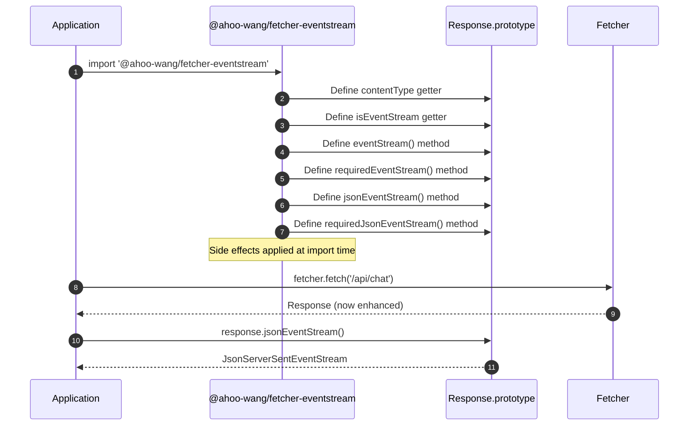
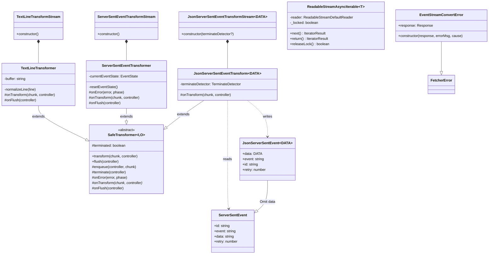
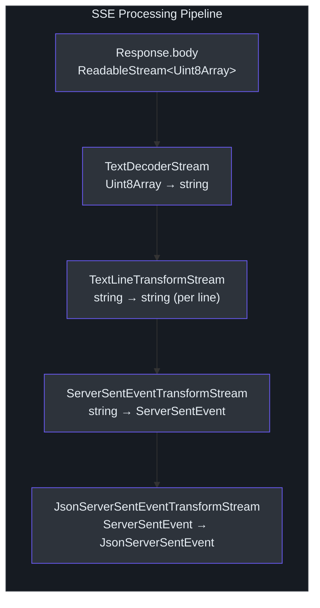
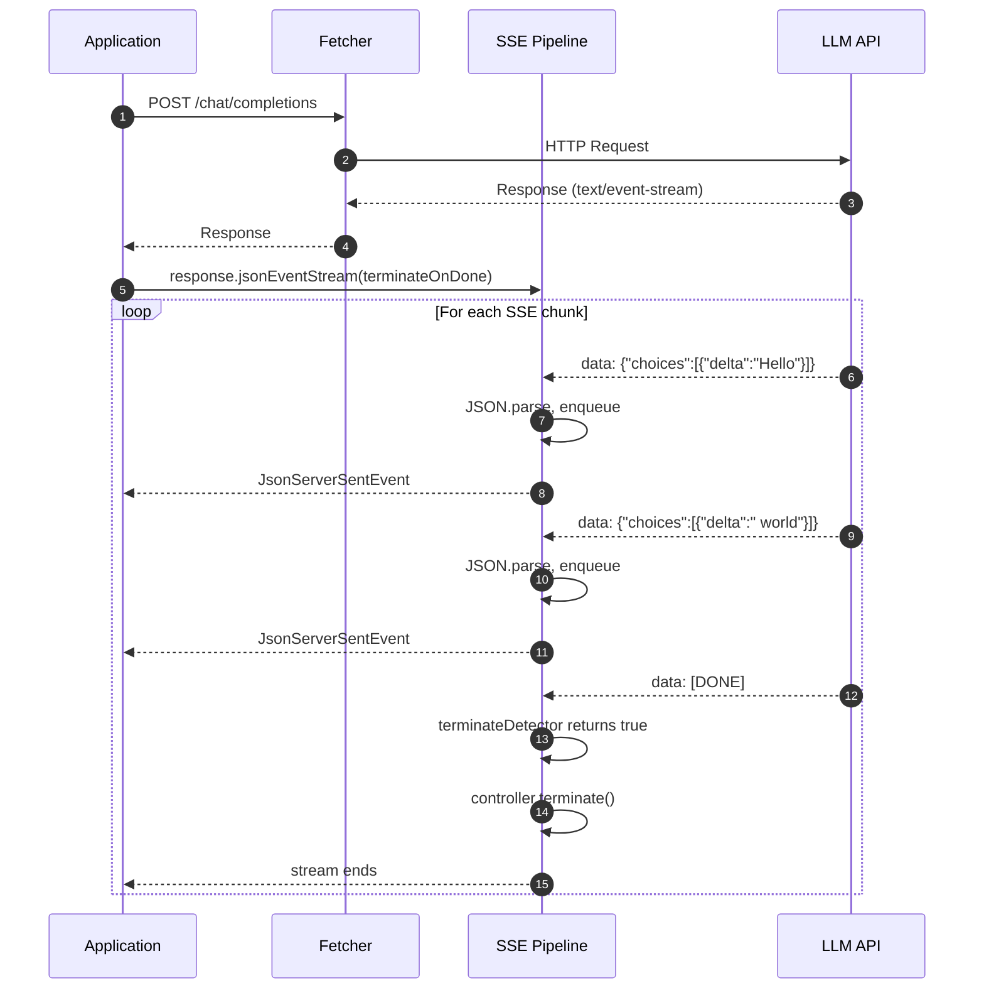

# EventStream & SSE

The `@ahoo-wang/fetcher-eventstream` package provides Server-Sent Event (SSE) processing for the Fetcher ecosystem. It uses a **side-effect module pattern** -- simply importing the package patches `Response.prototype` with stream-consuming methods, requiring no explicit registration.

Source: [packages/eventstream/src/responses.ts](https://github.com/Ahoo-Wang/fetcher/blob/main/packages/eventstream/src/responses.ts)

## Side-Effect Module Pattern

When `@ahoo-wang/fetcher-eventstream` is imported, it evaluates code that conditionally extends the global `Response` prototype with new properties and methods. Each extension is guarded by `hasOwnProperty` to avoid overwriting existing implementations.


```mermaid
sequenceDiagram
autonumber

  participant App as Application
  participant ES as @ahoo-wang/fetcher-eventstream
  participant RP as Response.prototype
  participant Fetcher as Fetcher

  App->>ES: import '@ahoo-wang/fetcher-eventstream'
  ES->>RP: Define contentType getter
  ES->>RP: Define isEventStream getter
  ES->>RP: Define eventStream() method
  ES->>RP: Define requiredEventStream() method
  ES->>RP: Define jsonEventStream() method
  ES->>RP: Define requiredJsonEventStream() method
  Note over ES: Side effects applied at import time
  App->>Fetcher: fetcher.fetch('/api/chat')
  Fetcher-->>App: Response (now enhanced)
  App->>RP: response.jsonEventStream()
  RP-->>App: JsonServerSentEventStream
```

### Properties and Methods Added to Response.prototype

| Member | Type | Description |
|---|---|---|
| `contentType` | getter: `string \| null` | Returns the `Content-Type` header value |
| `isEventStream` | getter: `boolean` | `true` if Content-Type contains `text/event-stream` |
| `eventStream()` | method: `ServerSentEventStream \| null` | Converts response body to SSE stream, or `null` if not an event stream |
| `requiredEventStream()` | method: `ServerSentEventStream` | Like `eventStream()` but throws if not an event stream |
| `jsonEventStream<DATA>()` | method: `JsonServerSentEventStream<DATA> \| null` | SSE stream with parsed JSON data |
| `requiredJsonEventStream<DATA>()` | method: `JsonServerSentEventStream<DATA>` | Like `jsonEventStream()` but throws if not available |

Source: [packages/eventstream/src/responses.ts:26-99](https://github.com/Ahoo-Wang/fetcher/blob/main/packages/eventstream/src/responses.ts#L26-L99)

The implementation uses property guards to avoid conflicts:

```typescript
// [packages/eventstream/src/responses.ts:102-120]
if (typeof Response !== 'undefined') {
  const CONTENT_TYPE_PROPERTY_NAME = 'contentType';
  if (
    !Object.prototype.hasOwnProperty.call(
      Response.prototype,
      CONTENT_TYPE_PROPERTY_NAME,
    )
  ) {
    Object.defineProperty(Response.prototype, CONTENT_TYPE_PROPERTY_NAME, {
      get() {
        return this.headers.get(CONTENT_TYPE_HEADER);
      },
      configurable: true,
    });
  }
  // ... similar guards for isEventStream, eventStream, etc.
}
```

Source: [packages/eventstream/src/responses.ts:102-120](https://github.com/Ahoo-Wang/fetcher/blob/main/packages/eventstream/src/responses.ts#L102-L120)

## Class Structure


```mermaid
classDiagram
  class ServerSentEvent {
    +id: string
    +event: string
    +data: string
    +retry: number
  }

  class JsonServerSentEvent~DATA~ {
    +data: DATA
    +event: string
    +id: string
    +retry: number
  }

  class TextLineTransformStream {
    +constructor()
  }

  class SafeTransformer~I,O~ {
    <<abstract>>
    #terminated: boolean
    +transform(chunk, controller)
    +flush(controller)
    #enqueue(controller, chunk)
    #terminate(controller)
    #onError(error, phase)
    #onTransform(chunk, controller)*
    #onFlush(controller)
  }

  class TextLineTransformer {
    -buffer: string
    -normalizeLine(line)
    #onTransform(chunk, controller)
    #onFlush(controller)
  }

  class ServerSentEventTransformStream {
    +constructor()
  }

  class ServerSentEventTransformer {
    -currentEventState: EventState
    -resetEventState()
    #onError(error, phase)
    #onTransform(chunk, controller)
    #onFlush(controller)
  }

  class JsonServerSentEventTransformStream~DATA~ {
    +constructor(terminateDetector?)
  }

  class JsonServerSentEventTransform~DATA~ {
    -terminateDetector: TerminateDetector
    #onTransform(chunk, controller)
  }

  class ReadableStreamAsyncIterable~T~ {
    -reader: ReadableStreamDefaultReader
    -_locked: boolean
    +next() IteratorResult
    +return() IteratorResult
    +releaseLock() boolean
  }

  class EventStreamConvertError {
    +response: Response
    +constructor(response, errorMsg, cause)
  }

  JsonServerSentEvent --|> ServerSentEvent : Omit data
  TextLineTransformer --|> SafeTransformer : extends
  ServerSentEventTransformer --|> SafeTransformer : extends
  JsonServerSentEventTransform --|> SafeTransformer : extends
  TextLineTransformStream *-- TextLineTransformer
  ServerSentEventTransformStream *-- ServerSentEventTransformer
  JsonServerSentEventTransformStream *-- JsonServerSentEventTransform
  EventStreamConvertError --|> FetcherError
  JsonServerSentEventTransform ..> ServerSentEvent : reads
  JsonServerSentEventTransform ..> JsonServerSentEvent : writes
```

## Stream Processing Pipeline

Converting a raw HTTP response into typed JSON events involves a three-stage `pipeThrough` chain.


```mermaid
graph LR
  subgraph Pipeline["SSE Processing Pipeline"]
    style Pipeline fill:#161b22,stroke:#30363d,color:#e6edf3
    Response["Response.body<br>ReadableStream&lt;Uint8Array&gt;"]
    TDS["TextDecoderStream<br>Uint8Array → string"]
    TLS["TextLineTransformStream<br>string → string (per line)"]
    SSE["ServerSentEventTransformStream<br>string → ServerSentEvent"]
    JSON["JsonServerSentEventTransformStream<br>ServerSentEvent → JsonServerSentEvent"]
  end

  Response --> TDS --> TLS --> SSE --> JSON

  style Response fill:#2d333b,stroke:#6d5dfc,color:#e6edf3
  style TDS fill:#2d333b,stroke:#6d5dfc,color:#e6edf3
  style TLS fill:#2d333b,stroke:#6d5dfc,color:#e6edf3
  style SSE fill:#2d333b,stroke:#6d5dfc,color:#e6edf3
  style JSON fill:#2d333b,stroke:#6d5dfc,color:#e6edf3
```

### Stage 1: TextDecoderStream (native)

Converts raw `Uint8Array` chunks to UTF-8 strings. This is a built-in browser/Node.js API.

### Stage 2: TextLineTransformStream

Accumulates text chunks and splits them by `\n`, emitting each complete line as a separate chunk. Partial lines at chunk boundaries are buffered until the next chunk completes them.

```typescript
// [packages/eventstream/src/textLineTransformStream.ts:23-52]
export class TextLineTransformer extends SafeTransformer<string, string> {
  private buffer = '';

  private normalizeLine(line: string): string {
    return line.endsWith('\r') ? line.slice(0, -1) : line;
  }

  protected onTransform(
    chunk: string,
    controller: TransformStreamDefaultController<string>,
  ): void {
    this.buffer += chunk;
    const lines = this.buffer.split('\n');
    this.buffer = lines.pop() || '';

    for (const line of lines) {
      this.enqueue(controller, this.normalizeLine(line));
    }
  }

  protected onFlush(
    controller: TransformStreamDefaultController<string>,
  ): void {
    const line = this.normalizeLine(this.buffer);
    // Only send when normalized buffer is not empty.
    if (line) {
      this.enqueue(controller, line);
    }
  }
}
```

Source: [packages/eventstream/src/textLineTransformStream.ts:23-52](https://github.com/Ahoo-Wang/fetcher/blob/main/packages/eventstream/src/textLineTransformStream.ts#L23-L52)

### Stage 3: ServerSentEventTransformStream

Parses individual lines into structured `ServerSentEvent` objects according to the W3C SSE specification. Handles:

- Empty lines as event delimiters (trigger event emission)
- Comment lines (starting with `:`) -- ignored
- Field parsing: `event`, `data`, `id`, `retry`
- Multi-line data fields (joined with `\n`)
- Default event type `"message"` when not specified

```typescript
// [packages/eventstream/src/serverSentEventTransformStream.ts:23-32]
export interface ServerSentEvent {
  id?: string;
  event: string;
  data: string;
  retry?: number;
}
```

Source: [packages/eventstream/src/serverSentEventTransformStream.ts:23-32](https://github.com/Ahoo-Wang/fetcher/blob/main/packages/eventstream/src/serverSentEventTransformStream.ts#L23-L32)

The core parsing logic lives in `onTransform`, which is called by the inherited `SafeTransformer.transform()` method. Error handling (try/catch, termination, and forwarding via `safeError`) is inherited from `SafeTransformer`; on error the `onError` override below resets the event state:

```typescript
// [packages/eventstream/src/serverSentEventTransformStream.ts:99-108]
private resetEventState() {
  this.currentEventState.event = DEFAULT_EVENT_TYPE;
  this.currentEventState.id = undefined;
  this.currentEventState.retry = undefined;
  this.currentEventState.data = [];
}

protected override onError(_error: unknown, _phase: TransformerPhase): void {
  this.resetEventState();
}
```

```typescript
// [packages/eventstream/src/serverSentEventTransformStream.ts:110-155]
protected onTransform(
  chunk: string,
  controller: TransformStreamDefaultController<ServerSentEvent>,
): void {
  const currentEvent = this.currentEventState;

  // Skip empty lines (event separator)
  if (chunk.trim() === '') {
    if (currentEvent.data.length > 0) {
      this.enqueue(controller, {
        event: currentEvent.event || DEFAULT_EVENT_TYPE,
        data: currentEvent.data.join('\n'),
        id: currentEvent.id || '',
        retry: currentEvent.retry,
      } as ServerSentEvent);

      currentEvent.event = DEFAULT_EVENT_TYPE;
      currentEvent.data = [];
    }
    return;
  }

  // Ignore comment lines (starting with colon)
  if (chunk.startsWith(':')) {
    return;
  }

  // Parse fields
  const colonIndex = chunk.indexOf(':');
  let field: string;
  let value: string;

  if (colonIndex === -1) {
    field = chunk.toLowerCase();
    value = '';
  } else {
    field = chunk.substring(0, colonIndex).toLowerCase();
    value = chunk.substring(colonIndex + 1);
    if (value.startsWith(' ')) {
      value = value.substring(1);
    }
  }

  processFieldInternal(field, value, currentEvent);
}
```

Source: [packages/eventstream/src/serverSentEventTransformStream.ts:110-155](https://github.com/Ahoo-Wang/fetcher/blob/main/packages/eventstream/src/serverSentEventTransformStream.ts#L110-L155)

### Stage 4: JsonServerSentEventTransformStream

An optional fourth stage that parses each `ServerSentEvent.data` string as JSON and supports automatic stream termination.

```typescript
// [packages/eventstream/src/jsonServerSentEventTransformStream.ts:31-37]
export interface JsonServerSentEvent<DATA> extends Omit<ServerSentEvent, 'data'> {
  data: DATA;
}
```

Source: [packages/eventstream/src/jsonServerSentEventTransformStream.ts:31-37](https://github.com/Ahoo-Wang/fetcher/blob/main/packages/eventstream/src/jsonServerSentEventTransformStream.ts#L31-L37)

The `JsonServerSentEventTransform` class `extends SafeTransformer`, so error handling and the termination guard are inherited. The `onTransform` method checks a `TerminateDetector` function before parsing, and uses `this.terminate()` / `this.enqueue()` instead of raw controller methods:

```typescript
// [packages/eventstream/src/jsonServerSentEventTransformStream.ts:47-73]
export class JsonServerSentEventTransform<DATA> extends SafeTransformer<
  ServerSentEvent,
  JsonServerSentEvent<DATA>
> {
  constructor(private readonly terminateDetector?: TerminateDetector) {
    super();
  }

  protected onTransform(
    chunk: ServerSentEvent,
    controller: TransformStreamDefaultController<JsonServerSentEvent<DATA>>,
  ): void {
    // Check if this is a terminate event
    if (this.terminateDetector?.(chunk)) {
      this.terminate(controller);
      return;
    }

    const json = JSON.parse(chunk.data) as DATA;
    this.enqueue(controller, {
      data: json,
      event: chunk.event,
      id: chunk.id,
      retry: chunk.retry,
    });
  }
}
```

Source: [packages/eventstream/src/jsonServerSentEventTransformStream.ts:47-73](https://github.com/Ahoo-Wang/fetcher/blob/main/packages/eventstream/src/jsonServerSentEventTransformStream.ts#L47-L73)

## The toServerSentEventStream Function

The `toServerSentEventStream()` function composes stages 1-3 into a single call:

```typescript
// [packages/eventstream/src/eventStreamConverter.ts:127-138]
export function toServerSentEventStream(response: Response): ServerSentEventStream {
  if (!response.body) {
    throw new EventStreamConvertError(response, 'Response body is null');
  }
  return response.body
    .pipeThrough(new TextDecoderStream('utf-8'))
    .pipeThrough(new TextLineTransformStream())
    .pipeThrough(new ServerSentEventTransformStream());
}
```

Source: [packages/eventstream/src/eventStreamConverter.ts:127-138](https://github.com/Ahoo-Wang/fetcher/blob/main/packages/eventstream/src/eventStreamConverter.ts#L127-L138)

The `toJsonServerSentEventStream()` function adds stage 4:

```typescript
// [packages/eventstream/src/jsonServerSentEventTransformStream.ts:107-114]
export function toJsonServerSentEventStream<DATA>(
  serverSentEventStream: ServerSentEventStream,
  terminateDetector?: TerminateDetector,
): JsonServerSentEventStream<DATA> {
  return serverSentEventStream.pipeThrough(
    new JsonServerSentEventTransformStream<DATA>(terminateDetector),
  );
}
```

Source: [packages/eventstream/src/jsonServerSentEventTransformStream.ts:107-114](https://github.com/Ahoo-Wang/fetcher/blob/main/packages/eventstream/src/jsonServerSentEventTransformStream.ts#L107-L114)

## Async Iteration Support

`ReadableStreamAsyncIterable` wraps a `ReadableStream` into an `AsyncIterable`, enabling `for await...of` consumption. It manages stream locking and provides safe cleanup via `return()` and `throw()`.

```typescript
// [packages/eventstream/src/readableStreamAsyncIterable.ts:54-148]
export class ReadableStreamAsyncIterable<T> implements AsyncIterable<T> {
  private readonly reader: ReadableStreamDefaultReader<T>;
  private _locked: boolean = true;

  constructor(private readonly stream: ReadableStream<T>) {
    this.reader = stream.getReader();
  }

  [Symbol.asyncIterator]() { return this; }

  async next(): Promise<IteratorResult<T>> {
    try {
      const { done, value } = await this.reader.read();
      if (done) {
        this.releaseLock();
        return { done: true, value: undefined };
      }
      return { done: false, value };
    } catch (error) {
      this.releaseLock();
      throw error;
    }
  }
  // ... return() and throw() for cleanup
}
```

Source: [packages/eventstream/src/readableStreamAsyncIterable.ts:54-148](https://github.com/Ahoo-Wang/fetcher/blob/main/packages/eventstream/src/readableStreamAsyncIterable.ts#L54-L148)

## Integration with Fetcher

### Result Extractors

The eventstream package provides two `ResultExtractor` implementations for direct use with Fetcher:

| Extractor | Returns | Use Case |
|---|---|---|
| `EventStreamResultExtractor` | `ServerSentEventStream` | Raw SSE events (string data) |
| `JsonEventStreamResultExtractor` | `JsonServerSentEventStream<any>` | Parsed JSON events |

```typescript
// [packages/eventstream/src/eventStreamResultExtractor.ts:38-42]
export const EventStreamResultExtractor: ResultExtractor<ServerSentEventStream> =
  (exchange: FetchExchange) => {
    return exchange.requiredResponse.requiredEventStream();
  };

// [packages/eventstream/src/eventStreamResultExtractor.ts:65-69]
export const JsonEventStreamResultExtractor: ResultExtractor<JsonServerSentEventStream<any>> =
  (exchange: FetchExchange) => {
    return exchange.requiredResponse.requiredJsonEventStream();
  };
```

Source: [packages/eventstream/src/eventStreamResultExtractor.ts:38-69](https://github.com/Ahoo-Wang/fetcher/blob/main/packages/eventstream/src/eventStreamResultExtractor.ts#L38-L69)

### Usage with Fetcher

```typescript
import { fetcher, ResultExtractors } from '@ahoo-wang/fetcher';
import '@ahoo-wang/fetcher-eventstream'; // side-effect import
import { JsonEventStreamResultExtractor } from '@ahoo-wang/fetcher-eventstream';

// Using result extractor
const stream = await fetcher.fetch('/api/chat/completions', {
  method: 'POST',
  body: { prompt: 'Hello' },
}, {
  resultExtractor: JsonEventStreamResultExtractor,
});

for await (const event of stream) {
  console.log(event.data); // typed JSON
}

// Or manually from Response
const response = await fetcher.get('/api/events');
const eventStream = response.requiredJsonEventStream<MyData>(
  (event) => event.data === '[DONE]',
);
```

## LLM Streaming Integration

The `TerminateDetector` pattern is specifically designed for LLM streaming APIs (OpenAI, etc.) that send a `[DONE]` sentinel event to signal the end of the stream.


```mermaid
sequenceDiagram
autonumber

  participant Client as Application
  participant F as Fetcher
  participant SSE as SSE Pipeline
  participant LLM as LLM API

  Client->>F: POST /chat/completions
  F->>LLM: HTTP Request
  LLM-->>F: Response (text/event-stream)
  F-->>Client: Response

  Client->>SSE: response.jsonEventStream(terminateOnDone)
  loop For each SSE chunk
    LLM-->>SSE: data: {"choices":[{"delta":"Hello"}]}
    SSE->>SSE: JSON.parse, enqueue
    SSE-->>Client: JsonServerSentEvent
    LLM-->>SSE: data: {"choices":[{"delta":" world"}]}
    SSE->>SSE: JSON.parse, enqueue
    SSE-->>Client: JsonServerSentEvent
    LLM-->>SSE: data: [DONE]
    SSE->>SSE: terminateDetector returns true
    SSE->>SSE: controller.terminate()
    SSE-->>Client: stream ends
  end
```

### Connection to OpenAI Package

The `@ahoo-wang/fetcher-openai` package depends on `@ahoo-wang/fetcher-eventstream` and uses the SSE streaming infrastructure for consuming OpenAI-compatible chat completion streams. It imports the eventstream side-effect module to patch `Response.prototype` and uses `JsonEventStreamResultExtractor` or manual `jsonEventStream()` calls to consume typed streaming responses.

## Error Handling

### EventStreamConvertError

Thrown when a response cannot be converted to an event stream (typically because the response body is null).

```typescript
// [packages/eventstream/src/eventStreamConverter.ts:54-73]
export class EventStreamConvertError extends FetcherError {
  constructor(
    public readonly response: Response,
    errorMsg?: string,
    cause?: Error | any,
  ) {
    super(errorMsg, cause);
    this.name = 'EventStreamConvertError';
    Object.setPrototypeOf(this, EventStreamConvertError.prototype);
  }
}
```

Source: [packages/eventstream/src/eventStreamConverter.ts:54-73](https://github.com/Ahoo-Wang/fetcher/blob/main/packages/eventstream/src/eventStreamConverter.ts#L54-L73)

The `requiredEventStream()` and `requiredJsonEventStream()` methods throw `EventStreamConvertError` if the response content-type is not `text/event-stream`:

```typescript
// [packages/eventstream/src/responses.ts:176-186]
Response.prototype.requiredEventStream = function () {
  const eventStream = this.eventStream();
  if (!eventStream) {
    throw new EventStreamConvertError(
      this,
      `Event stream is not available. Response content-type: [${this.contentType}]`,
    );
  }
  return eventStream;
};
```

Source: [packages/eventstream/src/responses.ts:176-186](https://github.com/Ahoo-Wang/fetcher/blob/main/packages/eventstream/src/responses.ts#L176-L186)

## Cross-References

- [Architecture Overview](/architecture/) -- system-level view of the eventstream package
- [Fetcher Core](/architecture/fetcher-core) -- `Fetcher`, `FetchExchange`, `ResultExtractor` pattern
- [Interceptor System](/architecture/interceptors) -- how result extractors interact with the interceptor pipeline
