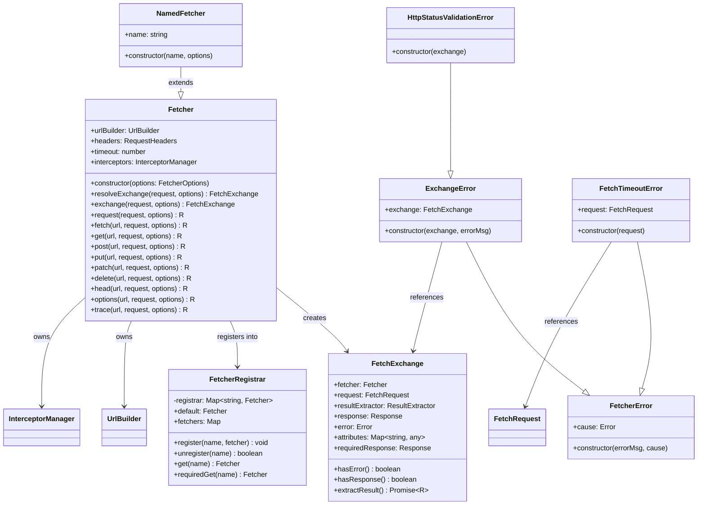
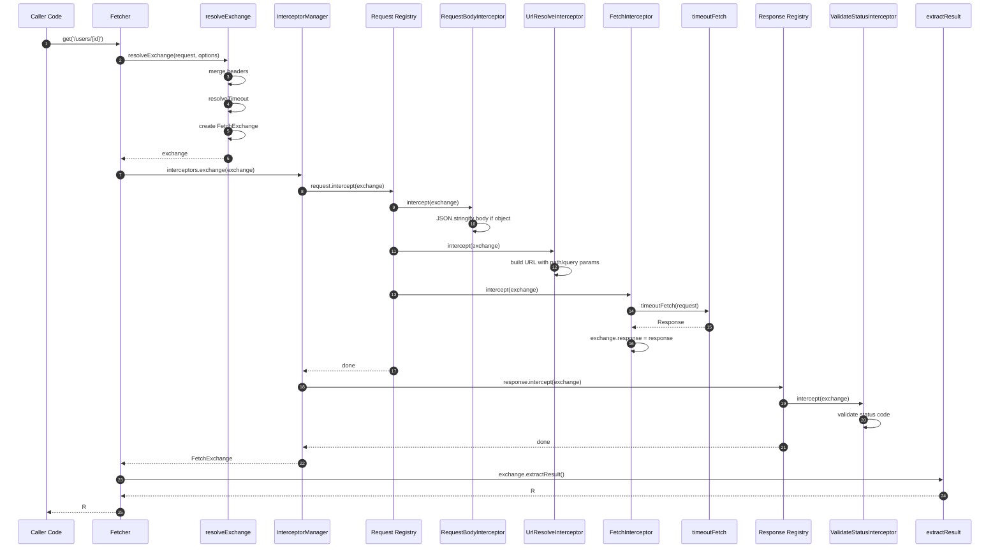
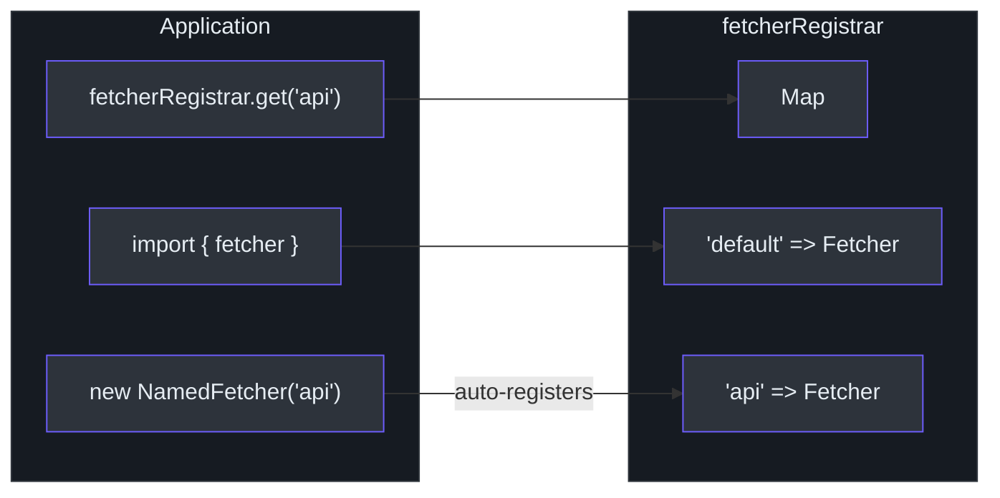
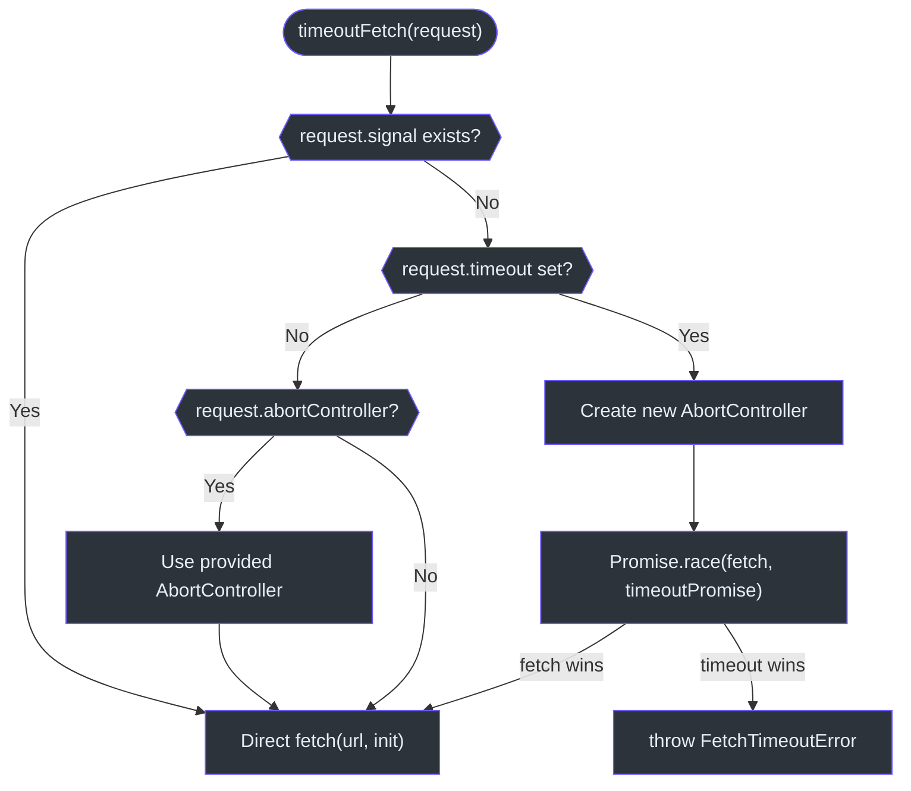
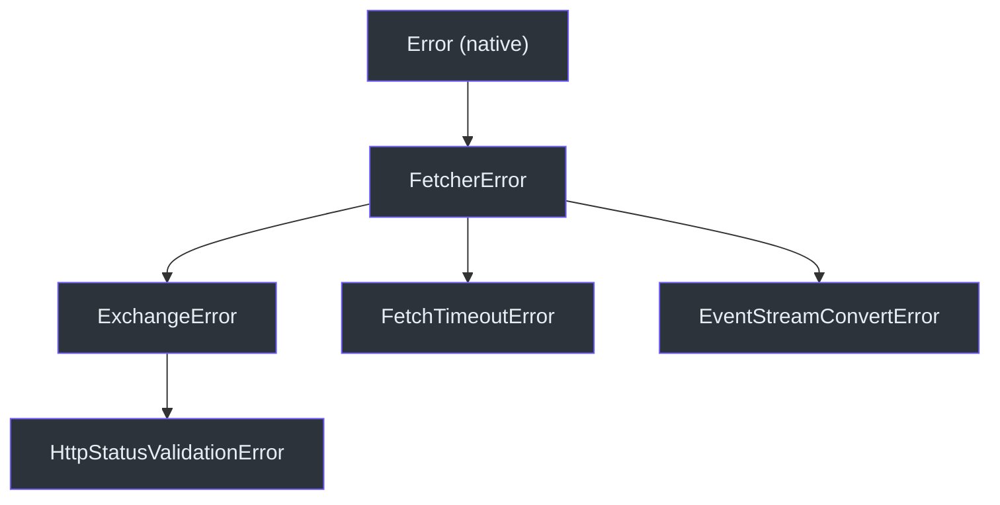

# Fetcher Core

The `fetcher` package is the foundation of the entire monorepo. It wraps the native Fetch API with an interceptor pipeline, URL building, timeout control, and a named-instance registry -- all with zero internal dependencies.

Source: [packages/fetcher/src/fetcher.ts](https://github.com/Ahoo-Wang/fetcher/blob/main/packages/fetcher/src/fetcher.ts)

## Class Hierarchy



## Fetcher Class

The `Fetcher` class is the primary HTTP client. Its constructor accepts a `FetcherOptions` object and wires up the `UrlBuilder`, default headers, timeout, and `InterceptorManager`.

```typescript
// [packages/fetcher/src/fetcher.ts:144-150]
constructor(options: FetcherOptions = DEFAULT_OPTIONS) {
  this.urlBuilder = new UrlBuilder(options.baseURL, options.urlTemplateStyle);
  this.headers = options.headers ?? DEFAULT_HEADERS;
  this.timeout = options.timeout;
  this.interceptors =
    options.interceptors ?? new InterceptorManager(options.validateStatus);
}
```

Source: [packages/fetcher/src/fetcher.ts:144-150](https://github.com/Ahoo-Wang/fetcher/blob/main/packages/fetcher/src/fetcher.ts#L144-L150)

### FetcherOptions

| Property | Type | Default | Description |
|---|---|---|---|
| `baseURL` | `string` | `""` | Prefix for all request URLs |
| `headers` | `RequestHeaders` | `{ "Content-Type": "application/json" }` | Default request headers |
| `timeout` | `number` | `undefined` (no timeout) | Global timeout in milliseconds |
| `urlTemplateStyle` | `UrlTemplateStyle` | `UriTemplate` | `{id}` or `:id` syntax |
| `interceptors` | `InterceptorManager` | *auto-created* | Custom interceptor manager |
| `validateStatus` | `ValidateStatus` | `status >= 200 && status < 300` | Status code validation |

Source: [packages/fetcher/src/fetcher.ts:51-80](https://github.com/Ahoo-Wang/fetcher/blob/main/packages/fetcher/src/fetcher.ts#L51-L80)

### HTTP Method Convenience Methods

The Fetcher provides convenience methods for all standard HTTP verbs. Each delegates to the private `methodFetch` helper.

| Method | Signature | Omits Body |
|---|---|---|
| `get` | `get<R>(url, request?, options?)` | Yes |
| `post` | `post<R>(url, request?, options?)` | No |
| `put` | `put<R>(url, request?, options?)` | No |
| `patch` | `patch<R>(url, request?, options?)` | No |
| `delete` | `delete<R>(url, request?, options?)` | Yes |
| `head` | `head<R>(url, request?, options?)` | Yes |
| `options` | `options<R>(url, request?, options?)` | Yes |
| `trace` | `trace<R>(url, request?, options?)` | Yes |
| `fetch` | `fetch<R>(url, request?, options?)` | No |

Source: [packages/fetcher/src/fetcher.ts:258-500](https://github.com/Ahoo-Wang/fetcher/blob/main/packages/fetcher/src/fetcher.ts#L258-L500)

## Request Lifecycle

### Exchange Resolution

When a request is initiated, `resolveExchange` merges default headers with request-level headers, resolves timeout (request-level takes precedence over fetcher-level), merges request options, and constructs a `FetchExchange`.

```typescript
// [packages/fetcher/src/fetcher.ts:172-194]
resolveExchange(request: FetchRequest, options?: RequestOptions) {
  const mergedHeaders = {
    ...this.headers,
    ...request.headers,
  };
  const fetchRequest: FetchRequest = {
    ...request,
    headers: mergedHeaders,
    timeout: resolveTimeout(request.timeout, this.timeout),
  };
  const { resultExtractor, attributes } = mergeRequestOptions(
    DEFAULT_REQUEST_OPTIONS,
    options,
  );
  return new FetchExchange({
    fetcher: this,
    request: fetchRequest,
    resultExtractor,
    attributes,
  });
}
```

Source: [packages/fetcher/src/fetcher.ts:172-194](https://github.com/Ahoo-Wang/fetcher/blob/main/packages/fetcher/src/fetcher.ts#L172-L194)

### Full Lifecycle Sequence



### FetchExchange

`FetchExchange` is the data object that flows through the entire interceptor chain. It carries the request, response, error, a reference to the Fetcher, shared attributes, and a result extractor.

Key properties and methods:

| Member | Type | Description |
|---|---|---|
| `fetcher` | `Fetcher` | The Fetcher that initiated this exchange |
| `request` | `FetchRequest` | URL, method, headers, body, timeout, urlParams |
| `response` | `Response \| undefined` | Set after fetch completes |
| `error` | `Error \| undefined` | Set if an error occurred |
| `attributes` | `Map<string, any>` | Shared data between interceptors |
| `resultExtractor` | `ResultExtractor<any>` | How to extract the final result |
| `hasError()` | `boolean` | Checks if error is present |
| `hasResponse()` | `boolean` | Checks if response is present |
| `requiredResponse` | `Response` | Throws `ExchangeError` if no response |
| `extractResult<R>()` | `Promise<R>` | Applies result extractor (cached) |

Source: [packages/fetcher/src/fetchExchange.ts:105-286](https://github.com/Ahoo-Wang/fetcher/blob/main/packages/fetcher/src/fetchExchange.ts#L105-L286)

The result is cached after the first call to `extractResult()` to avoid repeated computation:

```typescript
// [packages/fetcher/src/fetchExchange.ts:278-285]
async extractResult<R>(): Promise<R> {
  if (this.hasCachedResult) {
    return await this.cachedExtractedResult;
  }
  this.hasCachedResult = true;
  this.cachedExtractedResult = this.resultExtractor(this);
  return await this.cachedExtractedResult;
}
```

Source: [packages/fetcher/src/fetchExchange.ts:278-285](https://github.com/Ahoo-Wang/fetcher/blob/main/packages/fetcher/src/fetchExchange.ts#L278-L285)

## NamedFetcher & FetcherRegistrar

### NamedFetcher

`NamedFetcher` extends `Fetcher` and automatically registers itself with the global `fetcherRegistrar` in its constructor. This allows retrieving fetcher instances by name throughout the application.

```typescript
// [packages/fetcher/src/namedFetcher.ts:38-66]
export class NamedFetcher extends Fetcher implements NamedCapable {
  name: string;
  constructor(name: string, options: FetcherOptions = DEFAULT_OPTIONS) {
    super(options);
    this.name = name;
    fetcherRegistrar.register(name, this);
  }
}
```

Source: [packages/fetcher/src/namedFetcher.ts:38-66](https://github.com/Ahoo-Wang/fetcher/blob/main/packages/fetcher/src/namedFetcher.ts#L38-L66)

### FetcherRegistrar

`FetcherRegistrar` is a `Map<string, Fetcher>` wrapper with typed accessors. A global singleton is exported for application-wide use.

```typescript
// [packages/fetcher/src/fetcherRegistrar.ts:41-150]
export class FetcherRegistrar {
  private registrar: Map<string, Fetcher> = new Map();
  register(name: string, fetcher: Fetcher): void { ... }
  unregister(name: string): boolean { ... }
  get(name: string): Fetcher | undefined { ... }
  requiredGet(name: string): Fetcher { ... }
  get default(): Fetcher { return this.requiredGet(DEFAULT_FETCHER_NAME); }
  set default(fetcher: Fetcher) { this.register(DEFAULT_FETCHER_NAME, fetcher); }
  get fetchers(): Map<string, Fetcher> { return new Map(this.registrar); }
}
export const fetcherRegistrar = new FetcherRegistrar();
```

Source: [packages/fetcher/src/fetcherRegistrar.ts:41-166](https://github.com/Ahoo-Wang/fetcher/blob/main/packages/fetcher/src/fetcherRegistrar.ts#L41-L166)

### Registry Pattern Diagram



A convenience default instance is created at module load time:

```typescript
// [packages/fetcher/src/namedFetcher.ts:89]
export const fetcher = new NamedFetcher(DEFAULT_FETCHER_NAME);
```

Source: [packages/fetcher/src/namedFetcher.ts:89](https://github.com/Ahoo-Wang/fetcher/blob/main/packages/fetcher/src/namedFetcher.ts#L89)

## Timeout Handling

Timeout is implemented in the `timeoutFetch` function using `Promise.race` between the native `fetch()` and a timeout promise backed by `AbortController`.

### Timeout Decision Flowchart



Key behaviors:

1. If `request.signal` already exists, timeout is bypassed to avoid conflicts.
2. If no timeout is set but an `abortController` is provided, its signal is attached directly.
3. If a timeout is set, a new `AbortController` is created (or the provided one is reused) and a timer races against the fetch.

```typescript
// [packages/fetcher/src/timeout.ts:120-172]
export async function timeoutFetch(request: FetchRequest): Promise<Response> {
  const url = request.url;
  const timeout = request.timeout;
  const requestInit = request as RequestInit;

  if (request.signal) {
    return await fetch(url, requestInit);
  }

  if (!timeout) {
    if (request.abortController) {
      requestInit.signal = request.abortController.signal;
    }
    return await fetch(url, requestInit);
  }

  const controller = request.abortController ?? new AbortController();
  request.abortController = controller;
  requestInit.signal = controller.signal;

  let timerId: ReturnType<typeof setTimeout> | null = null;
  let aborted = false;
  const timeoutPromise = new Promise<Response>((_, reject) => {
    timerId = setTimeout(() => {
      if (aborted) return;
      aborted = true;
      if (timerId) { clearTimeout(timerId); }
      const error = new FetchTimeoutError(request);
      controller.abort(error);
      reject(error);
    }, timeout);
  });

  try {
    return await Promise.race([fetch(url, requestInit), timeoutPromise]);
  } finally {
    aborted = true;
    if (timerId) { clearTimeout(timerId); }
  }
}
```

Source: [packages/fetcher/src/timeout.ts:120-172](https://github.com/Ahoo-Wang/fetcher/blob/main/packages/fetcher/src/timeout.ts#L120-L172)

### Timeout Resolution

When both a request-level and fetcher-level timeout are specified, the request-level value takes precedence:

```typescript
// [packages/fetcher/src/timeout.ts:81-89]
export function resolveTimeout(
  requestTimeout?: number,
  optionsTimeout?: number,
): number | undefined {
  if (typeof requestTimeout !== 'undefined') {
    return requestTimeout;
  }
  return optionsTimeout;
}
```

Source: [packages/fetcher/src/timeout.ts:81-89](https://github.com/Ahoo-Wang/fetcher/blob/main/packages/fetcher/src/timeout.ts#L81-L89)

## Error Hierarchy

Fetcher defines a structured error hierarchy to provide rich context at each failure point.



### FetcherError

Base error class for all Fetcher errors. Supports error chaining via the `cause` property and copies the stack trace from the cause when available.

```typescript
// [packages/fetcher/src/fetcherError.ts:37-62]
export class FetcherError extends Error {
  constructor(
    errorMsg?: string,
    public readonly cause?: Error | unknown,
  ) {
    const causeMessage = cause instanceof Error ? cause.message : undefined;
    const errorMessage =
      errorMsg || causeMessage || 'An error occurred in the fetcher';
    super(errorMessage);
    this.name = 'FetcherError';
    if (cause instanceof Error && cause.stack) {
      this.stack = cause.stack;
    }
    Object.setPrototypeOf(this, FetcherError.prototype);
  }
}
```

Source: [packages/fetcher/src/fetcherError.ts:37-62](https://github.com/Ahoo-Wang/fetcher/blob/main/packages/fetcher/src/fetcherError.ts#L37-L62)

### ExchangeError

Thrown when the interceptor pipeline fails and error interceptors do not clear the error. Carries the full `FetchExchange` for debugging.

```typescript
// [packages/fetcher/src/fetcherError.ts:86-106]
export class ExchangeError extends FetcherError {
  constructor(
    public readonly exchange: FetchExchange,
    errorMsg?: string,
  ) {
    const errorMessage =
      errorMsg ||
      exchange.error?.message ||
      exchange.response?.statusText ||
      `Request to ${exchange.request.url} failed during exchange`;
    super(errorMessage, exchange.error);
    this.name = 'ExchangeError';
    Object.setPrototypeOf(this, ExchangeError.prototype);
  }
}
```

Source: [packages/fetcher/src/fetcherError.ts:86-106](https://github.com/Ahoo-Wang/fetcher/blob/main/packages/fetcher/src/fetcherError.ts#L86-L106)

### FetchTimeoutError

Thrown by `timeoutFetch` when a request exceeds its timeout. Includes the request that timed out.

```typescript
// [packages/fetcher/src/timeout.ts:33-53]
export class FetchTimeoutError extends FetcherError {
  request: FetchRequest;
  constructor(request: FetchRequest) {
    const method = request.method || 'GET';
    const message = `Request timeout of ${request.timeout}ms exceeded for ${method} ${request.url}`;
    super(message);
    this.name = 'FetchTimeoutError';
    this.request = request;
    Object.setPrototypeOf(this, FetchTimeoutError.prototype);
  }
}
```

Source: [packages/fetcher/src/timeout.ts:33-53](https://github.com/Ahoo-Wang/fetcher/blob/main/packages/fetcher/src/timeout.ts#L33-L53)

### HttpStatusValidationError

Thrown by `ValidateStatusInterceptor` when a response status code does not pass validation. Extends `ExchangeError` so it carries the full exchange context.

```typescript
// [packages/fetcher/src/validateStatusInterceptor.ts:27-36]
export class HttpStatusValidationError extends ExchangeError {
  constructor(exchange: FetchExchange) {
    super(
      exchange,
      `Request failed with status code ${exchange.response?.status} for ${exchange.request.url}`,
    );
    this.name = 'HttpStatusValidationError';
    Object.setPrototypeOf(this, HttpStatusValidationError.prototype);
  }
}
```

Source: [packages/fetcher/src/validateStatusInterceptor.ts:27-36](https://github.com/Ahoo-Wang/fetcher/blob/main/packages/fetcher/src/validateStatusInterceptor.ts#L27-L36)

## Result Extractors

The `ResultExtractor` pattern decouples the Fetcher from a specific response format. Callers choose how to extract the result via the `options.resultExtractor` parameter.

| Extractor | Returns | Use Case |
|---|---|---|
| `ResultExtractors.Exchange` | `FetchExchange` | Full access to request, response, metadata |
| `ResultExtractors.Response` | `Response` | Raw Response object |
| `ResultExtractors.Json` | `Promise<any>` | Parsed JSON body |
| `ResultExtractors.Text` | `Promise<string>` | Plain text body |
| `ResultExtractors.Blob` | `Promise<Blob>` | Binary data (images, files) |
| `ResultExtractors.ArrayBuffer` | `Promise<ArrayBuffer>` | Low-level binary |
| `ResultExtractors.Bytes` | `Promise<Uint8Array>` | Byte array |

Source: [packages/fetcher/src/resultExtractor.ts:42-160](https://github.com/Ahoo-Wang/fetcher/blob/main/packages/fetcher/src/resultExtractor.ts#L42-L160)

The default for `fetcher.fetch()` is `Response`; the default for `fetcher.request()` is `Exchange`:

```typescript
// [packages/fetcher/src/fetcher.ts:97-102]
export const DEFAULT_REQUEST_OPTIONS: RequestOptions = {
  resultExtractor: ResultExtractors.Exchange,
};
export const DEFAULT_FETCH_OPTIONS: RequestOptions = {
  resultExtractor: ResultExtractors.Response,
};
```

Source: [packages/fetcher/src/fetcher.ts:97-102](https://github.com/Ahoo-Wang/fetcher/blob/main/packages/fetcher/src/fetcher.ts#L97-L102)

## Cross-References

- [Architecture Overview](/architecture/) -- system diagram, package dependency graph
- [Interceptor System](/architecture/interceptors) -- detailed interceptor pipeline
- [URL Builder](/architecture/url-builder) -- path template resolution and query parameters
- [EventStream & SSE](/architecture/eventstream) -- SSE streaming support and `EventStreamResultExtractor`
