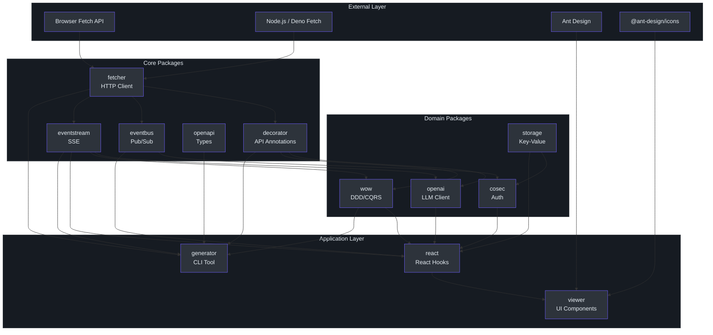
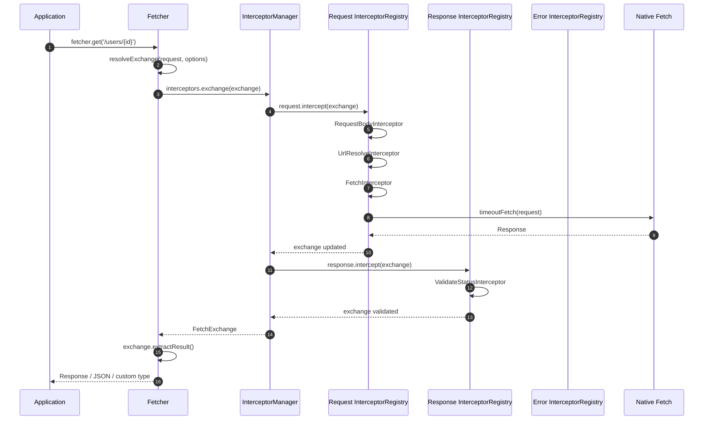
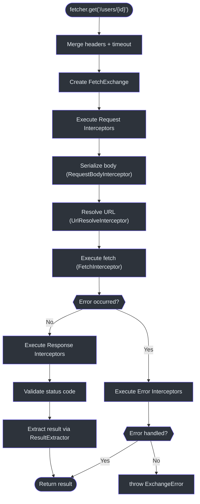

# Architecture Overview

Fetcher is a modular HTTP client ecosystem built on the native Fetch API.
It delivers an Axios-like experience through interceptor-powered middleware, TypeScript-first design, and native Server-Sent Event / LLM streaming support.
The codebase is organized as a **pnpm workspaces monorepo** with 12 packages under `packages/` plus an `integration-test/` workspace.

## System Architecture Diagram

## Package Dependency Graph

The following table summarizes each package, its role, and its internal dependencies.

| Package | npm Name | Role | Dependencies |
|---|---|---|---|
| **openapi** | `@ahoo-wang/fetcher-openapi` | OpenAPI 3.x type definitions | *none (standalone)* |
| **fetcher** | `@ahoo-wang/fetcher` | Core HTTP client | *none (foundation)* |
| **decorator** | `@ahoo-wang/fetcher-decorator` | Declarative API decorators | fetcher |
| **eventbus** | `@ahoo-wang/fetcher-eventbus` | Publish/subscribe messaging | fetcher |
| **eventstream** | `@ahoo-wang/fetcher-eventstream` | SSE / streaming support | fetcher |
| **openai** | `@ahoo-wang/fetcher-openai` | OpenAI-compatible LLM client | fetcher, eventstream, decorator |
| **wow** | `@ahoo-wang/fetcher-wow` | DDD / CQRS / Event Sourcing | fetcher, eventstream, decorator |
| **storage** | `@ahoo-wang/fetcher-storage` | Key-value storage abstraction | eventbus |
| **cosec** | `@ahoo-wang/fetcher-cosec` | Authentication & authorization | fetcher, eventbus, storage |
| **react** | `@ahoo-wang/fetcher-react` | React hooks & providers | fetcher, eventstream, eventbus, storage, wow, cosec |
| **viewer** | `@ahoo-wang/fetcher-viewer` | Ant Design UI components | *all above* + antd, @ant-design/icons |
| **generator** | `@ahoo-wang/fetcher-generator` | CLI code generator | fetcher, eventstream, decorator, openapi, wow |

Source: [packages/fetcher/src/index.ts](https://github.com/Ahoo-Wang/fetcher/blob/main/packages/fetcher/src/index.ts)

## Layered Dependency Diagram

```mermaid
graph LR
  subgraph Layer0["Layer 0 - No Dependencies"]
    style Layer0 fill:#161b22,stroke:#30363d,color:#e6edf3
    OpenAPI2["openapi"]
    Fetcher2["fetcher"]
  end

  subgraph Layer1["Layer 1 - Core Extensions"]
    style Layer1 fill:#161b22,stroke:#30363d,color:#e6edf3
    Decorator2["decorator"]
    EventBus2["eventbus"]
    EventStream2["eventstream"]
  end

  subgraph Layer2["Layer 2 - Domain Packages"]
    style Layer2 fill:#161b22,stroke:#30363d,color:#e6edf3
    OpenAI2["openai"]
    Wow2["wow"]
    Storage2["storage"]
    Cosec2["cosec"]
  end

  subgraph Layer3["Layer 3 - Application"]
    style Layer3 fill:#161b22,stroke:#30363d,color:#e6edf3
    React2["react"]
    Viewer2["viewer"]
    Generator2["generator"]
  end

  OpenAPI2 --> Layer1
  Fetcher2 --> Layer1
  Layer1 --> Layer2
  Layer2 --> Layer3

  style OpenAPI2 fill:#2d333b,stroke:#6d5dfc,color:#e6edf3
  style Fetcher2 fill:#2d333b,stroke:#6d5dfc,color:#e6edf3
  style Decorator2 fill:#2d333b,stroke:#6d5dfc,color:#e6edf3
  style EventBus2 fill:#2d333b,stroke:#6d5dfc,color:#e6edf3
  style EventStream2 fill:#2d333b,stroke:#6d5dfc,color:#e6edf3
  style OpenAI2 fill:#2d333b,stroke:#6d5dfc,color:#e6edf3
  style Wow2 fill:#2d333b,stroke:#6d5dfc,color:#e6edf3
  style Storage2 fill:#2d333b,stroke:#6d5dfc,color:#e6edf3
  style Cosec2 fill:#2d333b,stroke:#6d5dfc,color:#e6edf3
  style React2 fill:#2d333b,stroke:#6d5dfc,color:#e6edf3
  style Viewer2 fill:#2d333b,stroke:#6d5dfc,color:#e6edf3
  style Generator2 fill:#2d333b,stroke:#6d5dfc,color:#e6edf3
```

## Request Lifecycle

The following sequence diagram shows how a single HTTP request flows through the system, from the application call down to the native Fetch API and back through response interceptors.

See [Fetcher Core](/architecture/fetcher-core) and [Interceptor System](/architecture/interceptors) for full details.

## Design Principles

### 1. Foundation-First Layering

Every package in the monorepo targets a single responsibility. The `fetcher` package has **zero internal dependencies** -- it wraps the native Fetch API and nothing else. Higher-level packages (decorator, eventstream, eventbus) depend only on `fetcher`. Domain packages compose these foundations.

Source: [packages/fetcher/src/index.ts](https://github.com/Ahoo-Wang/fetcher/blob/main/packages/fetcher/src/index.ts)

### 2. Interceptor-Driven Extensibility

All request/response processing passes through a three-phase interceptor pipeline (request, response, error). Built-in behaviors -- URL resolution, body serialization, timeout, status validation -- are themselves interceptors, not hard-coded logic. Users can inject custom interceptors at any position via the `order` property.

Source: [packages/fetcher/src/interceptorManager.ts:62-66](https://github.com/Ahoo-Wang/fetcher/blob/main/packages/fetcher/src/interceptorManager.ts#L62-L66)

### 3. Side-Effect Module Pattern

The `eventstream` package uses a **side-effect import** -- simply importing `@ahoo-wang/fetcher-eventstream` patches `Response.prototype` with `eventStream()`, `jsonEventStream()`, and related properties. No explicit registration is required.

Source: [packages/eventstream/src/responses.ts:102-239](https://github.com/Ahoo-Wang/fetcher/blob/main/packages/eventstream/src/responses.ts#L102-L239)

### 4. Named Registry Pattern

Multiple Fetcher instances are managed through `FetcherRegistrar` and `NamedFetcher`. A global singleton `fetcherRegistrar` stores named instances, and a convenience default `fetcher` export is pre-registered under the name `"default"`.

Source: [packages/fetcher/src/fetcherRegistrar.ts:166](https://github.com/Ahoo-Wang/fetcher/blob/main/packages/fetcher/src/fetcherRegistrar.ts#L166), [packages/fetcher/src/namedFetcher.ts:89](https://github.com/Ahoo-Wang/fetcher/blob/main/packages/fetcher/src/namedFetcher.ts#L89)

### 5. Result Extraction Strategy

Rather than forcing a single return type, the Fetcher uses a `ResultExtractor` function to transform a `FetchExchange` into the caller's desired type. Built-in extractors include `Exchange`, `Response`, `Json`, `Text`, `Blob`, `ArrayBuffer`, and `Bytes`.

Source: [packages/fetcher/src/resultExtractor.ts:131-160](https://github.com/Ahoo-Wang/fetcher/blob/main/packages/fetcher/src/resultExtractor.ts#L131-L160)

## Request Processing Flowchart

## Technology Stack

| Category | Technology | Purpose |
|---|---|---|
| Language | TypeScript (strict mode) | Type safety across all packages |
| Runtime | Browser Fetch API, Node.js native fetch | HTTP transport |
| Build | Vite + unplugin-dts | Bundle ESM/UMD + type declarations |
| Testing | Vitest + @vitest/coverage-v8 | Unit tests and coverage |
| Browser Tests | @vitest/browser + Playwright | Component testing (viewer) |
| HTTP Mocking | MSW (Mock Service Worker) | Fetcher unit tests |
| Code Generation | ts-morph + commander | Generator CLI |
| UI Framework | React 19 + Ant Design 5 | Viewer components |
| Styling | Less | Ant Design theme integration |
| Package Manager | pnpm workspaces | Monorepo management |
| Linting | ESLint + Prettier | Code style enforcement |
| React Compiler | babel-plugin-react-compiler | Automatic React optimization |

Source: [CLAUDE.md](https://github.com/Ahoo-Wang/fetcher/blob/main/CLAUDE.md)

## Cross-References

- [Fetcher Core](/architecture/fetcher-core) -- `Fetcher`, `NamedFetcher`, `FetcherRegistrar`, timeout and error handling
- [Interceptor System](/architecture/interceptors) -- `InterceptorManager`, `InterceptorRegistry`, built-in interceptors
- [EventStream & SSE](/architecture/eventstream) -- side-effect module, SSE protocol, LLM streaming
- [URL Builder](/architecture/url-builder) -- `UrlBuilder`, path templates, query parameters
