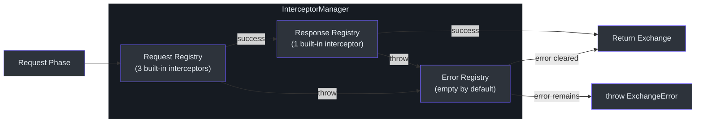
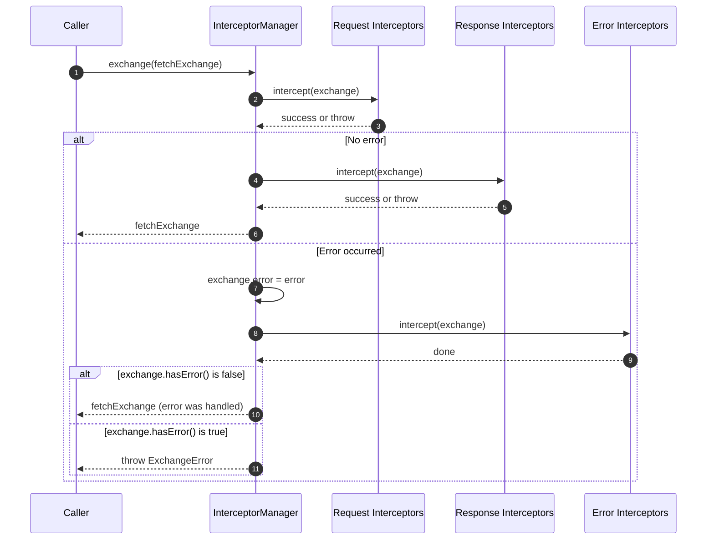
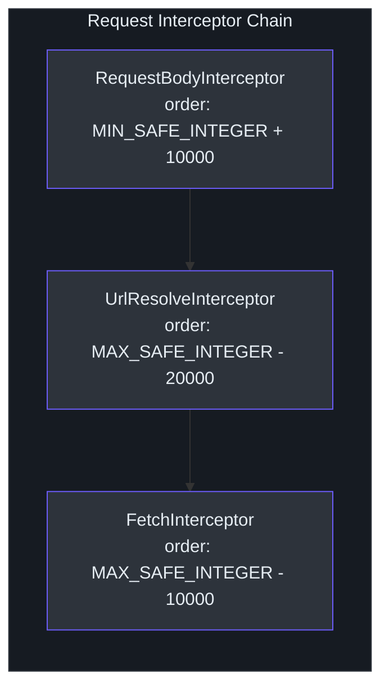
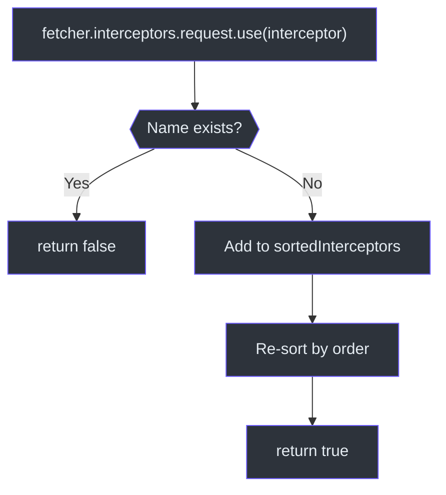

# Interceptor System

The interceptor system is the central extensibility mechanism of Fetcher. All request processing -- URL resolution, body serialization, HTTP execution, status validation -- is implemented as interceptors, not as hard-coded logic. Users can insert, remove, or replace interceptors at any position in the chain.

Source: [packages/fetcher/src/interceptorManager.ts](https://github.com/Ahoo-Wang/fetcher/blob/main/packages/fetcher/src/interceptorManager.ts)

## Three-Phase Architecture

The `InterceptorManager` orchestrates three independent `InterceptorRegistry` instances, one for each phase of the request lifecycle.



Source: [packages/fetcher/src/interceptorManager.ts:62-103](https://github.com/Ahoo-Wang/fetcher/blob/main/packages/fetcher/src/interceptorManager.ts#L62-L103)

## InterceptorManager.exchange()

The `exchange()` method is the heart of the pipeline. It runs request interceptors, then response interceptors (on success) or error interceptors (on failure). If error interceptors clear the error, the exchange is returned successfully; otherwise an `ExchangeError` is thrown.

```typescript
// [packages/fetcher/src/interceptorManager.ts:191-212]
async exchange(fetchExchange: FetchExchange): Promise<FetchExchange> {
  try {
    await this.request.intercept(fetchExchange);
    await this.response.intercept(fetchExchange);
    return fetchExchange;
  } catch (error: any) {
    fetchExchange.error = error;
    await this.error.intercept(fetchExchange);
    if (!fetchExchange.hasError()) {
      return fetchExchange;
    }
    throw new ExchangeError(fetchExchange);
  }
}
```

Source: [packages/fetcher/src/interceptorManager.ts:191-212](https://github.com/Ahoo-Wang/fetcher/blob/main/packages/fetcher/src/interceptorManager.ts#L191-L212)

### Complete Execution Flow



## Interceptor Interface

Every interceptor implements the `Interceptor` interface: a `name` (unique identifier), an `order` (execution priority), and an `intercept(exchange)` method.

```typescript
// [packages/fetcher/src/interceptor.ts:44-85]
export interface Interceptor extends NamedCapable, OrderedCapable {
  readonly name: string;
  readonly order: number;
  intercept(exchange: FetchExchange): void | Promise<void>;
}
```

Source: [packages/fetcher/src/interceptor.ts:44-85](https://github.com/Ahoo-Wang/fetcher/blob/main/packages/fetcher/src/interceptor.ts#L44-L85)

Three marker interfaces extend `Interceptor` for semantic clarity, though they add no additional members:

| Interface | Purpose |
|---|---|
| `RequestInterceptor` | Runs before the HTTP request is sent |
| `ResponseInterceptor` | Runs after the HTTP response is received |
| `ErrorInterceptor` | Runs when an error occurs |

Source: [packages/fetcher/src/interceptor.ts:111-164](https://github.com/Ahoo-Wang/fetcher/blob/main/packages/fetcher/src/interceptor.ts#L111-L164)

## InterceptorRegistry

`InterceptorRegistry` manages a sorted list of interceptors for a single phase. Interceptors are uniquely identified by their `name` property.

```typescript
// [packages/fetcher/src/interceptor.ts:189-300]
export class InterceptorRegistry implements Interceptor {
  private sortedInterceptors: Interceptor[] = [];

  constructor(interceptors: Interceptor[] = []) {
    this.sortedInterceptors = toSorted(interceptors);
  }

  use(interceptor: Interceptor): boolean {
    if (this.sortedInterceptors.some(item => item.name === interceptor.name)) {
      return false; // duplicate name rejected
    }
    this.sortedInterceptors = toSorted([...this.sortedInterceptors, interceptor]);
    return true;
  }

  eject(name: string): boolean { ... }
  clear(): void { ... }

  async intercept(exchange: FetchExchange): Promise<void> {
    for (const interceptor of this.sortedInterceptors) {
      await interceptor.intercept(exchange);
    }
  }
}
```

Source: [packages/fetcher/src/interceptor.ts:189-300](https://github.com/Ahoo-Wang/fetcher/blob/main/packages/fetcher/src/interceptor.ts#L189-L300)

### Key Behaviors

- **Duplicate prevention**: `use()` returns `false` if an interceptor with the same name already exists.
- **Automatic sorting**: After every `use()` or constructor, interceptors are sorted ascending by `order`.
- **Ejection by name**: `eject(name)` removes the interceptor with the given name.
- **Sequential execution**: `intercept()` iterates through all interceptors in order, awaiting each one.

## Ordering System

Interceptors are sorted by their `order` property using the `OrderedCapable` interface. Lower values execute first.

```typescript
// [packages/fetcher/src/orderedCapable.ts:53-55]
export function sortOrder<T extends OrderedCapable>(a: T, b: T): number {
  return (a.order ?? DEFAULT_ORDER) - (b.order ?? DEFAULT_ORDER);
}
```

Source: [packages/fetcher/src/orderedCapable.ts:53-55](https://github.com/Ahoo-Wang/fetcher/blob/main/packages/fetcher/src/orderedCapable.ts#L53-L55)

### Order Constants

The framework uses `BUILT_IN_INTERCEPTOR_ORDER_STEP` (10,000) to space built-in interceptors apart, leaving room for custom interceptors between them.

```typescript
// [packages/fetcher/src/interceptor.ts:18-21]
export const DEFAULT_INTERCEPTOR_ORDER_STEP = 1000;
export const BUILT_IN_INTERCEPTOR_ORDER_STEP = DEFAULT_INTERCEPTOR_ORDER_STEP * 10;
```

Source: [packages/fetcher/src/interceptor.ts:18-21](https://github.com/Ahoo-Wang/fetcher/blob/main/packages/fetcher/src/interceptor.ts#L18-L21)

## Built-in Interceptors

### Request Phase Interceptors

The request registry is initialized with three interceptors that execute in the following order:



#### 1. RequestBodyInterceptor (order: `Number.MIN_SAFE_INTEGER + 10000`)

Converts plain object bodies to JSON strings and sets the `Content-Type: application/json` header. Skips null/undefined bodies, strings, binary types (ArrayBuffer, TypedArray, ReadableStream), and auto-content types (Blob, File, FormData, URLSearchParams).

```typescript
// [packages/fetcher/src/requestBodyInterceptor.ts:135-166]
intercept(exchange: FetchExchange) {
  const request = exchange.request;
  if (request.body === undefined || request.body === null) { return; }
  if (typeof request.body !== 'object') { return; }
  const headers = exchange.ensureRequestHeaders();
  if (this.isAutoAppendContentType(request.body)) {
    if (headers[CONTENT_TYPE_HEADER]) { delete headers[CONTENT_TYPE_HEADER]; }
    return;
  }
  if (this.isSupportedComplexBodyType(request.body)) { return; }
  exchange.request.body = JSON.stringify(request.body);
  if (!headers[CONTENT_TYPE_HEADER]) {
    headers[CONTENT_TYPE_HEADER] = ContentTypeValues.APPLICATION_JSON;
  }
}
```

Source: [packages/fetcher/src/requestBodyInterceptor.ts:135-166](https://github.com/Ahoo-Wang/fetcher/blob/main/packages/fetcher/src/requestBodyInterceptor.ts#L135-L166)

#### 2. UrlResolveInterceptor (order: `Number.MAX_SAFE_INTEGER - 20000`)

Resolves the final URL by calling the Fetcher's `UrlBuilder.resolveRequestUrl()`. This combines the base URL, interpolates path parameters, and appends query parameters.

```typescript
// [packages/fetcher/src/urlResolveInterceptor.ts:74-78]
intercept(exchange: FetchExchange) {
  const request = exchange.request;
  request.url = exchange.fetcher.urlBuilder.resolveRequestUrl(request);
}
```

Source: [packages/fetcher/src/urlResolveInterceptor.ts:74-78](https://github.com/Ahoo-Wang/fetcher/blob/main/packages/fetcher/src/urlResolveInterceptor.ts#L74-L78)

#### 3. FetchInterceptor (order: `Number.MAX_SAFE_INTEGER - 10000`)

Executes the actual HTTP request via `timeoutFetch()` and sets the response on the exchange. This is always the last request interceptor to run.

```typescript
// [packages/fetcher/src/fetchInterceptor.ts:101-103]
async intercept(exchange: FetchExchange) {
  exchange.response = await timeoutFetch(exchange.request);
}
```

Source: [packages/fetcher/src/fetchInterceptor.ts:101-103](https://github.com/Ahoo-Wang/fetcher/blob/main/packages/fetcher/src/fetchInterceptor.ts#L101-L103)

### Response Phase Interceptors

#### ValidateStatusInterceptor (order: `Number.MAX_SAFE_INTEGER - 10000`)

Validates the response status code. By default, accepts 2xx codes. Throws `HttpStatusValidationError` for invalid statuses. Can be skipped per-request by setting `IGNORE_VALIDATE_STATUS` attribute to `true`.

```typescript
// [packages/fetcher/src/validateStatusInterceptor.ts:170-186]
intercept(exchange: FetchExchange) {
  if (exchange.attributes.get(IGNORE_VALIDATE_STATUS) === true) {
    return;
  }
  if (!exchange.response) { return; }
  const status = exchange.response.status;
  if (this.validateStatus(status)) { return; }
  throw new HttpStatusValidationError(exchange);
}
```

Source: [packages/fetcher/src/validateStatusInterceptor.ts:170-186](https://github.com/Ahoo-Wang/fetcher/blob/main/packages/fetcher/src/validateStatusInterceptor.ts#L170-L186)

### Error Phase Interceptors

The error interceptor registry starts **empty** by default. Users add custom error handling (retry, logging, token refresh) as needed.

Source: [packages/fetcher/src/interceptorManager.ts:103](https://github.com/Ahoo-Wang/fetcher/blob/main/packages/fetcher/src/interceptorManager.ts#L103)

## Complete Interceptor Order Table

| Phase | Interceptor | Order Value | Purpose |
|---|---|---|---|
| Request | `RequestBodyInterceptor` | `MIN_SAFE_INTEGER + 10000` | Serialize object body to JSON |
| Request | *Custom interceptors* | Between built-in values | User-defined logic |
| Request | `UrlResolveInterceptor` | `MAX_SAFE_INTEGER - 20000` | Build final URL |
| Request | `FetchInterceptor` | `MAX_SAFE_INTEGER - 10000` | Execute native fetch with timeout |
| Response | `ValidateStatusInterceptor` | `MAX_SAFE_INTEGER - 10000` | Validate HTTP status code |
| Error | *(empty by default)* | -- | Custom error handlers |

## Writing Custom Interceptors

### Custom Request Interceptor

```typescript
const authInterceptor: RequestInterceptor = {
  name: 'AuthInterceptor',
  order: 5000, // runs between RequestBodyInterceptor and UrlResolveInterceptor
  async intercept(exchange: FetchExchange): Promise<void> {
    const token = await getToken();
    exchange.ensureRequestHeaders()['Authorization'] = `Bearer ${token}`;
  },
};

fetcher.interceptors.request.use(authInterceptor);
```

### Custom Response Interceptor

```typescript
const loggingInterceptor: ResponseInterceptor = {
  name: 'ResponseLogger',
  order: 100, // runs before ValidateStatusInterceptor
  intercept(exchange: FetchExchange): void {
    console.log(`${exchange.request.method} ${exchange.request.url} => ${exchange.response?.status}`);
  },
};

fetcher.interceptors.response.use(loggingInterceptor);
```

### Custom Error Interceptor (Retry)

```typescript
const retryInterceptor: ErrorInterceptor = {
  name: 'RetryInterceptor',
  order: 1000,
  async intercept(exchange: FetchExchange): Promise<void> {
    const retryCount = exchange.attributes.get('retryCount') ?? 0;
    if (retryCount < 3 && isRetryable(exchange.error)) {
      exchange.attributes.set('retryCount', retryCount + 1);
      exchange.error = undefined; // clear error to signal handling
      exchange.response = await timeoutFetch(exchange.request);
    }
  },
};

fetcher.interceptors.error.use(retryInterceptor);
```

### Interceptor Registration Flow



## Attribute Sharing Between Interceptors

Interceptors can share data via the `exchange.attributes` `Map<string, any>`. This enables coordination between request, response, and error interceptors without coupling them directly.

```typescript
// In a request interceptor
exchange.attributes.set('startTime', Date.now());

// In a response interceptor
const start = exchange.attributes.get('startTime');
console.log(`Request took ${Date.now() - start}ms`);
```

The `IGNORE_VALIDATE_STATUS` attribute is a built-in example of this pattern -- setting it to `true` skips status validation for that specific request.

Source: [packages/fetcher/src/validateStatusInterceptor.ts:97](https://github.com/Ahoo-Wang/fetcher/blob/main/packages/fetcher/src/validateStatusInterceptor.ts#L97)

## Cross-References

- [Fetcher Core](/architecture/fetcher-core) -- `Fetcher`, `FetchExchange`, error hierarchy
- [URL Builder](/architecture/url-builder) -- how `UrlResolveInterceptor` builds URLs
- [EventStream & SSE](/architecture/eventstream) -- SSE result extractors used with the interceptor pipeline
- [Architecture Overview](/architecture/) -- system-level interceptor flow diagram
