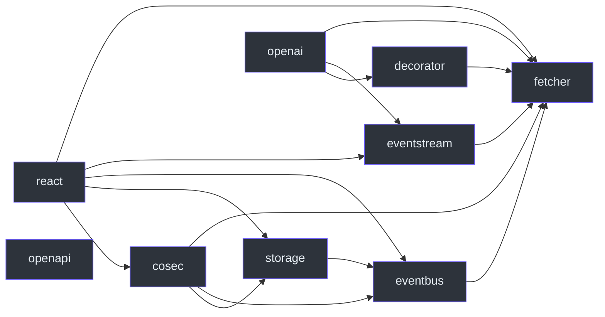

# Package boundaries

The core package has no internal runtime or peer dependencies. Select additional capabilities by their responsibility, then satisfy the selected packages' peer requirements. “Optional for your application” does not mean a declared peer can be ignored. See [packages/fetcher/package.json:31](https://github.com/Ahoo-Wang/fetcher/blob/main/packages/fetcher/package.json#L31).

## Declared internal peers

Every arrow below means **the source package declares the target as an internal peer dependency**. It is an installation graph, not a request call graph. Names abbreviate `@ahoo-wang/fetcher-*`; `fetcher` is `@ahoo-wang/fetcher`. OpenAPI supplies types only and has no internal peers.

| Layer                  | Responsibility and cost                                                                                                        | Manifest evidence                                                                                                                                                                                                                                    |
| ---------------------- | ------------------------------------------------------------------------------------------------------------------------------ | ---------------------------------------------------------------------------------------------------------------------------------------------------------------------------------------------------------------------------------------------------- |
| fetcher                | HTTP defaults, interception, extraction; no internal dependency                                                                | [packages/fetcher/package.json:31](https://github.com/Ahoo-Wang/fetcher/blob/main/packages/fetcher/package.json#L31)                                                                                                                                 |
| decorator              | Declarative services; metadata setup and runtime `reflect-metadata` dependency                                                 | [packages/decorator/package.json:54](https://github.com/Ahoo-Wang/fetcher/blob/main/packages/decorator/package.json#L54)                                                                                                                             |
| eventbus / eventstream | Event delivery / SSE processing; each peers with core                                                                          | [packages/eventbus/package.json:52](https://github.com/Ahoo-Wang/fetcher/blob/main/packages/eventbus/package.json#L52), [packages/eventstream/package.json:53](https://github.com/Ahoo-Wang/fetcher/blob/main/packages/eventstream/package.json#L53) |
| storage / cosec        | Storage events / authentication protocol; additional state lifetime to own                                                     | [packages/storage/package.json:56](https://github.com/Ahoo-Wang/fetcher/blob/main/packages/storage/package.json#L56), [packages/cosec/package.json:54](https://github.com/Ahoo-Wang/fetcher/blob/main/packages/cosec/package.json#L54)               |
| openai                 | Service-specific runtime client using core, decorators, and streams                                                            | [packages/openai/package.json:59](https://github.com/Ahoo-Wang/fetcher/blob/main/packages/openai/package.json#L59)                                                                                                                                   |
| react                  | Request and integration Hooks; React/ReactDOM peers, direct `dequal` and `immer` dependencies; `/core` and `/fetcher` subpaths | [packages/react/package.json:64](https://github.com/Ahoo-Wang/fetcher/blob/main/packages/react/package.json#L64)                                                                                                                                     |
| openapi                | OpenAPI 3 type vocabulary; neither sends requests nor validates input                                                          | [packages/openapi/src/index.ts:19](https://github.com/Ahoo-Wang/fetcher/blob/main/packages/openapi/src/index.ts#L19)                                                                                                                                 |

## Installation is not execution

A React peer edge to CoSec does not mean every Hook authenticates through CoSec. Importing `@ahoo-wang/fetcher-react/core` loads only React, and `@ahoo-wang/fetcher-react/fetcher` loads only `@ahoo-wang/fetcher`, but the declared peers remain installation requirements; see [React subpath entries](../reference/react/index.md#subpath-entries). The [request lifecycle](./request-lifecycle.md) shows execution instead.

OpenAPI types themselves neither send requests nor validate input. React Compiler tooling listed as development dependencies does not by itself impose the repository's compiler pipeline on every consumer. Follow [declarative services](../guides/services/declarative-client.md) for service declarations, and see [runtime support](./runtime-support.md) before choosing consumer versions.

## Packages that moved to the Wow repository {#packages-that-moved-to-the-wow-repository}

The Wow-coupled packages left this repository before 6.0. Their last releases from here are the 5.x line (npm 5.1.x, branch [`5.x`](https://github.com/Ahoo-Wang/fetcher/tree/5.x)); the pages that document them apply to 5.x only.

| 5.x package                                     | From 6.0                                                                                            | Where to read                                                                                                                                                         |
| ----------------------------------------------- | --------------------------------------------------------------------------------------------------- | --------------------------------------------------------------------------------------------------------------------------------------------------------------------- |
| `@ahoo-wang/fetcher-wow`                        | Wow repository, [`typescript/`](https://github.com/Ahoo-Wang/Wow/tree/main/typescript)              | 5.x: [Wow guide](../guides/integrations/wow.md), [Wow reference](../reference/wow/index.md); from 6.0: [wow.ahoo.me](https://wow.ahoo.me)                             |
| Wow query hooks in `@ahoo-wang/fetcher-react`   | Wow repository, built on `@ahoo-wang/fetcher-react/fetcher`                                         | [wow.ahoo.me](https://wow.ahoo.me)                                                                                                                                    |
| `@ahoo-wang/fetcher-generator`                  | Wow repository                                                                                      | 5.x: [generated client](../guides/services/generated-client.md), [generator reference](../reference/generator/index.md); from 6.0: [wow.ahoo.me](https://wow.ahoo.me) |
| `@ahoo-wang/fetcher-viewer`, data-monitor hooks | Frozen in 5.x; superseded by `@ahoo-wang/wow-view-engine` in the Wow repository (not yet published) | 5.x: [Viewer guides](../guides/viewer/index.md), [Viewer reference](../reference/viewer/index.md)                                                                     |

The Wow repository publishes its TypeScript packages with Wow's first stable release; the view engine publishes only once it is declared stable. Until then, keep 5.x consumers on the 5.1.x releases above.
