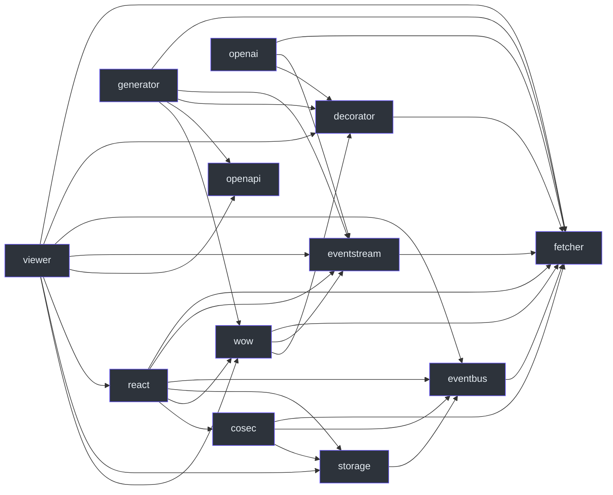

# Package boundaries

The core package has no internal runtime or peer dependencies. Select additional capabilities by their responsibility, then satisfy the selected packages' peer requirements. “Optional for your application” does not mean a declared peer can be ignored. See [packages/fetcher/package.json:31](https://github.com/Ahoo-Wang/fetcher/blob/main/packages/fetcher/package.json#L31).

## Declared internal peers

Every arrow below means **the source package declares the target as an internal peer dependency**. It is an installation graph, not a request call graph. Names abbreviate `@ahoo-wang/fetcher-*`; `fetcher` is `@ahoo-wang/fetcher`. Generator is shown for installation completeness, although it runs during development. OpenAPI supplies types.

| Layer                  | Responsibility and cost                                                                                   | Manifest evidence                                                                                                                                                                                                                                    |
| ---------------------- | --------------------------------------------------------------------------------------------------------- | ---------------------------------------------------------------------------------------------------------------------------------------------------------------------------------------------------------------------------------------------------- |
| fetcher                | HTTP defaults, interception, extraction; no internal dependency                                           | [packages/fetcher/package.json:31](https://github.com/Ahoo-Wang/fetcher/blob/main/packages/fetcher/package.json#L31)                                                                                                                                 |
| decorator              | Declarative services; metadata setup and runtime `reflect-metadata` dependency                            | [packages/decorator/package.json:53](https://github.com/Ahoo-Wang/fetcher/blob/main/packages/decorator/package.json#L53)                                                                                                                             |
| eventbus / eventstream | Event delivery / SSE processing; each peers with core                                                     | [packages/eventbus/package.json:51](https://github.com/Ahoo-Wang/fetcher/blob/main/packages/eventbus/package.json#L51), [packages/eventstream/package.json:52](https://github.com/Ahoo-Wang/fetcher/blob/main/packages/eventstream/package.json#L52) |
| storage / cosec        | Storage events / authentication protocol; additional state lifetime to own                                | [packages/storage/package.json:55](https://github.com/Ahoo-Wang/fetcher/blob/main/packages/storage/package.json#L55), [packages/cosec/package.json:53](https://github.com/Ahoo-Wang/fetcher/blob/main/packages/cosec/package.json#L53)               |
| wow / openai           | Service-specific runtime clients using core, decorators, and streams                                      | [packages/wow/package.json:63](https://github.com/Ahoo-Wang/fetcher/blob/main/packages/wow/package.json#L63), [packages/openai/package.json:58](https://github.com/Ahoo-Wang/fetcher/blob/main/packages/openai/package.json#L58)                     |
| react                  | Request and integration Hooks; React/ReactDOM peers, direct `dequal` and `immer` dependencies             | [packages/react/package.json:54](https://github.com/Ahoo-Wang/fetcher/blob/main/packages/react/package.json#L54)                                                                                                                                     |
| viewer (maintenance mode, deprecated) | Table and saved-view UI; React, Ant Design, icons, and dayjs peers alongside internal peers               | [packages/viewer/package.json:54](https://github.com/Ahoo-Wang/fetcher/blob/main/packages/viewer/package.json#L54)                                                                                                                                   |
| openapi / generator    | OpenAPI type vocabulary / development CLI generating source; generator uses ts-morph, commander, and yaml | [packages/openapi/src/index.ts:21](https://github.com/Ahoo-Wang/fetcher/blob/main/packages/openapi/src/index.ts#L21), [packages/generator/package.json:61](https://github.com/Ahoo-Wang/fetcher/blob/main/packages/generator/package.json#L61)       |

## Installation is not execution

A React peer edge to CoSec does not mean every Hook authenticates through CoSec. A Viewer peer edge to OpenAPI does not mean a table validates a specification before loading data. The [request lifecycle](./request-lifecycle.md) shows execution instead.

Keep the generator in the code-generation workflow: run it against the service specification and compile/review its output. OpenAPI types themselves neither send requests nor validate input. Generated code still needs the runtime packages it imports. React Compiler tooling listed as development dependencies does not by itself impose the repository's compiler pipeline on every consumer.

Follow [declarative services](../guides/services/declarative-client.md), [generated services](../guides/services/generated-client.md), and the [generator output reference](../reference/generator/generated-output.md) for implementation. See [runtime support](./runtime-support.md) before choosing consumer versions.

## View Engine entries

`@ahoo-wang/fetcher-view-engine` declares direct dependencies on Wow/React and its UI implementation packages; these are separate from the peer-only arrows above. Its public core entry imports no React/DOM/CSS. The `/react` entry provides shadcn/Base UI components and owns browser UI integration. `ViewHost` composes definition, instance, preference and permission services; the record query source and option sources remain application runtime adapters. See [View Engine contracts](../reference/view-engine/index.md) and its [package manifest](https://github.com/Ahoo-Wang/fetcher/blob/main/packages/view-engine/package.json).
