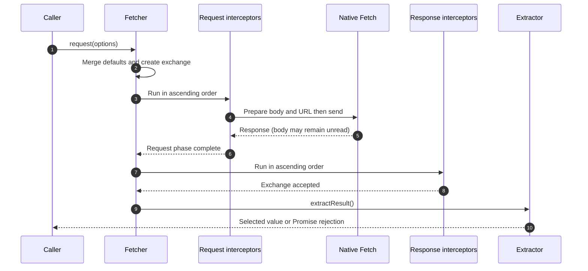

# Request lifecycle

A request has two distinct completion boundaries: the exchange pipeline can accept a response before the caller finishes reading its body. Put transport policy in interceptors and handle result decoding at the caller's await boundary.

## The successful path

The diagram shows the successful path of `request()`. The default request registry contains body preparation, URL resolution, and Fetch itself; native transport is inside the request phase. Each registry executes sequentially in ascending `order`. `exchange()` runs request then response registries and returns the exchange; `request()` then calls `extractResult()`. See [packages/fetcher/src/interceptorManager.ts:63](https://github.com/Ahoo-Wang/fetcher/blob/main/packages/fetcher/src/interceptorManager.ts#L63), [packages/fetcher/src/interceptor.ts:294](https://github.com/Ahoo-Wang/fetcher/blob/main/packages/fetcher/src/interceptor.ts#L294), and [packages/fetcher/src/fetcher.ts:173](https://github.com/Ahoo-Wang/fetcher/blob/main/packages/fetcher/src/fetcher.ts#L173).

| Entry point                                      | Default returned value      | Choose it for                                                 |
| ------------------------------------------------ | --------------------------- | ------------------------------------------------------------- |
| `exchange()`                                     | Exchange after interception | Working directly with pipeline context                        |
| `request()`                                      | `FetchExchange`             | Request/response/error context                                |
| `fetch()`, `get()`, `post()`, other HTTP helpers | `Response`                  | Status, headers, or native body readers                       |
| Request with explicit JSON extractor             | Parsed value                | Data-returning service functions, with application validation |

Defaults follow [packages/fetcher/src/fetcher.ts:98](https://github.com/Ahoo-Wang/fetcher/blob/main/packages/fetcher/src/fetcher.ts#L98), [packages/fetcher/src/fetcher.ts:230](https://github.com/Ahoo-Wang/fetcher/blob/main/packages/fetcher/src/fetcher.ts#L230), and [packages/fetcher/src/fetcher.ts:256](https://github.com/Ahoo-Wang/fetcher/blob/main/packages/fetcher/src/fetcher.ts#L256). JSON extraction calls `response.json()`; a generic type argument adds no runtime validation. See [packages/fetcher/src/resultExtractor.ts:69](https://github.com/Ahoo-Wang/fetcher/blob/main/packages/fetcher/src/resultExtractor.ts#L69) and [choosing results](../guides/http/results.md).

## Recovery does not replay validation

If a request or response interceptor throws, the manager stores the error on the exchange and runs error interceptors. If they clear it, the exchange returns immediately; response interceptors do not run again. A recovery interceptor therefore owns the validity of any replacement response. A remaining error becomes `ExchangeError`; an error thrown by an error interceptor itself escapes directly. See [packages/fetcher/src/interceptorManager.ts:191](https://github.com/Ahoo-Wang/fetcher/blob/main/packages/fetcher/src/interceptorManager.ts#L191).

Extraction happens afterward. JSON decoding or a custom extractor can fail without returning to that error registry. Keep decoding handling next to the code consuming the result, as described in the [failure model](./failure-model.md).

## Extraction caching belongs to one exchange

An exchange caches its extracted value or Promise, and replacing its response clears that cache. A rejected extraction Promise stays cached; a synchronous throw does not populate the cache. This avoids repeated extraction on that exchange, but does not cache HTTP responses across requests or deduplicate queries. Data freshness remains an application decision. See [packages/fetcher/src/fetchExchange.ts:224](https://github.com/Ahoo-Wang/fetcher/blob/main/packages/fetcher/src/fetchExchange.ts#L224) and [packages/fetcher/src/fetchExchange.ts:278](https://github.com/Ahoo-Wang/fetcher/blob/main/packages/fetcher/src/fetchExchange.ts#L278).

For implementation, use [interceptor guidance](../guides/http/interceptors.md), [interceptor reference](../reference/fetcher/interceptors.md), and [result reference](../reference/fetcher/results.md). The [failure model](./failure-model.md) explains why a transport timeout is not a deadline for the full body or stream.
