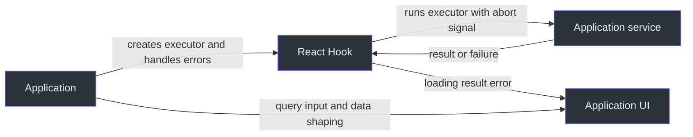

# State and resource ownership

Decide who owns each value before connecting a component to a request Hook. A Hook can protect its own state from stale results without owning your data source or undoing server work.

## Application, Hook, and service

Arrows below name data passed or actions requested. They are ownership interactions, not package dependencies.

| State or resource                  | Owner and update path                                                                                  | Cleanup or limit                                                                                                 |
| ---------------------------------- | ------------------------------------------------------------------------------------------------------ | ---------------------------------------------------------------------------------------------------------------- |
| Hook `loading/result/error/status` | `useExecutePromise` commits only the latest request while mounted                                      | New execution aborts the previous controller; unmount aborts; executor must use the controller to stop real work |
| Hook exchange                      | `useFetcher` retains exchange (cleared when a request fails) and selects explicit or registered client | Shared client state has its own lifetime                                                                         |
| Query input                        | `useQuery` / `useFetcherQuery` hold the query and re-execute on change                                 | The Hook does not cache responses across components; share data through your own state or service                |
| Debounce timer                     | Debounced Hooks own their timer                                                                        | Timer `cancel()` and active request `abort()` are separate                                                       |
| Rows, totals and view preferences  | The application and its service                                                                        | Filtering, sorting, pagination and persistence are application decisions                                         |

Hook behavior: [packages/react/src/core/useExecutePromise.ts:210](https://github.com/Ahoo-Wang/fetcher/blob/main/packages/react/src/core/useExecutePromise.ts#L210), [packages/react/src/core/useExecutePromise.ts:320](https://github.com/Ahoo-Wang/fetcher/blob/main/packages/react/src/core/useExecutePromise.ts#L320), and [packages/react/src/fetcher/useFetcher.ts:162](https://github.com/Ahoo-Wang/fetcher/blob/main/packages/react/src/fetcher/useFetcher.ts#L162). `reset()` only sets idle state; it does not abort or invalidate an active execution ([packages/react/src/core/useExecutePromise.ts:309](https://github.com/Ahoo-Wang/fetcher/blob/main/packages/react/src/core/useExecutePromise.ts#L309)).

Stale-result protection keeps an old response from overwriting newer UI state. It does not authorize access, revoke a command already sent, or promise that a later read reflects an earlier write; decide those with the service.

## Identity changes and disposal

Remount the subtree that owns request state when the tenant or user changes, so no Hook result crosses identities. Scope storage keys and event buses to the same identity.

| Resource                 | What disposal does                                                                                   | What its creator still owns                                                                                        |
| ------------------------ | ---------------------------------------------------------------------------------------------------- | ------------------------------------------------------------------------------------------------------------------ |
| React event subscription | Effect cleanup removes the subscription it made, never another subscriber's handler of the same name | Shared bus lifetime                                                                                                |
| KeyStorage               | `destroy()` removes its own event handler and closes the bus it created                              | Persistent data and any event bus passed in `eventBus`; default serial bus is local, not cross-tab synchronization |
| BroadcastTypedEventBus   | `destroy()` closes its messenger                                                                     | Appropriate lifetime of shared users before closing it                                                             |

See [packages/react/src/eventbus/useEventSubscription.ts:95](https://github.com/Ahoo-Wang/fetcher/blob/main/packages/react/src/eventbus/useEventSubscription.ts#L95), [packages/storage/src/keyStorage.ts:242](https://github.com/Ahoo-Wang/fetcher/blob/main/packages/storage/src/keyStorage.ts#L242), [packages/storage/src/keyStorage.ts:527](https://github.com/Ahoo-Wang/fetcher/blob/main/packages/storage/src/keyStorage.ts#L527), and [packages/eventbus/src/broadcastTypedEventBus.ts:236](https://github.com/Ahoo-Wang/fetcher/blob/main/packages/eventbus/src/broadcastTypedEventBus.ts#L236). Follow [React cleanup](../guides/react/cleanup.md), [storage and events](../guides/integrations/storage-and-events.md), and [SSR scope](./runtime-support.md).

The saved-view confirmation rules of the 5.x Viewer and FetcherViewer are documented with that line in the [saved-view guide](../guides/viewer/saved-views.md) and the [FetcherViewer reference](../reference/viewer/fetcher-viewer.md).
