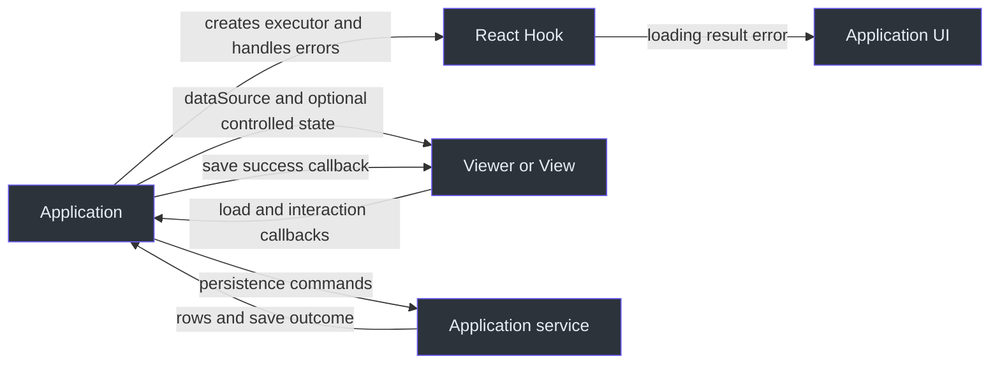

# State and resource ownership

Decide who owns each value before connecting a table to a request Hook. A component can protect its own state from stale results without owning your data source or undoing server work.

## Application, Hook, and table

Arrows below name data passed or actions requested. They are ownership interactions, not package dependencies. The application may compose Hooks with View/Viewer; the diagram does not imply that every table creates a Hook.

| State or resource                  | Owner and update path                                                        | Cleanup or limit                                                                                                 |
| ---------------------------------- | ---------------------------------------------------------------------------- | ---------------------------------------------------------------------------------------------------------------- |
| Hook `loading/result/error/status` | `useExecutePromise` commits only the latest request while mounted            | New execution aborts the previous controller; unmount aborts; executor must use the controller to stop real work |
| Hook exchange                      | `useFetcher` retains exchange and selects explicit or registered client      | Shared client state has its own lifetime                                                                         |
| Rows and total                     | Application passes `PagedList` through `dataSource`                          | View does not filter, sort, or page the supplied rows automatically                                              |
| Single-view interaction state      | View manages it internally unless external value/update callbacks control it | Application handles resulting queries and supplies the next data                                                 |
| View collection and active view    | Viewer manages collection/selection and requests data through `onLoadData`   | Persistence remains in application callbacks                                                                     |

Hook behavior: [packages/react/src/core/useExecutePromise.ts:210](https://github.com/Ahoo-Wang/fetcher/blob/main/packages/react/src/core/useExecutePromise.ts#L210), [packages/react/src/core/useExecutePromise.ts:320](https://github.com/Ahoo-Wang/fetcher/blob/main/packages/react/src/core/useExecutePromise.ts#L320), and [packages/react/src/fetcher/useFetcher.ts:162](https://github.com/Ahoo-Wang/fetcher/blob/main/packages/react/src/fetcher/useFetcher.ts#L162). `reset()` only sets idle state; it does not abort or invalidate an active execution ([packages/react/src/core/useExecutePromise.ts:309](https://github.com/Ahoo-Wang/fetcher/blob/main/packages/react/src/core/useExecutePromise.ts#L309)). Table ownership: [packages/viewer/src/view/View.tsx:106](https://github.com/Ahoo-Wang/fetcher/blob/main/packages/viewer/src/view/View.tsx#L106), [packages/viewer/src/view/hooks/useViewState.ts:285](https://github.com/Ahoo-Wang/fetcher/blob/main/packages/viewer/src/view/hooks/useViewState.ts#L285), and [packages/viewer/src/viewer/Viewer.tsx:199](https://github.com/Ahoo-Wang/fetcher/blob/main/packages/viewer/src/viewer/Viewer.tsx#L199).

## Saving a view has an explicit confirmation boundary

With **Viewer**, the application implements `onCreateView`, `onUpdateView`, and `onDeleteView`. Viewer changes its local collection/selection only when the application invokes the supplied success callback. Call it after the persistence outcome your application requires, and display failures yourself. Clicking Save is not default persistence. See [packages/viewer/src/viewer/Viewer.tsx:140](https://github.com/Ahoo-Wang/fetcher/blob/main/packages/viewer/src/viewer/Viewer.tsx#L140) and [saved-view guide](../guides/viewer/saved-views.md).

**FetcherViewer** connects a specific backend protocol. For creation and update it waits for the Wow command to reach `PROCESSED`, rereads the view snapshot, and confirms matching aggregate/tenant/owner identity, `definitionId`, and a finite `snapshot.version >= aggregateVersion` before invoking success. Missing or lagging versions produce an unconfirmed/retry state. Deletion rereads and invokes its callback without the same version confirmation. See [packages/viewer/src/fetcherviewer/FetcherViewer.tsx:202](https://github.com/Ahoo-Wang/fetcher/blob/main/packages/viewer/src/fetcherviewer/FetcherViewer.tsx#L202), [packages/viewer/src/fetcherviewer/FetcherViewer.tsx:382](https://github.com/Ahoo-Wang/fetcher/blob/main/packages/viewer/src/fetcherviewer/FetcherViewer.tsx#L382), [packages/viewer/src/fetcherviewer/FetcherViewer.tsx:461](https://github.com/Ahoo-Wang/fetcher/blob/main/packages/viewer/src/fetcherviewer/FetcherViewer.tsx#L461), and [packages/viewer/src/fetcherviewer/FetcherViewer.tsx:514](https://github.com/Ahoo-Wang/fetcher/blob/main/packages/viewer/src/fetcherviewer/FetcherViewer.tsx#L514).

That confirmation applies to these view mutations, not arbitrary row queries or a general read-your-writes guarantee. It places no upper bound on projection delay.

## Identity changes and disposal

FetcherViewer remounts its inner state for `definitionId/tenantId/ownerId` changes. Its mutation marker ignores old create/update command completions after unmount; deletion does not check the same marker. Remote row loading POSTs a `PagedQuery`, combines `internalCondition` with interaction conditions, and exposes data only for the current request object. These protect UI state; they do not authorize access or revoke server commands. See [packages/viewer/src/fetcherviewer/FetcherViewer.tsx:103](https://github.com/Ahoo-Wang/fetcher/blob/main/packages/viewer/src/fetcherviewer/FetcherViewer.tsx#L103), [packages/viewer/src/fetcherviewer/FetcherViewer.tsx:188](https://github.com/Ahoo-Wang/fetcher/blob/main/packages/viewer/src/fetcherviewer/FetcherViewer.tsx#L188), and [packages/viewer/src/fetcherviewer/hooks/useFetchData.ts:53](https://github.com/Ahoo-Wang/fetcher/blob/main/packages/viewer/src/fetcherviewer/hooks/useFetchData.ts#L53).

| Resource                 | What disposal does                        | What its creator still owns                                                                          |
| ------------------------ | ----------------------------------------- | ---------------------------------------------------------------------------------------------------- |
| React event subscription | Effect cleanup removes that subscription  | Shared bus lifetime                                                                                  |
| KeyStorage               | `destroy()` removes its own event handler | Persistent data and any shared event bus; default serial bus is local, not cross-tab synchronization |
| BroadcastTypedEventBus   | `destroy()` closes its messenger          | Appropriate lifetime of shared users before closing it                                               |

See [packages/react/src/eventbus/useEventSubscription.ts:94](https://github.com/Ahoo-Wang/fetcher/blob/main/packages/react/src/eventbus/useEventSubscription.ts#L94), [packages/storage/src/keyStorage.ts:237](https://github.com/Ahoo-Wang/fetcher/blob/main/packages/storage/src/keyStorage.ts#L237), [packages/storage/src/keyStorage.ts:466](https://github.com/Ahoo-Wang/fetcher/blob/main/packages/storage/src/keyStorage.ts#L466), and [packages/eventbus/src/broadcastTypedEventBus.ts:236](https://github.com/Ahoo-Wang/fetcher/blob/main/packages/eventbus/src/broadcastTypedEventBus.ts#L236). Follow [React cleanup](../guides/react/cleanup.md), [remote data](../guides/viewer/remote-data.md), [FetcherViewer reference](../reference/viewer/fetcher-viewer.md), and [SSR scope](./runtime-support.md).
