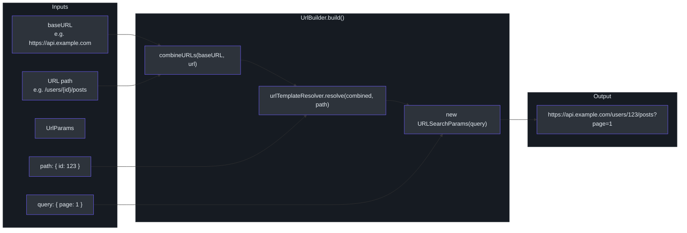
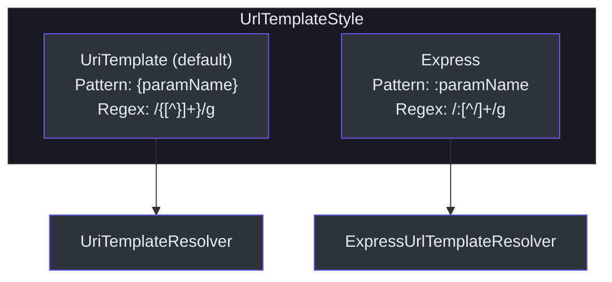
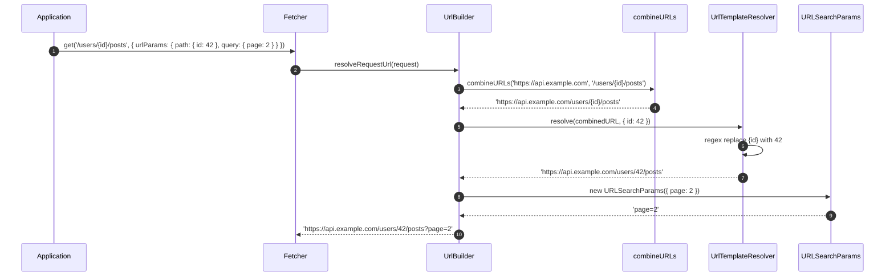
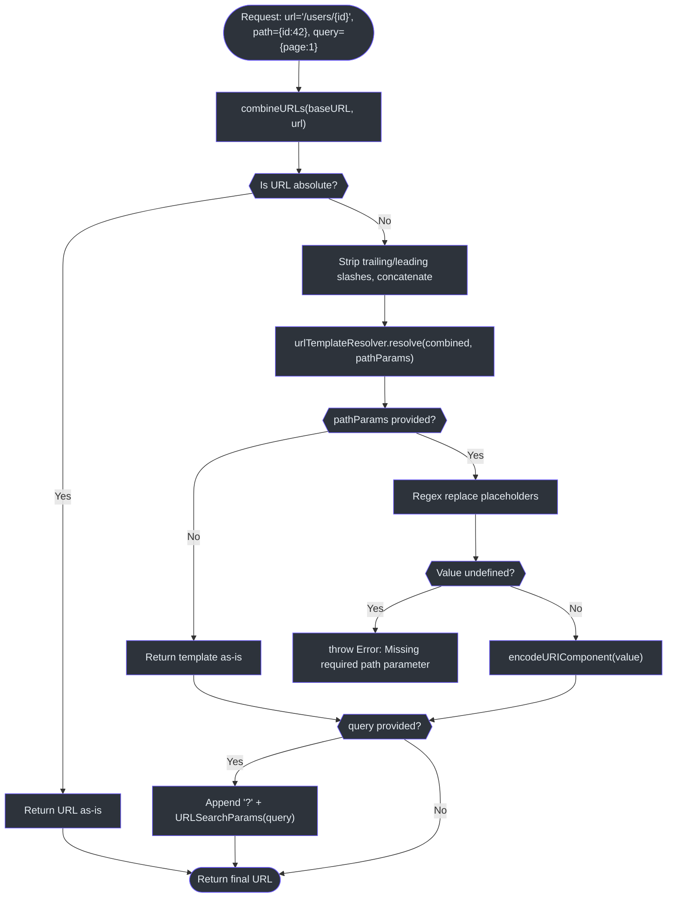

# URL Builder

The `UrlBuilder` class is responsible for constructing complete request URLs from a base URL, path parameter templates, and query parameters. It is owned by each `Fetcher` instance and is invoked by the `UrlResolveInterceptor` during the request interceptor phase.

Source: [packages/fetcher/src/urlBuilder.ts](https://github.com/Ahoo-Wang/fetcher/blob/main/packages/fetcher/src/urlBuilder.ts)

## URL Construction Pipeline



## UrlBuilder Class

The `UrlBuilder` class encapsulates base URL, template resolver, and the build logic.

```typescript
// [packages/fetcher/src/urlBuilder.ts:72-147]
export class UrlBuilder implements BaseURLCapable {
  baseURL: string;
  urlTemplateResolver: UrlTemplateResolver;

  constructor(baseURL: string, urlTemplateStyle?: UrlTemplateStyle) {
    this.baseURL = baseURL;
    this.urlTemplateResolver = getUrlTemplateResolver(urlTemplateStyle);
  }

  build(url: string, params?: UrlParams): string {
    const path = params?.path;
    const query = params?.query;
    const combinedURL = combineURLs(this.baseURL, url);
    let finalUrl = this.urlTemplateResolver.resolve(combinedURL, path);
    if (query) {
      const queryString = new URLSearchParams(query).toString();
      if (queryString) {
        finalUrl += '?' + queryString;
      }
    }
    return finalUrl;
  }

  resolveRequestUrl(request: FetchRequest): string {
    return this.build(request.url, request.urlParams);
  }
}
```

Source: [packages/fetcher/src/urlBuilder.ts:72-147](https://github.com/Ahoo-Wang/fetcher/blob/main/packages/fetcher/src/urlBuilder.ts#L72-L147)

### Build Steps

The `build()` method performs three steps in order:

| Step | Function | Input | Output |
|---|---|---|---|
| 1. Combine | `combineURLs(baseURL, url)` | base + relative URL | Combined URL string |
| 2. Template | `urlTemplateResolver.resolve(combined, path)` | URL with `{id}` or `:id` | URL with parameters replaced |
| 3. Query | `new URLSearchParams(query).toString()` | query object | Query string appended with `?` |

### The resolveRequestUrl Bridge

`UrlResolveInterceptor` calls `resolveRequestUrl()` to populate `request.url` before the actual fetch:

```typescript
// [packages/fetcher/src/urlResolveInterceptor.ts:74-78]
intercept(exchange: FetchExchange) {
  const request = exchange.request;
  request.url = exchange.fetcher.urlBuilder.resolveRequestUrl(request);
}
```

Source: [packages/fetcher/src/urlResolveInterceptor.ts:74-78](https://github.com/Ahoo-Wang/fetcher/blob/main/packages/fetcher/src/urlResolveInterceptor.ts#L74-L78)

## URL Combination

The `combineURLs` function merges a base URL with a relative URL, handling edge cases for absolute URLs, trailing slashes, and leading slashes.

```typescript
// [packages/fetcher/src/urls.ts:27-57]
export function isAbsoluteURL(url: string) {
  return /^([a-z][a-z\d+\-.]*:)?\/\//i.test(url);
}

export function combineURLs(baseURL: string, relativeURL: string) {
  if (isAbsoluteURL(relativeURL)) {
    return relativeURL;
  }
  return relativeURL
    ? baseURL.replace(/\/+$/, '') + '/' + relativeURL.replace(/^\/+/, '')
    : baseURL;
}
```

Source: [packages/fetcher/src/urls.ts:27-57](https://github.com/Ahoo-Wang/fetcher/blob/main/packages/fetcher/src/urls.ts#L27-L57)

### Combination Examples

| Base URL | Relative URL | Result |
|---|---|---|
| `https://api.example.com` | `/users` | `https://api.example.com/users` |
| `https://api.example.com/` | `users` | `https://api.example.com/users` |
| `https://api.example.com` | `https://other.com/users` | `https://other.com/users` |
| `https://api.example.com/v1/` | `/users` | `https://api.example.com/v1/users` |
| `https://api.example.com` | *(empty)* | `https://api.example.com` |

## Path Parameter Templates

Fetcher supports two URL template styles for path parameter interpolation, controlled by the `UrlTemplateStyle` enum.



### UrlTemplateStyle Enum

```typescript
// [packages/fetcher/src/urlTemplateResolver.ts:20-38]
export enum UrlTemplateStyle {
  UriTemplate, // {paramName} -- RFC 6570
  Express,     // :paramName -- Express.js style
}
```

Source: [packages/fetcher/src/urlTemplateResolver.ts:20-38](https://github.com/Ahoo-Wang/fetcher/blob/main/packages/fetcher/src/urlTemplateResolver.ts#L20-L38)

### UriTemplateResolver (default)

Follows the [RFC 6570](https://www.rfc-editor.org/rfc/rfc6570.html) URI Template syntax using curly braces.

| Template | Parameters | Resolved URL |
|---|---|---|
| `/users/{id}` | `{ id: 123 }` | `/users/123` |
| `/users/{id}/posts/{postId}` | `{ id: 1, postId: 42 }` | `/users/1/posts/42` |
| `/search/{query}` | `{ query: 'hello world' }` | `/search/hello%20world` |
| `/files/{name}` | `{ name: 'a/b' }` | `/files/a%2Fb` |

The regex pattern `/ \{ ([^}]+) \} /g` matches everything inside curly braces:

```typescript
// [packages/fetcher/src/urlTemplateResolver.ts:217]
private static PATH_PARAM_REGEX = /{([^}]+)}/g;
```

Source: [packages/fetcher/src/urlTemplateResolver.ts:217](https://github.com/Ahoo-Wang/fetcher/blob/main/packages/fetcher/src/urlTemplateResolver.ts#L217)

### ExpressUrlTemplateResolver

Mimics Express.js route parameters using a colon prefix.

| Template | Parameters | Resolved URL |
|---|---|---|
| `/users/:id` | `{ id: 123 }` | `/users/123` |
| `/users/:id/posts/:postId` | `{ id: 1, postId: 42 }` | `/users/1/posts/42` |

The regex pattern `/: ([^/]+)/g` matches colon-prefixed segments:

```typescript
// [packages/fetcher/src/urlTemplateResolver.ts:320]
private static PATH_PARAM_REGEX = /:([^/]+)/g;
```

Source: [packages/fetcher/src/urlTemplateResolver.ts:320](https://github.com/Ahoo-Wang/fetcher/blob/main/packages/fetcher/src/urlTemplateResolver.ts#L320)

### Template Resolution Algorithm

Both resolvers share the same resolution function:

```typescript
// [packages/fetcher/src/urlTemplateResolver.ts:151-165]
export function urlTemplateRegexResolve(
  urlTemplate: string,
  pathParamRegex: RegExp,
  pathParams?: Record<string, any> | null,
) {
  if (!pathParams) return urlTemplate;
  return urlTemplate.replace(pathParamRegex, (_, key) => {
    const value = pathParams[key];
    if (value === undefined) {
      throw new Error(`Missing required path parameter: ${key}`);
    }
    return encodeURIComponent(value);
  });
}
```

Source: [packages/fetcher/src/urlTemplateResolver.ts:151-165](https://github.com/Ahoo-Wang/fetcher/blob/main/packages/fetcher/src/urlTemplateResolver.ts#L151-L165)

Key behaviors:
- **Missing parameters throw**: If a template placeholder has no corresponding value in `pathParams`, an `Error` is thrown with the message `Missing required path parameter: <name>`.
- **URL encoding**: Parameter values are encoded via `encodeURIComponent` to ensure safe URL characters.
- **No parameters**: If `pathParams` is null/undefined, the template is returned as-is.

### Template Resolution Sequence



## Query Parameters

Query parameters are handled natively by `URLSearchParams`. The `UrlParams.query` object is passed directly to the constructor.

```typescript
// [packages/fetcher/src/urlBuilder.ts:121-133]
build(url: string, params?: UrlParams): string {
  const path = params?.path;
  const query = params?.query;
  const combinedURL = combineURLs(this.baseURL, url);
  let finalUrl = this.urlTemplateResolver.resolve(combinedURL, path);
  if (query) {
    const queryString = new URLSearchParams(query).toString();
    if (queryString) {
      finalUrl += '?' + queryString;
    }
  }
  return finalUrl;
}
```

Source: [packages/fetcher/src/urlBuilder.ts:121-133](https://github.com/Ahoo-Wang/fetcher/blob/main/packages/fetcher/src/urlBuilder.ts#L121-L133)

### Query Parameter Examples

| Query Object | Resulting Query String |
|---|---|
| `{ page: 1, limit: 10 }` | `?page=1&limit=10` |
| `{ filter: 'active', tags: ['a', 'b'] }` | `?filter=active&tags=a&tags=b` |
| `{ search: 'hello world' }` | `?search=hello+world` |
| `{}` or `undefined` | *(no query string)* |

## UrlParams Interface

The `UrlParams` interface groups path and query parameters into a single object, passed through `FetchRequest.urlParams`.

```typescript
// [packages/fetcher/src/urlBuilder.ts:27-53]
export interface UrlParams {
  path?: Record<string, any>;
  query?: Record<string, any>;
}
```

Source: [packages/fetcher/src/urlBuilder.ts:27-53](https://github.com/Ahoo-Wang/fetcher/blob/main/packages/fetcher/src/urlBuilder.ts#L27-L53)

The `FetchExchange` provides a helper that ensures `urlParams` is initialized with empty `path` and `query` objects:

```typescript
// [packages/fetcher/src/fetchExchange.ts:192-206]
ensureRequestUrlParams(): Required<UrlParams> {
  if (!this.request.urlParams) {
    this.request.urlParams = { path: {}, query: {} };
  }
  if (!this.request.urlParams.path) {
    this.request.urlParams.path = {};
  }
  if (!this.request.urlParams.query) {
    this.request.urlParams.query = {};
  }
  return this.request.urlParams as Required<UrlParams>;
}
```

Source: [packages/fetcher/src/fetchExchange.ts:192-206](https://github.com/Ahoo-Wang/fetcher/blob/main/packages/fetcher/src/fetchExchange.ts#L192-L206)

## Factory Function

The `getUrlTemplateResolver` factory returns the appropriate resolver based on the `UrlTemplateStyle` enum:

```typescript
// [packages/fetcher/src/urlTemplateResolver.ts:63-70]
export function getUrlTemplateResolver(style?: UrlTemplateStyle): UrlTemplateResolver {
  if (style === UrlTemplateStyle.Express) {
    return expressUrlTemplateResolver;
  }
  return uriTemplateResolver;
}
```

Source: [packages/fetcher/src/urlTemplateResolver.ts:63-70](https://github.com/Ahoo-Wang/fetcher/blob/main/packages/fetcher/src/urlTemplateResolver.ts#L63-L70)

Singleton instances are exported for direct use:

```typescript
// [packages/fetcher/src/urlTemplateResolver.ts:297]
export const uriTemplateResolver = new UriTemplateResolver();

// [packages/fetcher/src/urlTemplateResolver.ts:392]
export const expressUrlTemplateResolver = new ExpressUrlTemplateResolver();
```

Source: [packages/fetcher/src/urlTemplateResolver.ts:297](https://github.com/Ahoo-Wang/fetcher/blob/main/packages/fetcher/src/urlTemplateResolver.ts#L297), [packages/fetcher/src/urlTemplateResolver.ts:392](https://github.com/Ahoo-Wang/fetcher/blob/main/packages/fetcher/src/urlTemplateResolver.ts#L392)

## Configuration in Fetcher

The `UrlTemplateStyle` is set at Fetcher construction time and cannot be changed afterward:

```typescript
// In Fetcher constructor
// [packages/fetcher/src/fetcher.ts:144-150]
constructor(options: FetcherOptions = DEFAULT_OPTIONS) {
  this.urlBuilder = new UrlBuilder(options.baseURL, options.urlTemplateStyle);
  // ...
}
```

Source: [packages/fetcher/src/fetcher.ts:144-150](https://github.com/Ahoo-Wang/fetcher/blob/main/packages/fetcher/src/fetcher.ts#L144-L150)

### Switching to Express Style

```typescript
import { Fetcher, UrlTemplateStyle } from '@ahoo-wang/fetcher';

const fetcher = new Fetcher({
  baseURL: 'https://api.example.com',
  urlTemplateStyle: UrlTemplateStyle.Express,
});

// Now uses :paramName syntax
const response = await fetcher.get('/users/:id/posts/:postId', {
  urlParams: {
    path: { id: 123, postId: 456 },
    query: { sort: 'newest' },
  },
});
// Final URL: https://api.example.com/users/123/posts/456?sort=newest
```

## Complete URL Resolution Flowchart



## Extracting Path Parameter Names

Both resolvers provide an `extractPathParams()` method that returns the list of parameter names found in a template. This is used by the code generator to build typed parameter interfaces.

```typescript
// [packages/fetcher/src/urlTemplateResolver.ts:174-184]
export function urlTemplateRegexExtract(
  urlTemplate: string,
  pathParamRegex: RegExp,
): string[] {
  const matches: string[] = [];
  let match;
  while ((match = pathParamRegex.exec(urlTemplate)) !== null) {
    matches.push(match[1]);
  }
  return matches;
}
```

Source: [packages/fetcher/src/urlTemplateResolver.ts:174-184](https://github.com/Ahoo-Wang/fetcher/blob/main/packages/fetcher/src/urlTemplateResolver.ts#L174-L184)

| Template | Style | Extracted Params |
|---|---|---|
| `/users/{id}/posts/{postId}` | UriTemplate | `['id', 'postId']` |
| `/users/:id/posts/:postId` | Express | `['id', 'postId']` |
| `/users/profile` | *any* | `[]` |

## Cross-References

- [Fetcher Core](/architecture/fetcher-core) -- how `Fetcher` owns the `UrlBuilder` and passes it through options
- [Interceptor System](/architecture/interceptors) -- `UrlResolveInterceptor` invokes `resolveRequestUrl()` during the request phase
- [Architecture Overview](/architecture/) -- package dependency graph and design principles
