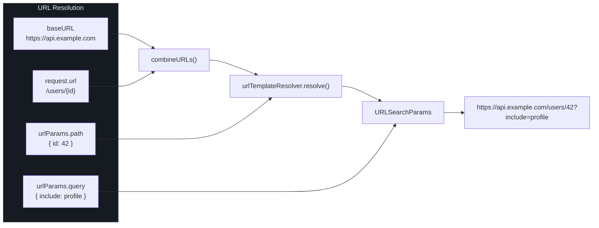
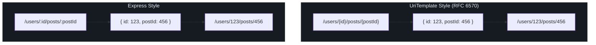
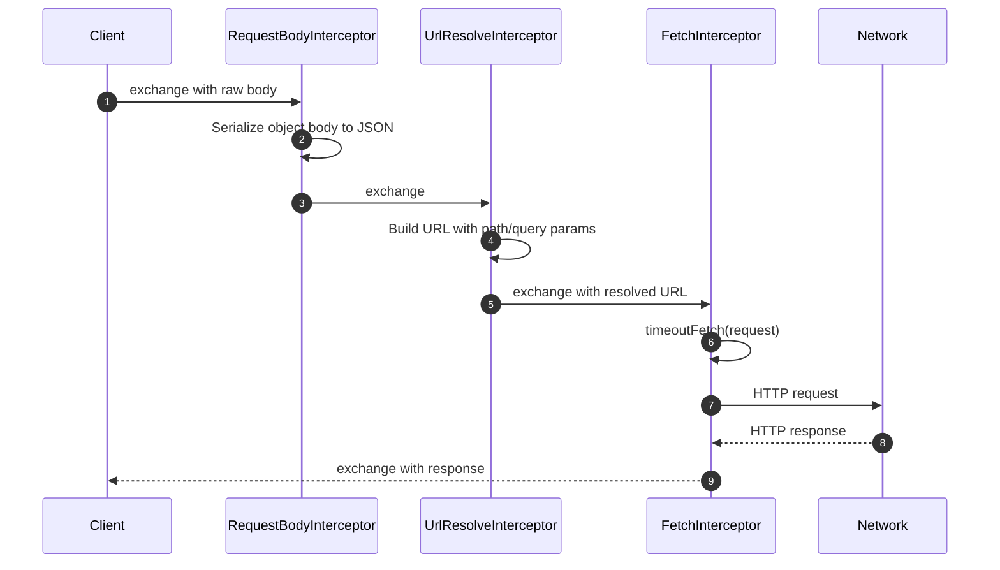
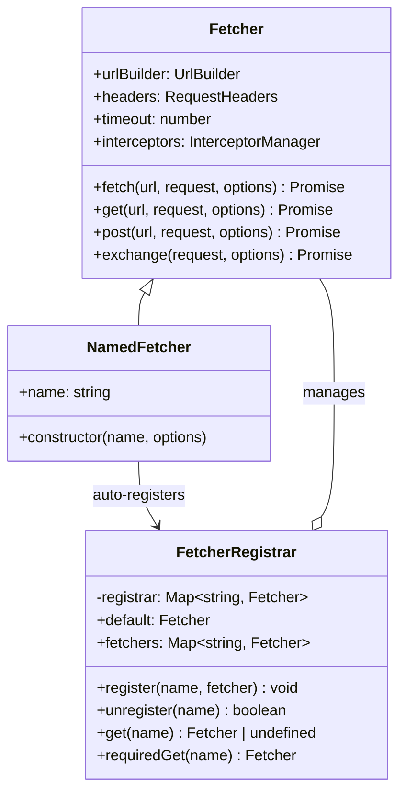
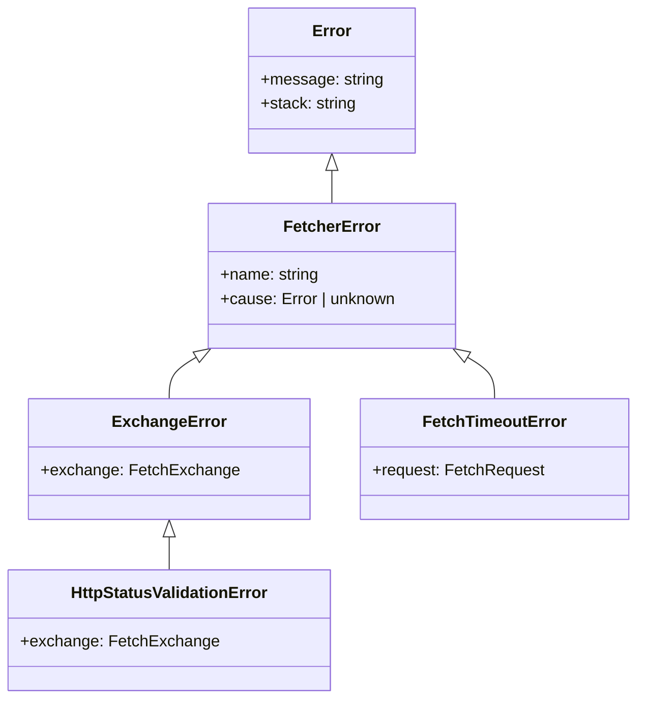

# Configuration

This page is the complete configuration reference for Fetcher. Every option is documented with its source location, default value, and usage examples.

## FetcherOptions

The [`FetcherOptions`](https://github.com/Ahoo-Wang/fetcher/blob/main/packages/fetcher/src/fetcher.ts#L51-L80) interface controls every aspect of a `Fetcher` instance.

| Property | Type | Default | Description |
|----------|------|---------|-------------|
| `baseURL` | `string` | `''` | Base URL prepended to all request paths |
| `headers` | `RequestHeaders` | `{ 'Content-Type': 'application/json' }` | Default headers for all requests |
| `timeout` | `number` | `undefined` (no timeout) | Default timeout in milliseconds |
| `urlTemplateStyle` | `UrlTemplateStyle` | `UrlTemplateStyle.UriTemplate` | Path parameter syntax (`{param}` or `:param`) |
| `interceptors` | `InterceptorManager` | `new InterceptorManager(validateStatus)` | Custom interceptor manager (overrides defaults) |
| `validateStatus` | `(status: number) => boolean` | `status >= 200 && status < 300` | Response status validation function |

::: warning validateStatus Is Ignored With a Custom InterceptorManager
If you provide a custom `interceptors` manager, the `validateStatus` option is **not passed** to it — you must configure validation via the constructor:

```typescript
import { InterceptorManager } from '@ahoo-wang/fetcher';

// Pass validateStatus to the InterceptorManager constructor,
// which registers a ValidateStatusInterceptor with your custom function
const interceptors = new InterceptorManager((status) => status < 500);

const fetcher = new Fetcher({
  interceptors,
  // validateStatus here would be IGNORED — configure it above instead
});
```
:::

```typescript
import { Fetcher, InterceptorManager } from '@ahoo-wang/fetcher';
import { UrlTemplateStyle } from '@ahoo-wang/fetcher';

const options: FetcherOptions = {
  baseURL: 'https://api.example.com/v2',
  headers: {
    'Content-Type': 'application/json',
    Accept: 'application/json',
  },
  timeout: 10000,
  urlTemplateStyle: UrlTemplateStyle.UriTemplate,
  validateStatus: (status) => status >= 200 && status < 300,
};

const fetcher = new Fetcher(options);
```

### Default Options

The default configuration is defined in [`DEFAULT_OPTIONS`](https://github.com/Ahoo-Wang/fetcher/blob/main/packages/fetcher/src/fetcher.ts#L86-L89):

```typescript
export const DEFAULT_OPTIONS: FetcherOptions = {
  baseURL: '',
  headers: { 'Content-Type': 'application/json' },
};
```

## baseURL

The `baseURL` is prepended to every request URL by the [`UrlBuilder`](https://github.com/Ahoo-Wang/fetcher/blob/main/packages/fetcher/src/urlBuilder.ts#L72-L160). The combination logic is in [`combineURLs()`](https://github.com/Ahoo-Wang/fetcher/blob/main/packages/fetcher/src/urls.ts):

```typescript
// Absolute request URLs bypass baseURL
await fetcher.get('https://other-api.com/data');

// Relative paths are combined
await fetcher.get('/users');
// -> https://api.example.com/users
```



## timeout

The [`resolveTimeout`](https://github.com/Ahoo-Wang/fetcher/blob/main/packages/fetcher/src/timeout.ts#L81-L89) function determines the effective timeout for each request. Request-level timeout takes precedence over the fetcher-level timeout:

```typescript
// Fetcher-level default: 5 seconds
const fetcher = new Fetcher({ timeout: 5000 });

// Uses 5000ms (fetcher default)
await fetcher.get('/users');

// Uses 3000ms (request-level override)
await fetcher.get('/fast-endpoint', { timeout: 3000 });

// Uses 0 (no timeout for this request)
await fetcher.get('/slow-report', { timeout: 0 });
```

Timeout is implemented via [`timeoutFetch()`](https://github.com/Ahoo-Wang/fetcher/blob/main/packages/fetcher/src/timeout.ts#L120-L172), which creates an `AbortController` and races the fetch promise against a timeout promise. If the timeout fires, a [`FetchTimeoutError`](https://github.com/Ahoo-Wang/fetcher/blob/main/packages/fetcher/src/timeout.ts#L33-L53) is thrown.

| Scenario | Behavior |
|----------|----------|
| `timeout: undefined` | No timeout; request runs indefinitely |
| `timeout: 0` | No timeout (same as undefined) |
| `timeout: 5000` | Aborts after 5000ms with `FetchTimeoutError` |
| Custom `abortController` provided | Uses that controller; timeout still applies via race |
| Custom `signal` on request | Delegates directly to `fetch()`; timeout is ignored |

## headers

Default headers are merged with per-request headers. Request headers take precedence:

```typescript
const fetcher = new Fetcher({
  headers: {
    'Content-Type': 'application/json',
    'X-App-Version': '1.0.0',
  },
});

// Sends both default headers + Authorization
await fetcher.get('/protected', {
  headers: {
    Authorization: 'Bearer token123',
  },
});

// Upload FormData — do NOT set Content-Type manually;
// the RequestBodyInterceptor auto-detects FormData and removes any
// caller-supplied Content-Type so the browser can set the multipart boundary.
await fetcher.post('/upload', {
  body: formData,
});
```

The merge logic is in [`Fetcher.resolveExchange()`](https://github.com/Ahoo-Wang/fetcher/blob/main/packages/fetcher/src/fetcher.ts#L172-L194):

```typescript
const mergedHeaders = { ...this.headers, ...request.headers };
```

## URL Template Styles

Fetcher supports two path parameter syntaxes, configured via [`UrlTemplateStyle`](https://github.com/Ahoo-Wang/fetcher/blob/main/packages/fetcher/src/urlTemplateResolver.ts#L20-L38):



| Style | Template | Parameters Object | Resolver Class |
|-------|----------|-------------------|----------------|
| `UrlTemplateStyle.UriTemplate` (default) | `/users/{id}` | `{ id: 123 }` | [`UriTemplateResolver`](https://github.com/Ahoo-Wang/fetcher/blob/main/packages/fetcher/src/urlTemplateResolver.ts#L205-L295) |
| `UrlTemplateStyle.Express` | `/users/:id` | `{ id: 123 }` | [`ExpressUrlTemplateResolver`](https://github.com/Ahoo-Wang/fetcher/blob/main/packages/fetcher/src/urlTemplateResolver.ts#L316-L390) |

```typescript
import { Fetcher, UrlTemplateStyle } from '@ahoo-wang/fetcher';

// RFC 6570 style (default)
const apiFetcher = new Fetcher({ baseURL: 'https://api.example.com' });
await apiFetcher.get('/users/{id}', {
  urlParams: { path: { id: 42 } },
});

// Express style
const expressFetcher = new Fetcher({
  baseURL: 'https://api.example.com',
  urlTemplateStyle: UrlTemplateStyle.Express,
});
await expressFetcher.get('/users/:id', {
  urlParams: { path: { id: 42 } },
});
```

Path parameter values are automatically encoded with `encodeURIComponent()`.

## Interceptor System

The [`InterceptorManager`](https://github.com/Ahoo-Wang/fetcher/blob/main/packages/fetcher/src/interceptorManager.ts#L48-L212) manages three interceptor registries:

| Registry | Phase | Built-in Interceptors |
|----------|-------|----------------------|
| `interceptors.request` | Before HTTP call | `RequestBodyInterceptor`, `UrlResolveInterceptor`, `FetchInterceptor` |
| `interceptors.response` | After HTTP response | `ValidateStatusInterceptor` |
| `interceptors.error` | On error | None (empty by default) |

### Built-in Request Interceptors



| Interceptor | Order | Purpose |
|-------------|-------|---------|
| [`RequestBodyInterceptor`](https://github.com/Ahoo-Wang/fetcher/blob/main/packages/fetcher/src/requestBodyInterceptor.ts) | Very low (runs first) | Converts object bodies to JSON strings, sets `Content-Type` |
| [`UrlResolveInterceptor`](https://github.com/Ahoo-Wang/fetcher/blob/main/packages/fetcher/src/urlResolveInterceptor.ts) | Very high (runs last among request) | Resolves final URL via `UrlBuilder.build()` |
| [`FetchInterceptor`](https://github.com/Ahoo-Wang/fetcher/blob/main/packages/fetcher/src/fetchInterceptor.ts) | High | Executes the actual `timeoutFetch()` call |
| [`ValidateStatusInterceptor`](https://github.com/Ahoo-Wang/fetcher/blob/main/packages/fetcher/src/validateStatusInterceptor.ts) | `Number.MAX_SAFE_INTEGER - 10000` | Validates response status code |

### Custom Interceptor Registration

```typescript
const fetcher = new Fetcher({ baseURL: 'https://api.example.com' });

// Request interceptor
fetcher.interceptors.request.use({
  name: 'MetricsInterceptor',
  order: 200,
  async intercept(exchange) {
    exchange.attributes = exchange.attributes || new Map();
    exchange.attributes.set('startTime', Date.now());
  },
});

// Response interceptor
fetcher.interceptors.response.use({
  name: 'MetricsCollector',
  order: 200,
  async intercept(exchange) {
    const startTime = exchange.attributes.get('startTime');
    if (startTime) {
      const duration = Date.now() - startTime;
      console.log(`Request took ${duration}ms`);
    }
  },
});

// Error interceptor
fetcher.interceptors.error.use({
  name: 'RetryInterceptor',
  order: 100,
  async intercept(exchange) {
    // Implement retry logic
    if (shouldRetry(exchange.error)) {
      exchange.error = undefined; // Clear error to indicate handled
    }
  },
});
```

### Interceptor Ordering

Interceptors execute in ascending `order` value. The [`BUILT_IN_INTERCEPTOR_ORDER_STEP`](https://github.com/Ahoo-Wang/fetcher/blob/main/packages/fetcher/src/interceptor.ts#L20-L21) is `10000`, giving wide gaps for custom interceptors:

| Order Range | Suggested Use |
|-------------|---------------|
| `0 - 9999` | Before all built-in interceptors |
| `10000 - 19999` | After first built-in, before second |
| `20000 - 89999` | Between built-in interceptors |
| `90000+` | After all built-in interceptors |

### Bypassing Status Validation

To skip `ValidateStatusInterceptor` for a specific request, set the `IGNORE_VALIDATE_STATUS` attribute:

```typescript
import { IGNORE_VALIDATE_STATUS } from '@ahoo-wang/fetcher';

await fetcher.get('/endpoint-that-returns-404', {}, {
  attributes: { [IGNORE_VALIDATE_STATUS]: true },
});
```

### Removing Interceptors

```typescript
// Remove by name
fetcher.interceptors.request.eject('MetricsInterceptor');

// Clear all from a registry
fetcher.interceptors.error.clear();
```

## ValidateStatus

The [`validateStatus`](https://github.com/Ahoo-Wang/fetcher/blob/main/packages/fetcher/src/validateStatusInterceptor.ts#L40-L62) function determines which HTTP status codes are treated as successful:

```typescript
// Accept all status codes (never throw based on status)
const fetcher = new Fetcher({
  validateStatus: () => true,
});

// Only accept 200
const strictFetcher = new Fetcher({
  validateStatus: (status) => status === 200,
});

// Accept 2xx and 3xx
const relaxedFetcher = new Fetcher({
  validateStatus: (status) => status >= 200 && status < 400,
});
```

When validation fails, a [`HttpStatusValidationError`](https://github.com/Ahoo-Wang/fetcher/blob/main/packages/fetcher/src/validateStatusInterceptor.ts#L27-L36) (extending [`ExchangeError`](https://github.com/Ahoo-Wang/fetcher/blob/main/packages/fetcher/src/fetcherError.ts#L86-L106)) is thrown with access to the full exchange object.

## Result Extractors

Result extractors control what the `fetcher.fetch()`, `get()`, `post()`, etc. methods return. Configure them per-request or per-class:

```typescript
import { ResultExtractors } from '@ahoo-wang/fetcher';

// Per-request: extract as JSON
const user = await fetcher.get<User>('/users/1', {}, {
  resultExtractor: ResultExtractors.Json,
});

// The exchange-level request method uses ResultExtractors.Exchange by default
const exchange = await fetcher.exchange({ url: '/users', method: 'GET' });
// exchange.request, exchange.response, exchange.error all accessible
```

| Extractor | Return Type | Best For |
|-----------|-------------|----------|
| `ExchangeResultExtractor` | `FetchExchange` | Custom processing, logging, metrics |
| `ResponseResultExtractor` | `Response` | Access to raw response (headers, status) |
| `JsonResultExtractor` | `Promise<any>` | JSON API responses |
| `TextResultExtractor` | `Promise<string>` | HTML, plain text |
| `BlobResultExtractor` | `Promise<Blob>` | Files, images |
| `ArrayBufferResultExtractor` | `Promise<ArrayBuffer>` | Binary protocols |
| `BytesResultExtractor` | `Promise<Uint8Array>` | Protobuf, binary data |

Default result extractors by method:

| Method | Default Extractor |
|--------|-------------------|
| `fetcher.fetch()` | `ResponseResultExtractor` |
| `fetcher.get()` / `post()` / etc. | `ResponseResultExtractor` |
| `fetcher.exchange()` | `ExchangeResultExtractor` |
| `fetcher.request()` | `ExchangeResultExtractor` |

## NamedFetcher and FetcherRegistrar

### NamedFetcher

[`NamedFetcher`](https://github.com/Ahoo-Wang/fetcher/blob/main/packages/fetcher/src/namedFetcher.ts#L38-L66) extends `Fetcher` and automatically registers itself with the global [`fetcherRegistrar`](https://github.com/Ahoo-Wang/fetcher/blob/main/packages/fetcher/src/fetcherRegistrar.ts#L166):

```typescript
import { NamedFetcher } from '@ahoo-wang/fetcher';

// Auto-registers as 'payments-api'
new NamedFetcher('payments-api', {
  baseURL: 'https://payments.example.com',
  timeout: 8000,
  headers: { 'X-Api-Key': 'key123' },
});
```

A default `NamedFetcher` instance named `'default'` is exported from the package:

```typescript
import { fetcher } from '@ahoo-wang/fetcher';
// fetcher is the 'default' named instance
```

### FetcherRegistrar

The [`FetcherRegistrar`](https://github.com/Ahoo-Wang/fetcher/blob/main/packages/fetcher/src/fetcherRegistrar.ts#L41-L150) is a `Map<string, Fetcher>` wrapper with convenience methods:

```typescript
import { fetcherRegistrar } from '@ahoo-wang/fetcher';

// Register manually
fetcherRegistrar.register('custom', myFetcher);

// Retrieve
const client = fetcherRegistrar.get('custom'); // Fetcher | undefined
const required = fetcherRegistrar.requiredGet('custom'); // Fetcher (throws if missing)

// Default getter/setter
fetcherRegistrar.default = myFetcher; // registers as 'default'
const defaultClient = fetcherRegistrar.default; // requiredGet('default')

// Get all registered fetchers
const all: Map<string, Fetcher> = fetcherRegistrar.fetchers;

// Unregister
fetcherRegistrar.unregister('custom'); // boolean
```



### Environment-Specific Configuration

Use `NamedFetcher` to set up environment-aware clients:

```typescript
import { NamedFetcher } from '@ahoo-wang/fetcher';

const baseURL = import.meta.env.VITE_API_BASE_URL || 'http://localhost:3000';

// Default client for your API
new NamedFetcher('default', {
  baseURL,
  timeout: 5000,
});

// Third-party API client with different config
new NamedFetcher('openai', {
  baseURL: 'https://api.openai.com/v1',
  headers: {
    Authorization: `Bearer ${import.meta.env.VITE_OPENAI_KEY}`,
  },
  timeout: 30000,
});

// Admin client with longer timeout
new NamedFetcher('admin', {
  baseURL: `${baseURL}/admin`,
  timeout: 60000,
  headers: { 'X-Admin-Token': import.meta.env.VITE_ADMIN_TOKEN },
});
```

### Decorator Integration

The `@api` decorator uses `FetcherRegistrar` internally. When you specify `fetcher: 'openai'` in the decorator options, it calls `fetcherRegistrar.requiredGet('openai')` at decoration time:

```typescript
import { NamedFetcher, fetcherRegistrar } from '@ahoo-wang/fetcher';
import { api, get } from '@ahoo-wang/fetcher-decorator';

// Must be registered before class decoration executes
new NamedFetcher('llm', { baseURL: 'https://api.openai.com/v1' });

@api('/v1/chat', { fetcher: 'llm' })
class ChatService {
  @get('/models')
  listModels(): Promise<any> {
    throw autoGeneratedError();
  }
}
```

## Error Handling

Fetcher provides a structured error hierarchy:



| Error | Condition | Access To |
|-------|-----------|-----------|
| [`FetchTimeoutError`](https://github.com/Ahoo-Wang/fetcher/blob/main/packages/fetcher/src/timeout.ts#L33-L53) | Request exceeds timeout | `error.request` |
| [`HttpStatusValidationError`](https://github.com/Ahoo-Wang/fetcher/blob/main/packages/fetcher/src/validateStatusInterceptor.ts#L27-L36) | Status fails `validateStatus` | `error.exchange` (request + response) |
| [`ExchangeError`](https://github.com/Ahoo-Wang/fetcher/blob/main/packages/fetcher/src/fetcherError.ts#L86-L106) | Unhandled error in interceptor chain | `error.exchange` |
| [`FetcherError`](https://github.com/Ahoo-Wang/fetcher/blob/main/packages/fetcher/src/fetcherError.ts#L37-L62) | General fetcher errors | `error.cause` |

```typescript
import {
  Fetcher,
  FetchTimeoutError,
  HttpStatusValidationError,
  ExchangeError,
} from '@ahoo-wang/fetcher';

try {
  await fetcher.get('/data', { timeout: 3000 });
} catch (error) {
  if (error instanceof FetchTimeoutError) {
    console.log(`Timed out after ${error.request.timeout}ms`);
  } else if (error instanceof HttpStatusValidationError) {
    console.log(`Status ${error.exchange.response?.status} failed`);
  } else if (error instanceof ExchangeError) {
    console.log(`Exchange error: ${error.message}`);
  }
}
```

## What to Read Next

| Topic | Page |
|-------|------|
| Getting started with code examples | [Quick Start](./quick-start.md) |
| Project overview and architecture | [Introduction](./index.md) |
| Contributing to Fetcher | [Contributing](./contributing.md) |
