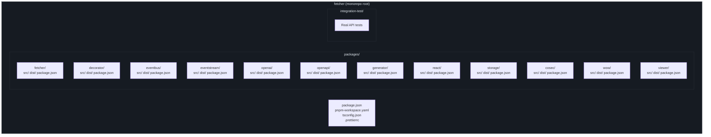
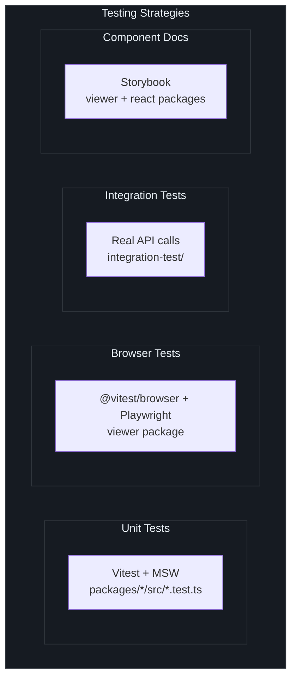
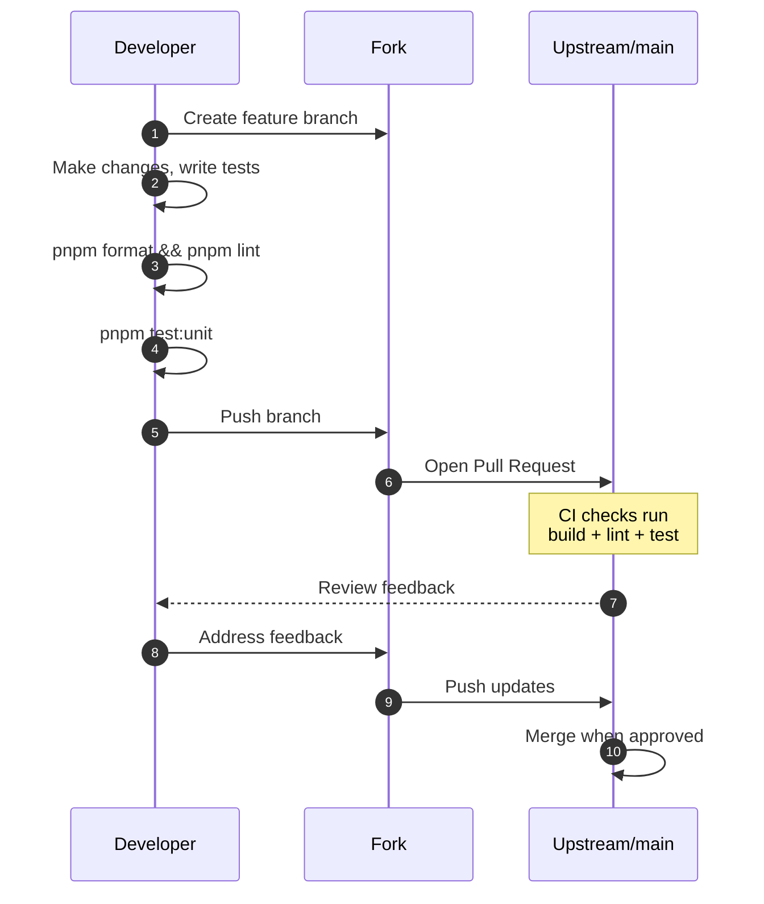

# Contributing

Fetcher is an open-source project licensed under [Apache 2.0](https://github.com/Ahoo-Wang/fetcher/blob/main/package.json#L29). This guide covers everything you need to get the project running locally and submit high-quality pull requests.

## Development Setup

### Prerequisites

| Requirement | Minimum Version | Check |
|-------------|-----------------|-------|
| Node.js | 18.0.0 | `node --version` |
| pnpm | 10.33.0 | `pnpm --version` |
| Git | 2.x | `git --version` |

Fetcher uses ES modules exclusively (`"type": "module"`) and targets Node.js >= 18 for native Fetch API support.

### Getting Started

```bash
# Fork and clone
git clone https://github.com/<your-username>/fetcher.git
cd fetcher

# Install all dependencies across the monorepo
pnpm install

# Build all packages
pnpm build

# Run unit tests to verify the setup
pnpm test:unit
```

### Repository Structure



Each package follows the same internal layout:

```
packages/<name>/
  src/               # TypeScript source files
  dist/              # Build output (ESM + UMD + types)
  package.json       # Package-specific config and scripts
  vite.config.ts     # Vite build config
  tsconfig.json      # TypeScript config extending root
```

## Monorepo Conventions

### Workspace Protocol

Dependency versions are centralized via the `catalog:` protocol in [`pnpm-workspace.yaml`](https://github.com/Ahoo-Wang/fetcher/blob/main/pnpm-workspace.yaml). Packages reference `catalog:` instead of hardcoding version ranges:

```yaml
# pnpm-workspace.yaml
catalog:
  vitest: ^4.1.5
  vite: ^8.0.11
  typescript: ^6.0.3
```

```json
// packages/fetcher/package.json
{
  "devDependencies": {
    "vitest": "catalog:",
    "vite": "catalog:"
  }
}
```

This ensures all packages use the same dependency versions.

### Build Configuration

All packages use [Vite](https://vite.dev/) for building with [`unplugin-dts`](https://github.com/unplugin/unplugin-dts) for type declarations. Each package outputs:

| Output | File | Format |
|--------|------|--------|
| ESM | `dist/index.es.js` | ES modules |
| UMD | `dist/index.umd.js` | Universal module |
| Types | `dist/index.d.ts` | TypeScript declarations |

Packages with React components (viewer, react) additionally use `@vitejs/plugin-react` with React Compiler and `@babel/plugin-proposal-decorators` (legacy mode).

### Package Scripts

Every package supports these scripts:

```bash
# Build a single package
pnpm --filter @ahoo-wang/fetcher build

# Test a single package
pnpm --filter @ahoo-wang/fetcher test

# Lint a single package
pnpm --filter @ahoo-wang/fetcher lint
```

Or use root-level commands to operate on all packages:

```bash
pnpm build       # Build all packages
pnpm test:unit   # Unit tests for all packages
pnpm test:it     # Integration tests only
pnpm lint        # Lint all packages
pnpm format      # Format all files with Prettier
pnpm clean       # Clean all dist/ directories
```

## Testing

Fetcher uses [Vitest](https://vitest.dev/) as its test runner with multiple testing strategies:



### Unit Tests

Unit tests live alongside source files with a `*.test.ts` or `*.test.tsx` suffix. Vitest globals are enabled (`describe`, `it`, `expect`, `vi` available without imports):

```typescript
// Example: packages/fetcher/src/fetcher.test.ts
import { Fetcher } from './fetcher';

describe('Fetcher', () => {
  it('should create with default options', () => {
    const fetcher = new Fetcher();
    expect(fetcher.headers).toEqual({ 'Content-Type': 'application/json' });
  });
});
```

The fetcher package uses [MSW (Mock Service Worker)](https://mswjs.io/) for HTTP mocking:

```typescript
import { http, HttpResponse } from 'msw';
import { setupServer } from 'msw/node';

const server = setupServer(
  http.get('https://api.example.com/users', () => {
    return HttpResponse.json([{ id: 1, name: 'Alice' }]);
  }),
);

beforeAll(() => server.listen());
afterEach(() => server.resetHandlers());
afterAll(() => server.close());
```

### Running Tests

```bash
# All unit tests
pnpm test:unit

# Single package
pnpm --filter @ahoo-wang/fetcher test

# Single test file
pnpm --filter @ahoo-wang/fetcher vitest run src/fetcher.test.ts

# With coverage
pnpm --filter @ahoo-wang/fetcher vitest run --coverage

# Integration tests (requires network)
pnpm test:it
```

### Browser Tests

The viewer package runs tests in a real browser via `@vitest/browser` with Playwright:

```bash
pnpm --filter @ahoo-wang/fetcher-viewer test
```

### Coverage

All packages use `@vitest/coverage-v8` for code coverage reporting.

### Test Naming Convention

| File Pattern | Purpose | ESLint |
|-------------|---------|--------|
| `*.test.ts` | Unit tests | Ignored by ESLint |
| `*.test.tsx` | Component tests | Ignored by ESLint |

ESLint is configured to skip test files, so test files are not linted.

## Code Style

Fetcher enforces consistent code style through Prettier and ESLint.

### Prettier Configuration

The [`.prettierrc`](https://github.com/Ahoo-Wang/fetcher/blob/main/.prettierrc) at the repository root:

```json
{
  "semi": true,
  "trailingComma": "all",
  "singleQuote": true,
  "printWidth": 80,
  "tabWidth": 2,
  "useTabs": false,
  "bracketSpacing": true,
  "arrowParens": "avoid"
}
```

Run the formatter before committing:

```bash
pnpm format
```

### ESLint

ESLint uses `@typescript-eslint` with the following key rules:

| Rule | Setting | Notes |
|------|---------|-------|
| `@typescript-eslint/no-explicit-any` | OFF | `any` is allowed |
| `@typescript-eslint/consistent-type-imports` | `prefer: "type-imports"` | Enforced in integration-test and story files |

Run the linter:

```bash
pnpm lint
```

### TypeScript

All packages use strict TypeScript mode. The root `tsconfig.json` enables:

- `experimentalDecorators` -- Required by `@ahoo-wang/fetcher-decorator`
- `emitDecoratorMetadata` -- Required for reflect-metadata support
- `strict: true` -- Full strict mode

### License Headers

Every source file must include the Apache 2.0 license header:

```typescript
/*
 * Copyright [2021-present] [ahoo wang <ahoowang@qq.com> (https://github.com/Ahoo-Wang)].
 * Licensed under the Apache License, Version 2.0 (the "License");
 * you may not use this file except in compliance with the License.
 * You may obtain a copy of the License at
 *      http://www.apache.org/licenses/LICENSE-2.0
 * Unless required by applicable law or agreed to in writing, software
 * distributed under the License is distributed on an "AS IS" BASIS,
 * WITHOUT WARRANTIES OR CONDITIONS OF ANY KIND, either express or implied.
 * See the License for the specific language governing permissions and
 * limitations under the License.
 */
```

### Commit Messages

Follow conventional commit style:

```
type(scope): description

feat(fetcher): add support for custom abort controllers
fix(decorator): resolve parameter name extraction for arrow functions
test(eventstream): add integration tests for SSE parsing
chore(project): update dependencies to latest versions
docs(wiki): add configuration reference page
```

## Pull Request Process

### Branch Workflow



### Before Submitting

Run these checks locally before opening a PR:

```bash
# 1. Format code
pnpm format

# 2. Lint all packages
pnpm lint

# 3. Build all packages
pnpm build

# 4. Run unit tests
pnpm test:unit
```

### PR Checklist

- [ ] Code compiles without errors (`pnpm build`)
- [ ] All existing tests pass (`pnpm test:unit`)
- [ ] New features have accompanying unit tests
- [ ] Code is formatted (`pnpm format`)
- [ ] Linter passes (`pnpm lint`)
- [ ] License headers present on new files
- [ ] Commit messages follow conventional commit format
- [ ] Documentation updated if public API changed

## Version Management

Fetcher uses a centralized version management script to keep all packages in sync:

```bash
# Update all package versions to a new version
pnpm update-version 3.17.0
```

This script ([`scripts/update-all-versions.sh`](https://github.com/Ahoo-Wang/fetcher/blob/main/scripts/update-all-versions.sh)) updates the version field in every `package.json` across the monorepo, ensuring consistency.

The current version is maintained in the root [`package.json`](https://github.com/Ahoo-Wang/fetcher/blob/main/package.json#L3):

```json
{
  "version": "3.16.4"
}
```

## Adding a New Package

To add a new package to the monorepo:

1. Create the directory under `packages/`
2. Add a `package.json` with `@ahoo-wang/fetcher-<name>` as the name
3. Add a `vite.config.ts` following the pattern of existing packages
4. Add a `tsconfig.json` extending the root config
5. Use `catalog:` for any shared dependencies
6. Update inter-package dependencies as needed

```bash
# Example: create a new package
mkdir packages/my-package
cd packages/my-package
# Create package.json, vite.config.ts, tsconfig.json, src/index.ts
```

The pnpm workspace configuration in [`pnpm-workspace.yaml`](https://github.com/Ahoo-Wang/fetcher/blob/main/pnpm-workspace.yaml#L1-L2) automatically picks up new packages:

```yaml
packages:
  - packages/*
  - integration-test
```

## Bundle Analysis

Each package includes an `analyze` script that generates a visual bundle size report using `vite-bundle-analyzer`:

```bash
pnpm --filter @ahoo-wang/fetcher analyze
```

## What to Read Next

| Topic | Page |
|-------|------|
| Project overview | [Introduction](./index.md) |
| Quick start guide | [Quick Start](./quick-start.md) |
| Full configuration reference | [Configuration](./configuration.md) |
