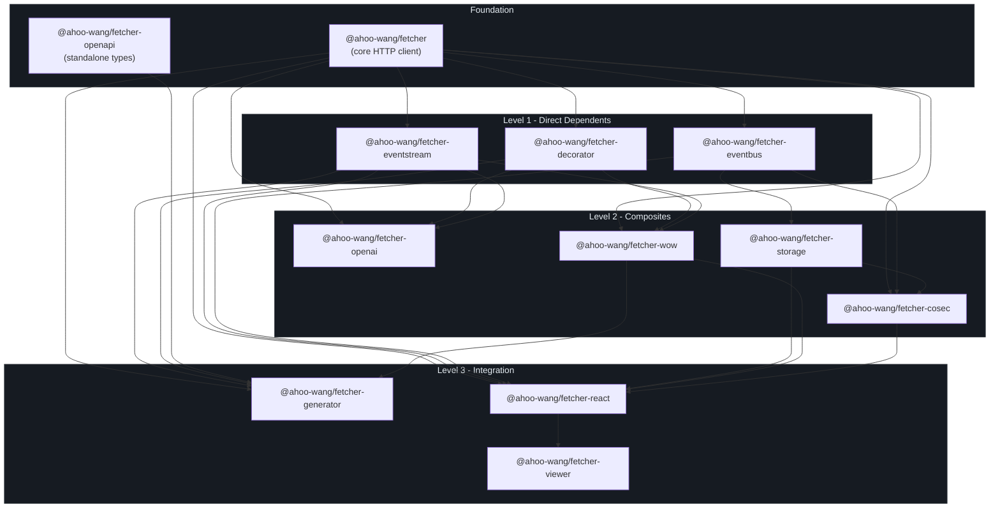
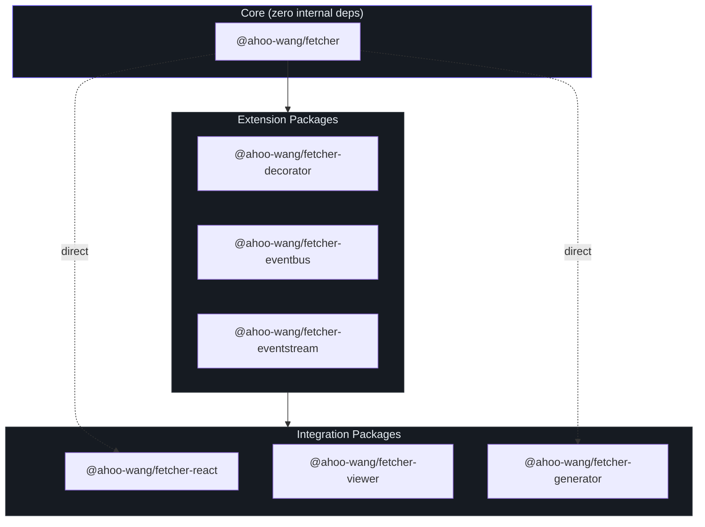
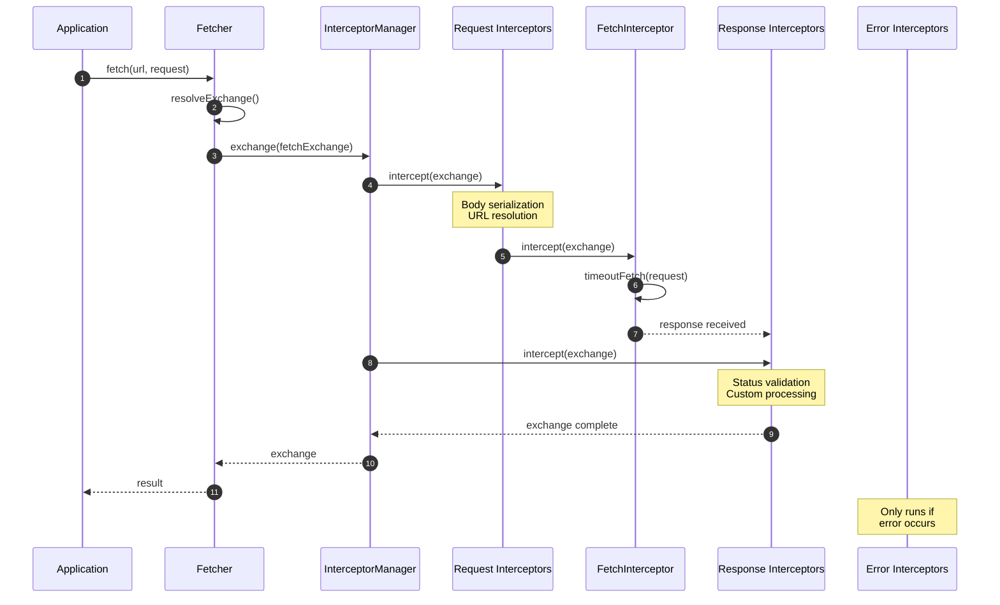
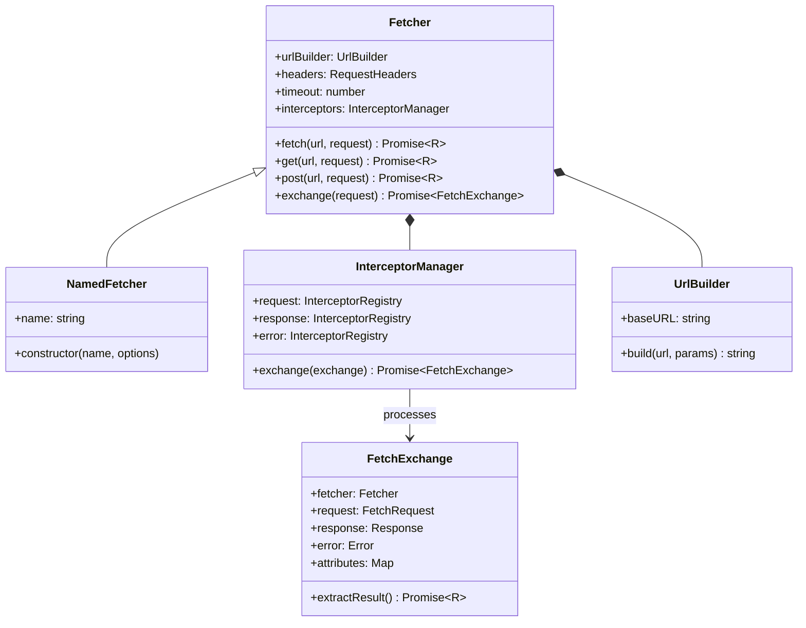

# Introduction

Fetcher is a modular HTTP client ecosystem built on the native Fetch API. It provides an Axios-like developer experience with interceptor-powered middleware, TypeScript-first design, and native LLM streaming support -- all published as a pnpm monorepo under the `@ahoo-wang/*` scope.

## Why Fetcher?

The native Fetch API is powerful but bare-bones. Applications need base URL management, timeout handling, request/response interceptors, URL template parameters, and structured error handling. Existing solutions like Axios add significant bundle size and do not leverage the modern Fetch API natively.

Fetcher solves these problems while staying lightweight and modular:

| Problem | Native Fetch | Axios | Fetcher |
|---------|-------------|-------|---------|
| Base URL support | Manual | Built-in | Built-in ([`FetcherOptions.baseURL`](https://github.com/Ahoo-Wang/fetcher/blob/main/packages/fetcher/src/fetcher.ts#L51-L80)) |
| Timeout handling | Manual AbortController | Built-in | Built-in with [`TimeoutCapable`](https://github.com/Ahoo-Wang/fetcher/blob/main/packages/fetcher/src/timeout.ts#L60-L68) |
| Interceptors | None | Yes | Yes -- 3-phase pipeline ([`InterceptorManager`](https://github.com/Ahoo-Wang/fetcher/blob/main/packages/fetcher/src/interceptorManager.ts#L48-L212)) |
| URL path parameters | Manual | Manual | Built-in `{param}` and `:param` styles ([`UrlTemplateStyle`](https://github.com/Ahoo-Wang/fetcher/blob/main/packages/fetcher/src/urlTemplateResolver.ts#L20-L38)) |
| SSE/LLM streaming | Manual | None | Native via side-effect import ([`@ahoo-wang/fetcher-eventstream`](https://github.com/Ahoo-Wang/fetcher/blob/main/packages/eventstream/src/responses.ts#L102-L239)) |
| Declarative API clients | None | None | Decorator-based ([`@ahoo-wang/fetcher-decorator`](https://github.com/Ahoo-Wang/fetcher/blob/main/packages/decorator/src/apiDecorator.ts#L232-L247)) |
| Bundle size baseline | 0 KB (native) | ~13 KB | ~4 KB (core only) |
| TypeScript generics | Limited | Good | First-class |

## Package Ecosystem

Fetcher ships as 12 packages in a single monorepo, each installable independently:

| Package | npm Name | Description |
|---------|----------|-------------|
| **fetcher** | `@ahoo-wang/fetcher` | Core HTTP client -- the foundation for everything |
| **decorator** | `@ahoo-wang/fetcher-decorator` | TypeScript decorators for declarative API services |
| **eventbus** | `@ahoo-wang/fetcher-eventbus` | Event bus with serial, parallel, and broadcast implementations |
| **eventstream** | `@ahoo-wang/fetcher-eventstream` | SSE and LLM streaming support (side-effect module) |
| **openai** | `@ahoo-wang/fetcher-openai` | Type-safe OpenAI API client |
| **openapi** | `@ahoo-wang/fetcher-openapi` | OpenAPI 3.x TypeScript type definitions |
| **generator** | `@ahoo-wang/fetcher-generator` | CLI code generator from OpenAPI specs |
| **react** | `@ahoo-wang/fetcher-react` | React Hooks for data fetching |
| **storage** | `@ahoo-wang/fetcher-storage` | Cross-environment storage abstraction |
| **cosec** | `@ahoo-wang/fetcher-cosec` | CoSec authentication integration |
| **wow** | `@ahoo-wang/fetcher-wow` | Wow DDD/CQRS framework support |
| **viewer** | `@ahoo-wang/fetcher-viewer` | React + Ant Design API documentation components |

## Package Dependency Graph

## Modular Design

Each package is independently installable. The core `@ahoo-wang/fetcher` has zero internal dependencies -- all other packages build on top of it:

## Core Architecture

The request lifecycle flows through a three-phase interceptor pipeline:

## Core Class Hierarchy

## Key Features

- **Interceptor Pipeline** -- Three-phase (request/response/error) middleware chain with ordered execution. Built-in interceptors handle URL resolution, body serialization, HTTP execution, and status validation.
- **URL Template Parameters** -- Supports both URI Template (`{id}`) and Express-style (`:param`) path parameter interpolation via [`UrlTemplateStyle`](https://github.com/Ahoo-Wang/fetcher/blob/main/packages/fetcher/src/urlTemplateResolver.ts#L20-L38).
- **Named Fetcher Registry** -- Manage multiple fetcher instances with different configurations using [`NamedFetcher`](https://github.com/Ahoo-wang/fetcher/blob/main/packages/fetcher/src/namedFetcher.ts#L38-L66) and [`FetcherRegistrar`](https://github.com/Ahoo-Wang/fetcher/blob/main/packages/fetcher/src/fetcherRegistrar.ts#L41-L150).
- **Declarative API Clients** -- Use `@api`, `@get`, `@post`, `@path`, `@query`, `@body` decorators to define type-safe API services without writing boilerplate request code.
- **SSE and LLM Streaming** -- Native Server-Sent Events support via side-effect import. Patches `Response.prototype` with `eventStream()` and `jsonEventStream()` methods.
- **Result Extractors** -- Configurable response extraction strategies (`Json`, `Text`, `Blob`, `Exchange`, etc.) via [`ResultExtractors`](https://github.com/Ahoo-Wang/fetcher/blob/main/packages/fetcher/src/resultExtractor.ts#L131-L160).
- **TypeScript Strict Mode** -- Full generic type support across all packages with strict mode enabled.
- **Tree-Shakeable** -- Each package is independently installable. Only import what you use.

## What to Read Next

| Goal | Page |
|------|------|
| Get up and running quickly | [Quick Start](./quick-start.md) |
| Configure Fetcher for your project | [Configuration](./configuration.md) |
| Contribute to the project | [Contributing](./contributing.md) |
