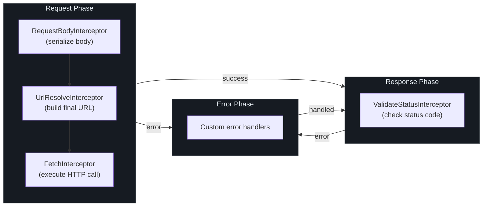
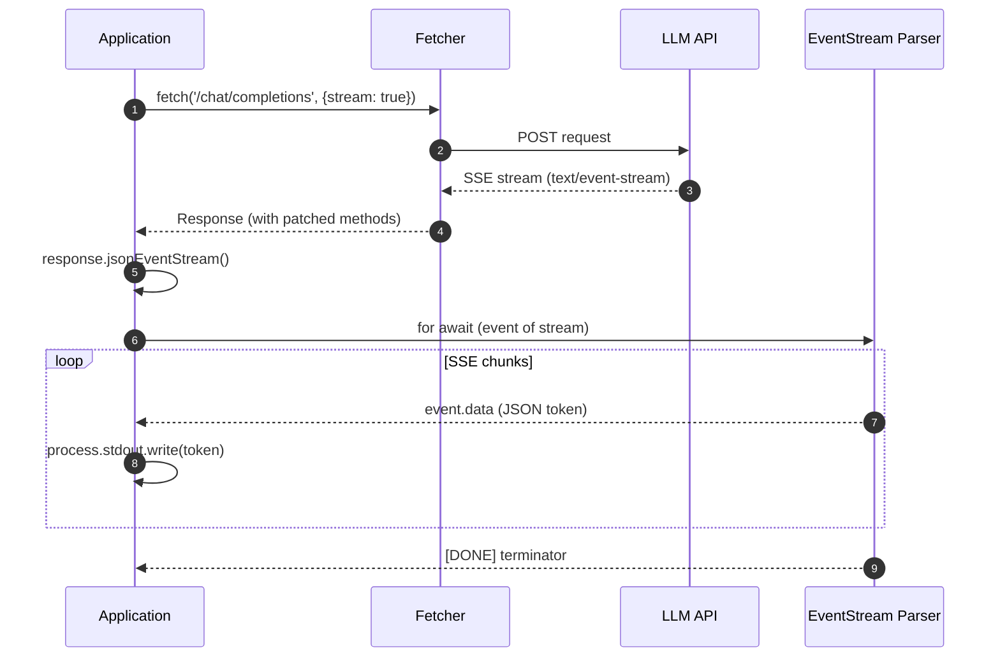
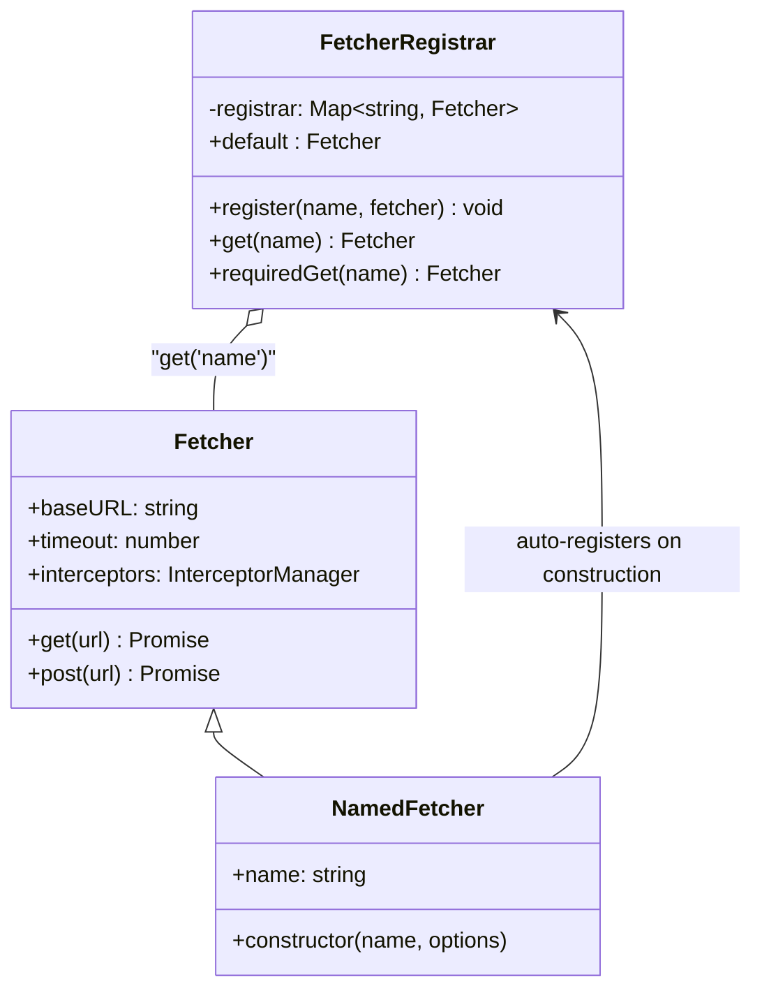

# Quick Start

This guide walks you through installing Fetcher, making your first request, adding interceptors, defining decorator-based API services, and consuming LLM streams.

## Installation

Install the core package and any additional packages you need:

::: code-group

```bash [pnpm]
# Core HTTP client
pnpm add @ahoo-wang/fetcher

# Optional: declarative API decorators
pnpm add @ahoo-wang/fetcher-decorator reflect-metadata

# Optional: SSE / LLM streaming
pnpm add @ahoo-wang/fetcher-eventstream

# Optional: OpenAI client
pnpm add @ahoo-wang/fetcher-openai

# Optional: React hooks
pnpm add @ahoo-wang/fetcher-react
```

```bash [npm]
npm install @ahoo-wang/fetcher

# Optional: declarative API decorators
npm install @ahoo-wang/fetcher-decorator reflect-metadata

# Optional: SSE / LLM streaming
npm install @ahoo-wang/fetcher-eventstream
```

```bash [yarn]
yarn add @ahoo-wang/fetcher

# Optional: declarative API decorators
yarn add @ahoo-wang/fetcher-decorator reflect-metadata

# Optional: SSE / LLM streaming
yarn add @ahoo-wang/fetcher-eventstream
```

:::

::: tip
Fetcher requires Node.js >= 18.0.0 and uses ES modules (`"type": "module"`). Make sure your project targets ESM or uses a bundler.
:::

## Basic Usage

### Creating a Fetcher Instance

Create a `Fetcher` instance with a base URL and default configuration:

```typescript
import { Fetcher } from '@ahoo-wang/fetcher';

const fetcher = new Fetcher({
  baseURL: 'https://api.example.com',
  timeout: 5000,
  headers: {
    'Content-Type': 'application/json',
  },
});
```

The [`Fetcher` constructor](https://github.com/Ahoo-Wang/fetcher/blob/main/packages/fetcher/src/fetcher.ts#L144-L150) accepts a [`FetcherOptions`](https://github.com/Ahoo-Wang/fetcher/blob/main/packages/fetcher/src/fetcher.ts#L51-L80) object. If no options are provided, defaults apply: empty base URL, JSON content-type header, no timeout.

### Making Requests

Fetcher provides convenience methods for all standard HTTP verbs. Each returns a `Response` by default:

```typescript
// GET request
const users = await fetcher.get('/users');

// GET with path and query parameters
const user = await fetcher.get('/users/{id}', {
  urlParams: {
    path: { id: 123 },
    query: { include: 'profile' },
  },
});

// POST with JSON body
const created = await fetcher.post('/users', {
  body: { name: 'Alice', email: 'alice@example.com' },
});

// PUT to update a resource
const updated = await fetcher.put('/users/{id}', {
  urlParams: { path: { id: 123 } },
  body: { name: 'Alice Smith' },
});

// DELETE a resource
await fetcher.delete('/users/{id}', {
  urlParams: { path: { id: 123 } },
});
```

The path parameter syntax follows [RFC 6570 URI Templates](https://github.com/Ahoo-Wang/fetcher/blob/main/packages/fetcher/src/urlTemplateResolver.ts#L186-L295) by default. You can switch to Express-style (`:param`) via the [`urlTemplateStyle`](https://github.com/Ahoo-Wang/fetcher/blob/main/packages/fetcher/src/urlTemplateResolver.ts#L20-L38) option.

### Using Result Extractors

By default, convenience methods like `get()` and `post()` return the raw `Response` object. Use built-in [`ResultExtractors`](https://github.com/Ahoo-Wang/fetcher/blob/main/packages/fetcher/src/resultExtractor.ts#L131-L160) to extract data in the format you need:

```typescript
import { ResultExtractors } from '@ahoo-wang/fetcher';

// Extract as parsed JSON
const user = await fetcher.get<User>('/users/{id}', {
  urlParams: { path: { id: 123 } },
}, { resultExtractor: ResultExtractors.Json });

// Extract as text
const html = await fetcher.get<string>('/pages/home', {}, {
  resultExtractor: ResultExtractors.Text,
});

// Extract as Blob (e.g., for images)
const avatar = await fetcher.get('/users/{id}/avatar', {
  urlParams: { path: { id: 123 } },
}, { resultExtractor: ResultExtractors.Blob });
```

Available extractors:

| Extractor | Returns | Use Case |
|-----------|---------|----------|
| `ResultExtractors.Exchange` | `FetchExchange` | Full access to request, response, and metadata |
| `ResultExtractors.Response` | `Response` | Raw response object |
| `ResultExtractors.Json` | `Promise<any>` | Parsed JSON body |
| `ResultExtractors.Text` | `Promise<string>` | Text body |
| `ResultExtractors.Blob` | `Promise<Blob>` | Binary data |
| `ResultExtractors.ArrayBuffer` | `Promise<ArrayBuffer>` | Raw buffer |
| `ResultExtractors.Bytes` | `Promise<Uint8Array>` | Byte array |

## Request Lifecycle

Every request flows through the [`Fetcher.exchange()`](https://github.com/Ahoo-Wang/fetcher/blob/main/packages/fetcher/src/fetcher.ts#L206-L212) pipeline, which runs the three-phase interceptor chain:



## Using Interceptors

Interceptors are the primary extension point. They implement the [`Interceptor`](https://github.com/Ahoo-Wang/fetcher/blob/main/packages/fetcher/src/interceptor.ts#L44-L85) interface with a `name`, `order`, and `intercept()` method.

### Request Interceptor

Add an authorization header to every request:

```typescript
fetcher.interceptors.request.use({
  name: 'AuthInterceptor',
  order: 100,
  async intercept(exchange) {
    const token = await getAuthToken();
    exchange.request.headers = {
      ...exchange.request.headers,
      Authorization: `Bearer ${token}`,
    };
  },
});
```

### Response Interceptor

Log response status codes:

```typescript
fetcher.interceptors.response.use({
  name: 'ResponseLogger',
  order: 100,
  async intercept(exchange) {
    console.log(
      `${exchange.request.method} ${exchange.request.url} -> ${exchange.response?.status}`
    );
  },
});
```

### Error Interceptor

Handle errors and optionally recover:

```typescript
fetcher.interceptors.error.use({
  name: 'ErrorRecovery',
  order: 100,
  async intercept(exchange) {
    if (exchange.error instanceof HttpStatusValidationError &&
        exchange.response?.status === 401) {
      await refreshToken();
      // Clear error to trigger retry or return fallback
      exchange.error = undefined;
    }
  },
});
```

Interceptors execute in ascending `order`. Built-in interceptors use strategically spaced values (step of [`BUILT_IN_INTERCEPTOR_ORDER_STEP = 10000`](https://github.com/Ahoo-Wang/fetcher/blob/main/packages/fetcher/src/interceptor.ts#L20-L21)), so you can insert custom interceptors between them.

### Removing Interceptors

```typescript
// Remove by name
fetcher.interceptors.request.eject('AuthInterceptor');

// Clear all custom interceptors (built-in ones are re-created)
fetcher.interceptors.request.clear();
```

## Declarative API Services with Decorators

The decorator package lets you define type-safe API clients using class and method decorators. This eliminates boilerplate request code entirely.

### Setup

Enable decorator support in your `tsconfig.json`:

```json
{
  "compilerOptions": {
    "experimentalDecorators": true,
    "emitDecoratorMetadata": true
  }
}
```

Import `reflect-metadata` once at your application entry point:

```typescript
import 'reflect-metadata';
```

### Defining an API Service

Use [`@api`](https://github.com/Ahoo-Wang/fetcher/blob/main/packages/decorator/src/apiDecorator.ts#L232-L247) for class-level configuration and [`@get`/`@post`/`@put`/`@del`/`@patch`](https://github.com/Ahoo-Wang/fetcher/blob/main/packages/decorator/src/endpointDecorator.ts#L59-L259) for method endpoints. Parameter decorators [`@path`](https://github.com/Ahoo-Wang/fetcher/blob/main/packages/decorator/src/parameterDecorator.ts#L258-L260), [`@query`](https://github.com/Ahoo-Wang/fetcher/blob/main/packages/decorator/src/parameterDecorator.ts#L290-L292), [`@header`](https://github.com/Ahoo-Wang/fetcher/blob/main/packages/decorator/src/parameterDecorator.ts#L322-L324), and [`@body`](https://github.com/Ahoo-Wang/fetcher/blob/main/packages/decorator/src/parameterDecorator.ts#L340-L342) bind method arguments to request parts:

```typescript
import { api, get, post, del, path, query, body } from '@ahoo-wang/fetcher-decorator';

interface User {
  id: number;
  name: string;
  email: string;
}

@api('/api/v1')
class UserService {
  @get('/users')
  getUsers(@query('limit') limit: number): Promise<User[]> {
    throw autoGeneratedError();
  }

  @get('/users/{id}')
  getUser(@path('id') userId: number): Promise<User> {
    throw autoGeneratedError();
  }

  @post('/users')
  createUser(@body() user: Omit<User, 'id'>): Promise<User> {
    throw autoGeneratedError();
  }

  @del('/users/{id}')
  deleteUser(@path('id') userId: number): Promise<void> {
    throw autoGeneratedError();
  }
}
```

::: warning
Method bodies must throw `autoGeneratedError()`. The `@api` decorator replaces decorated methods with auto-generated HTTP request implementations at decoration time. See [`bindExecutor`](https://github.com/Ahoo-Wang/fetcher/blob/main/packages/decorator/src/apiDecorator.ts#L105-L152) for how this works internally.
:::

### Using the Service

```typescript
const userService = new UserService();

const users = await userService.getUsers(10);
const user = await userService.getUser(1);
const newUser = await userService.createUser({
  name: 'Bob',
  email: 'bob@example.com',
});
```

### Custom Fetcher Instance

Point a service to a specific named fetcher:

```typescript
import { NamedFetcher } from '@ahoo-wang/fetcher';

// Registers itself as 'admin-api' in the global FetcherRegistrar
new NamedFetcher('admin-api', {
  baseURL: 'https://admin.example.com',
  timeout: 10000,
});

@api('/v2/users', { fetcher: 'admin-api' })
class AdminUserService {
  @get('/')
  listUsers(): Promise<User[]> {
    throw autoGeneratedError();
  }
}
```

## LLM Streaming (SSE)

Import `@ahoo-wang/fetcher-eventstream` as a side-effect module. It patches `Response.prototype` with `eventStream()` and `jsonEventStream()` methods for consuming Server-Sent Events.

The streaming flow works as follows:



### Setup

```typescript
// Side-effect import -- patches Response.prototype
import '@ahoo-wang/fetcher-eventstream';
import { Fetcher, ResultExtractors } from '@ahoo-wang/fetcher';
```

### Streaming Chat Completions

```typescript
const fetcher = new Fetcher({
  baseURL: 'https://api.openai.com/v1',
  headers: {
    Authorization: `Bearer ${OPENAI_API_KEY}`,
  },
});

// Use EventStreamResultExtractor from eventstream package
import { EventStreamResultExtractor } from '@ahoo-wang/fetcher-eventstream';

const response = await fetcher.fetch('/chat/completions', {
  method: 'POST',
  body: {
    model: 'gpt-4',
    messages: [{ role: 'user', content: 'Hello!' }],
    stream: true,
  },
}, { resultExtractor: EventStreamResultExtractor });

// Consume the JSON event stream
const jsonStream = response.jsonEventStream<{ choices: { delta: { content?: string } }[] }>(
  (event) => event.data === '[DONE]'  // terminate on [DONE]
);

for await (const event of jsonStream) {
  const content = event.data.choices[0]?.delta?.content;
  if (content) {
    process.stdout.write(content);
  }
}
```

The side-effect module adds these methods to `Response.prototype`:

| Method | Returns | Description |
|--------|---------|-------------|
| `eventStream()` | `ServerSentEventStream \| null` | Raw SSE stream |
| `requiredEventStream()` | `ServerSentEventStream` | SSE stream, throws if unavailable |
| `jsonEventStream<T>()` | `JsonServerSentEventStream<T> \| null` | Typed JSON SSE stream |
| `requiredJsonEventStream<T>()` | `JsonServerSentEventStream<T>` | Typed JSON SSE, throws if unavailable |
| `isEventStream` | `boolean` | Check if response is `text/event-stream` |

## Using the Named Fetcher Registry

Use [`NamedFetcher`](https://github.com/Ahoo-Wang/fetcher/blob/main/packages/fetcher/src/namedFetcher.ts#L38-L66) and [`fetcherRegistrar`](https://github.com/Ahoo-Wang/fetcher/blob/main/packages/fetcher/src/fetcherRegistrar.ts#L166) to manage multiple clients:

```typescript
import { NamedFetcher, fetcherRegistrar } from '@ahoo-wang/fetcher';

// Create named fetchers (auto-registered)
new NamedFetcher('public-api', { baseURL: 'https://api.example.com' });
new NamedFetcher('admin-api', {
  baseURL: 'https://admin.example.com',
  headers: { Authorization: 'Bearer admin-token' },
});

// Retrieve by name
const publicClient = fetcherRegistrar.get('public-api');
const adminClient = fetcherRegistrar.requiredGet('admin-api');

// Use the default fetcher
const defaultClient = fetcherRegistrar.default;
```



## What to Read Next

| Topic | Page |
|-------|------|
| Full configuration reference | [Configuration](./configuration.md) |
| OpenAPI code generation | [Configuration -- Generator](./configuration.md#openapi-code-generation) |
| Contributing to Fetcher | [Contributing](./contributing.md) |
