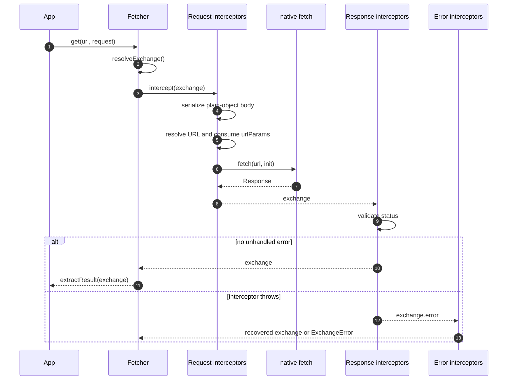

# Request Lifecycle

A Fetcher call creates one mutable `FetchExchange`. Request, response, and error interceptors read or update that exchange; the selected result extractor returns the final value.



## 1. Build the exchange

`get`, `post`, and the other HTTP helpers call `request()`. Client headers and timeout are merged with request values; request values win. The default result for HTTP helpers is the native `Response`.

## 2. Run request interceptors

Interceptors execute in ascending `order`. The built-in request order is:

1. `RequestBodyInterceptor` serializes a plain-object body as JSON.
2. `UrlResolveInterceptor` combines `baseURL`, the path template, path values, and query values. It then clears `urlParams`, so retrying the same exchange does not append them twice.
3. `FetchInterceptor` calls native `fetch` through timeout handling.

Custom interceptors choose an order relative to the exported built-in order constants. Interceptor names are unique within a registry; `use()` returns `false` for a duplicate name.

## 3. Validate the response

`ValidateStatusInterceptor` accepts `200 <= status < 300` by default. A rejected status throws `HttpStatusValidationError`, which retains the exchange.

## 4. Handle errors

If a request or response interceptor throws, error interceptors run in ascending order. An error interceptor recovers the exchange by clearing `exchange.error`. Recovery does not rerun response interceptors. If an error remains, Fetcher throws `ExchangeError`.

## 5. Extract the result

After the pipeline succeeds, `Fetcher.request()` invokes the configured `ResultExtractor`. HTTP methods select `ResponseResultExtractor`; lower-level `request()` selects the complete exchange unless overridden.

## Debug the pipeline

Inspect these fields together:

```ts
try {
  await api.get('/users/{id}', { urlParams: { path: { id: '42' } } });
} catch (error) {
  if (error instanceof ExchangeError) {
    console.error({
      request: error.exchange.request,
      response: error.exchange.response,
      cause: error.cause,
    });
  }
}
```

Source: [`InterceptorManager`](https://github.com/Ahoo-Wang/fetcher/blob/main/packages/fetcher/src/interceptorManager.ts), [`Fetcher`](https://github.com/Ahoo-Wang/fetcher/blob/main/packages/fetcher/src/fetcher.ts).
