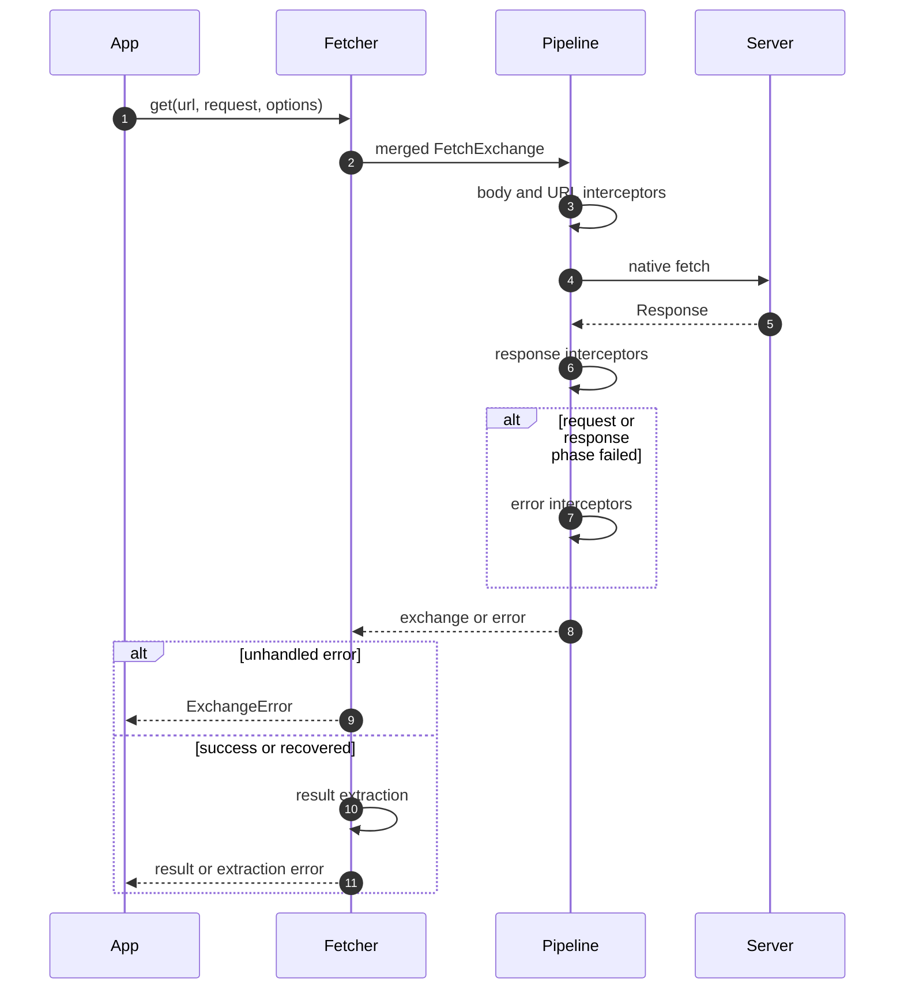

# Understand the request lifecycle

One call creates a mutable FetchExchange carrying request, response, attributes, and error. Interceptors share this context; result extraction turns it into the caller’s return value.

## Follow the phases

1. Fetcher merges client and request options. HTTP helpers select Response by default; request selects the exchange.
2. Request interceptors run in ascending order. The default pipeline serializes the body, resolves URL parameters, then calls native fetch.
3. Response interceptors apply policy, including default status validation.
4. If a request or response interceptor fails, error interceptors receive the failed exchange. Clearing the error recovers it without rerunning response interceptors.
5. An unhandled error becomes ExchangeError. Otherwise the selected extractor runs; extraction failures propagate outside that interceptor recovery path.

## Extend one responsibility

Use request interceptors to change outbound data, response interceptors to inspect policy, and error interceptors for explicit recovery. Choose order relative to exported constants. Interceptor names are unique within each registry; duplicate registration returns false. Keep response-body readers coordinated because the body is a stream.

URL resolution consumes urlParams after building the request URL. Reusing an exchange is therefore different from creating a fresh call. Any retry design must account for consumed request/response bodies and the operation’s server-side semantics.

See [Interceptor contracts](../reference/fetcher/interceptors.md) and [Result extractors](../reference/fetcher/results.md). The diagram’s controls let you expand and inspect the full sequence.
