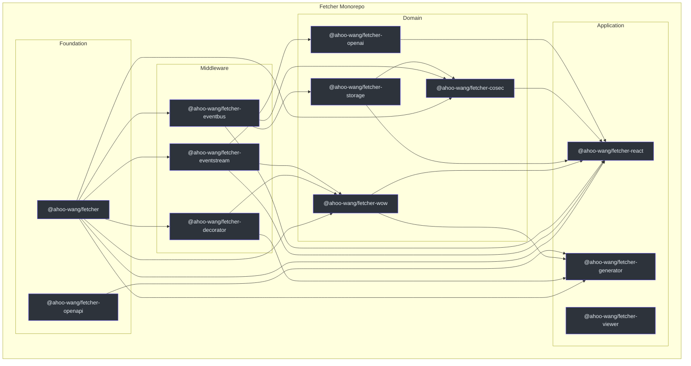
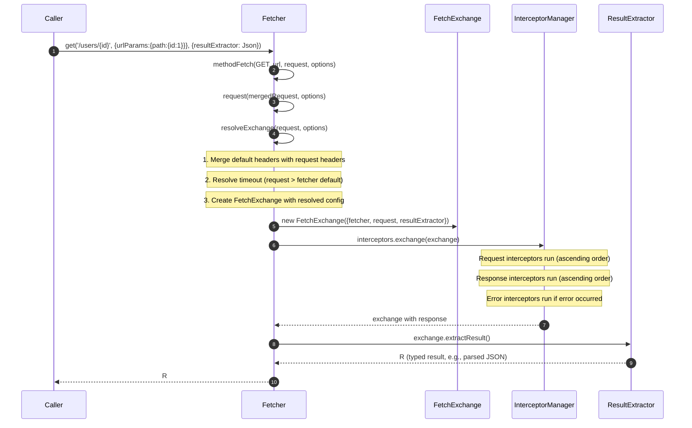
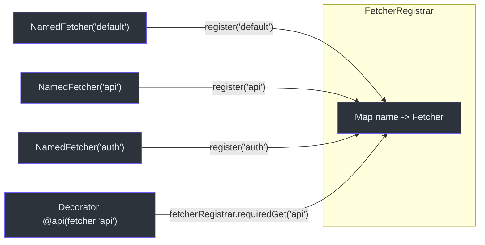
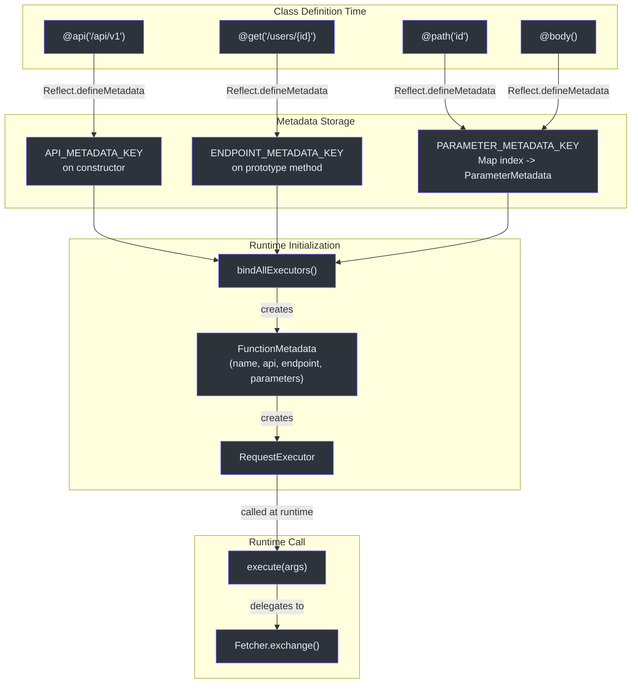
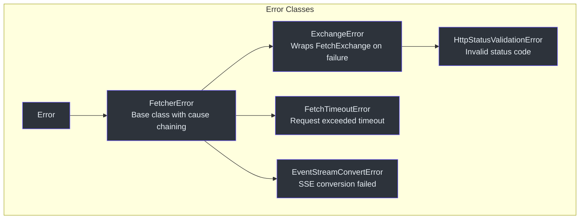

# Contributor Onboarding Guide

Welcome to the Fetcher project. This guide assumes you already know JavaScript and TypeScript and want to become productive in this codebase quickly. It covers the language and framework foundations the project relies on, the architectural patterns that tie it together, and the day-to-day workflows you will use.

---

## Part I -- Language and Framework Foundations

### TypeScript Strict Mode

Every package in this monorepo compiles under TypeScript strict mode. The root [tsconfig.json](https://github.com/Ahoo-Wang/fetcher/blob/main/tsconfig.json) enables `strict: true`, which activates `strictNullChecks`, `noImplicitAny`, `strictFunctionTypes`, and the rest of the strict family. If you come from a non-strict TypeScript background, expect the compiler to reject patterns you previously got away with.

Key compiler options you should understand:

| Option | Value | Why it matters |
|---|---|---|
| `strict` | `true` | All strict checks are on; no implicit `any`, no unchecked `null` |
| `experimentalDecorators` | `true` | Legacy (Stage 1) decorators for the `decorator` package |
| `emitDecoratorMetadata` | `true` | Emits `Reflect.metadata` for parameter type reflection |
| `target` | `ES2020` | Allows native `async`/`await`, optional chaining, nullish coalescing |
| `module` | `ESNext` | ESM output, aligned with `"type": "module"` in every `package.json` |
| `moduleResolution` | `bundler` | Modern bundler-aware resolution; no legacy `node` resolution quirks |
| `declaration` | `true` | Generates `.d.ts` type declaration files alongside JavaScript |
| `declarationMap` | `true` | Generates source maps for declarations; IDE "Go to Definition" jumps to `.ts` source |
| `sourceMap` | `true` | Generates `.js.map` files for debugging |
| `composite` | `true` | Enables project references for incremental builds |
| `jsx` | `react-jsx` | Uses the React 17+ JSX transform (no `import React` needed) |

**Source**: [tsconfig.json:8-21](https://github.com/Ahoo-Wang/fetcher/blob/main/tsconfig.json#L8-L21)

When you write code in this project, the compiler will enforce:
- No variables with implicit `any` type.
- No accessing properties that might be `undefined` without a null check.
- No assigning `null` to a non-nullable parameter.
- Consistent function return types (no accidental implicit returns).

If you see a type error you think is wrong, check whether your assumption about nullability is correct before suppressing the error.

### TypeScript Decorators (Legacy Stage 1)

The `@ahoo-wang/fetcher-decorator` package uses the **legacy (Stage 1)** decorator proposal, not the TC39 Stage 3 decorators now in TypeScript 5+. This is why `experimentalDecorators` and `emitDecoratorMetadata` are enabled in the root config.

Legacy decorators have three forms:

1. **Class decorators** -- receive the constructor and return a new constructor (or modify the existing prototype). The `@api(basePath, metadata)` decorator is a class decorator.

2. **Method decorators** -- receive the prototype, property key, and property descriptor. The `@get`, `@post`, `@put`, `@delete`, `@patch`, `@head`, `@options` decorators are method decorators.

3. **Parameter decorators** -- receive the prototype, property key, and parameter index. They do not return a value; they store metadata via `Reflect.defineMetadata`. The `@path`, `@query`, `@header`, `@body`, `@request`, `@attribute` decorators are parameter decorators.

In Fetcher, the `@api(basePath, metadata)` class decorator iterates over all prototype methods that have endpoint decorators and replaces their implementations with `RequestExecutor` instances at class-load time. This means the original method body (which typically throws `autoGeneratedError()`) is completely replaced.

**Source**: [packages/decorator/src/apiDecorator.ts:232-247](https://github.com/Ahoo-Wang/fetcher/blob/main/packages/decorator/src/apiDecorator.ts#L232-L247)

The key difference from Stage 3 decorators: legacy decorators receive the target object directly, while Stage 3 decorators receive a context object. This is a fundamental API difference that will require migration when the project moves to Stage 3.

### reflect-metadata

The `reflect-metadata` polyfill is a hard dependency of `@ahoo-wang/fetcher-decorator`. It provides `Reflect.defineMetadata` and `Reflect.getMetadata`, which the decorator system uses to attach and retrieve parameter metadata at runtime.

When you write `@path('id') userId: string`, the parameter decorator stores a `ParameterMetadata` entry keyed by `Symbol('parameter:metadata')` on the method's prototype. The `@api` class decorator later reads this metadata to build the `RequestExecutor`.

Here is the data flow:

1. At class definition time, `@path('id')` stores `{type: ParameterType.PATH, name: 'id', index: 0}` in metadata.
2. `@get('/users/{id}')` stores `{method: HttpMethod.GET, path: '/users/{id}'}` in metadata.
3. `@api('/api/v1')` reads both metadata sets, creates `FunctionMetadata`, and builds a `RequestExecutor` that replaces the method body.

**Source**: [packages/decorator/src/parameterDecorator.ts:199-228](https://github.com/Ahoo-Wang/fetcher/blob/main/packages/decorator/src/parameterDecorator.ts#L199-L228)

### The Fetch API

Fetcher wraps the browser-native `fetch()` function. You need to understand:

- `fetch(url, init)` returns `Promise<Response>`.
- `Response` is a one-shot stream; calling `.json()` or `.text()` consumes the body. You cannot read the body twice.
- `AbortController` / `signal` is the standard mechanism for request cancellation and timeout.
- `RequestInit` is the options object passed to `fetch()`; it includes `method`, `headers`, `body`, `signal`, `mode`, `credentials`, etc.
- The `body` parameter accepts `string`, `Blob`, `ArrayBuffer`, `FormData`, `URLSearchParams`, and `ReadableStream`, but NOT plain objects. Fetcher's `RequestBodyInterceptor` handles converting plain objects to JSON strings.

Fetcher never uses Axios, `XMLHttpRequest`, or any other HTTP transport. Every request ultimately calls `fetch()` inside the `FetchInterceptor`.

**Source**: [packages/fetcher/src/fetchInterceptor.ts:101-103](https://github.com/Ahoo-Wang/fetcher/blob/main/packages/fetcher/src/fetchInterceptor.ts#L101-L103)

### Server-Sent Events (SSE) and LLM Streaming

The `@ahoo-wang/fetcher-eventstream` package is a **side-effect module**. Importing it at the top level patches `Response.prototype` with four new methods:

- `eventStream()` -- returns a `ReadableStream<ServerSentEvent>` or `null` if the response is not an event stream.
- `requiredEventStream()` -- same but throws `EventStreamConvertError` if the response is not `text/event-stream`.
- `jsonEventStream<T>(terminateDetector?)` -- returns a `ReadableStream` of typed JSON SSE events with optional termination detection.
- `requiredJsonEventStream<T>(terminateDetector?)` -- same but throws if not an event stream.

This works because the module checks `typeof Response !== 'undefined'` and calls `Object.defineProperty` on `Response.prototype` at import time. Each property/method is guarded with `Object.prototype.hasOwnProperty.call` to prevent double-patching.

**Source**: [packages/eventstream/src/responses.ts:102-239](https://github.com/Ahoo-Wang/fetcher/blob/main/packages/eventstream/src/responses.ts#L102-L239)

The SSE parsing pipeline is a three-stage `ReadableStream` pipeline:

```text
Response.body (Uint8Array)
  -> TextDecoderStream (UTF-8 strings)
  -> TextLineTransformStream (individual lines)
  -> ServerSentEventTransformStream (structured SSE objects)
```

**Source**: [packages/eventstream/src/eventStreamConverter.ts:127-138](https://github.com/Ahoo-Wang/fetcher/blob/main/packages/eventstream/src/eventStreamConverter.ts#L127-L138)

The `TerminateDetector` callback in `jsonEventStream` is important for LLM streaming: OpenAI-compatible APIs send a `[DONE]` marker when the stream completes. You can detect this with:

```text
(event) => event.data === '[DONE]'
```

### React Hooks

The `@ahoo-wang/fetcher-react` package provides hooks that integrate with the Fetcher ecosystem. The core hook is `useExecutePromise`, which provides loading/result/error/status state management with automatic abort controller cleanup.

`useFetcher<R>` wraps `useExecutePromise` and adds Fetcher-specific behavior:
- It calls `fetcher.exchange()` inside the promise executor.
- It attaches `AbortController` to the request so the previous request is automatically cancelled when a new one starts.
- It tracks the `FetchExchange` object in React state, giving components access to the full request/response context.

`useQuery<Q, R>` adds query-parameter tracking on top: it manages a `query` state and automatically re-executes when the query changes (if `autoExecute` is true). This is useful for search-as-you-type patterns.

**Source**: [packages/react/src/fetcher/useFetcher.ts:162-226](https://github.com/Ahoo-Wang/fetcher/blob/main/packages/react/src/fetcher/useFetcher.ts#L162-L226)

**Source**: [packages/react/src/core/useQuery.ts:105-173](https://github.com/Ahoo-Wang/fetcher/blob/main/packages/react/src/core/useQuery.ts#L105-L173)

### EventBus

The `@ahoo-wang/fetcher-eventbus` package provides a type-safe event bus system with three implementations:

- **`SerialTypedEventBus`** -- handlers execute sequentially in priority order. Use when handler ordering matters (e.g., logging before analytics).
- **`ParallelTypedEventBus`** -- handlers execute concurrently. Use for performance when handlers are independent.
- **`BroadcastTypedEventBus`** -- uses `BroadcastChannel` API with `localStorage` fallback. Use for cross-tab communication.

The event bus is generic over event types, providing compile-time type safety for event payloads.

**Source**: [packages/eventbus/src/typedEventBus.ts](https://github.com/Ahoo-Wang/fetcher/blob/main/packages/eventbus/src/typedEventBus.ts)

### Storage

The `@ahoo-wang/fetcher-storage` package provides browser storage with cross-tab synchronization via the event bus. It includes:

- `InMemoryStorage` -- in-memory key-value store for testing.
- `KeyStorage` -- wraps `localStorage` with TTL support and serialization.
- Cross-tab sync via `BroadcastTypedEventBus`.

**Source**: [packages/storage/src/keyStorage.ts](https://github.com/Ahoo-Wang/fetcher/blob/main/packages/storage/src/keyStorage.ts)

### CoSec (Authentication)

The `@ahoo-wang/fetcher-cosec` package implements authentication as interceptors:

- **`AuthorizationRequestInterceptor`** -- attaches JWT tokens to request headers.
- **`AuthorizationResponseInterceptor`** -- handles 401 responses by refreshing tokens.
- **`CosecRequestInterceptor`** -- adds device ID and resource attribution headers.
- **`ForbiddenErrorInterceptor`** -- handles 403 responses.
- **`UnauthorizedErrorInterceptor`** -- handles 401 responses that cannot be refreshed.

The token lifecycle is managed by `JWTTokenManager` with configurable token storage and refresh strategies.

**Source**: [packages/cosec/src/authorizationRequestInterceptor.ts](https://github.com/Ahoo-Wang/fetcher/blob/main/packages/cosec/src/authorizationRequestInterceptor.ts)

### OpenAI Client

The `@ahoo-wang/fetcher-openai` package provides a type-safe OpenAI chat completions client built on the decorator system and eventstream. It supports:

- Chat completion requests with streaming.
- Token-by-token response delivery.
- Integration with the Wow framework for event-sourced AI interactions.

**Source**: [packages/openai/src/openai.ts](https://github.com/Ahoo-Wang/fetcher/blob/main/packages/openai/src/openai.ts)

### Wow (DDD/CQRS)

The `@ahoo-wang/fetcher-wow` package provides API clients for the [Wow](https://github.com/Ahoo-Wang/Wow) Domain-Driven Design framework. It includes:

- Command clients for sending domain commands.
- Query clients for reading aggregate state.
- Event-stream clients for subscribing to domain events.
- Support for both regular and event-streaming command patterns.

**Source**: [packages/wow/src/command](https://github.com/Ahoo-Wang/fetcher/blob/main/packages/wow/src/command)

### Generator (Code Generation)

The `@ahoo-wang/fetcher-generator` package is a CLI tool (`fetcher-generator`) that reads OpenAPI 3.x specifications (JSON, YAML, or URL) and generates:

- TypeScript interfaces and enums from schemas.
- Decorator-based API client classes.
- Wow CQRS-specific clients (command, event-stream).
- Index files for clean module organization.

It uses `ts-morph` for code generation, `commander` for CLI parsing, and `yaml` for YAML support.

**Source**: [packages/generator/src/cli.ts](https://github.com/Ahoo-Wang/fetcher/blob/main/packages/generator/src/cli.ts)

### Viewer (API Documentation)

The `@ahoo-wang/fetcher-viewer` package provides React + Ant Design components for building interactive API documentation viewers. It includes:

- Filter panel components for searching and filtering API endpoints.
- Table components with cell renderers for displaying API responses.
- Integration with Ant Design's theming system via Less.
- React Compiler support for automatic memoization.

**Source**: [packages/viewer/src/](https://github.com/Ahoo-Wang/fetcher/blob/main/packages/viewer/src/)

---

## Part II -- Fetcher Architecture

### Monorepo Structure

Fetcher is a pnpm workspace monorepo with 12 packages under `packages/` plus an `integration-test/` workspace. Dependency versions are centralized via the `catalog:` protocol in [pnpm-workspace.yaml](https://github.com/Ahoo-Wang/fetcher/blob/main/pnpm-workspace.yaml).

The `catalog:` protocol means that instead of each package specifying its own version of a dependency (e.g., `"vitest": "^4.1.5"`), they use `"vitest": "catalog:"` and the actual version is defined once in the workspace root file. This prevents version drift across packages.



### Package Dependency Graph (Table)

| Package | Depends on (internal) | Key purpose |
|---|---|---|
| `fetcher` | none | Core HTTP client, interceptor system |
| `openapi` | none | OpenAPI 3.x TypeScript type definitions |
| `decorator` | fetcher | Declarative API service classes via decorators |
| `eventstream` | fetcher | SSE support via side-effect `Response.prototype` patching |
| `eventbus` | fetcher | Type-safe event bus (serial, parallel, broadcast) |
| `openai` | fetcher, eventstream, decorator | OpenAI chat completions client |
| `wow` | fetcher, eventstream, decorator | Wow DDD/CQRS framework integration |
| `storage` | eventbus | Browser storage with cross-tab sync |
| `cosec` | fetcher, eventbus, storage | Authentication and authorization interceptors |
| `react` | fetcher, eventstream, eventbus, storage, wow, cosec | React hooks for data fetching |
| `viewer` | all above + antd | API documentation viewer components |
| `generator` | fetcher, eventstream, decorator, openapi, wow | OpenAPI-to-TypeScript code generator CLI |

### Core Pattern: The Interceptor Chain

The single most important pattern in Fetcher is the **interceptor chain**. Every HTTP request flows through three ordered registries managed by `InterceptorManager`:

```mermaid
sequenceDiagram
autonumber

    participant App as Application
    participant FM as InterceptorManager
    participant ReqReg as Request Registry
    participant BodyInt as RequestBodyInterceptor<br>order: MIN+10K
    participant UrlInt as UrlResolveInterceptor<br>order: MAX-20K
    participant FetchInt as FetchInterceptor<br>order: MAX-10K
    participant RespReg as Response Registry
    participant ValidInt as ValidateStatusInterceptor<br>order: MAX-10K
    participant ErrReg as Error Registry

    App->>FM: exchange(fetchExchange)
    FM->>ReqReg: intercept(fetchExchange)

    rect rgb(30, 40, 50)
        Note over ReqReg: Request Phase (ascending order)
        ReqReg->>BodyInt: intercept(exchange)
        Note over BodyInt: If body is plain object,<br>JSON.stringify it and set Content-Type
        BodyInt-->>ReqReg: exchange mutated
        ReqReg->>UrlInt: intercept(exchange)
        Note over UrlInt: Resolve URL: combineURLs(baseURL, url)<br>+ path params + query string
        UrlInt-->>ReqReg: exchange.request.url resolved
        ReqReg->>FetchInt: intercept(exchange)
        FetchInt->>FetchInt: timeoutFetch(request)
        Note over FetchInt: Race fetch() vs AbortController timeout
        FetchInt-->>ReqReg: exchange.response set
    end

    ReqReg-->>FM: request phase complete
    FM->>RespReg: intercept(fetchExchange)

    rect rgb(30, 40, 50)
        Note over RespReg: Response Phase (ascending order)
        RespReg->>ValidInt: intercept(exchange)
        Note over ValidInt: Check validateStatus(status)<br>Throw HttpStatusValidationError if invalid
        ValidInt-->>RespReg: status validated
    end

    RespReg-->>FM: response phase complete
    FM-->>App: exchange returned

```



Key implementation details:

- Interceptors implement the `Interceptor` interface with `name`, `order`, and `intercept(exchange)` properties.
- Interceptors are sorted by `order` in ascending order. Lower values run first.
- Built-in interceptors use `BUILT_IN_INTERCEPTOR_ORDER_STEP` (10,000) to space themselves apart, leaving room for custom interceptors between them.
- The `InterceptorRegistry` is itself an `Interceptor`, which enables recursive composition.
- Each interceptor receives the `FetchExchange` and mutates it in place. There is no return value requirement.
- If any interceptor throws, the error phase begins. Error interceptors can "fix" errors by clearing `exchange.error`.

**Source**: [packages/fetcher/src/interceptorManager.ts:191-211](https://github.com/Ahoo-Wang/fetcher/blob/main/packages/fetcher/src/interceptorManager.ts#L191-L211)

### Built-in Interceptor Order Values

Understanding the order values is critical for placing custom interceptors correctly:

| Interceptor | Phase | Order Value | Position |
|---|---|---|---|
| `RequestBodyInterceptor` | Request | `MIN_SAFE_INTEGER + 10,000` | First (earliest) |
| `UrlResolveInterceptor` | Request | `MAX_SAFE_INTEGER - 20,000` | Middle |
| `FetchInterceptor` | Request | `MAX_SAFE_INTEGER - 10,000` | Last (executes `fetch()`) |
| `ValidateStatusInterceptor` | Response | `MAX_SAFE_INTEGER - 10,000` | First (validates status) |

To insert a custom interceptor between `RequestBodyInterceptor` and `UrlResolveInterceptor`, pick an order value between `MIN_SAFE_INTEGER + 10,000` and `MAX_SAFE_INTEGER - 20,000`. For example, `order: 0` works fine.

**Source**: [packages/fetcher/src/requestBodyInterceptor.ts:29-30](https://github.com/Ahoo-Wang/fetcher/blob/main/packages/fetcher/src/requestBodyInterceptor.ts#L29-L30), [packages/fetcher/src/urlResolveInterceptor.ts:29-30](https://github.com/Ahoo-Wang/fetcher/blob/main/packages/fetcher/src/urlResolveInterceptor.ts#L29-L30)

### The FetchExchange Object

`FetchExchange` is the data container that flows through the entire interceptor chain. It carries:

- `fetcher` -- the `Fetcher` instance that initiated the request (gives access to `urlBuilder`, `headers`, `timeout`, etc.)
- `request` -- the `FetchRequest` containing `url`, `method`, `headers`, `body`, `urlParams`, `timeout`, `abortController`
- `response` -- the native `Response` object (set by `FetchInterceptor`, initially `undefined`)
- `error` -- any `Error` that occurred (set when an interceptor throws)
- `resultExtractor` -- function `(exchange) => R` that determines what `extractResult()` returns
- `attributes` -- a `Map<string, any>` for passing data between interceptors (e.g., trace IDs, timing data)

The exchange also provides convenience methods:
- `ensureRequestHeaders()` -- lazily initializes the headers object
- `ensureRequestUrlParams()` -- lazily initializes path and query parameter objects
- `hasError()` / `hasResponse()` -- boolean checks
- `requiredResponse` -- getter that throws `ExchangeError` if no response is available
- `extractResult<R>()` -- applies the result extractor and caches the result

**Source**: [packages/fetcher/src/fetchExchange.ts:105-286](https://github.com/Ahoo-Wang/fetcher/blob/main/packages/fetcher/src/fetchExchange.ts#L105-L286)

### The Request Lifecycle

A complete request through the Fetcher follows this sequence:



**Source**: [packages/fetcher/src/fetcher.ts:206-238](https://github.com/Ahoo-Wang/fetcher/blob/main/packages/fetcher/src/fetcher.ts#L206-L238)

### Named Fetcher Registry

The `FetcherRegistrar` is a global singleton that stores `Fetcher` instances by name. When you create a `NamedFetcher`, it automatically registers itself:



A default `NamedFetcher` is exported from the core package as `fetcher`:

```text
import { fetcher } from '@ahoo-wang/fetcher';
// This is a NamedFetcher registered with name 'default'
```

This pattern is central to how the decorator system resolves which fetcher to use for a given API service class. The `@api` decorator stores a fetcher name in its metadata; at runtime, `RequestExecutor` calls `getFetcher()` which resolves through the registrar.

**Source**: [packages/fetcher/src/namedFetcher.ts:38-89](https://github.com/Ahoo-Wang/fetcher/blob/main/packages/fetcher/src/namedFetcher.ts#L38-L89)

### The Decorator System

The decorator package transforms class methods into HTTP request executors. Here is how the pieces fit together:



**Source**: [packages/decorator/src/apiDecorator.ts:105-152](https://github.com/Ahoo-Wang/fetcher/blob/main/packages/decorator/src/apiDecorator.ts#L105-L152)

### Side-Effect Imports

The `@ahoo-wang/fetcher-eventstream` package is declared as a side-effect module. Its `package.json` does NOT set `"sideEffects": false` -- in fact, its entire purpose is to modify `Response.prototype` at import time. Simply writing `import '@ahoo-wang/fetcher-eventstream'` anywhere in your application activates SSE support globally.

This is powerful but requires awareness:
- Import order matters: the side-effect must run before any code that calls `.eventStream()`.
- Tree-shaking will not remove it: bundlers preserve side-effect imports.
- The module guards against double-patching with `Object.prototype.hasOwnProperty.call` checks.
- The side-effect only runs in environments where `typeof Response !== 'undefined'` (i.e., browsers, not Node.js without polyfills).

### Result Extractors

A `ResultExtractor` is a function `(exchange: FetchExchange) => R | Promise<R>` that determines what `fetcher.request()` and `fetcher.fetch()` return. The built-in extractors are:

| Extractor | Returns | Use Case |
|---|---|---|
| `ResultExtractors.Exchange` | The full `FetchExchange` object | When you need access to headers, timing, etc. |
| `ResultExtractors.Response` | The raw `Response` | When you need to stream the body or access response metadata |
| `ResultExtractors.Json` | `Promise<any>` (parsed JSON) | Most common for REST APIs |
| `ResultExtractors.Text` | `Promise<string>` | HTML or plain text responses |
| `ResultExtractors.Blob` | `Promise<Blob>` | File downloads |
| `ResultExtractors.ArrayBuffer` | `Promise<ArrayBuffer>` | Binary data processing |
| `ResultExtractors.Bytes` | `Promise<Uint8Array>` | Low-level byte manipulation |

**Source**: [packages/fetcher/src/resultExtractor.ts:131-160](https://github.com/Ahoo-Wang/fetcher/blob/main/packages/fetcher/src/resultExtractor.ts#L131-L160)

The default extractors differ by method:
- `fetcher.request()` defaults to `ResultExtractors.Exchange` (returns the full exchange).
- `fetcher.fetch()`, `fetcher.get()`, `fetcher.post()`, etc. default to `ResultExtractors.Response` (returns the raw `Response`).

### Error Hierarchy

Fetcher has a well-defined error hierarchy:



- `FetcherError` is the base; it supports error chaining via `cause`. It copies the stack trace from the cause if available.
- `ExchangeError` wraps a `FetchExchange` and is thrown when the interceptor chain encounters an unhandled error. It provides access to the full request/response context.
- `HttpStatusValidationError` extends `ExchangeError` when the response status code fails the `validateStatus` check (default: status >= 200 && status < 300).
- `FetchTimeoutError` extends `FetcherError` and includes the request that timed out.
- `EventStreamConvertError` extends `FetcherError` and includes the Response that failed to convert.

**Source**: [packages/fetcher/src/fetcherError.ts:37-106](https://github.com/Ahoo-Wang/fetcher/blob/main/packages/fetcher/src/fetcherError.ts#L37-L106)

### URL Building and Template Resolution

The `UrlBuilder` combines three tasks:
1. Combining `baseURL` with the request path via `combineURLs`
2. Resolving path parameters using a `UrlTemplateResolver`
3. Appending query parameters as a query string

Two template styles are supported:

| Style | Syntax | Example | Regex |
|---|---|---|---|
| `UrlTemplateStyle.UriTemplate` (default) | `{param}` | `/users/{id}` | `/{([^}]+)}/g` |
| `UrlTemplateStyle.Express` | `:param` | `/users/:id` | `/:[^/]+/g` |

Path parameters are URL-encoded automatically via `encodeURIComponent`. If a required path parameter is missing, the resolver throws `Error("Missing required path parameter: {name}")`.

**Source**: [packages/fetcher/src/urlTemplateResolver.ts:20-38](https://github.com/Ahoo-Wang/fetcher/blob/main/packages/fetcher/src/urlTemplateResolver.ts#L20-L38)

### Timeout Mechanism

The `timeoutFetch` function wraps the native `fetch()` with `AbortController`-based timeout:

1. If the request already has a `signal`, it delegates directly to `fetch()` (no timeout wrapping to avoid conflicts).
2. If no timeout is configured but an `abortController` is provided, it uses that controller's signal.
3. If a timeout is configured, it creates (or reuses) an `AbortController`, then races `fetch()` against a `setTimeout` that aborts the controller after the timeout period.
4. The timer is always cleaned up in a `finally` block to prevent resource leaks.

**Source**: [packages/fetcher/src/timeout.ts:120-172](https://github.com/Ahoo-Wang/fetcher/blob/main/packages/fetcher/src/timeout.ts#L120-L172)

### RequestBodyInterceptor Logic

The `RequestBodyInterceptor` handles automatic body serialization with these rules:

1. If `body` is `null` or `undefined`, do nothing.
2. If `body` is not an object (string, number, etc.), do nothing.
3. If `body` is a `Blob`, `File`, `FormData`, or `URLSearchParams`, remove the `Content-Type` header (the browser sets it automatically with the correct boundary).
4. If `body` is an `ArrayBuffer`, `TypedArray`, `DataView`, or `ReadableStream`, do nothing.
5. Otherwise (plain object), `JSON.stringify` the body and set `Content-Type: application/json`.

**Source**: [packages/fetcher/src/requestBodyInterceptor.ts:135-166](https://github.com/Ahoo-Wang/fetcher/blob/main/packages/fetcher/src/requestBodyInterceptor.ts#L135-L166)

### ValidateStatusInterceptor Logic

The `ValidateStatusInterceptor` runs in the response phase and validates the HTTP status code. By default, it accepts status codes 200-299 (2xx range). If validation fails, it throws `HttpStatusValidationError`.

Key behaviors:
- If `exchange.attributes.get(IGNORE_VALIDATE_STATUS) === true`, validation is skipped entirely. This is useful for endpoints that intentionally return non-2xx status codes (e.g., checking if a resource exists with a 404).
- If `exchange.response` is `undefined`, validation is skipped (the request failed before getting a response).
- The validation function is customizable per-Fetcher instance via the `validateStatus` option.

**Source**: [packages/fetcher/src/validateStatusInterceptor.ts:126-187](https://github.com/Ahoo-Wang/fetcher/blob/main/packages/fetcher/src/validateStatusInterceptor.ts#L126-L187)

### The Fetcher Class Methods

The `Fetcher` class exposes these public methods:

| Method | Returns | Notes |
|---|---|---|
| `fetch(url, request, options)` | `Promise<R>` | Primary entry point; defaults to `Response` return type |
| `get(url, request, options)` | `Promise<R>` | GET convenience; body is omitted from request type |
| `post(url, request, options)` | `Promise<R>` | POST convenience |
| `put(url, request, options)` | `Promise<R>` | PUT convenience |
| `delete(url, request, options)` | `Promise<R>` | DELETE convenience; body is omitted |
| `patch(url, request, options)` | `Promise<R>` | PATCH convenience |
| `head(url, request, options)` | `Promise<R>` | HEAD convenience; body is omitted |
| `options(url, request, options)` | `Promise<R>` | OPTIONS convenience; body is omitted |
| `trace(url, request, options)` | `Promise<R>` | TRACE convenience; body is omitted |
| `request(request, options)` | `Promise<R>` | Low-level method; request object must include `url` |
| `exchange(request, options)` | `Promise<FetchExchange>` | Returns the full exchange without extracting result |

**Source**: [packages/fetcher/src/fetcher.ts:123-501](https://github.com/Ahoo-Wang/fetcher/blob/main/packages/fetcher/src/fetcher.ts#L123-L501)

### FetchRequest and FetchRequestInit

`FetchRequestInit` is the options interface for individual requests. It extends the native `RequestInit` with Fetcher-specific properties:

| Property | Type | Purpose |
|---|---|---|
| `url` | `string` (required on `FetchRequest`) | The URL path for the request |
| `method` | `HttpMethod` | HTTP method (GET, POST, etc.) |
| `headers` | `RequestHeaders` | Custom headers to merge with defaults |
| `body` | `BodyInit \| Record<string, any> \| string \| null` | Request body (objects are auto-JSON-serialized) |
| `urlParams` | `UrlParams` | `{path: {...}, query: {...}}` for URL building |
| `timeout` | `number` | Request timeout in milliseconds (overrides fetcher default) |
| `abortController` | `AbortController` | Custom abort controller for cancellation |

**Source**: [packages/fetcher/src/fetchRequest.ts:112-183](https://github.com/Ahoo-Wang/fetcher/blob/main/packages/fetcher/src/fetchRequest.ts#L112-L183)

### Parameter Decorator Deep Dive

The parameter decorator system supports six parameter types. Here is how each one maps arguments to the HTTP request:

| Decorator | ParameterType | Where arg goes | Supports objects |
|---|---|---|---|
| `@path('name')` | `PATH` | `request.urlParams.path[name]` | Yes (expands keys) |
| `@query('name')` | `QUERY` | `request.urlParams.query[name]` | Yes (expands keys) |
| `@header('name')` | `HEADER` | `request.headers[name]` | Yes (expands keys) |
| `@body()` | `BODY` | `request.body` | N/A (entire value) |
| `@request()` | `REQUEST` | Merged into `FetchRequest` | N/A (entire object) |
| `@attribute('name')` | `ATTRIBUTE` | `attributes.set(name, value)` | Yes (expands keys or Map entries) |

When a name is not provided (empty string), the parameter name is automatically extracted from the TypeScript parameter name using `reflect-metadata`.

**Source**: [packages/decorator/src/parameterDecorator.ts:19-128](https://github.com/Ahoo-Wang/fetcher/blob/main/packages/decorator/src/parameterDecorator.ts#L19-L128)

### Package Build Configuration

Every package follows the same build configuration pattern:

| File | Purpose |
|---|---|
| `package.json` | Package metadata, scripts, dependencies with `catalog:` protocol |
| `vite.config.ts` | Vite build configuration with `unplugin-dts` |
| `tsconfig.json` | TypeScript config extending root |
| `src/index.ts` | Barrel export file that re-exports everything |
| `dist/` | Build output (ESM, UMD, types, source maps) |

The `exports` field in `package.json` defines both ESM and UMD entry points plus type definitions. This enables:
- `import { Fetcher } from '@ahoo-wang/fetcher'` (ESM)
- `const { Fetcher } = require('@ahoo-wang/fetcher')` (UMD/CJS)
- TypeScript resolution via `"types": "./dist/index.d.ts"`

### Integration Test Workspace

The `integration-test/` workspace is separate from the package tests. It:
- Requires all packages to be built first (`pnpm build`).
- Makes real HTTP requests to external APIs.
- Tests the full stack from fetcher through interceptors to response parsing.
- Has its own `package.json` with dependencies on all internal packages.

Run with:
```bash
pnpm test:it
```

---

## Part III -- Getting Productive

### Prerequisites

- **Node.js** >= 18.0.0
- **pnpm** 10.x (the exact version is pinned in `packageManager` field of the root `package.json`)

**Source**: [package.json:42-44](https://github.com/Ahoo-Wang/fetcher/blob/main/package.json#L42-L44)

### Setting Up the Workspace

```bash
# Clone the repository
git clone https://github.com/Ahoo-Wang/fetcher.git
cd fetcher

# Install all dependencies (uses catalog: protocol for version centralization)
pnpm install

# Build all packages (required before running integration tests)
pnpm build
```

### Build System

Each package uses Vite for building. The build produces three outputs:

| Output | Format | Path | Purpose |
|---|---|---|---|
| ESM | `es` | `dist/index.es.js` | Modern bundlers (Vite, webpack, Rollup) |
| UMD | `umd` | `dist/index.umd.js` | Legacy bundlers, script tags, Node.js CJS |
| Types | declaration | `dist/index.d.ts` | TypeScript type definitions |

Type declarations are generated by `unplugin-dts`. React-based packages (`viewer`, `react`) additionally use `@vitejs/plugin-react` with React Compiler and legacy decorator support.

**Source**: [packages/fetcher/vite.config.ts:17-38](https://github.com/Ahoo-Wang/fetcher/blob/main/packages/fetcher/vite.config.ts#L17-L38)

### Running Tests

```bash
# Run all unit tests across all packages
pnpm test:unit

# Run integration tests (requires built packages)
pnpm test:it

# Run tests for a single package
pnpm --filter @ahoo-wang/fetcher test

# Run a single test file
pnpm --filter @ahoo-wang/fetcher vitest run src/fetcher.test.ts
```

Testing conventions:
- **Vitest** is the test framework, with `@vitest/coverage-v8` for coverage.
- Vitest globals are enabled (`describe`, `it`, `expect`, `vi` available without import).
- Test files use `*.test.ts` or `*.test.tsx` naming and live alongside source files.
- ESLint ignores test files (`**/**.test.ts`).
- The `fetcher` package uses **MSW** (Mock Service Worker) for HTTP mocking.
- The `viewer` package runs tests in `jsdom` environment with `test/setup.ts`.
- Browser tests use `@vitest/browser` with Playwright (viewer package).

### Linting and Formatting

```bash
# Lint all packages
pnpm lint

# Format all files with Prettier
pnpm format
```

ESLint is configured with `typescript-eslint`. Key rules:
- `@typescript-eslint/no-explicit-any` is set to `warn` (not `error`).
- Integration tests and story files enforce `consistent-type-imports` with `prefer: "type-imports"`.
- Storybook files have additional ESLint rules from `eslint-plugin-storybook`.

**Source**: [eslint.config.js:22-51](https://github.com/Ahoo-Wang/fetcher/blob/main/eslint.config.js#L22-L51)

### Storybook

The project uses Storybook for interactive documentation of viewer and react components:

```bash
# Start Storybook dev server on port 6006
pnpm storybook

# Build static Storybook
pnpm build-storybook
```

Stories use the `*.stories.tsx` pattern and live in `stories/` subdirectories within each package.

### Version Management

All packages share the same version number. To update:

```bash
pnpm update-version <new-version>
```

This runs `scripts/update-all-versions.sh` which updates every `package.json` in the monorepo.

### Contributing Workflow

1. **Fork and clone** the repository.
2. **Create a branch** from `main`: `git checkout -b feature/your-feature`
3. **Make changes** in the relevant package under `packages/`.
4. **Write tests** alongside your source files (co-located `*.test.ts` files).
5. **Run tests**: `pnpm --filter @ahoo-wang/<package-name> test`
6. **Run lint**: `pnpm lint`
7. **Build**: `pnpm build`
8. **Commit** with a conventional message (the project uses standard commit conventions).
9. **Open a PR** against `main`.

All source files must include the Apache 2.0 license header. The license template is:

```text
/*
 * Copyright [2021-present] [ahoo wang <ahoowang@qq.com> (https://github.com/Ahoo-Wang)].
 * Licensed under the Apache License, Version 2.0 ...
 */
```

### Debugging Tips

- **Vitest UI**: Each package has a `test:ui` script that opens Vitest's browser UI for visual test debugging.
- **Bundle analysis**: Run `pnpm --filter @ahoo-wang/<package-name> analyze` to inspect bundle composition with `vite-bundle-analyzer`.
- **Integration tests**: Located in `integration-test/` workspace; they make real API calls and require the full build.
- **Storybook**: Use it for visual debugging of React components.
- **TypeScript errors**: If you see unexpected type errors, check that you have run `pnpm build` to generate the `.d.ts` files for dependencies.

### Common Contribution Patterns

#### Adding a New Interceptor

1. Create the interceptor class implementing `RequestInterceptor`, `ResponseInterceptor`, or `ErrorInterceptor`.
2. Choose an `order` value that positions it correctly relative to built-in interceptors.
3. Write tests using MSW to mock the HTTP layer.
4. If it should be built-in, register it in `InterceptorManager`. If custom, document how users should add it.

#### Adding a New Decorator

1. Create the decorator function in the `decorator` package.
2. Use `Reflect.defineMetadata` to store the metadata on the target.
3. Ensure the `@api` class decorator's `bindAllExecutors` function can read your new metadata.
4. Update `FunctionMetadata` if the new metadata needs to participate in request building.

#### Adding a New Package

1. Create the directory under `packages/`.
2. Add a `package.json` with `"type": "module"`, the correct `exports` field, and `catalog:` dependencies.
3. Add a `vite.config.ts` following the existing pattern.
4. Add a `tsconfig.json` extending the root config.
5. Add the package to the root `package.json` `workspaces` array (it is already included via `packages/*`).

---

## Part IV -- Practical Recipes

### Recipe: Writing a Custom Request Interceptor

Here is a step-by-step guide to adding a request interceptor that injects a correlation ID into every request:

**Step 1**: Create the interceptor class.

```text
// correlationIdInterceptor.ts
import type { RequestInterceptor, FetchExchange } from '@ahoo-wang/fetcher';

export class CorrelationIdInterceptor implements RequestInterceptor {
  readonly name = 'CorrelationIdInterceptor';
  readonly order = 500; // After RequestBodyInterceptor, before UrlResolveInterceptor

  intercept(exchange: FetchExchange) {
    const headers = exchange.ensureRequestHeaders();
    headers['X-Correlation-ID'] = crypto.randomUUID();
  }
}
```

**Step 2**: Register it on the fetcher instance.

```text
import { fetcher } from '@ahoo-wang/fetcher';
import { CorrelationIdInterceptor } from './correlationIdInterceptor';

fetcher.interceptors.request.use(new CorrelationIdInterceptor());
```

**Step 3**: Write a test using MSW.

```text
import { http, HttpResponse } from 'msw';
import { setupServer } from 'msw/node';
import { fetcher, ResultExtractors } from '@ahoo-wang/fetcher';

const server = setupServer(
  http.get('/api/test', ({ request }) => {
    const correlationId = request.headers.get('X-Correlation-ID');
    return HttpResponse.json({ correlationId });
  })
);

beforeAll(() => server.listen());
afterAll(() => server.close());

it('should include correlation ID in request headers', async () => {
  const result = await fetcher.get('/api/test', {}, {
    resultExtractor: ResultExtractors.Json
  });
  expect(result.correlationId).toBeDefined();
});
```

### Recipe: Using the Decorator System

Here is how to define and use a decorator-based API service:

**Step 1**: Define the service class.

```text
import { api, get, post, path, body, query } from '@ahoo-wang/fetcher-decorator';
import { autoGeneratedError } from '@ahoo-wang/fetcher-decorator';

interface User {
  id: string;
  name: string;
  email: string;
}

interface UserQuery {
  name?: string;
  limit?: number;
}

@api('/api/v1/users')
class UserService {
  @get('/')
  getUsers(@query() query: UserQuery): Promise<User[]> {
    throw autoGeneratedError();
  }

  @get('/{id}')
  getUser(@path('id') id: string): Promise<User> {
    throw autoGeneratedError();
  }

  @post('/')
  createUser(@body() user: Omit<User, 'id'>): Promise<User> {
    throw autoGeneratedError();
  }
}
```

**Step 2**: Use the service.

```text
const userService = new UserService();
const users = await userService.getUsers({ limit: 10 });
const user = await userService.getUser('123');
const newUser = await userService.createUser({ name: 'Jane', email: 'jane@example.com' });
```

**Step 3**: Customize the fetcher (optional).

```text
import { NamedFetcher } from '@ahoo-wang/fetcher';

// Create a fetcher with a different base URL
new NamedFetcher('users-api', {
  baseURL: 'https://users.example.com',
  timeout: 5000,
});

@api('/api/v1/users', { fetcher: 'users-api' })
class UserService {
  // ... same as above
}
```

### Recipe: Consuming SSE Streams

Here is how to consume Server-Sent Events with the eventstream package:

**Step 1**: Import the eventstream side-effect module (once, at app entry point).

```text
import '@ahoo-wang/fetcher-eventstream';
```

**Step 2**: Fetch an SSE endpoint and consume the stream.

```text
import { fetcher, ResultExtractors } from '@ahoo-wang/fetcher';

const response = await fetcher.get('/api/events', {}, {
  resultExtractor: ResultExtractors.Response
});

const eventStream = response.requiredEventStream();

for await (const event of eventStream) {
  console.log(`Event: ${event.event}, Data: ${event.data}`);
}
```

**Step 3**: For JSON-based LLM streaming.

```text
import '@ahoo-wang/fetcher-eventstream';

const response = await fetcher.post('/api/chat/completions', {
  body: { model: 'gpt-4', messages: [{ role: 'user', content: 'Hello' }] }
}, {
  resultExtractor: ResultExtractors.Response
});

const jsonStream = response.requiredJsonEventStream<{content: string}>(
  (event) => event.data === '[DONE]'
);

for await (const event of jsonStream) {
  process.stdout.write(event.data.content);
}
```

### Recipe: Building a React Component with useFetcher

Here is how to build a React component that fetches and displays data:

```text
import { useFetcher } from '@ahoo-wang/fetcher-react';
import { ResultExtractors } from '@ahoo-wang/fetcher';

interface User {
  id: string;
  name: string;
}

function UserProfile({ userId }: { userId: string }) {
  const { loading, result, error, execute } = useFetcher<User>({
    resultExtractor: ResultExtractors.Json,
  });

  const fetchUser = () => {
    execute({
      url: `/api/users/${userId}`,
      method: 'GET',
    });
  };

  return (
    <div>
      <button onClick={fetchUser} disabled={loading}>
        {loading ? 'Loading...' : 'Load User'}
      </button>
      {error && <p>Error: {error.message}</p>}
      {result && <p>Name: {result.name}</p>}
    </div>
  );
}
```

### Recipe: Implementing Retry with Error Interceptors

Here is how to implement a retry interceptor:

```text
import type { ErrorInterceptor, FetchExchange } from '@ahoo-wang/fetcher';

export class RetryInterceptor implements ErrorInterceptor {
  readonly name = 'RetryInterceptor';
  readonly order = 100;

  constructor(private maxRetries: number = 3) {}

  async intercept(exchange: FetchExchange) {
    if (!exchange.error) return;

    const retryCount = (exchange.attributes.get('retryCount') as number) || 0;
    if (retryCount >= this.maxRetries) return; // Give up

    // Mark this as a retry attempt
    exchange.attributes.set('retryCount', retryCount + 1);

    // Clear the error so the exchange can be retried
    exchange.error = undefined;

    // Re-execute the request through the interceptor chain
    await exchange.fetcher.interceptors.exchange(exchange);
  }
}
```

### Recipe: Using the Generator CLI

Here is how to generate TypeScript clients from an OpenAPI spec:

```bash
# Install the generator
pnpm --filter @ahoo-wang/fetcher-generator build

# Generate from a local file
npx fetcher-generator generate --input ./openapi.yaml --output ./generated

# Generate from a URL
npx fetcher-generator generate --input https://api.example.com/openapi.json --output ./generated

# Generate with Wow CQRS support
npx fetcher-generator generate --input ./wow-openapi.yaml --output ./generated --cqrs
```

The generator produces:
- TypeScript interfaces for all schemas.
- Decorator-based API client classes.
- Index files for clean imports.
- Optional Wow CQRS command/query clients.

---

## Glossary

| Term | Definition |
|---|---|
| **FetchExchange** | The data object that flows through the interceptor chain, carrying request, response, error, attributes, and the result extractor |
| **Interceptor** | A middleware component with `name`, `order`, and `intercept(exchange)` that processes requests/responses/errors |
| **InterceptorRegistry** | An ordered collection of interceptors of the same phase (request, response, or error) |
| **InterceptorManager** | The orchestrator that owns request, response, and error registries and runs them in sequence |
| **ResultExtractor** | A function `(exchange) => R` that determines the return type of a fetch operation |
| **NamedFetcher** | A `Fetcher` subclass that auto-registers with the global `FetcherRegistrar` on construction |
| **FetcherRegistrar** | A global singleton registry mapping string names to `Fetcher` instances |
| **UrlBuilder** | Combines baseURL, path template resolution, and query parameter appending |
| **UrlTemplateResolver** | Replaces `{param}` or `:param` placeholders in URLs with actual values |
| **Side-effect module** | A module that modifies global state (e.g., `Response.prototype`) simply by being imported |
| **catalog: protocol** | pnpm feature for centralizing dependency versions in `pnpm-workspace.yaml` |
| **FetchTimeoutError** | Error thrown when a request exceeds its configured timeout |
| **ExchangeError** | Error wrapping a `FetchExchange`, thrown when the interceptor chain encounters an unhandled error |
| **HttpStatusValidationError** | Error thrown when the response status code fails the `validateStatus` check |
| **autoGeneratedError()** | Placeholder function used in decorator method bodies; the decorator system replaces the method at runtime |
| **RequestExecutor** | Runtime class created by the `@api` decorator that executes HTTP requests using resolved metadata |
| **FunctionMetadata** | Aggregated metadata for a decorated method (endpoint config, parameter bindings, API config) |
| **EndpointReturnType** | Enum controlling whether a decorated method returns the exchange or the extracted result |
| **ExecuteLifeCycle** | Interface with `beforeExecute`/`afterExecute` hooks that a service class can implement |
| **ServerSentEvent** | Parsed SSE event object with `event`, `data`, `id`, and `retry` fields |
| **TerminateDetector** | Callback `(event) => boolean` that detects when an SSE stream should end (e.g., `[DONE]` marker) |

---

## Key File Reference

| File | Purpose |
|---|---|
| [packages/fetcher/src/fetcher.ts](https://github.com/Ahoo-Wang/fetcher/blob/main/packages/fetcher/src/fetcher.ts) | `Fetcher` class -- the core HTTP client with get/post/put/delete/patch/head/options/trace methods |
| [packages/fetcher/src/interceptor.ts](https://github.com/Ahoo-Wang/fetcher/blob/main/packages/fetcher/src/interceptor.ts) | `Interceptor`, `RequestInterceptor`, `ResponseInterceptor`, `ErrorInterceptor` interfaces and `InterceptorRegistry` class |
| [packages/fetcher/src/interceptorManager.ts](https://github.com/Ahoo-Wang/fetcher/blob/main/packages/fetcher/src/interceptorManager.ts) | `InterceptorManager` -- orchestrates request/response/error phases |
| [packages/fetcher/src/fetchExchange.ts](https://github.com/Ahoo-Wang/fetcher/blob/main/packages/fetcher/src/fetchExchange.ts) | `FetchExchange` -- the data carrier flowing through interceptors |
| [packages/fetcher/src/namedFetcher.ts](https://github.com/Ahoo-Wang/fetcher/blob/main/packages/fetcher/src/namedFetcher.ts) | `NamedFetcher` -- auto-registering fetcher subclass and default `fetcher` instance |
| [packages/fetcher/src/fetcherRegistrar.ts](https://github.com/Ahoo-Wang/fetcher/blob/main/packages/fetcher/src/fetcherRegistrar.ts) | `FetcherRegistrar` -- global named fetcher registry |
| [packages/fetcher/src/fetcherCapable.ts](https://github.com/Ahoo-Wang/fetcher/blob/main/packages/fetcher/src/fetcherCapable.ts) | `FetcherCapable` interface and `getFetcher()` resolver |
| [packages/fetcher/src/fetchInterceptor.ts](https://github.com/Ahoo-Wang/fetcher/blob/main/packages/fetcher/src/fetchInterceptor.ts) | `FetchInterceptor` -- the terminal request interceptor that calls `fetch()` |
| [packages/fetcher/src/requestBodyInterceptor.ts](https://github.com/Ahoo-Wang/fetcher/blob/main/packages/fetcher/src/requestBodyInterceptor.ts) | `RequestBodyInterceptor` -- auto-serializes object bodies to JSON |
| [packages/fetcher/src/urlResolveInterceptor.ts](https://github.com/Ahoo-Wang/fetcher/blob/main/packages/fetcher/src/urlResolveInterceptor.ts) | `UrlResolveInterceptor` -- resolves the final URL with path/query params |
| [packages/fetcher/src/validateStatusInterceptor.ts](https://github.com/Ahoo-Wang/fetcher/blob/main/packages/fetcher/src/validateStatusInterceptor.ts) | `ValidateStatusInterceptor` -- validates HTTP status codes |
| [packages/fetcher/src/resultExtractor.ts](https://github.com/Ahoo-Wang/fetcher/blob/main/packages/fetcher/src/resultExtractor.ts) | `ResultExtractors` -- built-in extractors (Json, Text, Blob, etc.) |
| [packages/fetcher/src/timeout.ts](https://github.com/Ahoo-Wang/fetcher/blob/main/packages/fetcher/src/timeout.ts) | `timeoutFetch` -- fetch wrapper with AbortController-based timeout and `FetchTimeoutError` |
| [packages/fetcher/src/urlBuilder.ts](https://github.com/Ahoo-Wang/fetcher/blob/main/packages/fetcher/src/urlBuilder.ts) | `UrlBuilder` -- combines baseURL, path params, and query params |
| [packages/fetcher/src/urlTemplateResolver.ts](https://github.com/Ahoo-Wang/fetcher/blob/main/packages/fetcher/src/urlTemplateResolver.ts) | `UriTemplateResolver` and `ExpressUrlTemplateResolver` |
| [packages/fetcher/src/fetcherError.ts](https://github.com/Ahoo-Wang/fetcher/blob/main/packages/fetcher/src/fetcherError.ts) | Error classes: `FetcherError`, `ExchangeError` |
| [packages/fetcher/src/fetchRequest.ts](https://github.com/Ahoo-Wang/fetcher/blob/main/packages/fetcher/src/fetchRequest.ts) | `FetchRequest`, `FetchRequestInit`, `HttpMethod`, `ContentTypeValues` |
| [packages/decorator/src/apiDecorator.ts](https://github.com/Ahoo-Wang/fetcher/blob/main/packages/decorator/src/apiDecorator.ts) | `@api` class decorator and `bindExecutor`/`bindAllExecutors` logic |
| [packages/decorator/src/endpointDecorator.ts](https://github.com/Ahoo-Wang/fetcher/blob/main/packages/decorator/src/endpointDecorator.ts) | `@get`, `@post`, `@put`, `@delete`, `@patch`, `@head`, `@options` |
| [packages/decorator/src/parameterDecorator.ts](https://github.com/Ahoo-Wang/fetcher/blob/main/packages/decorator/src/parameterDecorator.ts) | `@path`, `@query`, `@header`, `@body`, `@request`, `@attribute` and `ParameterType` enum |
| [packages/decorator/src/requestExecutor.ts](https://github.com/Ahoo-Wang/fetcher/blob/main/packages/decorator/src/requestExecutor.ts) | `RequestExecutor` -- executes the HTTP request using resolved metadata |
| [packages/decorator/src/functionMetadata.ts](https://github.com/Ahoo-Wang/fetcher/blob/main/packages/decorator/src/functionMetadata.ts) | `FunctionMetadata` -- aggregated metadata for a decorated method |
| [packages/decorator/src/generated.ts](https://github.com/Ahoo-Wang/fetcher/blob/main/packages/decorator/src/generated.ts) | `autoGeneratedError()` placeholder for unimplemented method bodies |
| [packages/eventstream/src/responses.ts](https://github.com/Ahoo-Wang/fetcher/blob/main/packages/eventstream/src/responses.ts) | Side-effect module that patches `Response.prototype` with `eventStream()`, `jsonEventStream()` |
| [packages/eventstream/src/eventStreamConverter.ts](https://github.com/Ahoo-Wang/fetcher/blob/main/packages/eventstream/src/eventStreamConverter.ts) | `toServerSentEventStream()` -- Response to SSE stream conversion pipeline |
| [packages/react/src/fetcher/useFetcher.ts](https://github.com/Ahoo-Wang/fetcher/blob/main/packages/react/src/fetcher/useFetcher.ts) | `useFetcher` hook -- manages fetch state with automatic abort |
| [packages/react/src/core/useQuery.ts](https://github.com/Ahoo-Wang/fetcher/blob/main/packages/react/src/core/useQuery.ts) | `useQuery` hook -- manages query state with auto-execute support |
| [pnpm-workspace.yaml](https://github.com/Ahoo-Wang/fetcher/blob/main/pnpm-workspace.yaml) | Workspace config with `catalog:` dependency versions |
| [tsconfig.json](https://github.com/Ahoo-Wang/fetcher/blob/main/tsconfig.json) | Root TypeScript configuration |
| [eslint.config.js](https://github.com/Ahoo-Wang/fetcher/blob/main/eslint.config.js) | ESLint flat config with typescript-eslint |
| [package.json](https://github.com/Ahoo-Wang/fetcher/blob/main/package.json) | Root scripts: build, test, lint, format, clean, storybook |

---

## Quick-Start Cheat Sheet

```bash
# Install everything
pnpm install

# Build all packages
pnpm build

# Run all unit tests
pnpm test:unit

# Test one package
pnpm --filter @ahoo-wang/fetcher test

# Test one file
pnpm --filter @ahoo-wang/fetcher vitest run src/fetcher.test.ts

# Lint
pnpm lint

# Format
pnpm format

# Clean
pnpm clean

# Storybook
pnpm storybook

# Bundle analysis for one package
pnpm --filter @ahoo-wang/fetcher analyze

# Update all package versions
pnpm update-version 3.17.0
```

---

## Common Pitfalls

### Pitfall 1: Forgetting to import the eventstream side-effect

The eventstream package only works if it is imported before any SSE response is processed. A common mistake is to call `response.eventStream()` without having imported the module.

```text
// WRONG: eventStream() will not exist on Response
const response = await fetcher.get('/api/events', {}, { resultExtractor: ResultExtractors.Response });
const stream = response.eventStream(); // TypeError: response.eventStream is not a function

// CORRECT: Import the side-effect module first
import '@ahoo-wang/fetcher-eventstream';
// Now response.eventStream() is available
```

### Pitfall 2: Wrong interceptor order placement

If your custom interceptor needs to run before the URL is resolved, it must have an order value less than `URL_RESOLVE_INTERCEPTOR_ORDER` (`MAX_SAFE_INTEGER - 20,000`). If it needs to run after body serialization, it must be greater than `REQUEST_BODY_INTERCEPTOR_ORDER` (`MIN_SAFE_INTEGER + 10,000`).

```text
// WRONG: Order 0 runs BEFORE RequestBodyInterceptor (which has order MIN+10K)
const interceptor = { name: 'MyInterceptor', order: 0, intercept(exchange) { ... } };

// CORRECT: Order 500 runs AFTER RequestBodyInterceptor but BEFORE UrlResolveInterceptor
const interceptor = { name: 'MyInterceptor', order: 500, intercept(exchange) { ... } };
```

### Pitfall 3: Reading the response body twice

The Fetch API's `Response` body is a one-shot stream. You cannot call `.json()` and then `.text()` on the same response. Fetcher caches the extracted result on the `FetchExchange`, so `exchange.extractResult()` will return the same cached value on subsequent calls.

### Pitfall 4: Not using catalog: for new dependencies

When adding a new dependency, always specify it with `catalog:` in the consuming package's `package.json` and add the actual version to `pnpm-workspace.yaml`. This ensures version consistency across the monorepo.

### Pitfall 5: Missing license header

All source files must include the Apache 2.0 license header. The CI may not catch this, but it is a project requirement. Copy the header from any existing file.

### Pitfall 6: Importing reflect-metadata multiple times

The `reflect-metadata` package should only be imported once per application. The decorator package imports it internally (`import 'reflect-metadata'`), so you should not need to import it separately unless you are working in a test environment that does not go through the decorator package.

---

## Architecture Decision Records (ADRs)

### ADR-001: Use Native Fetch Instead of Axios

**Status**: Accepted

**Context**: Fetcher needs an HTTP transport. Axios is the most popular choice but adds 13 KB and uses the deprecated XHR API for older browser support.

**Decision**: Use the native Fetch API directly.

**Consequences**:
- No support for Internet Explorer or very old browsers.
- Native `ReadableStream` support for SSE.
- No XHR fallback for environments without `fetch`.
- Timeout implemented via `AbortController` instead of Axios's built-in mechanism.

### ADR-002: Three-Phase Interceptor Model

**Status**: Accepted

**Context**: Most HTTP clients use two-phase interceptors (request and response). Error handling is typically done in catch blocks.

**Decision**: Add a third "error" phase to the interceptor chain.

**Consequences**:
- Error interceptors can recover from errors (retry, token refresh) without the caller knowing.
- More complex interceptor lifecycle to reason about.
- Enables patterns like circuit breaker and graceful degradation.

### ADR-003: Side-Effect Module for SSE

**Status**: Accepted

**Context**: SSE support requires adding methods to `Response.prototype`. The alternative is a wrapper function or interceptor.

**Decision**: Use a side-effect import that patches `Response.prototype` at import time.

**Consequences**:
- `response.eventStream()` is available globally after import.
- Import order matters; the side-effect must run before any SSE code.
- Cannot be tree-shaken away.
- Guard checks prevent double-patching.

### ADR-004: Legacy Decorators over Stage 3

**Status**: Accepted (with migration plan)

**Context**: TC39 Stage 3 decorators have different semantics than the legacy proposal. TypeScript supports both via configuration flags.

**Decision**: Use legacy decorators (Stage 1) for the decorator package.

**Consequences**:
- Requires `experimentalDecorators` and `emitDecoratorMetadata` in tsconfig.
- Dependency on `reflect-metadata` polyfill.
- Migration to Stage 3 decorators will require a major version bump.
- Code-gen path exists as an alternative that does not depend on decorators at runtime.

### ADR-005: Mutable Exchange Pattern

**Status**: Accepted

**Context**: Interceptors need to modify request/response data as it flows through the chain.

**Decision**: Pass a mutable `FetchExchange` object through the chain.

**Consequences**:
- Simple interceptor API (no return value required).
- Interceptors must be ordering-aware to avoid reading uninitialized properties.
- Result caching on the exchange prevents double body reads.
- Attributes map enables interceptor-to-interceptor communication.

---

## FAQ for Contributors

**Q: How do I add a new package to the monorepo?**
A: Create a directory under `packages/`, add `package.json` with `catalog:` dependencies, add `vite.config.ts` and `tsconfig.json` following existing patterns, and create `src/index.ts` as the barrel export. The `packages/*` glob in the workspace config will automatically include it.

**Q: How do I run just the tests I changed?**
A: Use `pnpm --filter @ahoo-wang/<package-name> test` to run all tests in one package. For a single file: `pnpm --filter @ahoo-wang/<package-name> vitest run src/myFile.test.ts`.

**Q: Why are test files excluded from ESLint?**
A: Test files use globals (`describe`, `it`, `expect`, `vi`) and patterns (mock objects, `any` types) that would trigger too many warnings. The ESLint config explicitly ignores `**/**.test.ts`.

**Q: How do I debug a failing test?**
A: Use the Vitest UI: `pnpm --filter @ahoo-wang/<package-name> test:ui`. This opens a browser-based test runner with visual diffs, coverage, and step-through debugging.

**Q: What if my change affects multiple packages?**
A: Build all packages first (`pnpm build`), then run tests for each affected package. The integration test workspace (`pnpm test:it`) will catch cross-package regressions.

**Q: How do I check bundle size impact?**
A: Run `pnpm --filter @ahoo-wang/<package-name> analyze` before and after your change. The analyzer opens a treemap visualization showing each module's contribution to the bundle.

**Q: Can I add a new external dependency?**
A: Yes, but follow the `catalog:` protocol. Add the version to `pnpm-workspace.yaml` under the `catalog:` section, then reference it as `"catalog:"` in the package's `package.json`. Discuss significant new dependencies in the PR description.

**Q: How does the storybook work?**
A: Each package can have a `stories/` directory with `*.stories.tsx` files. Run `pnpm storybook` from the root to start the Storybook dev server on port 6006. Stories serve as interactive documentation for components and behaviors.

**Q: What is the difference between `FetchRequestInit` and `FetchRequest`?**
A: `FetchRequestInit` is the options object (all fields optional except `body`). `FetchRequest` extends it with a required `url` field. The `fetcher.fetch()` method accepts `FetchRequestInit` and adds the `url` parameter separately; `fetcher.request()` accepts `FetchRequest` which includes the URL.

**Q: How do I handle request cancellation in tests?**
A: Use `AbortController` in tests just as you would in production. Create a controller, pass it in the request options, and call `controller.abort()` to simulate cancellation. MSW supports request interruption for testing.

**Q: What license header should I use?**
A: Copy the Apache 2.0 header from any existing file. The copyright line should read `Copyright [2021-present] [ahoo wang <ahoowang@qq.com> (https://github.com/Ahoo-Wang)]`.

**Q: How do I test error handling in interceptors?**
A: Create a mock fetcher with a failing interceptor by returning a rejected promise from the error phase. The `InterceptorManager` chains interceptors sequentially, so placing a test interceptor at `order: 0` in the error registry lets you intercept the failure before it propagates. Use `vi.spyOn(global, 'fetch')` to simulate network errors, and verify the exchange error state in the test assertion.

**Q: How do I understand the lifecycle of a request?**
A: A request flows through these stages:

1. `Fetcher.fetch()` creates a `FetchExchange` with URL, method, headers, and body.
2. `InterceptorManager.exchange()` runs request-phase interceptors in ascending order.
3. `FetchInterceptor` calls the native `fetch()` wrapped with timeout logic.
4. Response-phase interceptors run in descending order (highest order first).
5. If any phase throws, error-phase interceptors run in ascending order.
6. The configured `ResultExtractor` transforms the exchange into the return type.

**Q: How do I contribute to the wiki?**
A: The wiki is a VitePress site under `wiki/`. Install dependencies with `pnpm install` from the wiki directory, then run `pnpm dev` to start the local preview. Markdown files use standard VitePress conventions: frontmatter for `title` and `description`, Mermaid blocks for diagrams (handled by `vitepress-plugin-mermaid`), and standard Markdown for content.

**Q: How do I add a new interceptor to the built-in set?**
A: Create the interceptor class implementing the `Interceptor` interface in `packages/fetcher/src/`. Export it from `packages/fetcher/src/index.ts`. Then add it to the default interceptor chain in `packages/fetcher/src/interceptorManager.ts` by instantiating it in the constructor with an appropriate `order` value. Built-in interceptors use `BUILT_IN_INTERCEPTOR_ORDER_STEP` (10,000) spacing to allow user interceptors to slot between them.

**Q: What happens if I forget to export a new file from `index.ts`?**
A: The file will be bundled into the package (Vite processes all files in `src/`) but its exports will not be available to consumers. The build will not warn you. The symptom is a runtime error when another package tries to import the missing symbol. Always verify your exports by checking `dist/index.d.ts` after building.

**Q: How do I handle platform-specific code?**
A: Fetcher targets the browser's native Fetch API. Node.js-specific features (like `fs`, `path`, `crypto`) are not available. If you need platform-specific behavior, use dependency injection or the interceptor pattern -- inject the platform-specific implementation through options rather than importing platform APIs directly.

**Q: How do I write effective commit messages?**
A: Use conventional commit format: `type(scope): description`. Types include `feat`, `fix`, `refactor`, `test`, `docs`, `chore`. The scope is the package name (e.g., `fetcher`, `decorator`, `eventstream`). Examples: `feat(fetcher): add retry interceptor`, `fix(decorator): correct parameter order in @query`, `test(eventstream): add SSE parsing tests`.

**Q: How do I benchmark my changes?**
A: Use the bundle analyzer (`pnpm --filter @ahoo-wang/<package> analyze`) for size benchmarks. For runtime performance, write a Vitest benchmark using `vi.fn()` with timing. For latency-sensitive changes (like the interceptor chain), use `performance.now()` inside a test and assert the execution stays within acceptable bounds.

---

## Common Contribution Patterns

### Adding a New Interceptor

Interceptors are the most common type of contribution. Here is the standard pattern:

1. Create `packages/fetcher/src/myInterceptor.ts`.
2. Implement the `Interceptor` interface with a meaningful `order` value.
3. Write unit tests in `packages/fetcher/src/myInterceptor.test.ts`.
4. Export from `packages/fetcher/src/index.ts`.
5. If the interceptor should be built-in, add it to the default chain in `InterceptorManager`.

### Adding a New Result Extractor

Result extractors transform the exchange into a return type. To add one:

1. Define the extractor function in `packages/fetcher/src/resultExtractor.ts`.
2. The function signature is `(exchange: FetchExchange) => T`.
3. Add it to the `ResultExtractors` namespace object.
4. Write tests verifying it handles both success and error cases.

### Adding a New React Hook

React hooks live in `packages/react/src/`. The pattern is:

1. Create the hook file in the appropriate subdirectory (`fetcher/`, `core/`, `wow/`).
2. Follow the existing hook patterns: manage loading/error/data states.
3. Support request cancellation via `AbortController`.
4. Export from `packages/react/src/index.ts`.
5. Write tests using React Testing Library.

### Modifying URL Template Resolution

URL template resolution supports two styles. When modifying:

1. Changes to `UriTemplateResolver` must maintain RFC 6570 compliance.
2. Changes to `ExpressUrlTemplateResolver` must maintain Express.js `:param` syntax.
3. Test both styles with edge cases: empty params, special characters, nested braces.
4. Verify the `UrlTemplateStyle` enum correctly selects the resolver.

### Updating the OpenAPI Generator

The generator reads OpenAPI specs and produces TypeScript code. When modifying:

1. Test with both JSON and YAML input formats.
2. Verify generated code compiles by adding a snapshot test.
3. Handle edge cases: `allOf`, `oneOf`, `anyOf`, circular references, nullable types.
4. Update the `commander` CLI options if adding new generation modes.
5. Run `pnpm --filter @ahoo-wang/fetcher-generator test` to verify.

---

## Community and Communication

| Channel | Purpose |
|---|---|
| [GitHub Issues](https://github.com/Ahoo-Wang/fetcher/issues) | Bug reports, feature requests, and discussions |
| [GitHub Pull Requests](https://github.com/Ahoo-Wang/fetcher/pulls) | Code contributions and review |
| [GitHub Discussions](https://github.com/Ahoo-Wang/fetcher/discussions) | Questions, ideas, and community support |

When filing an issue, include:

- Fetcher version (from `package.json`).
- Browser and version.
- Minimal reproduction steps.
- Expected vs. actual behavior.
- Relevant error messages or console output.
