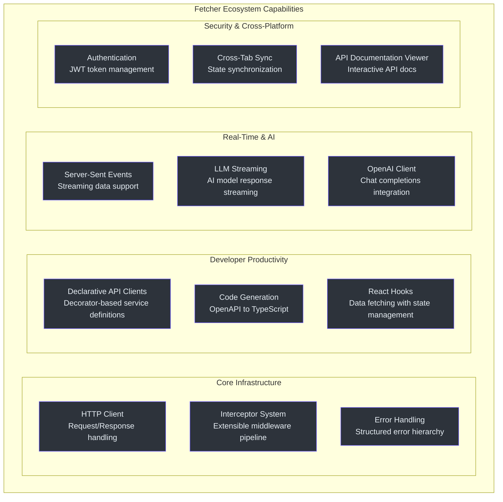
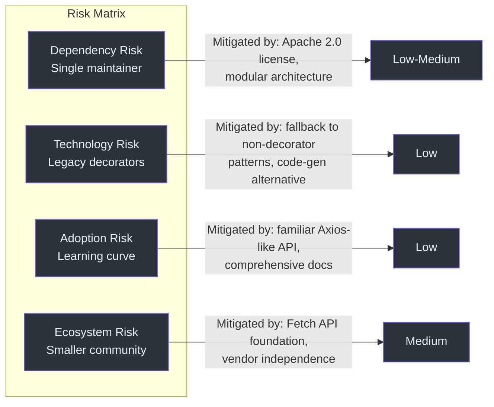
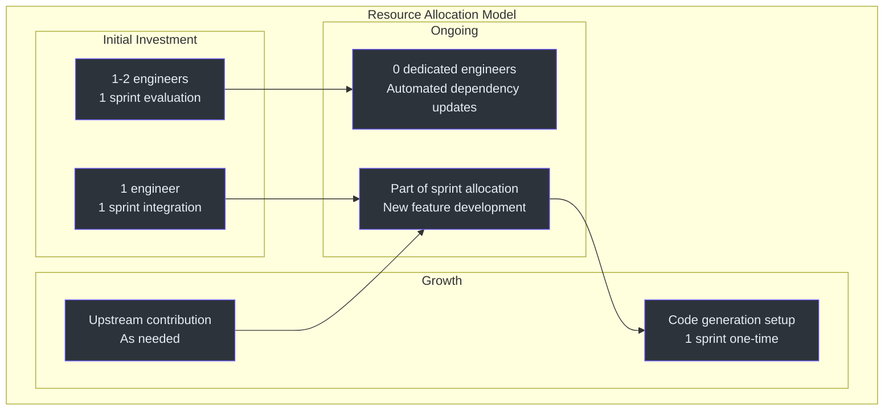

# Executive Onboarding Guide

This guide provides a strategic overview of Fetcher for engineering leadership. It covers what the platform delivers, the risks and tradeoffs involved, and the investment thesis that supports its continued development.

---

## What Is Fetcher?

Fetcher is an open-source HTTP client platform for web applications. It is not a single library but an **ecosystem of 12 modular packages** that together handle:

- Making HTTP requests to backend APIs
- Declaring API clients through configuration (rather than manual coding)
- Streaming real-time data from servers, including AI language model responses
- Authenticating users and managing security tokens
- Synchronizing state across browser tabs
- Generating client code from API specifications automatically

The platform is built on the browser's native networking capabilities and written in TypeScript. It is published under the Apache 2.0 license.

---

## Capability Map

| Capability | Package | Business Value |
|---|---|---|
| Core HTTP client | `@ahoo-wang/fetcher` | 3 KB replacement for 13+ KB alternatives; reduced bundle size across all applications |
| Declarative API clients | `@ahoo-wang/fetcher-decorator` | Reduced boilerplate; developers define APIs in configuration, not manual code |
| Code generation | `@ahoo-wang/fetcher-generator` | Automated TypeScript client generation from OpenAPI specs; eliminates hand-written API layers |
| Real-time streaming | `@ahoo-wang/fetcher-eventstream` | Server-Sent Events support; enables live dashboards, notifications, AI response streaming |
| AI integration | `@ahoo-wang/fetcher-openai` | Native OpenAI chat completions with streaming; critical for AI product features |
| DDD/CQRS support | `@ahoo-wang/fetcher-wow` | First-class support for Domain-Driven Design patterns; enables event-sourcing architectures |
| Authentication | `@ahoo-wang/fetcher-cosec` | JWT token lifecycle management; automatic token refresh; authorization headers |
| Cross-tab state | `@ahoo-wang/fetcher-storage` + `eventbus` | Browser storage with cross-tab synchronization; multi-tab consistency |
| React integration | `@ahoo-wang/fetcher-react` | React hooks for data fetching; loading/error/success states; automatic abort |
| API viewer | `@ahoo-wang/fetcher-viewer` | Interactive API documentation components; internal developer portals |

---

## Technology Investment Thesis

### Market Position

The JavaScript HTTP client market is dominated by Axios (~100M weekly downloads) and the native Fetch API. Fetcher positions itself in the gap between the two: offering Axios-level developer experience (interceptors, base URLs, timeouts) while building entirely on the native platform, achieving a fraction of the bundle size.

### Strategic Value Proposition

1. **Bundle size reduction**: At 3 KB (core), Fetcher is 77% smaller than Axios. For teams shipping multiple web applications, the aggregate bandwidth savings are significant.

2. **AI-native architecture**: Fetcher was designed with LLM streaming as a first-class concern. As AI features become standard in web applications, teams using Fetcher have a native path to streaming AI responses without additional libraries.

3. **Full-stack type safety**: The OpenAPI generator produces TypeScript clients directly from API specifications, enabling end-to-end type safety from backend API definitions to frontend consumption.

4. **Composable security**: Authentication is implemented as interceptors, not as a separate layer. This means security policies are modular, testable, and can be composed per-application or per-service.

---

## Risk Assessment

### Dependency Risk

| Factor | Assessment | Mitigation |
|---|---|---|
| Bus factor | Primary maintainer is a single developer (Ahoo-Wang) | Apache 2.0 license ensures code is forkable; modular architecture means individual packages can be replaced |
| Platform dependency | Built on native Fetch API (browser standard) | Fetch API is a W3C standard with universal browser support; no vendor lock-in |
| Build tooling | Vite + Vitest ecosystem | These are mainstream tools with large communities |
| Decorator dependency | Uses legacy (Stage 1) TypeScript decorators | Alternative code-gen path exists; migration plan needed for TC39 Stage 3 decorators |

### Maintenance Burden

| Aspect | Current State |
|---|---|
| Version alignment | All 12 packages share a single version (currently 3.16.4), managed by `pnpm update-version` |
| Test coverage | Per-package `vitest run --coverage` with `@vitest/coverage-v8` |
| Dependency updates | Automated via Renovate ([renovate.json](https://github.com/Ahoo-Wang/fetcher/blob/main/renovate.json)) |
| CI/CD | GitHub Actions with automated build, test, and coverage reporting (Codecov) |
| Documentation | Dual-language (English + Chinese) READMEs; interactive Storybook; wiki site |

### Adoption Curve

| Phase | Effort | Outcome |
|---|---|---|
| Drop-in HTTP client | Low (hours) | Use `@ahoo-wang/fetcher` as a direct `fetch()` wrapper; Axios-like API |
| Interceptor customization | Low-Medium (days) | Add auth, logging, retry interceptors |
| Declarative API clients | Medium (days-weeks) | Adopt `@ahoo-wang/fetcher-decorator` for service definitions |
| Full ecosystem | Medium-High (weeks) | Integrate eventstream, cosec, storage, react hooks |
| Code generation | Medium (days) | Set up OpenAPI-to-TypeScript pipeline with `@ahoo-wang/fetcher-generator` |

---

## Cost and Scaling Model

### Team Skill Requirements

| Skill Level | What They Can Do |
|---|---|
| Junior developer | Use pre-configured fetcher instances; call API methods defined by decorators |
| Mid-level developer | Define new API service classes with decorators; write custom interceptors |
| Senior developer | Design interceptor chains; implement auth flows; set up code generation pipelines |
| Staff developer | Architect cross-cutting concerns; evaluate package tradeoffs; contribute upstream |

### Resource Model

---

## Competitive Landscape

| Dimension | Fetcher | Axios | SWR/React Query | Ky |
|---|---|---|---|---|
| Bundle size | ~3 KB | ~13 KB | ~6-45 KB | ~3 KB |
| Platform | Fetch API | XHR + Fetch | Fetch API (via lib) | Fetch API |
| Interceptor model | 3-phase (req/resp/error) | 2-phase (req/resp) | Middleware hooks | Hooks |
| TypeScript native | Yes | Partial | Yes | Yes |
| SSE/LLM streaming | Built-in | No | No | No |
| Decorator-based APIs | Yes | No | No | No |
| OpenAPI code gen | Yes | No | No | No |
| Auth management | Yes (CoSec) | No | No | No |
| Cross-tab sync | Yes | No | No | No |
| Community size | Small | Very large | Large | Medium |

---

## Actionable Recommendations

### For Teams Starting a New Frontend Project

1. **Evaluate Fetcher as the default HTTP client**. The 3 KB core package is a drop-in replacement for manual `fetch()` calls with Axios-like ergonomics.
2. **Set up the OpenAPI generator early**. If your backend exposes OpenAPI specs, the generator eliminates an entire category of hand-written API code.
3. **Adopt the React hooks package** if building with React. `useFetcher` and `useQuery` provide battle-tested patterns for loading states, error handling, and request cancellation.

### For Teams with Existing Axios Code

1. **Migrate incrementally**. The core `Fetcher` class has the same conceptual model as Axios (interceptors, base URLs, headers, timeouts). Migration can be done service-by-service.
2. **Start with the core package**. No need to adopt the decorator system immediately. Use `fetcher.get()`, `fetcher.post()` directly.
3. **Evaluate the SSE streaming package** if your application consumes real-time data or AI model responses. This is Fetcher's strongest differentiator.

### For Teams Building AI-Powered Features

1. **Adopt `@ahoo-wang/fetcher-eventstream`** for SSE-based LLM response streaming.
2. **Consider `@ahoo-wang/fetcher-openai`** for OpenAI chat completions with native streaming support.
3. **Use the React hooks** to bind streaming responses to UI components with automatic cleanup.

### For Platform/Infrastructure Teams

1. **Evaluate CoSec** for centralized auth interceptor management across applications.
2. **Use the EventBus and Storage packages** for cross-tab state synchronization in multi-tab applications.
3. **Contribute upstream** if adopting at scale -- the project welcomes contributions under Apache 2.0.

---

## Key Metrics to Track

| Metric | How to Measure | Target |
|---|---|---|
| Bundle size impact | Compare before/after with bundle analyzer | Net reduction vs. current HTTP client |
| Developer velocity | Time to implement new API integration | Measurable reduction with decorator system and code gen |
| Type safety incidents | Runtime type errors from API responses | Reduction through end-to-end TypeScript coverage |
| Streaming reliability | SSE connection stability for AI features | Reliable token-by-token delivery |
| Auth token management | Manual token handling code removed | Elimination of custom auth code through CoSec interceptors |
| Test coverage | Per-package coverage reports | Maintain or improve coverage as adoption grows |
| Incident rate | Production HTTP-related incidents | Reduction through structured error handling and status validation |

---

## Implementation Roadmap

### Phase 1: Foundation (Weeks 1-2)

| Activity | Owner | Deliverable |
|---|---|---|
| Install core `@ahoo-wang/fetcher` package | Frontend team | Package added to project |
| Replace manual `fetch()` calls with `fetcher.get()` / `fetcher.post()` | Frontend developers | Incremental migration of API calls |
| Configure base URL and default headers | Frontend lead | Shared fetcher configuration |
| Set up unit tests with Vitest | QA/Dev team | Test infrastructure for HTTP layer |

### Phase 2: Productivity (Weeks 3-4)

| Activity | Owner | Deliverable |
|---|---|---|
| Adopt `@ahoo-wang/fetcher-decorator` for new API services | Frontend team | Decorator-based API classes |
| Set up `@ahoo-wang/fetcher-generator` with backend OpenAPI specs | Platform team | Automated code generation pipeline |
| Integrate React hooks (`useFetcher`, `useQuery`) | Frontend developers | Replaced ad-hoc data fetching patterns |

### Phase 3: Advanced Features (Weeks 5-8)

| Activity | Owner | Deliverable |
|---|---|---|
| Integrate `@ahoo-wang/fetcher-eventstream` for SSE | Frontend team | Real-time data streaming capability |
| Adopt `@ahoo-wang/fetcher-cosec` for auth management | Security + Frontend | Centralized token lifecycle |
| Set up cross-tab synchronization | Frontend team | Multi-tab state consistency |
| Evaluate OpenAI client for AI features | Product + Frontend | AI feature readiness |

### Phase 4: Optimization (Ongoing)

| Activity | Owner | Deliverable |
|---|---|---|
| Monitor bundle size with analyzer | DevOps | Bundle size regression detection |
| Contribute upstream improvements | Senior developers | Community engagement |
| Document team conventions and patterns | Tech leads | Internal knowledge base |

---

## Governance Considerations

### Open Source License

Fetcher is licensed under Apache 2.0, which:
- Allows commercial use without restriction.
- Requires attribution (license notice in distributions).
- Does not require derivative works to be open-sourced.
- Provides patent grant protection.

### Security Posture

| Security Aspect | Status |
|---|---|
| Dependency scanning | Renovate automated updates |
| License compliance | Apache 2.0 (permissive) |
| Known vulnerabilities | Addressed via automated dependency updates |
| Token handling | CoSec provides structured JWT lifecycle management |
| Transport security | Delegates to browser's native Fetch API (uses TLS) |

### Support Model

| Level | Source | Response Time |
|---|---|---|
| Community support | GitHub Issues | Variable (community-driven) |
| Documentation | Wiki, Storybook, README | Self-service |
| Enterprise support | Not currently available | N/A |
| Fork/maintain | Apache 2.0 permits forking | Team-controlled |

For teams requiring guaranteed SLAs, the Apache 2.0 license allows the team to fork the repository and maintain an internal version. The modular architecture means individual packages can be replaced if needed without affecting the rest of the ecosystem.

---

## Success Criteria

### Short-Term (30 days)

| Criterion | Measurement |
|---|---|
| Core package integrated | `@ahoo-wang/fetcher` installed and used for at least 5 API calls |
| Developer onboarding complete | All frontend developers have completed the contributor onboarding guide |
| Test infrastructure working | Unit tests passing with coverage above 80% for HTTP layer |

### Medium-Term (90 days)

| Criterion | Measurement |
|---|---|
| Declarative API adoption | At least 50% of new API services use decorator-based definitions |
| Code generation pipeline | OpenAPI generator running in CI, producing TypeScript clients from backend specs |
| Authentication centralized | CoSec managing tokens for all authenticated API calls |

### Long-Term (180 days)

| Criterion | Measurement |
|---|---|
| Bundle size reduction | Measurable reduction in total HTTP client bundle size vs. baseline |
| Developer velocity improvement | Time to implement new API integration reduced by at least 30% |
| AI feature readiness | At least one streaming AI feature in production using eventstream |
| Zero manual token handling | All authentication handled by CoSec interceptors; no manual token code |

---

## Risk Mitigation Checklist

- [ ] Identify a second team member who understands the Fetcher architecture (reduce bus factor).
- [ ] Document the team's interceptor conventions and naming patterns.
- [ ] Set up bundle size monitoring to catch regressions early.
- [ ] Establish a process for evaluating major version updates.
- [ ] Plan for TC39 Stage 3 decorator migration (timeline: when TypeScript stabilizes support).
- [ ] Evaluate need for response caching if using SWR/React Query alongside Fetcher.

---

## Further Reading

| Resource | Description |
|---|---|
| [Contributor Onboarding Guide](./contributor.md) | Hands-on guide for developers joining the Fetcher codebase |
| [Staff Engineer Onboarding Guide](./staff-engineer.md) | Deep architectural analysis and design tradeoff documentation |
| [Product Manager Onboarding Guide](./product-manager.md) | Non-technical feature overview and adoption framework |
| [Fetcher GitHub Repository](https://github.com/Ahoo-Wang/fetcher) | Source code, issues, and contribution guidelines |
| [npm Packages](https://www.npmjs.com/search?q=%40ahoo-wang%2Ffetcher) | Published packages on the npm registry |

---

## Document Revision History

| Date | Version | Changes |
|---|---|---|
| 2026-05 | 1.0 | Initial executive onboarding guide |
