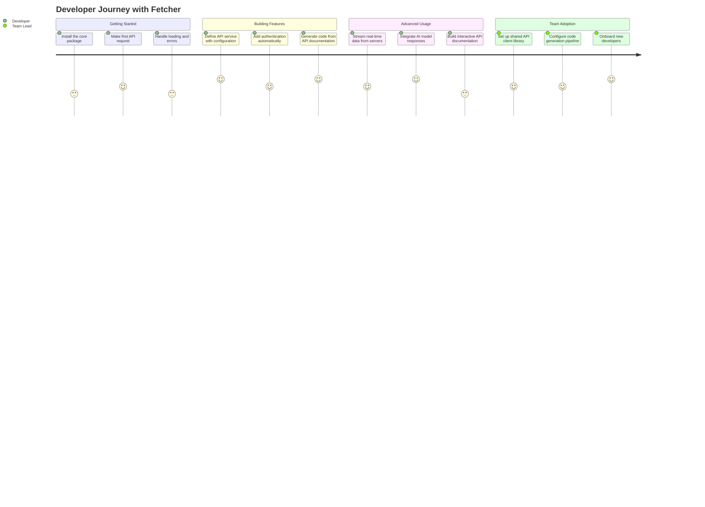
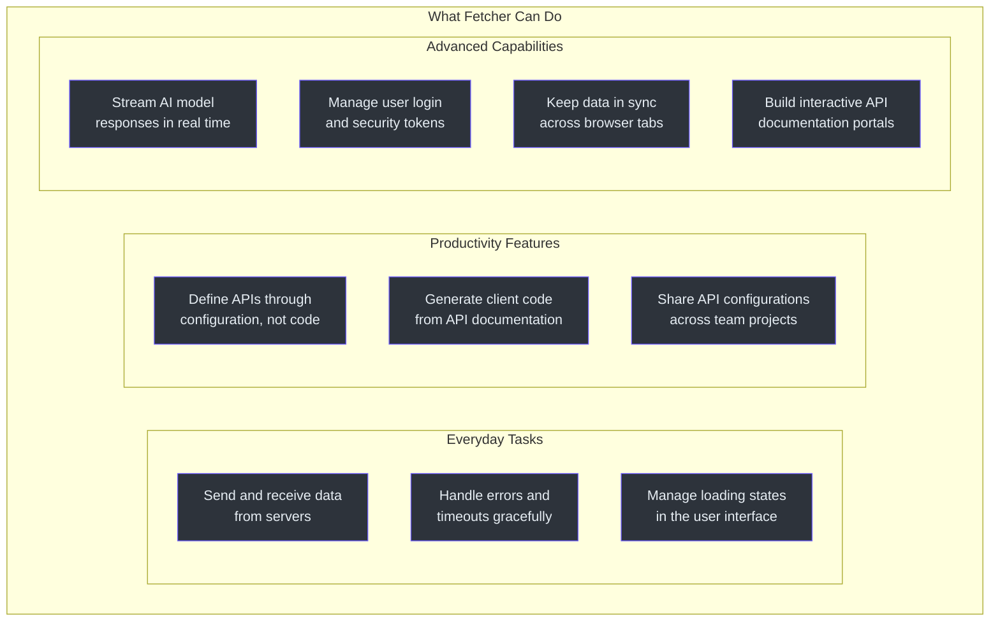
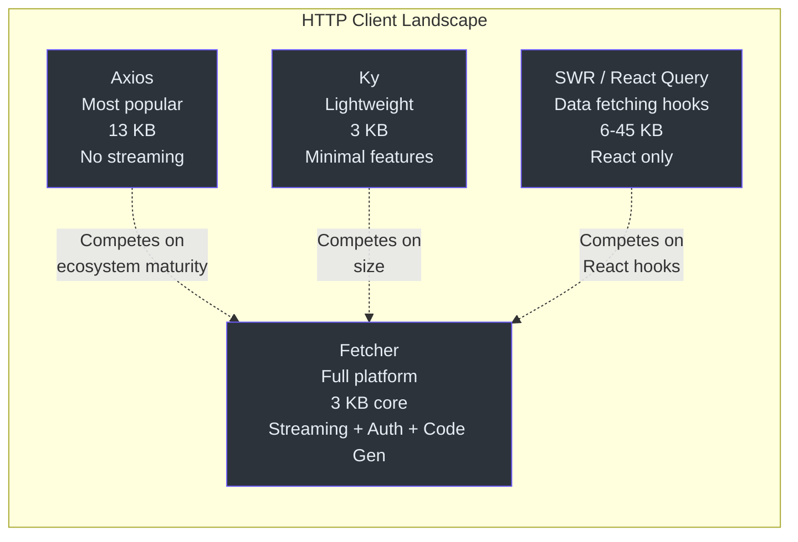

# Product Manager Onboarding Guide

This guide explains Fetcher in plain language, without engineering jargon. It is written for product managers, program managers, and non-engineering stakeholders who need to understand what Fetcher does, what it enables, and where it has limits.

---

## What Fetcher Does

Every web application needs to communicate with servers. When a user clicks "Load Profile," the application sends a request to the server and receives the profile data back. Fetcher is the software that handles this communication.

Think of it as a **universal translator between web applications and servers**. It takes care of:

- Sending requests to the right address
- Handling errors when servers are unreachable
- Managing login credentials automatically
- Streaming data in real time (like chat responses from AI)
- Keeping data in sync when users have multiple browser tabs open

Fetcher is not a single product -- it is a **platform of 12 connected tools** that work together. An engineering team can use just the parts they need.

---

## How Developers Use Fetcher

### The Developer Journey

### Step 1: Making API Requests

The most basic use of Fetcher is sending and receiving data from servers. Developers write simple commands like "get the user profile" or "save the order," and Fetcher handles all the technical details.

### Step 2: Defining API Services

Instead of writing the same request code over and over, developers can describe their APIs in a structured way. For example, they define "this is a user service that lives at this address and supports these operations." Fetcher automatically creates the working code from that description.

### Step 3: Automatic Code Generation

When the backend team publishes an API documentation (using the industry-standard OpenAPI format), Fetcher can automatically generate all the frontend code needed to talk to that API. This eliminates an entire category of manual work.

### Step 4: Real-Time Features

For features that need live updates -- chat interfaces, live dashboards, AI assistant responses -- Fetcher provides built-in support for streaming data. Developers do not need to learn or integrate additional tools.

---

## Feature Capability Map

| Feature Category | What It Does | Who Benefits |
|---|---|---|
| API Communication | Sends requests to servers and processes responses | Every developer on the team |
| Error Handling | Automatically catches and reports failures | End users (better error messages) |
| Loading States | Tracks when data is being loaded, succeeded, or failed | UI developers, product designers |
| API Definitions | Describes APIs in configuration instead of writing code manually | Developers (reduced work), project managers (faster delivery) |
| Code Generation | Creates working code from API documentation automatically | Development teams (eliminates manual coding) |
| AI Streaming | Streams responses from AI models (ChatGPT, Claude, etc.) token by token | Product teams building AI features |
| Authentication | Manages login tokens and refreshes them automatically | Security teams, developers |
| Cross-Tab Sync | Keeps data consistent when users open multiple tabs | End users (consistent experience) |
| API Documentation | Provides interactive components to explore and test APIs | Developer experience teams |

---

## How Fetcher Compares

### Against the Main Alternatives

| Need | Without Fetcher | With Fetcher |
|---|---|---|
| Make an API request | Write 15-30 lines of error-handling code | Write 1-2 lines |
| Add authentication to all requests | Manually add login tokens to every request | Configure once; applies everywhere automatically |
| Stream an AI response | Integrate a separate streaming library | Built-in; one import activates it |
| Generate API client code | Use a separate code generation tool or write by hand | Built-in generator reads API documentation and creates code |
| Handle multiple API servers | Configure each server connection separately | Named server registry; configure once, reference by name |
| Keep tabs in sync | Build custom synchronization logic | Built-in cross-tab communication |

### Market Context

Fetcher's unique position: it is the only HTTP client platform that combines a small core footprint with built-in AI streaming, authentication management, code generation, and cross-tab synchronization. Competitors typically cover one or two of these areas.

---

## What Fetcher Does NOT Do

It is important to understand the boundaries:

| Limitation | Details |
|---|---|
| No server-side support | Fetcher is a frontend tool. It does not run on servers. |
| No legacy browser support | Requires modern browsers with native Fetch API support. Does not work with Internet Explorer. |
| No built-in caching | Unlike SWR or React Query, Fetcher does not cache API responses. Caching must be handled separately. |
| No offline support | Fetcher does not provide offline-first capabilities or service worker integration. |
| No GraphQL support | Fetcher is designed for REST APIs and SSE. GraphQL requires separate tooling. |
| Smaller community | Fetcher has fewer users and contributors than Axios or React Query. Support resources are more limited. |
| Node.js 18+ required | Older Node.js versions are not supported. |

---

## Frequently Asked Questions

### General

**Q: Is Fetcher production-ready?**
A: Fetcher is at version 3.16.4, has automated testing with coverage reporting, and is used in production. However, its community is smaller than major alternatives like Axios, so enterprise teams should evaluate it against their risk tolerance.

**Q: Can we use Fetcher alongside our existing HTTP client?**
A: Yes. Fetcher is modular. You can adopt just the core package for new features while keeping your existing HTTP client for legacy code. There is no conflict.

**Q: Does Fetcher work with our backend framework?**
A: Fetcher communicates over HTTP, which is framework-agnostic. It works with any backend that exposes HTTP endpoints -- Java/Spring, Node.js/Express, Python/Django, Go, etc.

### For Product Decisions

**Q: How much developer time does Fetcher save?**
A: The primary savings come from three areas:
1. Declarative API definitions reduce the amount of code developers write per API endpoint.
2. Code generation eliminates manual API client coding when OpenAPI specs are available.
3. Built-in authentication and streaming reduce the need for third-party library integration.

Exact savings depend on the number of API endpoints and the complexity of the application.

**Q: What is the risk if the project stops being maintained?**
A: Fetcher is open-source under the Apache 2.0 license. The code can be forked and maintained independently. The modular architecture means individual packages can be replaced without rewriting the entire application. The core package has no external dependencies, reducing transitive risk.

**Q: How does Fetcher affect page load performance?**
A: The core package adds approximately 3 KB to the application bundle (minified and compressed). For comparison, Axios adds approximately 13 KB. For a typical application, this difference is small but measurable on constrained networks.

**Q: Can Fetcher handle our scale?**
A: Fetcher is a client-side library. Its performance characteristics depend on the browser and network, not on Fetcher itself. It does not impose any server-side constraints.

### For AI Features

**Q: How does Fetcher support AI features?**
A: Fetcher provides built-in support for streaming responses from AI models. When a user sends a question to an AI assistant, the response arrives word by word (or token by token). Fetcher handles this streaming natively, without requiring additional libraries. It includes a pre-built OpenAI client for ChatGPT-compatible APIs.

**Q: Do we need Fetcher to use AI in our product?**
A: No. Fetcher is one way to connect to AI services. However, if your product needs real-time streaming of AI responses (the "typing" effect), Fetcher provides this out of the box. The alternative is integrating a separate streaming library.

---

## Key Stakeholder Map

| Stakeholder | Relationship to Fetcher | What They Care About |
|---|---|---|
| Frontend developers | Daily users | API ergonomics, type safety, documentation quality |
| Backend developers | API spec providers | OpenAPI spec compatibility, code generation output |
| Tech leads | Adoption decision makers | Architecture fit, migration effort, team learning curve |
| Security team | Policy enforcers | Token management, authentication patterns, vulnerability surface |
| Product managers | Feature sponsors | Delivery speed, AI feature capability, developer productivity |
| QA team | Quality gatekeepers | Test infrastructure compatibility, error reporting quality |
| DevOps/SRE | Infrastructure operators | Bundle size impact, monitoring integration, deployment pipeline |

---

## How Fetcher Fits Into the Development Process

### Before Fetcher: The Current State

In many organizations, the frontend-to-backend communication layer is built ad hoc. Each feature team writes its own request code, error handling, and authentication logic. This leads to:

- **Inconsistent error handling**: Some pages show "Something went wrong" while others show nothing at all.
- **Duplicated authentication code**: Every team writes its own token management, leading to bugs when tokens expire.
- **Manual API client maintenance**: When the backend changes an API, developers manually update the frontend code to match.
- **No streaming support**: Real-time features require a separate library or custom WebSocket implementation.

### After Fetcher: The Improved State

With Fetcher, the communication layer becomes standardized:

- **Consistent behavior**: All API calls go through the same interceptor pipeline, ensuring uniform error handling, logging, and authentication.
- **Automatic token management**: Login tokens are added to requests automatically and refreshed when they expire. Developers do not need to think about authentication.
- **Generated API clients**: When the backend updates its API documentation, the frontend code is regenerated automatically. No manual updates needed.
- **Native streaming**: Real-time features (chat, notifications, AI responses) work out of the box without additional libraries.

### Impact on Team Structure

| Role | Before Fetcher | After Fetcher |
|---|---|---|
| Frontend developer | Writes 20-30 lines per API call, handles auth manually | Writes 1-2 lines per API call, auth is automatic |
| Backend developer | Must coordinate with frontend on API changes | Publishes OpenAPI spec; frontend code generates automatically |
| QA engineer | Tests error handling per feature; inconsistent behavior | Tests against standardized interceptor pipeline; consistent behavior |
| Security engineer | Reviews auth code in every feature | Reviews CoSec configuration once; applies everywhere |

---

## Use Case Scenarios

### Scenario 1: E-Commerce Product Catalog

A product team needs to build a product catalog page that loads products from an API, shows a loading spinner while waiting, handles errors gracefully, and supports filtering.

**Without Fetcher**: Developers write custom fetch code, manage loading state manually, create their own error components, and handle pagination logic from scratch. Estimated effort: 2-3 days per developer.

**With Fetcher**: Developers define the product API once using decorators, use the `useQuery` hook for data fetching with automatic loading/error states, and get pagination for free from the interceptor pattern. Estimated effort: 0.5-1 day.

### Scenario 2: AI Chat Assistant

A product team wants to add an AI chat assistant that streams responses from a language model.

**Without Fetcher**: Developers must integrate a separate streaming library, handle Server-Sent Events parsing manually, manage the streaming state in React, and implement the "typing" effect from scratch. Estimated effort: 1-2 weeks.

**With Fetcher**: Developers import the eventstream module, use the built-in streaming support, and bind the stream to a React component with the existing hooks. The "typing" effect works automatically. Estimated effort: 1-2 days.

### Scenario 3: Multi-Tab Banking Application

A financial application needs to keep the user's session and account data consistent when they open multiple tabs.

**Without Fetcher**: Developers must implement a custom cross-tab communication system using `BroadcastChannel` or `localStorage` events, handle edge cases like tab closure, and synchronize token refresh across tabs. Estimated effort: 1-2 weeks.

**With Fetcher**: Developers use the storage and eventbus packages for cross-tab synchronization. The CoSec package handles token refresh with automatic cross-tab notification. Estimated effort: 1-2 days of configuration.

---

## Adoption Decision Framework

### When Fetcher Is a Good Fit

- Your application makes multiple API calls to backend services.
- You want consistent error handling and loading states across the application.
- Your backend team provides OpenAPI specifications.
- You need real-time data streaming (chat, notifications, live dashboards).
- You are building AI-powered features that require streaming responses.
- Your application uses multiple browser tabs and needs state synchronization.
- You want to reduce the amount of boilerplate code your developers write.

### When Fetcher May Not Be the Best Fit

- Your application makes very few API calls (one or two simple endpoints).
- You need to support legacy browsers (Internet Explorer).
- Your team has a strong investment in Axios and no motivation to migrate.
- You need built-in response caching (SWR or React Query is better here).
- You use GraphQL exclusively (Fetcher is REST/SSE focused).
- Your team is not using TypeScript (Fetcher is TypeScript-first, though it works with plain JavaScript).

---

## Glossary of Terms (Non-Technical)

| Term | Plain Language Explanation |
|---|---|
| **API** | A way for different software systems to talk to each other. When your app needs data from a server, it sends an API request. |
| **HTTP Client** | The software that sends requests to servers and receives responses. Fetcher is an HTTP client. |
| **Interceptor** | A checkpoint in the request pipeline. Like a security checkpoint at an airport, each interceptor can inspect, modify, or reject the request before it continues. |
| **SSE (Server-Sent Events)** | A way for servers to send data to the browser in real time, like a live news ticker. Used for chat responses, notifications, and live dashboards. |
| **LLM Streaming** | Streaming responses from AI language models (like ChatGPT). The response appears word by word, just like a person typing. |
| **JWT Token** | A digital ID card that proves a user is logged in. It is attached to every request so the server knows who is asking. |
| **OpenAPI** | A standard format for describing what an API can do. Think of it as a menu for a restaurant -- it tells you what dishes (endpoints) are available and what ingredients (parameters) they need. |
| **Code Generation** | Automatically writing computer code based on a specification. Instead of developers writing API client code by hand, a tool reads the API specification and generates the code. |
| **Decorator** | A label attached to code that tells the system how to use it. Like putting a "Fragile" sticker on a package, a decorator like "@get" tells the system "this method should make a GET request." |
| **Bundle Size** | The total amount of code that gets sent to the user's browser when they load your website. Smaller is faster. |
| **TypeScript** | A version of JavaScript that adds type checking. It helps catch errors before the code runs, rather than discovering them when users use the product. |
| **React Hook** | A way for React components to use features like data fetching, state management, and side effects. Think of it as plugging a component into the data pipeline. |
| **Monorepo** | A single code repository that contains multiple related projects. Fetcher uses a monorepo with 12 packages. |
| **Cross-Tab Sync** | Keeping data consistent when a user opens the same website in multiple browser tabs. If you log in on one tab, the other tab should know about it. |

---

## Summary

Fetcher is a modular HTTP client platform that replaces scattered, hand-written server communication code with a unified, configuration-driven system. Its key differentiators are its small size (3 KB core), built-in AI streaming support, automatic code generation from API specifications, and integrated authentication management.

The platform is best suited for teams that are building new frontend applications, adopting AI features, or looking to standardize their API communication layer. It requires modern browsers and TypeScript, and has a smaller community than established alternatives like Axios.

For teams evaluating Fetcher, the recommended approach is to start with the core package for a single feature, assess the developer experience, and expand adoption incrementally based on results. The decision framework above can help determine whether Fetcher is the right fit for your specific context.

---

## Frequently Asked Questions

### General Questions

**Q: Is Fetcher a replacement for Axios?**
A: Yes, Fetcher provides the same core capabilities (interceptors, base URLs, timeout, error handling) at a much smaller size. Teams currently using Axios can migrate incrementally because the conceptual model is similar.

**Q: Does Fetcher work with JavaScript (not TypeScript)?**
A: Yes. While Fetcher is written in TypeScript, you can use it from plain JavaScript. You lose the type-checking benefits but the runtime behavior is identical.

**Q: What browsers does Fetcher support?**
A: Fetcher builds on the native Fetch API, which is supported by all modern browsers (Chrome, Firefox, Safari, Edge). It does not support Internet Explorer.

**Q: Is Fetcher production-ready?**
A: Fetcher is at version 3.16.4, indicating significant maturity. It includes comprehensive test coverage, automated CI/CD, and structured release management. However, the community is smaller than Axios, so community-provided solutions to edge cases may be less available.

**Q: How does Fetcher handle errors?**
A: Fetcher has a structured error system. When a request fails (network error, timeout, or invalid status code), it creates a `FetcherError` object that contains the request details, response (if available), and error cause. This gives developers clear, actionable information to diagnose the problem.

### Adoption Questions

**Q: How long does it take to integrate Fetcher?**
A: For a basic integration (core package only), a developer can be productive within hours. For the full ecosystem (decorators, code generation, authentication), expect one to two sprints for a small team.

**Q: Do we need to rewrite all our API calls at once?**
A: No. Fetcher is designed for incremental adoption. You can replace API calls one at a time, even within the same application. The core package works alongside existing HTTP client code with no conflicts.

**Q: What happens if the project stops being maintained?**
A: Fetcher is licensed under Apache 2.0, which permits forking. The modular architecture means you can replace individual packages without affecting the rest of the system. The core dependency is the browser's native Fetch API, so the fundamental runtime is browser-vendor maintained.

**Q: Can we use Fetcher for mobile applications?**
A: Fetcher targets web browsers and the Fetch API. For React Native or native mobile apps, you would need to verify Fetch API compatibility in your mobile runtime. The core concepts (interceptors, decorators) would apply, but platform-specific testing is required.

---

## Further Reading

| Resource | Description |
|---|---|
| [Executive Onboarding Guide](./executive.md) | Strategic overview for engineering leadership |
| [Staff Engineer Onboarding Guide](./staff-engineer.md) | Deep architectural analysis for senior technical roles |
| [Contributor Onboarding Guide](./contributor.md) | Hands-on guide for developers contributing code |
| [Fetcher GitHub Repository](https://github.com/Ahoo-Wang/fetcher) | Source code, issues, and release notes |
| [npm Packages](https://www.npmjs.com/search?q=%40ahoo-wang%2Ffetcher) | Published packages with version history and download stats |
