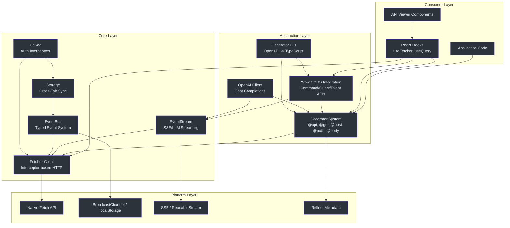
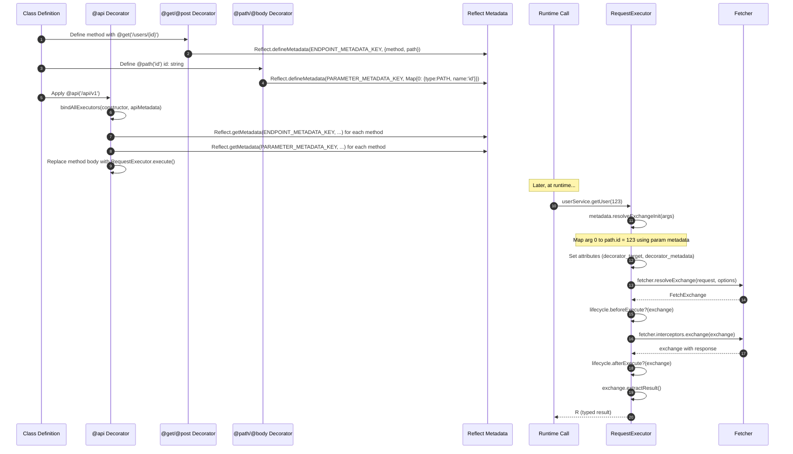
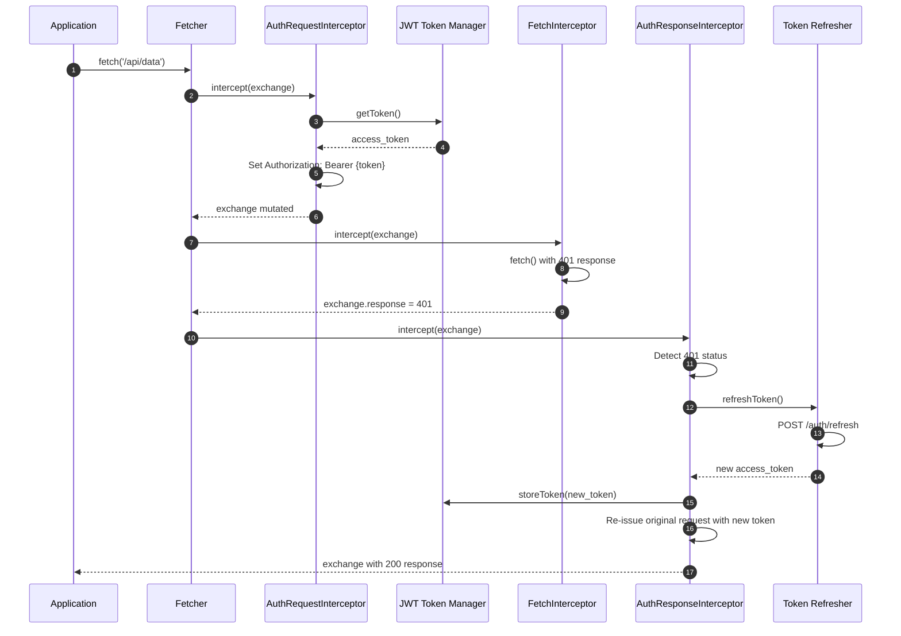
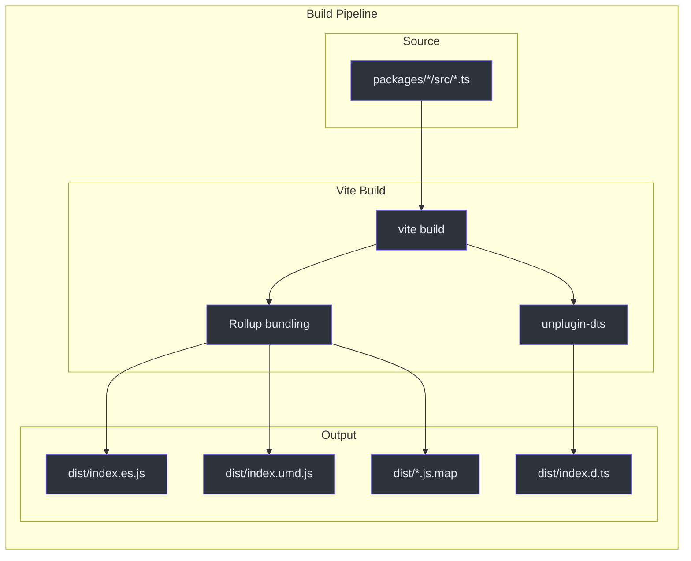
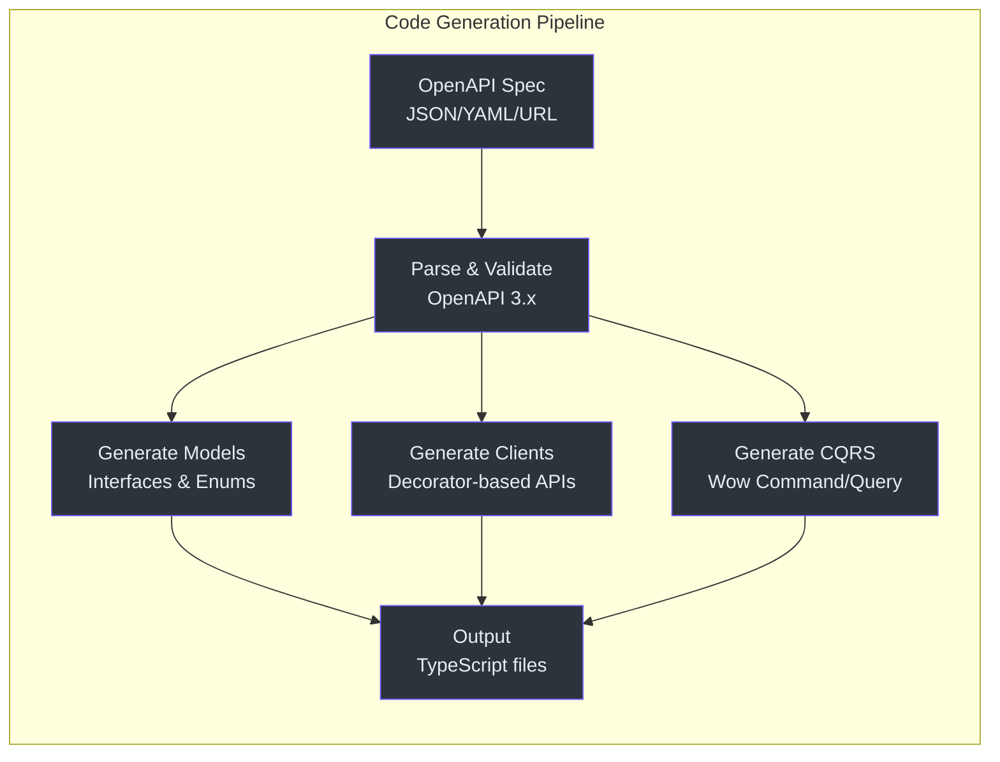

# Staff Engineer Onboarding Guide

This guide is written for staff and principal engineers who need to understand Fetcher at the architectural level. It focuses on the "why" behind the design, the tradeoffs that were made, and the constraints that shape ongoing development. It assumes deep familiarity with TypeScript, the Fetch API, and common frontend architecture patterns.

---

## The One Core Insight

Fetcher's architecture rests on a single design insight: **the interceptor chain is the entire system**. Every HTTP operation -- authentication, URL resolution, body serialization, timeout control, status validation, error handling -- is implemented as an interceptor, not as hardcoded logic inside the client.

This means the system is fully composable. You can:

- Insert a retry interceptor between the auth interceptor and the fetch interceptor.
- Replace the default JSON body serializer with a Protocol Buffers serializer.
- Add distributed tracing by injecting trace headers in a request interceptor and extracting timing data in a response interceptor.
- Suppress status validation per-request by setting `IGNORE_VALIDATE_STATUS` in the exchange attributes.
- Implement circuit breaker logic in an error interceptor that tracks failure rates per endpoint.

The `InterceptorManager` orchestrates three phases -- request, response, error -- each backed by an `InterceptorRegistry` that maintains sorted interceptors by an `order` property. Built-in interceptors space themselves apart by `BUILT_IN_INTERCEPTOR_ORDER_STEP` (10,000), giving developers a wide insertion range.

This is not an original idea -- Axios uses a similar model -- but Fetcher extends it with the error phase, the exchange attribute system for interceptor-to-interceptor communication, and the result extractor abstraction.

**Source**: [packages/fetcher/src/interceptorManager.ts:48-212](https://github.com/Ahoo-Wang/fetcher/blob/main/packages/fetcher/src/interceptorManager.ts#L48-L212)

---

## System Architecture

### Layer Diagram



### Request Processing Pipeline

The complete processing pipeline for a single HTTP request:

```mermaid
sequenceDiagram
autonumber

    participant Caller as Caller
    participant F as Fetcher
    participant IM as InterceptorManager
    participant RBI as RequestBodyInterceptor<br>order: MIN+10K
    participant URI as UrlResolveInterceptor<br>order: MAX-20K
    participant FI as FetchInterceptor<br>order: MAX-10K
    participant VSI as ValidateStatusInterceptor<br>order: MAX-10K

    Caller->>F: exchange(request, options)
    F->>F: resolveExchange(request, options)
    Note over F: 1. Merge default + request headers
    Note over F: 2. Resolve timeout (request > fetcher default)
    Note over F: 3. Merge request options with defaults
    Note over F: 4. Create FetchExchange
    F->>IM: interceptors.exchange(exchange)

    rect rgb(30, 40, 50)
        Note over IM: Request Phase
        IM->>RBI: intercept(exchange)
        Note over RBI: If body is plain object,<br>JSON.stringify and set Content-Type
        RBI-->>IM: exchange mutated
        IM->>URI: intercept(exchange)
        Note over URI: Resolve URL: combineURLs(baseURL, url)<br>+ path params + query params
        URI-->>IM: exchange.request.url resolved
        IM->>FI: intercept(exchange)
        FI->>FI: timeoutFetch(request)
        Note over FI: Race fetch() vs AbortController timeout
        FI-->>IM: exchange.response = Response
    end

    rect rgb(30, 40, 50)
        Note over IM: Response Phase
        IM->>VSI: intercept(exchange)
        Note over VSI: Check validateStatus(status)<br>Throw HttpStatusValidationError if invalid
        VSI-->>IM: status validated
    end

    IM-->>F: exchange
    F->>F: exchange.extractResult()
    F-->>Caller: R (typed result)

```



**Source**: [packages/fetcher/src/interceptorManager.ts:191-211](https://github.com/Ahoo-Wang/fetcher/blob/main/packages/fetcher/src/interceptorManager.ts#L191-L211)

### Decorator System Architecture

The decorator system operates in two phases: metadata collection at class-definition time and runtime execution at method-call time.



**Source**: [packages/decorator/src/requestExecutor.ts:114-146](https://github.com/Ahoo-Wang/fetcher/blob/main/packages/decorator/src/requestExecutor.ts#L114-L146)

### CoSec Authentication Flow



---

## Design Tradeoff Analysis

### Why Native Fetch over Axios?

| Dimension | Native Fetch | Axios | Fetcher's Choice |
|---|---|---|---|
| Bundle size | 0 KB (built-in) | ~13 KB min+gzip | ~3 KB min+gzip for the wrapper |
| Browser support | All modern + Node 18+ | Broad (XHR fallback) | Modern only; Node 18+ required |
| Interceptor model | None | Request/response | Request/response/error (three-phase) |
| Abort mechanism | `AbortController` (native) | `CancelToken` (deprecated) | Native `AbortController` |
| Streaming | Native `ReadableStream` | Limited | Full SSE/LLM streaming support |
| Tree-shaking | N/A | Poor (monolithic) | Excellent (modular packages) |
| Request body types | `BodyInit` subtypes only | Objects auto-serialized | Objects auto-serialized via interceptor |
| Response types | `.json()`, `.text()`, etc. | Configurable via `responseType` | Pluggable `ResultExtractor` |
| Timeout | Not built-in | Built-in | Built-in via `AbortController` race |
| Error semantics | Network errors only | Status + network | Status via interceptor + network |

The decision to build on `fetch()` rather than wrap Axios eliminates a 13 KB dependency, enables native `ReadableStream` support for SSE, and aligns with the platform direction. The tradeoff is losing Axios's automatic XHR fallback for legacy browsers and its `transformRequest`/`transformResponse` shortcuts -- Fetcher's interceptor system replaces those with a more general mechanism.

### Why Legacy Decorators over Code-Gen First?

Fetcher supports two approaches to API client generation:
1. **Decorator-first**: Write TypeScript classes with decorators, methods execute at runtime.
2. **Code-gen first**: Generate TypeScript classes from OpenAPI specs via `@ahoo-wang/fetcher-generator`.

The decorator-first approach was chosen as the primary pattern because:

- It provides a single source of truth in the codebase (the decorated class).
- It avoids build-step complexity for simple use cases.
- The `@api` decorator handles method replacement at class-load time, with no runtime overhead after initialization.
- IDE support is excellent: TypeScript sees the decorated methods with correct types at design time.

The tradeoff is the dependency on `reflect-metadata` (~18 KB) and the use of legacy (Stage 1) decorators, which are not part of the TC39 standard. This is a calculated risk: the TC39 Stage 3 decorators proposal has different semantics (decorators receive a context object, not the target), and migration will require a major version bump. The code-gen path exists as an escape hatch.

### Why Side-Effect Imports for EventStream?

The `@ahoo-wang/fetcher-eventstream` module patches `Response.prototype` at import time. This is controversial in the JavaScript ecosystem. The alternatives considered were:

1. **Wrapper function**: `const stream = toEventStream(response)` -- explicit but verbose.
2. **Custom Response subclass**: Requires wrapping every `Response` returned by `fetch()`.
3. **Interceptor**: Would work but couples SSE support to the Fetcher class only.
4. **Mixin pattern**: Apply to all Response instances via interceptor -- similar to current approach but less discoverable.

The side-effect approach was chosen because:
- It makes `response.eventStream()` available anywhere a `Response` object exists, even outside the Fetcher ecosystem.
- It is a one-time import (`import '@ahoo-wang/fetcher-eventstream'`) that activates globally.
- It includes guard checks (`hasOwnProperty`) to prevent double-patching.
- The module checks `typeof Response !== 'undefined'` to avoid errors in server-side environments.

The tradeoff is that importing the module anywhere changes global behavior. This is documented and guarded but requires team awareness. A linter rule could enforce that the import appears only in a central configuration file.

### Why Three-Phase Error Handling?

Most HTTP client libraries have two phases: request and response. Fetcher adds a third: **error interceptors**. This enables patterns like:

- **Retry**: An error interceptor can detect a retryable error, re-issue the request, and clear the error on the exchange. The exchange continues as if the request succeeded.
- **Token refresh**: An error interceptor detects a 401, refreshes the auth token, re-issues the original request, and clears the error.
- **Graceful degradation**: An error interceptor can set a fallback response instead of propagating the error.
- **Error logging and telemetry**: An error interceptor can record error details without modifying the error flow.

If an error interceptor clears `exchange.error`, the exchange is returned successfully. If the error persists, it is wrapped in `ExchangeError`.

The design choice to make error interceptors "fixable" (by clearing the error) rather than always propagating is what makes retry and token refresh possible without the caller being aware.

**Source**: [packages/fetcher/src/interceptorManager.ts:191-211](https://github.com/Ahoo-Wang/fetcher/blob/main/packages/fetcher/src/interceptorManager.ts#L191-L211)

### Why Mutable FetchExchange?

The `FetchExchange` is mutable. Interceptors modify it in place rather than returning a new object. This was a deliberate choice:

- **Performance**: Avoids object allocation per interceptor. Each request creates one exchange, and interceptors mutate it.
- **Simplicity**: Interceptors have no return value; they just modify the exchange.
- **Error recovery**: Error interceptors can clear `exchange.error` in place, enabling the "fix and continue" pattern.

The tradeoff is that interceptors must be ordering-aware. A request interceptor that reads `exchange.response` will get `undefined` if it runs before `FetchInterceptor`. The `order` property and the documentation make this explicit.

---

## Performance Characteristics

### Bundle Size

The core `@ahoo-wang/fetcher` package targets **3 KB min+gzip**. This is achieved by:

- Zero external dependencies (no `axios`, no `node-fetch`, no polyfills).
- No polyfills (requires native `fetch` and `AbortController`).
- Tree-shakeable ESM exports: `export * from './fetcher'` allows bundlers to eliminate unused code.
- Modular architecture: only import what you use.

Bundle analysis is available per-package:
```bash
pnpm --filter @ahoo-wang/fetcher analyze
```

### Runtime Performance

- **Interceptor chain**: Sorted once on `use()` (add) via `Array.sort`. Execution is a linear iteration with `await` per interceptor. The sorted array is cached as `sortedInterceptors`.
- **URL building**: Regex-based template resolution. The regex (`/{([^}]+)}/g` for URI Template, `/:([^/]+)/g` for Express) is compiled once per class instance and reused via static properties.
- **Timeout**: Uses `Promise.race` between `fetch()` and a timer. Timer cleanup happens in a `finally` block to avoid resource leaks. An `aborted` flag prevents double-rejection.
- **Result extraction**: Results are cached on the `FetchExchange` via `cachedExtractedResult` to prevent repeated deserialization. A `hasCachedResult` boolean flag tracks cache state.
- **Metadata lookup**: `Reflect.getMetadata` calls happen once per class definition (at `@api` time), not per request. The resulting `RequestExecutor` is cached on the prototype instance.

**Source**: [packages/fetcher/src/timeout.ts:120-172](https://github.com/Ahoo-Wang/fetcher/blob/main/packages/fetcher/src/timeout.ts#L120-L172)

### Memory Considerations

- `FetchExchange` objects are created per-request and are not pooled. They are eligible for GC once the request completes and the caller drops the reference.
- The `attributes` map on `FetchExchange` uses `Map<string, any>`, which can accumulate large objects if interceptors store data carelessly. The documentation recommends namespacing keys (e.g., `mylib.traceId`).
- `FetcherRegistrar` holds strong references to all registered fetchers. If fetcher instances are created dynamically (e.g., per-tenant), they must be unregistered explicitly to avoid leaks.
- The result extractor cache on `FetchExchange` means the response body can only be read once (which aligns with the Fetch API's one-shot body constraint).

---

## Decision Log

### D1: Interceptor Order Spacing

**Decision**: Built-in interceptors space themselves by `BUILT_IN_INTERCEPTOR_ORDER_STEP` (10,000) using strategic positions near `Number.MIN_SAFE_INTEGER` and `Number.MAX_SAFE_INTEGER`.

**Rationale**: This guarantees that custom interceptors can always be inserted between any two built-in interceptors without reordering.

**Source**: [packages/fetcher/src/interceptor.ts:18-21](https://github.com/Ahoo-Wang/fetcher/blob/main/packages/fetcher/src/interceptor.ts#L18-L21)

### D2: FetchExchange as Mutable State Container

**Decision**: `FetchExchange` is mutable. Interceptors modify it in place rather than returning a new object.

**Rationale**: Avoids object allocation overhead per interceptor and simplifies the interceptor API (no return value required). The tradeoff is that interceptors must be aware of ordering to avoid conflicts.

### D3: ResultExtractor Pattern

**Decision**: The return type of `fetcher.fetch()` is determined by a pluggable `ResultExtractor` function rather than a method parameter.

**Rationale**: This allows the same `fetcher.get()` call to return `Response`, parsed JSON, or the full `FetchExchange` depending on the extractor. It also enables the decorator system to specify extractors per-endpoint without changing the fetcher API.

**Source**: [packages/fetcher/src/resultExtractor.ts:17-25](https://github.com/Ahoo-Wang/fetcher/blob/main/packages/fetcher/src/resultExtractor.ts#L17-L25)

### D4: Global Singleton FetcherRegistrar

**Decision**: A single global `fetcherRegistrar` instance is exported from the core package.

**Rationale**: Simplifies the decorator system's fetcher resolution. The `@api(fetcher: 'name')` decorator stores a string name; at runtime, the `RequestExecutor` resolves it through the global registrar. This avoids passing fetcher references through every call site.

**Tradeoff**: Testing requires careful registrar cleanup. Applications that need multiple isolated fetcher sets must manage registrar state explicitly.

**Source**: [packages/fetcher/src/fetcherRegistrar.ts:166](https://github.com/Ahoo-Wang/fetcher/blob/main/packages/fetcher/src/fetcherRegistrar.ts#L166)

### D5: pnpm Catalog Protocol for Version Centralization

**Decision**: All shared dependency versions are centralized in `pnpm-workspace.yaml` using the `catalog:` protocol.

**Rationale**: Prevents version drift across 12 packages. Updating a dependency version in one place propagates to all consuming packages. This is critical for maintaining consistency in a monorepo of this size.

### D6: Vite for Build, Vitest for Test

**Decision**: All packages use Vite for building (with `unplugin-dts` for types) and Vitest for testing.

**Rationale**: Vite and Vitest share the same plugin system and configuration, reducing tooling complexity. The `unplugin-dts` plugin generates type declarations without a separate `tsc` step, and `vite-bundle-analyzer` provides per-package bundle inspection.

### D7: CoSec as Interceptor-Based Auth

**Decision**: The `cosec` package implements authentication and authorization as request/response interceptors rather than middleware or context providers.

**Rationale**: Keeps auth composable with the rest of the interceptor chain. Token refresh, device ID injection, and authorization header management are all interceptors that can be added, removed, or reordered. This also means auth works consistently whether you use the decorator system or direct fetcher calls.

**Source**: [packages/cosec/src/authorizationRequestInterceptor.ts](https://github.com/Ahoo-Wang/fetcher/blob/main/packages/cosec/src/authorizationRequestInterceptor.ts)

### D8: Wow CQRS Client Integration

**Decision**: The `wow` package provides CQRS-specific API clients (command, query, event-stream) built on top of the decorator system, designed for the [Wow](https://github.com/Ahoo-Wang/Wow) DDD framework.

**Rationale**: Tight integration enables code generation from Wow aggregate metadata directly into TypeScript clients. The generator CLI (`@ahoo-wang/fetcher-generator`) reads OpenAPI specs exported by Wow backends and produces fully typed command/query clients, including event-streaming command clients for real-time CQRS patterns.

### D9: Cross-Tab Communication via Event Bus

**Decision**: The `storage` package uses `eventbus` for cross-tab synchronization. The `eventbus` package provides three implementations: serial, parallel, and broadcast.

**Rationale**: Cross-tab auth token sync is a common requirement. Rather than building a one-off solution, the event bus abstraction enables reuse across the ecosystem (storage events, auth events, custom application events). The broadcast implementation uses `BroadcastChannel` with `localStorage` fallback for older browsers.

---

## Build Pipeline Architecture



### React-Specific Build Additions

The `react` and `viewer` packages add:
- `@vitejs/plugin-react` with React Compiler (`babel-plugin-react-compiler`) for automatic memoization.
- `@babel/plugin-proposal-decorators` (legacy mode) for packages that use decorators.
- Less processing for Ant Design integration (viewer only).
- `@rolldown/plugin-babel` for the React compiler integration in Vite's Rolldown-based builds.

---

## Cross-Cutting Concerns

### Error Propagation Strategy

Errors propagate through the interceptor chain following these rules:

1. If a **request interceptor** throws, the request phase aborts immediately and the error phase begins. Subsequent request interceptors are skipped.
2. If a **response interceptor** throws, the error phase begins. Subsequent response interceptors are skipped.
3. If an **error interceptor** clears `exchange.error` (sets it to `undefined`), the exchange is returned successfully. This is the "recovery" mechanism.
4. If an error persists after all error interceptors, it is wrapped in `ExchangeError` and thrown.

This means error interceptors can implement recovery strategies (retry, fallback, token refresh) that effectively "fix" failed requests without the caller knowing.

### Type Safety Architecture

The type system is layered:

- `FetchRequest<BODY>` is generic over the body type, allowing type-safe body construction.
- `ResultExtractor<R>` is generic over the return type, controlling what `extractResult()` returns.
- `Fetcher.fetch<R>()`, `Fetcher.get<R>()`, etc. are generic, with the type parameter flowing through to the result extractor.
- The decorator system uses `reflect-metadata` to infer parameter types at runtime, but the TypeScript compiler enforces types at the call site.
- `FetchExchange.extractResult<R>()` applies the result extractor and returns `Promise<R>`.

The type flow for a decorator-based call:

```text
UserService.getUser(123) 
  -> RequestExecutor.execute(args) 
  -> metadata.resolveExchangeInit(args) 
  -> fetcher.resolveExchange(request, options) 
  -> FetchExchange 
  -> exchange.extractResult<User>() 
  -> Promise<User>
```

### Cross-Tab Communication

The `storage` package provides browser storage with cross-tab synchronization via `eventbus`. The `eventbus` package supports three implementations:

- `SerialTypedEventBus` -- handlers execute sequentially in priority order. Use when handler ordering matters.
- `ParallelTypedEventBus` -- handlers execute concurrently. Use for performance when handlers are independent.
- `BroadcastTypedEventBus` -- uses `BroadcastChannel` API with `localStorage` fallback. Use for cross-tab communication.

This enables scenarios like: user logs in on Tab A, the auth token is stored, and Tab B's CoSec interceptor picks up the new token via the event bus.

---

## Extension Points

| Extension | Mechanism | Example |
|---|---|---|
| Custom request interceptor | `fetcher.interceptors.request.use(interceptor)` | Add tracing headers, request logging |
| Custom response interceptor | `fetcher.interceptors.response.use(interceptor)` | Log response times, transform response data |
| Custom error interceptor | `fetcher.interceptors.error.use(interceptor)` | Implement retry with exponential backoff |
| Custom result extractor | Pass `resultExtractor` in `RequestOptions` | Parse Protocol Buffers, extract nested data |
| Custom fetcher instance | `new NamedFetcher('name', options)` | Per-service base URLs, different timeouts |
| Custom validate status | `new Fetcher({ validateStatus })` | Accept 2xx and 304, or all statuses |
| Decorator lifecycle hooks | Implement `ExecuteLifeCycle` on the service class | Pre/post request logging, caching |
| Custom URL template style | `UrlTemplateStyle.Express` | Use `:param` syntax instead of `{param}` |
| Ignoring status validation per-request | Set `IGNORE_VALIDATE_STATUS` attribute | Accept error responses without throwing |

**Source**: [packages/decorator/src/executeLifeCycle.ts](https://github.com/Ahoo-Wang/fetcher/blob/main/packages/decorator/src/executeLifeCycle.ts)

---

## Testing Strategy

- **Unit tests**: Vitest with co-located `*.test.ts` files. MSW is used in the fetcher package for HTTP mocking.
- **Browser tests**: The viewer package uses `@vitest/browser` with Playwright for browser-environment testing.
- **Integration tests**: A separate `integration-test/` workspace runs tests against real APIs.
- **Coverage**: `@vitest/coverage-v8` is configured per-package with `vitest run --coverage`. Coverage reports are uploaded to Codecov.

The test command for any package is:
```bash
pnpm --filter @ahoo-wang/<package-name> test
```

Vitest globals are enabled (`describe`, `it`, `expect`, `vi` available without import). Test files follow `*.test.ts` / `*.test.tsx` naming and live alongside source files.

---

## CoSec Authentication Architecture

The CoSec package implements a complete token lifecycle management system as interceptors:

### Token Flow

1. **Request phase**: `AuthorizationRequestInterceptor` reads the current JWT token from `TokenStorage` and adds `Authorization: Bearer {token}` to the request headers.
2. **Response phase**: If a 401 response is received, `UnauthorizedErrorInterceptor` triggers `TokenRefresher` to obtain a new token.
3. **Token refresh**: The refresher calls the token endpoint with a refresh token. On success, the new token is stored and the original request is retried.
4. **Cross-tab sync**: When a token is refreshed in one tab, the `BroadcastTypedEventBus` notifies other tabs to update their stored tokens.

### Device Identity

`CosecRequestInterceptor` adds a `Device-Id` header generated by `idGenerator` and persisted in `DeviceIdStorage`. This enables server-side device tracking and session management.

### Resource Attribution

`ResourceAttributionRequestInterceptor` adds headers that identify the current resource context (e.g., tenant ID, organization ID), enabling multi-tenant API routing.

**Source**: [packages/cosec/src/](https://github.com/Ahoo-Wang/fetcher/blob/main/packages/cosec/src/)

---

## Generator Architecture

The code generator (`@ahoo-wang/fetcher-generator`) is a CLI tool that transforms OpenAPI 3.x specifications into TypeScript code:

### Pipeline



The generator uses `ts-morph` (a TypeScript compiler API wrapper) to produce well-formatted, correctly-typed code. It handles:
- Complex schema types (unions, intersections, enums, references, oneOf, allOf, anyOf).
- Recursive type references.
- Wow-specific aggregate, command, and event types.
- Automatic index file generation for clean module organization.

**Source**: [packages/generator/src/](https://github.com/Ahoo-Wang/fetcher/blob/main/packages/generator/src/)

---

## Summary of Key Architectural Patterns

| Pattern | Where Used | File |
|---|---|---|
| Interceptor Chain (CoR) | All HTTP operations | [interceptorManager.ts](https://github.com/Ahoo-Wang/fetcher/blob/main/packages/fetcher/src/interceptorManager.ts) |
| Named Registry | Fetcher instances | [fetcherRegistrar.ts](https://github.com/Ahoo-Wang/fetcher/blob/main/packages/fetcher/src/fetcherRegistrar.ts) |
| Strategy Pattern | Result extraction, URL templates | [resultExtractor.ts](https://github.com/Ahoo-Wang/fetcher/blob/main/packages/fetcher/src/resultExtractor.ts), [urlTemplateResolver.ts](https://github.com/Ahoo-Wang/fetcher/blob/main/packages/fetcher/src/urlTemplateResolver.ts) |
| Side-Effect Module | SSE support activation | [responses.ts](https://github.com/Ahoo-Wang/fetcher/blob/main/packages/eventstream/src/responses.ts) |
| Decorator + Metadata | API service classes | [apiDecorator.ts](https://github.com/Ahoo-Wang/fetcher/blob/main/packages/decorator/src/apiDecorator.ts) |
| Template Method | RequestExecutor lifecycle | [requestExecutor.ts](https://github.com/Ahoo-Wang/fetcher/blob/main/packages/decorator/src/requestExecutor.ts) |
| Observer (Event Bus) | Cross-tab sync, storage events | [typedEventBus.ts](https://github.com/Ahoo-Wang/fetcher/blob/main/packages/eventbus/src/typedEventBus.ts) |
| Mutable State Container | FetchExchange passing through chain | [fetchExchange.ts](https://github.com/Ahoo-Wang/fetcher/blob/main/packages/fetcher/src/fetchExchange.ts) |

---

## Migration Considerations

### From Axios

Teams migrating from Axios to Fetcher should understand these conceptual mappings:

| Axios Concept | Fetcher Equivalent |
|---|---|
| `axios.create({baseURL, timeout})` | `new Fetcher({baseURL, timeout})` |
| `axios.interceptors.request.use(fn)` | `fetcher.interceptors.request.use(interceptor)` |
| `axios.interceptors.response.use(fn)` | `fetcher.interceptors.response.use(interceptor)` |
| `axios.get('/path')` | `fetcher.get('/path')` |
| `response.data` | `exchange.extractResult()` or `response.json()` |
| `axios.CancelToken` | `AbortController` via `request.abortController` |
| `transformRequest` | Custom request interceptor |
| `transformResponse` | Custom response interceptor or `ResultExtractor` |

Key differences:
- Fetcher's interceptors are objects with `name`, `order`, and `intercept()` -- not simple functions.
- Fetcher has a third error phase that Axios lacks.
- Fetcher's `ResultExtractor` pattern replaces Axios's `responseType` configuration.
- Fetcher does not have automatic XHR fallback.

### Decorator to Code-Gen Migration

If a team starts with decorator-based API classes and later wants to switch to code-gen:

1. Run the generator against the backend's OpenAPI spec.
2. Compare generated interfaces with existing TypeScript interfaces.
3. Replace decorated classes with generated classes.
4. Remove the `reflect-metadata` dependency if no other code uses it.

The generated code uses the same decorator system internally, so interceptors and fetcher configuration remain compatible.

---

## Open Questions and Future Work

| Topic | Current State | Potential Direction |
|---|---|---|
| TC39 Stage 3 Decorators | Legacy decorators used | Migration requires major version bump; Stage 3 decorators have fundamentally different API |
| Request caching | Not built-in | Could be added as a response interceptor that caches based on URL and method |
| Offline support | Not built-in | Service worker integration could be added as a separate package |
| GraphQL support | Not built-in | A GraphQL result extractor could be added; the core is generic enough |
| WebSocket support | Not built-in | Could be added as a separate package alongside eventstream |
| Node.js compatibility | Requires Node 18+ | Works out of the box with Node's native `fetch`; no polyfills needed |
| Bundle analyzer CI | Per-package `analyze` script | Could add CI bundle size tracking and regression detection |

---

## Quick Reference: Interceptor Order Values

For quick reference when writing custom interceptors:

```text
Number.MIN_SAFE_INTEGER + 10,000  = RequestBodyInterceptor (earliest request)
                                     ---- Your custom interceptors go here ----
Number.MAX_SAFE_INTEGER - 20,000  = UrlResolveInterceptor
Number.MAX_SAFE_INTEGER - 10,000  = FetchInterceptor (latest request, executes fetch())
Number.MAX_SAFE_INTEGER - 10,000  = ValidateStatusInterceptor (earliest response)
                                     ---- Your custom interceptors go here ----
                                     ---- Error interceptors (no built-in) ----
```

Practical order values for custom interceptors:
- `order: -1000` -- before body serialization (rare)
- `order: 0` -- between body serialization and URL resolution (common for auth headers)
- `order: 1000000` -- between URL resolution and fetch (rare)
- `order: 0` in response phase -- after status validation (common for response logging)
- `order: 0` in error phase -- standard position for retry logic

---

## Appendix: Key Type Definitions

### FetchExchange Lifecycle

The `FetchExchange` object transitions through these states during a request:

| State | `request` | `response` | `error` | Description |
|---|---|---|---|---|
| Created | Set | `undefined` | `undefined` | Exchange created in `resolveExchange()` |
| After request interceptors | Mutated | `undefined` or `Response` | `undefined` or `Error` | Interceptors may have modified request; `FetchInterceptor` sets response |
| After response interceptors | Mutated | `Response` | `undefined` | Status validated; response available |
| Error state | Mutated | `undefined` or `Response` | `Error` | An interceptor threw; error interceptors may fix it |
| Final | Mutated | `Response` or `undefined` | `undefined` or `Error` | Returned to caller |

### Interceptor Interface Contract

Every interceptor must implement:

```text
interface Interceptor extends NamedCapable, OrderedCapable {
  readonly name: string;    // Unique identifier, used for deduplication
  readonly order: number;   // Execution order (ascending, lower = earlier)
  intercept(exchange: FetchExchange): void | Promise<void>;
}
```

The `intercept` method:
- Receives the mutable `FetchExchange`.
- Can modify `exchange.request`, `exchange.response`, `exchange.error`, or `exchange.attributes`.
- Can throw to abort the chain (request and response interceptors).
- Should return `void` (not the exchange).
- In error interceptors, clearing `exchange.error` signals recovery.

### FetcherOptions Interface

The `FetcherOptions` interface controls `Fetcher` construction:

| Property | Type | Default | Purpose |
|---|---|---|---|
| `baseURL` | `string` | `''` | Base URL prepended to all requests |
| `headers` | `RequestHeaders` | `{Content-Type: 'application/json'}` | Default headers for all requests |
| `timeout` | `number` | `undefined` (no timeout) | Default timeout in milliseconds |
| `urlTemplateStyle` | `UrlTemplateStyle` | `UriTemplate` | URL template parameter style |
| `interceptors` | `InterceptorManager` | Default (built-in interceptors) | Custom interceptor manager |
| `validateStatus` | `(status) => boolean` | `status >= 200 && status < 300` | Status validation function |

**Source**: [packages/fetcher/src/fetcher.ts:51-80](https://github.com/Ahoo-Wang/fetcher/blob/main/packages/fetcher/src/fetcher.ts#L51-L80)

---

## Glossary

| Term | Definition |
|---|---|
| **Chain of Responsibility** | Behavioral design pattern where a request passes through a chain of handlers; each handler decides to process or pass along |
| **Side-effect import** | An import that executes code at module load time, modifying global state |
| **Interceptor** | Middleware component that processes requests/responses/errors in a pipeline |
| **Exchange** | The data object (FetchExchange) that flows through the interceptor chain |
| **Result Extractor** | A function that transforms a FetchExchange into a typed return value |
| **Named Registry** | A pattern where instances are stored and retrieved by string name |
| **Decorator Metadata** | Data attached to class/method/parameter via `Reflect.defineMetadata` |
| **Template Resolution** | Replacing URL placeholders (`{param}` or `:param`) with actual values |
| **AbortController** | Browser API for cancelling fetch requests; also used for timeout implementation |
| **ReadableStream** | Browser API for streaming data; used by the eventstream package for SSE |
| **BroadcastChannel** | Browser API for cross-tab communication; used by the eventbus package |
| **Token Refresh** | The process of obtaining a new authentication token when the current one expires |
| **Catalog Protocol** | pnpm feature for centralizing dependency versions in workspace configuration |

---

## Further Reading

| Resource | Description |
|---|---|
| [Contributor Onboarding Guide](./contributor.md) | Hands-on guide for developers contributing code to Fetcher |
| [Executive Onboarding Guide](./executive.md) | Strategic overview for engineering leadership |
| [Fetcher API Reference](https://github.com/Ahoo-Wang/fetcher/tree/main/packages/fetcher/src) | Core package source code with inline documentation |
| [VitePress Wiki](https://github.com/Ahoo-Wang/fetcher/tree/main/wiki) | Full project documentation with interactive examples |
| [Storybook](https://github.com/Ahoo-Wang/fetcher/tree/main/packages/viewer/stories) | Interactive component documentation for viewer package |
| [Integration Tests](https://github.com/Ahoo-Wang/fetcher/tree/main/integration-test) | Real API integration test examples |
