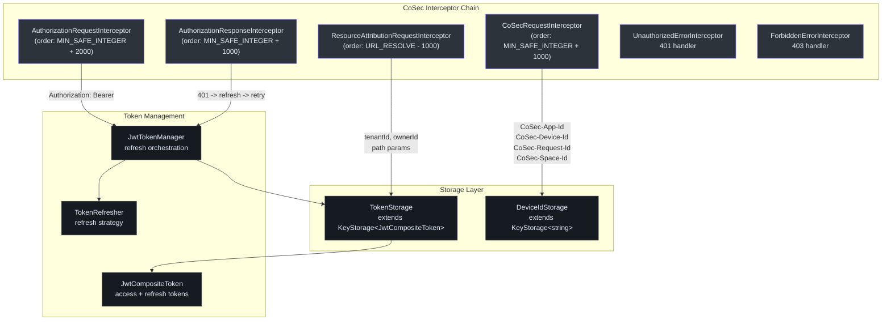
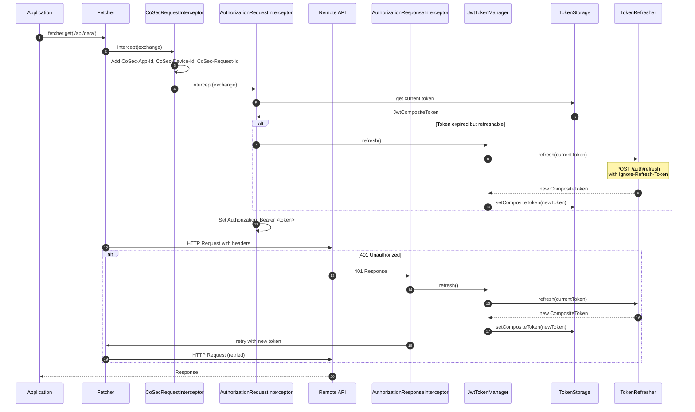
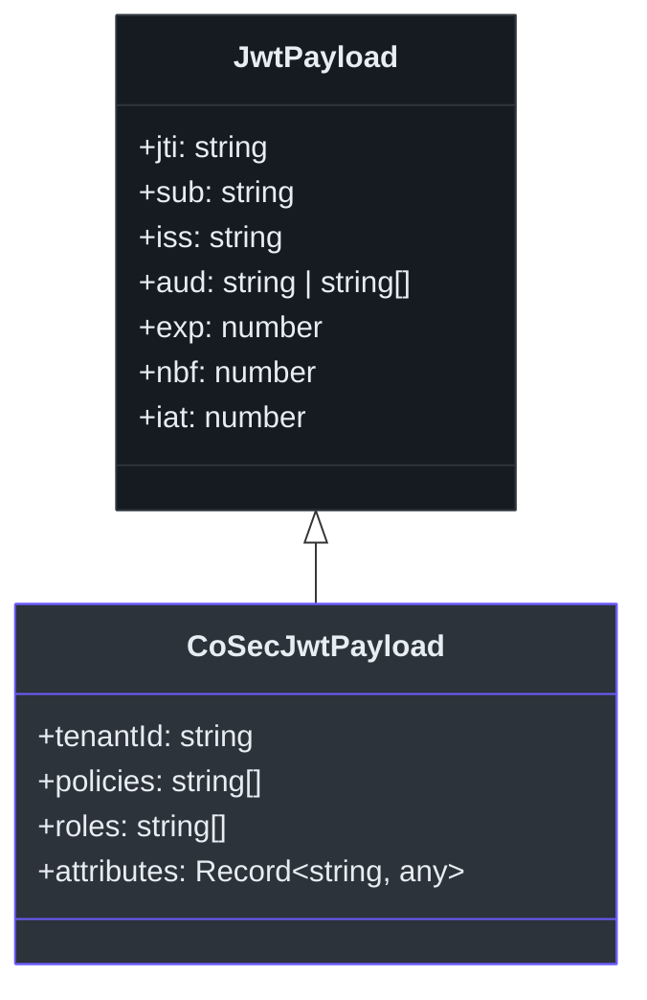

# @ahoo-wang/fetcher-cosec

The `@ahoo-wang/fetcher-cosec` package integrates CoSec (Corporate Security) authentication with the Fetcher HTTP client. It provides JWT token management with automatic refresh, persistent token and device ID storage via [Storage](./storage.md), multi-tenant request attribution, and a complete interceptor chain that handles authorization, 401 retry, and 403 error propagation.

## Installation

```bash
pnpm add @ahoo-wang/fetcher-cosec
```

## Architecture Overview



## Quick Start

```typescript
import { Fetcher } from '@ahoo-wang/fetcher';
import { CoSecConfigurer, CoSecTokenRefresher } from '@ahoo-wang/fetcher-cosec';

const fetcher = new Fetcher({ baseUrl: 'https://api.example.com' });

const configurer = new CoSecConfigurer({
  appId: 'my-web-app',
  tokenRefresher: new CoSecTokenRefresher({
    fetcher,
    endpoint: '/auth/refresh',
  }),
  onUnauthorized: () => (window.location.href = '/login'),
  onForbidden: () => alert('Access Denied'),
});

configurer.applyTo(fetcher);

// All requests now include CoSec headers and Bearer token
const users = await fetcher.get('/api/users');
```

## Configuration

### CoSecConfig

The `CoSecConfigurer` accepts a `CoSecConfig` object with three configuration levels:

| Level | Required Properties | Features |
|-------|-------------------|----------|
| **Minimal** | `appId` only | Security headers only (device ID, request ID, app ID) |
| **Standard** | `appId` + `tokenRefresher` | Full JWT authentication with auto-refresh |
| **Enterprise** | All options | Multi-tenant, custom storage, custom error handlers |

| Property | Type | Required | Default | Description |
|----------|------|----------|---------|-------------|
| `appId` | `string` | Yes | -- | Application identifier for `CoSec-App-Id` header |
| `tokenRefresher` | `TokenRefresher` | No | -- | Token refresh strategy. Enables JWT auth when provided. |
| `tokenStorage` | `TokenStorage` | No | `new TokenStorage()` | Token persistence backend |
| `deviceIdStorage` | `DeviceIdStorage` | No | `new DeviceIdStorage()` | Device ID persistence |
| `spaceIdProvider` | `SpaceIdProvider` | No | `NoneSpaceIdProvider` | Multi-tenant space resolver |
| `onUnauthorized` | `(exchange) => Promise<void>` | No | -- | Custom 401 error handler |
| `onForbidden` | `(exchange) => Promise<void>` | No | -- | Custom 403 error handler |

Source: [packages/cosec/src/cosecConfigurer.ts:86-298](https://github.com/Ahoo-Wang/fetcher/blob/main/packages/cosec/src/cosecConfigurer.ts#L86-L298)

## Interceptors

### CoSecRequestInterceptor

Injects security headers into every outgoing request:

| Header | Value | Description |
|--------|-------|-------------|
| `CoSec-App-Id` | Configured `appId` | Application identifier |
| `CoSec-Device-Id` | From `DeviceIdStorage` | Persistent device identifier (nanoid) |
| `CoSec-Request-Id` | Generated per-request | Unique request correlation ID |
| `CoSec-Space-Id` | From `SpaceIdProvider` | Space identifier (if resolved) |

Source: [packages/cosec/src/cosecRequestInterceptor.ts:214-382](https://github.com/Ahoo-Wang/fetcher/blob/main/packages/cosec/src/cosecRequestInterceptor.ts#L214-L382)

### AuthorizationRequestInterceptor

Adds the `Authorization: Bearer <token>` header. Before injecting, it checks if the access token needs refresh and performs a proactive refresh if possible. Respects the `Ignore-Refresh-Token` attribute to prevent recursive refresh during the refresh request itself.

Source: [packages/cosec/src/authorizationRequestInterceptor.ts:41-92](https://github.com/Ahoo-Wang/fetcher/blob/main/packages/cosec/src/authorizationRequestInterceptor.ts#L41-L92)

### AuthorizationResponseInterceptor

Handles 401 responses by:
1. Checking if the response status is 401
2. Verifying the refresh token is still valid
3. Refreshing the access token
4. Retrying the original request with the new token
5. Clearing tokens on refresh failure

Source: [packages/cosec/src/authorizationResponseInterceptor.ts:42-81](https://github.com/Ahoo-Wang/fetcher/blob/main/packages/cosec/src/authorizationResponseInterceptor.ts#L42-L81)

### ResourceAttributionRequestInterceptor

Automatically injects `tenantId` and `ownerId` path parameters from the current JWT payload when the URL template contains `{tenantId}` or `{ownerId}` placeholders. Runs before URL resolution.

Source: [packages/cosec/src/resourceAttributionRequestInterceptor.ts:58-127](https://github.com/Ahoo-Wang/fetcher/blob/main/packages/cosec/src/resourceAttributionRequestInterceptor.ts#L58-L127)

### Error Interceptors

| Interceptor | Status | Behavior |
|-------------|--------|----------|
| `UnauthorizedErrorInterceptor` | 401 | Calls `onUnauthorized` callback from config |
| `ForbiddenErrorInterceptor` | 403 | Calls `onForbidden` callback from config |

Source: [packages/cosec/src/unauthorizedErrorInterceptor.ts](https://github.com/Ahoo-Wang/fetcher/blob/main/packages/cosec/src/unauthorizedErrorInterceptor.ts), [packages/cosec/src/forbiddenErrorInterceptor.ts](https://github.com/Ahoo-Wang/fetcher/blob/main/packages/cosec/src/forbiddenErrorInterceptor.ts)

## Authentication Flow



## JWT Token Management

### JwtToken

Parses a JWT string and provides typed payload access with expiration checking. Supports an `earlyPeriod` to trigger proactive refresh before actual expiration.

```typescript
import { JwtToken } from '@ahoo-wang/fetcher-cosec';

const token = new JwtToken<CoSecJwtPayload>('eyJ...', 300); // 5 min early period
console.log(token.isExpired);     // false if not yet expired
console.log(token.payload?.sub);  // user ID from payload
```

### JwtCompositeToken

Manages access and refresh token pairs together:

```typescript
import { JwtCompositeToken } from '@ahoo-wang/fetcher-cosec';

const composite = new JwtCompositeToken({
  accessToken: 'access.jwt.token',
  refreshToken: 'refresh.jwt.token',
}, 300);

console.log(composite.authenticated);    // true if access token valid
console.log(composite.isRefreshNeeded);  // true if access token expired
console.log(composite.isRefreshable);    // true if refresh token still valid
```

### TokenStorage

Extends `KeyStorage<JwtCompositeToken>` with authentication-specific methods and cross-tab synchronization:

| Method | Description |
|--------|-------------|
| `signIn(compositeToken)` | Store a new composite token |
| `signOut()` | Remove the stored token |
| `authenticated` | Check if a valid token is present |
| `currentUser` | Get the JWT payload if authenticated |

Source: [packages/cosec/src/tokenStorage.ts:43-121](https://github.com/Ahoo-Wang/fetcher/blob/main/packages/cosec/src/tokenStorage.ts#L43-L121)

### JwtTokenManager

Orchestrates token refresh operations with deduplication (prevents concurrent refresh requests):

| Property / Method | Description |
|-------------------|-------------|
| `currentToken` | Get the current composite token from storage |
| `refresh()` | Refresh the token. Deduplicates concurrent calls. |
| `isRefreshNeeded` | Check if access token needs refresh |
| `isRefreshable` | Check if refresh token is still valid |

Source: [packages/cosec/src/jwtTokenManager.ts:33-105](https://github.com/Ahoo-Wang/fetcher/blob/main/packages/cosec/src/jwtTokenManager.ts#L33-L105)

### CoSecTokenRefresher

A built-in `TokenRefresher` implementation that sends a POST request to a configured endpoint:

```typescript
import { CoSecTokenRefresher } from '@ahoo-wang/fetcher-cosec';

const refresher = new CoSecTokenRefresher({
  fetcher: myFetcher,
  endpoint: '/auth/refresh',
});

// The refresher automatically sets IGNORE_REFRESH_TOKEN_ATTRIBUTE_KEY
// to prevent infinite refresh loops
```

**Important**: The refresh request includes `IGNORE_REFRESH_TOKEN_ATTRIBUTE_KEY` attribute to prevent the `AuthorizationRequestInterceptor` from triggering another refresh cycle.

Source: [packages/cosec/src/tokenRefresher.ts:141-207](https://github.com/Ahoo-Wang/fetcher/blob/main/packages/cosec/src/tokenRefresher.ts#L141-L207)

## JWT Payload Types



| Interface | Key Fields |
|-----------|------------|
| `JwtPayload` | `jti`, `sub`, `iss`, `aud`, `exp`, `nbf`, `iat` |
| `CoSecJwtPayload` | Inherits all + `tenantId`, `policies`, `roles`, `attributes` |

Source: [packages/cosec/src/jwts.ts:17-80](https://github.com/Ahoo-Wang/fetcher/blob/main/packages/cosec/src/jwts.ts#L17-L80)

## Device Tracking

`DeviceIdStorage` extends `KeyStorage<string>` with a `getOrCreate()` method that generates a unique device ID (via nanoid) on first use and persists it:

```typescript
import { DeviceIdStorage } from '@ahoo-wang/fetcher-cosec';

const deviceStorage = new DeviceIdStorage();
const deviceId = deviceStorage.getOrCreate();
// First call: generates and stores a new nanoid
// Subsequent calls: returns the stored ID
```

Source: [packages/cosec/src/deviceIdStorage.ts:35-71](https://github.com/Ahoo-Wang/fetcher/blob/main/packages/cosec/src/deviceIdStorage.ts#L35-L71)

## Key Exports

| Export | Description |
|--------|-------------|
| `CoSecConfigurer` | `FetcherConfigurer` that registers all CoSec interceptors |
| `CoSecConfig` | Configuration interface for CoSec setup |
| `CoSecHeaders` | Header name constants (`DEVICE_ID`, `APP_ID`, `SPACE_ID`, `AUTHORIZATION`, `REQUEST_ID`) |
| `CoSecRequestInterceptor` | Adds security headers to requests |
| `AuthorizationRequestInterceptor` | Adds Bearer token with proactive refresh |
| `AuthorizationResponseInterceptor` | Handles 401 with token refresh and retry |
| `ResourceAttributionRequestInterceptor` | Injects tenantId/ownerId from JWT |
| `UnauthorizedErrorInterceptor` | Custom 401 handler |
| `ForbiddenErrorInterceptor` | Custom 403 handler |
| `TokenStorage` | JWT token persistence with auth methods |
| `DeviceIdStorage` | Device ID persistence with `getOrCreate()` |
| `JwtTokenManager` | Token refresh orchestration with deduplication |
| `JwtToken<Payload>` | Parsed JWT with typed payload |
| `JwtCompositeToken` | Access + refresh token pair |
| `JwtCompositeTokenSerializer` | Serializer for composite tokens |
| `CoSecTokenRefresher` | Built-in POST-based token refresher |
| `TokenRefresher` | Interface for custom refresh strategies |
| `JwtPayload` | Standard JWT payload interface |
| `CoSecJwtPayload` | CoSec-extended JWT payload with tenantId, roles, policies |
| `AuthorizeResults` | Authorization result constants (`ALLOW`, `EXPLICIT_DENY`, `IMPLICIT_DENY`, etc.) |
| `SpaceIdProvider` | Interface for multi-tenant space resolution |
| `DefaultSpaceIdProvider` | Predicate + storage-backed space provider for multi-tenant apps |
| `NoneSpaceIdProvider` | No-op space provider (default) |

## Multi-Tenant Space Resolution

For multi-tenant applications, `DefaultSpaceIdProvider` determines which requests require space scoping (via a predicate) and resolves the space ID from persistent storage:

```typescript
import { CoSecConfigurer, DefaultSpaceIdProvider } from '@ahoo-wang/fetcher-cosec';

const cosecConfigurer = new CoSecConfigurer({
  tokenRefresher: async () => { /* ... */ },
  spaceIdProvider: new DefaultSpaceIdProvider({
    // Only /api/ requests get space-scoped
    spacedResourcePredicate: {
      test: (exchange) => exchange.request.url.includes('/api/'),
    },
    // SpaceIdStorage persists the current tenant's space ID
    spaceIdStorage: new SpaceIdStorage(),
  }),
});
```

When the predicate matches, the `ResourceAttributionRequestInterceptor` injects the `Command-Space-Id` header automatically.

## Cross-References

- **[Fetcher](./fetcher.md)** -- `CoSecConfigurer` implements `FetcherConfigurer` to integrate with Fetcher's interceptor chain
- **[Storage](./storage.md)** -- `TokenStorage` and `DeviceIdStorage` extend `KeyStorage` for persistence
- **[React](./react.md)** -- `useSecurity`, `RouteGuard`, and `RefreshableRouteGuard` provide React integration
- **[EventBus](./eventbus.md)** -- Token and device storage use `BroadcastTypedEventBus` for cross-tab sync
