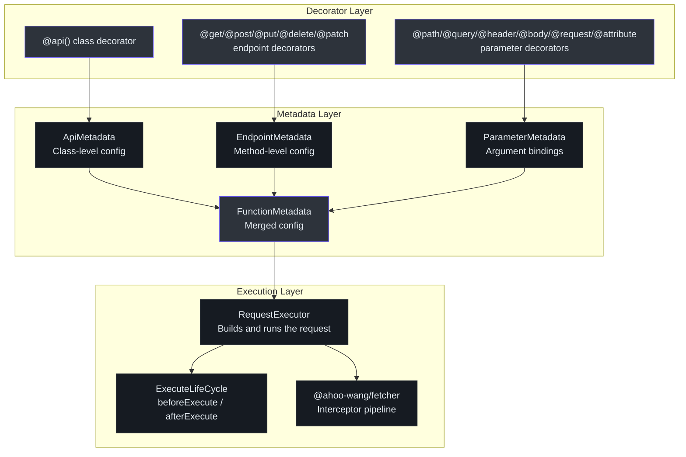
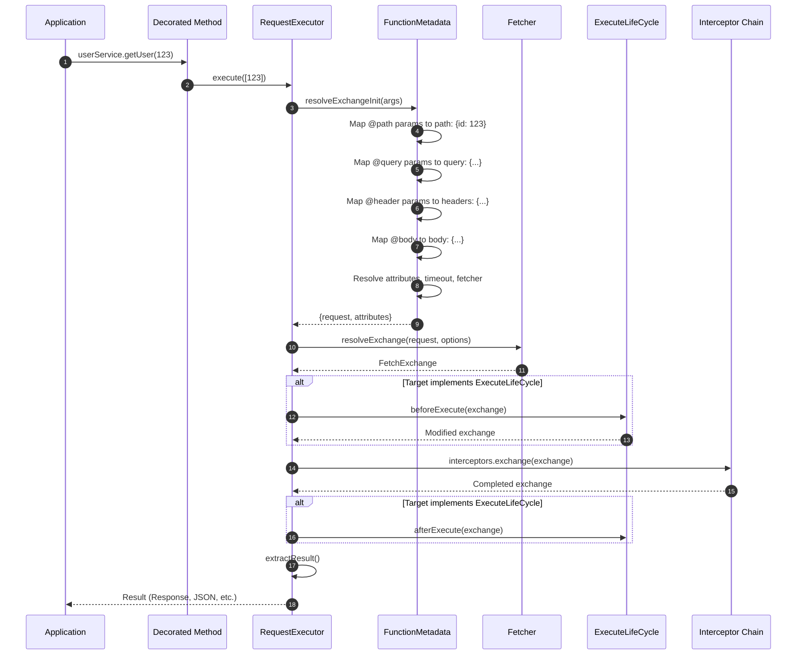
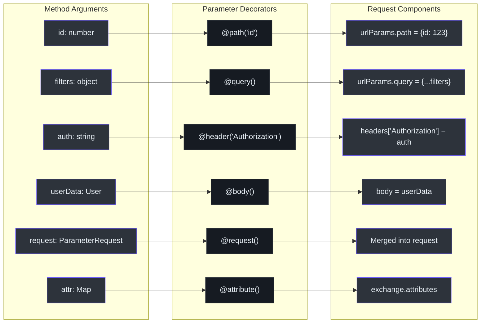
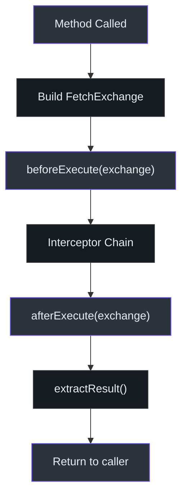
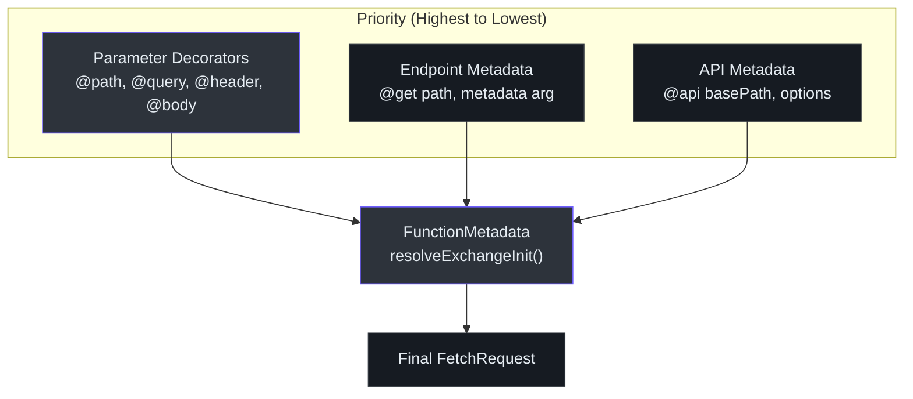

# @ahoo-wang/fetcher-decorator

The `@ahoo-wang/fetcher-decorator` package enables declarative API service definitions using TypeScript decorators. Instead of writing imperative HTTP calls, you define API classes with decorator annotations and the framework generates the implementation automatically at runtime.

**Source**: [`packages/decorator/src/`](https://github.com/Ahoo-Wang/fetcher/blob/main/packages/decorator/src/)

## Installation

```bash
pnpm add @ahoo-wang/fetcher-decorator reflect-metadata
```

::: warning
`reflect-metadata` is required as a peer dependency. It must be imported once at your application entry point before using decorators:

```typescript
import 'reflect-metadata';
```
:::

## Architecture



## Decorator Execution Flow

When a decorated method is called, the framework executes a well-defined pipeline:



## Defining an API Class

### The @api Decorator

The `@api` class decorator sets base path, headers, timeout, and the fetcher instance for all methods in the class. ([`apiDecorator.ts:232`](https://github.com/Ahoo-Wang/fetcher/blob/main/packages/decorator/src/apiDecorator.ts#L232))

```typescript
import { api, get, post, put, del, path, query, body, header, autoGeneratedError } from '@ahoo-wang/fetcher-decorator';
import 'reflect-metadata';

interface User {
  id: number;
  name: string;
  email: string;
}

@api('/api/v1/users', {
  headers: { 'X-Api-Version': '1.0' },
  timeout: 10000,
  fetcher: 'api', // Use the 'api' named fetcher
})
class UserService {
  @get('/')
  getUsers(
    @query('page') page: number,
    @query('limit') limit: number,
  ): Promise<User[]> {
    throw autoGeneratedError();
  }

  @get('/:id')
  getUser(@path('id') id: number): Promise<User> {
    throw autoGeneratedError();
  }

  @post('/')
  createUser(@body() user: Omit<User, 'id'>): Promise<User> {
    throw autoGeneratedError();
  }

  @put('/:id')
  updateUser(
    @path('id') id: number,
    @body() user: Partial<User>,
  ): Promise<User> {
    throw autoGeneratedError();
  }

  @del('/:id')
  deleteUser(@path('id') id: number): Promise<void> {
    throw autoGeneratedError();
  }
}
```

### Endpoint Decorators

| Decorator | HTTP Method | Source |
|-----------|------------|--------|
| `@get(path?, metadata?)` | GET | [`endpointDecorator.ts:101`](https://github.com/Ahoo-Wang/fetcher/blob/main/packages/decorator/src/endpointDecorator.ts#L101) |
| `@post(path?, metadata?)` | POST | [`endpointDecorator.ts:126`](https://github.com/Ahoo-Wang/fetcher/blob/main/packages/decorator/src/endpointDecorator.ts#L126) |
| `@put(path?, metadata?)` | PUT | [`endpointDecorator.ts:151`](https://github.com/Ahoo-Wang/fetcher/blob/main/packages/decorator/src/endpointDecorator.ts#L151) |
| `@del(path?, metadata?)` | DELETE | [`endpointDecorator.ts:176`](https://github.com/Ahoo-Wang/fetcher/blob/main/packages/decorator/src/endpointDecorator.ts#L176) |
| `@patch(path?, metadata?)` | PATCH | [`endpointDecorator.ts:201`](https://github.com/Ahoo-Wang/fetcher/blob/main/packages/decorator/src/endpointDecorator.ts#L201) |
| `@head(path?, metadata?)` | HEAD | [`endpointDecorator.ts:229`](https://github.com/Ahoo-Wang/fetcher/blob/main/packages/decorator/src/endpointDecorator.ts#L229) |
| `@options(path?, metadata?)` | OPTIONS | [`endpointDecorator.ts:254`](https://github.com/Ahoo-Wang/fetcher/blob/main/packages/decorator/src/endpointDecorator.ts#L254) |

Each endpoint decorator accepts optional `MethodEndpointMetadata` to override class-level settings:

```typescript
@get('/special', {
  headers: { 'X-Special': 'true' },
  timeout: 30000,
  resultExtractor: ResultExtractors.Json,
})
specialEndpoint(): Promise<any> {
  throw autoGeneratedError();
}
```

### Parameter Decorators

Parameter decorators map function arguments to HTTP request components. When no explicit name is provided, the parameter name is automatically extracted from the function signature. ([`parameterDecorator.ts:199`](https://github.com/Ahoo-Wang/fetcher/blob/main/packages/decorator/src/parameterDecorator.ts#L199))

| Decorator | Type | Maps To | Object Expansion |
|-----------|------|---------|-----------------|
| `@path(name?)` | `ParameterType.PATH` | URL path segment | Yes - object keys become path params |
| `@query(name?)` | `ParameterType.QUERY` | URL query string | Yes - object keys become query params |
| `@header(name?)` | `ParameterType.HEADER` | Request headers | Yes - object keys become headers |
| `@body()` | `ParameterType.BODY` | Request body | No |
| `@request()` | `ParameterType.REQUEST` | Base request object | No |
| `@attribute(name?)` | `ParameterType.ATTRIBUTE` | Exchange attributes | Yes - objects and Maps |



## Object Parameter Expansion

Path, query, and header decorators support object arguments. When an object is passed, its key-value pairs are expanded into individual parameters:

```typescript
@api('/api')
class SearchService {
  @get('/search')
  search(
    @query() filters: { limit: number; offset: number; sort: string },
  ): Promise<SearchResult[]> {
    throw autoGeneratedError();
  }
}

// Calling:
service.search({ limit: 10, offset: 20, sort: 'name' });
// => GET /api/search?limit=10&offset=20&sort=name
```

## The @request Decorator

The `@request()` decorator allows passing a `ParameterRequest` object for full control over the request. It is merged with endpoint-level configuration, with the parameter request taking precedence. ([`parameterDecorator.ts:372`](https://github.com/Ahoo-Wang/fetcher/blob/main/packages/decorator/src/parameterDecorator.ts#L372))

```typescript
@api('/api/users')
class UserService {
  @post('/')
  createUser(@request() req: ParameterRequest): Promise<User> {
    throw autoGeneratedError();
  }
}

// Usage:
service.createUser({
  path: '/api/users',
  headers: { 'X-Idempotency-Key': 'abc123' },
  body: { name: 'John' },
  timeout: 30000,
});
```

## The @attribute Decorator

The `@attribute()` decorator passes data to the exchange attributes, which can be read by any interceptor in the pipeline. ([`parameterDecorator.ts:408`](https://github.com/Ahoo-Wang/fetcher/blob/main/packages/decorator/src/parameterDecorator.ts#L408))

```typescript
@api('/api/orders')
class OrderService {
  @post('/')
  createOrder(
    @body() order: Order,
    @attribute('tenantId') tenantId: string,
  ): Promise<Order> {
    throw autoGeneratedError();
  }
}
```

## Lifecycle Hooks (ExecuteLifeCycle)

Classes can implement the `ExecuteLifeCycle` interface to hook into the request execution pipeline. The [OpenAI package](./openai.md) uses this to dynamically switch result extractors based on whether streaming is enabled. ([`executeLifeCycle.ts:23`](https://github.com/Ahoo-Wang/fetcher/blob/main/packages/decorator/src/executeLifeCycle.ts#L23))



```typescript
import { api, get, ExecuteLifeCycle, autoGeneratedError } from '@ahoo-wang/fetcher-decorator';
import type { FetchExchange } from '@ahoo-wang/fetcher';

@api('/api/data')
class DataService implements ExecuteLifeCycle {
  async beforeExecute(exchange: FetchExchange): Promise<void> {
    // Add tenant ID from session
    exchange.ensureRequestHeaders()['X-Tenant-Id'] = getTenantId();
    // Add request tracking
    exchange.attributes.set('requestId', crypto.randomUUID());
  }

  async afterExecute(exchange: FetchExchange): Promise<void> {
    // Log completion
    const requestId = exchange.attributes.get('requestId');
    console.log(`Request ${requestId} completed: ${exchange.response?.status}`);
  }

  @get('/items')
  getItems(): Promise<Item[]> {
    throw autoGeneratedError();
  }
}
```

## EndpointReturnType

By default, decorated methods return the extracted result (e.g., parsed JSON). You can change this behavior to return the entire `FetchExchange` instead. ([`endpointReturnTypeCapable.ts:14`](https://github.com/Ahoo-Wang/fetcher/blob/main/packages/decorator/src/endpointReturnTypeCapable.ts#L14))

| Value | Description |
|-------|-------------|
| `EndpointReturnType.RESULT` | Returns the extracted result (default) |
| `EndpointReturnType.EXCHANGE` | Returns the full `FetchExchange` object |

```typescript
import { EndpointReturnType } from '@ahoo-wang/fetcher-decorator';

@api('/api/users', { returnType: EndpointReturnType.EXCHANGE })
class UserService {
  @get('/')
  getUsers(): Promise<FetchExchange> {
    throw autoGeneratedError();
  }
}
```

## Metadata Resolution

The `FunctionMetadata` class merges API-level, endpoint-level, and parameter metadata into a single resolved configuration. Endpoint-level values override API-level values, and parameter decorator values override both. ([`functionMetadata.ts:98`](https://github.com/Ahoo-Wang/fetcher/blob/main/packages/decorator/src/functionMetadata.ts#L98))



## autoGeneratedError

The `autoGeneratedError()` function creates a placeholder error that satisfies ESLint's `no-unused-vars` rule while indicating the method body is replaced at runtime. ([`generated.ts:41`](https://github.com/Ahoo-Wang/fetcher/blob/main/packages/decorator/src/generated.ts#L41))

```typescript
import { autoGeneratedError } from '@ahoo-wang/fetcher-decorator';

@get('/users/:id')
getUser(@path('id') id: number): Promise<User> {
  throw autoGeneratedError(id); // Arguments are accepted but ignored
}
```

## Complete Example

```typescript
import 'reflect-metadata';
import { api, get, post, del, path, query, body, header, autoGeneratedError } from '@ahoo-wang/fetcher-decorator';
import { NamedFetcher, ResultExtractors } from '@ahoo-wang/fetcher';

// Setup: create a named fetcher
new NamedFetcher('myApi', {
  baseURL: 'https://api.example.com',
  headers: { 'Accept': 'application/json' },
  timeout: 5000,
});

interface Product {
  id: string;
  name: string;
  price: number;
}

interface ProductFilters {
  category?: string;
  minPrice?: number;
  maxPrice?: number;
}

@api('/api/v2/products', { fetcher: 'myApi' })
class ProductService {
  @get('/')
  listProducts(
    @query() filters: ProductFilters,
    @query('page') page: number = 1,
    @query('limit') limit: number = 20,
  ): Promise<Product[]> {
    throw autoGeneratedError();
  }

  @get('/:id')
  getProduct(
    @path('id') id: string,
    @header('Accept-Language') locale: string = 'en',
  ): Promise<Product> {
    throw autoGeneratedError();
  }

  @post('/')
  createProduct(@body() product: Omit<Product, 'id'>): Promise<Product> {
    throw autoGeneratedError();
  }

  @del('/:id')
  deleteProduct(@path('id') id: string): Promise<void> {
    throw autoGeneratedError();
  }
}

// Usage
const products = new ProductService();
const items = await products.listProducts({ category: 'electronics' }, 1, 10);
```

## Exported API Summary

| Export | Type | Source |
|--------|------|--------|
| `api` | Decorator | [`apiDecorator.ts`](https://github.com/Ahoo-Wang/fetcher/blob/main/packages/decorator/src/apiDecorator.ts) |
| `get`, `post`, `put`, `del`, `patch`, `head`, `options` | Decorators | [`endpointDecorator.ts`](https://github.com/Ahoo-Wang/fetcher/blob/main/packages/decorator/src/endpointDecorator.ts) |
| `path`, `query`, `header`, `body`, `request`, `attribute` | Decorators | [`parameterDecorator.ts`](https://github.com/Ahoo-Wang/fetcher/blob/main/packages/decorator/src/parameterDecorator.ts) |
| `ApiMetadata` | Interface | [`apiDecorator.ts`](https://github.com/Ahoo-Wang/fetcher/blob/main/packages/decorator/src/apiDecorator.ts) |
| `EndpointMetadata` | Interface | [`endpointDecorator.ts`](https://github.com/Ahoo-Wang/fetcher/blob/main/packages/decorator/src/endpointDecorator.ts) |
| `ParameterType` | Enum | [`parameterDecorator.ts`](https://github.com/Ahoo-Wang/fetcher/blob/main/packages/decorator/src/parameterDecorator.ts) |
| `ParameterMetadata` | Interface | [`parameterDecorator.ts`](https://github.com/Ahoo-Wang/fetcher/blob/main/packages/decorator/src/parameterDecorator.ts) |
| `FunctionMetadata` | Class | [`functionMetadata.ts`](https://github.com/Ahoo-Wang/fetcher/blob/main/packages/decorator/src/functionMetadata.ts) |
| `RequestExecutor` | Class | [`requestExecutor.ts`](https://github.com/Ahoo-Wang/fetcher/blob/main/packages/decorator/src/requestExecutor.ts) |
| `ExecuteLifeCycle` | Interface | [`executeLifeCycle.ts`](https://github.com/Ahoo-Wang/fetcher/blob/main/packages/decorator/src/executeLifeCycle.ts) |
| `EndpointReturnType` | Enum | [`endpointReturnTypeCapable.ts`](https://github.com/Ahoo-Wang/fetcher/blob/main/packages/decorator/src/endpointReturnTypeCapable.ts) |
| `autoGeneratedError` | Function | [`generated.ts`](https://github.com/Ahoo-Wang/fetcher/blob/main/packages/decorator/src/generated.ts) |
| `buildRequestExecutor` | Function | [`apiDecorator.ts`](https://github.com/Ahoo-Wang/fetcher/blob/main/packages/decorator/src/apiDecorator.ts) |
| `getParameterNames` | Function | [`reflection.ts`](https://github.com/Ahoo-Wang/fetcher/blob/main/packages/decorator/src/reflection.ts) |

## Related Pages

- [Fetcher (Core)](./fetcher.md) - The HTTP client that decorators delegate to
- [OpenAI](./openai.md) - Real-world example using decorators with `ExecuteLifeCycle`
- [Generator](./generator.md) - Auto-generates decorator-based API classes from OpenAPI specs
- [Wow](./wow.md) - DDD/CQRS decorator-based clients
- [Packages Overview](./index.md) - All packages in the ecosystem
