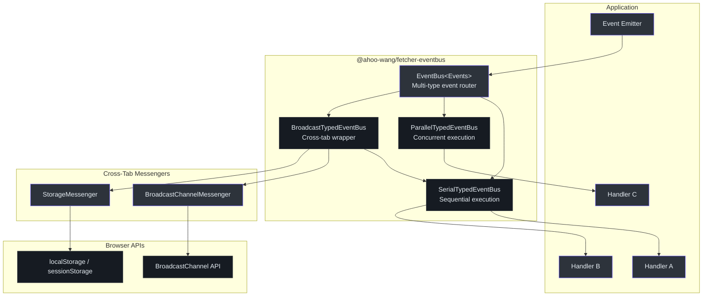
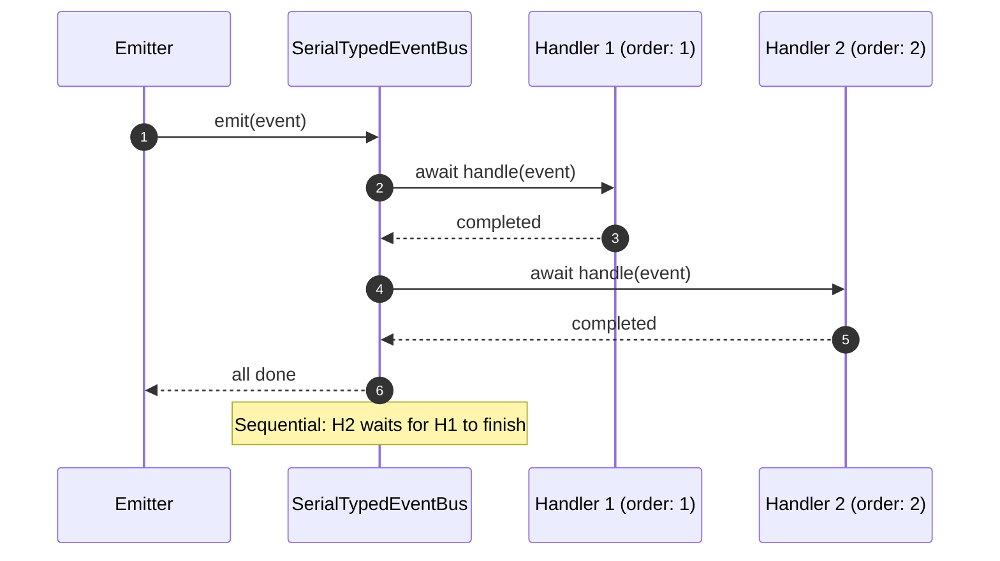
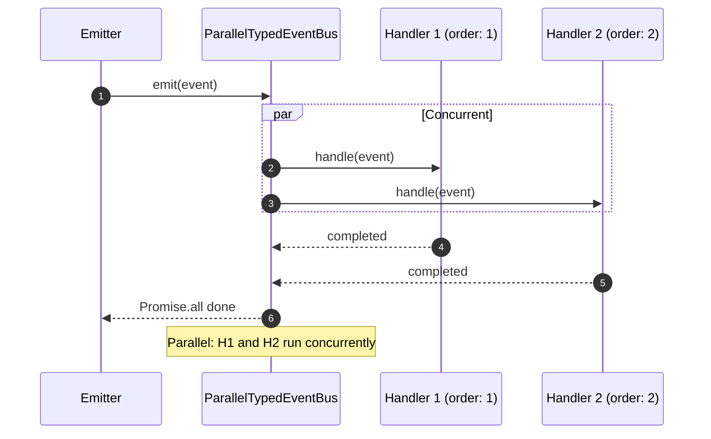
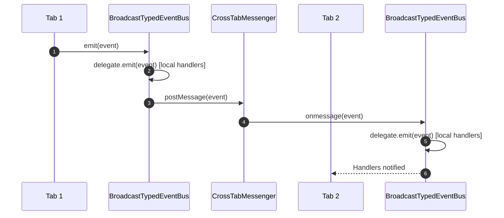
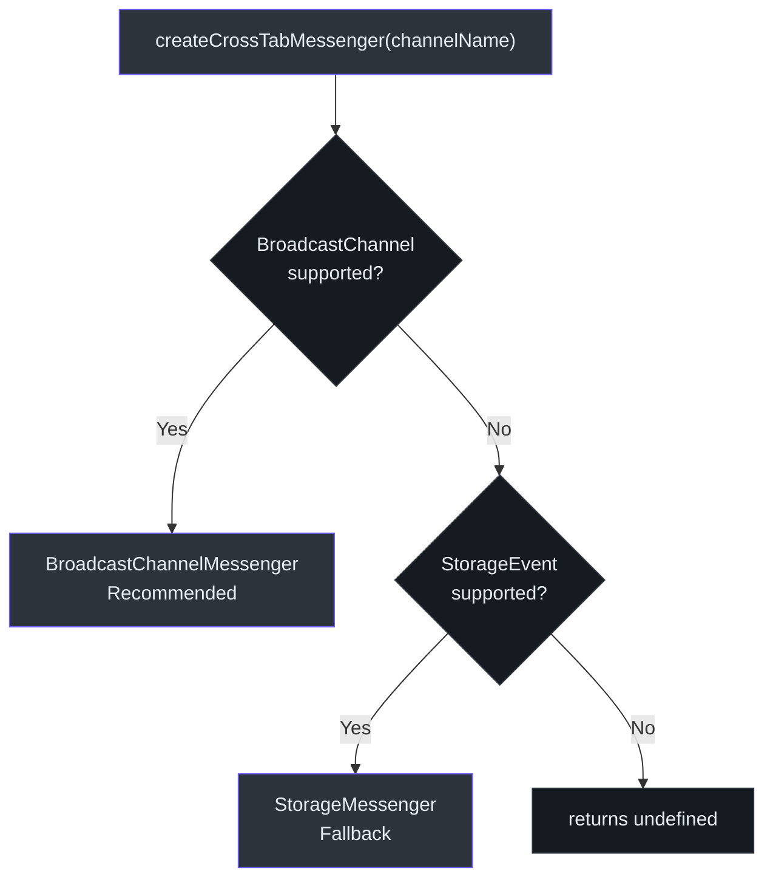
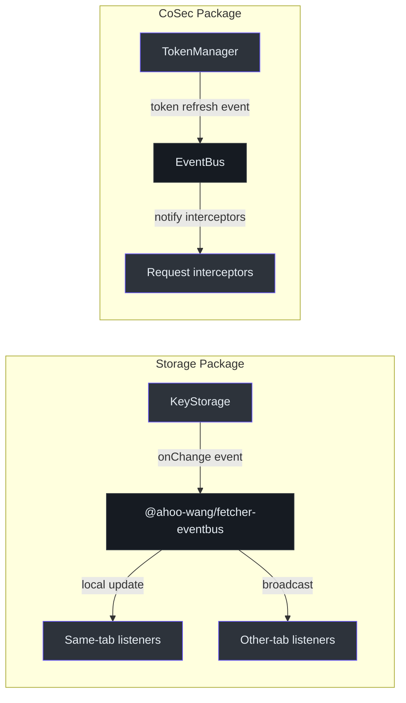

# @ahoo-wang/fetcher-eventbus

The `@ahoo-wang/fetcher-eventbus` package provides a generic, typed event bus system with three execution strategies: serial (sequential), parallel (concurrent), and broadcast (cross-tab). It is used by the [storage](./storage.md) and [cosec](./cosec.md) packages for reactive state change notifications and cross-tab synchronization.

**Source**: [`packages/eventbus/src/`](https://github.com/Ahoo-Wang/fetcher/blob/main/packages/eventbus/src/)

## Installation

```bash
pnpm add @ahoo-wang/fetcher-eventbus
```

## Architecture



## Core Interfaces

### EventHandler

Every handler implements the `EventHandler<EVENT>` interface. Handlers are uniquely identified by `name`, sorted by `order`, and optionally set to fire only `once`. ([`types.ts:19`](https://github.com/Ahoo-Wang/fetcher/blob/main/packages/eventbus/src/types.ts#L19))

```typescript
interface EventHandler<EVENT> {
  name: string;       // Unique identifier
  order: number;      // Execution priority (lower = earlier)
  once?: boolean;     // Auto-remove after first execution
  handle(event: EVENT): void | Promise<void>;
}
```

### TypedEventBus

The `TypedEventBus<EVENT>` interface defines the contract for event buses that handle a single event type. ([`typedEventBus.ts:21`](https://github.com/Ahoo-Wang/fetcher/blob/main/packages/eventbus/src/typedEventBus.ts#L21))

| Method | Description |
|--------|-------------|
| `on(handler)` | Register a handler (returns `false` if name already exists) |
| `off(name)` | Remove a handler by name |
| `emit(event)` | Dispatch event to all registered handlers |
| `destroy()` | Clean up all resources |

## Serial vs Parallel Execution





## SerialTypedEventBus

Executes handlers sequentially in priority order. Handlers with lower `order` values execute first. If a handler throws, subsequent handlers are not called. ([`serialTypedEventBus.ts:34`](https://github.com/Ahoo-Wang/fetcher/blob/main/packages/eventbus/src/serialTypedEventBus.ts#L34))

```typescript
import { SerialTypedEventBus } from '@ahoo-wang/fetcher-eventbus';

const bus = new SerialTypedEventBus<string>('user-created');

bus.on({
  name: 'audit-logger',
  order: 1,
  handle(userId) {
    console.log(`[AUDIT] User created: ${userId}`);
  },
});

bus.on({
  name: 'send-welcome-email',
  order: 2,
  handle(userId) {
    console.log(`[EMAIL] Sending welcome to: ${userId}`);
  },
});

bus.on({
  name: 'one-time-migration',
  order: 3,
  once: true,
  handle(userId) {
    console.log(`[MIGRATION] Migrated: ${userId}`);
    // Will be auto-removed after first execution
  },
});

await bus.emit('user-123');
// [AUDIT] User created: user-123
// [EMAIL] Sending welcome to: user-123
// [MIGRATION] Migrated: user-123
```

## ParallelTypedEventBus

Executes all handlers concurrently using `Promise.all`. Useful when handlers are independent and I/O-bound. ([`parallelTypedEventBus.ts:33`](https://github.com/Ahoo-Wang/fetcher/blob/main/packages/eventbus/src/parallelTypedEventBus.ts#L33))

```typescript
import { ParallelTypedEventBus } from '@ahoo-wang/fetcher-eventbus';

const bus = new ParallelTypedEventBus<Notification>('notification');

bus.on({
  name: 'push-notification',
  order: 1,
  handle(event) {
    return sendPushNotification(event); // async
  },
});

bus.on({
  name: 'email-notification',
  order: 2,
  handle(event) {
    return sendEmail(event); // async, runs in parallel with push
  },
});

await bus.emit({ message: 'Your order shipped!', userId: 'user-123' });
```

## EventBus (Multi-Type Router)

The `EventBus<Events>` class manages multiple event types using a type-safe mapping. It lazily creates `TypedEventBus` instances for each event type using a supplier function. ([`eventBus.ts:35`](https://github.com/Ahoo-Wang/fetcher/blob/main/packages/eventbus/src/eventBus.ts#L35))

```typescript
import { EventBus, SerialTypedEventBus } from '@ahoo-wang/fetcher-eventbus';

// Define event types with their data shapes
interface AppEvents {
  'user:login': { userId: string; timestamp: number };
  'user:logout': { userId: string };
  'order:created': { orderId: string; total: number };
}

// Create event bus with serial strategy
const bus = new EventBus<AppEvents>(
  (type) => new SerialTypedEventBus(type)
);

// Register handlers for different event types
bus.on('user:login', {
  name: 'track-login',
  order: 1,
  handle(event) {
    analytics.track('login', { userId: event.userId });
  },
});

bus.on('order:created', {
  name: 'send-confirmation',
  order: 1,
  handle(event) {
    sendOrderConfirmation(event.orderId);
  },
});

// Emit type-safe events
await bus.emit('user:login', { userId: 'u1', timestamp: Date.now() });
await bus.emit('order:created', { orderId: 'o1', total: 99.99 });
```

## BroadcastTypedEventBus (Cross-Tab)

`BroadcastTypedEventBus` wraps any `TypedEventBus` delegate and adds cross-tab/window broadcasting. When events are emitted, they are processed locally first, then broadcast to other browser contexts via a `CrossTabMessenger`. ([`broadcastTypedEventBus.ts:111`](https://github.com/Ahoo-Wang/fetcher/blob/main/packages/eventbus/src/broadcastTypedEventBus.ts#L111))



```typescript
import { BroadcastTypedEventBus, SerialTypedEventBus } from '@ahoo-wang/fetcher-eventbus';

// Create delegate bus
const delegate = new SerialTypedEventBus<string>('sync-events');

// Wrap with broadcasting
const bus = new BroadcastTypedEventBus({ delegate });

bus.on({
  name: 'update-ui',
  order: 1,
  handle(data) {
    console.log('Updating UI in this tab:', data);
  },
});

// This will trigger handlers in ALL open tabs
await bus.emit('theme-changed-to-dark');
```

## Cross-Tab Messengers

The package provides two messenger implementations for cross-tab communication, with automatic fallback: ([`messengers/crossTabMessenger.ts`](https://github.com/Ahoo-Wang/fetcher/blob/main/packages/eventbus/src/messengers/crossTabMessenger.ts))



| Messenger | API | Source |
|-----------|-----|--------|
| `BroadcastChannelMessenger` | `BroadcastChannel` | [`messengers/broadcastChannelMessenger.ts`](https://github.com/Ahoo-Wang/fetcher/blob/main/packages/eventbus/src/messengers/broadcastChannelMessenger.ts) |
| `StorageMessenger` | `localStorage` / `StorageEvent` | [`messengers/storageMessenger.ts`](https://github.com/Ahoo-Wang/fetcher/blob/main/packages/eventbus/src/messengers/storageMessenger.ts) |

```typescript
import { createCrossTabMessenger } from '@ahoo-wang/fetcher-eventbus';

// Auto-detect best available messenger
const messenger = createCrossTabMessenger('my-app-sync');
if (messenger) {
  messenger.onmessage = (data) => {
    console.log('Received from another tab:', data);
  };
  messenger.postMessage({ action: 'logout' });
}
```

## NameGenerator

The `DefaultNameGenerator` creates unique handler names by appending an incrementing counter to a prefix. ([`nameGenerator.ts:24`](https://github.com/Ahoo-Wang/fetcher/blob/main/packages/eventbus/src/nameGenerator.ts#L24))

```typescript
import { nameGenerator } from '@ahoo-wang/fetcher-eventbus';

const name1 = nameGenerator.generate('handler'); // "handler_1"
const name2 = nameGenerator.generate('handler'); // "handler_2"
```

## Use Cases in the Ecosystem



The [storage](./storage.md) package uses `BroadcastTypedEventBus` to synchronize storage changes across browser tabs. When a key's value changes in one tab, all other tabs are notified to update their cached values.

## Exported API Summary

| Export | Type | Source |
|--------|------|--------|
| `EventBus` | Class | [`eventBus.ts`](https://github.com/Ahoo-Wang/fetcher/blob/main/packages/eventbus/src/eventBus.ts) |
| `TypedEventBus` | Interface | [`typedEventBus.ts`](https://github.com/Ahoo-Wang/fetcher/blob/main/packages/eventbus/src/typedEventBus.ts) |
| `AbstractTypedEventBus` | Abstract Class | [`abstractTypedEventBus.ts`](https://github.com/Ahoo-Wang/fetcher/blob/main/packages/eventbus/src/abstractTypedEventBus.ts) |
| `SerialTypedEventBus` | Class | [`serialTypedEventBus.ts`](https://github.com/Ahoo-Wang/fetcher/blob/main/packages/eventbus/src/serialTypedEventBus.ts) |
| `ParallelTypedEventBus` | Class | [`parallelTypedEventBus.ts`](https://github.com/Ahoo-Wang/fetcher/blob/main/packages/eventbus/src/parallelTypedEventBus.ts) |
| `BroadcastTypedEventBus` | Class | [`broadcastTypedEventBus.ts`](https://github.com/Ahoo-Wang/fetcher/blob/main/packages/eventbus/src/broadcastTypedEventBus.ts) |
| `EventHandler` | Interface | [`types.ts`](https://github.com/Ahoo-Wang/fetcher/blob/main/packages/eventbus/src/types.ts) |
| `CrossTabMessenger` | Interface | [`messengers/crossTabMessenger.ts`](https://github.com/Ahoo-Wang/fetcher/blob/main/packages/eventbus/src/messengers/crossTabMessenger.ts) |
| `BroadcastChannelMessenger` | Class | [`messengers/broadcastChannelMessenger.ts`](https://github.com/Ahoo-Wang/fetcher/blob/main/packages/eventbus/src/messengers/broadcastChannelMessenger.ts) |
| `StorageMessenger` | Class | [`messengers/storageMessenger.ts`](https://github.com/Ahoo-Wang/fetcher/blob/main/packages/eventbus/src/messengers/storageMessenger.ts) |
| `createCrossTabMessenger` | Function | [`messengers/crossTabMessenger.ts`](https://github.com/Ahoo-Wang/fetcher/blob/main/packages/eventbus/src/messengers/crossTabMessenger.ts) |
| `nameGenerator` | Instance | [`nameGenerator.ts`](https://github.com/Ahoo-Wang/fetcher/blob/main/packages/eventbus/src/nameGenerator.ts) |

## Related Pages

- [Storage](./storage.md) - Uses EventBus for cross-tab storage synchronization
- [Fetcher (Core)](./fetcher.md) - Provides `NamedCapable` and `OrderedCapable` interfaces
- [React](./react.md) - Reactive hooks that consume event-driven updates
- [Packages Overview](./index.md) - All packages in the ecosystem
