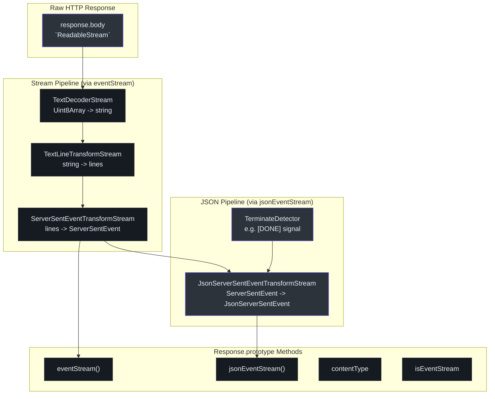
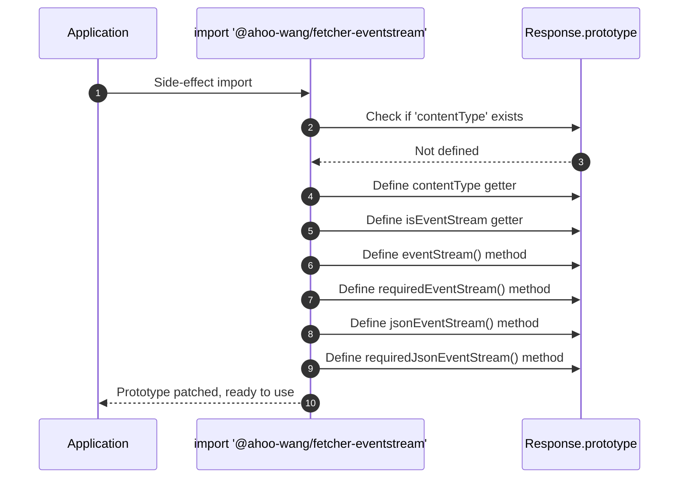
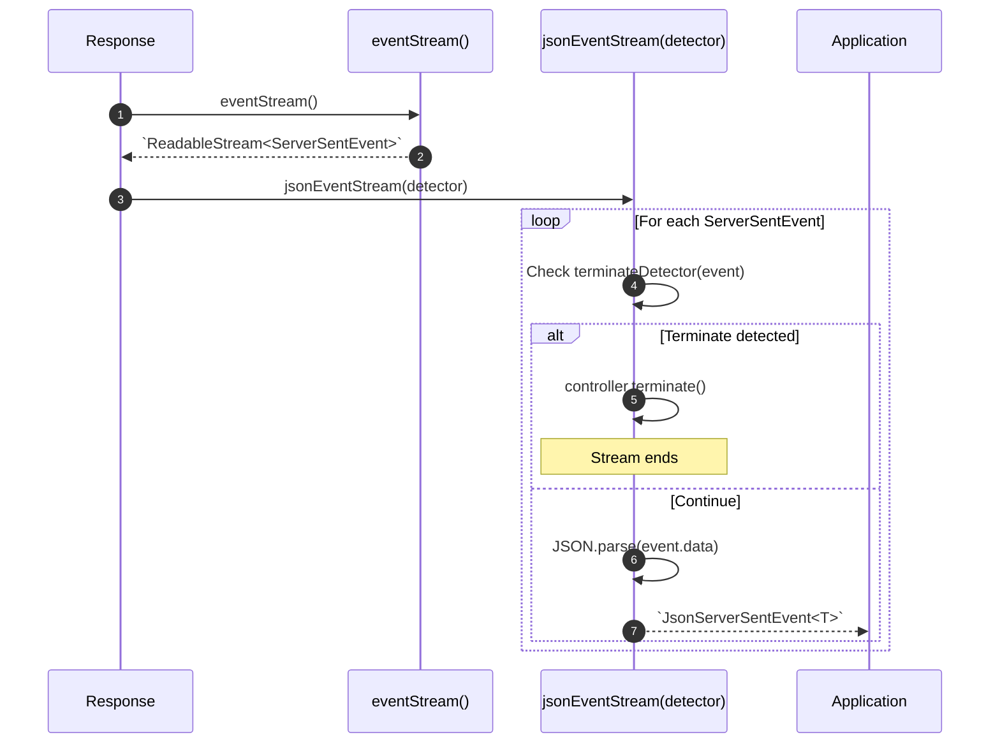
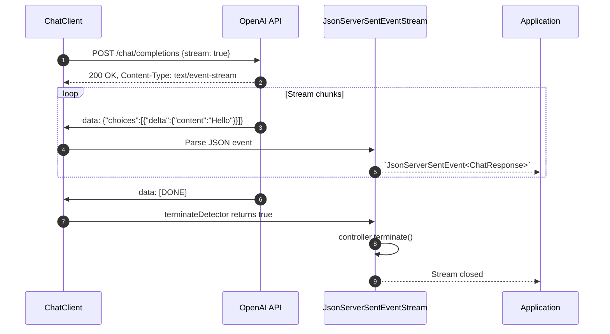

# @ahoo-wang/fetcher-eventstream

The `@ahoo-wang/fetcher-eventstream` package provides Server-Sent Events (SSE) processing and LLM streaming support for the Fetcher ecosystem. It uses a **side-effect import pattern**: simply importing the module patches `Response.prototype` with `eventStream()`, `jsonEventStream()`, and related methods. No explicit initialization is needed.

**Source**: [`packages/eventstream/src/`](https://github.com/Ahoo-Wang/fetcher/blob/main/packages/eventstream/src/)

## Installation

```bash
pnpm add @ahoo-wang/fetcher-eventstream
```

::: tip Side-Effect Import
Importing this package anywhere in your application automatically enables SSE support on all `Response` objects:

```typescript
import '@ahoo-wang/fetcher-eventstream'; // Side-effect: patches Response.prototype
```
:::

## Architecture



## How the Side-Effect Import Works

When `@ahoo-wang/fetcher-eventstream` is imported, it checks `typeof Response !== 'undefined'` and, if available, adds new properties and methods to `Response.prototype` using `Object.defineProperty`. The additions are idempotent -- each property is only defined once, guarded by `hasOwnProperty` checks. ([`responses.ts:102`](https://github.com/Ahoo-Wang/fetcher/blob/main/packages/eventstream/src/responses.ts#L102))



## Patched Response Methods

After import, every `Response` object gains these methods:

| Member | Type | Description |
|--------|------|-------------|
| `contentType` | `get string \| null` | Returns the `Content-Type` header value |
| `isEventStream` | `get boolean` | `true` if Content-Type includes `text/event-stream` |
| `eventStream()` | Method | Returns `ServerSentEventStream \| null` |
| `requiredEventStream()` | Method | Returns `ServerSentEventStream`, throws if not event stream |
| `jsonEventStream<D>(detector?)` | Method | Returns `JsonServerSentEventStream<D> \| null` |
| `requiredJsonEventStream<D>(detector?)` | Method | Returns `JsonServerSentEventStream<D>`, throws if not event stream |

**Source**: [`responses.ts:27`](https://github.com/Ahoo-Wang/fetcher/blob/main/packages/eventstream/src/responses.ts#L27)

## SSE Stream Processing Pipeline

The conversion from raw bytes to structured events happens through a chain of Web Streams:

```mermaid
flowchart LR
    subgraph sg_1 ["Step 1: Decode Bytes"]
        RAW["Uint8Array chunks"] --> TD["TextDecoderStream<br>(utf-8)"]
        TD --> STR["string chunks"]
    end

    subgraph sg_2 ["Step 2: Split Lines"]
        STR --> TL["TextLineTransformStream"]
        TL --> LINES["individual lines"]
    end

    subgraph sg_3 ["Step 3: Parse SSE"]
        LINES --> SSE_T["ServerSentEventTransformer"]
        SSE_T --> EVENTS["ServerSentEvent objects"]
    end

    subgraph sg_4 ["Step 4: Parse JSON (optional)"]
        EVENTS --> JSE["JsonServerSentEventTransform"]
        JSE --> JSON_EVENTS["JsonServerSentEvent objects"]
    end

    style RAW fill:#2d333b,stroke:#6d5dfc,color:#e6edf3
    style TD fill:#161b22,stroke:#30363d,color:#e6edf3
    style STR fill:#2d333b,stroke:#6d5dfc,color:#e6edf3
    style TL fill:#161b22,stroke:#30363d,color:#e6edf3
    style LINES fill:#2d333b,stroke:#6d5dfc,color:#e6edf3
    style SSE_T fill:#161b22,stroke:#30363d,color:#e6edf3
    style EVENTS fill:#2d333b,stroke:#6d5dfc,color:#e6edf3
    style JSE fill:#161b22,stroke:#30363d,color:#e6edf3
    style JSON_EVENTS fill:#2d333b,stroke:#6d5dfc,color:#e6edf3
```



### toServerSentEventStream

Converts a `Response` to a `ReadableStream<ServerSentEvent>` by piping through the full decoding pipeline. ([`eventStreamConverter.ts:127`](https://github.com/Ahoo-Wang/fetcher/blob/main/packages/eventstream/src/eventStreamConverter.ts#L127))

```typescript
import { toServerSentEventStream } from '@ahoo-wang/fetcher-eventstream';

const response = await fetch('/api/events');
const eventStream = toServerSentEventStream(response);

for await (const event of eventStream) {
  console.log(`Event: ${event.event}, Data: ${event.data}`);
}
```

## ServerSentEvent

The `ServerSentEvent` interface models the W3C Server-Sent Events format. ([`serverSentEventTransformStream.ts:23`](https://github.com/Ahoo-Wang/fetcher/blob/main/packages/eventstream/src/serverSentEventTransformStream.ts#L23))

| Property | Type | Description |
|----------|------|-------------|
| `event` | `string` | Event type (defaults to `"message"`) |
| `data` | `string` | Event data (multi-line data joined with `\n`) |
| `id` | `string?` | Event ID for reconnection |
| `retry` | `number?` | Reconnection interval in milliseconds |

```typescript
interface ServerSentEvent {
  id?: string;
  event: string;
  data: string;
  retry?: number;
}
```

## ServerSentEventTransformStream

A `TransformStream<string, ServerSentEvent>` that implements the SSE parsing algorithm from the W3C specification. ([`serverSentEventTransformStream.ts:277`](https://github.com/Ahoo-Wang/fetcher/blob/main/packages/eventstream/src/serverSentEventTransformStream.ts#L277))

Key parsing behaviors:
- Empty lines delimit events
- Lines starting with `:` are comments (ignored)
- Multi-line `data` fields are joined with `\n`
- `id` and `retry` persist across events within a connection
- The `event` field defaults to `"message"`

## JsonServerSentEventTransformStream

Extends the SSE pipeline to parse event data as JSON, with optional termination detection. ([`jsonServerSentEventTransformStream.ts:130`](https://github.com/Ahoo-Wang/fetcher/blob/main/packages/eventstream/src/jsonServerSentEventTransformStream.ts#L130))

```typescript
interface JsonServerSentEvent<DATA> {
  event: string;
  data: DATA;       // Parsed JSON instead of raw string
  id?: string;
  retry?: number;
}
```

### TerminateDetector

A function that determines when a stream should terminate. This is critical for LLM streaming, where the API sends a `[DONE]` signal. ([`jsonServerSentEventTransformStream.ts:33`](https://github.com/Ahoo-Wang/fetcher/blob/main/packages/eventstream/src/jsonServerSentEventTransformStream.ts#L33))

```typescript
type TerminateDetector = (event: ServerSentEvent) => boolean;

// OpenAI uses this pattern
const doneDetector: TerminateDetector = (event) => event.data === '[DONE]';
```



## Result Extractors for Fetcher

The package provides two result extractors that integrate directly with the [Fetcher](./fetcher.md) result extraction system. ([`eventStreamResultExtractor.ts`](https://github.com/Ahoo-Wang/fetcher/blob/main/packages/eventstream/src/eventStreamResultExtractor.ts))

| Extractor | Returns | Use Case |
|-----------|---------|----------|
| `EventStreamResultExtractor` | `ServerSentEventStream` | Raw SSE events (string data) |
| `JsonEventStreamResultExtractor` | `JsonServerSentEventStream<any>` | Parsed JSON events |

```typescript
import { fetcher } from '@ahoo-wang/fetcher';
import '@ahoo-wang/fetcher-eventstream'; // Side-effect import
import { JsonEventStreamResultExtractor } from '@ahoo-wang/fetcher-eventstream';

const stream = await fetcher.post(
  '/chat/completions',
  {
    body: {
      model: 'gpt-4',
      messages: [{ role: 'user', content: 'Hello!' }],
      stream: true,
    },
  },
  { resultExtractor: JsonEventStreamResultExtractor },
);

for await (const chunk of stream) {
  process.stdout.write(chunk.data.choices[0]?.delta?.content || '');
}
```

## LLM Streaming Use Case

The primary use case for this package is streaming responses from LLM APIs (OpenAI, etc.) where responses arrive token-by-token as SSE events. The [openai](./openai.md) package builds directly on this functionality.



## EventStreamConvertError

Thrown when converting a `Response` to an event stream fails. Extends `FetcherError` from the core package. ([`eventStreamConverter.ts:54`](https://github.com/Ahoo-Wang/fetcher/blob/main/packages/eventstream/src/eventStreamConverter.ts#L54))

```typescript
try {
  const stream = response.requiredEventStream();
} catch (error) {
  if (error instanceof EventStreamConvertError) {
    console.error('Status:', error.response.status);
    console.error('Content-Type:', error.response.contentType);
    console.error('Message:', error.message);
  }
}
```

## Exported API Summary

| Export | Type | Source |
|--------|------|--------|
| `toServerSentEventStream` | Function | [`eventStreamConverter.ts`](https://github.com/Ahoo-Wang/fetcher/blob/main/packages/eventstream/src/eventStreamConverter.ts) |
| `toJsonServerSentEventStream` | Function | [`jsonServerSentEventTransformStream.ts`](https://github.com/Ahoo-Wang/fetcher/blob/main/packages/eventstream/src/jsonServerSentEventTransformStream.ts) |
| `ServerSentEvent` | Interface | [`serverSentEventTransformStream.ts`](https://github.com/Ahoo-Wang/fetcher/blob/main/packages/eventstream/src/serverSentEventTransformStream.ts) |
| `ServerSentEventStream` | Type | [`eventStreamConverter.ts`](https://github.com/Ahoo-Wang/fetcher/blob/main/packages/eventstream/src/eventStreamConverter.ts) |
| `ServerSentEventTransformStream` | Class | [`serverSentEventTransformStream.ts`](https://github.com/Ahoo-Wang/fetcher/blob/main/packages/eventstream/src/serverSentEventTransformStream.ts) |
| `ServerSentEventTransformer` | Class | [`serverSentEventTransformStream.ts`](https://github.com/Ahoo-Wang/fetcher/blob/main/packages/eventstream/src/serverSentEventTransformStream.ts) |
| `JsonServerSentEvent` | Interface | [`jsonServerSentEventTransformStream.ts`](https://github.com/Ahoo-Wang/fetcher/blob/main/packages/eventstream/src/jsonServerSentEventTransformStream.ts) |
| `JsonServerSentEventStream` | Type | [`jsonServerSentEventTransformStream.ts`](https://github.com/Ahoo-Wang/fetcher/blob/main/packages/eventstream/src/jsonServerSentEventTransformStream.ts) |
| `JsonServerSentEventTransformStream` | Class | [`jsonServerSentEventTransformStream.ts`](https://github.com/Ahoo-Wang/fetcher/blob/main/packages/eventstream/src/jsonServerSentEventTransformStream.ts) |
| `TerminateDetector` | Type | [`jsonServerSentEventTransformStream.ts`](https://github.com/Ahoo-Wang/fetcher/blob/main/packages/eventstream/src/jsonServerSentEventTransformStream.ts) |
| `EventStreamResultExtractor` | Function | [`eventStreamResultExtractor.ts`](https://github.com/Ahoo-Wang/fetcher/blob/main/packages/eventstream/src/eventStreamResultExtractor.ts) |
| `JsonEventStreamResultExtractor` | Function | [`eventStreamResultExtractor.ts`](https://github.com/Ahoo-Wang/fetcher/blob/main/packages/eventstream/src/eventStreamResultExtractor.ts) |
| `EventStreamConvertError` | Class | [`eventStreamConverter.ts`](https://github.com/Ahoo-Wang/fetcher/blob/main/packages/eventstream/src/eventStreamConverter.ts) |
| `TextLineTransformStream` | Class | [`textLineTransformStream.ts`](https://github.com/Ahoo-Wang/fetcher/blob/main/packages/eventstream/src/textLineTransformStream.ts) |

## Related Pages

- [OpenAI](./openai.md) - Uses this package for streaming chat completions
- [Fetcher (Core)](./fetcher.md) - Base HTTP client and result extractor pattern
- [Decorator](./decorator.md) - Can be combined with stream-aware result extractors
- [Packages Overview](./index.md) - All packages in the ecosystem
