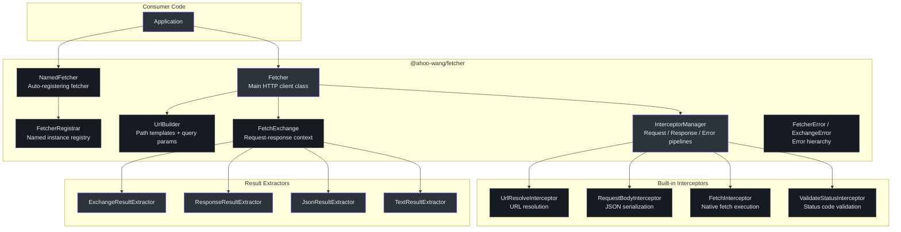
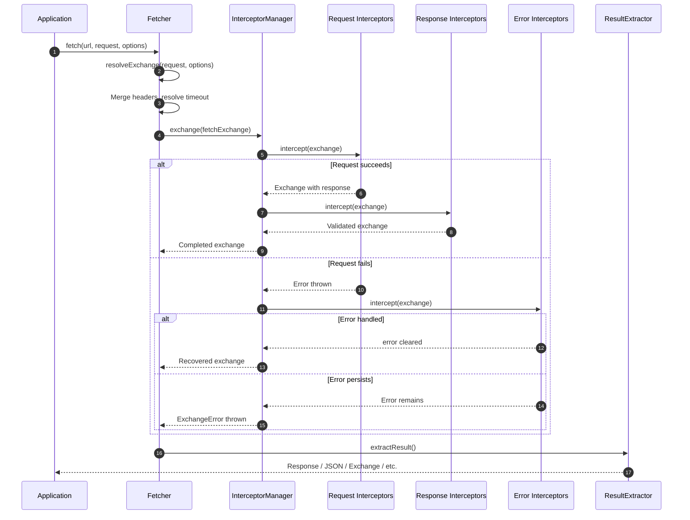
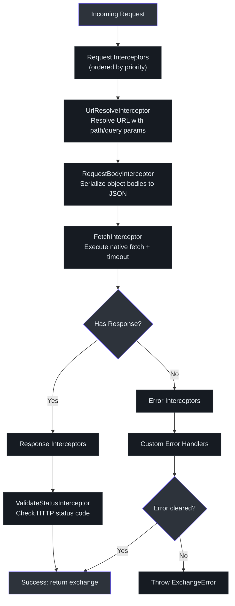
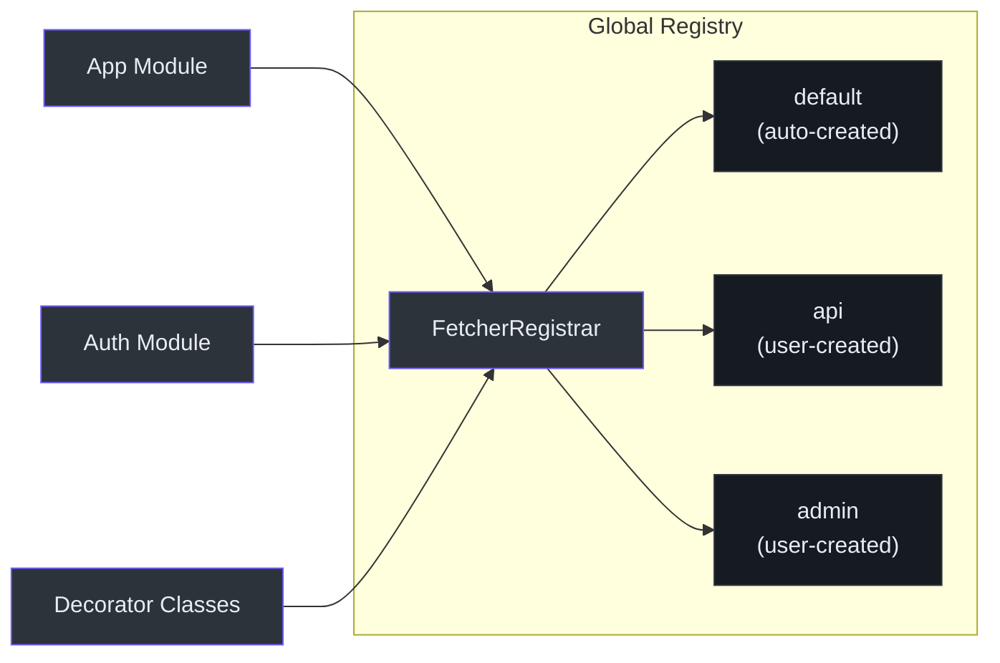
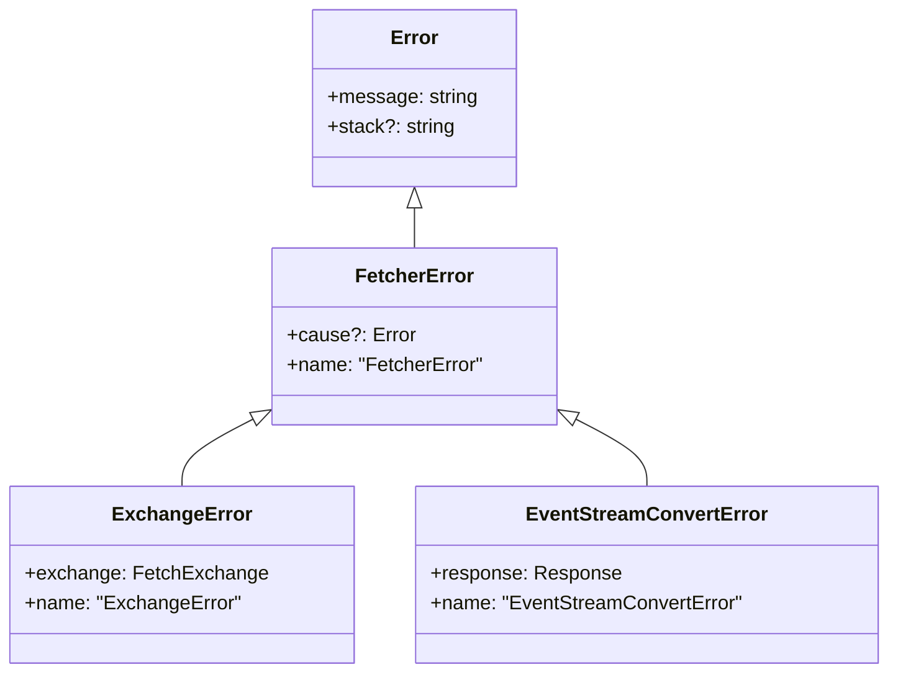

# @ahoo-wang/fetcher

The `@ahoo-wang/fetcher` package is the foundation of the Fetcher ecosystem. It provides a flexible HTTP client built on the native Fetch API with an interceptor pipeline, URL template building, timeout management, and a named fetcher registry. All other packages depend on this core module.

**Source**: [`packages/fetcher/src/`](https://github.com/Ahoo-Wang/fetcher/blob/main/packages/fetcher/src/)

## Installation

```bash
pnpm add @ahoo-wang/fetcher
```

## Architecture



## Request Lifecycle

Every HTTP request flows through the same pipeline, managed by the `InterceptorManager`:



## Fetcher

The `Fetcher` class is the main HTTP client. It wraps the native `fetch()` API with default headers, a `UrlBuilder`, timeout control, and a full interceptor pipeline. ([`fetcher.ts:123`](https://github.com/Ahoo-Wang/fetcher/blob/main/packages/fetcher/src/fetcher.ts#L123))

### Creating a Fetcher Instance

```typescript
import { Fetcher, ResultExtractors } from '@ahoo-wang/fetcher';

const fetcher = new Fetcher({
  baseURL: 'https://api.example.com',
  headers: { 'Content-Type': 'application/json' },
  timeout: 5000,
});
```

### Making Requests

```typescript
// GET with path and query parameters
const users = await fetcher.get('/users/{id}', {
  urlParams: {
    path: { id: 123 },
    query: { include: 'profile' },
  },
});

// POST with JSON body
const created = await fetcher.post('/users', {
  body: { name: 'John', email: 'john@example.com' },
});

// Override result extractor to get JSON directly
const data = await fetcher.get<User[]>('/users', {}, {
  resultExtractor: ResultExtractors.Json,
});
```

### FetcherOptions

| Property | Type | Default | Description |
|----------|------|---------|-------------|
| `baseURL` | `string` | `''` | Base URL prepended to all requests |
| `headers` | `RequestHeaders` | `{ 'Content-Type': 'application/json' }` | Default headers for all requests |
| `timeout` | `number` | `undefined` | Default timeout in milliseconds |
| `urlTemplateStyle` | `UrlTemplateStyle` | `Path` | URL template syntax (`Path` for `:id`, `UriTemplate` for `{id}`) |
| `interceptors` | `InterceptorManager` | Built-in pipeline | Custom interceptor manager |
| `validateStatus` | `ValidateStatus` | `status >= 200 && status < 300` | Status code validation function |

**Source**: [`fetcher.ts:51`](https://github.com/Ahoo-Wang/fetcher/blob/main/packages/fetcher/src/fetcher.ts#L51)

### HTTP Methods

The `Fetcher` class exposes convenience methods for all standard HTTP verbs:

| Method | Signature | Body Allowed |
|--------|-----------|-------------|
| `get` | `get<R>(url, request?, options?)` | No |
| `post` | `post<R>(url, request?, options?)` | Yes |
| `put` | `put<R>(url, request?, options?)` | Yes |
| `patch` | `patch<R>(url, request?, options?)` | Yes |
| `delete` | `del<R>(url, request?, options?)` | No |
| `head` | `head<R>(url, request?, options?)` | No |
| `options` | `options<R>(url, request?, options?)` | No |
| `trace` | `trace<R>(url, request?, options?)` | No |

**Source**: [`fetcher.ts:325-500`](https://github.com/Ahoo-Wang/fetcher/blob/main/packages/fetcher/src/fetcher.ts#L325)

## Interceptor Pipeline

The interceptor system is the core extensibility mechanism. It processes requests through three ordered phases: request, response, and error.



### Built-in Interceptors

| Interceptor | Phase | Order | Source |
|-------------|-------|-------|--------|
| `RequestBodyInterceptor` | Request | Very early | [`requestBodyInterceptor.ts`](https://github.com/Ahoo-Wang/fetcher/blob/main/packages/fetcher/src/requestBodyInterceptor.ts) |
| `UrlResolveInterceptor` | Request | Very late | [`urlResolveInterceptor.ts`](https://github.com/Ahoo-Wang/fetcher/blob/main/packages/fetcher/src/urlResolveInterceptor.ts) |
| `FetchInterceptor` | Request | Latest | [`fetchInterceptor.ts`](https://github.com/Ahoo-Wang/fetcher/blob/main/packages/fetcher/src/fetchInterceptor.ts) |
| `ValidateStatusInterceptor` | Response | Default | [`validateStatusInterceptor.ts`](https://github.com/Ahoo-Wang/fetcher/blob/main/packages/fetcher/src/validateStatusInterceptor.ts) |

### Custom Interceptors

```typescript
import type { Interceptor, FetchExchange } from '@ahoo-wang/fetcher';

// Request interceptor: add authorization header
const authInterceptor: Interceptor = {
  name: 'AuthInterceptor',
  order: 100,
  intercept(exchange: FetchExchange) {
    exchange.ensureRequestHeaders()['Authorization'] = `Bearer ${getToken()}`;
  },
};

// Error interceptor: retry on 503
const retryInterceptor: Interceptor = {
  name: 'RetryInterceptor',
  order: 100,
  async intercept(exchange: FetchExchange) {
    if (exchange.error?.response?.status === 503) {
      // Retry the request
      const response = await fetch(exchange.request);
      exchange.response = response;
      exchange.error = undefined; // Clear error
    }
  },
};

// Register interceptors
fetcher.interceptors.request.use(authInterceptor);
fetcher.interceptors.error.use(retryInterceptor);
```

**Source**: [`interceptor.ts:44`](https://github.com/Ahoo-Wang/fetcher/blob/main/packages/fetcher/src/interceptor.ts#L44)

## UrlBuilder

Handles URL composition with path parameter interpolation and query string generation. Supports two template styles:

- **`UrlTemplateStyle.Path`**: Express-style `:id` parameters
- **`UrlTemplateStyle.UriTemplate`**: RFC 6570 `{id}` parameters

```typescript
import { UrlBuilder, UrlTemplateStyle } from '@ahoo-wang/fetcher';

const builder = new UrlBuilder('https://api.example.com');

// URI Template style (default)
const url1 = builder.build('/users/{id}/posts/{postId}', {
  path: { id: 123, postId: 456 },
  query: { filter: 'active', limit: 10 },
});
// => https://api.example.com/users/123/posts/456?filter=active&limit=10

// Express style
const expressBuilder = new UrlBuilder(
  'https://api.example.com',
  UrlTemplateStyle.Path,
);
const url2 = expressBuilder.build('/users/:id', { path: { id: 789 } });
// => https://api.example.com/users/789
```

**Source**: [`urlBuilder.ts:72`](https://github.com/Ahoo-Wang/fetcher/blob/main/packages/fetcher/src/urlBuilder.ts#L72)

## FetchExchange

The `FetchExchange` is the context object that flows through the entire interceptor chain. It carries the request, response, error, result extractor, and shared attributes. ([`fetchExchange.ts:105`](https://github.com/Ahoo-Wang/fetcher/blob/main/packages/fetcher/src/fetchExchange.ts#L105))

| Property | Type | Description |
|----------|------|-------------|
| `fetcher` | `Fetcher` | The originating fetcher instance |
| `request` | `FetchRequest` | Full request configuration |
| `response` | `Response \| undefined` | HTTP response (set by `FetchInterceptor`) |
| `error` | `Error \| undefined` | Error if the request failed |
| `resultExtractor` | `ResultExtractor<any>` | Function to extract the final result |
| `attributes` | `Map<string, any>` | Shared data map for cross-interceptor communication |

```typescript
// Access attributes in interceptors
const timingInterceptor: Interceptor = {
  name: 'TimingInterceptor',
  order: 100,
  intercept(exchange: FetchExchange) {
    exchange.attributes.set('startTime', Date.now());
  },
};

// Read in a later interceptor
const logInterceptor: Interceptor = {
  name: 'LogInterceptor',
  order: 200,
  intercept(exchange: FetchExchange) {
    const elapsed = Date.now() - exchange.attributes.get('startTime');
    console.log(`${exchange.request.url} took ${elapsed}ms`);
  },
};
```

## Result Extractors

Result extractors control what the `fetcher.get()`, `fetcher.post()`, etc. methods return. By default, convenience methods return the raw `Response` object. ([`resultExtractor.ts`](https://github.com/Ahoo-Wang/fetcher/blob/main/packages/fetcher/src/resultExtractor.ts))

| Extractor | Returns | Use Case |
|-----------|---------|----------|
| `ResultExtractors.Exchange` | `FetchExchange` | Access to full request/response context |
| `ResultExtractors.Response` | `Response` | Raw response object (default for `.fetch()`) |
| `ResultExtractors.Json` | `Promise<any>` | Parsed JSON body |
| `ResultExtractors.Text` | `Promise<string>` | Response body as text |
| `ResultExtractors.Blob` | `Promise<Blob>` | Binary data (images, files) |
| `ResultExtractors.ArrayBuffer` | `Promise<ArrayBuffer>` | Raw binary buffer |
| `ResultExtractors.Bytes` | `Promise<Uint8Array>` | Byte array |

```typescript
// Default: returns Response
const response = await fetcher.get('/users');

// Override: get parsed JSON directly
const users = await fetcher.get<User[]>(
  '/users',
  {},
  { resultExtractor: ResultExtractors.Json },
);

// Custom extractor
const statusOnly = async (exchange: FetchExchange) => {
  return exchange.requiredResponse.status;
};
const status = await fetcher.get('/health', {}, {
  resultExtractor: statusOnly,
});
```

## NamedFetcher and FetcherRegistrar

`NamedFetcher` extends `Fetcher` and automatically registers itself in the global `FetcherRegistrar`. This is the mechanism used by the [decorator](./decorator.md) package to resolve which fetcher instance to use for each API class. ([`namedFetcher.ts:38`](https://github.com/Ahoo-Wang/fetcher/blob/main/packages/fetcher/src/namedFetcher.ts#L38), [`fetcherRegistrar.ts:41`](https://github.com/Ahoo-Wang/fetcher/blob/main/packages/fetcher/src/fetcherRegistrar.ts#L41))



```typescript
import {
  NamedFetcher,
  fetcherRegistrar,
  fetcher,
} from '@ahoo-wang/fetcher';

// A default fetcher is pre-created and registered
console.log(fetcher === fetcherRegistrar.default); // true

// Create named fetchers with different configurations
const apiFetcher = new NamedFetcher('api', {
  baseURL: 'https://api.example.com',
  timeout: 5000,
});

const adminFetcher = new NamedFetcher('admin', {
  baseURL: 'https://admin.example.com',
  headers: { 'X-Admin-Key': 'secret' },
});

// Retrieve by name from anywhere in the app
const f = fetcherRegistrar.get('api');
await f?.get('/users');

// The decorator package uses this automatically:
// @api('/users', { fetcher: 'api' })
// class UserService { ... }
```

## Error Classes

The error hierarchy provides structured error information including the failed exchange context.



| Error Class | Description | Key Property |
|-------------|-------------|-------------|
| `FetcherError` | Base error for all fetcher errors | `cause` - underlying error |
| `ExchangeError` | Thrown when interceptor pipeline fails | `exchange` - full exchange context |

**Source**: [`fetcherError.ts:37`](https://github.com/Ahoo-Wang/fetcher/blob/main/packages/fetcher/src/fetcherError.ts#L37)

```typescript
try {
  await fetcher.get('/api/users');
} catch (error) {
  if (error instanceof ExchangeError) {
    console.log('Request URL:', error.exchange.request.url);
    console.log('Request method:', error.exchange.request.method);
    console.log('Underlying error:', error.exchange.error);
  }
}
```

## Type Utilities

The package also exports several TypeScript utility types used across the ecosystem:

| Type | Description | Source |
|------|-------------|--------|
| `PartialBy<T, K>` | Makes specified keys optional | [`types.ts:33`](https://github.com/Ahoo-Wang/fetcher/blob/main/packages/fetcher/src/types.ts#L33) |
| `RequiredBy<T, K>` | Makes specified keys required | [`types.ts:52`](https://github.com/Ahoo-Wang/fetcher/blob/main/packages/fetcher/src/types.ts#L52) |
| `RemoveReadonlyFields<T>` | Strips readonly properties | [`types.ts:85`](https://github.com/Ahoo-Wang/fetcher/blob/main/packages/fetcher/src/types.ts#L85) |
| `NamedCapable` | Interface with `name: string` | [`types.ts:141`](https://github.com/Ahoo-Wang/fetcher/blob/main/packages/fetcher/src/types.ts#L141) |
| `OrderedCapable` | Interface with `order: number` | [`orderedCapable.ts`](https://github.com/Ahoo-Wang/fetcher/blob/main/packages/fetcher/src/orderedCapable.ts) |
| `HttpMethod` | Enum of HTTP verbs | [`fetchRequest.ts:37`](https://github.com/Ahoo-Wang/fetcher/blob/main/packages/fetcher/src/fetchRequest.ts#L37) |

## Global Response Enhancement

The package augments the global `Response` interface with a generic `json<T>()` method for type-safe JSON parsing:

```typescript
interface User { id: number; name: string; }

const response = await fetcher.get('/users/1');
const user = await response.json<User>();
console.log(user.name); // TypeScript infers `string`
```

**Source**: [`types.ts:162`](https://github.com/Ahoo-Wang/fetcher/blob/main/packages/fetcher/src/types.ts#L162)

## Exported API Summary

| Export | Type | Source |
|--------|------|--------|
| `Fetcher` | Class | [`fetcher.ts`](https://github.com/Ahoo-Wang/fetcher/blob/main/packages/fetcher/src/fetcher.ts) |
| `NamedFetcher` | Class | [`namedFetcher.ts`](https://github.com/Ahoo-Wang/fetcher/blob/main/packages/fetcher/src/namedFetcher.ts) |
| `FetcherRegistrar` | Class | [`fetcherRegistrar.ts`](https://github.com/Ahoo-Wang/fetcher/blob/main/packages/fetcher/src/fetcherRegistrar.ts) |
| `fetcherRegistrar` | Instance | [`fetcherRegistrar.ts`](https://github.com/Ahoo-Wang/fetcher/blob/main/packages/fetcher/src/fetcherRegistrar.ts) |
| `fetcher` | Instance | [`namedFetcher.ts`](https://github.com/Ahoo-Wang/fetcher/blob/main/packages/fetcher/src/namedFetcher.ts) |
| `InterceptorManager` | Class | [`interceptorManager.ts`](https://github.com/Ahoo-Wang/fetcher/blob/main/packages/fetcher/src/interceptorManager.ts) |
| `InterceptorRegistry` | Class | [`interceptor.ts`](https://github.com/Ahoo-Wang/fetcher/blob/main/packages/fetcher/src/interceptor.ts) |
| `Interceptor` | Interface | [`interceptor.ts`](https://github.com/Ahoo-Wang/fetcher/blob/main/packages/fetcher/src/interceptor.ts) |
| `FetchExchange` | Class | [`fetchExchange.ts`](https://github.com/Ahoo-Wang/fetcher/blob/main/packages/fetcher/src/fetchExchange.ts) |
| `FetcherError` | Class | [`fetcherError.ts`](https://github.com/Ahoo-Wang/fetcher/blob/main/packages/fetcher/src/fetcherError.ts) |
| `ExchangeError` | Class | [`fetcherError.ts`](https://github.com/Ahoo-Wang/fetcher/blob/main/packages/fetcher/src/fetcherError.ts) |
| `UrlBuilder` | Class | [`urlBuilder.ts`](https://github.com/Ahoo-Wang/fetcher/blob/main/packages/fetcher/src/urlBuilder.ts) |
| `ResultExtractors` | Object | [`resultExtractor.ts`](https://github.com/Ahoo-Wang/fetcher/blob/main/packages/fetcher/src/resultExtractor.ts) |
| `FetcherOptions` | Interface | [`fetcher.ts`](https://github.com/Ahoo-Wang/fetcher/blob/main/packages/fetcher/src/fetcher.ts) |
| `FetchRequest` | Interface | [`fetchRequest.ts`](https://github.com/Ahoo-Wang/fetcher/blob/main/packages/fetcher/src/fetchRequest.ts) |
| `HttpMethod` | Enum | [`fetchRequest.ts`](https://github.com/Ahoo-Wang/fetcher/blob/main/packages/fetcher/src/fetchRequest.ts) |

## Related Pages

- [Decorator](./decorator.md) - Build declarative API services on top of Fetcher
- [EventStream](./eventstream.md) - Add SSE and LLM streaming via side-effect import
- [EventBus](./eventbus.md) - Typed event system using fetcher utilities
- [Packages Overview](./index.md) - All packages in the ecosystem
