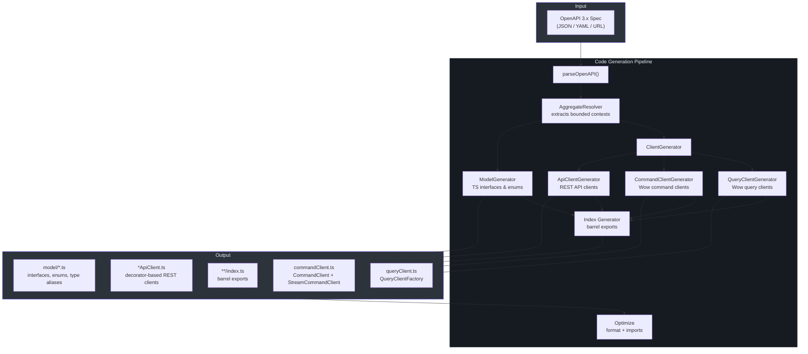
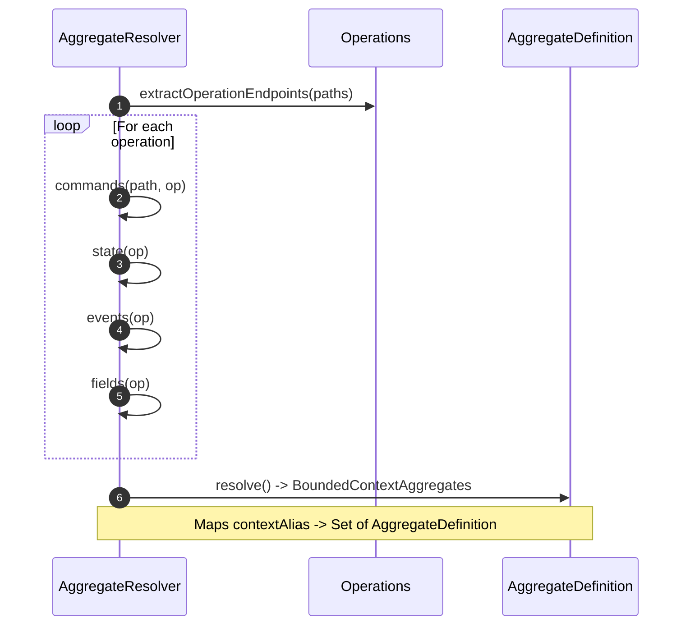
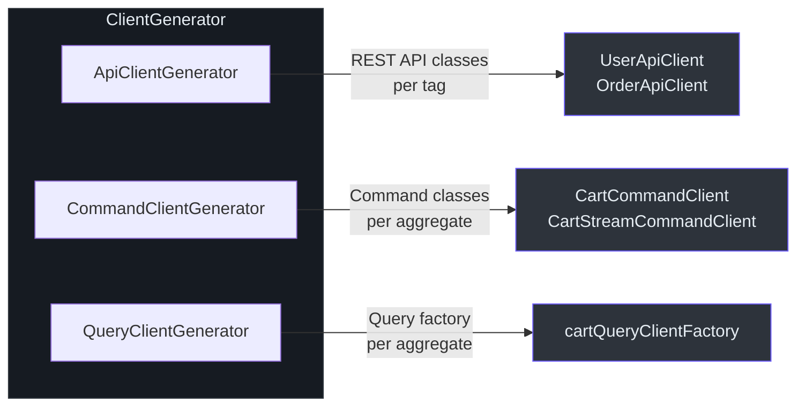

# @ahoo-wang/fetcher-generator

The `@ahoo-wang/fetcher-generator` package is a CLI tool that reads OpenAPI 3.x specifications (JSON, YAML, or URL) and generates fully typed TypeScript code -- model interfaces/enums, decorator-based API clients, and Wow CQRS-specific command/query clients. Built on [ts-morph](https://ts-morph.com/) for code generation and [commander](https://github.com/tj/commander.js) for CLI parsing.

## Installation

```bash
pnpm add -D @ahoo-wang/fetcher-generator
```

## Architecture Overview



## CLI Usage

The `fetcher-generator` binary reads an OpenAPI spec and writes TypeScript source files into an output directory.

### Commands

| Command | Description |
|---------|-------------|
| `generate` | Generate TypeScript code from an OpenAPI specification |
| `-v, --version` | Show version |

### Generate Options

| Option | Short | Required | Default | Description |
|--------|-------|----------|---------|-------------|
| `--input <file>` | `-i` | Yes | -- | OpenAPI spec file path or URL |
| `--output <path>` | `-o` | No | `src/generated` | Output directory |
| `--config <file>` | `-c` | No | `./fetcher-generator.config.json` | Configuration file path |
| `--ts-config-file-path <file>` | `-t` | No | -- | TypeScript configuration file |

### Example CLI Commands

```bash
# Generate from a local YAML spec
npx fetcher-generator generate -i ./openapi.yaml -o ./src/generated

# Generate from a remote URL
npx fetcher-generator generate -i https://api.example.com/v3/api-docs -o ./src/generated

# Generate with a custom config and tsconfig
npx fetcher-generator generate -i ./spec.json -o ./src/api -c ./generator.config.json -t ./tsconfig.json
```

Source: [packages/generator/src/cli.ts](https://github.com/Ahoo-Wang/fetcher/blob/main/packages/generator/src/cli.ts)

## Configuration

The generator reads an optional JSON configuration file (default `./fetcher-generator.config.json`):

```typescript
// GeneratorConfiguration
{
  "apiClients": {
    "TagName": {
      "ignorePathParameters": ["tenantId", "ownerId"]
    }
  }
}
```

By default, `tenantId` and `ownerId` path parameters are ignored when generating API client methods, since they are handled by the [CoSec resource attribution interceptor](./cosec.md#resource-attribution).

Source: [packages/generator/src/types.ts:73-87](https://github.com/Ahoo-Wang/fetcher/blob/main/packages/generator/src/types.ts#L73-L87)

## Code Generation Pipeline

### Step 1 -- Parse OpenAPI Specification

The `CodeGenerator` parses the input spec (JSON, YAML, or URL) into a typed `OpenAPI` object. It supports file paths and HTTP/HTTPS URLs.

Source: [packages/generator/src/index.ts:45-142](https://github.com/Ahoo-Wang/fetcher/blob/main/packages/generator/src/index.ts#L45-L142)

### Step 2 -- Resolve Bounded Context Aggregates

The `AggregateResolver` walks all operations to extract Wow bounded context aggregate definitions. It identifies:

- **Commands** -- operations with `wow.CommandOk` response schemas
- **State** -- snapshot state query operations (`.snapshot_state.single`)
- **Events** -- event stream list queries (`.event.list_query`)
- **Fields** -- snapshot count operations (`.snapshot.count`)



Source: [packages/generator/src/aggregate/aggregateResolver.ts:52-289](https://github.com/Ahoo-Wang/fetcher/blob/main/packages/generator/src/aggregate/aggregateResolver.ts#L52-L289)

### OpenAPI Specification Conventions

For the generator to correctly recognize Wow patterns, your OpenAPI spec must follow these conventions:

#### operationId Suffixes

The generator identifies operation types by their `operationId` suffix:

| Operation Type | Required Suffix | Generated Client |
|----------------|----------------|-----------------|
| **State Snapshot** | `.snapshot_state.single` | `SnapshotQueryClient` |
| **Event Query** | `.event.list_query` | `EventStreamQueryClient` |
| **Count Query** | `.snapshot.count` | `LoadStateAggregateClient` |
| **Command** | (no suffix required) | `CommandClient` |

```yaml
# Example: shop.cart aggregate operations
paths:
  /cart/{ownerId}/snapshot_state/single:
    get:
      operationId: shop.cart.snapshot_state.single  # 3-part: context.aggregate.suffix
      tags: [shop.cart]                              # tag must be context.aggregate
  /cart/{ownerId}/event/list_query:
    get:
      operationId: shop.cart.event.list_query
      tags: [shop.cart]
  /cart/{ownerId}/{aggregateId}/snapshot/count:
    get:
      operationId: shop.cart.snapshot.count
      tags: [shop.cart]
  /cart/{ownerId}/{aggregateId}/{commandName}:
    post:
      operationId: shop.cart.add_item               # 3-part: context.aggregate.command
      tags: [shop.cart]
      responses:
        '200':
          $ref: '#/components/responses/wow.CommandOk'  # response-level $ref, not schema-level
```

#### Tag Naming

Tags must follow the `{context}.{aggregate}` format (exactly two dot-separated parts). Operations sharing a tag are grouped into the same aggregate and client class.

#### Reserved Schemas

- `wow.`-prefixed schemas (e.g., `wow.CommandOk`, `wow.CommandResult`) are reserved for internal framework types — the generator treats them specially and does not generate client models for them.

Source: [packages/generator/README.md#operation-patterns](https://github.com/Ahoo-Wang/fetcher/blob/main/packages/generator/README.md#operation-patterns)

### Step 3 -- Generate Models

The `ModelGenerator` iterates all OpenAPI component schemas and produces TypeScript types. It filters out Wow framework internal schemas (prefixed with `wow.`) and aggregate-generated suffix types.

The `TypeGenerator` handles these schema patterns:

| Schema Pattern | Generated TypeScript |
|----------------|---------------------|
| `enum` | `enum` declaration |
| `object` with properties | `interface` with typed properties |
| `allOf` | `interface extends` (intersection) |
| `oneOf` / `anyOf` | type alias (union) |
| `array` | `Array<T>` type alias |
| `additionalProperties` | `Record<K, V>` with index signature |
| Primitive types | `string`, `number`, `boolean` |

Source: [packages/generator/src/model/typeGenerator.ts:50-337](https://github.com/Ahoo-Wang/fetcher/blob/main/packages/generator/src/model/typeGenerator.ts#L50-L337)

### Step 4 -- Generate Clients

The `ClientGenerator` orchestrates three sub-generators:



Source: [packages/generator/src/client/clientGenerator.ts](https://github.com/Ahoo-Wang/fetcher/blob/main/packages/generator/src/client/clientGenerator.ts)

#### API Client Generator

Generates decorator-based API client classes from OpenAPI tags. Each class has:

- `@api()` class decorator with base path
- `@get/@post/@put/@delete/@patch` method decorators with endpoint paths
- `@path` parameter decorators for path template variables
- `@request` parameter decorator for the request body
- `@attribute` parameter decorator for interceptor attributes

Tags named `wow`, `Actuator`, or matching aggregate names are excluded.

Source: [packages/generator/src/client/apiClientGenerator.ts:73-598](https://github.com/Ahoo-Wang/fetcher/blob/main/packages/generator/src/client/apiClientGenerator.ts#L73-L598)

#### Command Client Generator

Generates command clients for each Wow aggregate. For every aggregate, it produces:

1. `XxxCommandEndpointPaths` enum -- maps command names to URL paths
2. `XxxCommand` type aliases -- typed command bodies wrapped with `CommandBody<T>`
3. `XxxCommandClient` class -- sends commands via `@post` decorators
4. `XxxStreamCommandClient` class -- extends command client with SSE streaming

Source: [packages/generator/src/client/commandClientGenerator.ts:60-434](https://github.com/Ahoo-Wang/fetcher/blob/main/packages/generator/src/client/commandClientGenerator.ts#L60-L434)

#### Query Client Generator

Generates query client factories for each aggregate:

- Domain event type union (`XxxDomainEventType`)
- Domain event title enum (`XxxDomainEventTypeMapTitle`)
- `QueryClientFactory` instance configured with context alias, aggregate name, and resource attribution

Source: [packages/generator/src/client/queryClientGenerator.ts:35-226](https://github.com/Ahoo-Wang/fetcher/blob/main/packages/generator/src/client/queryClientGenerator.ts#L35-L226)

### Step 5 -- Index and Optimize

After all generators run, the code generator:

1. Recursively creates `index.ts` barrel export files for every output directory
2. Formats all source files with `formatText()`
3. Organizes imports with `organizeImports()`
4. Fixes missing imports with `fixMissingImports()`
5. Saves the ts-morph project to disk

Source: [packages/generator/src/index.ts:157-262](https://github.com/Ahoo-Wang/fetcher/blob/main/packages/generator/src/index.ts#L157-L262)

## Generated Output Structure

For a spec with bounded context `example` and aggregate `Cart`:

```
src/generated/
  index.ts                          # barrel export
  example/
    index.ts                        # barrel export
    boundedContext.ts                # export const example = 'example';
    model/
      index.ts
      CartState.ts                  # interface CartState { ... }
      AddCartItem.ts                # interface AddCartItem { ... }
      CartItemAdded.ts              # interface CartItemAdded { ... }
      ...
    cart/
      index.ts
      commandClient.ts              # CartCommandClient, CartStreamCommandClient
      queryClient.ts                # cartQueryClientFactory
    order/
      ...
  UserApiClient.ts                  # @api() class
  OrderApiClient.ts                 # @api() class
```

## Programmatic Usage

```typescript
import { CodeGenerator } from '@ahoo-wang/fetcher-generator';

const generator = new CodeGenerator({
  inputPath: './openapi.yaml',
  outputDir: './src/generated',
  tsConfigFilePath: './tsconfig.json',
  logger: console,
});

await generator.generate();
```

## Key Exports

| Export | Description |
|--------|-------------|
| `CodeGenerator` | Main orchestrator class |
| `GeneratorOptions` | Configuration options for code generation |
| `GenerateContext` | Context object passed through the generation pipeline |
| `Generator` | Interface implemented by all generator stages |
| `Logger` | Logging interface for progress reporting |
| `GeneratorConfiguration` | Per-tag configuration for API client generation |
| `DEFAULT_CONFIG_PATH` | Default config file path (`./fetcher-generator.config.json`) |

## Dependencies

- **[ts-morph](https://ts-morph.com/)** -- TypeScript compiler API wrapper for source file manipulation
- **[commander](https://github.com/tj/commander.js)** -- CLI argument parsing
- **[@ahoo-wang/fetcher-openapi](https://github.com/Ahoo-Wang/fetcher/blob/main/packages/openapi)** -- OpenAPI 3.x type definitions
- **[@ahoo-wang/fetcher](https://github.com/Ahoo-Wang/fetcher/blob/main/packages/fetcher)** -- URL utilities (`combineURLs`)
- **[@ahoo-wang/fetcher-decorator](https://github.com/Ahoo-Wang/fetcher/blob/main/packages/decorator)** -- Decorator utilities for generated clients
- **[@ahoo-wang/fetcher-wow](https://github.com/Ahoo-Wang/fetcher/blob/main/packages/wow)** -- Wow framework types for aggregate definitions

## Cross-References

- **[Decorator](./decorator.md)** -- Generated API clients use `@api`, `@get`, `@post`, and parameter decorators from the decorator package
- **[Wow](./wow.md)** -- Command and query clients target the Wow CQRS framework's command and snapshot endpoints
- **[EventStream](./eventstream.md)** -- Generated streaming clients use `JsonEventStreamResultExtractor` for SSE results
- **[OpenAPI](./openapi.md)** -- The generator consumes OpenAPI type definitions from the openapi package
