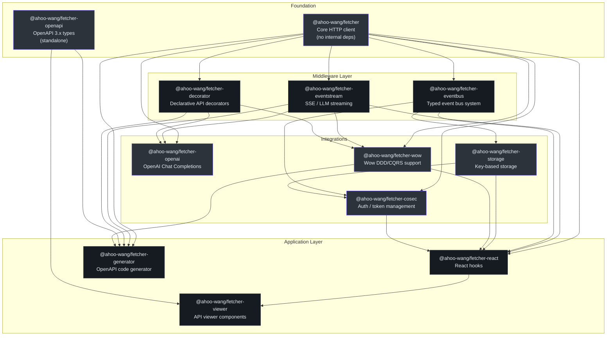
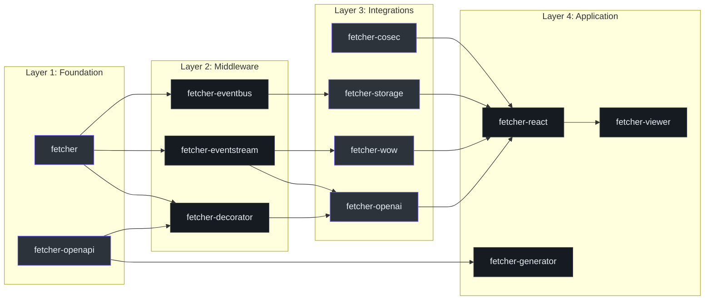
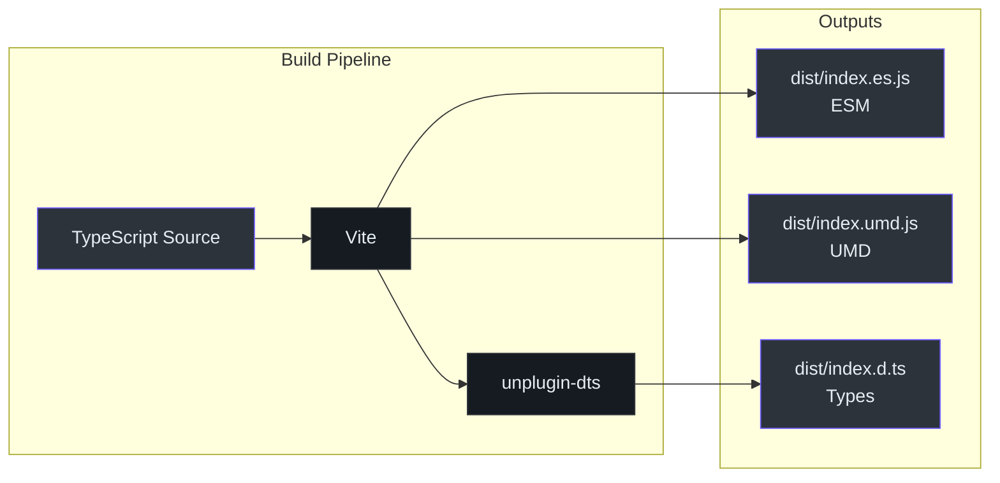
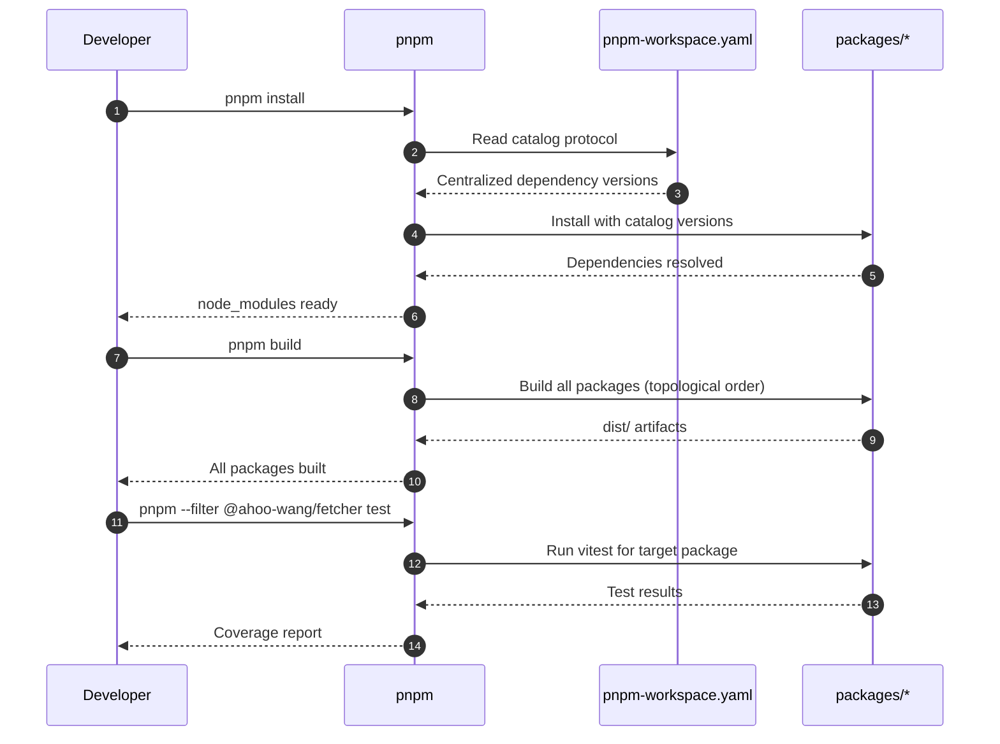

# Packages Overview

The Fetcher ecosystem is organized as a pnpm monorepo with 12 packages under the `@ahoo-wang` npm scope. Each package is independently publishable while sharing a unified version and build configuration.

## Package Dependency Graph



## Package Registry

| # | Package | Description | Key Source | Dependencies |
|---|---------|-------------|------------|--------------|
| 1 | [@ahoo-wang/fetcher](./fetcher.md) | Core HTTP client with interceptors, URL building, and timeout control | [`packages/fetcher/src/fetcher.ts`](https://github.com/Ahoo-Wang/fetcher/blob/main/packages/fetcher/src/fetcher.ts) | None (standalone) |
| 2 | [@ahoo-wang/fetcher-decorator](./decorator.md) | TypeScript decorators for declarative API service definitions | [`packages/decorator/src/apiDecorator.ts`](https://github.com/Ahoo-Wang/fetcher/blob/main/packages/decorator/src/apiDecorator.ts) | `@ahoo-wang/fetcher`, `reflect-metadata` |
| 3 | [@ahoo-wang/fetcher-eventbus](./eventbus.md) | Typed event bus with serial, parallel, and broadcast implementations | [`packages/eventbus/src/eventBus.ts`](https://github.com/Ahoo-Wang/fetcher/blob/main/packages/eventbus/src/eventBus.ts) | `@ahoo-wang/fetcher` |
| 4 | [@ahoo-wang/fetcher-eventstream](./eventstream.md) | SSE stream processing and LLM streaming support (side-effect module) | [`packages/eventstream/src/responses.ts`](https://github.com/Ahoo-Wang/fetcher/blob/main/packages/eventstream/src/responses.ts) | `@ahoo-wang/fetcher` |
| 5 | [@ahoo-wang/fetcher-openai](./openai.md) | Type-safe OpenAI Chat Completions API client | [`packages/openai/src/chat/chatClient.ts`](https://github.com/Ahoo-Wang/fetcher/blob/main/packages/openai/src/chat/chatClient.ts) | `fetcher`, `eventstream`, `decorator` |
| 6 | [@ahoo-wang/fetcher-openapi](./openapi.md) | OpenAPI 3.x Specification TypeScript types | [`packages/openapi/src/openAPI.ts`](https://github.com/Ahoo-Wang/fetcher/blob/main/packages/openapi/src/openAPI.ts) | None (standalone) |
| 7 | [@ahoo-wang/fetcher-storage](./storage.md) | Key-based storage with serialization and change notifications | [`packages/storage/src/`](https://github.com/Ahoo-Wang/fetcher/blob/main/packages/storage/src/) | `@ahoo-wang/fetcher-eventbus` |
| 8 | [@ahoo-wang/fetcher-cosec](./cosec.md) | Enterprise authentication with automatic token management | [`packages/cosec/src/`](https://github.com/Ahoo-Wang/fetcher/blob/main/packages/cosec/src/) | `fetcher`, `eventbus`, `storage` |
| 9 | [@ahoo-wang/fetcher-wow](./wow.md) | Wow DDD/CQRS framework integration | [`packages/wow/src/`](https://github.com/Ahoo-Wang/fetcher/blob/main/packages/wow/src/) | `fetcher`, `eventstream`, `decorator` |
| 10 | [@ahoo-wang/fetcher-react](./react.md) | React hooks for data fetching with automatic re-rendering | [`packages/react/src/`](https://github.com/Ahoo-Wang/fetcher/blob/main/packages/react/src/) | `fetcher`, `eventstream`, `eventbus`, `storage`, `wow`, `cosec` |
| 11 | [@ahoo-wang/fetcher-viewer](./viewer.md) | React + Ant Design API documentation viewer | [`packages/viewer/src/`](https://github.com/Ahoo-Wang/fetcher/blob/main/packages/viewer/src/) | Most packages + `antd`, `react` |
| 12 | [@ahoo-wang/fetcher-generator](./generator.md) | OpenAPI-to-TypeScript code generator CLI | [`packages/generator/src/`](https://github.com/Ahoo-Wang/fetcher/blob/main/packages/generator/src/) | `fetcher`, `eventstream`, `decorator`, `openapi`, `wow` |

## Installation

Install individual packages or combinations as needed:

```bash
# Core HTTP client
pnpm add @ahoo-wang/fetcher

# Declarative API decorators (requires reflect-metadata)
pnpm add @ahoo-wang/fetcher-decorator reflect-metadata

# Event bus system
pnpm add @ahoo-wang/fetcher-eventbus

# SSE / LLM streaming support
pnpm add @ahoo-wang/fetcher-eventstream

# OpenAI API client
pnpm add @ahoo-wang/fetcher-openai

# OpenAPI 3.x types
pnpm add @ahoo-wang/fetcher-openapi

# Key-based storage
pnpm add @ahoo-wang/fetcher-storage

# CoSec authentication
pnpm add @ahoo-wang/fetcher-cosec

# React hooks
pnpm add @ahoo-wang/fetcher-react

# API viewer components (requires antd)
pnpm add @ahoo-wang/fetcher-viewer antd @ant-design/icons

# Wow DDD/CQRS support
pnpm add @ahoo-wang/fetcher-wow

# Code generator (CLI tool)
pnpm add -D @ahoo-wang/fetcher-generator
```

## Layered Architecture

The packages follow a clear layered architecture, moving from foundational utilities up to application-level components.



## Build System

All packages share a unified Vite build configuration:



Each package outputs:

| Output | Format | Description |
|--------|--------|-------------|
| `dist/index.es.js` | ESM | ES Module bundle for modern bundlers |
| `dist/index.umd.js` | UMD | Universal module for direct browser usage |
| `dist/index.d.ts` | TypeScript | Full type declarations |

## Monorepo Management



## Shared Conventions

All packages follow these conventions:

- **ES Modules**: `"type": "module"` in all `package.json` files
- **TypeScript Strict**: Strict mode enabled across all packages
- **License**: Apache 2.0 with headers in every source file
- **Testing**: Vitest with `@vitest/coverage-v8`
- **Formatting**: Prettier with single quotes, trailing commas, 80-char width
- **Version**: Synchronized across all packages via `pnpm update-version <version>`
- **Bundle Analysis**: Each package has a `vite-bundle-analyzer` script

## Related Pages

- [Fetcher (Core)](./fetcher.md) - The foundation HTTP client
- [Decorator](./decorator.md) - Declarative API definitions
- [EventBus](./eventbus.md) - Typed event system
- [EventStream](./eventstream.md) - SSE and LLM streaming
- [OpenAI](./openai.md) - Chat Completions integration
- [OpenAPI](./openapi.md) - Specification type definitions
- [Storage](./storage.md) - Key-based storage abstraction
- [React](./react.md) - React hooks and integration
- [Generator](./generator.md) - Code generation CLI
