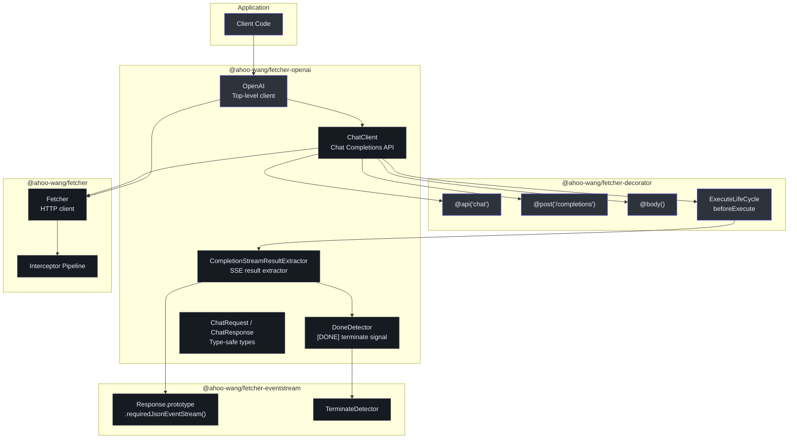
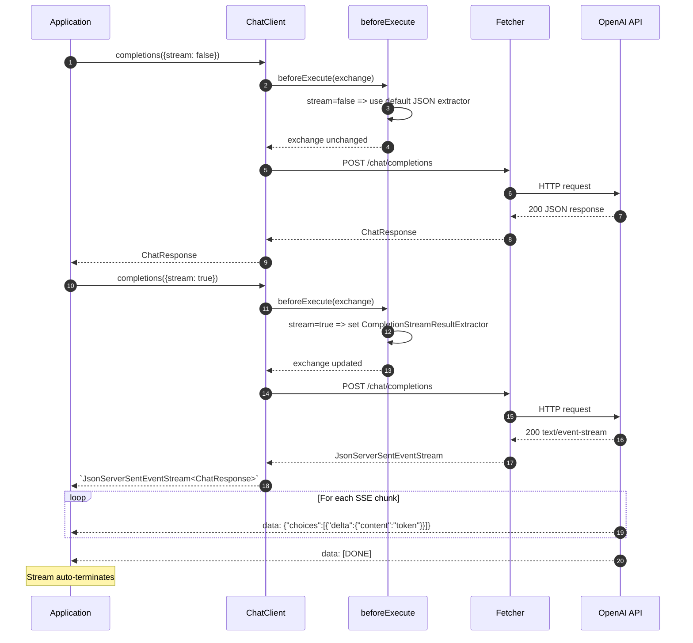
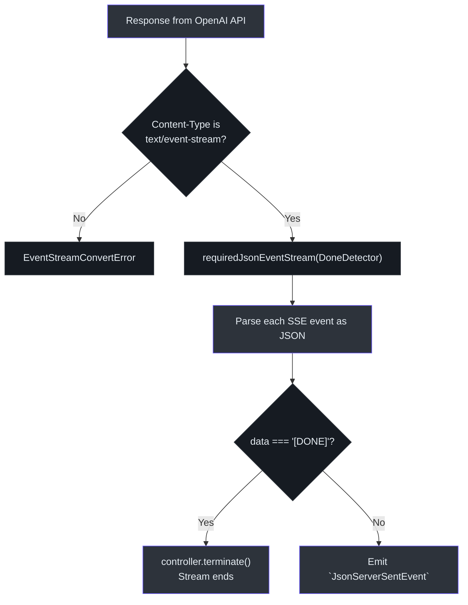

# @ahoo-wang/fetcher-openai

The `@ahoo-wang/fetcher-openai` package provides a type-safe client for OpenAI's Chat Completions API. It combines the [decorator](./decorator.md) package's declarative API style with the [eventstream](./eventstream.md) package's SSE processing to deliver a seamless streaming and non-streaming experience from a single method call.

**Source**: [`packages/openai/src/`](https://github.com/Ahoo-Wang/fetcher/blob/main/packages/openai/src/)

## Installation

```bash
pnpm add @ahoo-wang/fetcher-openai
```

::: warning Peer Dependencies
This package requires all three of its peer dependencies:

```bash
pnpm add @ahoo-wang/fetcher @ahoo-wang/fetcher-eventstream @ahoo-wang/fetcher-decorator reflect-metadata
```
:::

## Architecture



## Quick Start

### Non-Streaming

```typescript
import 'reflect-metadata';
import { OpenAI } from '@ahoo-wang/fetcher-openai';

const openai = new OpenAI({
  baseURL: 'https://api.openai.com/v1',
  apiKey: process.env.OPENAI_API_KEY!,
});

const response = await openai.chat.completions({
  model: 'gpt-3.5-turbo',
  messages: [
    { role: 'system', content: 'You are a helpful assistant.' },
    { role: 'user', content: 'What is TypeScript?' },
  ],
  temperature: 0.7,
  max_tokens: 150,
});

console.log(response.choices[0].message?.content);
// => "TypeScript is a programming language developed by Microsoft..."
console.log(response.usage.total_tokens);
// => 42
```

### Streaming

```typescript
import 'reflect-metadata';
import { OpenAI } from '@ahoo-wang/fetcher-openai';

const openai = new OpenAI({
  baseURL: 'https://api.openai.com/v1',
  apiKey: process.env.OPENAI_API_KEY!,
});

const stream = await openai.chat.completions({
  model: 'gpt-4',
  messages: [{ role: 'user', content: 'Write a short story about a cat.' }],
  stream: true,
  temperature: 0.8,
});

for await (const chunk of stream) {
  const content = chunk.choices[0]?.delta?.content;
  if (content) {
    process.stdout.write(content); // Token-by-token output
  }
}
// Stream terminates automatically when [DONE] is received
```

## Streaming vs Non-Streaming Flow

The `ChatClient` uses advanced TypeScript conditional types to provide the correct return type based on the `stream` parameter. The `beforeExecute` lifecycle hook dynamically switches the result extractor. ([`chatClient.ts:78`](https://github.com/Ahoo-Wang/fetcher/blob/main/packages/openai/src/chat/chatClient.ts#L78))



## OpenAI Client

The `OpenAI` class is the top-level entry point. It creates a `Fetcher` with the API key in the `Authorization` header and instantiates sub-clients. ([`openai.ts:63`](https://github.com/Ahoo-Wang/fetcher/blob/main/packages/openai/src/openai.ts#L63))

```typescript
const openai = new OpenAI({
  baseURL: 'https://api.openai.com/v1',
  apiKey: 'sk-...',
});

// Access the underlying fetcher for custom configuration
openai.fetcher.interceptors.request.use(myCustomInterceptor);

// Use the chat client
await openai.chat.completions({ model: 'gpt-4', messages: [...] });
```

### OpenAIOptions

| Property | Type | Required | Description |
|----------|------|----------|-------------|
| `baseURL` | `string` | Yes | OpenAI API base URL (e.g., `https://api.openai.com/v1`) |
| `apiKey` | `string` | Yes | OpenAI API key (sent as `Bearer` token) |

## ChatClient

The `ChatClient` is decorated with `@api('chat')` and implements both `ApiMetadataCapable` (for runtime metadata injection) and `ExecuteLifeCycle` (for dynamic result extractor switching). ([`chatClient.ts:78`](https://github.com/Ahoo-Wang/fetcher/blob/main/packages/openai/src/chat/chatClient.ts#L78))

```typescript
@api('chat')
export class ChatClient implements ApiMetadataCapable, ExecuteLifeCycle {
  constructor(public readonly apiMetadata?: ApiMetadata) {}

  beforeExecute(exchange: FetchExchange): void {
    const chatRequest = exchange.request.body as ChatRequest;
    if (chatRequest.stream) {
      exchange.resultExtractor = CompletionStreamResultExtractor;
    }
  }

  @post('/completions')
  completions<T extends ChatRequest>(
    @body() chatRequest: T,
  ): Promise<
    T['stream'] extends true
      ? JsonServerSentEventStream<ChatResponse>
      : ChatResponse
  > {
    throw autoGeneratedError(chatRequest);
  }
}
```

The conditional return type `T['stream'] extends true ? JsonServerSentEventStream<ChatResponse> : ChatResponse` ensures TypeScript correctly infers the return type at call sites.

## CompletionStreamResultExtractor

The `CompletionStreamResultExtractor` processes SSE responses from the chat completions API. It uses the `DoneDetector` to terminate the stream when the `[DONE]` signal is received. ([`completionStreamResultExtractor.ts:88`](https://github.com/Ahoo-Wang/fetcher/blob/main/packages/openai/src/chat/completionStreamResultExtractor.ts#L88))



```typescript
export const DoneDetector: TerminateDetector = (event) => {
  return event.data === '[DONE]';
};

export const CompletionStreamResultExtractor: ResultExtractor<
  JsonServerSentEventStream<ChatResponse>
> = (exchange) => {
  return exchange.requiredResponse.requiredJsonEventStream(DoneDetector);
};
```

## Type Definitions

### ChatRequest

Full request body for the chat completions endpoint. ([`types.ts:14`](https://github.com/Ahoo-Wang/fetcher/blob/main/packages/openai/src/chat/types.ts#L14))

| Property | Type | Default | Description |
|----------|------|---------|-------------|
| `model` | `string` | - | Model ID (e.g., `gpt-3.5-turbo`, `gpt-4`) |
| `messages` | `Message[]` | - | Conversation messages with role and content |
| `stream` | `boolean` | `false` | Enable streaming responses |
| `temperature` | `number` | `1` | Sampling temperature (0-2) |
| `max_tokens` | `number` | `inf` | Maximum tokens to generate |
| `top_p` | `number` | `1` | Nucleus sampling threshold |
| `frequency_penalty` | `number` | `0` | Repetition penalty (-2.0 to 2.0) |
| `presence_penalty` | `number` | `0` | Topic diversity penalty (-2.0 to 2.0) |
| `stop` | `string` | `null` | Stop sequences |
| `n` | `number` | `1` | Number of completions to generate |
| `user` | `string` | - | End-user identifier |
| `tools` | `string[]` | - | Tool/function definitions for function calling |
| `tool_choice` | `{ [key: string]: any }` | - | Control tool selection (e.g., `{ type: "auto" }`) |
| `response_format` | `object` | - | Output format constraint (e.g., `{ type: "json_object" }`) |

### Message

::: tip Open Structure
`Message` has an index signature `[property: string]: any`, so it accepts any OpenAI API field beyond `role` and `content` — including `tool_calls`, `tool_call_id`, `name`, and `function_call`.
:::

| Property | Type | Description |
|----------|------|-------------|
| `role` | `string` | `"system"`, `"user"`, `"assistant"`, or `"tool"` |
| `content` | `string?` | Message text content |
| `tool_calls` | `any[]?` | Tool call requests from the assistant |
| `tool_call_id` | `string?` | ID linking a tool response message to its call |
| `name` | `string?` | Name of the function/tool |

### Function / Tool Calling

The client supports OpenAI's function/tool calling. The exported `ChatRequest` type does not yet include full tool-definition typing (`tools` is `string[]`), so tool-calling examples require a `as any` cast or a custom type extension:

```typescript
const response = await openAI.chat.completions({
  model: 'gpt-4',
  messages: [{ role: 'user', content: 'What is the weather in Boston?' }],
  // tools/tool_choice require 'as any' cast — ChatRequest types tools as string[]
  tools: [{
    type: 'function',
    function: {
      name: 'get_weather',
      description: 'Get current weather for a location',
      parameters: {
        type: 'object',
        properties: {
          location: { type: 'string', description: 'City name' },
        },
        required: ['location'],
      },
    },
  }],
  tool_choice: { type: 'auto' }, // let the model decide
});

// Check if the model wants to call a tool
const message = response.choices[0]?.message;
if (message?.tool_calls) {
  for (const toolCall of message.tool_calls) {
    const args = JSON.parse(toolCall.function.arguments);
    console.log(`Call ${toolCall.function.name}(${JSON.stringify(args)})`);
    // Call your function, then continue the conversation:
    // messages.push(message);                    // assistant's tool-call message
    // messages.push({ role: 'tool', tool_call_id: toolCall.id, content: result });
  }
}
```

### ChatResponse

| Property | Type | Description |
|----------|------|-------------|
| `id` | `string` | Unique response ID |
| `object` | `string` | Object type (e.g., `"chat.completion"`) |
| `created` | `number` | Unix timestamp of creation |
| `choices` | `Choice[]` | Array of completion choices |
| `usage` | `Usage` | Token usage statistics |

### Choice

| Property | Type | Description |
|----------|------|-------------|
| `index` | `number?` | Choice index |
| `message` | `Message?` | The completion message (non-streaming) |
| `finish_reason` | `string?` | `"stop"`, `"length"`, `"content_filter"`, etc. |

### Usage

| Property | Type | Description |
|----------|------|-------------|
| `prompt_tokens` | `number` | Tokens in the prompt |
| `completion_tokens` | `number` | Tokens in the completion |
| `total_tokens` | `number` | Total tokens consumed |

## Advanced: Custom Interceptors

Since the `OpenAI` class exposes its `Fetcher` instance, you can add interceptors for logging, retrying, or authentication refresh:

```typescript
import { OpenAI } from '@ahoo-wang/fetcher-openai';

const openai = new OpenAI({
  baseURL: 'https://api.openai.com/v1',
  apiKey: process.env.OPENAI_API_KEY!,
});

// Add a logging interceptor
openai.fetcher.interceptors.request.use({
  name: 'RequestLogger',
  order: 100,
  intercept(exchange) {
    console.log(`[OpenAI] ${exchange.request.method} ${exchange.request.url}`);
  },
});

// Add a rate-limit retry interceptor
openai.fetcher.interceptors.error.use({
  name: 'RateLimitRetry',
  order: 100,
  async intercept(exchange) {
    if (exchange.error?.response?.status === 429) {
      const retryAfter = parseInt(
        exchange.error.response.headers.get('Retry-After') || '1',
      );
      await new Promise(r => setTimeout(r, retryAfter * 1000));
      // Retry the request
      const response = await fetch(exchange.request);
      exchange.response = response;
      exchange.error = undefined;
    }
  },
});
```

## Exported API Summary

| Export | Type | Source |
|--------|------|--------|
| `OpenAI` | Class | [`openai.ts`](https://github.com/Ahoo-Wang/fetcher/blob/main/packages/openai/src/openai.ts) |
| `OpenAIOptions` | Interface | [`openai.ts`](https://github.com/Ahoo-Wang/fetcher/blob/main/packages/openai/src/openai.ts) |
| `ChatClient` | Class | [`chat/chatClient.ts`](https://github.com/Ahoo-Wang/fetcher/blob/main/packages/openai/src/chat/chatClient.ts) |
| `ChatRequest` | Interface | [`chat/types.ts`](https://github.com/Ahoo-Wang/fetcher/blob/main/packages/openai/src/chat/types.ts) |
| `ChatResponse` | Interface | [`chat/types.ts`](https://github.com/Ahoo-Wang/fetcher/blob/main/packages/openai/src/chat/types.ts) |
| `Message` | Interface | [`chat/types.ts`](https://github.com/Ahoo-Wang/fetcher/blob/main/packages/openai/src/chat/types.ts) |
| `Choice` | Interface | [`chat/types.ts`](https://github.com/Ahoo-Wang/fetcher/blob/main/packages/openai/src/chat/types.ts) |
| `Usage` | Interface | [`chat/types.ts`](https://github.com/Ahoo-Wang/fetcher/blob/main/packages/openai/src/chat/types.ts) |
| `CompletionStreamResultExtractor` | Function | [`chat/completionStreamResultExtractor.ts`](https://github.com/Ahoo-Wang/fetcher/blob/main/packages/openai/src/chat/completionStreamResultExtractor.ts) |
| `DoneDetector` | Function | [`chat/completionStreamResultExtractor.ts`](https://github.com/Ahoo-Wang/fetcher/blob/main/packages/openai/src/chat/completionStreamResultExtractor.ts) |

## Related Pages

- [EventStream](./eventstream.md) - SSE stream processing that powers the streaming mode
- [Decorator](./decorator.md) - Decorator pattern used by `ChatClient`
- [Fetcher (Core)](./fetcher.md) - HTTP client and interceptor pipeline
- [Packages Overview](./index.md) - All packages in the ecosystem
