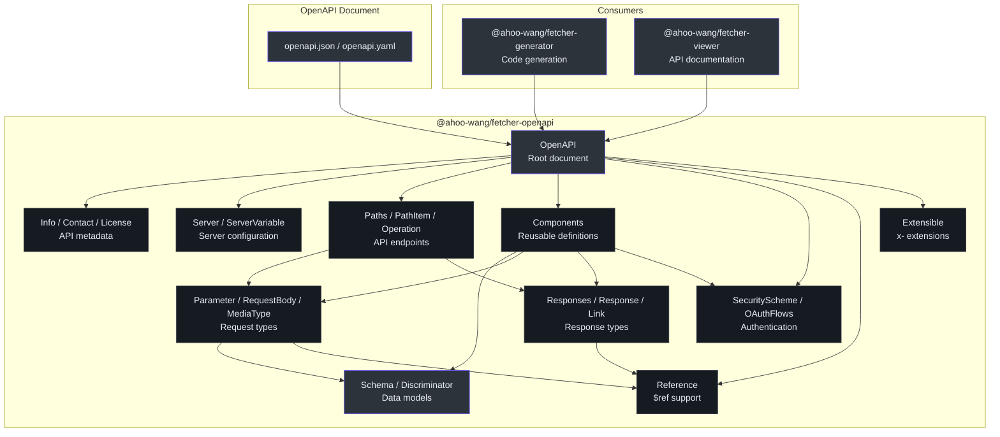
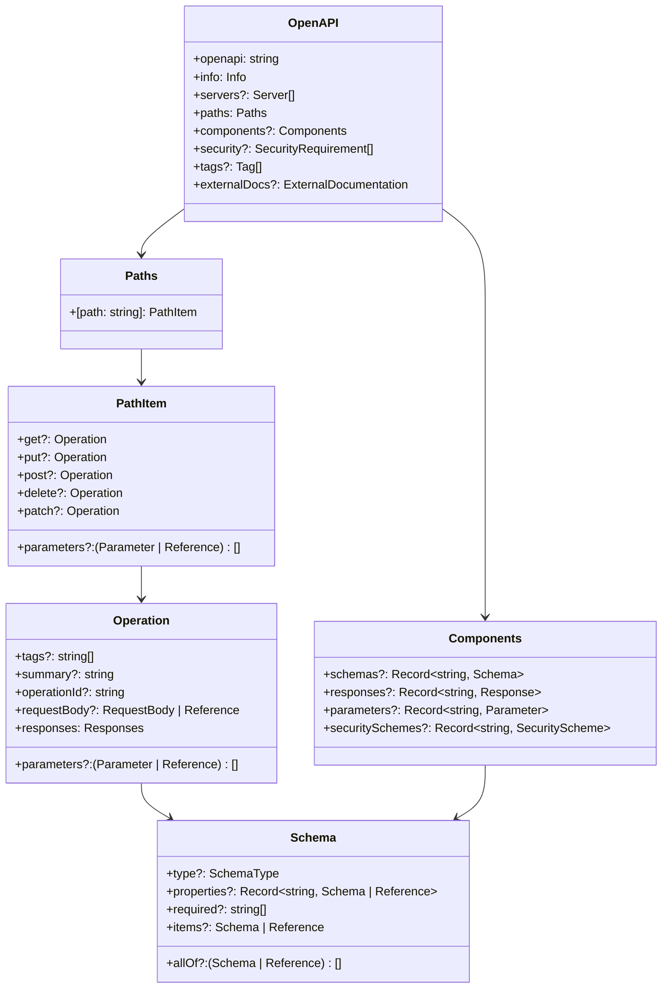
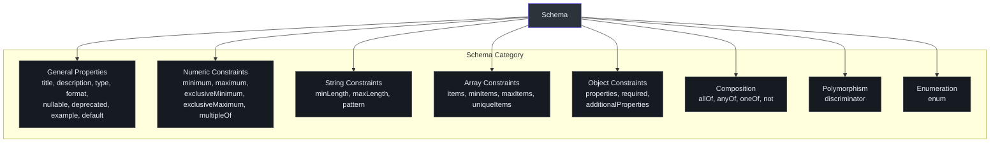
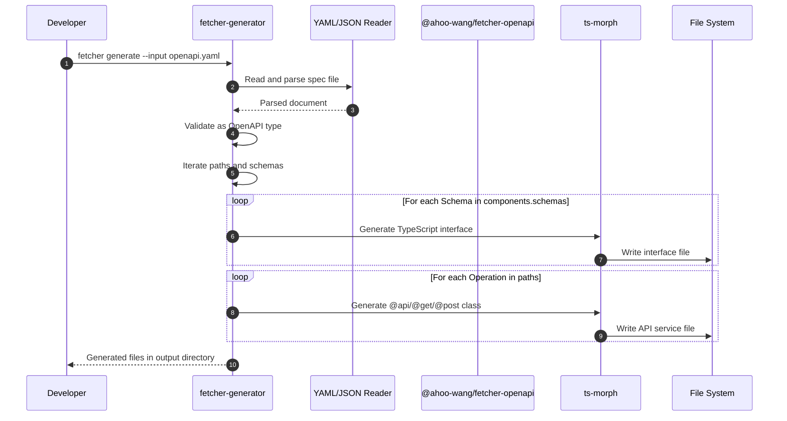
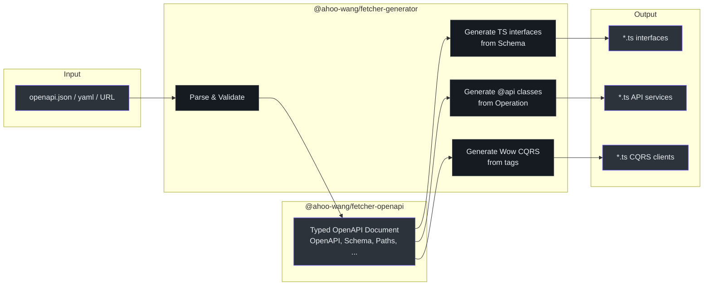

# @ahoo-wang/fetcher-openapi

The `@ahoo-wang/fetcher-openapi` package provides comprehensive TypeScript type definitions for the [OpenAPI 3.x Specification](https://spec.openapis.org/oas/v3.1.0). It has **zero runtime dependencies** and is used by the [generator](./generator.md) package to parse and validate OpenAPI documents before generating type-safe API client code.

**Source**: [`packages/openapi/src/`](https://github.com/Ahoo-Wang/fetcher/blob/main/packages/openapi/src/)

## Installation

```bash
pnpm add @ahoo-wang/fetcher-openapi
```

::: tip Standalone Package
This package has no peer dependencies and no runtime code. It exports only TypeScript interfaces and types, making it suitable for any TypeScript project that works with OpenAPI documents.
:::

## Architecture



## Type Hierarchy



## Root Document (OpenAPI)

The `OpenAPI` interface represents the root OpenAPI document. ([`openAPI.ts:41`](https://github.com/Ahoo-Wang/fetcher/blob/main/packages/openapi/src/openAPI.ts#L41))

```typescript
import type { OpenAPI } from '@ahoo-wang/fetcher-openapi';

const spec: OpenAPI = {
  openapi: '3.0.3',
  info: {
    title: 'My API',
    version: '1.0.0',
  },
  paths: {
    '/users': {
      get: {
        operationId: 'listUsers',
        parameters: [
          { name: 'limit', in: 'query', schema: { type: 'integer' } },
        ],
        responses: {
          '200': {
            description: 'Successful response',
            content: {
              'application/json': {
                schema: {
                  type: 'array',
                  items: { $ref: '#/components/schemas/User' },
                },
              },
            },
          },
        },
      },
    },
  },
  components: {
    schemas: {
      User: {
        type: 'object',
        required: ['id', 'name'],
        properties: {
          id: { type: 'integer', format: 'int64' },
          name: { type: 'string' },
          email: { type: 'string', format: 'email' },
        },
      },
    },
  },
};
```

## Schema Types

The `Schema` interface is the most complex type, supporting all JSON Schema features used in OpenAPI 3.x. ([`schema.ts:91`](https://github.com/Ahoo-Wang/fetcher/blob/main/packages/openapi/src/schema.ts#L91))



### SchemaType

The primitive types supported by OpenAPI/JSON Schema: ([`base-types.ts:44`](https://github.com/Ahoo-Wang/fetcher/blob/main/packages/openapi/src/base-types.ts#L44))

```typescript
type SchemaType = 'string' | 'number' | 'integer' | 'boolean' | 'array' | 'object' | 'null';
```

### Key Schema Properties

| Property | Type | Description |
|----------|------|-------------|
| `type` | `SchemaType \| SchemaType[]` | Data type |
| `format` | `string` | Extended format (e.g., `int64`, `date-time`, `email`) |
| `properties` | `Record<string, Schema \| Reference>` | Object properties |
| `required` | `string[]` | Required property names |
| `items` | `Schema \| Reference` | Array item schema |
| `allOf` | `(Schema \| Reference)[]` | Must match all schemas |
| `anyOf` | `(Schema \| Reference)[]` | Must match any schema |
| `oneOf` | `(Schema \| Reference)[]` | Must match exactly one schema |
| `enum` | `any[]` | Allowed values |
| `nullable` | `boolean` | Whether null is allowed |
| `discriminator` | `Discriminator` | Polymorphism support |

## Paths and Operations

### PathItem

Describes the operations available on a single URL path. Supports all HTTP methods. ([`paths.ts:76`](https://github.com/Ahoo-Wang/fetcher/blob/main/packages/openapi/src/paths.ts#L76))

| Property | Type | Description |
|----------|------|-------------|
| `get` | `Operation` | GET operation |
| `put` | `Operation` | PUT operation |
| `post` | `Operation` | POST operation |
| `delete` | `Operation` | DELETE operation |
| `patch` | `Operation` | PATCH operation |
| `head` | `Operation` | HEAD operation |
| `options` | `Operation` | OPTIONS operation |
| `trace` | `Operation` | TRACE operation |
| `parameters` | `(Parameter \| Reference)[]` | Shared parameters for all operations |

### Operation

Describes a single API operation. ([`paths.ts:44`](https://github.com/Ahoo-Wang/fetcher/blob/main/packages/openapi/src/paths.ts#L44))

| Property | Type | Description |
|----------|------|-------------|
| `operationId` | `string` | Unique operation identifier |
| `tags` | `string[]` | Documentation tags |
| `summary` | `string` | Short summary |
| `description` | `string` | Detailed description |
| `parameters` | `(Parameter \| Reference)[]` | Operation parameters |
| `requestBody` | `RequestBody \| Reference` | Request body definition |
| `responses` | `Responses` | Possible responses |
| `deprecated` | `boolean` | Whether the operation is deprecated |
| `security` | `SecurityRequirement[]` | Security requirements |
| `callbacks` | `Record<string, Callback \| Reference>` | Out-of-band callbacks |

## Parameters and Request Bodies

### Parameter

Describes a single operation parameter. ([`parameters.ts:40`](https://github.com/Ahoo-Wang/fetcher/blob/main/packages/openapi/src/parameters.ts#L40))

| Property | Type | Description |
|----------|------|-------------|
| `name` | `string` | Parameter name |
| `in` | `ParameterLocation` | Location: `query`, `header`, `path`, or `cookie` |
| `required` | `boolean` | Whether the parameter is mandatory |
| `schema` | `Schema \| Reference` | Parameter schema |
| `description` | `string` | Parameter description |
| `deprecated` | `boolean` | Whether the parameter is deprecated |

```typescript
type ParameterLocation = 'query' | 'header' | 'path' | 'cookie';
```

### RequestBody

| Property | Type | Description |
|----------|------|-------------|
| `content` | `Record<string, MediaType>` | Media type mappings |
| `required` | `boolean` | Whether the body is mandatory |
| `description` | `string` | Body description |

### MediaType

| Property | Type | Description |
|----------|------|-------------|
| `schema` | `Schema \| Reference` | The schema for this media type |
| `example` | `any` | Example value |
| `examples` | `Record<string, Example \| Reference>` | Named examples |
| `encoding` | `Record<string, Encoding>` | Encoding information |

## Responses

### Response

Describes a single response from an API operation. ([`responses.ts:52`](https://github.com/Ahoo-Wang/fetcher/blob/main/packages/openapi/src/responses.ts#L52))

| Property | Type | Description |
|----------|------|-------------|
| `description` | `string` | Response description |
| `headers` | `Record<string, Header \| Reference>` | Response headers |
| `content` | `Record<string, MediaType>` | Response body media types |
| `links` | `Record<string, Link \| Reference>` | Follow-up operation links |

### Responses

A container mapping HTTP status codes to Response objects:

```typescript
interface Responses {
  default?: Response | Reference;   // Fallback response
  [httpCode: string]: Response | Reference | undefined;  // e.g., "200", "404", "500"
}
```

## Components

The `Components` object holds reusable definitions that are referenced via `$ref` throughout the document. ([`components.ts:42`](https://github.com/Ahoo-Wang/fetcher/blob/main/packages/openapi/src/components.ts#L42))

| Property | Type | Description |
|----------|------|-------------|
| `schemas` | `Record<string, Schema>` | Reusable data models |
| `responses` | `Record<string, Response>` | Reusable response definitions |
| `parameters` | `Record<string, Parameter>` | Reusable parameters |
| `requestBodies` | `Record<string, RequestBody>` | Reusable request bodies |
| `headers` | `Record<string, Header \| Reference>` | Reusable headers |
| `securitySchemes` | `Record<string, SecurityScheme>` | Reusable security schemes |
| `links` | `Record<string, Link>` | Reusable links |
| `callbacks` | `Record<string, Callback>` | Reusable callbacks |
| `examples` | `Record<string, Example \| Reference>` | Reusable examples |

## References

The `Reference` type supports JSON Pointer-based references (`$ref`) to reusable components. ([`reference.ts:23`](https://github.com/Ahoo-Wang/fetcher/blob/main/packages/openapi/src/reference.ts#L23))

```typescript
interface Reference {
  $ref: string;
}

// Usage in schemas
const userRef: Reference = { $ref: '#/components/schemas/User' };
const responseRef: Reference = { $ref: '#/components/responses/NotFound' };
```

The `IsReference<T>` utility type helps distinguish references from inline definitions:

```typescript
type IsReference<T> = T extends { $ref: string } ? T : never;
```

## Security

### SecurityScheme

Supports four authentication types: ([`security.ts:63`](https://github.com/Ahoo-Wang/fetcher/blob/main/packages/openapi/src/security.ts#L63))

| Type | Description | Additional Properties |
|------|-------------|----------------------|
| `apiKey` | API key in header, query, or cookie | `name`, `in` |
| `http` | HTTP authentication | `scheme`, `bearerFormat` |
| `oauth2` | OAuth 2.0 | `flows` (OAuthFlows) |
| `openIdConnect` | OpenID Connect | `openIdConnectUrl` |

### OAuthFlows

| Property | Type | Description |
|----------|------|-------------|
| `implicit` | `OAuthFlow` | Implicit grant flow |
| `password` | `OAuthFlow` | Resource owner password flow |
| `clientCredentials` | `OAuthFlow` | Client credentials flow |
| `authorizationCode` | `OAuthFlow` | Authorization code flow |

## Extension Support (Extensible)

Most types extend the `Extensible` interface, allowing custom properties prefixed with `x-`: ([`extensions.ts:22`](https://github.com/Ahoo-Wang/fetcher/blob/main/packages/openapi/src/extensions.ts#L22))

```typescript
interface Extensible {
  [extension: `x-${string}`]: any;
}

// Usage
const operation: Operation = {
  responses: { '200': { description: 'OK' } },
  'x-rate-limit': 100,
  'x-cache-ttl': 300,
};
```

## How the Generator Uses This Package

The [generator](./generator.md) package reads an OpenAPI document and maps its types to TypeScript code:





The mapping from OpenAPI constructs to generated TypeScript:

| OpenAPI Construct | Generated TypeScript |
|-------------------|---------------------|
| `components.schemas.*` | TypeScript `interface` or `enum` |
| `paths.*.get/post/put/delete` | `@get/@post/@put/@del` decorated method |
| `parameters` with `in: path` | `@path()` parameter |
| `parameters` with `in: query` | `@query()` parameter |
| `parameters` with `in: header` | `@header()` parameter |
| `requestBody` | `@body()` parameter |
| `responses.200.content.application/json.schema` | Return type |

## Exported API Summary

| Export | Type | Source File |
|--------|------|------------|
| `OpenAPI` | Interface | [`openAPI.ts`](https://github.com/Ahoo-Wang/fetcher/blob/main/packages/openapi/src/openAPI.ts) |
| `Schema` | Interface | [`schema.ts`](https://github.com/Ahoo-Wang/fetcher/blob/main/packages/openapi/src/schema.ts) |
| `Discriminator` | Interface | [`schema.ts`](https://github.com/Ahoo-Wang/fetcher/blob/main/packages/openapi/src/schema.ts) |
| `Paths` | Interface | [`paths.ts`](https://github.com/Ahoo-Wang/fetcher/blob/main/packages/openapi/src/paths.ts) |
| `PathItem` | Interface | [`paths.ts`](https://github.com/Ahoo-Wang/fetcher/blob/main/packages/openapi/src/paths.ts) |
| `Operation` | Interface | [`paths.ts`](https://github.com/Ahoo-Wang/fetcher/blob/main/packages/openapi/src/paths.ts) |
| `Parameter` | Interface | [`parameters.ts`](https://github.com/Ahoo-Wang/fetcher/blob/main/packages/openapi/src/parameters.ts) |
| `RequestBody` | Interface | [`parameters.ts`](https://github.com/Ahoo-Wang/fetcher/blob/main/packages/openapi/src/parameters.ts) |
| `MediaType` | Interface | [`parameters.ts`](https://github.com/Ahoo-Wang/fetcher/blob/main/packages/openapi/src/parameters.ts) |
| `Responses` | Interface | [`responses.ts`](https://github.com/Ahoo-Wang/fetcher/blob/main/packages/openapi/src/responses.ts) |
| `Response` | Interface | [`responses.ts`](https://github.com/Ahoo-Wang/fetcher/blob/main/packages/openapi/src/responses.ts) |
| `Components` | Interface | [`components.ts`](https://github.com/Ahoo-Wang/fetcher/blob/main/packages/openapi/src/components.ts) |
| `Reference` | Interface | [`reference.ts`](https://github.com/Ahoo-Wang/fetcher/blob/main/packages/openapi/src/reference.ts) |
| `SecurityScheme` | Interface | [`security.ts`](https://github.com/Ahoo-Wang/fetcher/blob/main/packages/openapi/src/security.ts) |
| `OAuthFlows` | Interface | [`security.ts`](https://github.com/Ahoo-Wang/fetcher/blob/main/packages/openapi/src/security.ts) |
| `Info` | Interface | [`info.ts`](https://github.com/Ahoo-Wang/fetcher/blob/main/packages/openapi/src/info.ts) |
| `Server` | Interface | [`server.ts`](https://github.com/Ahoo-Wang/fetcher/blob/main/packages/openapi/src/server.ts) |
| `Tag` | Interface | [`tags.ts`](https://github.com/Ahoo-Wang/fetcher/blob/main/packages/openapi/src/tags.ts) |
| `Extensible` | Interface | [`extensions.ts`](https://github.com/Ahoo-Wang/fetcher/blob/main/packages/openapi/src/extensions.ts) |
| `SchemaType` | Type | [`base-types.ts`](https://github.com/Ahoo-Wang/fetcher/blob/main/packages/openapi/src/base-types.ts) |
| `ParameterLocation` | Type | [`base-types.ts`](https://github.com/Ahoo-Wang/fetcher/blob/main/packages/openapi/src/base-types.ts) |
| `HTTPMethod` | Type | [`base-types.ts`](https://github.com/Ahoo-Wang/fetcher/blob/main/packages/openapi/src/base-types.ts) |

## Related Pages

- [Generator](./generator.md) - Consumes this package to generate TypeScript API clients
- [Viewer](./viewer.md) - Uses these types for API documentation rendering
- [Decorator](./decorator.md) - Generated code uses these decorators
- [Packages Overview](./index.md) - All packages in the ecosystem
