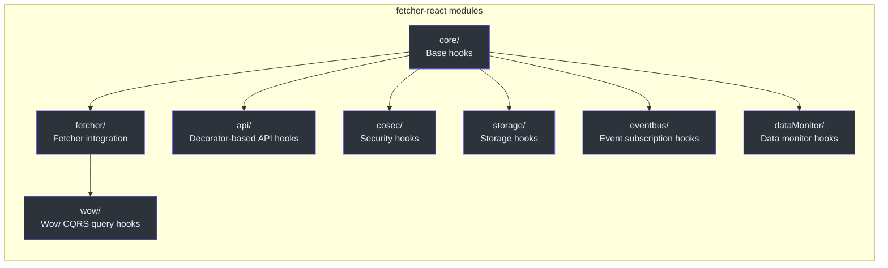
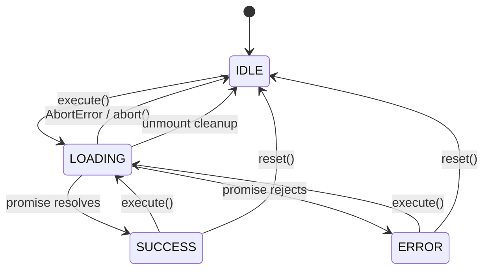
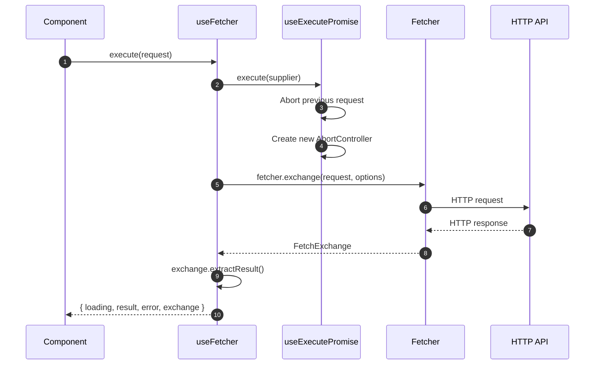
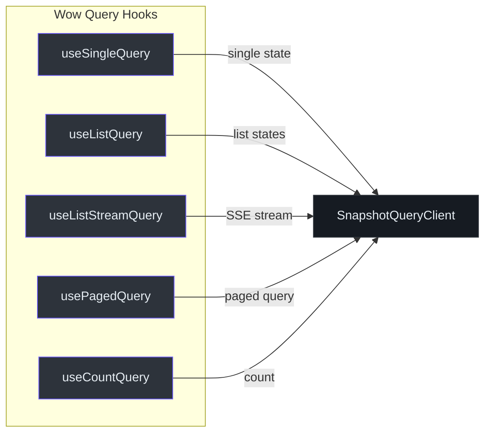

# @ahoo-wang/fetcher-react

The `@ahoo-wang/fetcher-react` package provides a comprehensive set of React hooks that wrap the Fetcher HTTP client ecosystem. It delivers declarative data fetching with automatic loading/error state management, race condition protection, abort controller integration, debounced queries, and deep integration with [Wow](./wow.md), [CoSec](./cosec.md), [EventBus](./eventbus.md), and [Storage](./storage.md).

## Installation

```bash
pnpm add @ahoo-wang/fetcher-react
```

## Module Structure



Source: [packages/react/src/index.ts](https://github.com/Ahoo-Wang/fetcher/blob/main/packages/react/src/index.ts)

## Core Hooks

### usePromiseState

The foundation hook for managing promise lifecycle state without execution logic. Tracks `idle`, `loading`, `success`, and `error` states.

```typescript
import { usePromiseState, PromiseStatus } from '@ahoo-wang/fetcher-react';

function MyComponent() {
  const { status, loading, result, error, setSuccess, setError, setIdle } =
    usePromiseState<string>();

  return (
    <div>
      <p>Status: {status}</p>
      {loading && <p>Loading...</p>}
      {result && <p>Result: {result}</p>}
      {error && <p>Error: {error.message}</p>}
    </div>
  );
}
```

| Property | Type | Description |
|----------|------|-------------|
| `status` | `PromiseStatus` | Current state (`idle`, `loading`, `success`, `error`) |
| `loading` | `boolean` | `true` when status is `loading` |
| `result` | `R \| undefined` | The resolved value |
| `error` | `E \| undefined` | The error if rejected |
| `setLoading()` | `() => void` | Transition to loading state |
| `setSuccess(result)` | `(result: R) => Promise<void>` | Transition to success with callback |
| `setError(error)` | `(error: E) => Promise<void>` | Transition to error with callback |
| `setIdle()` | `() => void` | Reset to idle state |

Source: [packages/react/src/core/usePromiseState.ts:119-190](https://github.com/Ahoo-Wang/fetcher/blob/main/packages/react/src/core/usePromiseState.ts#L119-L190)

### useExecutePromise

Extends `usePromiseState` with promise execution, automatic abort support, race condition protection via request IDs, and mount-safety checks.

```typescript
import { useExecutePromise } from '@ahoo-wang/fetcher-react';

function DataFetcher() {
  const { loading, result, error, execute, reset, abort } =
    useExecutePromise<string>();

  const fetch = () =>
    execute(async (abortController) => {
      const response = await fetch('/api/data', { signal: abortController.signal });
      return response.text();
    });

  return (
    <div>
      <button onClick={fetch}>Fetch</button>
      <button onClick={abort}>Cancel</button>
      {loading && <p>Loading...</p>}
      {result && <p>{result}</p>}
    </div>
  );
}
```



Key features:

- **Auto-abort** -- cancels any in-flight request before starting a new one
- **Manual abort** -- dedicated `abort()` method with `onAbort` callback
- **Race condition protection** -- request IDs prevent stale updates
- **Mount safety** -- no state updates after unmount

Source: [packages/react/src/core/useExecutePromise.ts:210-334](https://github.com/Ahoo-Wang/fetcher/blob/main/packages/react/src/core/useExecutePromise.ts#L210-L334)

### useQuery

Combines `useExecutePromise` with query parameter management. Supports auto-execution when query parameters change.

```typescript
import { useQuery } from '@ahoo-wang/fetcher-react';

function UserComponent() {
  const { loading, result, execute, setQuery } = useQuery<UserQuery, User>({
    initialQuery: { id: '1' },
    execute: async (query) => {
      const res = await fetch(`/api/users/${query.id}`);
      return res.json();
    },
    autoExecute: true,
  });

  const handleChange = (userId: string) => {
    setQuery({ id: userId }); // auto-executes when autoExecute is true
  };

  return <div>{loading ? <p>Loading...</p> : <p>{result?.name}</p>}</div>;
}
```

Source: [packages/react/src/core/useQuery.ts:105-173](https://github.com/Ahoo-Wang/fetcher/blob/main/packages/react/src/core/useQuery.ts#L105-L173)

## Fetcher Integration Hooks

### useFetcher

The primary hook for HTTP fetch operations. Wraps the Fetcher client with automatic abort, race condition protection, and comprehensive state management.



```typescript
import { useFetcher } from '@ahoo-wang/fetcher-react';

function UserProfile({ userId }: { userId: string }) {
  const { loading, result, error, execute } = useFetcher<User>({
    resultExtractor: ResultExtractors.Json,
  });

  useEffect(() => {
    execute({ url: `/api/users/${userId}`, method: 'GET' });
  }, [userId]);

  if (loading) return <p>Loading...</p>;
  if (error) return <p>Error: {error.message}</p>;
  return <p>{result?.name}</p>;
}
```

| Property | Type | Description |
|----------|------|-------------|
| `exchange` | `FetchExchange \| undefined` | Current/recent fetch exchange with request/response details |
| `execute(request)` | `(request: FetchRequest) => Promise<void>` | Execute a fetch request with auto-abort |
| Inherits from `useExecutePromise` | -- | `loading`, `result`, `error`, `status`, `reset`, `abort` |

Source: [packages/react/src/fetcher/useFetcher.ts:162-226](https://github.com/Ahoo-Wang/fetcher/blob/main/packages/react/src/fetcher/useFetcher.ts#L162-L226)

### useFetcherQuery

A higher-level hook that combines `useFetcher` with POST-based query semantics. Sends query parameters as the request body and supports auto-execution.

```typescript
import { useFetcherQuery } from '@ahoo-wang/fetcher-react';

interface SearchQuery { keyword: string; limit: number; }
interface SearchResult { items: Item[]; total: number; }

function SearchComponent() {
  const { loading, result, execute, setQuery } = useFetcherQuery<SearchQuery, SearchResult>({
    url: '/api/search',
    initialQuery: { keyword: '', limit: 10 },
    autoExecute: false,
  });

  const handleSearch = (keyword: string) => {
    setQuery({ keyword, limit: 10 }); // auto-executes if autoExecute was true
  };

  return <div>{loading ? <p>Searching...</p> : <p>Found {result?.total} items</p>}</div>;
}
```

Source: [packages/react/src/fetcher/useFetcherQuery.ts:125-192](https://github.com/Ahoo-Wang/fetcher/blob/main/packages/react/src/fetcher/useFetcherQuery.ts#L125-L192)

### Debounced Variants

For search-as-you-type scenarios, debounced variants delay execution until input stabilizes:

| Hook | Base Hook | Description |
|------|-----------|-------------|
| `useDebouncedCallback` | -- | Debounces any callback by a configurable delay |
| `useDebouncedExecutePromise` | `useExecutePromise` | Debounced promise execution |
| `useDebouncedQuery` | `useQuery` | Debounced query with auto-execution |
| `useDebouncedFetcher` | `useFetcher` | Debounced fetcher execution |
| `useDebouncedFetcherQuery` | `useFetcherQuery` | Debounced POST query |

Source: [packages/react/src/core/debounced/](https://github.com/Ahoo-Wang/fetcher/blob/main/packages/react/src/core/debounced/)

## API Hooks Generation

Instead of writing `useExecutePromise` / `useQuery` wrappers manually for each API method, use the factory functions to auto-generate type-safe hooks from any decorated API service class. These factories introspect the class, collect all promise-returning methods, and create a `useXxx` hook for each — with full parameter and return type inference.

| Factory | Hook Base | Use Case |
|---------|-----------|----------|
| `createExecuteApiHooks` | `useExecutePromise` | Mutation/command methods (POST, PUT, DELETE) — manual trigger |
| `createQueryApiHooks` | `useQuery` | Query methods (GET) — auto-execute on mount/param change |

### Creating Execute Hooks (Mutations)

```typescript
import { createExecuteApiHooks } from '@ahoo-wang/fetcher-react';
import { UserService } from './UserService'; // decorated with @api

// Auto-generates useCreateUser, useUpdateUser, useDeleteUser...
const userExecuteHooks = createExecuteApiHooks({ api: new UserService(fetcher) });

// In a component — full type inference for params and return
function CreateUserForm() {
  const { result, loading, error, execute } = userExecuteHooks.useCreateUser();

  const handleSubmit = async (data: UserDTO) => {
    // params are type-checked against the method signature
    await execute(data);
  };

  return <button onClick={() => handleSubmit({ name: 'Alice' })}>Create</button>;
}
```

### Creating Query Hooks (Reads)

```typescript
import { createQueryApiHooks } from '@ahoo-wang/fetcher-react';

// Auto-generates useGetUser, useListUsers, useSearchUsers...
const userQueryHooks = createQueryApiHooks({ api: new UserService(fetcher) });

function UserProfile({ userId }: { userId: string }) {
  // Auto-executes on mount and when userId changes
  const { result: user, loading, error } = userQueryHooks.useGetUser({ id: userId });

  if (loading) return <Spinner />;
  if (error) return <ErrorView error={error} />;
  return <div>{user?.name}</div>;
}
```

### Naming Convention

`methodNameToHookName` converts method names to hook names by prepending `use` and capitalizing:

| Method Name | Generated Hook |
|-------------|---------------|
| `getUser` | `useGetUser` |
| `createPost` | `useCreatePost` |
| `deleteById` | `useDeleteById` |

Source: [packages/react/src/api/](https://github.com/Ahoo-Wang/fetcher/blob/main/packages/react/src/api/createExecuteApiHooks.ts)

## Wow CQRS Hooks

For applications using the [Wow](./wow.md) framework, dedicated hooks provide typed access to aggregate query operations:



| Hook | Description |
|------|-------------|
| `useSingleQuery` | Fetch a single aggregate snapshot |
| `useListQuery` | Fetch a list of aggregate snapshots |
| `useListStreamQuery` | Fetch aggregate snapshots as an SSE stream |
| `usePagedQuery` | Fetch paginated aggregate snapshots |
| `useCountQuery` | Count aggregates matching a condition |

Fetcher-based variants (`useFetcherSingleQuery`, `useFetcherListQuery`, etc.) combine these with the fetcher hook for direct HTTP integration.

Source: [packages/react/src/wow/](https://github.com/Ahoo-Wang/fetcher/blob/main/packages/react/src/wow/)

## CoSec Integration

Security-related hooks for applications using [CoSec](./cosec.md) authentication:

| Hook / Component | Description |
|------------------|-------------|
| `useSecurity` | Access current authentication state (`authenticated`, `currentUser`) |
| `SecurityContext` | React context providing CoSec security state to child components |
| `RouteGuard` | Guard component that redirects unauthenticated users |
| `RefreshableRouteGuard` | Route guard that attempts token refresh before redirecting |

Source: [packages/react/src/cosec/](https://github.com/Ahoo-Wang/fetcher/blob/main/packages/react/src/cosec/)

## Storage Hooks

React bindings for the [Storage](./storage.md) package:

| Hook | Description |
|------|-------------|
| `useKeyStorage<T>` | Reactive binding to a `KeyStorage<T>` instance. Returns `[value, setValue, remove]` tuple. Auto-re-renders on storage changes. |
| `useImmerKeyStorage<T>` | Like `useKeyStorage` but accepts Immer-style draft mutations |

Source: [packages/react/src/storage/](https://github.com/Ahoo-Wang/fetcher/blob/main/packages/react/src/storage/)

## EventBus Integration

| Hook | Description |
|------|-------------|
| `useEventSubscription` | Subscribe to typed events from an event bus with automatic cleanup on unmount |

Source: [packages/react/src/eventbus/useEventSubscription.ts](https://github.com/Ahoo-Wang/fetcher/blob/main/packages/react/src/eventbus/useEventSubscription.ts)

## Notification System

A channel-based notification system:

- `NotificationCenter` -- manages notification dispatching
- `BrowserNotificationChannel` -- shows native browser notifications
- Extensible via custom `NotificationChannel` implementations

Source: [packages/react/src/notification/](https://github.com/Ahoo-Wang/fetcher/blob/main/packages/react/src/notification/)

## Utility Hooks

| Hook | Description |
|------|-------------|
| `useMounted` | Returns a function that checks if the component is still mounted |
| `useLatest<T>` | Ref that always holds the latest value (avoids stale closures) |
| `useForceUpdate` | Returns a function to force a component re-render |
| `useFullscreen` | Manages fullscreen state for container elements |

Source: [packages/react/src/core/](https://github.com/Ahoo-Wang/fetcher/blob/main/packages/react/src/core/)

## Key Exports

| Export | Source | Description |
|--------|--------|-------------|
| `usePromiseState` | `core/` | Base state management for promise lifecycle |
| `useExecutePromise` | `core/` | Promise execution with abort and race-condition protection |
| `useQuery` | `core/` | Query-based async operations with auto-execution |
| `useFetcher` | `fetcher/` | HTTP fetch operations via Fetcher client |
| `useFetcherQuery` | `fetcher/` | POST-based query with Fetcher |
| `PromiseStatus` | `core/` | Enum: `IDLE`, `LOADING`, `SUCCESS`, `ERROR` |
| `useKeyStorage` | `storage/` | Reactive storage binding |
| `useEventSubscription` | `eventbus/` | Event bus subscription with auto-cleanup |

## Cross-References

- **[Fetcher](./fetcher.md)** -- Core HTTP client used by `useFetcher` and `useFetcherQuery`
- **[Wow](./wow.md)** -- Wow query hooks (`useSingleQuery`, `usePagedQuery`, etc.) target Wow aggregate snapshots
- **[CoSec](./cosec.md)** -- `useSecurity`, `RouteGuard` hooks consume CoSec authentication state
- **[Storage](./storage.md)** -- `useKeyStorage` binds reactively to `KeyStorage` instances
- **[EventBus](./eventbus.md)** -- `useEventSubscription` subscribes to typed event buses
