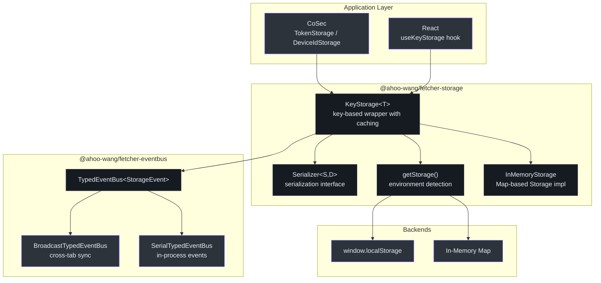
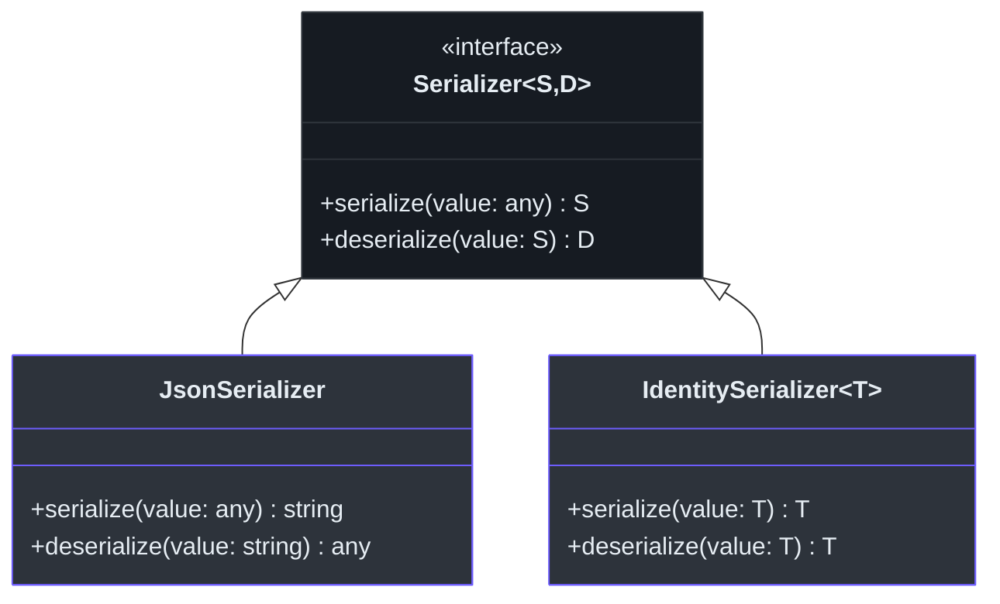
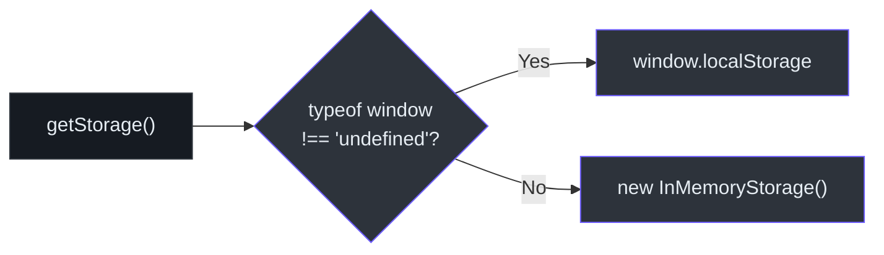

# @ahoo-wang/fetcher-storage

The `@ahoo-wang/fetcher-storage` package provides a key-based storage abstraction that wraps the browser `Storage` API with serialization, caching, change notifications via EventBus, and environment-aware backend selection. It is used by [CoSec](./cosec.md) for token and device ID persistence, and by [React](./react.md) hooks for reactive state storage.

## Installation

```bash
pnpm add @ahoo-wang/fetcher-storage
```

## Architecture



## KeyStorage

The core class that manages a single value associated with a specific storage key. Provides caching, serialization, and change notifications.

```typescript
import { KeyStorage, jsonSerializer } from '@ahoo-wang/fetcher-storage';

// Create a key storage for user preferences
const prefsStorage = new KeyStorage<UserPrefs>({
  key: 'user-preferences',
  serializer: jsonSerializer,
  defaultValue: { theme: 'light', language: 'en' },
});

// Read with caching
const prefs = prefsStorage.get();

// Write with notification
prefsStorage.set({ theme: 'dark', language: 'en' });

// Listen for changes (including cross-tab)
const removeListener = prefsStorage.addListener({
  name: 'prefs-changed',
  handle: (event) => {
    console.log('Preference changed:', event.newValue);
  },
});

// Cleanup
prefsStorage.destroy();
```

### KeyStorage API

| Method | Description |
|--------|-------------|
| `get(): T \| null` | Retrieve the cached or deserialized value. Returns `defaultValue` when storage is empty. |
| `set(value: T): void` | Serialize, store, update cache, and emit change event |
| `remove(): void` | Remove from storage, clear cache, and emit removal event |
| `addListener(handler): RemoveFn` | Register a change listener. Returns a function to unsubscribe. |
| `destroy(): void` | Cleanup the internal event handler to prevent memory leaks |

### KeyStorageOptions

| Option | Type | Default | Description |
|--------|------|---------|-------------|
| `key` | `string` | (required) | Storage key for the value |
| `serializer` | `Serializer<string, T>` | `jsonSerializer` | Serialization strategy |
| `storage` | `Storage` | `getStorage()` | Backend storage (auto-detected) |
| `eventBus` | `TypedEventBus<StorageEvent<T>>` | `SerialTypedEventBus` | Change notification bus |
| `defaultValue` | `T \| null` | `null` | Default value when key is missing |

Source: [packages/storage/src/keyStorage.ts:80-235](https://github.com/Ahoo-Wang/fetcher/blob/main/packages/storage/src/keyStorage.ts#L80-L235)

## Serializers



| Serializer | Input | Output | Use Case |
|------------|-------|--------|----------|
| `JsonSerializer` | any | `string` (JSON) | Objects, arrays, complex types. Default for `KeyStorage`. |
| `IdentitySerializer<T>` | `T` | `T` | String values that need no conversion |

Pre-built singletons:
- `jsonSerializer` -- global `JsonSerializer` instance
- `identitySerializer` -- global `IdentitySerializer<any>` instance
- `typedIdentitySerializer<T>()` -- factory for typed identity serializers

Source: [packages/storage/src/serializer.ts](https://github.com/Ahoo-Wang/fetcher/blob/main/packages/storage/src/serializer.ts)

## Environment Detection

The `getStorage()` function automatically selects the appropriate storage backend:



- **Browser environment** -- uses `window.localStorage` for persistent storage across page reloads
- **Non-browser environment** (Node.js, SSR, tests) -- falls back to `InMemoryStorage`, a `Map`-based implementation of the `Storage` interface

Source: [packages/storage/src/env.ts](https://github.com/Ahoo-Wang/fetcher/blob/main/packages/storage/src/env.ts)

## InMemoryStorage

A `Map`-backed implementation of the browser `Storage` interface for non-browser environments:

| Method | Description |
|--------|-------------|
| `getItem(key)` | Returns value from Map or `null` |
| `setItem(key, value)` | Sets value in Map |
| `removeItem(key)` | Removes from Map |
| `clear()` | Clears all entries |
| `key(index)` | Returns key at the given index |
| `length` | Returns the number of stored items |

Source: [packages/storage/src/inMemoryStorage.ts](https://github.com/Ahoo-Wang/fetcher/blob/main/packages/storage/src/inMemoryStorage.ts)

## Change Notifications

`KeyStorage` integrates with the [EventBus](./eventbus.md) package to emit change events. By default, it uses a `SerialTypedEventBus` for in-process notifications. Consumers can opt into cross-tab synchronization by providing a `BroadcastTypedEventBus`:

```typescript
import { KeyStorage } from '@ahoo-wang/fetcher-storage';
import { BroadcastTypedEventBus, SerialTypedEventBus } from '@ahoo-wang/fetcher-eventbus';

const storage = new KeyStorage<string>({
  key: 'shared-key',
  eventBus: new BroadcastTypedEventBus({
    delegate: new SerialTypedEventBus('shared-key'),
  }),
});
```

The `StorageEvent<T>` payload contains both `newValue` and `oldValue`:

```typescript
interface StorageEvent<Deserialized> {
  newValue?: Deserialized | null;
  oldValue?: Deserialized | null;
}
```

Source: [packages/storage/src/keyStorage.ts:23-26](https://github.com/Ahoo-Wang/fetcher/blob/main/packages/storage/src/keyStorage.ts#L23-L26)

## Usage by Other Packages

### CoSec TokenStorage

[CoSec](./cosec.md) extends `KeyStorage` for JWT token management with cross-tab sync:

```typescript
import { TokenStorage } from '@ahoo-wang/fetcher-cosec';

const tokenStorage = new TokenStorage({
  key: 'cosec-token',
  earlyPeriod: 300000, // 5 minutes
  eventBus: new BroadcastTypedEventBus({
    delegate: new SerialTypedEventBus('cosec-token'),
  }),
});
```

### CoSec DeviceIdStorage

Device ID persistence using identity serialization:

```typescript
import { DeviceIdStorage } from '@ahoo-wang/fetcher-cosec';

const deviceStorage = new DeviceIdStorage();
const deviceId = deviceStorage.getOrCreate();
```

### React useKeyStorage Hook

[React](./react.md) provides a reactive binding:

```tsx
import { useKeyStorage } from '@ahoo-wang/fetcher-react';
import { KeyStorage } from '@ahoo-wang/fetcher-storage';

const themeStorage = new KeyStorage<string>({ key: 'theme', defaultValue: 'light' });

function ThemeToggle() {
  const [theme, setTheme] = useKeyStorage(themeStorage);
  return <button onClick={() => setTheme(theme === 'light' ? 'dark' : 'light')}>
    Current: {theme}
  </button>;
}
```

## Key Exports

| Export | Description |
|--------|-------------|
| `KeyStorage<T>` | Core key-based storage wrapper with caching and notifications |
| `KeyStorageOptions<T>` | Configuration interface for KeyStorage |
| `StorageEvent<T>` | Event payload with `newValue` and `oldValue` |
| `StorageListenable<T>` | Interface for storage change listening |
| `RemoveStorageListener` | Function type for removing storage listeners |
| `Serializer<S, D>` | Generic serialization interface |
| `JsonSerializer` | JSON string serializer |
| `IdentitySerializer<T>` | Pass-through serializer |
| `jsonSerializer` | Global JSON serializer instance |
| `identitySerializer` | Global identity serializer instance |
| `typedIdentitySerializer<T>()` | Typed identity serializer factory |
| `InMemoryStorage` | Map-based Storage implementation |
| `getStorage()` | Environment-aware storage backend selector |
| `isBrowser()` | Browser environment detection |

## Cross-References

- **[CoSec](./cosec.md)** -- `TokenStorage` and `DeviceIdStorage` extend `KeyStorage` for auth token persistence
- **[React](./react.md)** -- `useKeyStorage` and `useImmerKeyStorage` hooks provide reactive bindings to `KeyStorage`
- **[EventBus](./eventbus.md)** -- `KeyStorage` uses `TypedEventBus` for change notifications, with optional `BroadcastTypedEventBus` for cross-tab sync
