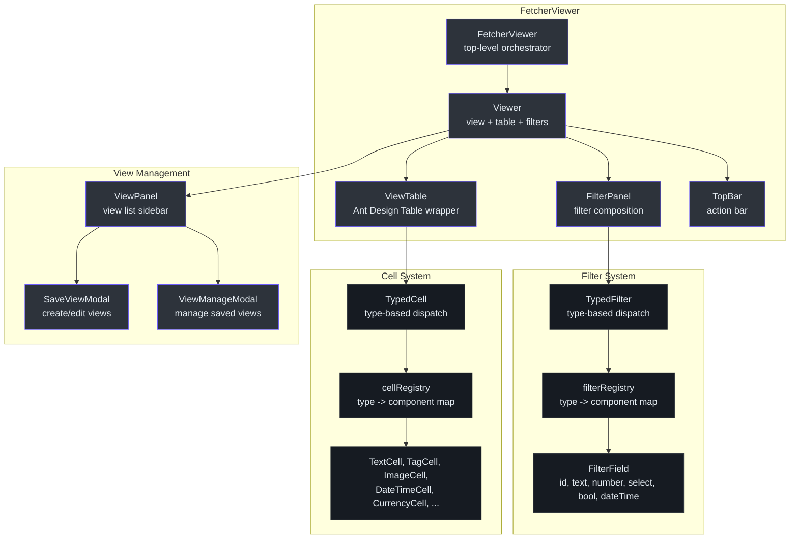
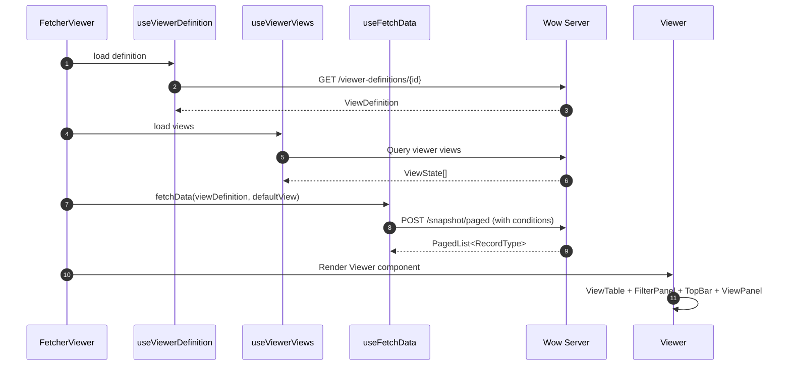
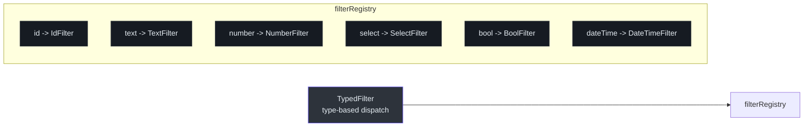
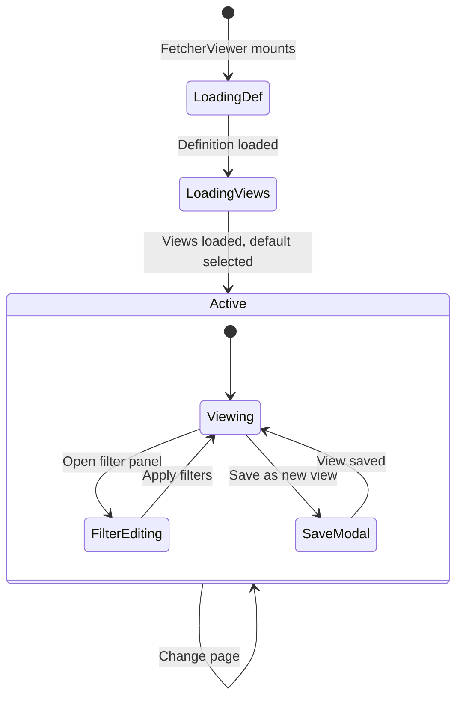

# @ahoo-wang/fetcher-viewer

The `@ahoo-wang/fetcher-viewer` package provides a React + Ant Design component library for building data viewing interfaces. It includes filter panel components with a typed registry, table components with rich cell renderers, view management with save/load capabilities, a topbar with action items, and a complete `FetcherViewer` component that ties everything together using [Wow](./wow.md) CQRS queries.

## Installation

```bash
pnpm add @ahoo-wang/fetcher-viewer
```

## Component Architecture



## FetcherViewer

The top-level component that orchestrates view definition loading, view state management, data fetching via Wow, and rendering the complete viewer UI.

```tsx
import { FetcherViewer } from '@ahoo-wang/fetcher-viewer';

function DataView() {
  return (
    <FetcherViewer
      viewerDefinitionId="order-view"
      pagination={{ pageSize: 20 }}
      enableRowSelection
      primaryAction={{
        label: 'Create Order',
        onClick: () => router.push('/orders/new'),
      }}
    />
  );
}
```

### FetcherViewerProps

| Property | Type | Default | Description |
|----------|------|---------|-------------|
| `viewerDefinitionId` | `string` | (required) | ID of the viewer definition to load |
| `ownerId` | `string` | `'(0)'` | Owner ID for data scoping |
| `tenantId` | `string` | `'(0)'` | Tenant ID for data scoping |
| `defaultViewId` | `string` | -- | Default view to activate |
| `pagination` | `false \| PaginationProps` | (required) | Pagination configuration or `false` to disable |
| `actionColumn` | `ViewTableActionColumn` | -- | Row action column configuration |
| `onClickPrimaryKey` | `(id, record) => void` | -- | Click handler for primary key cells |
| `enableRowSelection` | `boolean` | `false` | Enable checkbox row selection |
| `enhanceDataSource` | `(data) => data` | -- | Transform/enhance fetched data |
| `onSwitchView` | `(view) => void` | -- | Callback when view is switched |
| `viewTableSetting` | `ViewTableSettingCapable` | -- | Table display settings |
| `primaryAction` | action object | -- | Primary action button in topbar |
| `secondaryActions` | action array | -- | Secondary action buttons |
| `batchActions` | action array | -- | Batch actions for selected rows |

Source: [packages/viewer/src/fetcherviewer/FetcherViewer.tsx:48-71](https://github.com/Ahoo-Wang/fetcher/blob/main/packages/viewer/src/fetcherviewer/FetcherViewer.tsx#L48-L71)

### Imperative Ref API

`FetcherViewer` exposes an imperative API via `ref` for parent-driven control — refresh data, clear selection, or access the current query/view state:

```tsx
import { useRef } from 'react';
import { FetcherViewer, type FetcherViewerRef } from '@ahoo-wang/fetcher-viewer';

function DataView() {
  const viewerRef = useRef<FetcherViewerRef>(null);

  const handleRefresh = () => viewerRef.current?.refreshData();
  const handleClearSelection = () => viewerRef.current?.clearSelectedRowKeys();

  return (
    <>
      <button onClick={handleRefresh}>Refresh</button>
      <button onClick={handleClearSelection}>Clear Selection</button>
      <FetcherViewer
        ref={viewerRef}
        viewerDefinitionId="order-view"
        pagination={{ pageSize: 20 }}
      />
    </>
  );
}
```

| Method | Returns | Description |
|--------|---------|-------------|
| `refreshData()` | `void` | Re-fetch the current page data |
| `clearSelectedRowKeys()` | `void` | Clear all selected row keys |
| `getPageQuery()` | `PagedQuery \| undefined` | Get the current page query (pagination + condition) |
| `getActiveView()` | `ViewState \| undefined` | Get the currently active view state |
| `getViewerDefinition()` | `ViewDefinition \| undefined` | Get the loaded viewer definition |

Source: [packages/viewer/src/fetcherviewer/FetcherViewer.tsx:40-46](https://github.com/Ahoo-Wang/fetcher/blob/main/packages/viewer/src/fetcherviewer/FetcherViewer.tsx#L40-L46)

### FetcherViewer Data Flow



Source: [packages/viewer/src/fetcherviewer/FetcherViewer.tsx:75-377](https://github.com/Ahoo-Wang/fetcher/blob/main/packages/viewer/src/fetcherviewer/FetcherViewer.tsx#L75-L377)

## Filter System

### Typed Filter Registry

Filters are dispatched by type using a registry pattern. The `TypedFilter` component looks up the appropriate filter component from the registry:



| Filter Type | Component | Description |
|-------------|-----------|-------------|
| `id` | `IdFilter` | Aggregate ID input |
| `text` | `TextFilter` | Text input with operator selection |
| `number` | `NumberFilter` | Numeric input with range support |
| `select` | `SelectFilter` | Dropdown select with options |
| `bool` | `BoolFilter` | Boolean toggle/checkbox |
| `dateTime` | `DateTimeFilter` | Date/time picker with range |

Source: [packages/viewer/src/filter/filterRegistry.ts:73-83](https://github.com/Ahoo-Wang/fetcher/blob/main/packages/viewer/src/filter/filterRegistry.ts#L73-L83)

### FilterPanel Components

| Component | Description |
|-----------|-------------|
| `FilterPanel` | Displays a set of active filters |
| `EditableFilterPanel` | Add/remove filters dynamically |
| `AvailableFilterSelect` | Dropdown to select which filter fields to add |
| `AvailableFilterSelectModal` | Modal version of filter field selection |
| `RemovableTypedFilter` | Individual filter with a remove button |

Source: [packages/viewer/src/filter/panel/](https://github.com/Ahoo-Wang/fetcher/blob/main/packages/viewer/src/filter/panel/)

### Filter Props

Every filter component receives standard props:

```typescript
interface FilterProps {
  field: FilterField;           // { name, label, type, format }
  label?: FilterLabelProps;     // Label display configuration
  operator?: FilterOperatorProps; // Operator selection (null to hide)
  value?: FilterValueProps;     // Value input configuration
  onChange?: (value?: FilterValue) => void; // Change callback
  conditionOptions?: ConditionOptions; // Condition building options
}
```

Source: [packages/viewer/src/filter/types.ts:59-69](https://github.com/Ahoo-Wang/fetcher/blob/main/packages/viewer/src/filter/types.ts#L59-L69)

## Table Cell System

### Typed Cell Registry

Table cells are dispatched by type using the same registry pattern as filters:

| Cell Type | Component | Description |
|-----------|-----------|-------------|
| `text` | `TextCell` | Plain text display with ellipsis support |
| `tag` | `TagCell` | Single Ant Design Tag |
| `tags` | `TagsCell` | Multiple Ant Design Tags |
| `dateTime` | `DateTimeCell` | Formatted date/time display |
| `calendar` | `CalendarTimeCell` | Calendar-based time display |
| `image` | `ImageCell` | Image preview with thumbnail |
| `imageGroup` | `ImageGroupCell` | Group of image previews |
| `link` | `LinkCell` | Clickable link |
| `currency` | `CurrencyCell` | Formatted currency display |
| `avatar` | `AvatarCell` | User avatar display |
| `primaryKey` | `PrimaryKeyCell` | Clickable primary key cell |
| `action` | `ActionCell` | Single action button |
| `actions` | `ActionsCell` | Multiple action buttons |

Source: [packages/viewer/src/table/cell/cellRegistry.ts:67-82](https://github.com/Ahoo-Wang/fetcher/blob/main/packages/viewer/src/table/cell/cellRegistry.ts#L67-L82)

### CellProps Interface

All cell components receive standardized props:

```typescript
interface CellProps<ValueType, RecordType, Attributes> {
  data: {
    value: ValueType;     // The cell value to display
    record: RecordType;   // The full row record
    index: number;        // Row index
  };
  attributes?: Attributes; // Component-specific attributes
}
```

Source: [packages/viewer/src/table/cell/types.ts:100-106](https://github.com/Ahoo-Wang/fetcher/blob/main/packages/viewer/src/table/cell/types.ts#L100-L106)

### ViewTable

The `ViewTable` component wraps Ant Design's `Table` and integrates with the viewer definition to automatically generate columns from view field configurations. It supports:

- Automatic cell type dispatch via `TypedCell`
- Sortable columns
- Column visibility configuration
- Table settings panel for field ordering and visibility
- Row selection
- Action columns

Source: [packages/viewer/src/table/ViewTable.tsx](https://github.com/Ahoo-Wang/fetcher/blob/main/packages/viewer/src/table/ViewTable.tsx)

## View Management



### View States

Each view (`ViewState`) persists:
- Active filter conditions
- Sort configuration
- Column visibility and order
- View name and type (PRIVATE/SHARED)
- Default view flag

Views are managed via [Wow](./wow.md) command operations through `ViewCommandClient`:
- `createView` -- create a new view
- `editView` -- update an existing view
- `deleteAggregate` -- delete a view

Source: [packages/viewer/src/fetcherviewer/client/view/commandClient.ts](https://github.com/Ahoo-Wang/fetcher/blob/main/packages/viewer/src/fetcherviewer/client/view/commandClient.ts)

## TopBar Components

The topbar provides action items above the data table:

| Component | Description |
|-----------|-------------|
| `TopBar` | Container for bar items |
| `BarItem` | Base bar item component |
| `RefreshDataBarItem` | Manual data refresh button |
| `AutoRefreshBarItem` | Auto-refresh toggle with interval |
| `FilterBarItem` | Toggle filter panel visibility |
| `FullscreenBarItem` | Toggle fullscreen mode |
| `ColumnHeightBarItem` | Adjust table row density |
| `DataMonitorBarItem` | Data monitoring indicator |
| `ShareLinkBarItem` | Copy shareable view link |

Source: [packages/viewer/src/topbar/](https://github.com/Ahoo-Wang/fetcher/blob/main/packages/viewer/src/topbar/)

## Standalone Components

The viewer package also exports reusable UI components:

| Component | Description |
|-----------|-------------|
| `NumberRange` | Dual-number input for range filters |
| `RemoteSelect` | Select with remote data fetching |
| `TagInput` | Input for managing tag collections |
| `Fullscreen` | Fullscreen container wrapper |

Source: [packages/viewer/src/components/](https://github.com/Ahoo-Wang/fetcher/blob/main/packages/viewer/src/components/)

## Registry Pattern

Both filters and cells use a shared `TypedComponentRegistry<T, P>` pattern:

```typescript
import { TypedComponentRegistry } from '@ahoo-wang/fetcher-viewer';

// Create a custom registry
const myRegistry = TypedComponentRegistry.create<string, MyProps>([
  ['type1', MyComponent1],
  ['type2', MyComponent2],
]);

// Register additional types
myRegistry.register('type3', MyComponent3);

// Look up
const Component = myRegistry.get('type1');
```

Source: [packages/viewer/src/registry/componentRegistry.ts](https://github.com/Ahoo-Wang/fetcher/blob/main/packages/viewer/src/registry/componentRegistry.ts)

## Storybook Integration

The viewer package includes comprehensive Storybook stories for visual development and testing:

```bash
pnpm storybook
```

Stories are organized alongside their components in `stories/` directories:

- Filter components: `filter/stories/`, `filter/panel/stories/`
- Cell components: `table/cell/stories/`
- Table components: `table/stories/`, `table/setting/stories/`
- Topbar components: `topbar/stories/`
- Viewer components: `viewer/stories/`, `view/stories/`
- FetcherViewer: `fetcherviewer/stories/`
- Standalone components: `components/stories/`

## Key Exports

| Export | Module | Description |
|--------|--------|-------------|
| `FetcherViewer` | `fetcherviewer/` | Top-level viewer orchestrator |
| `Viewer` | `viewer/` | View + table + filters composition |
| `View` | `view/` | Single view container |
| `ViewTable` | `table/` | Ant Design table with typed cells |
| `TypedFilter` | `filter/` | Type-dispatched filter component |
| `filterRegistry` | `filter/` | Filter component registry |
| `TypedCell` | `table/cell/` | Type-dispatched cell component |
| `cellRegistry` | `table/cell/` | Cell component registry |
| `TopBar` | `topbar/` | Action bar container |
| `FilterPanel` | `filter/panel/` | Active filters display |
| `EditableFilterPanel` | `filter/panel/` | Dynamic filter editor |
| `ViewPanel` | `viewer/panel/` | View list sidebar |
| `SaveViewModal` | `viewer/panel/` | Save/edit view modal |
| `TypedComponentRegistry` | `registry/` | Generic typed component registry |
| `NumberRange` | `components/` | Dual-number range input |
| `RemoteSelect` | `components/` | Remote data select |
| `TagInput` | `components/` | Tag management input |

## Cross-References

- **[Wow](./wow.md)** -- `FetcherViewer` uses Wow `SnapshotQueryClient` for data fetching and `CommandClient` for view management
- **[React](./react.md)** -- Uses `useFetcher`, `useKeyStorage`, `useEventSubscription` hooks from the React package
- **[Fetcher](./fetcher.md)** -- The core HTTP client used for all API communication
- **[Storage](./storage.md)** -- `KeyStorage` used for persisting local default view ID
- **[CoSec](./cosec.md)** -- Supports multi-tenant data scoping via owner/tenant IDs
